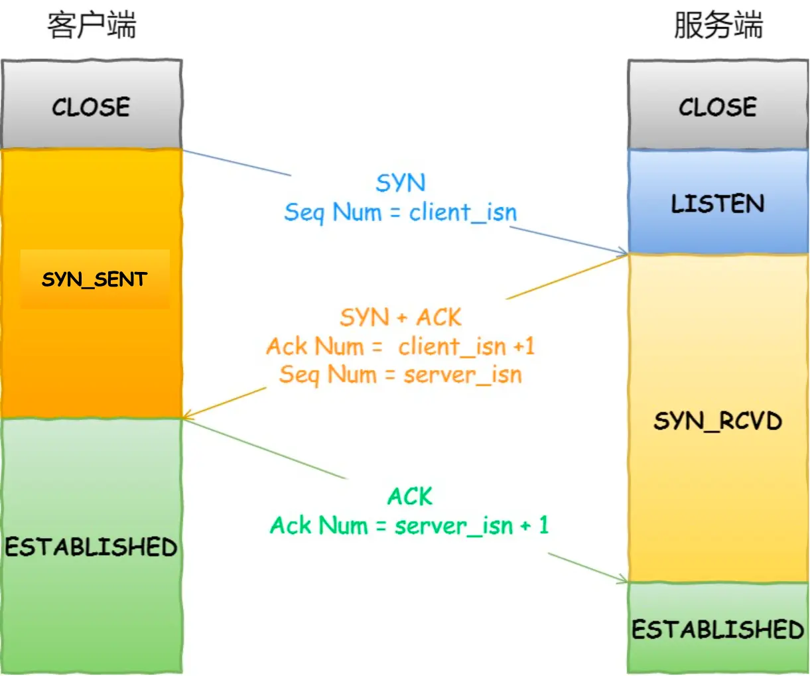
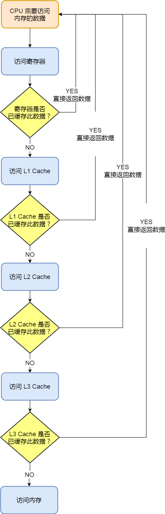
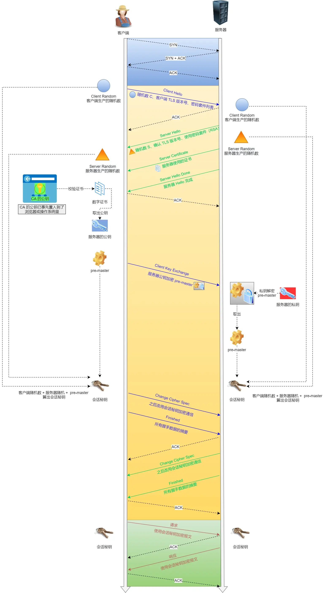
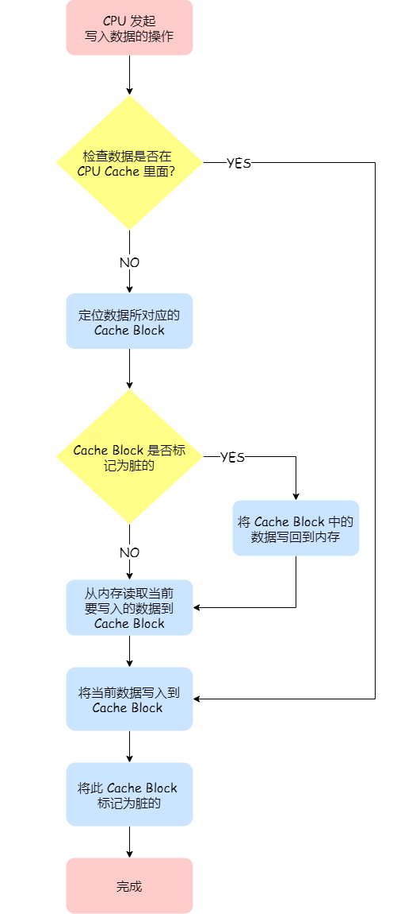
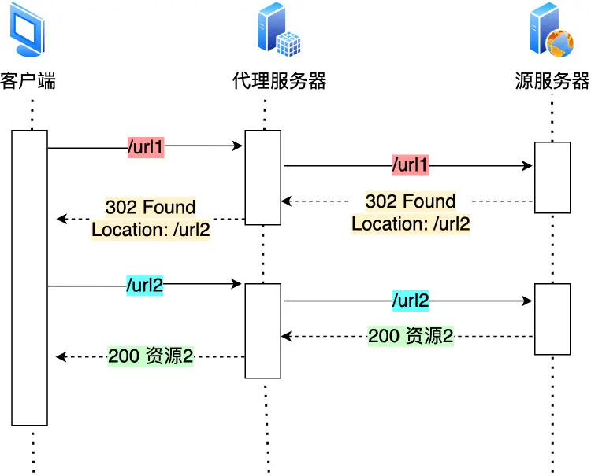

### **学习计划总原则**
1. **交替学习**：每天从两门课程各选1章，保持知识交叉关联。
2. **逻辑顺序**：按章节顺序推进，优先学习基础模块（如网络基础、硬件结构）。
3. **间隔复习**：每学完3-5章后插入复习日，后期每学完一大篇集中复习。
4. **实践与理论结合**：抓包分析、系统命令等实操章节紧跟理论。

---

### **第一阶段：基础篇与核心概念（第1-15天）**
**目标**：掌握网络模型、HTTP协议、CPU与内存管理核心知识。

| 天数 | 图解网络                              | 图解系统                 | 备注                         |
| ---- | ------------------------------------- | ------------------------ | ---------------------------- |
| 1    | 1.1 [TCP/IP网络模型](#1.1-1) | 1.1 [CPU执行程序](#1.1-2) | 从底层模型和硬件开始         |
| 2    | 1.2 [键入网址到网页显示](#1.2-1) | 1.2 [存储器金字塔](#1.2-2>) | 理解网络请求与硬件存储联动   |
| 3    | 1.3 [Linux收发网络包](#1.3-1) | 1.3 [优化CPU代码](#1.3-2) | **复习1.1-1.3（网络+系统）** |
| 4    | 2.1 [HTTP面试题](#2.1)          | 1.4 [CPU缓存一致性](#1.4) | HTTP基础与硬件性能优化       |
| 5    | 2.2 [HTTP/1.1优化](#2.2)         | 1.5 [CPU执行任务](#1.5)  | **复习1.4-1.5（系统）**      |
| 6    | 2.3 [HTTPS RSA握手](#2.3)           | 1.6 [软中断机制](#1.6)   | 加密协议与系统中断机制       |
| 7    | 2.4 [HTTPS ECDHE握手](#2.4)           | 1.7 [浮点数精度问题](#1.7) | **复习2.1-2.4（网络）**      |
| 8    | 2.5 HTTPS优化                         | 2.1 Linux vs Windows内核 | 系统架构对比                 |
| 9    | 2.6 HTTP/2优势                        | 3.1 虚拟内存原理         | HTTP演进与内存管理核心       |
| 10   | 2.7 HTTP/3                            | 4.1 进程与线程基础       | **复习3.1+4.1（系统）**      |
| 11   | 2.8 HTTP vs RPC                       | 4.2 进程间通信（IPC）    | 协议对比与多进程通信         |
| 12   | 2.9 HTTP vs WebSocket                 | 4.3 多线程同步机制       | **复习2.5-2.9（网络）**      |
| 13   | **复习1.1-2.9（网络）**               | **复习1.1-4.3（系统）**  | 第一阶段总复习               |
---

### **第二阶段：深入协议与系统机制（第16-40天）**
**目标**：掌握TCP/IP、进程调度、网络系统优化。

| 天数 | 图解网络                  | 图解系统                | 备注                     |
| ---- | ------------------------- | ----------------------- | ------------------------ |
| 14   | 3.1 TCP/IP协议栈优化      | 4.4 死锁原理与解决      | 协议优化与并发问题       |
| 15   | 3.2 TCP重传与流量控制     | 4.5 悲观锁 vs 乐观锁    | **复习4.4-4.5（系统）**  |
| 16   | 3.3 TCP抓包分析           | 5.1 进程调度算法        | 实战分析与调度策略       |
| 17   | 3.4 TCP半/全连接队列      | 5.2 页面置换算法        | **复习3.1-3.4（网络）**  |
| 18   | 3.5 优化TCP性能           | 5.3 磁盘调度算法        | 性能调优与存储管理       |
| 19   | 3.6 TCP面向字节流         | 6.1 文件系统            | **复习5.1-5.3（系统）**  |
| 20   | 3.7 TCP初始化序列号       | 7.1 键盘输入处理流程    | 协议细节与I/O机制        |
| 21   | 3.8 SYN报文丢弃场景       | 8.1 Linux收发网络包     | **复习3.5-3.8（网络）**  |
| 22   | 3.9 乱序FIN包处理         | 8.2 零拷贝              | 网络包处理与高性能优化   |
| 23   | 3.10 TIME_WAIT与SYN       | 8.3 select/poll/epoll   | **复习8.1-8.3（系统）**  |
| 24   | 3.11 TCP断电 vs 进程崩溃  | 8.4 Reactor vs Proactor | 连接异常与网络模式对比   |
| 25   | 3.12 拔网线后TCP状态      | 9.1 网络性能指标        | **复习3.9-3.12（网络）** |
| 26   | 3.13 tcp_tw_reuse关闭原因 | 9.2 日志分析PV/UV       | 端口复用与运维监控       |
| 27   | **复习3.1-3.13（网络）**  | **复习8.1-9.2（系统）** | 第二阶段总复习           |

---

### **第三阶段：高级主题与综合应用（第41-60天）**
**目标**：IP协议、系统命令、协议缺陷与可靠传输。

| 天数 | 图解网络                | 图解系统                    | 备注                     |
| ---- | ----------------------- | --------------------------- | ------------------------ |
| 28   | 4.1 IP基础知识          | 10.1 计算机网络学习法       | IP基础与学习方法         |
| 29   | 4.2 Ping工作原理        | 10.2 操作系统学习法         | **复习4.1-4.2（网络）**  |
| 30   | 4.3 断网Ping测试        | 10.3 画图经验               | 网络诊断与知识总结       |
| 31   | 3.14 TLS与TCP同时握手   | **复习4.1-7.1（系统）**     | 协议联动与系统综合复习   |
| 32   | 3.15 Keepalive区别      | **复习8.1-8.4（系统）**     | 长连接机制与网络系统复习 |
| 33   | 3.16 TCP缺陷            | **复习9.1-9.2（系统）**     | 协议不足与运维命令复习   |
| 34   | 3.17 基于UDP的可靠传输  | **复习10.1-10.3（系统）**   | 协议创新与学习心得       |
| 35   | **复习4.1-4.3（网络）** | **综合复习（系统）**        | IP篇与系统全复习         |
| 36   | 3.18 TCP/UDP端口共用    | **实战：抓包分析+性能监控** | 协议冲突与实操演练       |
| 37   | 3.19 无listen的连接     | **实战：死锁调试+页面置换** | 连接异常与系统调试       |
| 38   | 3.20 无accept的连接     | **复习所有重点章节**        | 高级连接机制与综合复习   |
| 39   | 3.21 TCP数据丢失场景    | **复习所有重点章节**        | 协议可靠性复习           |
| 40   | 3.22 四次挥手变三次     | **模拟面试题训练**          | 协议细节与面试准备       |
| 41   | 3.23 序列号与确认号变化 | **模拟面试题训练**          | 最终章学习与面试实战     |
| 42   | **复习所有网络章节**    | **复习所有系统章节**        | 总复习与查漏补缺         |

---

### **关键策略**
1. **每日学习时间**：建议2小时（1小时新知识+1小时复习）。
2. **实操章节**：如TCP抓包（3.3）、零拷贝（8.2）、日志分析（9.2）需动手实践。
3. **复习方法**：用思维导图总结核心机制（如TCP握手、进程调度算法）。

按此计划，60天内可系统掌握网络协议栈与操作系统核心机制，同时通过间隔复习巩固记忆。


### 2.28 

#### 1.1 TCP/IP网络模型 <a name="1.1-1"></a>

> TCP/IP 模型（全称 Transmission Control Protocol/Internet Protocol，即传输控制协议/互联网协议）是一种网络通信模型，用来描述计算机网络中数据的传输和通信过程。它是互联网的基础，现实中大多数网络协议都基于这个模型构建。

##### 1、为什么要有TCP/IP网络模型？

TCP/IP协议是为了解决计算机之前的通信问题。对于同一种设备上的通讯，可以有多种通信方式，但是在不同设备上的进程间通信，就需要网络通信。而设备时多样性的，要兼容多种设备，就需要协商一套通用的网络协议。

##### 2、TCP/IP协议的层级

分层就是把一个大任务拆成几个小任务，给不同的人去做。

**为什么要把 TCP/IP 分层？**

- 分工明确，降低复杂性
- 各层独立，互不干扰
- 提高灵活性和兼容性
- 方便排查问题
- 复用化和标准化

TCP/IP分成四层：网络接口层、网络层、传输层、应用层


**应用层**

最上层，用户能直接接触到的就是应用层。负责处理用户能看到的、用到的东西，比如浏览网页、发邮件、看视频。当两个不同的设备的应用需要通信的时候，应用把应用数据传给下一层，也就是传输层。

应用层只需要专注于为用户提供应用功能。应用层的关键协议如下：

- HTTP(超文本传输协议)：输入网址，HTTP负责把网站内容拉回来
- SMTP(简单右键传输协议)：发送邮件
- FTP(文件传输协议)：传文件的协议

应用层不用关心数据如何传输，它是在操作系统中的用户态，传输层及以下则工作在内核态。


**传输层**

应用层的数据包会传给传输层，传输层是为了应用层提供网络支持。


在TCP/IP模型中，传输层主要由两种协议主导：**TCP（传输控制协议）\**和\**UDP（用户数据报协议）**。

 **TCP（Transmission Control Protocol）**：数据包能可靠地传输给对方

- **特点**: 面向连接、可靠的数据传输。
- 功能
  - **建立连接**：通过三次握手确保通信双方准备就绪。
  - **数据可靠性**：提供数据包的排序、重传机制，确保数据无丢失、无重复且按序到达。
  - **流量控制**：通过滑动窗口机制调节发送速率，避免接收方过载。
  - **拥塞控制**：防止网络过载，提升传输效率。
- **应用场景**：适用于需要高可靠性的场景，如网页浏览（HTTP/HTTPS）、电子邮件（SMTP）、文件传输（FTP）。

**UDP（User Datagram Protocol）**：只负责发送数据包，不保证数据包能否抵达对方

- **特点**: 无连接、不可靠的数据传输。
- 功能
  - **简单高效**：不建立连接，直接发送数据，头部开销小。
  - **无序、无保障**：不保证数据到达，也不保证顺序，适合对实时性要求高而可靠性要求不高的场景。
- **应用场景**：常用于实时应用，如视频流（直播）、语音通话（VoIP）、在线游戏，以及DNS查询。

UDP也可以实现可靠传输，把TCP的特性在应用层上实现就可以，不过要实现一个商用的可靠UDP传输协议

>“应用层实现”指的是这些可靠性逻辑被写进了应用程序的代码，而不是依赖操作系统提供的TCP协议栈。

当传输的数据包大小超过了MSS( Maximum Segment Size)，就要把数据包分块，这样即使中途有一个分块丢失或者损坏了，只需要重新发送这个分块，而不是重新发送整个数据包。在TCP协议中，把每个分块称为一个TCP段（TCP Segment）。


当设备作为接收方时，传输层则要负责把数据包传给应用，但是一台设备上可能会有很多应用在接受或者传输数据，因此需要一个编号将应用区分开，这个编号就是端口。

>假设你的电脑（IP地址是192.168.1.1）同时在：
>
>用浏览器访问网页（服务器IP是93.184.216.34，端口80）。
>
>用聊天软件收消息（服务器IP是203.0.113.5，端口6667）。
>
>数据包到达时：
>
>一个数据包的目标是“192.168.1.1:54321”（浏览器用的临时端口），操作系统看到54321，知道是浏览器的。
>
>另一个数据包的目标是“192.168.1.1:12345”（聊天软件的端口），操作系统看到12345，知道是聊天软件的。
>
>这里，**54321**和**12345**就是端口号，它们区分了同一台设备上的不同应用。


**网络层**

传输层可能大家刚接触的时候，会认为它负责将数据从一个设备传输到另一个设备，事实上它并不负责。实际场景中的网络环节是错综复杂的，中间有各种各样的线路和分叉路口，如果一个设备的数据要传输给另一个设备，就需要在各种各样的路径和节点进行选择，而传输层的设计理念是简单、高效、专注，如果传输层还负责这一块功能就有点违背设计原则了。
也就是说，我们不希望传输层协议处理太多的事情，只需要服务好应用即可，让其作为应用间数据传输的媒介，帮助实现应用到应用的通信，而实际的传输功能就交给下一层，也就是网络层


IP协议（Internet Protocol）：IP协议会将传输层的报文作为数据部分，再加上IP包组装成IP报文，如果IP报文大小超过MTU（最大传输单元）就会再次进行切片，得到一个即将发送到网络的IP报文。


IP地址的网络号（Network ID）和主机号（Host ID）是IP地址的两个核心组成部分，用于在网络中定位设备。它们是在IP协议（特别是IPv4）中通过子网掩码划分出来的，分别表示“网络”和“主机”的标识。

**网络号（Network ID）**：标识一个设备所在的网络段。所有属于同一网络的设备共享相同的网络号。

**主机号（Host ID）**：标识网络内的具体设备。同一网络中，每个设备的主机号是唯一的。

**路由（Routing）**：指的是数据包从源主机通过网络传输到目标主机的路径选择过程。它由网络层（主要是IP协议）和路由器（Router）共同实现。简单来说，路由就像导航系统，决定数据包在复杂的网络中如何“走”才能到达目的地。路由器寻址工作中，就是要找到目标地址的子网，找到后进而把数据包转发给对应的网络内。

*所以，IP 协议的寻址作用是告诉我们去往下一个目的地该朝哪个方向走，路由则是根据「下一个目的地」选择路径。寻址更像在导航，路由更像在操作方向盘*


**网络接口层**

网络接口层（Network Interface Layer），也常称为**数据链路层和物理层的组合**，是TCP/IP模型中最底层的一层。它负责将上层（网络层）的IP数据包转化为可以在物理介质上传输的信号，并在接收端将信号还原为数据包。简单来说，网络接口层是网络通信的“硬件与软件交界处”，处理设备与设备之间直接的数据传输。


IP 头部中的接收方IP 地址表示网络包的目的地，通过这个地址我们就可以判断要将包发到哪里，但在以太网的世界中，这个思路是行不通的。
什么是以太网呢？电脑上的以太网接口，Wi-Fi接口，以太网交换机、路由器上的千兆，万兆以太网口，还有网线，它们都是以太网的组成部分。以太网就是一种在「局域网」内，把附近的设备连接起来，使它们之间可以进行通讯的技术。
以太网在判断网络包目的地时和IP的方式不同，因此必须采用相匹配的方式才能在以太网中将包发往目的地，而 MAC 头部就是干这个用的，所以，在以太网进行通讯要用到MAC地址。
MAC头部是以太网使用的头部，它包含了接收方和发送方的MAC地址等信息，我们可以通过ARP协议获取对方的 MAC 地址。


**总结**


网络接口层的传输单位是帧(frame)，IP 层的传输单位是包(packet)，TCP 层的传输单位是段(segment)，HTTP的传输单位则是消息或报文(message)。但这些名词并没有什么本质的区分，可以统称为数据包。


#### 1.1 CPU执行程序<a name="1.1-2"></a>

##### **1.图灵机**


组成：一条纸袋，一个读写头，读写头上的一些部件（比如存储单元、控制单元以及运算单元）

模拟数学运算$1+2$

（1）用读写通用把1、2、+这三个字符分别写入纸袋的三个格子，然后读写头先停在“1”对应的格子上；

（2）1读入到存储设备，这个存储设备称为图灵机的状态；

（3）读写头向右移动，用同样的方式把“2”读入到图灵机的状态；

（4）再向右移动，碰到"+"，将“+”号传输给控制单元，控制单元会发现是一个”+”而不是数字，所以没有像数字存入到状态中，而是作为运算单元，把“1”和“2”读入并且计算，再将计算的结果3存放到状态中；

（5）运算单元把结果返回给控制单元，控制单元将结果传输给读写头，读写头向右移动，把3写入纸袋的格子里面；

##### **2.冯诺依曼模型**

组成部分：中央处理器（CPU）、内存、输入设备、输出设备、总线。


（1）内存

程序和数据都是存储在内存，存储的区域是线性的。

内存的地址是从0开始编号的，然后自增排列，最好一个地址为内存总字节数-1，这种结构类似数组这种数据结构。由于是线性排列的，所以内存读写任何一个数据的速度都是一样的。

（2）CPU（中央处理器）

CPU的位宽：

- 32位：一次可以计算32b，4个字节，一次最大可以计算2³² - 1 = 4,294,967,295（无符号整数）
- 64位：一次可以计算64b，8个字节，一次最大可以计算2⁶⁴ - 1 = 18,446,744,073,709,551,615（无符号整数）

CPU内部还有组件，常见的如

- 寄存器：存储计算时的数据

> 相比于内存而言，寄存器的计算速度更快，因为内存离CPU太远了，而寄存器就在CPU内，还紧挨着控制单元和逻辑运算单元。

通用寄存器：用来存放需要计算的数据，比如两个加数

程序计数器：存储CPU要执行的下一条指令

指令寄存器：存放指令

- 控制单元：负责控制CPU工作
- 逻辑运算单元等：负责运算

（3）总线

- 地址总线：用于指定CPU将要操作的内存地址
- 数据总线：用于读写内存的数据
- 控制总线：用于发送和接受信号，当CPU收到信号后也需要控制总线

CPU需要读写内存数据的时候，需要两个总线：首先通过地址总线来指定内存的地址；再通过数据总线来传输数据

（4）输入、输出设备

输入设备向计算机输入数据，计算机通过计算后，把数据输出给输出设备。

##### **3.线路位宽与CPU位宽**

**线路位宽**

线路位宽通常指的是计算机硬件中数据传输通道的宽度，也就是一次可以传输的数据位数（bit）。比如内存总线、数据总线或地址总线的位宽。线路位宽直接影响数据传输的效率：

**CPU位宽**

CPU位宽一般指的是CPU的**寄存器宽度**或**数据处理能力**，也就是CPU一次能够处理的数据位数。常见的CPU位宽有8位、16位、32位和64位。它决定了：

假设一台电脑
- 64位CPU：说明它能处理64位数据，寻址能力达到2⁶⁴。
- 64位数据总线：CPU与内存之间一次传输64位数据。
这时，CPU和线路位宽匹配，性能最佳。如果总线只有32位，CPU需要两次传输才能拿到64位数据，效率会下降。

##### **4.程序执行的基本过程**


一个程序执行的时候，CPU会根据程序计数器里的内存地址，从内存里面把需要执行的指令读取到指令寄存器里面实行，然后分局指令长度自增，开始顺序读取下一条指令。

CPU的指令周期：CPU从程序计数器读取指令、到执行、再到下一条指令，这个过程会不断循环，直到程序执行结束的过程。


##### **5.a=1 + 2执行具体过程**

编译器会把a=1 + 2翻译成四条指令，存放到正文段中。


编译完成之后，具体执行程序的时候，程序计数器会被设置为0x200地址，然后依次执行这四条指令


##### **6.指令**

不同的CPU有不同的指令集，也就是对应着不同的汇编语言和不同的机器码。

下面介绍MIPS指令集：

MIPS指令是一个32位的整数，高6位代表着操作码，剩下26位不同指令类型所表示的内容也就不相同


R型指令：操作数全部来自寄存器，计算结果也存储到寄存器中。

I型指令：一个操作数来自寄存器，另一个是立即数（直接嵌入指令中的常量），结果存储到寄存器中。

J型指令：用于无条件跳转，跳转目标地址通过立即数计算得出，通常不涉及寄存器操作数的计算。


指令周期：

1.CPU通过程序计数器读取对应内存地址的指令，这个部分称为Fetch（取得指令）；
2.CPU对指令进行解码，这个部分称为Decode（指令译码）；
3.CPU执行指令，这个部分称为Execution（执行指令）；
4.CPU将计算结果存回寄存器或者将寄存器的值存入内存，这个部分称为Store（数据回写）；


Fetch：指令是存放再存储器里的，实际上，通过程序计数器和指令寄存器取出指令的过程，是由控制器操作的。

Decode：控制器

Execution：算数逻辑单元（运算器）。但是如果是一个简单的无条件地址跳转，则是直接在控制器里面完成的，不需要用到运算器。


**指令的类型**

- 数据传输类型：比如store/load是寄存器与内存间数据传输的指令，mov是将一个内存地址的数据移动到另一个内存地址的指令；
- 运算类型：比如加减乘除、位运算、比较大小等等，它们最多只能处理两个寄存器中的数据
- 跳转类型：通过修改程序计数器的值来达到跳转执行指令的过程
- 信号类型：发生中断的指令trap
- 闲置类型：比如指令nop

**指令的执行速度**
$$
程序的CPU执行时间=CPU时钟周期数 \times 时钟周期时间
$$
时钟周期时间就是CPU主频，主频越高就说明CPU的工作速度就越快，比如2.4GHz

对于时钟周期数，可以分为指令数 x 每条指令的平均时钟周期数（Cycles Per Instruction, 简称CPI）

于是
$$
程序的CPU执行时间=指令数\times CPI \times时钟周期时间
$$
指令数，就是执行程序所需要多少条指令，以及哪些指令。这个的层面在于编译器来优化，因为同样的代码，在不同的编译器，编译出来的计算机指令会有各种不同的表示方式。

CPI，表示一条指令需要多少个时钟周期数

时钟周期时间，表示计算机主频，取决于计算机硬件。

**总结：**

1、64位相比32位CPU的优势在哪里？64位CPU的计算性能一定比32位CPU高很多吗？

- 更大的寻址能力：32位CPU的地址空间是2³²字节（约4GB），也就是说它最多只能直接寻址4GB的内存。64位CPU的地址空间是2⁶⁴字节（约18亿GB），理论上支持几乎无限大的内存。

- 更宽的寄存器：64位CPU的寄存器是64位宽，可以一次处理64位的数据，而32位CPU只能处理32位。

不一定，计算性能的提升并非单纯由位宽决定，还取决于以下因素：主频、架构设计

2、软件的32位和64位之间的区别？32位的操作系统可以运行在64位的电脑上吗？64位的操作系统可以运行在32位的电脑上吗？如果不行，原因是什么？

32位：寄存器、数据总线、地址总线为32位，内存寻址上限4GB。

64位：寄存器、数据总线、地址总线为64位，内存寻址上限理论上2⁶⁴字节。

32位指令在64位机器上执行，需要一套兼容机制，就可以做到兼容运行了。但是如果64位指令在32位机器上执行，就比较苦难了，因为32位的寄存器存不下64位的指令。

硬件的64位和32位值得四CPU的位宽，软件的64位和32位指的是指令的位宽。


### 3.2

#### 1.2 键入网址到网页显示<a name="1.2-1"></a>

**第一步：对URL进行解析，从而生成发送给Web服务器的请求信息**

（a）URL元素组成：

"http:" + "//" + "Web服务器" + "/" + "目录名" + "/" + .... + "文件名"

"http:" : URL开头表示访问数据的协议

“//”：后面的字符串表示服务器的名称

（b）URL示例解析

http://www.server.com/dir1/file1.html

浏览器协议:http://

域名部分：www.server.com

数据源的路径名：/dir1/file1.html

（c）Web服务器文件路径

/...:Web服务器的根目录，这个根不是linux操作系统层面的根/，是web服务器配置文件中指定的根/，它可以是操作系统类似某个实际的某个路径

file1.html：是dir1目录下的file1.html文件

> 要是/dir1/file1.html部分省略了，那应该访问哪个文件？
>
> 当没有路径名的时候，就代表访问根目录下事先设置的默认文件，也就是/index.html，或者/default.html

**第二步：生成HTTP请求信息**

浏览器确定了Web服务器和文件名，接下来就是来根据这些信息来生产HTTP请求

在对 URL 进行解析并确定要发送给 Web 服务器的请求信息后，生成 HTTP 请求信息的过程是一个系统化的步骤。

**（a）URL 解析**

首先，浏览器或客户端需要解析输入的 URL，提取关键信息。这些信息将用于构建 HTTP 请求。假设 URL 是 `https://www.example.com/blog/article1?param1=value1#section1`：

- **协议**: `https://`（表示使用加密的 HTTP，通常通过端口 443）。
- **域名**: `www.example.com`（通过 DNS 解析为 IP 地址，如 `93.184.216.34`）。
- **路径**: `/blog/article1`（请求的资源位置）。
- **查询参数**: `?param1=value1`（可选，用于传递额外数据）。
- **片段（Fragment）**: `#section1`（仅用于客户端导航，不发送给服务器）。

解析后，浏览器确定：
- 需要连接到 `www.example.com` 的服务器。
- 请求路径是 `/blog/article1`，可能带查询参数 `param1=value1`。
- 使用 HTTPS 协议，因此需要 TLS 加密。

**（b） 确定请求方法**

根据用户操作，浏览器选择合适的 HTTP 方法：
- 如果只是打开网页，通常使用 `GET` 方法（获取资源）。
- 如果是提交表单，可能使用 `POST` 方法（发送数据）。

对于 `https://www.example.com/blog/article1?param1=value1`，默认使用 `GET` 方法，因为这是一个简单的资源获取请求。

**（c）构建 HTTP 请求的各个部分**

生成 HTTP 请求信息包括以下几个主要部分：

(1) 请求行（Request Line）

请求行是 HTTP 请求的第一行，格式为：
```
<方法> <路径+查询参数> <HTTP版本>
```
- **方法**: `GET`（对于这个例子）。
- **路径+查询参数**: `/blog/article1?param1=value1`（路径是 `/blog/article1`，查询参数附加在后面）。
- **HTTP 版本**: `HTTP/1.1`（现代浏览器通常支持 HTTP/1.1 或 HTTP/2，但默认格式还是 HTTP/1.1）。

因此，请求行可能是：
```
GET /blog/article1?param1=value1 HTTP/1.1
```

(2) 请求头（Request Headers）

请求头提供附加信息，帮助服务器理解和处理请求。浏览器会自动生成常见的头字段，例如：

- **Host**: 指定目标域名，必须字段。
  ```
  Host: www.example.com
  ```
- **User-Agent**: 标识客户端的浏览器或设备。
  ```
  User-Agent: Mozilla/5.0 (Windows NT 10.0; Win64; x64) AppleWebKit/537.36 (KHTML, like Gecko) Chrome/123.0.0.0 Safari/537.36
  ```
- **Accept**: 客户端接受的内容类型。
  ```
  Accept: text/html,application/xhtml+xml,application/xml;q=0.9,image/webp,*/*;q=0.8
  ```
- **Accept-Language**: 语言偏好。
  ```
  Accept-Language: zh-CN,zh;q=0.9,en;q=0.8
  ```
- **Connection**: 连接管理（通常为 `keep-alive`）。
  ```
  Connection: keep-alive
  ```

其他可能头字段包括：
- `Referer`: 上一个访问的页面 URL（如果有）。
- `Cookie`: 客户端的会话信息（如果之前有登录或设置）。

所有头字段以 `字段名: 字段值` 格式书写，每行以 `\r\n` 结尾。头字段结束后，添加一个空行（`\r\n`），表示头部分结束。

(3) 请求主体（Request Body）（可选）

对于 `GET` 请求，通常没有请求体，因为数据通过查询参数（如 `?param1=value1`）传递。如果是 `POST` 请求，则可能包含主体数据，例如表单数据或 JSON。

对于这个例子（`GET` 请求），请求体为空。

**（d） 组装完整的 HTTP 请求**

将上述部分组合，形成完整的 HTTP 请求。例如：

```
GET /blog/article1?param1=value1 HTTP/1.1
Host: www.example.com
User-Agent: Mozilla/5.0 (Windows NT 10.0; Win64; x64) AppleWebKit/537.36 (KHTML, like Gecko) Chrome/123.0.0.0 Safari/537.36
Accept: text/html,application/xhtml+xml,application/xml;q=0.9,image/webp,*/*;q=0.8
Accept-Language: zh-CN,zh;q=0.9,en;q=0.8
Connection: keep-alive

```

- 每行以 `\r\n` 分隔。
- 头字段后有一个空行（`\r\n`），表示请求结束（如果没有主体）。

**（e）HTTPS 的特殊处理**

因为 URL 使用 `https://`，浏览器需要在发送 HTTP 请求之前执行以下步骤：
- TLS 握手:
  - 浏览器与服务器协商加密算法和密钥。
  - 验证服务器证书（确保是 `www.example.com` 的合法证书）。
- 加密请求:
  - 将生成的 HTTP 请求通过 TLS 层加密后发送到服务器（端口 443）。

**（f）发送请求**

- 浏览器通过已建立的 TCP 连接将加密后的 HTTP 请求发送到服务器的 IP 地址（`93.184.216.34`）。
- 服务器接收请求后，解析并返回响应（如 HTML 内容）。

**第三步：真实地址查询——DNS**

通过浏览器解析URL并且生成HTTP消息之后，需要操作系统把消息发送给Web服务器，但是在发送之前，还需要查询服务器域名对应的IP地址。因为发送消息时，必须提供对象的IP地址。

> 在发送消息之前，必须将域名 www.example.com 转换为对应的 IP 地址。这个过程称为**域名解析**（Domain Name Resolution）。

所以有一种服务器专门保存了Web服务器域名和IP的对应关系，它就是DNS服务器

**域名的层级关系**

DNS中的域名都是用句点来分隔的，比如www.server.com，这里的句点代表了不同层次之间的界限。越靠右的位置代表其层级越高。

实际上域名还有最后一个点，比如www.server.com.，这个最后一个点代表根域名。

所以该域名的层级关系类似一个树状结构：

- 根DNS服务器（.）
- 顶级域DNS服务器（.com）
- 权威DNS服务器（server.com）


客户端只要能够找到任意一台DNS服务器，就可以通过它找到根域DNS服务器，然后再一路顺藤摸瓜找到位于下层的某台目标DNS服务器。

**域名解析的流程**

**(a) 本地缓存检查**

- **步骤**:
  - 首先，客户端（通常是用户的设备，如电脑或手机）会检查本地的 DNS 缓存。
  - 本地缓存可能存储在操作系统的 DNS 解析库（如 Windows 的 `nscd` 或 macOS 的 `mDNSResponder`）或浏览器的缓存中。
  - 如果之前访问过 `www.example.com`，其对应的 IP 地址可能已经缓存（通常有生存时间 TTL，Time to Live，限制缓存有效期）。
- **如果命中缓存**:
  - 直接返回缓存中的 IP 地址（例如 `93.184.216.34`），解析结束。
  - 节省时间（通常几毫秒），避免网络查询。
- **如果未命中**:
  - 继续向外部 DNS 服务器发起查询。

**(b) 查询本地 DNS 服务器**

- **步骤**:
  - 操作系统通过网络协议（通常是 UDP 协议，端口 53）联系配置的本地域名服务器（Local DNS Server）。
  - 本地 DNS 服务器通常由你的互联网服务提供商（ISP）提供，也可能是企业或公共 DNS（如 Google 的 `8.8.8.8` 或 Cloudflare 的 `1.1.1.1`）。
- **本地 DNS 服务器的处理**:
  - 本地 DNS 服务器检查自己的缓存。如果缓存中有 `www.example.com` 的记录，直接返回 IP 地址。
  - 如果缓存中没有，进入递归查询或迭代查询过程。

**(c) 递归查询或迭代查询**

DNS 服务器通过层次化的查询系统解析域名，通常涉及以下层次的 DNS 服务器：

- **根域名服务器（Root Name Servers）**:
  - 全球共有 13 组根域名服务器（用字母 A 到 M 表示，如 `a.root-servers.net`）。
  - 本地 DNS 服务器发送查询给根域名服务器，询问 `www.example.com` 的信息。
  - 根服务器不存储具体域名的 IP，但知道顶级域名（TLD，如 `.com`）的权威服务器地址。
  - 根服务器返回 `.com` 的权威 DNS 服务器地址。

- **顶级域名服务器（TLD Name Servers）**:
  - 本地 DNS 服务器接着联系 `.com` 的权威服务器（例如 Verisign 管理 `.com` 的 TLD 服务器）。
  - TLD 服务器知道 `example.com` 的权威 DNS 服务器地址。
  - 返回 `example.com` 的权威服务器地址。

- **权威域名服务器（Authoritative Name Servers）**:
  - 本地 DNS 服务器联系 `example.com` 的权威服务器（由域名注册商或网站所有者配置）。
  - 权威服务器存储 `www.example.com` 的具体 IP 地址（例如 `93.184.216.34`）。
  - 返回 `www.example.com` 的 IP 地址。

- **查询类型**:
  - **递归查询**: 本地 DNS 服务器负责完成整个查询过程（从根到权威服务器），并返回最终结果给客户端。
  - **迭代查询**: 本地 DNS 服务器只向根服务器查询，然后根服务器返回 TLD 服务器地址，TLD 服务器返回权威服务器地址，依次迭代，直到获取 IP 地址。现代 DNS 通常使用递归查询以简化客户端操作。

**(d) 返回 IP 地址**

- 本地 DNS 服务器收到 `www.example.com` 的 IP 地址（如 `93.184.216.34`）后：
  - 将结果返回给客户端（浏览器或操作系统）。
  - 同时，本地 DNS 服务器会缓存这个结果（根据 TTL 决定缓存时间，通常几小时到几天）。

**(e) 客户端使用 IP 地址**

- 客户端（操作系统或浏览器）接收到 IP 地址后，结合之前解析的 URL（路径、参数等）：
  - 建立与目标服务器的 TCP 连接（端口通常为 80 或 443）。
  - 发送之前生成的 HTTP 请求（如 `GET /blog/article1 HTTP/1.1`）。

>示例：解析 `www.example.com`

>假设你在浏览器输入 `www.example.com`，解析流程可能如下：
>1. 本地缓存无记录，操作系统联系本地 DNS 服务器（例如 `8.8.8.8`）。
>
>2. 本地 DNS 服务器查询根服务器（`a.root-servers.net`），获知 `.com` 的 TLD 服务器地址。
>
>3. 联系 `.com` 的 TLD 服务器，获知 `example.com` 的权威服务器地址。
>
>4. 联系 `example.com` 的权威服务器，获取 `www.example.com` 的 IP 地址（例如 `93.184.216.34`）。
>
>5. 本地 DNS 服务器返回 IP 地址给操作系统，浏览器使用该 IP 建立连接并发送 HTTP 请求。
>
>   整个过程通常在几毫秒到几百毫秒内完成，具体取决于网络延迟和缓存情况。


**第四步：TCP的可靠传输**

**TCP包头格式（TCP Header）**


端口号和目标端口号（Source port, Destination port）：源端口号是发送方（客户端或服务器）使用的端口号，用于标识发起通信的应用程序或进程。目的端口号是接收方（服务器或客户端）使用的端口号，用于标识目标应用程序或服务。

序号：序列号表示发送的 TCP 数据段中第一个字节的序列号，用于标识数据的顺序。

确认序列：确认号表示接收方期望接收的下一个数据段的第一个字节的序列号。

状态位： 状态位（也叫标志位）是 TCP 包头中的 6 个控制位，用于管理连接状态和行为。包括：

- URG（Urgent Pointer 有效）: 紧急指针有效（通常未使用）。
- ACK（Acknowledgment 有效）: 确认号有效（大多数数据包设置此位）。
- PSH（Push 函数）: 提示接收方立即将数据传递给应用程序（减少缓冲）。
- RST（Reset）: 重置连接（用于异常情况）。
- SYN（Synchronize）: 建立连接（用于三次握手的第一个和第二个包）。
- FIN（Finish）: 关闭连接（用于四次挥手）。

窗口大小：窗口大小表示发送方当前允许接收方的最大接收窗口大小（以字节为单位）。

校验和： 校验和是 TCP 包头的错误检测值，覆盖包头、数据和伪首部（包含源 IP、目标 IP、协议类型等）。

紧急指针：紧急指针在 URG 标志置位时有效，指示紧急数据的结束位置。

选项： 选项字段是可变的，用于扩展 TCP 功能，长度必须是 4 字节的整数倍（通过填充补齐）。

数据：数据是 TCP 包头的后续部分，包含实际传输的应用层数据（如 HTTP 请求或响应）。

**TCP传输数据之前，要先三次握手建立连接**

三次握手（Three-Way Handshake）是 TCP（传输控制协议）在传输数据之前，用于建立可靠连接的初始化过程。通过三次交互，发送方和接收方协商初始序列号（ISN）、确认连接状态，并确保双方都能正常通信。这是 TCP 提供可靠、面向连接传输的基础。

以下是 TCP 三次握手的详细过程（以客户端访问服务器为例，如浏览器访问 www.example.com）：

(a) **第一次握手（SYN）**

- 步骤:
  - 客户端（发送方）向服务器（接收方）发送一个 TCP 数据段，设置以下内容：
    - **标志位**: SYN（Synchronize）= 1，表示请求建立连接。
    - **序列号（Sequence Number，ISN）**: 客户端随机生成一个初始序列号（例如 1000），用于后续数据的标识。
    - 其他字段（如源端口、目的端口）也已设置（例如源端口 49152，目的端口 443）。
  - 数据段不包含实际数据。
- 作用:
  - 客户端通知服务器：“我希望建立连接，我的初始序列号是 1000，你能接收吗？”
- 服务器响应:
  - 服务器接收到 SYN 包后，如果愿意建立连接（端口可用），进入“同步接收（SYN-RECEIVED）”状态。

(b) **第二次握手（SYN+ACK）**

- 步骤:
  - 服务器回应客户端一个 TCP 数据段，设置以下内容：
    - **标志位**: SYN=1（表示同意建立连接），ACK=1（确认客户端的 SYN）。
    - **序列号（Sequence Number）**: 服务器生成自己的初始序列号（例如 2000）。
    - **确认号（Acknowledgment Number）**: 服务器将确认号设为客户端的序列号+1（例如 1001），确认已接收客户端的 SYN。
  - 数据段不包含实际数据。
- 作用:
  - 服务器通知客户端：“我收到你的请求，同意建立连接，我的初始序列号是 2000，你能接收吗？我确认你的序列号是 1000。”
- 客户端响应:
  - 客户端接收到 SYN+ACK 包后，进入“已建立（ESTABLISHED）”状态。

(c) **第三次握手（ACK）**

- 步骤:
  - 客户端回应服务器一个 TCP 数据段，设置以下内容：
    - **标志位**: ACK=1（确认服务器的 SYN）。
    - **序列号（Sequence Number）**: 客户端的序列号为之前 SYN 的确认号（1001）。
    - **确认号（Acknowledgment Number）**: 客户端将确认号设为服务器的序列号+1（例如 2001），确认已接收服务器的 SYN。
  - 数据段不包含实际数据。
- 作用:
  - 客户端通知服务器：“我收到你的响应，连接已建立，可以开始传输数据。”
- 服务器响应:
  - 服务器接收到 ACK 包后，也进入“已建立（ESTABLISHED）”状态。连接正式建立，双方可以开始数据传输。



**TCP报文生成**

TCP协议里面有两个端口，一个是浏览器监听的端口，一个是Web服务器监听的端口。

在双方建立了连接后，TCP报文中的数据部分就是存放再HTTP头部+数据，组装成TCP报文之后，就需要交给下面的网络层处理


**第五步：远程定位——IP**

TCP模块再执行连接、收发、断开等各种阶段操作时，都需要委托IP模块将数据封装成网络包发送给通信对象。

**IP包头格式**

IP报文头部的格式：


在IP协议里面需要有源地址IP和目标地址IP

- 源地址，就是客户端输出的IP地址
- 目标地址，就是通过DNS域名解析得到的Web服务器IP

> 假设客户端有多个网卡，就会有多个IP地址，那头部的源地址应该选择哪个IP呢？
>
> 相当于在多块网卡中判断应该使用哪个一块网卡来发送包，这个时候就要根据路由表规则，来判断哪一个网卡作为源地址IP

**IP报文生成**

网络包的报文如下图：


**第六步：两点传输——MAC**

生成了IP头部之后，接下来网络包还需要在IP头部的前面加上MAC头部

**MAC包头格式**


在MAC包头里需要发送方MAC地址和接收方目标MAC地址，用于两点之间的传输

一般在TCP/IP通信里，MAC包头的协议类型只使用：

- 0800：IP协议
- 0806：ARP协议

以下是 MAC 层在整个过程中扮演的角色，从键入 URL 到数据在本地网络传输的步骤：

**(a) 准备阶段：生成 Ethernet 帧**

- **输入**: 从网络层接收 IP 数据包（包含 IP 包头 + TCP 报文 + HTTP 数据）。
- 操作:
  - MAC 层为 IP 数据包添加 MAC 包头和尾部，形成 Ethernet 帧。
  - MAC 包头的组成（以 Ethernet II 帧为例）：
    - **目标 MAC 地址（6 字节）**: 标识本地网络中的目标设备（如路由器的 MAC 地址，或目标服务器的 MAC 地址）。
    - **源 MAC 地址（6 字节）**: 标识发送设备的 MAC 地址（如客户端网卡的 MAC 地址）。
    - **类型/以太网类型（2 字节）**: 指定上层协议（如 0x0800 表示 IPv4）。
  - **帧尾（FCS，4 字节）**: 添加帧校验序列（通过 CRC-32 计算），用于错误检测。
- 示例:
  - 假设客户端 IP 为 192.168.1.1，MAC 地址为 00:1A:2B:3C:4D:5E；路由器 IP 为 192.168.1.1，MAC 地址为 00:50:56:C0:00:01。
  - MAC 层生成 Ethernet 帧，目标 MAC 地址为 00:50:56:C0:00:01，源 MAC 地址为 00:1A:2B:3C:4D:5E，类型为 0x0800。

**(b) 地址解析（ARP 协议）**

- 操作:
  - 如果发送方不知道目标设备的 MAC 地址（例如目标是路由器或服务器），MAC 层通过 ARP（地址解析协议）查询。
  - 发送方广播 ARP 请求（如 “谁拥有 IP 地址 192.168.1.1？”），目标设备（路由器）回复其 MAC 地址（如 00:50:56:C0:00:01）。
  - ARP 缓存本地存储结果，加速后续通信。
- 作用:
  - 确保数据帧的目标 MAC 地址正确，避免发送到错误设备。
- 示例:
  - 客户端通过 ARP 发现路由器的 MAC 地址 00:50:56:C0:00:01，用于填充目标 MAC 地址。

**(c) 冲突检测与介质访问（CSMA/CD）**

- 操作

   (适用于半双工 Ethernet)：

  - 在共享介质（如老式集线器）中，MAC 层使用 CSMA/CD（载波侦听多路访问/冲突检测）协议：
    - 侦听网络介质（电缆），如果空闲，发送数据帧。
    - 如果检测到冲突（多个设备同时发送），停止发送，等待随机时间后重试。
  - 在现代全双工 Ethernet（使用交换机）中，无需 CSMA/CD，交换机直接管理流量。

- 作用:

  - 防止数据帧在共享介质中冲突，确保成功传输。

- 示例:

  - 客户端检查网络空闲后，发送 Ethernet 帧；如果另一设备同时发送，双方暂停，等待后重试。

**(d) 发送 Ethernet 帧**

- 操作:
  - MAC 层通过网络接口控制器（NIC）将 Ethernet 帧发送到物理层。
  - 物理层将帧转换为电信号（通过电缆）或无线信号（通过 Wi-Fi），传输到下一跳设备（如路由器）。
- 作用:
  - 完成从数据链路层到物理层的转换，使数据进入网络。
- 示例:
  - Ethernet 帧通过 RJ45 电缆或 Wi-Fi 信号发送到路由器。

**(e) 接收方的处理**

- 操作 (在接收设备，如路由器或目标服务器)：
  - 接收方（NIC）检查目标 MAC 地址：
    - 如果匹配本设备的 MAC 地址（或广播地址），接受数据帧。
    - 如果不匹配，丢弃数据帧。
  - 验证 FCS（重新计算 CRC-32，与发送方对比）：
    - 如果一致，确认数据完整，传递给网络层（IP 层）。
    - 如果不一致，丢弃数据帧。
- 作用:
  - 确保数据帧送达正确设备，并验证完整性。
- 示例:
  - 路由器接收到目标 MAC 地址为 00:50:56:C0:00:01 的帧，匹配本机地址，验证 FCS 后将 IP 数据包交给 IP 层。

至此，网络包的报文如下图：


**第七步：出口——网卡（Network Interface Card，NIC）**

网络包只是一串二进制数字信息，没办法真正发送给对方，因此，需要把数字信号转换为电信号，才能在网线上传输。

负责执行的这一操作的是网卡，要控制网卡还需要靠网卡驱动程序。

网卡驱动获取网络包之后，会将其复制到网卡内的缓存区中，接着会在其开头加上报头和起始帧分界符，在末尾加上用于检测错误的帧校验序列。


最后网卡会将包转换位电信号，通过网线发送出去。

**第八步：送别者——交换机**

交换机的设计是将网络包原样转发到目的地，交换机工作在MAC层，也称为二层网络设备。

电信号到达网线接口，交换机里的模块进行接受，接下来交换机里的模块将电信号转换为数字信号。然后通过包末尾的FCS校验错误，如果没问题则放到缓冲去。这部分操作基本和计算机网卡相同，但交换机的工作方式和网卡不同。

计算机的网卡本身具有MAC地址，并通过核对收到的包的接收方MAC地址判断是不是发给自己的，如果不是发给自己的则丢弃；相对地，交换机的端口不核对接收方MAC地址，而是直接接收所有的包并存放到缓冲区中。因此，和网卡不同，交换机的端口不具有MAC地址。

交换机根据MAC地址表查找MAC地址，然后将信号发送到相应的端口

> 当MAC地址表找不到指定的MAC地址会怎么样？
>
> 地址表中找不到指定的MAC地址。这可能是因为具有该地址的设备还没有向交换机发送过包，或者这个设备一段时间没有工作导致地址被从地址表中删除了。
> 这种情况下，交换机无法判断应该把包转发到哪个端口，只能将包转发到除了源端口之外的所有端口上，无论该设备连接在哪个端口上都能收到这个包。
> 这样做不会产生什么问题，因为以太网的设计本来就是将包发送到整个网络的，然后只有相应的接收者才接收包，而其他设备则会忽略这个包。

**第九步：出境大门——路由器**

路由器是一种网络设备，连接多个网络（如家庭局域网和互联网），通过 IP 地址和路由表转发数据包。

> 路由器与交换机的区别？
>
> 网络包经过交换机之后，现在到达了路由器，并在此被转发到下一个路由器或目标设备。这一步转发的工作原理和交换机类似，也是通过查表判断包转发的目标。
> 不过在具体的操作过程上，路由器和交换机是有区别的。
>
> ·因为路由器是基于IP设计的，俗称三层网络设备，路由器的各个端口都具有MAC地址和IP地址；
> 而交换机是基于以太网设计的，俗称二层网络设备，交换机的端口不具有MAC地址。

**路由器基本原理**

路由器的端口有MAC地址，因此可以成为以太网的发送方和接收方；同时还具有IP地址。当转发包的时候，首先路由器端口会接受发给自己的以太网包，然后路由器表查询转发目标，在由相应的端口作为发送方将以太网发送出去。

**路由器的包接收操作**

首先，电信号到达网线接口部分，路由器中的模块会将电信号转成数字信号，然后通过包未尾的FCS进行错误校验。如果没问题则检查MAC头部中的接收方MAC地址，看看是不是发给自己的包，如果是就放到接收缓冲区中，否则就丢弃这个包。
总的来说，路由器的端口都具有MAC地址，只接收与自身地址匹配的包，遇到不匹配的包则直接丢弃。

**查询路由表确定输出端口**

完成包接收操作之后，路由器就会去掉包开头的MAC头部。

MAC头部的作用就是将包送达路由器，其中的接收方MAC地址就是路由器端口的MAC地址。因此，当包到达路由器之后，MAC头部的任务就完成了，于是MAC头部就会被丢弃。
接下来，路由器会根据MAC头部后方的IP头部中的内容进行包的转发操作。
转发操作分为几个阶段，首先是查询路由表判断转发目标。

**路由器的发送操作**

接下来就会进入包的发送操作。

首先，我们需要根据路由表的网关列判断对方的地址。

- 如果网关是一个IP地址，则这个IP地址就是我们要转发到的目标地址，还未抵达终点，还需继续需要路由器转发。
- 如果网关为空，则IP头部中的接收方IP地址就是要转发到的目标地址，也是就终于找到IP包头里的目标地址了，说明已抵达终点。

知道对方的IP地址之后，接下来需要通过ARP协议根据IP地址查询MAC地址，并将查询的结果作为接收方MAC地址。
路由器也有ARP缓存，因此首先会在ARP缓存中查询，如果找不到则发送ARP查询请求。
接下来是发送方MAC地址字段，这里填写输出端口的MAC地址。还有一个以太类型字段，填写0800（十六进制）表示IP协议。
网络包完成后，接下来会将其转换成电信号并通过端口发送出去。这一步的工作过程和计算机也是相同的。
发送出去的网络包会通过交换机到达下一个路由器。由于接收方MAC地址就是下一个路由器的地址，所以交换机会根据这一地址将包传输到下一个路由器。

接下来，下一个路由器会将包转发给再下一个路由器，经过层层转发之后，网络包就到达了最终的目的地。

**在网络包传输的过程中，源IP和目标IP始终是不会变的，一直变化的是MAC地址,因为需要MAC地址在以太网内进行两个设备之间的包传输。**

**第十步：互相扒皮——服务器和客户端**


服务器（www.example.com）接收到客户端发送的 Ethernet 帧后，通过协议栈逐层剥离头部，提取 HTTP 数据并处理。以下是详细步骤：

(a) 物理层：信号接收

- 操作:
  - 服务器的网卡通过物理接口（RJ45 或 Wi-Fi）接收电信号或无线信号。
  - 解码信号，恢复为二进制数据（Ethernet 帧）。
- 输出:
  - Ethernet 帧（MAC 包头 + IP 数据包 + FCS）。
- 示例:
  - 从电缆接收电信号，解码为二进制数据。

(b) 数据链路层：MAC 剥离

- 操作:
  - 网卡检查目标 MAC 地址是否匹配服务器的 MAC 地址（如 00:50:56:C0:00:03）。
  - 验证 FCS（重新计算 CRC-32，与发送方对比），确认数据未损坏。
  - 剥离 MAC 包头（14 字节）和 FCS（4 字节），提取 IP 数据包。
  - 如果不匹配或 FCS 错误，丢弃帧。
- 输出:
  - IP 数据包（IP 包头 + TCP 报文 + HTTP 数据）。
- 示例:
  - 剥离后提取 IP 数据包，目标 IP 为 93.184.216.34。

(c) 网络层：IP 剥离

- 操作:
  - IP 层检查 IP 包头的首部校验和，确认完整性。
  - 检查目标 IP 地址（93.184.216.34）是否匹配本机 IP。
  - 剥离 IP 包头（20 字节），提取 TCP 报文。
  - 更新 TTL（减 1），处理分片（如果有）。
  - 如果 TTL 为 0 或目标不匹配，丢弃数据包并可能发送 ICMP 错误。
- 输出:
  - TCP 报文（TCP 包头 + HTTP 数据）。
- 示例:
  - 剥离后提取 TCP 报文，目的端口为 443。

(d) 传输层：TCP 剥离

- 操作:
  - TCP 层检查 TCP 包头的序列号、确认号和标志位，确认数据完整性和顺序。
  - 剥离 TCP 包头（20 字节），提取 HTTP 数据。
  - 如果需要（例如数据丢失），通过重传机制（基于序列号和确认号）请求重发。
- 输出:
  - HTTP 数据（GET / HTTP/1.1...）。
- 示例:
  - 提取 HTTP 请求，交给应用层处理。

(e) 应用层：HTTP 处理

- 操作:
  - 服务器的 Web 应用（如 Nginx 或 Apache）解析 HTTP 请求（如 GET / HTTP/1.1）。
  - 根据路径（/）查找资源（如 HTML 文件），生成 HTTP 响应（如 200 OK 和 HTML 内容）。
- 输出:
  - HTTP 响应数据（HTTP/1.1 200 OK\r\nContent-Type: text/html\r\n...\r\n<html>...）。
- 示例:
  - 服务器返回 HTML 页面，供客户端渲染。


#### 1.2 存储器金字塔<a name="1.2-2"></a>

##### **1.存储器的层级结构**


- 寄存器
- CPU Cache
   -  L1-Cache
   -  L2-Cache
   -  L3-Cache
- 内存
- SSD/HDD硬盘

**寄存器**

**定义**: 寄存器是 CPU（中央处理单元）内部最靠近控制单元（Control Unit）和逻辑计算单元（Arithmetic Logic Unit, ALU）的存储器。它是 CPU 的“高速缓存”，用于临时存储数据、指令或地址。

**位置**: 寄存器位于 CPU 的核心部分，直接与控制单元和 ALU 连接，是 CPU 内部最接近处理逻辑的存储单元。

**特点**:

- **速度快**: 寄存器的访问速度极高，通常在半个 CPU 时钟周期内完成读写（例如 0.5ns）。
- **容量小**: 数量有限，通常只有几十到几百个，每个寄存器容量小（如 32 （4 × 8 位）位 CPU 的寄存器存储 4 字节，64 位 CPU 的寄存器存储 8 字节）。
- **价格贵**: 使用高性能材料（如高速半导体），制造成本高，因此数量不能过多。


**CPU Cache**

**定义**: CPU Cache用的是一种叫SRAM(Static Random-Access Memory,静态随机存储器)的芯片。CPU Cache（高速缓存）是 CPU 内部或靠近 CPU 的一块高速存储器，用于临时存储经常访问的数据或指令，减少 CPU 访问较慢的主内存（RAM）的延迟。

**位置**: Cache 位于 CPU 和主内存之间，通常集成在 CPU 芯片上（现代 CPU 内置 L1、L2 缓存，L3 缓存可能在芯片内部或外部，但靠近 CPU）。

**作用**:

- 提高 CPU 性能：Cache 的访问速度远快于主内存（RAM），减少等待时间。
- 弥补速度差距：CPU 主频可能达到几 GHz（时钟周期 0.5ns 或更短），而主内存访问时间为几十到 hundreds 纳秒（几十倍延迟）。


CPU 高速缓存通常分为三层（L1、L2、L3），也称为一级缓存、二级缓存和三级缓存。以下是它们的区别和作用：

(a) L1 缓存（一级缓存）

- **位置**: 集成在 CPU 核心内部，每个 CPU 核心可能有独立的 L1 缓存（通常分为数据缓存和指令缓存）。
- **容量**: 很小，通常 32KB-64KB 每核心（数据和指令各一半）。
- **速度**: 最快，访问时间在 0.5ns-1ns 之间（与 CPU 主频同步，接近寄存器的速度）。
- 作用:
  - 存储 CPU 最常访问的数据和指令（如当前执行的程序代码或变量）。
  - 由于靠近 ALU 和控制单元，延迟极低，命中率高。
- 特点:
  - 容量小但速度快，优先存储最活跃的数据。
  - 通常分成 L1d（数据缓存）和 L1i（指令缓存），分别优化数据和指令访问。

(b) L2 缓存（二级缓存）

- **位置**: 集成在 CPU 核心或核心之间（现代 CPU 可能每个核心有独立 L2，或共享 L2）。
- **容量**: 较大，通常 256KB-1MB 每核心。
- **速度**: 稍慢于 L1，访问时间在 2ns-5ns 之间。
- 作用:
  - 作为 L1 的扩展，存储稍不频繁但仍常访问的数据和指令。
  - 在 L1 缓存未命中时，L2 提供快速备份，减少访问主内存的延迟。
- 特点:
  - 容量比 L1 大，但速度稍慢，适合中频访问的数据。

(3) L3 缓存（三级缓存）

- **位置**: 集成在 CPU 芯片上，通常由所有核心共享（位于 CPU 芯片的公共区域）。
- **容量**: 较大，通常 4MB-16MB 或更大（取决于 CPU 型号）。
- **速度**: 较慢，访问时间在 5ns-15ns 之间。
- 作用:
  - 作为 L1 和 L2 的扩展，存储所有核心可能共享的数据（如多线程程序的公共数据）。
  - 在 L1 和 L2 缓存未命中时，L3 提供进一步的加速，减少主内存访问。
- 特点:
  - 容量最大但速度最慢，适合存储不常访问但仍比主内存频繁的数据。


**内存**

**定义**: 内存用的芯片和CPU Cache有所不同，它使用的是一种叫作DRAM(Dynamic Random Access Memory,动态随机存取存储器）的芯片。内存（Main Memory 或 RAM，随机存取存储器）是计算机中用于临时存储程序和数据的存储器，直接与 CPU 通信，供 CPU 运行程序或处理数据。

**位置**: 内存通常以模块形式安装在主板上（如 DDR4/DDR5 内存条），位于 CPU 和硬盘之间。

**作用**:

- 提供较大的存储容量，供 CPU 存储当前运行的程序、数据和操作系统。
- 弥补 CPU 和硬盘（或 SSD）速度差距，但比 CPU Cache 慢，容量更大、成本更低。

**SSD/HDD硬盘**

SSD(Solid-state disk)就是我们常说的固体硬盘，结构和内存类似，但是它相比内存的优点是断电后数据还是存在的，而内存、寄存器、高速缓存断电后数据都会丢失。内存的读写速度比SSD大概快10~1000倍。
当然，还有一款传统的硬盘，也就是机械硬盘(Hard Disk Drive,HDD),它是通过物理读写的方式来访问数据的，因此它访问速度是非常慢的，它的速度比内存慢1OW倍左右。
由于SSD的价格快接近机械硬盘了，因此机械硬盘已经逐渐被SSD替代了。


**存储器的层级关系**

存储空间越大的存储器设备，其访问速度越慢，所需成本也相对较少。

CPU不会直接和一种存储器设备直接打交道，而是每一种存储器设备只和它相邻的存储器设备打交道。


所以，每个存储器只和相邻的一层存储器设备打交道，并且存储设备为了追求更快的速度，所需的材料成本必然也是更高，也正因为成本太高，所以CPU内部的寄存器、L1、L2、L3 Cache只好用较小的容量，相反内存、硬盘则可用更大的容量，这就我们今天所说的存储器层次结构。
另外，当CPU需要访问内存中某个数据的时候，如果寄存器有这个数据，CPU就直接从寄存器取数据即可，如果寄存器没有这个数据，CPU就会查询L1高速缓存，如果L1没有，则查询L2高速缓存，L2还是没有的话就查询L3高速缓存，L3依然没有的话，才去内存中取数据。



### 3.3

#### 1.3 Linux系统是如何收发网络包<a name="1.3-1"></a>

##### 1、网络模型

为了解决各种设备在网络互联中的兼容性的问题，制定了OSI网络模型

该模型主要有7层，分别是

- 应用层：负责给应用程序提供接口
- 表示层：负责把数据转换成兼容另一个系统能识别的格式
- 会话层：负责建立、管理和终止表示层实体之间的通信会话
- 传输层：负责端到端的数据传输
- 网络层：负责数据的路由、转发、分片
- 数据链路层：负责数据的封帧和差错检测，以及MAC寻址
- 物理层：负责在物理网络中数据传输帧

TCP/IP与OSI网络模型的区别：


##### 2、Linux网络协议栈


- 应用程序需要通过系统调用，来跟Socket层进行数据交互
- Socket层的下面就是传输层、网络层和网络接口层
- 最下面的一层，就是网卡驱动程序和硬件网卡设备

##### 3、Linux接收网络包的流程


首先，会进入到网络接口层，在这一层会检查报文的合法性，如果不合法则丢弃，合法则会找出该网络包的上层协议的类型，比如是IPv4，还是IPv6，接着再去掉帧头和帧尾，然后再交给网络层。

到了网络层，取出IP包，判断网络包下一步的走向。当确认要发送给本机之后，就会从IP头里看看上一层协议的类型是TCP还是UDP，接着去掉IP头，然后交给传输层。

传输层取出TCP头或者UDP头，根据四元组“源IP、源端口、目的IP、目的端口”作为标识，找出对应的Socket，并把数据放入Socket的接收缓冲区。

最后，应用层调用Socket接口，将内核的Socket接收缓冲区的数据拷贝到应用层的缓冲区，然后唤醒用户进程。

> 如何告诉操作系统这个网络包以及到达了呢？
>
> 最简单的一种方式就是触发中断，每当网卡收到一个网络包，就出发一个中断告诉操作系统。但是，再高性能场景下，网络包的数量会非常多，会触发很多中断。CPU收到中断会停下手里的事情来处理中断，这回导致整体效率的下滑。
>
> 因此，引入一种机制，NAPI机制。它的核心概念就是不采用中断的方式读取数据，而是首先采用中断唤醒数据接收的服务程序，然后poll的方法来轮询数据。
>
> 当有网络包到达时，会通过DMA技术，将网络包写入到指定的内存地址，接着网卡向CPU发起硬件中断，当CPU收到硬件中断请求后，根据中断表，调用以及注册的中断处理函数。


##### 3、Linux发送网络包的流程

首先，应用程序会调用Socket发送数据包的接口，由于这个是系统调用，所以会从用户态陷入到内核态中的Socket层，内核会申请一个内核态的sk_buff（socket buffer）内存，将用户待发送的数据拷贝到sk_buff内存，并将其加入到发送缓冲区。

接下来，网络协议栈会从Socket发送缓冲区中取出sk_buff，并按照TCP/IP协议栈从上到下逐层处理。

如果使用的是TCP传输协议发送数据，那么先拷贝一个新的sk_buff副本，这是因为sk_buff后续在调用网络层，最后到达网卡发送完成的时候，这个sk_buf会被释放掉。而TCP协议是支持丢失重传的，在收到对方的ACK之前，这个sk_buff不能被删除。所以内核的做法就是每次调用网卡发送的时候，传递的是sk_buff的拷贝，等收到ACK再真正删除。

接着，对sk_buff填充TCP头。

> 在层级之间传递数据的时候，不发生拷贝，只用sk_buff来描述所有的网络包，比如做到的?
> 当接收报文时，从网卡驱动开始，通过协议栈层层往上传送数据包，通过增加skb->data的值，来逐步剥离协议首部。
>
> 当要发送报文时，创建sk_buff结构体，数据缓存区的头部预留足够的空间，用来填充各层首部，在经过各下层协议时，通过减少skb->data的值来增加协议首部。


然后交给网络层，在网络层里会做这些工作：选取路由（确定下一跳的IP）、填充IP头部、netfilter过滤、对超过MTU大小的数据包进行分片。处理完这些工作后会交给网络接口层处理。

网络接口层会通过ARP协议获得下一条的MAC地址，然后对sk_buff填充帧头和帧尾，接着将sk_buff放到网卡的发送队列中。

这一些工作准备好之后，会触发软中断告诉网卡驱动程序，驱动程序会从发送队列中读取sk_buff，将这个sk_buff挂到RingBuffer中，接着将sk_buff数据映射到网卡可访问的内存DMA区域，最后触发真实的发送。

数据发送完成后，网卡设备会出发一个硬中断来释放内存，主要释放sk_buff内存和清理RingBuffer内存。

最后，当收到TCP报文的ACK应答时，传输层就会释放原始的sk_buff

>发送⽹络数据的时候，涉及几次内存拷⻉操作？
>
> 第⼀次，调⽤发送数据的系统调⽤的时候，内核会申请⼀个内核态的 sk_buff 内存，将⽤户待发送的数据拷⻉到 sk_buff 内存，并将其加⼊到发送缓冲区。 
>
>第⼆次，在使⽤ TCP 传输协议的情况下，从传输层进⼊⽹络层的时候，每⼀个 sk_buff 都会被克隆⼀个新的副本出来。副本 sk_buff 会被送往⽹络层，等它发送完的时候就会释放掉，然后原始的  sk_buff 还保留在传输层，⽬的是为了实现 TCP 的可靠传输，等收到这个数据包的 ACK 时，才会释放原始的 sk_buff 。 
>
>第三次，当 IP 层发现 sk_buff ⼤于 MTU 时才需要进⾏。会再申请额外的 sk_buff，并将原来的 sk_buff 拷 ⻉为多个⼩的 sk_buff。 


#### 1.3 如何写出让 CPU 跑得更快的代码<a name="1.3-2"></a>

##### 1、CPU Cache 有多快？

 CPU Cache 通常分为大小不等的三级缓存，分别是 L1 Cache、L2 Cache 和 L3 Cache。

**L1 Cache**：最快、最小，通常分为数据缓存和指令缓存，专为每个 CPU 核心服务，存储最频繁使用的数据/指令。CPU访问L1 Cache只需要2-4个时钟周期。

**L2 Cache**：中等速度和容量，作为 L1 的扩展，存储次频繁使用的数据。CPU访问L2Cache大约10-20个时钟周期。

**L3 Cache**：最大但最慢，由多个核心共享，存储较少使用但仍重要的数据。访问L3 Cache大约20-60个时钟周期。


另外，你也会注意到，L3 Cache 比 L1 Cache 和 L2 Cache 大很多，这是因为 L1 Cache 和 L2 Cache 都 是每个 CPU 核心独有的，⽽ L3 Cache 是多个 CPU 核⼼共享的。 程序执⾏时，会先将内存中的数据加载到共享的 L3 Cache 中，再加载到每个核⼼独有的 L2 Cache，最后 进⼊到最快的 L1 Cache，之后才会被 CPU 读取。它们之间的层级关系，如下图：


##### 2、CPU Cache 的数据结构和读取过程是什么样的？

CPU Cache的数据是从内存中读取出来的，它是以一小块一小块读取数据的，成为Cache Line（缓存块），而不是按照按个数组元素来读取数据的。

> 比如，有一个int array[100]的数组，当载入array[0]时，由于数组元素大小只占4个字节，不足64个字节（Cache Line 大小），CPU会加载到array[15]，意味着array[0] - array[15]都被缓存到了CPU Cache中，当下次访问这些数组元素时候，就会直接从CPU Cache读取。而不是再从内存中读取。
>
> 事实上，CPU 读取数据的时候，⽆论数据是否存放到 Cache 中，CPU 都是先访问 Cache，只有当 Cache 中找不到数据时，才会去访问内存，并把内存中的数据读⼊到 Cache 中，CPU 再从 CPU Cache 读取数据。

CPU 如何知道要访问的内存数据是否在缓存中？如果在，如何找到对应的缓存位置？

我们从最简单的基础——直接映射缓存（Direct Mapped Cache）开始，来看 CPU 缓存的结构和访问逻辑。

1. 缓存的基本工作原理

- 当 CPU 需要访问内存数据时，它不会直接从主内存（RAM）中逐字节读取，而是按块（block）读取。这些块的大小通常由 `coherency_line_size` 决定，一般是 64 字节。我们把内存中的这一块数据称为“内存块”。
- 为了加快访问速度，CPU 将频繁使用的数据加载到缓存（Cache）中，缓存通常分为 L1、L2、L3 层次，离 CPU 越近的缓存速度越快，但容量越小。

2. 直接映射缓存的工作方式

- 直接映射缓存是一种简单的缓存策略，它将内存中的每个内存块“固定映射”到缓存中的某个特定缓存行（Cache Line，也叫 CPU Line）。
- 映射关系的实现方式是通过“取模运算”（模运算）：用内存块的地址除以缓存行总数，取余数（即 操作）得到对应的缓存行位置。
- 这种方法简单高效，但每个内存块只能映射到固定的缓存行（一个内存块对应一个缓存行），如果多个内存块竞争同一个缓存行，可能导致频繁替换（冲突）。

3. CPU 如何通过内存地址找到缓存中的数据？（以直接映射缓存为例）

当 CPU 需要访问内存中的数据时，它会尝试从缓存（CPU Cache）中快速读取，而不是直接从慢速的主内存（RAM）中获取。为了实现这一点，缓存使用特定的策略来组织和管理数据。让我们从直接映射缓存开始，逐步理解它的结构和访问逻辑。

**缓存的基本组成**

每个缓存行（CPU Line）包含以下几个关键部分：

- **数据块（Data）**：从内存加载的实际数据，通常是 64 字节（缓存行大小）。
- **标签（Tag）**：一个标识符，用于记录当前缓存行中存储的内存块的来源（具体是哪个内存地址），用来区分不同的内存块。
- **有效位（Valid Bit）**：一个标志，标记缓存行中的数据是否有效。如果有效位是 0，说明缓存行中的数据无效，CPU 会直接访问内存重新加载数据；如果是 1，则数据可能是有效的，需要进一步检查。
- **索引（Index）**：用于定位缓存行在缓存中的位置（通过取模运算计算）。

此外，CPU 访问的不是整个缓存行中的 64 字节数据块，而是一个更小的“字”（Word，例如 4 或 8 字节，取决于 CPU 的架构）。为了在缓存行中找到所需的字，需要一个**偏移量（Offset）**。

**内存地址的组成**

一个内存地址通常被分解为三部分，用于在缓存中定位数据：

- **标签（Tag）**：标识内存块的唯一信息，用于确认缓存行是否包含所需的内存数据。
- **索引（Index）**：确定缓存中的哪个缓存行可能存储目标数据（通过内存地址取模计算，例如地址 % 缓存行总数）。
- **偏移量（Offset）**：在缓存行的数据块中定位具体字节或字的位置（例如 0-63 字节中的某个位置）。

因此，内存地址 = 标签 + 索引 + 偏移量，CPU 利用这些信息在缓存中找到目标数据。

**直接映射缓存的访问流程**

当 CPU 想要访问某个内存地址（例如访问内存中的某个数据块）时，会按照以下 4 个步骤在直接映射缓存中查找：

1. 根据索引找到缓存行
   - CPU 从内存地址中提取索引部分（通过内存地址 % 缓存行总数计算），确定目标数据可能所在的缓存行位置。
   - 例如，如果内存有 32 个内存块，缓存有 8 个缓存行，访问第 15 号内存块时，计算 15 % 8 = 7，说明目标数据可能在第 7 号缓存行。
2. 检查有效位
   - 找到第 7 号缓存行后，CPU 检查该缓存行的有效位。
   - 如果有效位是 0（无效），说明缓存行中的数据不可用，CPU 会直接访问内存，从 RAM 加载数据到该缓存行，并更新有效位为 1。
   - 如果有效位是 1（有效），则继续下一步。
3. 对比标签（Tag）
   - CPU 比较内存地址中的标签和缓存行中的标签，确认缓存行是否包含目标内存块的数据。
   - 如果标签不匹配，说明缓存行中的数据不是我们需要的，CPU 会触发缓存未命中（Cache Miss），直接访问内存加载正确的数据。
   - 如果标签匹配，说明数据在缓存中（缓存命中，Cache Hit），继续下一步。
4. 根据偏移量读取具体数据
   - 在缓存行的数据块中，CPU 使用内存地址中的偏移量，定位并读取所需的“字”（例如 4 字节或 8 字节的数据）。
   - 例如，如果偏移量是 8，CPU 从缓存行数据块的第 8 字节开始读取所需的数据。

到这里，CPU 就完成了从直接映射缓存中读取数据的全过程。如果数据不在缓存中（缓存未命中），CPU 会从内存加载数据到对应的缓存行，并更新标签和有效位。


##### 3、如何写出让 CPU 跑得更快的代码？

我们知道，CPU 访问内存（RAM）的速度比访问 CPU Cache 的速度慢了 100 多倍，因此如果 CPU 需要操作的数据已经在 CPU Cache 中，就会带来很大的性能提升。数据在 CPU Cache 中的情况被称为“缓存命中”（Cache Hit），缓存命中率越高，代码的执行性能就越好，CPU 的运行速度也就越快。

在前面的讨论中，我也提到，L1 Cache 通常分为“数据缓存”（Data Cache）和“指令缓存”（Instruction Cache）。这是因为 CPU 会分别处理数据和指令，例如在 1 + 1 = 2 这个运算中，“+” 是指令，会被存储在“指令缓存”中，而输入数字 1 则会被存储在“数据缓存”中。

因此，我们需要分别考虑“数据缓存”和“指令缓存”的缓存命中率。

```c
#include <stdio.h>

int main() {
    int N = 5; // 假设 N 为 5，创建 5x5 的二维数组，可以根据需要修改 N
    int array[N][N] = {0}; // 初始化为 0（可选，直接用循环赋值也行）

    // 方式一：行优先（Row-major order）
    printf("Initializing array (Row-major order):\n");
    for (int i = 0; i < N; i++) {
        for (int j = 0; j < N; j++) {
            array[i][j] = 0;
            printf("array[%d][%d] = %d\n", i, j, array[i][j]);
        }
    }

    // 方式二：列优先（Column-major order）
    printf("\nInitializing array (Column-major order):\n");
    for (int i = 0; i < N; i++) {
        for (int j = 0; j < N; j++) {
            array[j][i] = 0; // 注意这里 j 是行，i 是列
            printf("array[%d][%d] = %d\n", j, i, array[j][i]);
        }
    }

    return 0;
}
```

结果是行优先执行时间比列优先快好几倍，因为二维数组array所占用的内存是连续的，比如长度N=2的话，那么内存数组元素布局顺序如下：


当CPU访问`array[0][0]` 的时候，由于该数据不在Cache中，于是会顺序吧跟随其后的3个元素从内存中加载到CPU Cache，这样当CPU访问后面的3个数组元素时，就能在CPU Cache成功找到数据。

**内存访问模式**：行优先遍历按 `array[i][j]` 顺序访问，内存地址是连续的（例如 `array[0][0] `到 `array[0][N-1]` 是连续的，然后是 `array[1][0] `到 `array[1][N-1]`）。

**缓存行为**：由于内存访问是连续的，CPU 可以充分利用缓存行（64 字节），加载一行数据后，多次访问同一缓存行（例如 `array[i][0] `到 `array[i][15] `可能在同一个缓存行）。这最大化了缓存命中率，减少了内存延迟。

如果按照列优先来访问，那么顺序为


**内存访问模式**：列优先遍历按 `array[j][i] `顺序访问，内存地址是非连续的（例如 `array[0][0]`、然后 `array[1][0]`、`array[2][0]`，跨行跳跃）。

**缓存行为**：这种访问模式会导致非连续内存访问，每次访问可能落在不同的缓存行上（例如 `array[0][0]` 和 `array[1][0]` 可能在不同的缓存行）。这增加了缓存未命中率，CPU 需要频繁从主内存加载数据，性能下降。


### 3.4

#### 2.1 HTTP面试题<a name="2.1"></a>

##### 1、HTTP基本概念

**（1）HTTP是什么？**

HTTP 是超文本传输协议，也就是**H**yper Text **T**ransfer **P**rotocol。


- 协议：HTTP 是一个用在计算机世界里的**协议**。它使用计算机能够理解的语言确立了一种计算机之间交流通信的规范（**两个以上的参与者**），以及相关的各种控制和错误处理方式（**行为约定和规范**）。

- 传输：HTTP 是一个在计算机世界里专门用来在**两点之间传输数据**的约定和规范。

> 比如在访问百度网站的时候，浏览器把请求数据发送给百度网站，网站再把一些数据返回给浏览器，最后由浏览器渲染在屏幕，就可以看到图片和视频了。

- 超文本：HTTP传输的内容是超文本，它就是**超越了普通文本的文本**，它是文字、图片、视频等的混合体，最关键有超链接，能从一个超文本跳转到另外一个超文本。

**（2）HTTP 常见的状态码有哪些？**


1xx - 信息类（临时响应）

- **100 Continue**：客户端应继续发送请求的剩余部分。
- **101 Switching Protocols**：服务器根据客户端请求切换协议（如从HTTP切换到WebSocket）。

2xx - 成功类

- **200 OK**：请求成功，服务器返回了所需的数据。
- **201 Created**：请求已成功，并创建了新资源（如POST请求后）。
- **204 No Content**：请求成功，但响应中没有内容返回（常用于删除操作）。

3xx - 重定向类

- **301 Moved Permanently**：资源已永久移动到新URL，客户端应更新链接。
- **302 Found**：资源临时移动到新URL，客户端应继续使用原URL。
- **304 Not Modified**：资源未更改，客户端可以使用缓存版本。

4xx - 客户端错误类

- **400 Bad Request**：请求语法错误或参数无效，服务器无法处理。
- **401 Unauthorized**：请求需要身份验证，客户端未提供有效凭据。
- **403 Forbidden**：服务器理解请求，但拒绝执行（权限不足）。
- **404 Not Found**：服务器找不到请求的资源。
- **429 Too Many Requests**：客户端在限定时间内发送了过多请求（通常与API限流相关）。

5xx - 服务器错误类

- **500 Internal Server Error**：服务器内部错误，无法完成请求。
- **502 Bad Gateway**：作为网关或代理的服务器从上游服务器收到无效响应。
- **503 Service Unavailable**：服务器暂时无法处理请求（可能是维护或过载）。
- **504 Gateway Timeout**：网关或代理服务器未及时从上游服务器收到响应。

**（3）HTTP 常见字段有哪些？**

- **Host**：指定请求的目标域名和端口（HTTP/1.1必填），如 Host: www.example.com。


- **Content-Length**：消息体的字节长度，如 Content-Length: 1024。


- **Connection**：控制连接选项，如 Connection: keep-alive（保持连接）或 Connection: close。开启了 HTTP Keep-Alive 机制后， 连接就不会中断，而是保持连接。当客户端发送另一个请求时，它会使用同一个连接，一直持续到客户端或服务器端提出断开连接。


- **Content-Type**：指定消息体的媒体类型，如 Content-Type: application/json 或 Content-Type: text/html; charset=UTF-8。


- **Content-Encoding**：消息体的编码方式，如 Content-Encoding: gzip。


##### 2、GET与POST

**（1）GET 和 POST 有什么区别？**

**GET**：用于从服务器**获取数据**，通常是查询或读取资源（如获取网页内容、API数据）。**GET 的语义是从服务器获取指定的资源**，这个资源可以是静态的文本、页面、图片视频等。GET 请求的参数位置一般是写在 URL 中，URL 规定只能支持 ASCII，所以 GET 请求的参数只允许 ASCII 字符 ，而且浏览器会对 URL 的长度有限制（HTTP协议本身对 URL长度并没有做任何规定）。

**POST**：用于向服务器**提交数据**，通常涉及创建或更新资源（如提交表单、上传文件）。**POST 的语义是根据请求负荷（报文body）对指定的资源做出处理**，具体的处理方式视资源类型而不同。POST 请求携带数据的位置一般是写在报文 body 中，body 中的数据可以是任意格式的数据，只要客户端与服务端协商好即可，而且浏览器不会对 body 大小做限制。

**（2）GET 和 POST 方法都是安全和幂等的吗？**

安全：在 HTTP 上下文中，“安全”指的是方法是否会改变服务器上的资源状态（即是否有副作用）。安全的 HTTP 方法仅用于读取数据，不会修改服务器状态。

幂等：幂等性指的是同一请求执行一次与多次的结果是否相同，即多次请求不会产生额外的副作用。

- **GET 方法就是安全且幂等的**，因为它是「只读」操作，无论操作多少次，服务器上的数据都是安全的，且每次的结果都是相同的。所以，**可以对 GET 请求的数据做缓存，这个缓存可以做到浏览器本身上（彻底避免浏览器发请求），也可以做到代理上（如nginx），而且在浏览器中 GET 请求可以保存为书签**。
- **POST** 因为是「新增或提交数据」的操作，会修改服务器上的资源，所以是**不安全**的，且多次提交数据就会创建多个资源，所以**不是幂等**的。所以，**浏览器一般不会缓存 POST 请求，也不能把 POST 请求保存为书签**。

> GET请求可以带body吗？
>
> 理论上，任何请求都可以带body。大多数 HTTP 客户端库（如浏览器的 fetch、XMLHttpRequest，或工具如 curl）允许在 GET 请求中添加 Body。许多服务器框架（如 Express、Nginx、Apache）在处理 GET 请求时默认不解析 Body，甚至直接丢弃。即使可以带 Body，实际中不推荐，因为会引发兼容性和预期外的问题

##### 3、HTTP缓存技术

**（1）HTTP 缓存有哪些实现方式？**

HTTP 缓存是将 HTTP 响应的内容（HTML、图片、CSS、API 数据等）临时存储在某个地方（如浏览器内存、代理服务器），当下次发起相同请求时，直接使用缓存副本，而不是重新向服务器请求。

HTTP 缓存有两种实现方式，分别是**强制缓存和协商缓存**。

 **（2）什么是强制缓存？**

强制缓存是指在缓存未过期的情况下，客户端直接使用本地缓存的副本，无需向服务器发送任何请求。缓存的有效性由服务器预先指定的时间或规则决定。

**工作原理**

- 服务器通过响应头（如 `Cache-Control` 或 `Expires`）告诉客户端缓存的有效期。
- 在有效期内，客户端发起相同请求时，直接从缓存中读取数据，不联系服务器。

**关键头部字段**

- **Cache-Control: max-age**：
  - 指定缓存有效时间（单位：秒）。
  - 示例：`Cache-Control: max-age=3600` 表示缓存 1 小时。
- **Expires**：
  - 指定缓存的绝对过期时间。
  - 示例：`Expires: Mon, 03 Mar 2025 12:00:00 GMT`。
  - 注意：`Cache-Control` 优先级高于 `Expires`。

**流程**

1. 客户端首次请求：
   ```
   GET /logo.png HTTP/1.1
   Host: example.com
   ```
2. 服务器响应：
   ```
   HTTP/1.1 200 OK
   Cache-Control: max-age=3600
   Content-Type: image/png
   [图片数据]
   ```
3. 后续请求（1 小时内）：
   - 浏览器检查缓存未过期，直接返回本地副本，无网络请求。

**特点**

- **无需服务器交互**：完全依赖本地缓存。
- **高效**：减少网络请求，速度最快。
- **适用场景**：静态资源（如图片、CSS、JS），内容不常变化。

**缺点**

- 如果资源在有效期内更新，客户端无法感知，可能使用过时数据。

 **（3）什么是协商缓存？**

协商缓存是指在缓存过期或需要验证时，客户端向服务器发送请求，询问缓存的资源是否仍然有效。如果有效，服务器返回 304 状态码（Not Modified），客户端继续使用本地缓存；如果无效，服务器返回新数据。

**工作原理**

- 服务器通过响应头（如 `ETag` 或 `Last-Modified`）为资源提供标识或时间戳。
- 客户端后续请求时带上这些信息，服务器判断资源是否变化。

**关键头部字段**

- **ETag 和 If-None-Match**：
  - `ETag`：资源的唯一标识符（如 `"abc123"`）。
  - 客户端请求时带 `If-None-Match`，服务器比对后决定响应。
- **Last-Modified 和 If-Modified-Since**：
  - `Last-Modified`：资源最后修改时间。
  - 客户端请求时带 `If-Modified-Since`，服务器检查时间是否变化。

---

**1. 协商缓存的两种方式**

**第一种：基于 `Last-Modified` 和 `If-Modified-Since`**

- **定义**：
  
  - **`Last-Modified`**（响应头部）：服务器返回资源时，标示该资源的最后修改时间（如 `Last-Modified: Mon, 03 Mar 2025 10:00:00 GMT`）。
  - **`If-Modified-Since`**（请求头部）：客户端下次请求时带上之前收到的 `Last-Modified` 时间，用于询问服务器资源是否更新。
  
- **工作流程**：
  1. 首次请求：
     ```
     GET /logo.png HTTP/1.1
     ---
     HTTP/1.1 200 OK
     Last-Modified: Mon, 03 Mar 2025 10:00:00 GMT
     [图片数据]
     ```
  2. 缓存过期后再次请求：
     ```
     GET /logo.png HTTP/1.1
     If-Modified-Since: Mon, 03 Mar 2025 10:00:00 GMT
     ```
  3. 服务器对比：
     - 检查资源的当前修改时间与 `If-Modified-Since` 的时间。
     - **时间更新（更大）**：资源被修改，返回新数据（`200 OK`）。
       ```
       HTTP/1.1 200 OK
       Last-Modified: Mon, 03 Mar 2025 11:00:00 GMT
       [新图片数据]
       ```
     - **时间未变（等于或更小）**：资源未修改，返回 `304 Not Modified`。
       ```
       HTTP/1.1 304 Not Modified
       ```

- **特点**：
  - 基于时间戳对比，简单直观。
  - 客户端用缓存，节省带宽。

**第二种：基于 `ETag` 和 `If-None-Match`**

- **定义**：
  - **`ETag`**（响应头部）：服务器为资源生成一个唯一标识符（如 `"logo-v1"`），通常基于内容哈希或版本号。
  - **`If-None-Match`**（请求头部）：客户端下次请求时带上之前的 `ETag` 值，询问服务器资源是否变化。

- **工作流程**：
  1. 首次请求：
     ```
     GET /logo.png HTTP/1.1
     ---
     HTTP/1.1 200 OK
     ETag: "logo-v1"
     [图片数据]
     ```
  2. 缓存过期后再次请求：
     ```
     GET /logo.png HTTP/1.1
     If-None-Match: "logo-v1"
     ```
  3. 服务器对比：
     - 检查当前资源的 `ETag` 与 `If-None-Match` 的值。
     - **不匹配**：资源变化，返回新数据（`200 OK`）。
       ```
       HTTP/1.1 200 OK
       ETag: "logo-v2"
       [新图片数据]
       ```
     - **匹配**：资源未变，返回 `304 Not Modified`。
       ```
       HTTP/1.1 304 Not Modified
       ```

- **特点**：
  - 基于唯一标识，精确判断内容变化。
  - 不依赖时间戳。

2. **两种方式的对比**

- **基于时间（Last-Modified）**：
  - 依赖资源的修改时间。
  - 优点：简单，服务器易实现。
  - 缺点：时间可能不准确或粒度不足。

- **基于标识（ETag）**：
  - 依赖内容的唯一标识。
  - 优点：更精确，能检测内容是否真正变化。
  - 缺点：生成 `ETag` 可能增加服务器计算成本。

3. **`ETag` 优先级更高的原因**

- **问题**：如果响应同时携带 `Last-Modified` 和 `ETag`，客户端后续请求带上两组字段（`If-Modified-Since` 和 `If-None-Match`），服务器会优先检查 `ETag`。
- **原因**：`ETag` 解决了 `Last-Modified` 的以下局限：
  1. **时间误判**：
     - 文件未改动，但时间戳因操作（如移动、重命名）变化，导致客户端误认为资源更新。
     - 示例：文件内容不变，但 `Last-Modified` 变为新时间，触发不必要的 `200 OK`。
  2. **秒级粒度不足**：
     - `Last-Modified` 以秒为单位，若文件在 1 秒内多次修改，客户端无法感知。
     - `ETag` 可基于内容实时生成，精确到每次变化。
  3. **时间不可靠**：
     - 某些服务器（如分布式系统）无法精确获取文件修改时间，或时间同步有偏差。
     - `ETag` 直接反映内容，避开时间问题。

- **优先级逻辑**：
  - 服务器先比对 `ETag`：
    - 若 `If-None-Match` 与当前 `ETag` 不匹配，直接返回新数据。
    - 若匹配，再检查 `Last-Modified`（作为次级验证）。
  - 这样确保判断更准确，避免时间导致的误判。

- **示例**：
  ```
  GET /logo.png HTTP/1.1
  If-None-Match: "logo-v1"
  If-Modified-Since: Mon, 03 Mar 2025 10:00:00 GMT
  ---
  HTTP/1.1 200 OK
  ETag: "logo-v2"
  Last-Modified: Mon, 03 Mar 2025 11:00:00 GMT
  [新数据]
  ```
  - `ETag` 不匹配，表明内容变了，无需再看时间。


##### 4、HTTP/1.1特性

HTTP 最突出的优点是「简单、灵活和易于扩展、应用广泛和跨平台」。

*1. 简单*

HTTP 基本的报文格式就是 `header + body`，头部信息也是 `key-value` 简单文本的形式，**易于理解**，降低了学习和使用的门槛。

```text
GET /index.html HTTP/1.1
Host: example.com
Accept: text/html

[Body 可为空]
```

*2. 灵活和易于扩展*

HTTP 协议里的各类请求方法、URI/URL、状态码、头字段等每个组成要求都没有被固定死，都允许开发人员**自定义和扩充**。

同时 HTTP 由于是工作在应用层（ `OSI` 第七层），则它**下层可以随意变化**，比如：

- HTTPS 就是在 HTTP 与 TCP 层之间增加了 SSL/TLS 安全传输层；
- HTTP/1.1 和 HTTP/2.0 传输协议使用的是 TCP 协议，而到了 HTTP/3.0 传输协议改用了 UDP 协议。

*3. 应用广泛和跨平台*

互联网发展至今，HTTP 的应用范围非常的广泛，从台式机的浏览器到手机上的各种 APP，从看新闻、刷贴吧到购物、理财、吃鸡，HTTP 的应用遍地开花，同时天然具有**跨平台**的优越性。

**HTTP/1.1 的缺点有哪些？**

1.无状态

HTTP/1.1 是无状态协议，即服务器不保留客户端的先前请求信息，每条请求都被视为独立操作。

2.明文传输

HTTP/1.1 默认以明文（纯文本）传输数据，请求和响应的内容未加密。

3.不安全

HTTP/1.1 缺乏内置的安全机制，容易受到各种网络攻击。

**HTTP/1.1 的性能如何**？

1.长连接

**描述**：

- HTTP/1.0 默认每次请求后关闭 TCP 连接（Connection: close），HTTP/1.1 默认启用持久连接（Connection: keep-alive），允许在同一 TCP 连接上发送多个请求和响应。

**性能提升**：

- 减少了重复建立和关闭 TCP 连接的开销（包括三次握手和四次挥手）。
- 降低了网络延迟和服务器负载。

**示例**：

- 请求页面中的 HTML、CSS、图片时，复用一个连接而不是为每个资源建立新连接。


2.管道网络传输

**描述**：

- 客户端可以在不等待前一个响应的情况下连续发送多个请求。即可在同一个 TCP 连接里面，客户端可以发起多个请求，只要第一个请求发出去了，不必等其回来，就可以发第二个请求出去，可以**减少整体的响应时间。**

**性能提升**：

- 理论上减少了请求间的等待时间，提高了并发效率。

**示例**：

- 客户端同时发送 GET /page.html 和 GET /style.css，无需等待第一个响应。


3.队头阻塞

**描述**：

- 即使启用了持久连接和管道化，HTTP/1.1 的请求和响应仍是串行的。前一个请求未完成，后续请求被阻塞。

**影响**：

- 如果某个资源（如大图片）加载缓慢，所有后续请求（如 JS、CSS）必须等待，导致页面渲染延迟。

**管道化的局限**：

- 管道化虽允许连续发送请求，但响应仍按序返回。若首个响应延迟，后面全部受阻。
- 许多浏览器默认禁用管道化（因服务器支持不一致和复杂性），使其失效。

**示例**：

- 请求 5 个资源，第 1 个耗时 5 秒，后 4 个即使只需 1 秒，也要等到第 5 秒才能完成。

##### 5、HTTP与HTTPS

**（1） HTTP 与 HTTPS 有哪些区别？**

- HTTP 是超文本传输协议，信息是明文传输，存在安全风险的问题。HTTPS 则解决 HTTP 不安全的缺陷，在 TCP 和 HTTP 网络层之间加入了 SSL/TLS 安全协议，使得报文能够加密传输。
- HTTP 连接建立相对简单， TCP 三次握手之后便可进行 HTTP 的报文传输。而 HTTPS 在 TCP 三次握手之后，还需进行 SSL/TLS 的握手过程，才可进入加密报文传输。
- 两者的默认端口不一样，HTTP 默认端口号是 80，HTTPS 默认端口号是 443。
- HTTPS 协议需要向 CA（证书权威机构）申请数字证书，来保证服务器的身份是可信的。

 **（2）HTTPS 解决了 HTTP 的哪些问题？**

HTTP**S** 在 HTTP 与 TCP 层之间加入了 `SSL/TLS` 协议，可以很好的解决了风险：


**HTTPS 是如何解决上面的风险的？**

- **混合加密**的方式实现信息的**机密性**，解决了窃听的风险。
- **摘要算法**的方式来实现**完整性**，它能够为数据生成独一无二的「指纹」，指纹用于校验数据的完整性，解决了篡改的风险。
- 将服务器公钥放入到**数字证书**中，解决了冒充的风险。

**（a）混合加密**

**原理：**

HTTPS 使用 **混合加密** 机制，结合了对称加密和非对称加密的优点，确保数据在传输过程中的机密性。

**方式：**

1. 在 SSL/TLS 握手阶段，客户端与服务器通过非对称加密协商一个临时的对称密钥（会话密钥）。
2. 后续的数据传输使用这个对称密钥进行加密。

>举例：
>
>想象你在寄一封信，先用一个只有你和收件人知道的密码（对称密钥）加密信件内容，但这个密码是通过一个特殊的锁（非对称加密）安全交给对方的，窃听者即使拿到信也打不开。


**（b）摘要算法 + 数字签名**

**原理：**

HTTPS 使用 **摘要算法**（如 MD5、SHA-256）生成数据的“指纹”（即哈希值），并结合数字签名机制，确保数据在传输过程中未被篡改。

为了保证传输的内容不被篡改，我们需要对内容计算出一个「指纹」，然后同内容一起传输给对方。

对方收到后，先是对内容也计算出一个「指纹」，然后跟发送方发送的「指纹」做一个比较，如果「指纹」相同，说明内容没有被篡改，否则就可以判断出内容被篡改了。

那么，在计算机里会**用摘要算法（哈希函数）来计算出内容的哈希值**，也就是内容的「指纹」，这个**哈希值是唯一的，且无法通过哈希值推导出内容**。


通过哈希算法可以确保内容不会被篡改，**但是并不能保证「内容 + 哈希值」不会被中间人替换，因为这里缺少对客户端收到的消息是否来源于服务端的证明**。

那为了避免这种情况，计算机里会用**非对称加密算法**来解决，共有两个密钥：

- 一个是公钥，这个是可以公开给所有人的；
- 一个是私钥，这个必须由本人管理，不可泄露。

这两个密钥可以**双向加解密**的，比如可以用公钥加密内容，然后用私钥解密，也可以用私钥加密内容，公钥解密内容。

流程的不同，意味着目的也不相同：

- **公钥加密，私钥解密**。这个目的是为了**保证内容传输的安全**，因为被公钥加密的内容，其他人是无法解密的，只有持有私钥的人，才能解密出实际的内容；
- **私钥加密，公钥解密**。这个目的是为了**保证消息不会被冒充**，因为私钥是不可泄露的，如果公钥能正常解密出私钥加密的内容，就能证明这个消息是来源于持有私钥身份的人发送的。


**（c）数字证书**

**定义**：数字证书是一种电子文档，包含网站的公钥、域名、证书颁发机构（CA）信息等，并由CA机构用私钥签名，以证明其真实性。


**（3）HTTPS是如何建立连接的？期间交互了什么？**

SSL/TLS 协议基本流程：

- 客户端向服务器索要并验证服务器的公钥。
- 双方协商生产「会话秘钥」。
- 双方采用「会话秘钥」进行加密通信。

前两步也就是 SSL/TLS 的建立过程，也就是 TLS 握手阶段。

TLS 的「握手阶段」涉及**四次**通信，使用不同的密钥交换算法，TLS 握手流程也会不一样的，现在常用的密钥交换算法有两种：[RSA 算法 (opens new window)](https://xiaolincoding.com/network/2_http/https_rsa.html)和 [ECDHE 算法 (opens new window)](https://xiaolincoding.com/network/2_http/https_ecdhe.html)。

基于 RSA 算法的 TLS 握手过程比较容易理解，所以这里先用这个给大家展示 TLS 握手过程，如下图：



TLS 协议建立的详细流程：

*1. ClientHello*

首先，由客户端向服务器发起加密通信请求，也就是 `ClientHello` 请求。

在这一步，客户端主要向服务器发送以下信息：

（1）客户端支持的 TLS 协议版本，如 TLS 1.2 版本。

（2）客户端生产的随机数（`Client Random`），后面用于生成「会话秘钥」条件之一。

（3）客户端支持的密码套件列表，如 RSA 加密算法。

*2. SeverHello*

服务器收到客户端请求后，向客户端发出响应，也就是 `SeverHello`。服务器回应的内容有如下内容：

（1）确认 TLS 协议版本，如果浏览器不支持，则关闭加密通信。

（2）服务器生产的随机数（`Server Random`），也是后面用于生产「会话秘钥」条件之一。

（3）确认的密码套件列表，如 RSA 加密算法。

（4）服务器的数字证书。

*3.客户端回应*

客户端收到服务器的回应之后，首先通过浏览器或者操作系统中的 CA 公钥，确认服务器的数字证书的真实性。

如果证书没有问题，客户端会**从数字证书中取出服务器的公钥**，然后使用它加密报文，向服务器发送如下信息：

（1）一个随机数（`pre-master key`）。该随机数会被服务器公钥加密。

（2）加密通信算法改变通知，表示随后的信息都将用「会话秘钥」加密通信。

（3）客户端握手结束通知，表示客户端的握手阶段已经结束。这一项同时把之前所有内容的发生的数据做个摘要，用来供服务端校验。

上面第一项的随机数是整个握手阶段的第三个随机数，会发给服务端，所以这个随机数客户端和服务端都是一样的。

**服务器和客户端有了这三个随机数（Client Random、Server Random、pre-master key），接着就用双方协商的加密算法，各自生成本次通信的「会话秘钥」**。

*4. 服务器的最后回应*

服务器收到客户端的第三个随机数（`pre-master key`）之后，通过协商的加密算法，计算出本次通信的「会话秘钥」。

然后，向客户端发送最后的信息：

（1）加密通信算法改变通知，表示随后的信息都将用「会话秘钥」加密通信。

（2）服务器握手结束通知，表示服务器的握手阶段已经结束。这一项同时把之前所有内容的发生的数据做个摘要，用来供客户端校验。

至此，整个 TLS 的握手阶段全部结束。接下来，客户端与服务器进入加密通信，就完全是使用普通的 HTTP 协议，只不过用「会话秘钥」加密内容。

**（4）HTTPS 的应用数据是如何保证完整性的？**

- TLS 握手协议就是我们前面说的 TLS 四次握手的过程，负责协商加密算法和生成对称密钥，后续用此密钥来保护应用程序数据（即 HTTP 数据）；
- TLS 记录协议负责保护应用程序数据并验证其完整性和来源，所以对 HTTP 数据加密是使用记录协议；

TLS 记录协议主要负责消息（HTTP 数据）的压缩，加密及数据的认证，过程如下图：


具体过程如下：

- 首先，消息被分割成多个较短的片段,然后分别对每个片段进行压缩。
- 接下来，经过压缩的片段会被**加上消息认证码（MAC 值，这个是通过哈希算法生成的），这是为了保证完整性，并进行数据的认证**。通过附加消息认证码的 MAC 值，可以识别出篡改。与此同时，为了防止重放攻击，在计算消息认证码时，还加上了片段的编码。
- 再接下来，经过压缩的片段再加上消息认证码会一起通过对称密码进行加密。
- 最后，上述经过加密的数据再加上由数据类型、版本号、压缩后的长度组成的报头就是最终的报文数据。

记录协议完成后，最终的报文数据将传递到传输控制协议 (TCP) 层进行传输。

**（5） HTTPS 一定安全可靠吗？**

具体过程如下：

- 客户端向服务端发起 HTTPS 建立连接请求时，然后被「假基站」转发到了一个「中间人服务器」，接着中间人向服务端发起 HTTPS 建立连接请求，此时客户端与中间人进行 TLS 握手，中间人与服务端进行 TLS 握手；
- 在客户端与中间人进行 TLS 握手过程中，中间人会发送自己的公钥证书给客户端，**客户端验证证书的真伪**，然后从证书拿到公钥，并生成一个随机数，用公钥加密随机数发送给中间人，中间人使用私钥解密，得到随机数，此时双方都有随机数，然后通过算法生成对称加密密钥（A），后续客户端与中间人通信就用这个对称加密密钥来加密数据了。
- 在中间人与服务端进行 TLS 握手过程中，服务端会发送从 CA 机构签发的公钥证书给中间人，从证书拿到公钥，并生成一个随机数，用公钥加密随机数发送给服务端，服务端使用私钥解密，得到随机数，此时双方都有随机数，然后通过算法生成对称加密密钥（B），后续中间人与服务端通信就用这个对称加密密钥来加密数据了。
- 后续的通信过程中，中间人用对称加密密钥（A）解密客户端的 HTTPS 请求的数据，然后用对称加密密钥（B）加密 HTTPS 请求后，转发给服务端，接着服务端发送 HTTPS 响应数据给中间人，中间人用对称加密密钥（B）解密 HTTPS 响应数据，然后再用对称加密密钥（A）加密后，转发给客户端。

从客户端的角度看，其实并不知道网络中存在中间人服务器这个角色。那么中间人就可以解开浏览器发起的 HTTPS 请求里的数据，也可以解开服务端响应给浏览器的 HTTPS 响应数据。相当于，中间人能够 “偷看” 浏览器与服务端之间的 HTTPS 请求和响应的数据。

但是要发生这种场景是有前提的，前提是用户点击接受了中间人服务器的证书。

中间人服务器与客户端在 TLS 握手过程中，实际上发送了自己伪造的证书给浏览器，而这个伪造的证书是能被浏览器（客户端）识别出是非法的，于是就会提醒用户该证书存在问题。

所以，**HTTPS 协议本身到目前为止还是没有任何漏洞的，即使你成功进行中间人攻击，本质上是利用了客户端的漏洞（用户点击继续访问或者被恶意导入伪造的根证书），并不是 HTTPS 不够安全**。

##### 6、HTTP的演变

**（1） HTTP/1.1 相比 HTTP/1.0 提高了什么性能？**

HTTP/1.1 相比 HTTP/1.0 性能上的改进：

- 使用长连接的方式改善了 HTTP/1.0 短连接造成的性能开销。
- 支持管道（pipeline）网络传输，只要第一个请求发出去了，不必等其回来，就可以发第二个请求出去，可以减少整体的响应时间。

但 HTTP/1.1 还是有性能瓶颈：

- 请求 / 响应头部（Header）未经压缩就发送，首部信息越多延迟越大。只能压缩 `Body` 的部分；
- 发送冗长的首部。每次互相发送相同的首部造成的浪费较多；
- 服务器是按请求的顺序响应的，如果服务器响应慢，会招致客户端一直请求不到数据，也就是队头阻塞；
- 没有请求优先级控制；
- 请求只能从客户端开始，服务器只能被动响应。

**（2）HTTP/2做了什么优化**

HTTP/2 协议是基于 HTTPS 的，所以 HTTP/2 的安全性也是有保障的。


那 HTTP/2 相比 HTTP/1.1 性能上的改进：

1. **头部压缩 (Header Compression)**

- **HTTP/1.1**: 头部信息以纯文本传输，重复字段（如 User-Agent、Cookie 等）在每个请求中都完整发送，浪费带宽，尤其在频繁请求时开销显著。
- **HTTP/2**: 使用 HPACK 压缩算法，在客户端和服务器同时维护一张头信息表，所有字段都会存入这个表，生成一个索引号，以后就不发送同样字段了，只发送索引号，这样就**提高速度**了。。
- **性能提升**: 减少了冗余传输，特别是在移动网络和高延迟环境下，节省带宽并加速请求处理。

2. **二进制格式 (Binary Format)**

- **HTTP/1.1**: 文本协议，解析复杂且容易出错，效率较低。
- **HTTP/2**: 采用二进制协议，将数据分为帧（如头部帧、数据帧），结构化传输，解析更快且更可靠。
- **性能提升**: 降低了客户端和服务器的解析开销，减少了错误处理时间，提升了传输效率，尤其对机器处理更友好。

3. **并发传输 (Multiplexing / Concurrent Transmission)**

- **HTTP/1.1**: 即使支持管道化，仍有队头阻塞问题，一个慢请求会拖延后续请求，且并发通常需要多个 TCP 连接。
- **HTTP/2**: 在单一 TCP 连接上实现多路复用，通过流（Stream）并行传输多个请求和响应，互不干扰。


从上图可以看到，1 个 TCP 连接包含多个 Stream，Stream 里可以包含 1 个或多个 Message，Message 对应 HTTP/1 中的请求或响应，由 HTTP 头部和包体构成。Message 里包含一条或者多个 Frame，Frame 是 HTTP/2 最小单位，以二进制压缩格式存放 HTTP/1 中的内容（头部和包体）。

**针对不同的 HTTP 请求用独一无二的 Stream ID 来区分，接收端可以通过 Stream ID 有序组装成 HTTP 消息，不同 Stream 的帧是可以乱序发送的，因此可以并发不同的 Stream ，也就是 HTTP/2 可以并行交错地发送请求和响应**。

- **性能提升**: 消除了队头阻塞，提高了资源加载效率，特别是在高并发场景（如加载包含数十个资源的网页）下，延迟显著降低。

4. **服务器主动推送资源 (Server Push)**

- **HTTP/1.1**: 客户端必须逐一请求资源，服务器无法主动发送，增加了多次往返时间（RTT）。

- **HTTP/2**: 服务器可以预测客户端需求（如推送 HTML 引用的 CSS 或 JS），在响应主请求时一并推送相关资源。

- 客户端和服务器**双方都可以建立 Stream**， Stream ID 也是有区别的，客户端建立的 Stream 必须是奇数号，而服务器建立的 Stream 必须是偶数号。

  比如下图，Stream 1 是客户端向服务端请求的资源，属于客户端建立的 Stream，所以该 Stream 的 ID 是奇数（数字 1）；Stream 2 和 4 都是服务端主动向客户端推送的资源，属于服务端建立的 Stream，所以这两个 Stream 的 ID 是偶数（数字 2 和 4）。


- **性能提升**: 减少了客户端等待额外资源的时间，加速页面渲染，尤其对首次加载体验优化明显。

> HTTP/2 有什么缺陷？
>
> HTTP/2 通过 Stream 的并发能力，解决了 HTTP/1 队头阻塞的问题，看似很完美了，但是 HTTP/2 还是存在“队头阻塞”的问题，只不过问题不是在 HTTP 这一层面，而是在 TCP 这一层。
>
> **HTTP/2 是基于 TCP 协议来传输数据的，TCP 是字节流协议，TCP 层必须保证收到的字节数据是完整且连续的，这样内核才会将缓冲区里的数据返回给 HTTP 应用，那么当「前 1 个字节数据」没有到达时，后收到的字节数据只能存放在内核缓冲区里，只有等到这 1 个字节数据到达时，HTTP/2 应用层才能从内核中拿到数据，这就是 HTTP/2 队头阻塞问题。**

 **（3）HTTP/3 做了哪些优化？**

**HTTP/2**: 依赖 TCP，TCP 的可靠性和顺序交付特性导致队头阻塞（Head-of-Line Blocking），一个数据包丢失会阻塞整个连接。

**HTTP/3**: 使用 QUIC，基于 UDP，QUIC 在应用层实现了可靠性、流量控制和拥塞控制。每个流独立传输，某个流的数据包丢失不会影响其他流。

**优化效果**: 消除了 TCP 层面的队头阻塞，显著降低延迟，尤其在丢包率高的网络（如移动网络）中表现更好。


QUIC 有以下 3 个特点。

- 无队头阻塞
- 更快的连接建立
- 连接迁移

1. **无队头阻塞 (No Head-of-Line Blocking)**

- **问题背景**: 在 TCP（HTTP/2 使用）中，所有数据按顺序传输，如果某个数据包丢失，整个连接必须等待该包重传，导致后续数据被阻塞（即队头阻塞）。
- **QUIC 的改进**: QUIC 在 UDP 上实现多路复用（Multiplexing），将数据分成独立的“流”（Stream）。每个流单独管理传输和重传，一个流的丢包不会影响其他流。
- **具体例子**: 假设一个网页加载 HTML、CSS 和图片，若图片流的某个包丢失，HTML 和 CSS 的传输仍可继续，不会被拖延。
- **优势**: 大幅降低延迟，尤其在丢包率高的网络（如移动网络或跨国连接）中，提升了并发传输效率。


2. **更快的连接建立 (Faster Connection Establishment)**

- **问题背景**: TCP 需要三次握手（1 RTT），加上 TLS 加密的握手（1-2 RTT），总计 2-3 RTT 才能开始数据传输，延迟较高。

- QUIC 的改进

  : QUIC 将传输层和加密层（TLS 1.3）融合，减少握手步骤：

  - **首次连接**: 合并 QUIC 和 TLS 握手，通常只需 1 RTT。
  - **后续连接**: 支持“0-RTT”，客户端使用之前缓存的密钥直接发送数据，无需握手。


- **具体例子**: 用户再次访问某网站时，浏览器可立即发送请求，无需等待服务器确认，类似“敲门即入”。
- **优势**: 显著缩短连接建立时间，尤其对短连接（如 API 请求）和首次页面加载体验提升明显。

3. **连接迁移 (Connection Migration)**

- **问题背景**: TCP 连接基于四元组（源 IP、源端口、目标 IP、目标端口），网络切换（如从 Wi-Fi 到 4G）会导致 IP 变化，连接中断，需重新握手。


- **QUIC 的改进**: QUIC 协议没有用四元组的方式来“绑定”连接，而是通过**连接 ID** 来标记通信的两个端点，客户端和服务器可以各自选择一组 ID 来标记自己，因此即使移动设备的网络变化后，导致 IP 地址变化了，只要仍保有上下文信息（比如连接 ID、TLS 密钥等），就可以“无缝”地复用原连接，消除重连的成本，没有丝毫卡顿感，达到了**连接迁移**的功能。QUIC 使用唯一的连接 ID（Connection ID）标识连接，而非依赖 IP 和端口。网络环境变化时，连接 ID 保持不变，客户端和服务器可继续通信。
- **具体例子**: 用户在手机上看视频，从家里 Wi-Fi 切换到户外移动数据，视频播放不中断。
- **优势**: 提供无缝的网络切换体验，特别适合移动设备和不稳定网络环境。


#### 1.4 CPU缓存一致性<a name="1.4"></a>

##### 1、CPU Cache的数据写入

我们先简单了解下 CPU Cache 的结构，CPU Cache 是由很多个 Cache Line 组成的，CPU Line 是 CPU 从内存读取数据的基本单位，而 CPU Line 是由各种标志（Tag）+ 数据块（Data Block）组成，你可以在下图清晰的看到：


数据不光是只有读操作，还有写操作，那么如果CPU把数据写入 Cache 之后，内存与 Cache 相对应的数据将会不同，这种情况下 Cache 和内存数据都不一致了，于是我们肯定是要把 Cache 中的数据同步到内存里的。

问题来了，那在什么时机才把 Cache 中的数据写回到内存呢？为了应对这个问题，下面介绍两种针对写入数据的方法：

- 写直达（*Write Through*）
- 写回（*Write Back*）

在计算机体系结构中，缓存（Cache）和主内存（Memory）之间的数据一致性是一个关键问题，尤其是在涉及写操作时。当数据写入缓存后，缓存中的数据会与主内存中的数据不一致，因此需要一定的策略来决定何时以及如何将缓存中的数据同步到主内存中。为了解决这个问题，提出了两种主要的写入策略：**写直达（Write Through）** 和 **写回（Write Back）**。下面我将分别介绍这两种方法的工作原理、特点、优点和缺点。

**1. 写直达（Write Through）**

**工作原理**

- 在写直达策略中，每次处理器对缓存执行写操作时，数据会**同时写入缓存和主内存**。换句话说，写操作会“直达”主内存，确保缓存和主内存的数据始终保持一致。
- 操作流程：
  1. 处理器发起写操作，将数据写入缓存。
  2. 缓存立即将该数据同步到主内存中。
  3. 写操作完成。

**特点**

- **一致性强**：缓存和主内存的数据始终同步，不存在不一致的情况。
- **实时性高**：主内存总是持有最新数据，即使缓存失效或系统崩溃也能保证数据完整性。

**优点**

1. **简单性**：实现逻辑简单，无需复杂的同步机制。
2. **可靠性**：由于数据立即写入主内存，适合对数据一致性要求高的场景（如数据库的关键操作）。
3. **崩溃恢复友好**：即使缓存数据丢失，主内存仍然保留最新状态。

**缺点**

1. **性能开销大**：每次写操作都需要访问主内存，而主内存的访问速度远低于缓存，会显著增加写操作的延迟。
2. **带宽占用高**：频繁的内存写入会消耗总线带宽，尤其在高负载写场景下成为瓶颈。

**适用场景**

- 适用于写操作较少、读操作较多，或者对数据一致性要求极高的系统（如实时控制系统）。


**2. 写回（Write Back）**

**工作原理**

- 在写回策略中，处理器写数据时，数据**仅写入缓存**，而不立即同步到主内存。只有当缓存中的数据块（Cache Line）被替换（即被“逐出”缓存）时，才将修改过的数据写回到主内存。
- 操作流程：
  - 如果当发生写操作时，数据已经在 CPU Cache 里的话，则把数据更新到 CPU Cache 里，同时标记 CPU Cache 里的这个 Cache Block 为脏（Dirty）的，这个脏的标记代表这个时候，我们 CPU Cache 里面的这个 Cache Block 的数据和内存是不一致的，这种情况是不用把数据写到内存里的；
  - 如果当发生写操作时，数据所对应的 Cache Block 里存放的是「别的内存地址的数据」的话，就要检查这个 Cache Block 里的数据有没有被标记为脏的：
    - 如果是脏的话，我们就要把这个 Cache Block 里的数据写回到内存，然后再把当前要写入的数据，先从内存读入到 Cache Block 里（注意，这一步不是没用的，具体为什么要这一步，可以看这个「[回答 (opens new window)](https://stackoverflow.com/questions/26672661/for-write-back-cache-policy-why-data-should-first-be-read-from-memory-before-w)」），然后再把当前要写入的数据写入到 Cache Block，最后也把它标记为脏的；
    - 如果不是脏的话，把当前要写入的数据先从内存读入到 Cache Block 里，接着将数据写入到这个 Cache Block 里，然后再把这个 Cache Block 标记为脏的就好了。

**特点**

- **延迟写入**：主内存的更新被推迟到必要时（如缓存逐出）。
- **依赖标记**：需要额外的“脏位（Dirty Bit）”来标识哪些数据块被修改。

**优点**

1. **性能更高**：写操作只涉及缓存，速度快，主内存访问被推迟，减少了写操作的延迟。
2. **带宽效率高**：多次写入同一数据块时，只需更新缓存，最终一次性写回主内存，减少总线流量。
3. **适合写密集场景**：对于频繁修改同一数据的应用程序（如图形处理、科学计算），效率更高。

**缺点**

1. **一致性复杂**：缓存和主内存暂时不一致，需要额外的机制（如缓存一致性协议）来管理多核或多设备环境。
2. **数据丢失风险**：如果系统在数据写回前崩溃，缓存中的修改数据可能丢失。
3. **实现复杂**：需要维护“脏位”和逐出逻辑，增加了硬件或软件复杂度。

**适用场景**

- 适用于写操作频繁、性能敏感的场景（如现代 CPU 缓存、多线程应用程序）。



##### 2、缓存一致性问题

假设 A 号核心和 B 号核心同时运行两个线程，都操作共同的变量 i（初始值为 0 ）。


这时如果 A 号核心执行了 `i++` 语句的时候，为了考虑性能，使用了我们前面所说的写回策略，先把值为 `1` 的执行结果写入到 L1/L2 Cache 中，然后把 L1/L2 Cache 中对应的 Block 标记为脏的，这个时候数据其实没有被同步到内存中的，因为写回策略，只有在 A 号核心中的这个 Cache Block 要被替换的时候，数据才会写入到内存里。

如果这时旁边的 B 号核心尝试从内存读取 i 变量的值，则读到的将会是错误的值，因为刚才 A 号核心更新 i 值还没写入到内存中，内存中的值还依然是 0。**这个就是所谓的缓存一致性问题，A 号核心和 B 号核心的缓存，在这个时候是不一致，从而会导致执行结果的错误。**


那么，要解决这一问题，就需要一种机制，来同步两个不同核心里面的缓存数据。要实现的这个机制的话，要保证做到下面这 2 点：

- 第一点，某个 CPU 核心里的 Cache 数据更新时，必须要传播到其他核心的 Cache，这个称为**写传播（\*Write Propagation\*）**；
- 第二点，某个 CPU 核心里对数据的操作顺序，必须在其他核心看起来顺序是一样的，这个称为**事务的串行化（\*Transaction Serialization\*）**。

**1. 写传播（Write Propagation）**

**定义**

写传播指的是，当某个 CPU 核心的缓存数据被更新时，这一更新必须传播到其他 CPU 核心的缓存中，以确保所有核心看到的共享数据是一致的。这是缓存一致性（Cache Coherence）的核心要求之一。

**工作原理**

- 在多核系统中，每个核心的缓存可能持有同一内存地址的数据副本。
- 当某个核心修改了其缓存中的数据（例如通过写回或写直达策略），其他核心的缓存中对应的副本可能变得过时（Stale）。
- 写传播机制确保这种修改被通知或同步到其他核心的缓存，使得所有核心都能访问到最新的数据值。

**实现方式**

写传播通常通过以下两种协议机制实现：
1. **写失效（Write-Invalidate）**：
   - 修改数据的核心发出广播，通知其他核心将其缓存中对应的数据块标记为无效（Invalid）。
   - 其他核心下次访问该数据时，会从主内存或修改核心的缓存中重新加载最新值。
   - 例子：MESI 协议中的“Invalidate”操作。
2. **写更新（Write-Update）**：
   - 修改核心将新数据广播给所有持有该数据副本的核心，直接更新它们的缓存内容。
   - 这种方式确保所有缓存立即同步，但带宽开销较大。
   - 较少使用，因其效率低于写失效。

**举例**

- 核心 1 将缓存中的变量 X 从 5 修改为 10。
- 核心 2 和核心 3 的缓存中仍持有 X = 5 的旧副本。
- 写传播触发：
  - 写失效：核心 2 和核心 3 标记 X 为无效，下次访问时重新加载 X = 10。
  - 写更新：核心 2 和核心 3 直接更新缓存中的 X 为 10。

**2. 事务的串行化（Transaction Serialization）**

**定义**

事务的串行化指的是，某个 CPU 核心对数据的操作顺序（例如读写序列），在其他核心看来必须保持一致。这种一致性不仅要求数据值一致，还要求操作的时序在全局范围内表现为一个可串行化的顺序。这是内存一致性模型（Memory Consistency Model）的重要特性。

**工作原理**

- 在多核系统中，各个核心可能并发执行指令，涉及对共享内存的读写操作。
- 如果没有串行化机制，不同核心可能感知到不同的操作顺序，导致逻辑错误。
- 串行化确保所有核心看到的事件顺序等价于某种全局串行执行顺序，尽管实际操作可能是并行的。

##### 3、总线嗅探

写传播的原则就是当某个 CPU 核心更新了 Cache 中的数据，要把该事件广播通知到其他核心。最常见实现的方式是**总线嗅探（\*Bus Snooping\*）**。

我还是以前面的 i 变量例子来说明总线嗅探的工作机制，当 A 号 CPU 核心修改了 L1 Cache 中 i 变量的值，通过总线把这个事件广播通知给其他所有的核心，然后每个 CPU 核心都会监听总线上的广播事件，并检查是否有相同的数据在自己的 L1 Cache 里面，如果 B 号 CPU 核心的 L1 Cache 中有该数据，那么也需要把该数据更新到自己的 L1 Cache。

可以发现，总线嗅探方法很简单， CPU 需要每时每刻监听总线上的一切活动，但是不管别的核心的 Cache 是否缓存相同的数据，都需要发出一个广播事件，这无疑会加重总线的负载。

另外，总线嗅探只是保证了某个 CPU 核心的 Cache 更新数据这个事件能被其他 CPU 核心知道，但是并不能保证事务串行化。

于是，有一个协议基于总线嗅探机制实现了事务串行化，也用状态机机制降低了总线带宽压力，这个协议就是 MESI 协议，这个协议就做到了 CPU 缓存一致性。


##### 4、MESI协议

MESI 协议是一种广泛使用的**缓存一致性协议**（Cache Coherence Protocol），用于多核处理器系统中确保多个 CPU 核心的私有缓存与主内存之间的数据一致性。它的名称来源于四种缓存状态：**Modified（修改）**、**Exclusive（独占）**、**Shared（共享）** 和 **Invalid（无效）**。MESI 协议通过定义这些状态及其转换规则，解决了多核环境下缓存数据不一致的问题，例如前面提到的“写传播”和“事务串行化”需求。

这四个状态来标记 Cache Line 四个不同的状态。

「已修改」状态就是我们前面提到的脏标记，代表该 Cache Block 上的数据已经被更新过，但是还没有写到内存里。而「已失效」状态，表示的是这个 Cache Block 里的数据已经失效了，不可以读取该状态的数据。

「独占」和「共享」状态都代表 Cache Block 里的数据是干净的，也就是说，这个时候 Cache Block 里的数据和内存里面的数据是一致性的。

「独占」和「共享」的差别在于，独占状态的时候，数据只存储在一个 CPU 核心的 Cache 里，而其他 CPU 核心的 Cache 没有该数据。这个时候，如果要向独占的 Cache 写数据，就可以直接自由地写入，而不需要通知其他 CPU 核心，因为只有你这有这个数据，就不存在缓存一致性的问题了，于是就可以随便操作该数据。

另外，在「独占」状态下的数据，如果有其他核心从内存读取了相同的数据到各自的 Cache ，那么这个时候，独占状态下的数据就会变成共享状态。

那么，「共享」状态代表着相同的数据在多个 CPU 核心的 Cache 里都有，所以当我们要更新 Cache 里面的数据的时候，不能直接修改，而是要先向所有的其他 CPU 核心广播一个请求，要求先把其他核心的 Cache 中对应的 Cache Line 标记为「无效」状态，然后再更新当前 Cache 里面的数据。


### 3.5

#### 2.2 HTTP/1.1优化<a name="2.2"></a>

我们可以从下面这三种优化思路来优化 HTTP/1.1 协议：

- *尽量避免发送 HTTP 请求*；
- *在需要发送 HTTP 请求时，考虑如何减少请求次数*；
- *减少服务器的 HTTP 响应的数据大小*；

##### 1、尽量避免发送 HTTP 请求；

这个思路的核心是减少客户端向服务器发送请求的频率，因为在 HTTP/1.1 中，每个请求都会带来额外的开销（如 TCP 连接建立、头部数据传输等）。可以通过以下方法实现：

所以，避免发送 HTTP 请求的方法就是通过**缓存技术**，HTTP 设计者早在之前就考虑到了这点，因此 HTTP 协议的头部有不少是针对缓存的字段。

那缓存是如何做到的呢？

客户端会把第一次请求以及响应的数据保存在本地磁盘上，其中将请求的 URL 作为 key，而响应作为 value，两者形成映射关系。

这样当后续发起相同的请求时，就可以先在**本地磁盘**上通过 key 查到对应的 value，也就是响应，如果找到了，就直接从本地读取该响应。毋庸置疑，读取本地磁盘的速度肯定比网络请求快得多，如下图：


万一缓存的响应不是最新的，而客户端并不知情，那么该怎么办呢？

放心，这个问题 HTTP 设计者早已考虑到。

所以，服务器在发送 HTTP 响应时，会估算一个**过期的时间**，并把这个信息放到响应头部中，这样客户端在查看响应头部的信息时，一旦发现缓存的响应是过期的，则就会重新发送网络请求。

如果客户端从第一次请求得到的响应头部中发现该响应过期了，客户端重新发送请求，假设服务器上的资源并没有变更，还是老样子，那么你觉得还要在服务器的响应带上这个资源吗？

不需要！
 HTTP 的条件请求机制正是为此设计的。如果服务器确认资源未变更，只需返回 304 状态码，告诉客户端“资源没变，用你本地的缓存吧”。这样既节省了带宽，又减少了传输时间，完美契合了“减少服务器 HTTP 响应的数据大小”的优化思路。

只需要客户端在重新发送请求时，在请求的 `Etag` 头部带上第一次请求的响应头部中的摘要，这个摘要是唯一标识响应的资源，当服务器收到请求后，会将本地资源的摘要与请求中的摘要做个比较。

如果不同，那么说明客户端的缓存已经没有价值，服务器在响应中带上最新的资源。

如果相同，说明客户端的缓存还是可以继续使用的，那么服务器**仅返回不含有包体的 `304 Not Modified` 响应**，告诉客户端仍然有效，这样就可以减少响应资源在网络中传输的延时，如下图：


##### 2、在需要发送 HTTP 请求时，考虑如何减少请求次数；

减少 HTTP 请求次数自然也就提升了 HTTP 性能，可以从这 3 个方面入手：

（1）减少重定向请求次数；

重定向：当客户端发送一个 HTTP 请求时，服务器可能会发现请求的资源位置已变更，或者需要额外的条件（如登录验证），这时服务器会返回一个 3xx 状态码，并通过 Location 头部指定新的目标地址。客户端收到后，会自动或手动（视情况而定）向新地址发起请求。

那么，如果重定向请求越多，那么客户端就要多次发起 HTTP 请求，每一次的 HTTP 请求都得经过网络，这无疑会越降低网络性能。

另外，服务端这一方往往不只有一台服务器，比如源服务器上一级是代理服务器，然后代理服务器才与客户端通信，这时客户端重定向就会导致客户端与代理服务器之间需要 2 次消息传递，如下图：



如果**重定向的工作交由代理服务器完成，就能减少 HTTP 请求次数了**，如下图：


除了 `302` 重定向响应码，还有其他一些重定向的响应码，你可以从下图看到：


（2）合并请求；

HTTP/1.1 的一个瓶颈是它不支持真正的多路复用（Multiplexing），多个资源请求需要排队或建立多个连接。通过将多个小请求合并为一个大请求，可以减少请求次数，缓解这一问题。

另外由于 HTTP/1.1 是请求响应模型，如果第一个发送的请求，未收到对应的响应，那么后续的请求就不会发送（PS：HTTP/1.1 管道模式是默认不使用的，所以讨论 HTTP/1.1 的队头阻塞问题，是不考虑管道模式的），于是为了防止单个请求的阻塞，所以**一般浏览器会同时发起 5-6 个请求，每一个请求都是不同的 TCP 连接**，那么如果合并了请求，也就会**减少 TCP 连接的数量，因而省去了 TCP 握手和慢启动过程耗费的时间**。

**合并请求的方式就是合并资源，以一个大资源的请求替换多个小资源的请求**。

但是这样的合并请求会带来新的问题，**当大资源中的某一个小资源发生变化后，客户端必须重新下载整个完整的大资源文件**，这显然带来了额外的网络消耗。

（3）延迟发送请求；

并非所有资源都需要在页面加载时立即请求。通过推迟非关键资源的请求，可以优先加载核心内容，提升用户感知性能（Perceived Performance）。这种方法特别适合减少首屏加载时间。

不要一口气吃成大胖子，一般 HTML 里会含有很多 HTTP 的 URL，当前不需要的资源，我们没必要也获取过来，于是可以通过「**按需获取**」的方式，来减少第一时间的 HTTP 请求次数。

请求网页的时候，没必要把全部资源都获取到，而是只获取当前用户所看到的页面资源，当用户向下滑动页面的时候，再向服务器获取接下来的资源，这样就达到了延迟发送请求的效果。

##### 3、减少服务器的 HTTP 响应的数据大小；

对于 HTTP 的请求和响应，通常 HTTP 的响应的数据大小会比较大，也就是服务器返回的资源会比较大。

于是，我们可以考虑对响应的资源进行**压缩**，这样就可以减少响应的数据大小，从而提高网络传输的效率。

压缩的方式一般分为 2 种，分别是：

- *无损压缩*；
- *有损压缩*；

（1）无损压缩

**定义**

无损压缩是一种压缩方法，在压缩和解压过程中不会丢失任何原始数据。压缩后的数据可以完全还原为原始状态，保证信息的完整性。

**原理**

无损压缩通过识别和消除数据中的冗余部分来减少数据大小，而不删除任何实际内容。常见的冗余包括重复模式、统计规律等。

**实现方式**

首先，我们针对代码的语法规则进行压缩，因为通常代码文件都有很多换行符或者空格，这些是为了帮助程序员更好的阅读，但是机器执行时并不要这些符，把这些多余的符号给去除掉。

接下来，就是无损压缩了，需要对原始资源建立统计模型，利用这个统计模型，将常出现的数据用较短的二进制比特序列表示，将不常出现的数据用较长的二进制比特序列表示，生成二进制比特序列一般是「霍夫曼编码」算法。

（2）有损压缩

**定义**

有损压缩通过丢弃部分“次要”数据来大幅减少数据大小，解压后无法完全还原原始数据，但通常保留人类感知上最重要的部分。

**原理**

有损压缩利用人类感官的局限性，去除那些不易察觉的细节。例如，耳朵听不到某些高频声音，眼睛难以区分细微颜色变化，这些都可以被丢弃。

**实现方式：**

可以通过 HTTP 请求头部中的 `Accept` 字段里的「 q 质量因子」，告诉服务器期望的资源质量。

```text
Accept: audio/*; q=0.2, audio/basic
```


#### 1.5 CPU执行任务<a name="1.5"></a>

##### 1、CPU如何读写数据

（1）CPU的架构：


可以看到，一个 CPU 里通常会有多个 CPU 核心，比如上图中的 1 号和 2 号 CPU 核心，并且每个 CPU 核心都有自己的 L1 Cache 和 L2 Cache，而 L1 Cache 通常分为 dCache（数据缓存） 和 iCache（指令缓存），L3 Cache 则是多个核心共享的，这就是 CPU 典型的缓存层次。

CPU 访问 L1 Cache 速度比访问内存快 100 倍，这就是为什么 CPU 里会有 L1~L3 Cache 的原因，目的就是把 Cache 作为 CPU 与内存之间的缓存层，以减少对内存的访问频率。

（2）CPU读写单位

CPU 从内存中读取数据到 Cache 的时候，并不是一个字节一个字节读取，而是一块一块的方式来读取数据的，这一块一块的数据被称为 CPU Cache Line（缓存块），所以 **CPU Cache Line 是 CPU 从内存读取数据到 Cache 的单位**。

那么对数组的加载， CPU 就会加载数组里面连续的多个数据到 Cache 里，因此我们应该按照物理内存地址分布的顺序去访问元素，这样访问数组元素的时候，Cache 命中率就会很高，于是就能减少从内存读取数据的频率， 从而可提高程序的性能。

但是，在我们不使用数组，而是使用单独的变量的时候，则会有 Cache 伪共享的问题，Cache 伪共享问题上是一个性能杀手，我们应该要规避它。

（3）Cache 伪共享

在现代处理器中，内存数据并不是按单个字节直接加载到缓存中，而是以缓存行（Cache Line）为单位加载。一个缓存行通常是 64 字节（视具体架构而定）。当一个线程修改缓存行中的某个数据时，为了保持缓存一致性，处理器会使其他核心的缓存中对应的缓存行失效，即使其他线程访问的是该缓存行中的不同数据。这种现象就称为“伪共享”——表面上看起来像是数据共享，但实际上线程之间并没有共享变量。

现在假设有一个双核心的 CPU，这两个 CPU 核心并行运行着两个不同的线程，它们同时从内存中读取两个不同的数据，分别是类型为 `long` 的变量 A 和 B，这个两个数据的地址在物理内存上是**连续**的，如果 Cahce Line 的大小是 64 字节，并且变量 A 在 Cahce Line 的开头位置，那么这两个数据是位于**同一个 Cache Line 中**，又因为 CPU Cache Line 是 CPU 从内存读取数据到 Cache 的单位，所以这两个数据会被同时读入到了两个 CPU 核心中各自 Cache 中。


①. 最开始变量 A 和 B 都还不在 Cache 里面，假设 1 号核心绑定了线程 A，2 号核心绑定了线程 B，线程 A 只会读写变量 A，线程 B 只会读写变量 B。


②. 1 号核心读取变量 A，由于 CPU 从内存读取数据到 Cache 的单位是 Cache Line，也正好变量 A 和 变量 B 的数据归属于同一个 Cache Line，所以 A 和 B 的数据都会被加载到 Cache，并将此 Cache Line 标记为「独占」状态。


③. 接着，2 号核心开始从内存里读取变量 B，同样的也是读取 Cache Line 大小的数据到 Cache 中，此 Cache Line 中的数据也包含了变量 A 和 变量 B，此时 1 号和 2 号核心的 Cache Line 状态变为「共享」状态。


④. 1 号核心需要修改变量 A，发现此 Cache Line 的状态是「共享」状态，所以先需要通过总线发送消息给 2 号核心，通知 2 号核心把 Cache 中对应的 Cache Line 标记为「已失效」状态，然后 1 号核心对应的 Cache Line 状态变成「已修改」状态，并且修改变量 A。


⑤. 之后，2 号核心需要修改变量 B，此时 2 号核心的 Cache 中对应的 Cache Line 是已失效状态，另外由于 1 号核心的 Cache 也有此相同的数据，且状态为「已修改」状态，所以要先把 1 号核心的 Cache 对应的 Cache Line 写回到内存，然后 2 号核心再从内存读取 Cache Line 大小的数据到 Cache 中，最后把变量 B 修改到 2 号核心的 Cache 中，并将状态标记为「已修改」状态。


所以，可以发现如果 1 号和 2 号 CPU 核心这样持续交替的分别修改变量 A 和 B，就会重复 ④ 和 ⑤ 这两个步骤，Cache 并没有起到缓存的效果，虽然变量 A 和 B 之间其实并没有任何的关系，但是因为同时归属于一个 Cache Line ，这个 Cache Line 中的任意数据被修改后，都会相互影响，从而出现 ④ 和 ⑤ 这两个步骤。

因此，这种因为多个线程同时读写同一个 Cache Line 的不同变量时，而导致 CPU Cache 失效的现象称为**伪共享（\*False Sharing\*）**。

（4）避免伪共享的方法

因此，对于多个线程共享的热点数据，即经常会修改的数据，应该避免这些数据刚好在同一个 Cache Line 中，否则就会出现为伪共享的问题。

举个例子，有下面这个结构体：

```c
struct test{
    int a;
    int b;
}
```

结构体里的两个成员变量 a 和 b 在物理内存地址上是连续的，于是它们可能会位于同一个 Cache Line 中，如下图：


所以，为了防止前面提到的 Cache 伪共享问题，我们可以使用上面介绍的宏定义，将 b 的地址设置为 Cache Line 对齐地址，如下：

```c
struct test{
    int a;
    int b __cacheline_aligned_in_smp;
}
```

这样 a 和 b 变量就不会在同一个 Cache Line 中了，如下图：


所以，避免 Cache 伪共享实际上是用空间换时间的思想，浪费一部分 Cache 空间，从而换来性能的提升。

##### 2、CPU如何选择线程

在 Linux 内核中，进程和线程都是用 `task_struct` 结构体表示的，区别在于线程的 task_struct 结构体里部分资源是共享了进程已创建的资源，比如内存地址空间、代码段、文件描述符等，所以 Linux 中的线程也被称为轻量级进程，因为线程的 task_struct 相比进程的 task_struct 承载的 资源比较少，因此以「轻」得名。

一般来说，没有创建线程的进程，是只有单个执行流，它被称为是主线程。如果想让进程处理更多的事情，可以创建多个线程分别去处理，但不管怎么样，它们对应到内核里都是 `task_struct`。

在 Linux 系统中，根据任务的优先级以及响应要求，主要分为两种，其中优先级的数值越小，优先级越高：

- 实时任务，对系统的响应时间要求很高，也就是要尽可能快的执行实时任务，优先级在 `0~99` 范围内的就算实时任务；
- 普通任务，响应时间没有很高的要求，优先级在 `100~139` 范围内都是普通任务级别

（1）调度类

由于任务有优先级之分，Linux 系统为了保障高优先级的任务能够尽可能早的被执行，于是分为了这几种调度类，如下图：


Deadline 和 Realtime 这两个调度类，都是应用于实时任务的，这两个调度类的调度策略合起来共有这三种，它们的作用如下：

- *SCHED_DEADLINE*：是按照 deadline 进行调度的，距离当前时间点最近的 deadline 的任务会被优先调度；
- *SCHED_FIFO*：对于相同优先级的任务，按先来先服务的原则，但是优先级更高的任务，可以抢占低优先级的任务，也就是优先级高的可以「插队」；
- *SCHED_RR*：对于相同优先级的任务，轮流着运行，每个任务都有一定的时间片，当用完时间片的任务会被放到队列尾部，以保证相同优先级任务的公平性，但是高优先级的任务依然可以抢占低优先级的任务；

而 Fair 调度类是应用于普通任务，都是由 CFS 调度器管理的，分为两种调度策略：

- *SCHED_NORMAL*：普通任务使用的调度策略；
- *SCHED_BATCH*：后台任务的调度策略，不和终端进行交互，因此在不影响其他需要交互的任务，可以适当降低它的优先级。

（2） 完全公平调度

我们平日里遇到的基本都是普通任务，对于普通任务来说，公平性最重要，在 Linux 里面，实现了一个基于 CFS 的调度算法，也就是**完全公平调度（\*Completely Fair Scheduling\*）**。

这个算法的理念是想让分配给每个任务的 CPU 时间是一样，于是它为每个任务安排一个虚拟运行时间 vruntime，如果一个任务在运行，其运行的越久，该任务的 vruntime 自然就会越大，而没有被运行的任务，vruntime 是不会变化的。

那么，**在 CFS 算法调度的时候，会优先选择 vruntime 少的任务**，以保证每个任务的公平性。

这就好比，让你把一桶的奶茶平均分到 10 杯奶茶杯里，你看着哪杯奶茶少，就多倒一些；哪个多了，就先不倒，这样经过多轮操作，虽然不能保证每杯奶茶完全一样多，但至少是公平的。

（3）CPU 运行队列

一个系统通常都会运行着很多任务，多任务的数量基本都是远超 CPU 核心数量，因此这时候就需要**排队**。

事实上，每个 CPU 都有自己的**运行队列（\*Run Queue, rq\*）**，用于描述在此 CPU 上所运行的所有进程，其队列包含三个运行队列，Deadline 运行队列 dl_rq、实时任务运行队列 rt_rq 和 CFS 运行队列 cfs_rq，其中 cfs_rq 是用红黑树来描述的，按 vruntime 大小来排序的，最左侧的叶子节点，就是下次会被调度的任务。


这几种调度类是有优先级的，优先级如下：Deadline > Realtime > Fair，这意味着 Linux 选择下一个任务执行的时候，会按照此优先级顺序进行选择，也就是说先从 `dl_rq` 里选择任务，然后从 `rt_rq` 里选择任务，最后从 `cfs_rq` 里选择任务。因此，**实时任务总是会比普通任务优先被执行**。

（4）调整优先级

如果我们启动任务的时候，没有特意去指定优先级的话，默认情况下都是普通任务，普通任务的调度类是 Fair，由 CFS 调度器来进行管理。CFS 调度器的目的是实现任务运行的公平性，也就是保障每个任务的运行的时间是差不多的。

如果你想让某个普通任务有更多的执行时间，可以调整任务的 `nice` 值，从而让优先级高一些的任务执行更多时间。nice 的值能设置的范围是 `-20～19`， 值越低，表明优先级越高，因此 -20 是最高优先级，19 则是最低优先级，默认优先级是 0。


### 3.6

#### 2.3 HTTPS RSA握手<a name="2.3"></a>

##### 1、TSL握手过程

HTTP 由于是明文传输，所谓的明文，就是说客户端与服务端通信的信息都是肉眼可见的，随意使用一个抓包工具都可以截获通信的内容。

HTTP**S** 在 HTTP 与 TCP 层之间加入了 TLS 协议，来解决上述的风险。


**HTTP 的主要风险**

1. **数据明文传输**：HTTP 的数据以明文形式传输，容易被中间人（MITM，Man-in-the-Middle）拦截和窃听，例如在公共 Wi-Fi 上嗅探用户密码或敏感信息。
2. **数据篡改**：HTTP 无法保证数据的完整性，攻击者可以在传输过程中修改数据（如篡改网页内容或请求参数），用户和服务器无法察觉。
3. **身份伪装**：HTTP 没有提供可靠的身份验证机制，客户端无法确认服务器的真实性，可能连接到恶意伪装的服务器（如钓鱼网站）。

**TLS 如何解决这些风险**

TLS 通常与 HTTP 结合使用，形成 HTTPS（HTTP Secure），通过以下方式解决上述问题：

1. **加密通信（解决数据明文传输）**

- **机制**：TLS 使用对称加密和非对称加密相结合的方式。客户端和服务器通过握手过程协商一个会话密钥（对称加密密钥），然后用这个密钥加密所有传输的数据。
- **效果**：即使数据被拦截，攻击者也无法解密内容。例如，用户输入的密码或银行卡号在传输时是加密的，无法被直接读取。
- **技术细节**：握手阶段通常使用非对称加密（如 RSA 或 ECDHE）交换密钥，而数据传输则使用更高效的对称加密算法（如 AES）。

2. **数据完整性保护（解决数据篡改）**

- **机制**：TLS 使用消息认证码（MAC，Message Authentication Code）或 HMAC（基于哈希的消息认证码）来验证数据的完整性。每次传输的数据都会附带一个校验值，确保数据未被篡改。
- **效果**：如果攻击者在传输过程中修改了数据，接收端会检测到校验值不匹配，从而拒绝接受被篡改的数据。例如，攻击者无法在用户请求中偷偷插入恶意代码而不被发现。

3. **身份认证（解决身份伪装）**

- **机制**：TLS 通过数字证书（由受信任的证书颁发机构 CA 签发）验证服务器的身份。客户端在握手时会检查服务器的证书是否有效、未过期，并且与域名匹配。
- **效果**：用户可以确信他们连接的是真实的服务器，而不是伪装的恶意站点。例如，当你访问 https://www.google.com 时，TLS 确保你连接的是谷歌的服务器，而不是钓鱼网站。
- **技术细节**：证书基于公钥基础设施（PKI），使用非对称加密验证服务器身份，客户端信任的 CA 根证书预装在浏览器或操作系统中。

可见，有了 TLS 协议，能保证 HTTP 通信是安全的了，那么在进行 HTTP 通信前，需要先进行 TLS 握手。TLS 的握手过程，如下图：


**TLS 握手过程简述**

TLS 的核心是握手过程，它在建立安全连接时完成以下步骤：

1. **客户端 hello**：客户端发送支持的加密算法和协议版本。
2. **服务器 hello**：服务器选择加密算法并返回数字证书。
3. **证书验证**：客户端验证服务器证书的合法性。
4. **密钥交换**：双方协商生成会话密钥。
5. **完成握手**：双方确认连接加密，开始安全通信。

##### 2、RSA握手过程

传统的 TLS 握手基本都是使用 RSA 算法来实现密钥交换的，在将 TLS 证书部署服务端时，证书文件其实就是服务端的公钥，会在 TLS 握手阶段传递给客户端，而服务端的私钥则一直留在服务端，一定要确保私钥不能被窃取。

RSA 握手的核心是利用非对称加密（RSA 算法）来安全地交换对称加密密钥（即会话密钥）。非对称加密使用一对密钥：

- **公钥**：用于加密数据，公开分发。
- **私钥**：用于解密数据，仅由服务器持有。

客户端用服务器的公钥加密会话密钥，服务器用私钥解密后获得相同的密钥，双方随后使用这个对称密钥进行高效的数据加密通信。


**（1）TSL第一次握手（客户端 → 服务器）**

客户端首先会发一个「**Client Hello**」消息，字面意思我们也能理解到，这是跟服务器「打招呼」。


消息里面有客户端使用的 TLS 版本号、支持的密码套件列表，以及生成的**随机数（\*Client Random\*）**，这个随机数会被服务端保留，它是生成对称加密密钥的材料之一。

**（2）TSL第二次握手（服务器 → 客户端）**

当服务端收到客户端的「Client Hello」消息后，会确认 TLS 版本号是否支持，和从密码套件列表中选择一个密码套件，以及生成**随机数（\*Server Random\*)**

接着，返回「**Server Hello**」消息，消息里面有服务器确认的 TLS 版本号，也给出了随机数（Server Random），然后从客户端的密码套件列表选择了一个合适的密码套件。


可以看到，服务端选择的密码套件是 “Cipher Suite: TLS_RSA_WITH_AES_128_GCM_SHA256”。

**TLS_RSA_WITH_AES_128_GCM_SHA256** 表示：

- 使用 RSA 算法进行密钥交换。
- 使用 128 位密钥的 AES 加密算法（GCM 模式）来保护数据的机密性和完整性。
- 使用 SHA-256 哈希算法进一步增强数据完整性校验。

就前面这两个客户端和服务端相互「打招呼」的过程，客户端和服务端就已确认了 TLS 版本和使用的密码套件，而且你可能发现客户端和服务端都会各自生成一个随机数，并且还会把随机数传递给对方。

那这个随机数有啥用呢？其实这两个随机数是后续作为生成「会话密钥」的条件，所谓的会话密钥就是数据传输时，所使用的对称加密密钥。

然后，服务端为了证明自己的身份，会发送「**Server Certificate**」给客户端，这个消息里含有数字证书。

随后，服务端发了「**Server Hello Done**」消息，目的是告诉客户端，我已经把该给你的东西都给你了，本次打招呼完毕。

**客户端验证证书**

（i）**数字证书和 CA 机构**

在说校验数字证书是否可信的过程前，我们先来看看数字证书是什么，一个数字证书通常包含了：

- 公钥；
- 持有者信息；
- 证书认证机构（CA）的信息；
- CA 对这份文件的数字签名及使用的算法；
- 证书有效期；
- 还有一些其他额外信息；

那数字证书的作用，是用来认证公钥持有者的身份，以防止第三方进行冒充。说简单些，证书就是用来告诉客户端，该服务端是否是合法的，因为只有证书合法，才代表服务端身份是可信的。

我们用证书来认证公钥持有者的身份（服务端的身份），那证书又是怎么来的？又该怎么认证证书呢？

为了让服务端的公钥被大家信任，服务端的证书都是由 CA （*Certificate Authority*，证书认证机构）签名的，CA 就是网络世界里的公安局、公证中心，具有极高的可信度，所以由它来给各个公钥签名，信任的一方签发的证书，那必然证书也是被信任的。

之所以要签名，是因为签名的作用可以避免中间人在获取证书时对证书内容的篡改。

（ii） **数字证书签发和验证流程**


CA 签发证书的过程，如上图左边部分：

- 首先 CA 会把持有者的公钥、用途、颁发者、有效时间等信息打成一个包，然后对这些信息进行 Hash 计算，得到一个 Hash 值；
- 然后 CA 会使用自己的私钥将该 Hash 值加密，生成 Certificate Signature，也就是 CA 对证书做了签名；
- 最后将 Certificate Signature 添加在文件证书上，形成数字证书；

客户端校验服务端的数字证书的过程，如上图右边部分：

- 首先客户端会使用同样的 Hash 算法获取该证书的 Hash 值 H1；
- 通常浏览器和操作系统中集成了 CA 的公钥信息，浏览器收到证书后可以使用 CA 的公钥解密 Certificate Signature 内容，得到一个 Hash 值 H2 ；
- 最后比较 H1 和 H2，如果值相同，则为可信赖的证书，否则则认为证书不可信。

**（iii）证书链**

但事实上，证书的验证过程中还存在一个证书信任链的问题，因为我们向 CA 申请的证书一般不是根证书签发的，而是由中间证书签发的，比如百度的证书，从下图你可以看到，证书的层级有三级：


对于这种三级层级关系的证书的验证过程如下：

- 客户端收到 baidu.com 的证书后，发现这个证书的签发者不是根证书，就无法根据本地已有的根证书中的公钥去验证 baidu.com 证书是否可信。于是，客户端根据 baidu.com 证书中的签发者，找到该证书的颁发机构是 “GlobalSign Organization Validation CA - SHA256 - G2”，然后向 CA 请求该中间证书。
- 请求到证书后发现 “GlobalSign Organization Validation CA - SHA256 - G2” 证书是由 “GlobalSign Root CA” 签发的，由于 “GlobalSign Root CA” 没有再上级签发机构，说明它是根证书，也就是自签证书。应用软件会检查此证书有否已预载于根证书清单上，如果有，则可以利用根证书中的公钥去验证 “GlobalSign Organization Validation CA - SHA256 - G2” 证书，如果发现验证通过，就认为该中间证书是可信的。
- “GlobalSign Organization Validation CA - SHA256 - G2” 证书被信任后，可以使用 “GlobalSign Organization Validation CA - SHA256 - G2” 证书中的公钥去验证 baidu.com 证书的可信性，如果验证通过，就可以信任 baidu.com 证书。

在这四个步骤中，最开始客户端只信任根证书 GlobalSign Root CA 证书的，然后 “GlobalSign Root CA” 证书信任 “GlobalSign Organization Validation CA - SHA256 - G2” 证书，而 “GlobalSign Organization Validation CA - SHA256 - G2” 证书又信任 baidu.com 证书，于是客户端也信任 baidu.com 证书。

总括来说，由于用户信任 GlobalSign，所以由 GlobalSign 所担保的 baidu.com 可以被信任，另外由于用户信任操作系统或浏览器的软件商，所以由软件商预载了根证书的 GlobalSign 都可被信任。

**（3）TSL第三次握手（客户端 → 服务器）**

接着，客户端就会生成一个新的**随机数 (\*pre-master\*)**，用服务器的 RSA 公钥加密该随机数，通过「**Client Key Exchange**」消息传给服务端。

服务端收到后，用 RSA 私钥解密，得到客户端发来的随机数 (pre-master)。

至此，**客户端和服务端双方都共享了三个随机数，分别是 Client Random、Server Random、pre-master**。

于是，双方根据已经得到的三个随机数，生成**会话密钥（Master Secret）**，它是对称密钥，用于对后续的 HTTP 请求/响应的数据加解密。

生成完「会话密钥」后，然后客户端发一个「**Change Cipher Spec**」，告诉服务端开始使用加密方式发送消息。

然后，客户端再发一个「**Encrypted Handshake Message（Finishd）**」消息，把之前所有发送的数据做个**摘要**，再用会话密钥（master secret）加密一下，让服务器做个验证，验证加密通信「是否可用」和「之前握手信息是否有被中途篡改过」。

**（4）TSL第四次握手（服务器 → 客户端）**

服务器也是同样的操作，发「**Change Cipher Spec**」和「**Encrypted Handshake Message**」消息，如果双方都验证加密和解密没问题，那么握手正式完成。

最后，就用「会话密钥」加解密 HTTP 请求和响应了。

##### 3、RSA算法的缺陷

**缺乏前向保密（Perfect Forward Secrecy, PFS）**

- 缺陷描述：
  - 在 TLS 中，如果使用 RSA 进行密钥交换（如 TLS_RSA_WITH_*），客户端用服务端的 RSA 公钥加密预主密钥（Pre-Master Secret），服务端用私钥解密。如果服务端的私钥未来被泄露，攻击者可以解密之前记录的所有会话数据。
- 原因：
  - RSA 密钥交换依赖静态密钥对（公钥和私钥长期不变），不像 ECDHE（临时椭圆曲线 Diffie-Hellman）每次握手生成新密钥。
- 影响：
  - 缺乏前向保密，历史通信的机密性无法保障。
- 解决方法：
  - 使用支持 PFS 的算法（如 ECDHE），现代 TLS 1.3 已废弃 RSA 密钥交换。


#### 1.6 软中断机制<a name="1.6"></a>

##### 1、中断是什么

在计算机系统中，**中断（interrupt）**是一种机制，用于暂停当前正在执行的任务（比如程序运行或数据处理），以便处理器（CPU）或相关硬件可以响应某个事件或请求。简单来说，中断是“打断”正常流程，让系统处理更紧急或重要的任务。

##### 2、什么是软中断

中断请求的处理程序应该要短且快，这样才能减少对正常进程运行调度地影响，而且中断处理程序可能会暂时关闭中断，这时如果中断处理程序执行时间过长，可能在还未执行完中断处理程序前，会丢失当前其他设备的中断请求。

那 Linux 系统**为了解决中断处理程序执行过长和中断丢失的问题，将中断过程分成了两个阶段，分别是「上半部和下半部分」**。

- **上半部用来快速处理中断**，一般会暂时关闭中断请求，主要负责处理跟硬件紧密相关或者时间敏感的事情。
- **下半部用来延迟处理上半部未完成的工作**，一般以「内核线程」的方式运行。

所以，中断处理程序的上部分和下半部可以理解为：

- **上半部直接处理硬件请求，也就是硬中断**，主要是负责耗时短的工作，特点是快速执行；
- **下半部是由内核触发，也就说软中断**，主要是负责上半部未完成的工作，通常都是耗时比较长的事情，特点是延迟执行；

还有一个区别，硬中断（上半部）是会打断 CPU 正在执行的任务，然后立即执行中断处理程序，而软中断（下半部）是以内核线程的方式执行，并且每一个 CPU 都对应一个软中断内核线程，名字通常为「ksoftirqd/CPU 编号」，比如 0 号 CPU 对应的软中断内核线程的名字是 `ksoftirqd/0`

**软中断就像“稍后处理”的提醒**：它不是立刻要做的事，而是等系统不忙的时候再去做。

**它跟硬件中断不一样**：硬件中断是“门铃响了，必须马上开门”，而软中断是“包裹放桌上，等会儿再拆”。

**由软件控制**：不是硬件直接触发，而是系统自己安排什么时候去做。

不过，软中断不只是包括硬件设备中断处理程序的下半部，一些内核自定义事件也属于软中断，比如内核调度等、RCU 锁（内核里常用的一种锁）等

##### 3、系统里有哪些软中断

Linux内核定义了几种常见的软中断类型，通过枚举softirq_vec管理，包括：

1. **HI_SOFTIRQ**：高优先级任务软中断。
2. **TIMER_SOFTIRQ**：定时器相关任务。
3. **NET_TX_SOFTIRQ**：网络数据发送。
4. **NET_RX_SOFTIRQ**：网络数据接收。
5. **BLOCK_SOFTIRQ**：块设备（磁盘）操作。
6. **TASKLET_SOFTIRQ**：Tasklet（一种轻量级软中断机制


### 3.7

#### 2.4 HTTPS ECDHE 握手<a name="2.4"></a>

##### 1、离散对数

离散对数（Discrete Logarithm）是密码学中一个核心的数学问题，特别是在基于椭圆曲线（ECC）或有限域的加密算法中，比如 ECDHE（Elliptic Curve Diffie-Hellman Ephemeral）。简单来说，离散对数是指数运算的逆运算，但由于其在离散数学环境下的特殊性质，计算起来非常困难，这也是许多加密算法安全性的基础。

**定义**

假设我们有一个有限域，比如模 $ p $（$ p $ 是一个大质数），以及一个生成元 $ g $（generator）。如果已知：$ g^x \equiv h \pmod{p} $其中：

- $ g $ 是基数（base），
- $ x $ 是离散对数，
- $ h $ 是结果，
- $ p $ 是模数。

那么，离散对数问题就是：给定 $ g $、$ h $ 和 $ p $，求解 $ x $。例如：

- 如果 $ g = 2 $，$p = 17 $，$ h = 8$，
- 我们需要找到 $x $，使得 $ 2^x \equiv 8 \pmod{17} $。

通过计算：

- $2^3 = 8 $，且 $ 8 \mod 17 = 8 $，
- 所以 $x = 3 $。

但在实际密码学中，$p $通常是一个非常大的质数（比如 256 位或更高），直接计算 $x $ 会变得极其困难，甚至在计算上是不可行的。

##### 2、DH算法

**什么是 Diffie-Hellman 算法？**

Diffie-Hellman 算法由 Whitfield Diffie 和 Martin Hellman 在 1976 年提出，是公钥密码学的开山之作。它的目标是让两个实体（比如客户端和服务器）通过公开交换信息，生成一个只有双方知道的共享密钥，而窃听者无法轻易破解。

**DH 算法的基本数学原理**

DH 算法依赖于离散对数问题，运行在一个有限域中。以下是核心要素：
1. **大质数 \( p \)**：一个大的质数，作为模数。
2. **生成元 \( g \)**：一个整数（通常较小），称为基数，满足一定的数学性质（比如 \( g \) 是 \( p \) 的原根）。
3. **私钥和公钥**：
   - 每个参与方选择一个私钥（保密的随机整数）。
   - 通过私钥和 \( g \)、\( p \) 计算出公钥（公开交换）。

离散对数问题保证了：即使攻击者知道 \( p \)、\( g \) 和公钥，也很难逆推出私钥。

**DH 算法的工作流程**

假设有两个参与方，Alice 和 Bob，他们想协商一个共享密钥。步骤如下：

1. 协商公共参数

- Alice 和 Bob 同意使用同一个大质数 \( p \) 和生成元 \( g \)。
- 这些参数是公开的，可以提前约定或通过协议传输。

2. 生成私钥和公钥

- Alice 选择一个私钥 \( a \)（一个随机大整数，保密）。
- Alice 计算她的公钥：$( A = g^a \mod p )$。
- Bob 选择一个私钥 \( b \)（另一个随机大整数，保密）。
- Bob 计算他的公钥：$( B = g^b \mod p $)。

**3. 交换公钥**

- Alice 把 \( A \) 发送给 Bob。
- Bob 把 \( B \) 发送给 Alice。
- 这些公钥是公开的，窃听者（Eve）可以截获 \( A \) 和 \( B \)。

**4. 计算共享密钥**

- Alice 用 Bob 的公钥 \( B \) 和自己的私钥 \( a \) 计算：
  $[ K = B^a \mod p ]$
- Bob 用 Alice 的公钥 \( A \) 和自己的私钥 \( b \) 计算：
  $[ K = A^b \mod p ]$
- 数学上，$( B^a \mod p = (g^b)^a \mod p = g^{ba} \mod p )$，
- 同样，$( A^b \mod p = (g^a)^b \mod p = g^{ab} \mod p )$，
- 因为$( ab = ba )$，所以双方计算出的 \( K \) 是相同的。

这个 \( K \) 就是共享密钥，只有 Alice 和 Bob 知道。

**一个简单例子**

假设 \( p = 23 \)，\( g = 5 \)：
1. Alice 选私钥 \( a = 6 \)：
   - $( A = 5^6 \mod 23 = 15625 \mod 23 = 8 )$，
   - Alice 的公钥是 \( A = 8 \)。
2. Bob 选私钥 \( b = 15 \)：
   - $( B = 5^{15} \mod 23 = 5^{15} = 30517578125 \mod 23 = 19 )$，
   - Bob 的公钥是 \( B = 19 \)。
3. 交换公钥：
   - Alice 收到 \( B = 19 \)，
   - Bob 收到 \( A = 8 \)。
4. 计算共享密钥：
   - Alice：$( K = 19^6 \mod 23 = 47045881 \mod 23 = 2 )$，
   - Bob：$( K = 8^{15} \mod 23 = 35184372088832 \mod 23 = 2 )$，
   - 共享密钥 \( K = 2 \)。

**安全性分析**

DH 算法的安全性基于离散对数问题的困难性：
- 窃听者 Eve 知道 \( p = 23 \)、\( g = 5 \)、\( A = 8 \)、\( B = 19 \)。
- 她需要从 $( A = g^a \mod p )$ 解出 \( a \)，或从 $( B = g^b \mod p )$ 解出 \( b \)。
- 这是离散对数问题，没有高效算法能在大规模 \( p \) 下快速求解。
- 即使 Eve 知道 \( A \) 和 \( B \)，直接计算 $( g^{ab} \mod p )$（即 \( K \)）也很困难（这是 Diffie-Hellman 问题，与离散对数问题等价或相关）。

##### 3、DHE算法

根据私钥生成的方式，DH 算法分为两种实现：

- static DH 算法，这个是已经被废弃了；
- DHE 算法，现在常用的；

static DH 算法里有一方的私钥是静态的，也就说每次密钥协商的时候有一方的私钥都是一样的，一般是服务器方固定，即 a 不变，客户端的私钥则是随机生成的。

于是，DH 交换密钥时就只有客户端的公钥是变化，而服务端公钥是不变的，那么随着时间延长，黑客就会截获海量的密钥协商过程的数据，因为密钥协商的过程有些数据是公开的，黑客就可以依据这些数据暴力破解出服务器的私钥，然后就可以计算出会话密钥了，于是之前截获的加密数据会被破解，所以 **static DH 算法不具备前向安全性**。

既然固定一方的私钥有被破解的风险，那么干脆就让双方的私钥在每次密钥交换通信时，都是随机生成的、临时的，这个方式也就是 DHE 算法，E 全称是 ephemeral（临时性的）。

所以，即使有个牛逼的黑客破解了某一次通信过程的私钥，其他通信过程的私钥仍然是安全的，因为**每个通信过程的私钥都是没有任何关系的，都是独立的，这样就保证了「前向安全」**。

##### 4、ECDHE算法

ECDHE 是“椭圆曲线临时 Diffie-Hellman”的缩写：

- **EC（Elliptic Curve）**：使用椭圆曲线密码学，比传统有限域 DH 更高效。
- **DH（Diffie-Hellman）**：基于离散对数问题的密钥交换机制。
- **Ephemeral（临时）**：每次会话生成新的密钥对，提供前向保密（即使长期私钥泄露，历史会话数据仍安全）。

ECDHE 的目标是让客户端和服务器通过不安全的信道协商一个共享密钥，用于加密后续通信。

小红和小明使用 ECDHE 密钥交换算法的过程：

- 双方事先确定好使用哪种椭圆曲线，和曲线上的基点 G，这两个参数都是公开的；
- 双方各自随机生成一个随机数作为**私钥d**，并与基点 G相乘得到**公钥Q**（Q = dG），此时小红的公私钥为 Q1 和 d1，小明的公私钥为 Q2 和 d2；
- 双方交换各自的公钥，最后小红计算点（x1，y1） = d1Q2，小明计算点（x2，y2） = d2Q1，由于椭圆曲线上是可以满足乘法交换和结合律，所以 d1Q2 = d1d2G = d2d1G = d2Q1 ，因此**双方的 x 坐标是一样的，所以它是共享密钥，也就是会话密钥**。

这个过程中，双方的私钥都是随机、临时生成的，都是不公开的，即使根据公开的信息（椭圆曲线、公钥、基点 G）也是很难计算出椭圆曲线上的离散对数（私钥）


##### 5、ECDHE握手过程

用 ECDHE 密钥协商算法的 TSL 握手过程，可以看到是四次握手：**使用了 ECDHE，在 TLS 第四次握手前，客户端就已经发送了加密的 HTTP 数据**，而对于 RSA 握手过程，必须要完成 TLS 四次握手，才能传输应用数据。

所以，**ECDHE 相比 RSA 握手过程省去了一个消息往返的时间**，这个有点「抢跑」的意思，它被称为是「*TLS False Start*」，跟「*TCP Fast Open*」有点像，都是在还没连接完全建立前，就发送了应用数据，这样便提高了传输的效率。

接下来，分析每一个 ECDHE 握手过程。

**（1）TLS 第一次握手（客户端发起）**

**发送内容**：

- 支持的 TLS 版本（如 TLS 1.2）。
- 支持的加密套件列表（如 TLS_ECDHE_RSA_WITH_AES_256_GCM_SHA384），表明支持 ECDHE。
- 支持的椭圆曲线列表（如 NIST P-256、secp384r1），在 Supported Elliptic Curves 扩展中。
- 随机数 $Random_C $（用于后续密钥派生）。

**目的**：告诉服务器客户端的能力和偏好。

**（2）TSL第二次握手（服务器响应）**

**发送内容**：

- 选择的 TLS 版本。
- 选择的加密套件（如 TLS_ECDHE_RSA_WITH_AES_256_GCM_SHA384）。
- 选择的椭圆曲线（如 P-256）。
- 随机数 $ Random_S$。

**目的**：服务器确认使用的协议参数。

接着，服务端为了证明自己的身份，发送「**Certificate**」消息，会把证书也发给客户端。

这一步就和 RSA 握手过程有很大的区别了，因为服务端选择了 ECDHE 密钥协商算法，所以会在发送完证书后，发送「**Server Key Exchange**」消息。

这个过程服务器做了三件事：

- 选择了**名为 x25519 的椭圆曲线**，选好了椭圆曲线相当于椭圆曲线基点 G 也定好了，这些都会公开给客户端；
- 生成随机数作为服务端椭圆曲线的私钥，保留到本地；
- 根据基点 G 和私钥计算出**服务端的椭圆曲线公钥**，这个会公开给客户端。

为了保证这个椭圆曲线的公钥不被第三方篡改，服务端会用 RSA 签名算法给服务端的椭圆曲线公钥做个签名。

随后，就是「**Server Hello Done**」消息，服务端跟客户端表明：“这些就是我提供的信息，打招呼完毕”。

至此，TLS 两次握手就已经完成了，目前客户端和服务端通过明文共享了这几个信息：**Client Random、Server Random 、使用的椭圆曲线、椭圆曲线基点 G、服务端椭圆曲线的公钥**，这几个信息很重要，是后续生成会话密钥的材料。

**（3）TSL第三次握手**

客户端收到了服务端的证书后，自然要校验证书是否合法，如果证书合法，那么服务端到身份就是没问题的。校验证书的过程会走证书链逐级验证，确认证书的真实性，再用证书的公钥验证签名，这样就能确认服务端的身份了，确认无误后，就可以继续往下走。

客户端会生成一个随机数作为客户端椭圆曲线的私钥，然后再根据服务端前面给的信息，生成**客户端的椭圆曲线公钥**，然后用「**Client Key Exchange**」消息发给服务端。

至此，双方都有对方的椭圆曲线公钥、自己的椭圆曲线私钥、椭圆曲线基点 G。于是，双方都就计算出点（x，y），其中 x 坐标值双方都是一样的，前面说 ECDHE 算法时候，说 x 是会话密钥，**但实际应用中，x 还不是最终的会话密钥**。

还记得 TLS 握手阶段，客户端和服务端都会生成了一个随机数传递给对方吗？

**最终的会话密钥，就是用「客户端随机数 + 服务端随机数 + x（ECDHE 算法算出的共享密钥） 」三个材料生成的**。

之所以这么麻烦，是因为 TLS 设计者不信任客户端或服务器「伪随机数」的可靠性，为了保证真正的完全随机，把三个不可靠的随机数混合起来，那么「随机」的程度就非常高了，足够让黑客计算不出最终的会话密钥，安全性更高。

算好会话密钥后，客户端会发一个「**Change Cipher Spec**」消息，告诉服务端后续改用对称算法加密通信。

接着，客户端会发「**Encrypted Handshake Message**」消息，把之前发送的数据做一个摘要，再用对称密钥加密一下，让服务端做个验证，验证下本次生成的对称密钥是否可以正常使用。

**（4）TSL第四次握手**

最后，服务端也会有一个同样的操作，发「**Change Cipher Spec**」和「**Encrypted Handshake Message**」消息，如果双方都验证加密和解密没问题，那么握手正式完成。于是，就可以正常收发加密的 HTTP 请求和响应了。

<span style="text-decoration:underline;">**RSA 和 ECDHE 握手过程的区别**</span>

| **方面**         | **RSA 握手 (TLS 1.2)**                                       | **ECDHE 握手 (TLS 1.3)**                                     |
| ---------------- | ------------------------------------------------------------ | ------------------------------------------------------------ |
| **密钥交换机制** | 客户端生成 pre-master secret，用 RSA 公钥加密传输            | 双方生成临时 ECDHE 公钥，交换后计算共享秘密                  |
| **数学基础**     | 大整数分解困难性                                             | 椭圆曲线离散对数问题 (ECDLP)                                 |
| **消息交互**     | 2-RTT（四次消息）：<br>1. ClientHello<br>2. ServerHello + Certificate<br>3. ClientKeyExchange<br>4. Finished | 1-RTT（三次消息）：<br>1. ClientHello + KeyShare<br>2. ServerHello + KeyShare + Certificate<br>3. Finished + 数据 |
| **数据发送时机** | 必须完成四次握手后才能发送加密数据                           | 可在第三次消息附带加密数据（第四次前）                       |
| **证书作用**     | 提供 RSA 公钥直接用于加密 pre-master secret                  | 提供公钥（RSA 或 ECDSA）用于签名验证 ECDHE 参数              |
| **密钥生成**     | 客户端单向生成 pre-master secret，服务器解密                 | 双方对称计算共享秘密$  K = d_C d_S \cdot G   $               |
| **前向保密**     | 无（泄露 RSA 私钥可解密历史数据）                            | 有（临时密钥丢弃，历史数据安全）                             |
| **性能**         | RSA 加密/解密较慢，密钥长（2048 位+）                        | 椭圆曲线运算更快，密钥短（256 位+）                          |
| **随机数作用**   | 与 pre-master secret 派生会话密钥                            | 与共享秘密 $  K   $ 派生会话密钥                             |


#### 1.7 浮点数精度问题<a name="1.7"></a>

##### 1、为什么负数要用补码表示？

 `int` 类型的数字作为例子，int 类型是 `32` 位的，其中**最高位是作为「符号标志位」**，正数的符号位是 `0`，负数的符号位是 `1`，**剩余的 31 位则表示二进制数据**。

而负数就比较特殊了点，负数在计算机中是以「补码」表示的，**所谓的补码就是把正数的二进制全部取反再加 1**，比如 -1 的二进制是把数字 1 的二进制取反后再加 1，如下图：


补码表示法的一个重要优点是，它将减法运算转化为加法运算。在补码系统中，负数的表示是通过对其绝对值的二进制取反并加1得到的（即补码定义）。这样，计算机在执行减法时，只需要将减数取补码，然后与被减数相加即可。这种设计简化了硬件电路，因为不需要单独设计减法器，只用加法器就能处理所有算术运算。

例如：

- 计算 

  5 - 3：

  - 5 的二进制：0101
  - -3 的补码：1101（3 的二进制 0011 取反 1100 加 1 得 1101）
  - 0101 + 1101 = 0010（结果是 2）

这样，减法被统一成了加法，硬件实现更简单。

##### 2、十进制小数怎么转成二进制？

小数部分的转换不同于整数部分，它采用的是**乘 2 取整法**，将十进制中的小数部分乘以 2 作为二进制的一位，然后继续取小数部分乘以 2 作为下一位，直到不存在小数为止。

话不多说，我们就以 `8.625` 转二进制作为例子，直接上图：


最后把「整数部分 + 小数部分」结合在一起后，其结果就是 `1000.101`。

但是，并不是所有小数都可以用二进制表示，前面提到的 0.625 小数是一个特例，刚好通过乘 2 取整法的方式完整的转换成二进制。

如果我们用相同的方式，来把 `0.1` 转换成二进制，过程如下：


可以发现，`0.1` 的二进制表示是无限循环的。

**由于计算机的资源是有限的，所以是没办法用二进制精确的表示 0.1，只能用「近似值」来表示，就是在有限的精度情况下，最大化接近 0.1 的二进制数，于是就会造成精度缺失的情况**。

对于二进制小数转十进制时，需要注意一点，小数点后面的指数幂是**负数**。

比如，二进制 `0.1` 转成十进制就是 `2^(-1)`，也就是十进制 `0.5`，二进制 `0.01` 转成十进制就是 `2^-2`，也就是十进制 `0.25`，以此类推。

##### 3、计算机是怎么存小数的？

计算机存储小数（即浮点数）的方式与整数不同，通常采用 **IEEE 754 标准**，这是一种广泛使用的浮点数表示规范。以下是详细的解释：

1. **浮点数的表示原理**

在计算机中，小数通常以浮点数的形式存储，类似于科学计数法。例如，十进制的 `123.45` 可以写成 `1.2345 × 10^2`。同样，二进制浮点数由以下三部分组成：
- **符号位 (Sign)**：表示正负，0 表示正数，1 表示负数。
- **指数 (Exponent)**：表示数字的缩放因子，通常以偏移形式存储。
- **尾数 (Mantissa)**：表示有效数字部分，也叫分数部分。

这种表示方式允许计算机存储非常大或非常小的数字，同时保持一定的精度。

2. **IEEE 754 标准**

IEEE 754 是目前最常见的浮点数标准，定义了单精度（32 位）和双精度（64 位）格式。以下以单精度为例说明：

**单精度浮点数（32 位）**

- **符号位 (Sign)**：1 位，0 表示正，1 表示负。
- **指数 (Exponent)**：8 位，用来表示 2 的幂，存储时使用“偏移量”（bias）形式。
- **尾数 (Mantissa)**：23 位，表示有效数字的小数部分。

存储格式如下：
```
| 符号位 (1位) | 指数 (8位) | 尾数 (23位) |
```

举例：表示数字 `-6.5`

1. **转换为二进制**：
   - 6.5 的二进制是 `110.1`（6 是 `110`，0.5 是 `.1`）。
   - 用科学计数法表示：`1.101 × 2^2`（小数点左移两位，指数为 2）。

2. **符号位**：
   - 因为是负数，符号位为 `1`。

3. **指数**：
   - IEEE 754 单精度使用偏移量 127（bias = 127）。
   - 真实指数是 2，存储时为 `2 + 127 = 129`，二进制为 `10000001`。

4. **尾数**：
   - 科学计数法中，二进制小数点前的 1 是隐含的（称为“隐含位”），不存储。
   - 只存储小数点后的部分：`101`，补齐 23 位为 `101000...0`。

5. **最终表示**：
   ```
   符号位 | 指数       | 尾数
   1      | 10000001 | 10100000000000000000000
   ```
   合起来是：`11000000110100000000000000000000`。

---

3. **存储特点**

- **隐含位**：为了节省空间，尾数的第一位（通常是 1）不存储，直接假设存在。这增加了有效精度。
- **偏移指数**：指数用偏移量存储（单精度偏移 127，双精度偏移 1023），这样可以表示正负指数而无需额外的符号位。
- **特殊值**：
  - **零**：指数和尾数全为 0（符号位决定 +0 或 -0）。
  - **无穷大 (Infinity)**：指数全 1，尾数全 0。
  - **NaN (Not a Number)**：指数全 1，尾数非 0，表示无效运算结果（如 0/0）。

4. **双精度浮点数（64 位）**

双精度与单精度类似，但位数更多，精度更高：
- 符号位：1 位
- 指数：11 位（偏移量 1023）
- 尾数：52 位
表示范围和精度都远超单精度，常用于需要高精度的科学计算。

5. **为什么用浮点数存储小数？**

- **范围广**：可以表示非常大或非常小的数（通过指数）。
- **精度灵活**：尾数提供有效数字，适用于大多数实际应用。
- **标准化**：IEEE 754 保证了不同系统间的一致性。

但浮点数也有局限性：
- **精度有限**：尾数位数固定，导致某些小数（如 0.1）无法精确表示，只能近似。
- **舍入误差**：运算中可能产生微小误差，累积后可能影响结果。

6. **整数与浮点数的对比**

- **整数**：直接用二进制表示（如补码），没有小数部分，精确但范围有限。
- **浮点数**：用指数和尾数表示，支持小数和大范围数值，但牺牲了部分精度。

例如，十进制的 `0.1` 在二进制中是无限循环小数（`0.000110011...`），存储时会被截断，导致近似。

##### 4、0.1 + 0.2 == 0.3 吗？

前面提到过，并不是所有小数都可以用「完整」的二进制来表示的，比如十进制 0.1 在转换成二进制小数的时候，是一串无限循环的二进制数，计算机是无法表达无限循环的二进制数的，毕竟计算机的资源是有限。

因此，计算机只能用「近似值」来表示该二进制，那么意味着计算机存放的小数可能不是一个真实值。

现在基本都是用 IEEE 754 规范的「单精度浮点类型」或「双精度浮点类型」来存储小数的，根据精度的不同，近似值也会不同。

那计算机是存储 0.1 是一个怎么样的二进制浮点数呢？可以看到，8 位指数部分是 `01111011`，23 位的尾数部分是 `10011001100110011001101`，可以看到尾数部分是 `0011` 是一直循环的，只不过尾数是有长度限制的，所以只会显示一部分，所以是一个近似值，精度十分有限。

接下来，我们看看 0.2 的 float 浮点数：可以看到，8 位指数部分是 `01111100`，稍微和 0.1 的指数不同，23 位的尾数部分是 `10011001100110011001101` 和 0.1 的尾数部分是相同的，也是一个近似值。

0.1 的二进制浮点数转换成十进制的结果是 `0.100000001490116119384765625`：

0.2 的二进制浮点数转换成十进制的结果是 `0.20000000298023223876953125`：

这两个结果相加就是 `0.300000004470348358154296875`：

所以，你会看到**在计算机中 0.1 + 0.2 并不等于完整的 0.3**。

这主要是**因为有的小数无法可以用「完整」的二进制来表示，所以计算机里只能采用近似数的方式来保存，那两个近似数相加，得到的必然也是一个近似数**。

我们在 JavaScript 里执行 0.1 + 0.2，你会得到下面这个结果：


结果和我们前面推到的类似，因为 JavaScript 对于数字都是使用 IEEE 754 标准下的双精度浮点类型来存储的。

而我们二进制只能精准表达 2 除尽的数字 1/2, 1/4, 1/8，但是对于 0.1(1/10) 和 0.2(1/5)，在二进制中都无法精准表示时，需要根据精度舍入。

我们人类熟悉的十进制运算系统，可以精准表达 2 和 5 除尽的数字，例如 1/2, 1/4, 1/5(0.2), 1/8, 1/10(0.1)。

当然，十进制也有无法除尽的地方，例如 1/3, 1/7，也需要根据精度舍入。
