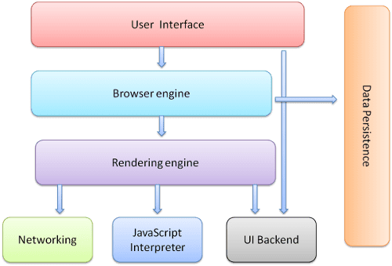

# Web

### Web

Web（World Wide Web）即全球广域网，也称为万维网。

我们常说的`Web端`就是网页端。

### [#](https://web.qianguyihao.com/01-HTML/01-认识Web和Web标准.html#网页)网页

**网页是构成网站的基本元素**。网页主要由文字、图像和超链接等元素构成。当然，除了这些元素，网页中还可以包含音频、视频以及Flash等。

我们在浏览器上输入网址后，打开的任何一个页面，都是属于网页。

### [#](https://web.qianguyihao.com/01-HTML/01-认识Web和Web标准.html#浏览器)浏览器

浏览器是网页运行的平台，常见的浏览器有谷歌（Chrome）、Safari、火狐（Firefox）、IE、Edge、Opera等。

关于浏览器的详细介绍，可以看下一篇文章：《浏览器的介绍》。

## Web标准

### [#](https://web.qianguyihao.com/01-HTML/01-认识Web和Web标准.html#w3c组织)W3C组织

**W3C**：World Wide Web Consortium，万维网联盟组织，用来制定web标准的机构（组织）。

W3C 万维网联盟是国际最著名的标准化组织。1994年成立后，至今已发布近百项相关万维网的标准，对万维网发展做出了杰出的贡献。

W3C 组织就类似于现实世界中的联合国。

为什么要遵循WEB标准呢？因为很多浏览器的浏览器内核不同，导致页面解析出来的效果可能会有差异，给开发者增加无谓的工作量。因此需要指定统一的标准。

### [#](https://web.qianguyihao.com/01-HTML/01-认识Web和Web标准.html#web-标准)Web 标准

**Web标准**：制作网页要遵循的规范。

Web标准不是某一个标准，而是由W3C组织和其他标准化组织制定的一系列标准的集合。

**1、Web标准包括三个方面**：

- 结构标准（HTML）：用于对网页元素进行整理和分类。
- 表现标准（CSS）：用于设置网页元素的版式、颜色、大小等外观样式。
- 行为标准（JS）：用于定义网页的交互和行为。

根据上面的Web标准，可以将 Web前端分为三层，如下。

**2、Web前端分三层**：

- HTML（HyperText Markup Language）：超文本标记语言。从**语义**的角度描述页面的**结构**。相当于人的身体组织结构。
- CSS（Cascading Style Sheets）：层叠样式表。从**审美**的角度美化页面的**样式**。相当于人的衣服和打扮。
- JavaScript（简称JS）：从**交互**的角度描述页面的**行为**，实现业务逻辑和页面控制。相当于人的动作，让人有生命力。

# 浏览器

### 浏览器的主要功能

浏览器的主要功能是从服务器请求您选择的 Web 资源，并将其显示在浏览器窗口中。资源通常是 HTML 文档，但也可能是 PDF、图片或其他类型的内容。资源的位置由用户使用 URI（统一资源标识符）指定。


### 高级基础架构

浏览器的主要组件包括：

1. **界面**：包括地址栏、后退/前进按钮、书签菜单等。浏览器界面的每个部分，但显示请求网页的窗口除外。
2. **浏览器引擎**：在界面和渲染引擎之间协调操作。
3. **渲染引擎**：负责显示请求的内容。例如，如果请求的内容是 HTML，则呈现引擎会解析 HTML 和 CSS，并在屏幕上显示解析的内容。
4. **网络**：对于 HTTP 请求等网络调用，在平台无关接口后面为不同平台使用不同的实现。
5. **界面后端**：用于绘制组合框和窗口等基本 widget。此后端公开的接口并非平台专用。在底层，它使用操作系统界面方法。
6. **JavaScript 解释器**。用于解析和执行 JavaScript 代码。
7. **数据存储**。这是持久层。浏览器可能需要在本地保存各种数据，例如 Cookie。浏览器还支持 localStorage、IndexedDB、WebSQL 和 FileSystem 等存储机制。





### 渲染引擎

渲染引擎的职责是… 渲染，即在浏览器屏幕上显示请求的内容。

默认情况下，渲染引擎可以显示 HTML 和 XML 文档以及图片。它可以通过插件或扩展程序显示其他类型的数据；例如，使用 PDF 查看器插件显示 PDF 文档。不过，在本章中，我们将重点介绍主要用例：使用 CSS 设置格式的 HTML 和图片。

不同的浏览器使用不同的渲染引擎：Internet Explorer 使用 Trident、Firefox 使用 Gecko、Safari 使用 WebKit。Chrome 和 Opera（从 15 版开始）使用 Blink，即 WebKit 的一个分支。

[WebKit](http://webkit.org/) 是一个开源渲染引擎，最初是 Linux 平台的引擎，后来被 Apple 修改为支持 Mac 和 Windows。

#### 主要流程

渲染引擎将开始从网络层获取请求的文档内容。这通常会以 8KB 的块进行。

之后，渲染引擎的基本流程如下：


渲染引擎将开始解析 HTML 文档，并将元素转换为名为“内容树”的树中的 [DOM](https://web.dev/articles/howbrowserswork?hl=zh-cn#dom) 节点。该引擎将解析外部 CSS 文件和样式元素中的样式数据。样式信息以及 HTML 中的视觉说明将用于创建另一个树：[渲染树](https://web.dev/articles/howbrowserswork?hl=zh-cn#render_tree_construction)。

渲染树包含具有颜色和尺寸等视觉属性的矩形。矩形以正确的顺序显示在屏幕上。

渲染树构建完成后，它会经历“[布局](https://web.dev/articles/howbrowserswork?hl=zh-cn#layout)”流程。这意味着，为每个节点提供其应在屏幕上显示的确切坐标。下一个阶段是[绘制](https://web.dev/articles/howbrowserswork?hl=zh-cn#painting) - 系统会遍历渲染树，并使用界面后端层绘制每个节点。

请务必了解，这是一个渐进的过程。为了提供更好的用户体验，渲染引擎会尝试尽快在屏幕上显示内容。它不会等到所有 HTML 都解析完毕后才开始构建和布局渲染树。系统会解析并显示部分内容，同时继续处理不断从网络传入的其余内容。


### 解析 

在计算机科学和浏览器渲染的上下文中，“解析”（Parsing）是指将某种形式的输入数据（通常是代码或文本）分解并转换为一种更容易处理和理解的内部表示形式的过程。简单来说，解析就是“读懂”输入内容，并将其转化为程序可以操作的结构。

#### 1. **HTML解析**
- **输入**：HTML代码，例如 `<div><p>Hello</p></div>`。
- **过程**：渲染引擎读取代码，识别标签（如`<div>`、`<p>`）、属性和文本内容，按照HTML语法规则分解。
- **输出**：生成DOM树（Document Object Model），一个树状结构，其中每个节点代表一个HTML元素。例如：
  ```
  Document
    └── div
        └── p
            └── "Hello"
  ```

#### 2. **CSS解析**
- **输入**：CSS代码，例如 `p { color: blue; }`。
- **过程**：引擎分析CSS语法，识别选择器（`p`）、属性（`color`）和值（`blue`）。
- **输出**：生成CSSOM树（CSS Object Model），表示样式规则的结构。例如：
  ```
  CSSOM
    └── Rule: p
        └── Property: color = blue
  ```

#### 3. **JavaScript解析**
- 如果网页包含JavaScript，浏览器会使用JavaScript引擎（如V8或SpiderMonkey）解析脚本代码，生成抽象语法树（AST），然后执行。

#### 解析的例子
假设有以下HTML：
```html
<p class="text">Hi</p>
```
- **HTML解析**：引擎识别出`<p>`是一个段落标签，`class="text"`是属性，`Hi`是内容，生成DOM节点。
- **结果**：
  ```
  p (class: "text")
    └── "Hi"
  ```

再加上CSS：
```css
.text { font-size: 16px; }
```
- **CSS解析**：引擎理解`.text`是一个类选择器，`font-size: 16px`是样式规则，生成CSSOM。
- **结果**：DOM和CSSOM结合后，`<p>`会被渲染为16像素大小的“Hi”。


### 解析器 - 词法分析器组合

解析可分为两个子过程：词法分析和语法分析。

1. **词法分析器（Lexer）**

词法分析器是解析过程的第一步，负责将原始输入（通常是字符流）分解成一个个有意义的单元，称为**词法单元（Token）**。

2. **解析器（Parser）**

解析器是第二步，负责接收词法分析器生成的Token序列，并根据语法规则分析其结构，最终生成一个抽象的表示形式，通常是**抽象语法树（AST, Abstract Syntax Tree）**。

### 翻译

在许多情况下，解析树不是最终产品。解析通常用于翻译：将输入文档转换为其他格式。例如编译。将源代码编译为机器代码的编译器会先将其解析为解析树，然后将该树转换为机器代码文档。


### 解析器类型

解析器有两种类型：自上而下解析器和自下而上解析器。直观的解释是，自上而下的解析器会检查语法的宏观结构，并尝试找到匹配的规则。自下而上解析器从输入开始，从低级规则开始逐步转换为语法规则，直到满足高级规则。


# HTML

### HTML的概念

**HTML** 全称为 HyperText Markup Language，译为**超文本标记语言**。

HTML 不是一种编程语言，是一种描述性的**标记语言**。

**作用**：HTML是负责描述文档**语义**的语言。

### [#](https://web.qianguyihao.com/01-HTML/03-初识HTML.html#概念-超文本)概念：超文本

所谓的超文本，有两层含义：

（1）图片、音频、视频、动画、多媒体等内容，被称为超文本，因为它们超出了文本的限制。

（2）不仅如此，它还可以从一个文件跳转到另一个文件，与世界各地主机的文件进行连接。即：超级链接文本。

### 概念：标记语言

HTML 不是一种编程语言，是一种描述性的**标记语言**。这主要有两层含义：

（1）**标记语言是一套标记标签**。比如：标签`<a>`表示超链接、标签``表示图片、标签`<h1>`表示一级标题等等，它们都是属于 HTML 标签。

说的通俗一点就是：网页是由网页元素组成的，这些元素是由 HTML 标签描述出来，然后通过浏览器解析，就可以显示给用户看了。

（2）编程语言是有编译过程的，而标记语言没有编译过程，HTML标签是直接由浏览器解析执行。

### HTML是负责描述文档语义的语言

HTML 格式的文件是一个纯本文文件（就是用txt文件改名而成），用一些标签来描述语义，这些标签在浏览器页面上是无法直观看到的，所以称之为“超文本标记语言”。

接下来，我们需要学习 HTML 中的很多“标签对儿”，这些“标签对儿”能够给文本不同的语义。

比如，面试的时候问你，`<h1>` 标签有什么作用？

- 正确答案：给文本增加主标题的语义。
- 错误答案：给文字加粗、加黑、变大。

关乎“语义”的更深刻理解，等接下来我们学习了各种标签，就明白了。

**XHTML介绍：** XHTML：Extensible Hypertext Markup Language，可扩展超文本标注语言。 XHTML的主要目的是为了**取代HTML**，也可以理解为HTML的升级版。 HTML的标记书写很不规范，会造成其它的设备(ipad、手机、电视等)无法正常显示。 XHTML与HTML4.0的标记基本上一样。 XHTML是**严格的、纯净的**HTML。

## HTML的专有名词

- 网页 ：由各种标记组成的一个页面就叫网页。
- 主页(首页) : 一个网站的起始页面或者导航页面。
- 标记： 比如`<p>`称为开始标记 ，`</p>`称为结束标记，也叫标签。每个标签都规定好了特殊的含义。
- 元素：比如`<p>内容</p>`称为元素.
- 属性：给每一个标签所做的辅助信息。
- XHTML：符合XML语法标准的HTML。
- DHTML：dynamic，动态的。`javascript + css + html`合起来的页面就是一个 DHTML。
- HTTP：超文本传输协议。用来规定客户端浏览器和服务端交互时数据的一个格式。SMTP：邮件传输协议，FTP：文件传输协议。

## HTML结构详解

HTML标签通常是成对出现的（**双边标记**），比如 `<div>` 和 `</div>`；也有少部分单标签（**单边标记**），如：`<br />`、`<hr />`和``等。

属性与标记之间、各属性之间需要以空格隔开。属性值以双引号括起来。

#### [#](https://web.qianguyihao.com/01-HTML/03-初识HTML.html#html骨架标签分类)html骨架标签分类

| 标签名            |    定义    | 说明                                                    |
| ----------------- | :--------: | :------------------------------------------------------ |
| `<html></html>`   |  HTML标签  | 页面中最大的标签，我们成为根标签                        |
| `<head></head>`   | 文档的头部 | 注意在head标签中我们必须要设置的标签是title             |
| `<title></title>` | 文档的标题 | 让页面拥有一个属于自己的网页标题                        |
| `<body></body>`   | 文档的主体 | 元素包含文档的所有内容，页面内容 基本都是放到body里面的 |

### 1、文档声明头

任何一个标准的HTML页面，第一行一定是一个以`<!DOCTYPE ……>`开头的语句。这一行，就是文档声明头，即 DocType Declaration，简称DTD。

**DTD可告知浏览器文档使用哪种 HTML 或 XHTML 规范**。

### 2、页面语言 `lang`

下面这行标签，用于指定页面的语言类型：

```html
<html lang="en">
```

1

最常见的语言类型有两种：

- en：定义页面语言为英语。
- zh-CN：定义页面语言为中文。

### 3、头标签 `head`

#### [#](https://web.qianguyihao.com/01-HTML/03-初识HTML.html#html5-的比较完整的骨架)html5 的比较完整的骨架：

```html
<!DOCTYPE html>
<html lang="en">
<head>
    <meta charset="UTF-8">
    <meta name="viewport" content="width=device-width, initial-scale=1.0">
	<meta http-equiv="Content-Type" content="text/html;charset=UTF-8">
	<meta name="Author" content="">
    <meta name="Keywords" content="厉害很厉害" />
    <meta name="Description" content="网易是中国领先的互联网技术公司，为用户提供免费邮箱、游戏、搜索引擎服务，开设新闻、娱乐、体育等30多个内容频道，及博客、视频、论坛等互动交流，网聚人的力量。" />
    <title>Document</title>
</head>
<body>

</body>
</html>
```

在 HTML 中，<meta> 是一个元数据标签（metadata tag），用于提供关于文档的额外信息。这些信息通常不会直接显示在网页上，而是供浏览器、搜索引擎或其他程序使用。<meta> 标签总是出现在 <head> 部分，且通常是单标签（不需要闭合，例如 </meta>）。

面试题：

- 问：网页的head标签里面，表示的是页面的配置，有什么配置？
- 答：字符集、关键词、页面描述、页面标题、IE适配、视口、iPhone小图标等等。

头标签内部的常见标签如下：

- `<title>`：指定整个网页的标题，在浏览器最上方显示。
- `<base>`：为页面上的所有链接规定默认地址或默认目标。
- `<meta>`：提供有关页面的基本信息
- `<body>`：用于定义HTML文档所要显示的内容，也称为主体标签。我们所写的代码必须放在此标签內。
- `<link>`：定义文档与外部资源的关系。

**meta 标签**：

meta表示“元”。“元”配置，就是表示基本的配置项目。

常见的几种 meta 标签如下：

（1）字符集 charset：

```html
<meta http-equiv="Content-Type" content="text/html;charset=UTF-8">
```

字符集用meta标签中的`charset`定义，charset就是character set（即“字符集”），即**网页的编码方式**。

**字符集**(Character set)是多个字符的集合。计算机要准确的处理各种字符集文字，需要进行字符编码，以便计算机能够识别和存储各种文字。

上面这行代码非常关键， 是必须要写的代码，否则可能导致乱码。比如你保存的时候，meta写的和声明的不匹配，那么浏览器就是乱码。

utf-8是目前最常用的字符集编码方式，常用的字符集编码方式还有gbk和gb2312等。关于“编码方式”，我们在下一段会详细介绍。

（2）视口 viewport：

```html
    <meta name="viewport" content="width=device-width, initial-scale=1.0">
```

`width=device-width` ：表示视口宽度等于屏幕宽度。

viewport 这个知识点，初学者还比较难理解，以后学 Web 移动端的时候会用到。

（3）定义“关键词”：

举例如下：

```html
<meta name="Keywords" content="网易,邮箱,游戏,新闻,体育,娱乐,女性,亚运,论坛,短信" />
```

这些关键词，就是告诉搜索引擎，这个网页是干嘛的，能够提高搜索命中率。让别人能够找到你，搜索到你。

（4）定义“页面描述”：

meta除了可以设置字符集，还可以设置关键字和页面描述。

只要设置Description页面描述，那么百度搜索结果，就能够显示这些语句，这个技术叫做**SEO**（search engine optimization，搜索引擎优化）。

设置页面描述的举例：

```html
<meta name="Description" content="网易是中国领先的互联网技术公司，为用户提供免费邮箱、游戏、搜索引擎服务，开设新闻、娱乐、体育等30多个内容频道，及博客、视频、论坛等互动交流，网聚人的力量。" />
```

上面的几种`<meta>`标签都不用记，但是另外还有一个`<meta>`标签是需要记住的：

```html
<meta http-equiv="refresh" content="3;http://www.baidu.com">
```


上面这个标签的意思是说，3秒之后，自动跳转到百度页面。

**title 标签**:

用于设置网页标题：

```html
	<title>网页的标题</title>
```

title签也是有助于SEO搜索引擎优化的。

**base标签**：

```html
<base href="/">
```

base 标签用于指定基础的路径。指定之后，所有的 a 链接都是以这个路径为基准。

### 4、`<body>`标签

`<body>`标签的属性有：

- `bgcolor`：设置整个网页的背景颜色。
- `background`：设置整个网页的背景图片。
- `text`：设置网页中的文本颜色。
- `leftmargin`：网页的左边距。IE浏览器默认是8个像素。
- `topmargin`：网页的上边距。
- `rightmargin`：网页的右边距。
- `bottommargin`：网页的下边距。

## 计算机编码介绍

计算机，不能直接存储文字，存储的是编码。

计算机只能处理二进制的数据，其它数据，比如：0-9、a-z、A-Z，这些字符，我们可以定义一套规则来表示。假如：A用110表示，B用111表示等。

**ASCII码：** 美国发布的，用1个字节(8位二进制)来表示一个字符，共可以表示2^8=256个字符。 美国的国家语言是英语，只要能表示0-9、a-z、A-Z、特殊符号。

**ANSI编码：** **每个国家为了显示本国的语言，都对ASCII码进行了扩展**。用2个字节(16位二进制)来表示一个汉字，共可以表示2^16＝65536个汉字。例如： 中国的ANSI编码是GB2312编码(简体)，对6763汉字进行编码，含600多特殊字符。另外还有GBK(简体)。 日本的ANSI编码是JIS编码。 台湾的ANSI编码是BIG5编码（繁体）。

**GBK：** 对GB2312进行了扩展，用来显示罕见的、古汉语的汉字。现在已经收录了2.1万左右。并提供了1890个汉字码位。K的含义就是“扩展”。

**Unicode编码(统一编码)：** 用4个字节(32位二进制)来表示一个字符，想法不错，但效率太低。例如，字母A用ASCII表示的话一个字节就够，可用Unicode编码的话，得用4个字节表示，造成了空间的极大浪费。A的Unicode编码是0000 0000 0000 0000 0000 0000 0100 0000

**UTF-8(Unicode Transform Format)编码：** 根据字符的不同，选择其编码的长度。比如：一个字符A用1个字节表示，一个汉字用2个字节表示。

毫无疑问，开发中，都用**UTF-8**编码吧，准没错。

**中文能够使用的字符集两种：**

- 第一种：UTF-8。UTF-8是国际通用字库，里面涵盖了所有地球上所有人类的语言文字，比如阿拉伯文、汉语、鸟语……
- 第二种：GBK（对GB2312进行了扩展）。gb2312 是国标，是中国的字库，里面**仅**涵盖了汉字和一些常用外文，比如日文片假名，和常见的符号。

字库规模： UTF-8（字很全） > gb2312（只有汉字）

**重点1：避免乱码**

我们用meta标签声明的当前这个html文档的字库，一定要和保存的文件编码类型一样，否则乱码（重点）。

拿 sublime编辑器举例，当我们不设置的时候，sublime默认类型就是UTF-8。而一旦更改为gb2312的时候，就一定要记得设置一下sublime的保存类型： `文件→ set File Encoding to → Chinese Simplified(GBK)`。VS Code 的道理一样。

**重点2：UTF-8和gb2312的比较**

保存大小：UTF-8（更臃肿、加载更慢） > gb2312 （更小巧，加载更快）

总结：

- UTF-8：字多，有各种国家的语言，但是保存尺寸大，文件臃肿；
- gb2312：字少，只用中文和少数外语和符号，但是尺寸小，文件小巧。

列出2个使用情形：

1） 你们公司是做日本动漫的，经常出现一些日语动漫的名字，网页要使用UTF-8。如果用gb2312将无法显示日语。 2） 你们公司就是中文网页，极度的追求网页的显示速度，要使用gb2312。如果使用UTF-8将每个汉字多一个byte，所以5000个汉字，多5kb。

我们亲测：

- qq网、网易、搜狐都是使用gb2312。这些公司，都追求显示速度。
- 新华网藏语频道，使用的是UTF-8，保证字符集的数量。

## HTML的规范

- HTML不区分大小写，但HTML的标签名、类名、标签属性、大部分属性值建议统一用小写。
- HTML页面的后缀名是html或者htm(有一些系统不支持后缀名长度超过3个字符，比如dos系统)

### [#](https://web.qianguyihao.com/01-HTML/03-初识HTML.html#_1、编写xhtml的规范)1、编写XHTML的规范：

（1）所有标记元素都要正确的嵌套，不能交叉嵌套。正确写法举例：`<h1><font></font></h1>`

（2）所有的标记都必须小写。

（3）所有的标签都必须闭合。

- 双标签：`<span></span>`
- 单标签：`<br>` 建议写成 `<br />` `<hr>` 建议转成 `<hr />`，还有``

（4）所有的属性值必须加引号。`<font color="red"></font>`

（5）所有的属性必须有值。`<hr noshade="noshade">`、`<input type="radio" checked="checked" />`

（6）XHTML文档开头必须要有DTD文档类型定义。

### 2、HTML的基本语法特性

#### [#](https://web.qianguyihao.com/01-HTML/03-初识HTML.html#_1-html对换行不敏感-对tab不敏感)（1）HTML对换行不敏感，对tab不敏感

HTML只在乎标签的嵌套结构，嵌套的关系。谁嵌套了谁，谁被谁嵌套了，和换行、tab无关。换不换行、tab不tab，都不影响页面的结构。

也就是说，HTML不是依靠缩进来表示嵌套的，而是看标签的嵌套关系。但是，我们发现有良好的缩进，代码更易读。建议大家都正确缩进标签。

百度为了追求极致的显示速度，所有HTML标签都没有换行、都没有缩进（tab），HTML和换不换行无关，标签的层次依然清晰，只不过程序员不可读了。如下图所示：

#### （2）空白折叠现象

HTML中所有的**文字之间**，如果有空格、换行、tab都将被折叠为一个空格显示。

#### （3）标签要严格封闭

标签不封闭的结果是灾难性的。

## 04-HTML标签：排版标签

排版标签：

- `<h1>`
- `<p>`
- `<hr />`
- `<br />`
- `<div>`
- `<span>`
- `<center>`
- `<pre>`

下面来详细介绍一下排版标签。

## 标题标签

标题使用`<h1>`至`<h6>`标签进行定义。`<h1>`定义最大的标题，`<h6>`定义最小的标题。具有align属性，属性值可以是：left、center、right。

## HTML 注释

HTML 注释的格式如下：

```html
<!-- 我是 html 注释  -->
```

## [#](https://web.qianguyihao.com/01-HTML/04-HTML标签：排版标签.html#段落标签-p)段落标签`<p>`

段落，是英语“paragraph“缩写。

**作用**：可以把 HTML 文档分割为若干段落。在网页中如果要把文字有条理地显示出来，离不开段落标签。就如同我们平常写文章一样，整个网页也可以分为若干个段落。

代码举例：

```html
<p>This is a paragraph</p>
<p>This is another paragraph</p>
```


属性：

- `align="属性值"`：对齐方式。属性值包括left center right。

属性举例：


HTML标签是分等级的，HTML将所有的标签分为两种：

- **文本级标签**：p、span、a、b、i、u、em。文本级标签里只能放**文字、图片、表单元素**。（a标签里不能放a和input）
- **容器级标签**：div、h系列、li、dt、dd。容器级标签里可以放置任何东西。

从学习p的第一天开始，就要牢牢记住：**p标签是一个文本级标签，p里面只能放文字、图片、表单元素**。其他的一律不能放。

错误写法：（尝试把 h 放到 p 里）

```html
	<p>
		我是一个小段落
		<h1>我是一级标题</h1>
	</p>
```

## 水平线标签`<hr />`

> horizontal 单词的发音：[ˌhɒrɪˈzɒntl]。

水平分隔线（horizontal rule）可以在视觉上将文档分隔成各个部分。在网页中常常看到一些水平线将段落与段落之间隔开，使得文档结构清晰，层次分明。

代码举例：

```html
<!DOCTYPE html>
<html lang="en">
<head>
	<meta charset="UTF-8">
	<meta name="viewport" content="width=device-width, initial-scale=1.0">
	<title>Document</title>
</head>
<body>
	<p>自古情深留不住</p>
	<hr />
	<p>总是套路得人心</p>
</body>
</html>
```

运行效果

div和span的介绍

- **div标签**：可以把标签中的内容分割为独立的区块。必须单独占据一行。
- **span标签**：和div的作用一致，但不换行。

代码举例：


div标签的属性：

- `align="属性值"`：设置块儿的位置。属性值可选择：left、right、 center。

### [#](https://web.qianguyihao.com/01-HTML/04-HTML标签：排版标签.html#div和span的区别)div和span的区别

`<span>`和`<div>`唯一的区别在于：`<span>`是不换行的，而`<div>`是换行的。

如果单独在网页中插入这两个元素，不会对页面产生任何的影响。这两个元素是专门为定义CSS样式而生的。或者说，DIV+CSS来实现各种样式。

div在浏览器中，默认是不会增加任何的效果的，但是语义变了，div中的所有元素是一个小区域。 div标签是一个**容器级**标签，里面什么都能放，甚至可以放div自己。

span也是表达“小区域、小跨度”的标签，但只是一个**文本级**的标签。 就是说，span里面只能放置文字、图片、表单元素。 span里面不能放p、h、ul、dl、ol、div。

## 内容居中标签 `<center>`

此时center代表是一个标签，而不是一个属性值了。只要是在这个标签里面的内容，都会居于浏览器的中间。 效果演示：


到了HTML5里面，center标签不建议使用，建议使用css布局来实现

## 预定义（预格式化）标签`<pre>`

含义：将保留标签内部所有的空白字符(空格、换行符)，原封不动地输出结果（告诉浏览器不要忽略空格和空行）。

说明：真正排网页过程中，`<pre>`标签几乎用不着。 
