# 05-HTML标签：字体标签和超链接

##  1.字体标签

### 特殊字符（转义字符）

- ` &nbsp`：空格 （non-breaking spacing，不断打空格）
- `&lt`：小于号`<`（less than）
- `&gt`：大于号`>`（greater than）
- `&amp`：符号`&`
- `&quot`：双引号
- `&apos`：单引号
- `&copy`：版权`©`
- `&trade`：商标`™`
- `&#32464`：文字`绐`。其实，`#32464`是汉字`绐`的unicode编码。

```html
<body>
    这是一个HTML语言的&lt;p&gt;标签
</body>
```

结果

```text
这是一个HTML语言的<p>标签
```

### 下划线、中划线、斜体

- `<u>`：下划线标记
- `<s>`或`<del>`：中划线标记（删除线）
- `<i>`或`<em>`：斜体标记

```html
<body>
    <font>Marco</font><br>
    <u>Marco</u><s>Marco</s><br>
    <i>Marco</i>
</body>
```

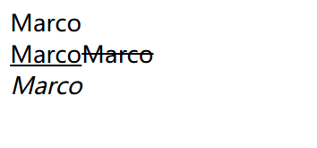

上面的这几个标签，常用于做一些小装饰、小图标。比如：

### 粗体标签`<b>`或`<strong>`（已废弃）


### 上标`<sup>` 下标`<sub>`

上小标这两个标签容易混淆，怎么记呢？这样记：`b`的意思是`bottom：底部` 举例：

```html
Marco<sup>dai</sup> dai<sub>Marco</sub>
```

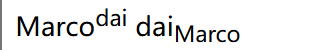

## 2. 超链接

### 1、外部链接：链接到外部文件

举例：

```html
<a href="font.html">点击进入另外一个文件</a>
```

a是英语`anchor`“锚”的意思，就好像这个页面往另一个页面扔出了一个锚。是一个文本级的标签。

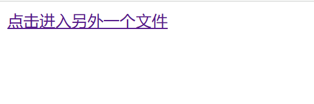

当然，我们也可以直接点进链接，访问一个网址。代码举例如下：

```html
<a href="http://www.baidu.com" target="_blank">点我点我</a>
```

> 点击“点击访问 Example”后，https://www.example.com 会在新标签页或新窗口中打开，当前页面保持不变。

### 2、锚链接

**锚链接**：给超链接起一个名字，作用是**在本页面或者其他页面的的不同位置进行跳转**。比如说，在网页底部有一个向上箭头，点击箭头后回到顶部，这个就可以利用锚链接。

首先我们要创建一个**锚点**，也就是说，使用`name`属性或者`id`属性给那个特定的位置起个名字。效果如下：

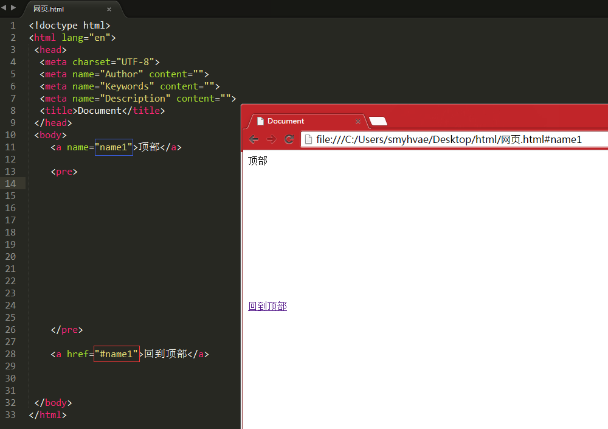

上图中解释：

第11行代码表示，顶部这个锚的名字叫做name1。 然后在底部设置超链接，点击时将回到顶部（此时，网页中的url的末尾也出现了`#name1`）。注意**上图中红框部分的`#`号不要忘记了**，表示跳到名为name1的特定位置，这是规定。如果少了`#`号，点击之后，就会跳到name1这个文件或者name1这个文件夹中去。

如果我们将上图中的第28行代码写成：

```html
<a href="a.html#name1">回到顶部</a>
```

那就表示，点击之后，跳转到`a.html`页面的`name1锚点`中去。

说明：name属性是HTML4.0以前使用的，id属性是HTML4.0后才开始使用。为了向前兼容，因此，name和id这两个属性都要写上，并且值是一样的。

### 3、邮件链接

```html
<a href="mailto:xxx@163.com">点击进入我的邮箱</a>
```

### 超链接的属性

- `href`：目标URL

- `title`：悬停文本。

- `name`：主要用于设置一个锚点的名称。

- `target`：告诉浏览器用什么方式来打开目标页面。

  `target`属性有以下几个值：

  - `_self`：在同一个网页中显示（默认值）
  - `_blank`：**在新的窗口中打开**。blank就是“空白”的意思，就表示新建一个空白窗口。
  - `_parent`：在父窗口中显示
  - `_top`：在顶级窗口中显示

`title`属性：

```html
<a href="09_img.html" title="很好看哦">结婚照</a>
```

#### 备注1：分清楚img和a标签的各自的属性

<a> 标签（全称是 "anchor"，锚点）是最重要的标签之一

区别如下：

```html

<a href="1.html"></a>
```

#### 备注2：a是一个文本级的标签

比如一个段落中的所有文字都能够被点击，那么应该是p包裹a：

```html
<p>
	<a href="">段落段落段落段落段落段落</a>
</p>
```

而不是a包裹p：

```html
<a href="">
	<p>
		段落段落段落段落段落段落
	</p>
</a>
```

# 06-HTML标签：图片标签

### 介绍

img: 英文全称 image（图像），代表的是一张图片。

如果要想在网页中显示图像，就可以使用img 标签，它是一个单标签。语法如下：

```html
    
```

> 注意：代码文件要求和图片的路径不要求在同一个根目录下面

### 能插入的图片类型

- 能够插入的图片类型是：jpg(jpeg)、gif、png、bmp等。
- 不能往网页中插入的图片格式是：psd、ai等。

HTML页面不是直接插入图片，而是插入图片的引用地址，所以要先把图片上传到服务器上。

## img标签的`src`属性

这里涉及到图片的一个属性：

- `src`属性：指图片的路径。英文名称 source。

在写**图片的路径**时，有两种写法：相对路径、绝对路径

###  写法一：图片的相对路径

相对当前页面所在的路径。两个标记 `.` 和 `..` 分表代表当前目录和上一层目录。

举例1：

```html
<body>
    
</body>
```

`../`要么不写，要么就写在开头。

举例2：

```html

```

上方代码的意思是说，当前html页面有一个并列的文件夹`images`，在文件夹`images`中存放了一张图片`1.jpg` 效果：

### 写法二：图片的绝对路径

绝对路径包括以下两种：

   (1）以盘符开始的绝对路径。举例：

```html

```

（2）网络路径。举例：

```html

```

### 相对路径和绝对路径的总结

相对路径的好处：站点不管拷贝到哪里，文件和图片的相对路径关系都是不变的。相对路径使用有一个前提，就是网页文件和你的图片，必须在一个服务器上。

## img标签的其他属性

### [#](https://web.qianguyihao.com/01-HTML/06-HTML标签：图片标签.html#width、height-属性)width、height 属性

- `width`：图像的宽度。
- `height`：图像的高度。

width和height，在 HTML5 中的单位是 CSS 像素，在 HTML 4 中既可以是像素，也可以是百分比。可以只指定 width 和 height 中的一个值，浏览器会根据原始图像进行缩放。

**重要提示**：如果要想保证图片等比例缩放，请只设置width和height中其中一个。

### Alt 属性

- `alt`：当图片不可用（无法显示）的时候，代替图片显示的内容。alt是英语 alternate “替代”的意思，代表替换资源。

`Alt`属性效果演示：

```html
    

```

当图片 src 不可用的时候，显示alt文字。

### title 属性

- `title`：**提示性文本**。鼠标悬停时出现的文本。

title 属性不该被用作一幅图片在 alt 之外的补充说明信息。如果一幅图片需要小标题，使用 figure 或 figcaption 元素。

title 元素的值一般作为提示条(tooltip)呈现给用户，在光标于图片上停下后显示出来。尽管这确实能给用户提供更多的信息，您不该假定用户真的能看到：用户可能只有键盘或触摸屏。如果要把特别重要的信息提供给用户，可以选择上面提供的一种方法将其内联显示，而不是使用 title。

```html
    

```

###  align 属性(废弃)

- 图片的`align`属性：**图片和周围文字的相对位置**。属性取值可以是：bottom（默认）、center、top、left、right。

如果想实现图文混排的效果，请使用align属性，取值为left或right。

我们来分别看一下这`align`属性的这几个属性值的区别。

1、`align=""`，图片和文字底端对齐。即默认情况下的显示效果：

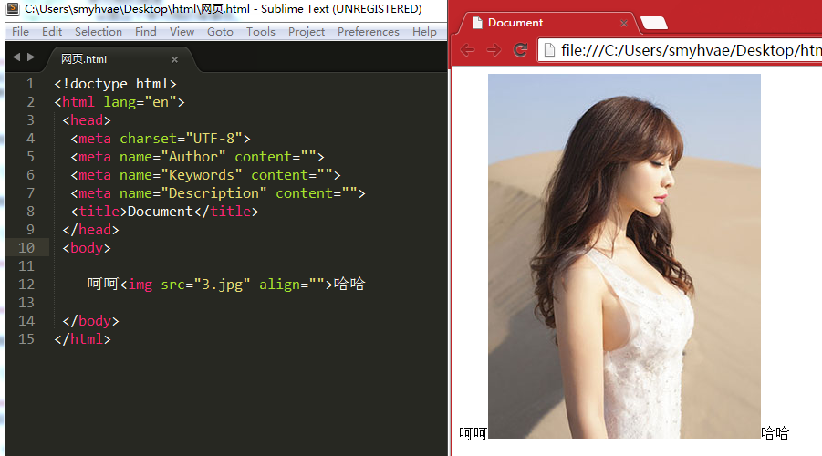

2、`align="center"`：图片和文字水平方向上居中对齐。显示效果：

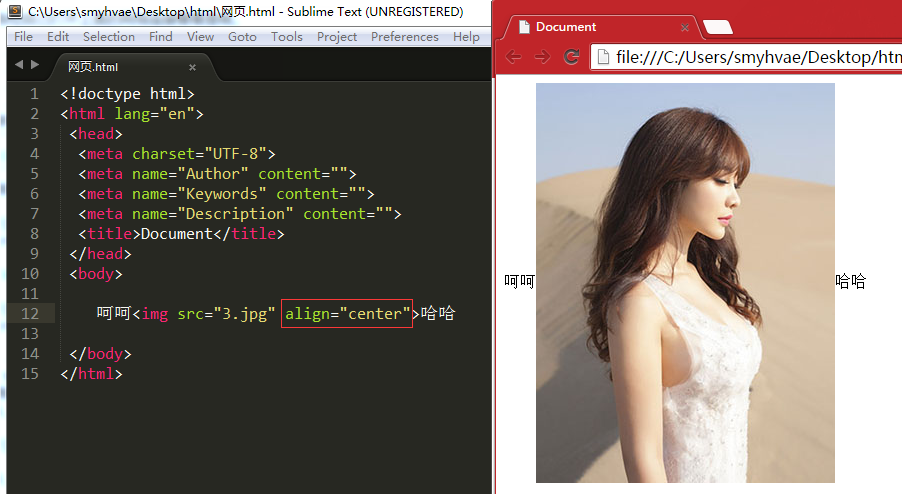

3、`align="top"`：图片与文字顶端对齐。显示效果：

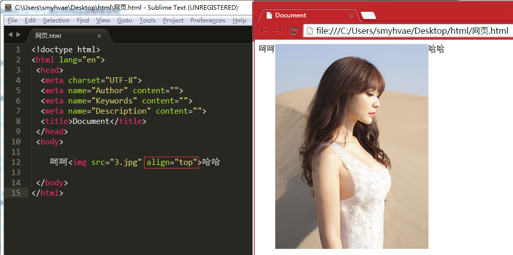

4、`align="left"`：图片在文字的左边。显示效果：

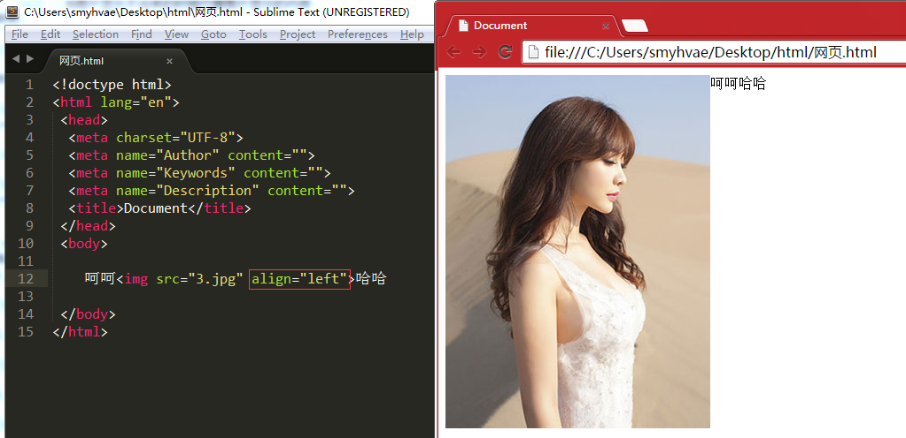


# 07-HTML标签图文详解（二）

## 本文主要内容

- 列表标签：`<ul>`、`<ol>`、`<dl>`
- 表格标签：`<table>`
- 框架标签及内嵌框架`<iframe>`
- 表单标签：`<form>`
- 多媒体标签
- 滚动字幕标签：`<marquee>`

## 列表标签

列表标签分为三种。

### 1、无序列表`<ul>`，无序列表中的每一项是`<li>`

英文单词解释如下：

- ul：unordered list，“无序列表”的意思。
- li：list item，“列表项”的意思。

例如：

```html
    <ul>
        <li>默认1</li>
        <li>默认2</li>
        <li>默认3</li>
    </ul>
```

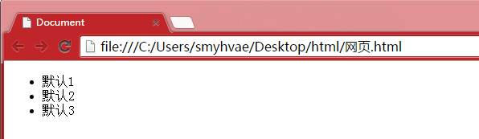


注意：

- li不能单独存在，必须包裹在ul里面；反过来说，ul的“儿子”不能是别的东西，只能有li。
- 我们这里再次强调，ul的作用，并不是给文字增加小圆点的，而是增加无序列表的“语义”的。

**属性：**

- `type="属性值"`。属性值可以选： `disc`(实心原点，默认)，`square`(实心方点)，`circle`(空心圆)。

```html
    <ul type="circle">
        <li>默认1</li>
        <li>默认2</li>
        <li>默认3</li>
    </ul>
```

不光是`<ul>`标签有`type`属性，`<ul>`里面的`<li>`标签也有`type`属性（虽然说这种写法很少见）

```html
    <ul type="circle">
        <li><a href="1">1</a></li>
        <li type="square"><a href="2">2</a></li>
        <li><a href="2">3</a></li>
    </ul>
```

当然了，列表之间是可以**嵌套**的。我们来举个例子。

```html
</ul>
        <ul>
            <li><b>北京市</b>
                <ul>
                    <li>海淀区</li>
                    <li>朝阳区</li>
                    <li>东城区</li>
                </ul>
            </li>
            <li>
                <b>武汉市</b>
                <ul>
                    <li>洪山区</li>
                    <li>江夏区</li>
                    <li>武昌区</li>
                </ul>
            </li>
        </ul>
```

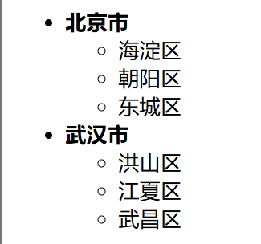

#### ul标签实际应用场景：

场景1、导航条：

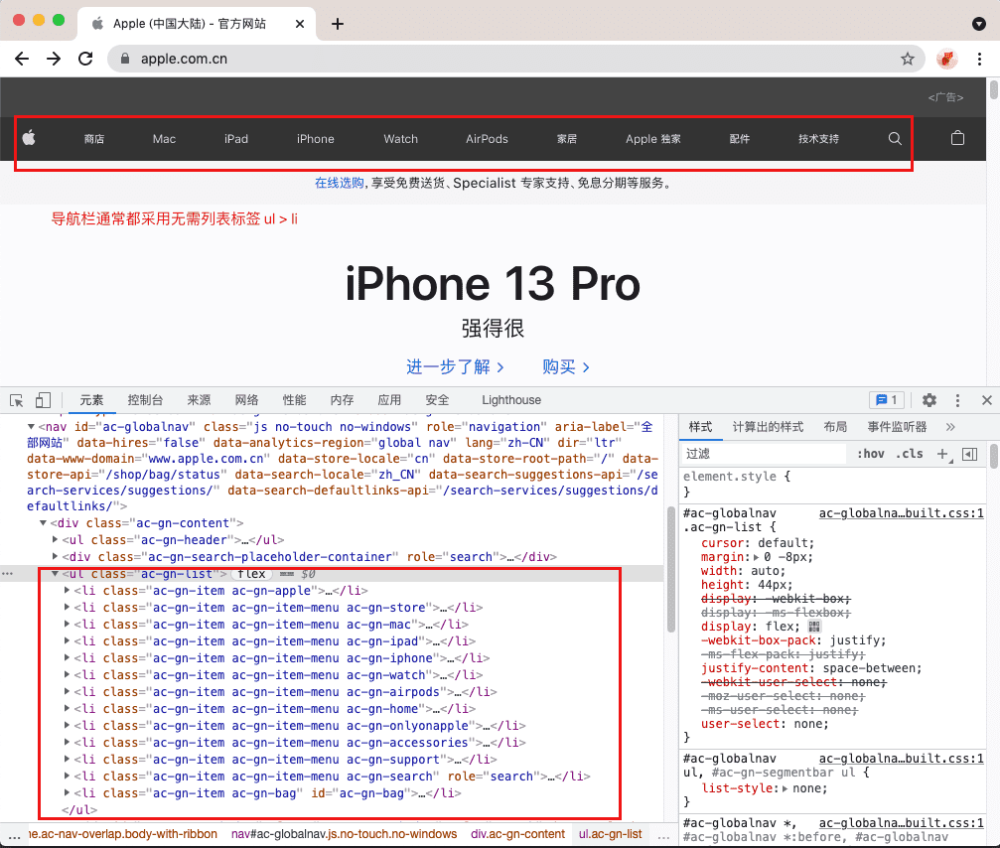

场景2、li 里面放置的内容可能很多：

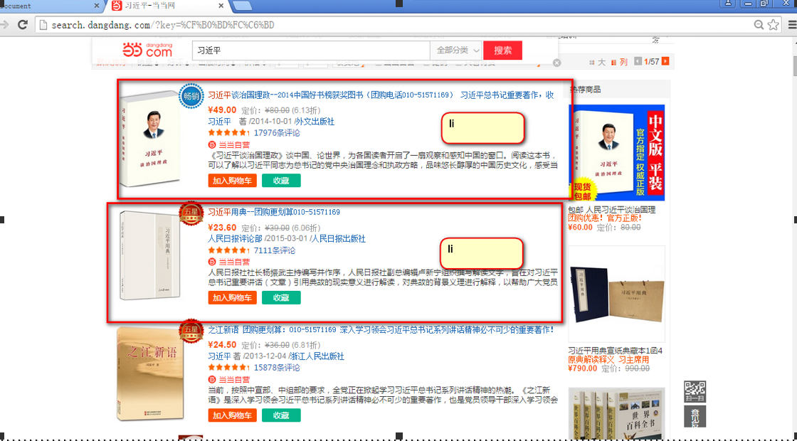

声明：ul的儿子，只能是li。但是li是一个容器级标签，**li里面什么都能放，甚至可以再放一个ul**。

### 2、有序列表`<ol>`，里面的每一项是`<li>`

英文单词：Ordered List。

例如：

```html
    <ol>
        <li>第一个</li>
        <li>第二个</li>
        <li>第三个</li>
    </ol>
```

**属性：**

- `type="属性值"`。属性值可以是：1(阿拉伯数字，默认)、a、A、i、I。结合`start`属性表示`从几开始`。

```html
    <ol type="i" start="10">
        <li>第一个</li>
        <li>第二个</li>
        <li>第三个</li>
    </ol>
```

ol和ul就是语义不一样，怎么使用都是一样的。 ol里面只能有li，li必须被ol包裹。li是容器级。

### 3、定义列表`<dl>`

`<dl>`英文单词：definition list，没有属性。dl的子元素只能是dt和dd。

- `<dt>`：definition title 列表的标题，这个标签是必须的
- `<dd>`：definition description 列表的列表项，如果不需要它，可以不加

备注：dt、dd只能在dl里面；dl里面只能有dt、dd。

举例：

```html
<dl>
	<dt>第一条</dt>
	<dd>你若是觉得你有实力和我玩，良辰不介意奉陪到底</dd>
	<dd>我会让你明白，我从不说空话</dd>
	<dd>我是本地的，我有一百种方式让你呆不下去；而你，无可奈何</dd>

	<dt>第二条</dt>
	<dd>良辰最喜欢对那些自认能力出众的人出手</dd>
	<dd>你可以继续我行我素，不过，你的日子不会很舒心</dd>
	<dd>你只要记住，我叫叶良辰</dd>
	<dd>不介意陪你玩玩</dd>
	<dd>良辰必有重谢</dd>

</dl>
```

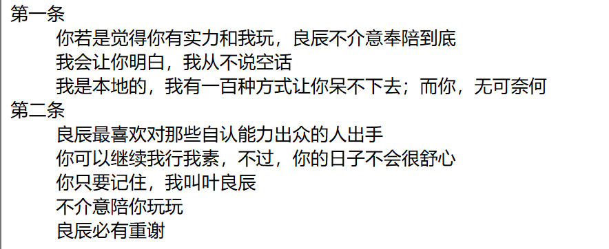

上图可以看出，定义列表表达的语义是两层：

- （1）是一个列表，列出了几个dd项目
- （2）每一个词儿都有自己的描述项。

备注：dd是描述dt的。

定义列表用法非常灵活，可以一个dt配很多dd：

```html
    <dl>
        <dt>北京</dt>
        <dd>国家首都，政治文化中心</dd>
        <dd>污染很严重，PM2.0天天报表</dd>
    </dl>

    <dl>
        <dt>上海</dt>
        <dd>魔都，有外滩、东方明珠塔、黄浦江</dd>
    </dl>

    <dl>
        <dt>广州</dt>
        <dd>中国南大门，有珠江、小蛮腰</dd>
    </dl>
```


真实案例：（京东最下方）

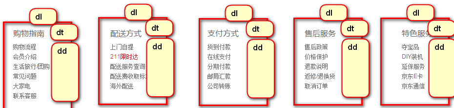

京东商品分类如下：

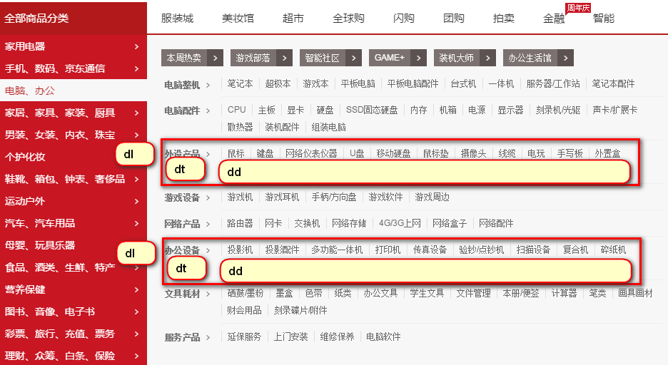

## 表格标签

表格标签用`<table>`表示。 一个表格`<table>`是由每行`<tr>`组成的，每行是由每个单元格`<td>`组成的。 所以我们要记住，一个表格是由行组成的（行是由列组成的），而不是由行和列组成的。 在以前，要想固定标签的位置，唯一的方法就是表格。现在可以通过CSS定位的功能来实现。但是现在在做页面的时候，表格作用还是有一些的。

例如，一行的单元格：

```html
<table>
	<tr>
		<td></td>
		<td></td>
		<td></td>
		<td></td>
	</tr>
</table>
```

上面的表格中没有加文字，所以在生成的网页中什么都看不到。 例如，3行4列的单元格：

```html
<table>
	<tr>
		<td>千古壹号</td>
		<td>23</td>
		<td>男</td>
		<td>黄冈</td>
	</tr>

	<tr>
		<td>许嵩</td>
		<td>29</td>
		<td>男</td>
		<td>安徽</td>
	</tr>

	<tr>
		<td>邓紫棋</td>
		<td>23</td>
		<td>女</td>
		<td>香港</td>
	</tr>

</table>
```

&<table>的属性：

- `border`：边框。像素为单位。
- `style="border-collapse:collapse;"`：单元格的线和表格的边框线合并（表格的两边框合并为一条）
- `width`：宽度。像素为单位。
- `height`：高度。像素为单位。
- `bordercolor`：表格的边框颜色。
- `align`：**表格**的水平对齐方式。属性值可以填：left right center。 注意：这里不是设置表格里内容的对齐方式，如果想设置内容的对齐方式，要对单元格标签`<td>`进行设置）
- `cellpadding`：单元格内容到边的距离，像素为单位。默认情况下，文字是紧挨着左边那条线的，即默认情况下的值为0。 注意不是单元格内容到四条边的距离哈，而是到一条边的距离，默认是与左边那条线的距离。如果设置属性`dir="rtl"`，那就指的是内容到右边那条线的距离。
- `cellspacing`：单元格和单元格之间的距离（外边距），像素为单位。默认情况下的值为0
- `bgcolor="#99cc66"`：表格的背景颜色。
- `background="路径src/..."`：背景图片。 背景图片的优先级大于背景颜色。
- `bordercolorlight`：表格的上、左边框，以及单元格的右、下边框的颜色
- `bordercolordark`：表格的右、下边框，以及单元格的上、左的边框的颜色 这两个属性的目的是为了设置3D的效果。
- `dir`：公有属性，单元格内容的排列方式(direction)。 可以 取值：`ltr`：从左到右（left to right，默认），`rtl`：从右到左（right to left） 既然说`dir`是共有属性，如果把这个属性放在任意标签中，那表明这个标签的位置可能会从右开始排列。

```html
    table {
        border: 1px solid black;
        border-collapse: collapse; /* 合并边框 */
    }
    td {
        border: 1px solid black;
    }
```

### `<tr>`：行

一个表格就是一行一行组成的。

**属性：**

- dir：公有属性，设置这一行单元格内容的排列方式。可以取值：
  - `ltr`：从左到右（left to right，默认）
  - `rtl`：从右到左（right to left）
- `bgcolor`：设置这一行的单元格的背景色。 注：没有background属性，即：无法设置这一行的背景图片，如果非要设置，可以用css实现。
- `height`：一行的高度
- `align="center"`：一行的内容水平居中显示，取值：left、center、right
- `valign="center"`：一行的内容垂直居中，取值：top、middle、bottom

### [#](https://web.qianguyihao.com/01-HTML/07-html标签图文详解（二）.html#td-单元格)`<td>`：单元格

**属性：**

- 单元格的合并

  单元格的属性：

  - `colspan`：横向合并。例如`colspan="2"`表示当前单元格在水平方向上要占据两个单元格的位置。
  - `rowspan`：纵向合并。例如`rowspan="2"`表示当前单元格在垂直方向上要占据两个单元格的位置。

  效果举例：（横向合并）

- `align`：内容的横向对齐方式。属性值可以填：left right center。如果想让每个单元格的内容都居中，这个属性太麻烦了，以后用css来解决。

- `valign`：内容的纵向对齐方式。属性值可以填：top middle bottom

- `width`：绝对值或者相对值(%)

- `height`：单元格的高度

- `bgcolor`：设置这个单元格的背景色。

- `background`：设置这个单元格的背景图片。

### `<tr>`：行

一个表格就是一行一行组成的。

**属性：**

- ```
  dir
  ```

  ：公有属性，设置这一行单元格内容的排列方式。可以取值：

  - `ltr`：从左到右（left to right，默认）
  - `rtl`：从右到左（right to left）

- `bgcolor`：设置这一行的单元格的背景色。 注：没有background属性，即：无法设置这一行的背景图片，如果非要设置，可以用css实现。

- `height`：一行的高度

- `align="center"`：一行的内容水平居中显示，取值：left、center、right

- `valign="center"`：一行的内容垂直居中，取值：top、middle、bottom

### [#](https://web.qianguyihao.com/01-HTML/07-html标签图文详解（二）.html#td-单元格)`<td>`：单元格

**属性：**

- `align`：内容的横向对齐方式。属性值可以填：left right center。如果想让每个单元格的内容都居中，这个属性太麻烦了，以后用css来解决。
- `valign`：内容的纵向对齐方式。属性值可以填：top middle bottom
- `width`：绝对值或者相对值(%)
- `height`：单元格的高度
- `bgcolor`：设置这个单元格的背景色。
- `background`：设置这个单元格的背景图片。

### 单元格的合并

单元格的属性：

- `colspan`：横向合并。例如`colspan="2"`表示当前单元格在水平方向上要占据两个单元格的位置。
- `rowspan`：纵向合并。例如`rowspan="2"`表示当前单元格在垂直方向上要占据两个单元格的位置。

### `<th>`：加粗的单元格。相当于`<td>` + `<b>`

- 属性同`<td>`标签。

### [#](https://web.qianguyihao.com/01-HTML/07-html标签图文详解（二）.html#caption-表格的标题。使用时和tr标签并列)`<caption>`：表格的标题。使用时和`tr`标签并列

- 属性：`align`，表示标题相对于表格的位置。属性取值可以是：left、center、right、top、bottom 效果：

## 内嵌框架

内嵌框架用`<iframe>`表示。`<iframe>`是`<body>`的子标记。

内嵌框架inner frame：嵌入在一个页面上的框架(仅仅IE、新版google浏览器支持，可能有其他浏览器也支持，暂时我不清楚)。

**属性：**

- `src="subframe/the_second.html"`：内嵌的那个页面
- `width=800`：宽度
- `height=“150`：高度
- `scrolling="no"`：是否需要滚动条。默认值是true。
- `name="mainFrame"`：窗口名称。公有属性。

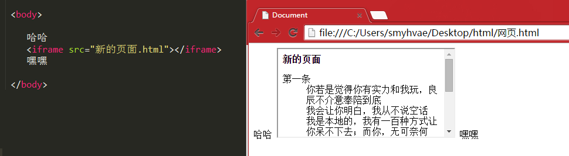

内嵌框架举例：（在内嵌页面中切换显示不同的压面）

```html
 <body>

 	<a href="文字页面.html" target="myframe">默认显示文字页面</a><br>
 	<a href="图片页面.html" target="myframe">点击进入图片页面</a><br>
 	<a href="表格页面.html" target="myframe">点击进入表格页面</a><br>

 	<iframe src="文字页面.html" width="400" height="400" name="myframe"></iframe>
 	<br>
 	嘿嘿

 </body>
```

效果演示：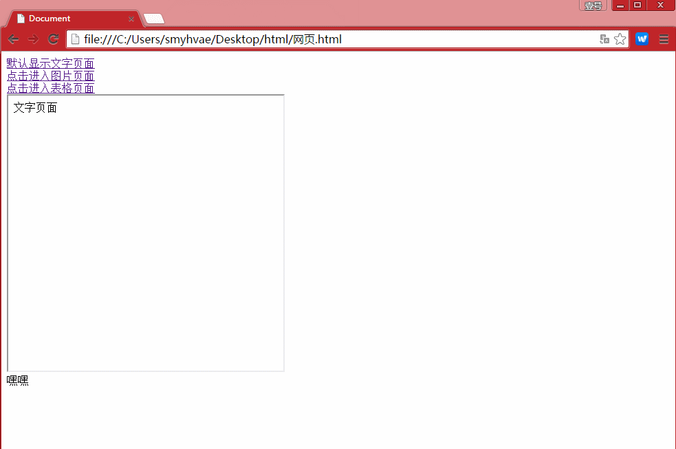

## 表单标签

表单标签用`<form>`表示，用于与服务器的交互。表单就是收集用户信息的，就是让用户填写的、选择的。

**属性：**

- `name`：表单的名称，用于JS来操作或控制表单时使用；
- `id`：表单的名称，用于JS来操作或控制表单时使用；
- `action`：指定表单数据的处理程序，一般是PHP，如：action=“login.php”
- `method`：表单数据的提交方式，一般取值：get(默认)和post

注意：表单和表格嵌套时，是在`<form>`标记中套`<table>`标记。

form标签里面的action属性和method属性，在后续的 ajax文章上再讲。这里简单说一下：action属性就是表示，表单将提交到哪里。 method属性表示用什么HTTP方法提交，有get、post两种。

**get提交和post提交的区别：**

GET方式： 将表单数据，以"name=value"形式追加到action指定的处理程序的后面，两者间用"?"隔开，每一个表单的"name=value"间用"&"号隔开。 特点：只适合提交少量信息，并且不太安全(不要提交敏感数据)、提交的数据类型只限于ASCII字符。

POST方式： 将表单数据直接发送(隐藏)到action指定的处理程序。POST发送的数据不可见。Action指定的处理程序可以获取到表单数据。 特点：可以提交海量信息，相对来说安全一些，提交的数据格式是多样的(Word、Excel、rar、img)。

### `<input>`：输入标签（文本框）

用于接收用户输入。

```html
<input type="text" />
```

**属性：**

- **`type="属性值"`**：文本类型。属性值可以是：
  - `text`（默认）
  - `password`：密码类型
  - `radio`：单选按钮，名字相同的按钮作为一组进行单选（单选按钮，天生是不能互斥的，如果想互斥，必须要有相同的name属性。name就是“名字”。 ）。非常像以前的收音机，按下去一个按钮，其他的就抬起来了。所以叫做radio。
  - `checkbox`：多选按钮，**name 属性值相同的按钮**作为一组进行选择。
  - `checked`：将单选按钮或多选按钮默认处于选中状态。当`<input>`标签设置为`type="radio"`或者`type=checkbox`时，可以用这个属性。属性值也是checked，可以省略。
  - `hidden`：隐藏框，在表单中包含不希望用户看见的信息
  - `button`：普通按钮，结合js代码进行使用。
  - `submit`：提交按钮，传送当前表单的数据给服务器或其他程序处理。这个按钮不需要写value自动就会有“提交”文字。这个按钮真的有提交功能。点击按钮后，这个表单就会被提交到form标签的action属性中指定的那个页面中去。
  - `reset`：重置按钮，清空当前表单的内容，并设置为最初的默认值
  - `image`：图片按钮，和提交按钮的功能完全一致，只不过图片按钮可以显示图片。
  - `file`：文件选择框。 提示：如果要限制上传文件的类型，需要配合JS来实现验证。对上传文件的安全检查：一是扩展名的检查，二是文件数据内容的检查。
- **`value="内容"`**：文本框里的默认内容（已经被填好了的）

- `size="50"`：表示文本框内可以显示**五十个字符**。一个英文或一个中文都算一个字符。 注意**size属性值的单位不是像素哦**。
- `readonly`：文本框只读，不能编辑。因为它的属性值也是readonly，所以属性值可以不写。 用了这个属性之后，在google浏览器中，光标点不进去；在IE浏览器中，光标可以点进去，但是文字不能编辑。
- `disabled`：文本框只读，不能编辑，光标点不进去。属性值可以不写。

```html
    <input type="text" name="1" value="sb" readonly/>1<br>
    <input type="checkbox" name="1"/>1<br>

    <input type="checkbox" name="2"/>1
```

```html
    <form>
        姓名：<input value="呵呵">逗比<br>
        昵称：<input value="哈哈" readonly=""><br>
        名字：<input type="text" value="name" disabled=""><br>
        密码：<input type="password" value="pwd" size="50"><br>
        性别：<input type="radio" name="gender" id="radio1" value="male" checked="">男
        <input type="radio" name="gender" id="radio2" value="female">女<br>
        爱好：<input type="checkbox" name="love" value="eat">吃饭
        <input type="checkbox" name="love" value="sleep">睡觉
        <input type="checkbox" name="love" value="bat">打豆豆
    </form>
```

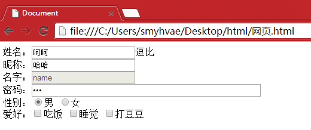

### `<select>`：下拉列表标签

`<select>`标签里面的每一项用`<option>`表示。select就是“选择”，option“选项”。

select标签和ul、ol、dl一样，都是组标签。

**`<select>`标签的属性：**

- `multiple`：可以对下拉列表中的选项进行多选。属性值为 multiple，也可以没有属性值。也就是说，既可以写成 `multiple=""`，也可以写成`multiple="multiple"`。
- `size="3"`：如果属性值大于1，则列表为滚动视图。默认属性值为1，即下拉视图。

**`<option>`标签的属性：**

- `selected`：预选中。没有属性值。

```html
<form>
		<select>
			<option>小学</option>
			<option>初中</option>
			<option>高中</option>
			<option>大学</option>
			<option selected="">研究生</option>
		</select>
		<br><br><br>

		<select size="3">
			<option>小学</option>
			<option>初中</option>
			<option>高中</option>
			<option>大学</option>
			<option>研究生</option>
		</select>
		<br><br><br>

		<select multiple="">
			<option>小学</option>
			<option>初中</option>
			<option selected="">高中</option>
			<option selected="">大学</option>
			<option>研究生</option>
		</select>
		<br><br><br>

	</form>
```

### `<textarea>`标签：多行文本输入框

text 就是“文本”，area 就是“区域”。

**属性：**

- `rows="4"`：指定文本区域的行数。
- `cols="20"`：指定文本区域的列数。
- `readonly`：只读。

```html
	<form>
		<textarea name="txtInfo" rows="4" cols="20">1、不爱摄影不懂设计的程序猿不是一个好的产品经理。</textarea>
	</form>
```

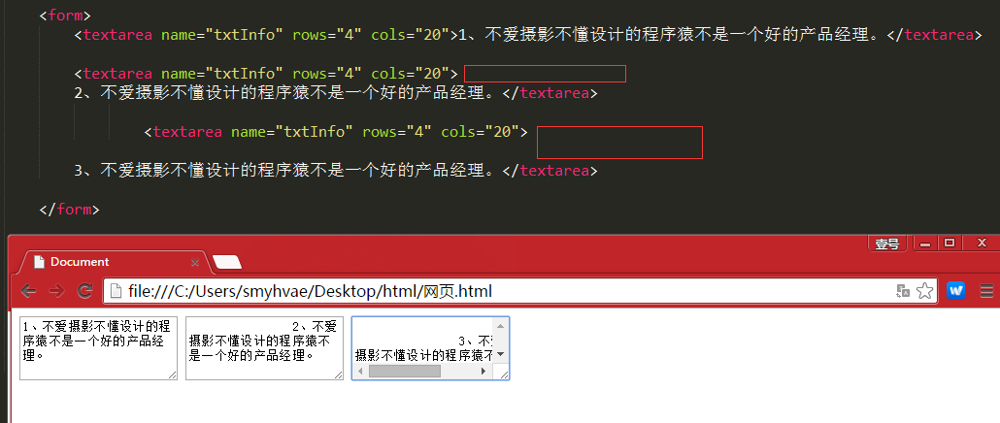

上图的红框部分表示，我在文本区域进行了换行，所以显示的效果也出现了空白。

### 表单的语义化

比如，我们在注册一个网站的信息的时候，有一部分是必填信息，有一部分是选填信息，这个时候可以利用表单的语义化。 举例

```html
	<form>

		<fieldset>
		<legend>账号信息</legend>
		姓名：<input value="呵呵" >逗比<br>
		密码：<input type="password" value="pwd" size="50"><br>
		</fieldset>

		<fieldset>
		<legend>其他信息</legend>
		性别：<input type="radio" name="gender" value="male" checked="">男
			  <input type="radio" name="gender" value="female" >女<br>
		爱好：<input type="checkbox" name="love" value="eat">吃饭
			  <input type="checkbox" name="love" value="sleep">睡觉
			  <input type="checkbox" name="love" value="bat">打豆豆
		</fieldset>

	</form>
```

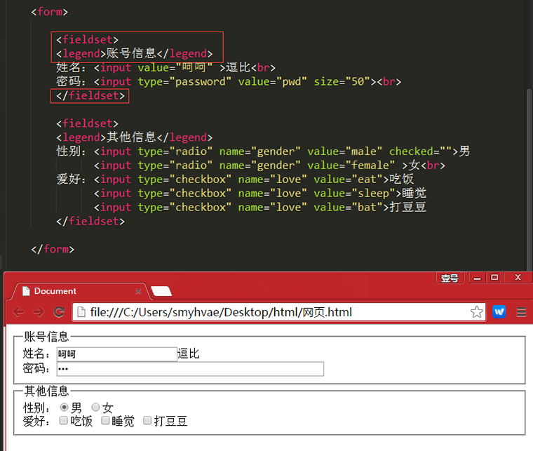

### `<label>`标签

我们先来看下面一段代码：

```html
<input type="radio" name="sex" /> 男
<input type="radio" name="sex" /> 女
```


对于上面这样的单选框，我们只有点击那个单选框（小圆圈）才可以选中，点击“男”、“女”这两个文字时是无法选中的；于是，label标签派上了用场。

本质上来讲，“男”、“女”这两个文字和input标签时没有关系的，而label就是解决这个问题的。我们可以通过label把input和汉字包裹起来作为整体。

解决方法如下：

```html
<input type="radio" name="sex" id="nan" /> <label for="nan">男</label>
<input type="radio" name="sex" id="nv"  /> <label for="nv">女</label>
```

上方代码中，让label标签的**for 属性值**，和 input 标签的 **id 属性值相同**，那么这个label和input就有绑定关系了。

## html废弃标签介绍

HTML现在只负责语义，而不负责样式。但是HTML一开始，连样式也包办了。这些样式的标签，都已经被废弃。

2004年之前的东西：

```html
<font size="9" color="red">哈哈</font>
```

下面这些标签都是css钩子，而不是原意：

```html
	<b>加粗</b>
	<u>下划线</u>
	<i>倾斜</i>
    <del>删除线</del>
	<em>强调</em>
	<strong>强调</strong>
```

这些标签，是有着浓厚的样式的作用，干涉了css的作用，所以HTML抛弃了他们。

类似的还有水平线标签：

```html
<hr />
```

换行标签：

```text
<br />
```

但是，网页中99.9999%需要换行的时候，是因为另起了一个段落，所以要用p，而不要用`<br />`。不到万不得已，不要用br标签。

# 08-HTML5详解

## HTML5的介绍

### [#](https://web.qianguyihao.com/01-HTML/08-HTML5详解.html#web-技术发展时间线)Web 技术发展时间线

- 1991 HTML
- 1994 HTML2
- 1996 CSS1 + JavaScript
- 1997 HTML4
- 1998 CSS2
- 2000 XHTML1（严格的html）
- 2002 Tableless Web Design（表格布局）
- 2005 AJAX
- 2009 HTML5
- 2014 HTML5 Finalized

2002年的表格布局逐渐被淘汰，是因为：表格是用来承载数据的，并不是用来划分网页结构的。

2009年就已经推出了HTML5的草案，但直到2014年才有定稿，是因为有移动端的推动。

H5草案的前身是叫：Web Application，最早是由[WHATWG (opens new window)](https://baike.baidu.com/item/WHATWG/5803339?fr=aladdin)这个组织在2004年提出的。

2007年被 W3C 组织接纳，并在 2008-01-22 发布 HTML5 的第一个草案。

### 什么是 HTML5

HTML5并不仅仅只是做为HTML标记语言的一个最新版本，更重要的是它**制定了Web应用开发的一系列标准**，成为第一个将Web做为应用开发平台的HTML语言。

HTML5定义了一系列新元素，如新语义标签、智能表单、多媒体标签等，可以帮助开发者创建富互联网应用，还提供了一些Javascript API，如地理定位、重力感应、硬件访问等，可以在浏览器内实现类原生应用。我们甚至可以结合 Canvas 开发网页版游戏。

**`HTML5`的广义概念**：HTML5代表浏览器端技术的一个发展阶段。在这个阶段，浏览器的呈现技术得到了飞跃发展和广泛支持，它包括：HTML5、CSS3、Javascript API在内的一套技术组合。

`HTML5`不等于 `HTML next version`。`HTML5` 包含： `HTML`的升级版、`CSS`的升级版、`JavaScript API`的升级版。

**总结**：`HTML5`是新一代开发 **Web 富客户端**应用程序整体**解决方案**。包括：HTML5，CSS3，Javascript API在内的一套**技术组合**。

## 语义化的标签

### [#](https://web.qianguyihao.com/01-HTML/08-HTML5详解.html#语义化的作用)语义化的作用

语义标签对于我们并不陌生，如`<p>`表示一个段落、`<ul>`表示一个无序列表。**标签语义化的作用：**

- 能够便于开发者阅读和写出更优雅的代码。
- 同时让浏览器或是网络爬虫可以很好地解析，从而更好分析其中的内容。
- 更好地搜索引擎优化。

总结：HTML的职责是描述一块内容是什么（或其意义），而不是它长什么样子；它的外观应该由CSS来决定。

### [#](https://web.qianguyihao.com/01-HTML/08-HTML5详解.html#h5在语义上的改进)H5在语义上的改进

在此基础上，HTML5 增加了大量有意义的语义标签，更有利于搜索引擎或辅助设备理解 HTML 页面内容。HTML5会让HTML代码的内容更结构化、标签更语义化。

我们常见的 css+div 布局是：

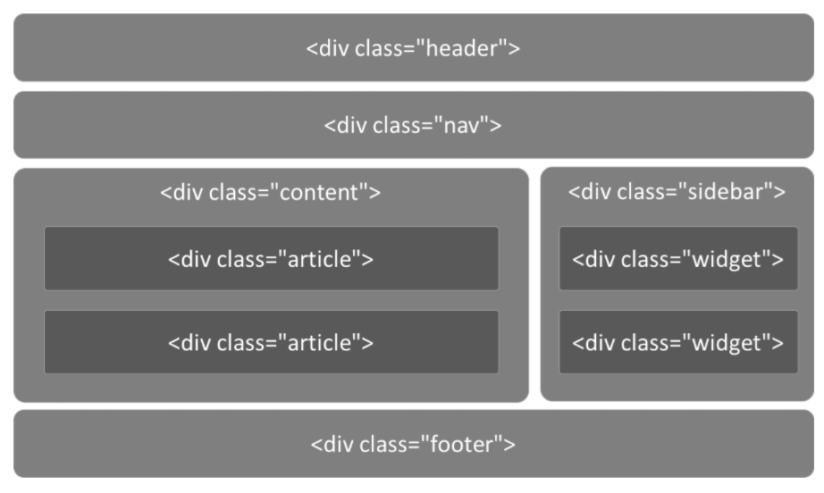

在html5中，我们可以这样写：

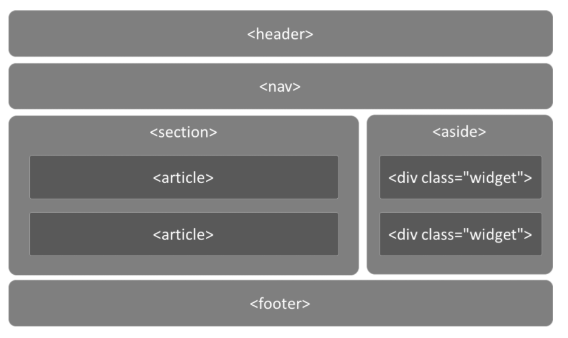

传统的做法中，我们通过增加类名如`class="header"`、`class="footer"`，使HTML页面具有语义性，但是不具有通用性。

HTML5 则是通过新增语义标签的形式来解决这个问题，例如`<header></header>`、`<footer></footer>`等，这样就可以使其具有通用性。

```html
<!-- 头部 -->
<header>
    <ul class="nav"></ul>
</header>

<!-- 主体部分 -->
<div class="main">
    <!-- 文章 -->
    <article></article>
    <!-- 侧边栏 -->
    <aside></aside>
</div>

<!-- 底部 -->
<footer>

</footer>
```

## H5中新增的语义标签

- `<section>` 表示区块
- `<article>` 表示文章。如文章、评论、帖子、博客
- `<header>` 表示页眉
- `<footer>` 表示页脚
- `<nav>` 表示导航
- `<aside>` 表示侧边栏。如文章的侧栏

- `<figure>` 表示媒介内容分组。
- `<mark>` 表示标记 (用得少)
- `<progress>` 表示进度 (用得少)
- `<time>` 表示日期

本质上新语义标签与`<div>`、`<span>`没有区别，只是其具有表意性，使用时除了在HTML结构上需要注意外，其它和普通标签的使用无任何差别，可以理解成`<div class="nav">` 相当于`<nav>`

## H5中的表单

传统的Web表单已经越来越不能满足开发的需求，HTML5 在 Web 表单方向做了很大的改进，如拾色器、日期/时间组件等，使表单处理更加高效。

### [#](https://web.qianguyihao.com/01-HTML/08-HTML5详解.html#h5中新增的表单类型)H5中新增的表单类型

- `email` 只能输入email格式。自动带有验证功能。
- `tel` 手机号码。
- `url` 只能输入url格式。
- `number` 只能输入数字。
- `search` 搜索框
- `range` 滑动条
- `color` 拾色器
- `time` 时间
- `date` 日期
- `datetime` 时间日期
- `month` 月份
- `week` 星期

```html
<!DOCTYPE html>
<html lang="en">
<head>
    <meta charset="UTF-8">
    <meta name="viewport" content="width=device-width, initial-scale=1, user-scalable=no">
    <title>表单类型</title>
    <style>
        body {
            margin: 0;
            padding: 0;
            background-color: #F7F7F7;
        }

        form {
            max-width: 500px;
            width: 100%;
            margin: 32px auto 0;
            font-size: 16px;
        }

        label {
            display: block;
            margin: 10px 0;
        }

        input {
            width: 100%;
            height: 25px;
            margin-top: 2px;
            display: block;
        }

    </style>
</head>
<body>
<form action="">
    <fieldset>
        <legend>表单类型</legend>
        <label for="">
            email: <input type="email" name="email" required>
        </label>
        <label for="">
            color: <input type="color" name="color">
        </label>
        <label for="">
            url: <input type="url" name='url'>
        </label>
        <label for="">
            number: <input type="number" step="3" name="number">
        </label>
        <label for="">
            range: <input type="range" name="range" value="100">
        </label>
        <label for="">
            search: <input type="search" name="search">
        </label>
        <label for="">
            tel: <input type="tel" name="tel">
        </label>
        <label for="">
            time: <input type="time" name="time">
        </label>
        <label for="">
            date: <input type="date" name="date">
        </label>
        <label for="">
            datetime: <input type="datetime">
        </label>
        <label for="">
            week: <input type="week" name="week">
        </label>
        <label for="">
            month: <input type="month" name="month">
        </label>
        <label for="">
            datetime-local: <input type="datetime-local" name="datetime-local">
        </label>
        <input type="submit">
    </fieldset>
</form>
</body>
</html>
```

代码解释：

`<fieldset>` 标签将表单里的内容进行打包，代表一组；而`<legend>`标签的则是 fieldset 里的元素定义标题。

### 表单元素（标签）

这里讲两个表单元素。

**1、`<datalist>` 数据列表：**

```html
<input type="text" list="myData">
<datalist id="myData">
    <option>本科</option>
    <option>研究生</option>
    <option>不明</option>
</datalist>
```

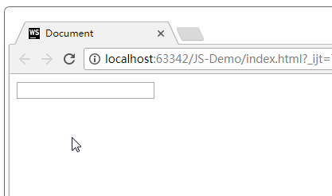

2、`<keygen>`元素：

keygen 元素的作用是提供一种验证用户的可靠方法。

keygen 元素是密钥对生成器（key-pair generator）。当提交表单时，会生成两个键：一个公钥，一个私钥。

私钥（private key）存储于客户端，公钥（public key）则被发送到服务器。公钥可用于之后验证用户的客户端证书（client certificate）。

3、`<meter>`元素：度量器

- low：低于该值后警告
- high：高于该值后警告
- value：当前值
- max：最大值
- min：最小值。

举例：

```js
<meter  value="81"    min="0" max="100"  low="60"  high="80"/>
```

### 表单属性

- `placeholder` 占位符（提示文字）
- `autofocus` 自动获取焦点
- `multiple` 文件上传多选或多个邮箱地址
- `autocomplete` 自动完成（填充的）。on 开启（默认），off 取消。用于表单元素，也可用于表单自身(on/off)
- `form` 指定表单项属于哪个form，处理复杂表单时会需要
- `novalidate` 关闭默认的验证功能（只能加给form）
- `required` 表示必填项
- `pattern` 自定义正则，验证表单。例如

代码举例：

```html
<!DOCTYPE html>
<html>

<head lang="en">
    <meta charset="UTF-8">
    <title></title>
    <style>
        form {
            width: 100%;
            /* 最大宽度*/
            max-width: 640px;
            /* 最小宽度*/
            min-width: 220px;
            margin: 0 auto;
            font-family: "Microsoft Yahei";
            font-size: 20px;
        }

        input {
            display: block;
            width: 100%;
            height: 30px;
            margin: 10px 0;
        }
    </style>
</head>

<body>

    <form action="">
        <fieldset>
            <legend>表单属性</legend>
            <label for="">
                用户名：<input type="text" placeholder="例如：smyhvae" autofocus name="userName" autocomplete="on" required />
            </label>

            <label for="">
                电话：<input type="tel" pattern="1\d{10}" />
            </label>

            <label for="">
                multiple的表单: <input type="file" multiple>
            </label>

            <!-- 上传文件-->
            <input type="file" name="file" multiple />

            <input type="submit" />
        </fieldset>
    </form>

</body>

</html>
```

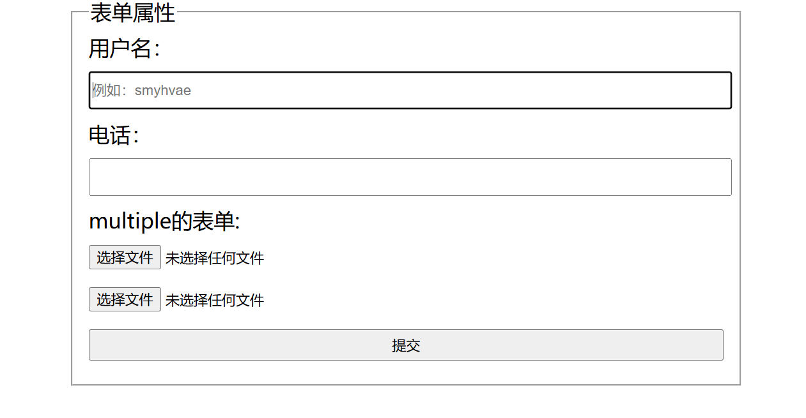

##  DOM 操作

### 获取元素

- document.querySelector("selector") 通过CSS选择器获取符合条件的第一个元素。
- document.querySelectorAll("selector") 通过CSS选择器获取符合条件的所有元素，以类数组形式存在。

### [#](https://web.qianguyihao.com/01-HTML/08-HTML5详解.html#类名操作)类名操作

- Node.classList.add("class") 添加class
- Node.classList.remove("class") 移除class
- Node.classList.toggle("class") 切换class，有则移除，无则添加
- Node.classList.contains("class") 检测是否存在class

### [#](https://web.qianguyihao.com/01-HTML/08-HTML5详解.html#自定义属性)自定义属性

js 里可以通过 `box1.index=100;` `box1.title` 来自定义属性和获取属性。

H5可以直接在标签里添加自定义属性，**但必须以 `data-` 开头**。

```html
<div id="box1" data-index="100" data-type="container">内容</div>
```

```js
let box1 = document.querySelector("#box1");

// 通过 dataset 获取自定义属性
console.log(box1.dataset.index);  // 输出: "100" （字符串）
console.log(box1.dataset.type);   // 输出: "container"

// 设置自定义属性
box1.dataset.index = 200;         // 修改 data-index 的值
console.log(box1.dataset.index);  // 输出: "200"
```

HTML输出

```html
<div id="box1" data-index="200" data-type="container">内容</div>
```

**data- 前缀**:

- HTML5 规定，所有自定义属性必须以 data- 开头，比如 data-index、data-type。
- 这是为了区分标准属性（比如 id、class）和用户自定义属性，避免命名冲突。