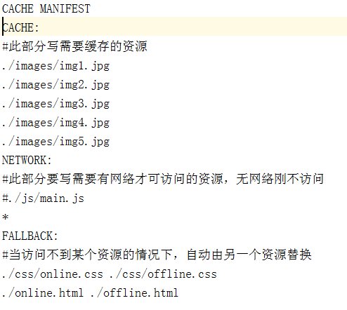

# 10-HTML5详解（二）

## 本文主要内容

- 拖拽
- 历史
- 地理位置
- 全屏

### 1、拖拽元素

页面中设置了 `draggable="true"` 属性的元素。

```html
<!DOCTYPE html>
<html lang="en">
<head>
    <meta charset="UTF-8">
    <meta name="viewport" content="width=device-width, initial-scale=1.0">
    <title>Document</title>
    <style>
        .box1{
            width: 200px;
            height: 200px;
            background-color: aqua;
        }
    </style>
</head>
<body>
    <div class="box1" draggable="true"></div>
</body>
</html>
```

上图中，我们给 box1 增加了`draggable="true"` 属性之后，发现 box1 是可以拖拽的。但是拖拽之后要做什么事情呢？这就涉及到**事件监听**。

**拖拽元素的事件监听**：（应用于拖拽元素）

- `ondragstart`当拖拽开始时调用
- `ondragleave` 当**鼠标离开拖拽元素时**调用
- `ondragend` 当拖拽结束时调用
- `ondrag` 整个拖拽过程都会调用


### 2、目标元素

比如说，你想把元素A拖拽到元素B里，那么元素B就是目标元素。

页面中任何一个元素都可以成为目标元素。

**目标元素的事件监听**：（应用于目标元素）

- `ondragenter` 当拖拽元素进入时调用
- `ondragover` 当拖拽元素停留在目标元素上时，就会连续一直触发（不管拖拽元素此时是移动还是不动的状态）
- `ondrop` 当在目标元素上松开鼠标时调用
- `ondragleave` 当鼠标离开目标元素时调用

代码演示：

```html
    <style>
        .one {
            width: 200px;
            height: 400px;
            border: 1px solid #000;
        }

        .one>div,
        .two>div {
            width: 98.59px;
            height: 98.59px;
            border: 1px solid #000;
            border-radius: 50%;
            background-color: red;
            float: left;
            text-align: center;
            line-height: 98px;
        }

        .two {
            width: 400px;
            height: 400px;
            border: 1px solid #000;
            position: absolute;
            left: 600px;
            top: 200px;
        }
    </style>
</head>

<body>
    <div class="one">
        <div draggable="true">1</div>
        <div draggable="true">2</div>
        <div draggable="true">3</div>
        <div draggable="true">4</div>
        <div draggable="true">5</div>
        <div draggable="true">6</div>
        <div draggable="true">7</div>
        <div draggable="true">8</div>
    </div>
    <div class="two"></div>

    <script>
        var boxs = document.querySelectorAll('.one div');
        //        临时的盒子 用于存放当前拖拽的元素

        var two = document.querySelector('.two');

        var temp = null;
        //         给8个小盒子分别绑定拖拽事件
        for (var i = 0; i < boxs.length; i++) {
            boxs[i].ondragstart = function () {
                //                保持当前拖拽的元素
                temp = this;
                console.log(temp);
            }

            boxs[i].ondragend = function () {
                //               当拖拽结束 ，清空temp
                temp = null;
                console.log(temp);
            }
        }

        //        目标元素的拖拽事件
        two.ondragover = function (e) {
            //            阻止拖拽的默认行为
            e.preventDefault();
        }
        //        当在目标元素上松开鼠标是触发
        two.ondrop = function () {
            //            将拖拽的元素追加到 two里面来
            this.appendChild(temp);
        }
    </script>
```

## 历史

界面上的所有JS操作不会被浏览器记住，就无法回到之前的状态。

在HTML5中可以通过 `window.history` 操作访问历史状态，让一个页面可以有多个历史状态

`window.history`对象可以让我们管理历史记录，可用于单页面应用，Single Page Application，可以无刷新改变网页内容。

- window.history.forward(); // 前进
- window.history.back(); // 后退
- window.history.go(); // 刷新
- window.history.go(n); //n=1 表示前进；n=-1 后退；n=0s 刷新。如果移动的位置超出了访问历史的边界，会静默失败，但不会报错。
- 通过JS可以加入一个访问状态
- history.pushState; //放入历史中的状态数据, 设置title(现在浏览器不支持改变历史状态)

```HTML
<!DOCTYPE html>
<html lang="zh">

<head>
    <meta charset="UTF-8">
    <title>历史状态示例</title>
</head>

<body>
    <button onclick="goToState('state1')">状态1</button>
    <button onclick="goToState('state2')">状态2</button>
    <div id="content">初始内容</div>

    <script>
        function goToState(stateName) {
            // 更新界面内容
            document.getElementById("content").innerText = `当前状态: ${stateName}`;

            // 添加新的历史状态
            history.pushState(
                { page: stateName }, // 状态数据
                "", // 标题（忽略）
                `?state=${stateName}` // 更新 URL
            );
        }

        // 监听 popstate 事件，当用户点击后退/前进时触发
        window.onpopstate = function (event) {
            if (event.state) {
                document.getElementById("content").innerText = `当前状态: ${event.state.page}`;
            }
        };
    </script>
</body>

</html>
```

## 地理定位

在HTML规范中，增加了获取用户地理信息的API，这样使得我们可以基于用户位置开发互联网应用，即**基于位置服务 LBS** (Location Base Service)。

### API详解

- navigator.getCurrentPosition(successCallback, errorCallback, options) 获取当前地理信息
- navigator.watchPosition(successCallback, errorCallback, options) 重复获取当前地理信息

1、当成功获取地理信息后，会调用succssCallback，并返回一个包含位置信息的对象position：（Coords即坐标）

- position.coords.latitude纬度
- position.coords.longitude经度

2、当获取地理信息失败后，会调用errorCallback，并返回错误信息error。

3、可选参数 options 对象可以调整位置信息数据收集方式

地理位置的 api 代码演示：

```html
<!DOCTYPE html>
<html>
<head lang="en">
    <meta charset="UTF-8">
    <title></title>
</head>
<body>
    <script>
        /*navigator 导航*/
        //geolocation: 地理定位
//        window.navigator.geolocation
//        兼容处理
        if(navigator.geolocation){
//       如果支持，获取用户地理信息

//            successCallback 当获取用户位置成功的回调函数
//            errorCallback 当获取用户位置失败的回调函数

            navigator.geolocation.getCurrentPosition(successCallback,errorCallback);

        }else{
            console.log('sorry,你的浏览器不支持地理定位');
        }
        // 获取地理位置成功的回调函数
        function successCallback(position){
//            获取用户当前的经纬度
//            coords坐标
//            纬度latitude
            var wd=position.coords.latitude;
//            经度longitude
            var jd=position.coords.longitude;

            console.log("获取用户位置成功！");
            console.log(wd+'----------------'+jd);
//          40.05867366972477----------------116.33668634275229

//            谷歌地图：40.0601398850,116.3434224706
//            百度地图：40.0658210000,116.3500430000
//            腾讯高德：40.0601486487,116.3434373643
        }
        // 获取地理位置失败的回调函数
        function errorCallback(error){
            console.log(error);
            console.log('获取用户位置失败！')
        }
    </script>
</body>
</html>
```

## 全屏

### [#](https://web.qianguyihao.com/01-HTML/10-HTML5详解（二）.html#开启-关闭全屏显示)开启/关闭全屏显示

方法如下：（注意 screen 是小写）

```html
requestFullscreen()   //让元素开启全屏显示

	cancleFullscreen()    //让元素关闭全屏显示
```

为考虑兼容性问题，不同的浏览器需要**在此基础之上**，添加私有前缀，比如：（注意 screen 是大写）

```javascript
	webkitRequestFullScreen
	 webkitCancleFullScreen

	mozRequestFullScreen
	mozCancleFullScreen
```

### 检测当前是否处于全屏状态

方法如下：

```text
	document.fullScreen
```

不同浏览器需要加私有前缀，比如：

```javascript
     document.webkitIsFullScreen

     document.mozFullScren
```

### [#](https://web.qianguyihao.com/01-HTML/10-HTML5详解（二）.html#全屏的伪类)全屏的伪类

- :full-screen .box {}
- :-webkit-full-screen {}
- :moz-full-screen {}

比如说，当元素处于全屏状态时，改变它的样式。这时就可以用到伪类。

```html
<!DOCTYPE html>
<html>
<head lang="en">
    <meta charset="UTF-8">
    <title></title>
    <style>
        .box {
            width: 250px;
            height: 250px;
            background-color: green;
            margin: 100px auto;
            border-radius: 50%;
        }

        /*全屏伪类：当元素处于全屏时，改变元素的背景色*/
        .box:-webkit-full-screen {
            background-color: red;
        }
    </style>
</head>
<body>
<div class="box"></div>

<script>
    var box = document.querySelector('.box');
    // box.requestFullscreen();   //直接这样写是没有效果的。之所以无效，应该是浏览器的机制，必须要点一下才可以实现全屏功能。
    document.querySelector('.box').onclick = function () {
        // 开启全屏显示的兼容写法
        if (box.requestFullscreen) {  //如果支持全屏，那就让元素全屏
            box.requestFullscreen();
        } else if (box.webkitRequestFullScreen) {
            box.webkitRequestFullScreen();
        } else if (box.mozRequestFullScreen) {
            box.mozRequestFullScreen();
        }

    }
</script>
</body>
</html>
```

# 11-HTML5详解（三）

##  Web 存储

随着互联网的快速发展，基于网页的应用越来越普遍，同时也变的越来越复杂，为了满足各种各样的需求，会经常性在本地存储大量的数据，传统方式我们以document.cookie来进行存储的，但是由于其存储大小只有4k左右，并且解析也相当的复杂，给开发带来诸多不便，HTML5规范则提出解决方案。

### H5 中有两种存储的方式

1、**`window.sessionStorage` 会话存储：**

- 保存在内存中。
- **生命周期**为关闭浏览器窗口。也就是说，当窗口关闭时数据销毁。
- 在同一个窗口下数据可以共享。

2、**`window.localStorage` 本地存储**：

- 有可能保存在浏览器内存里，有可能在硬盘里。
- 永久生效，除非手动删除（比如清理垃圾的时候）。
- 可以多窗口共享。

### Web 存储的特性

（1）设置、读取方便。

（2）容量较大，sessionStorage 约5M、localStorage 约20M。

（3）只能存储字符串，可以将对象 JSON.stringify() 编码后存储。

### 常见 API

设置存储内容：

```javascript
	setItem(key, value);
```

PS：可以新增一个 item，也可以更新一个 item。

读取存储内容：

```javascript
	getItem(key);
```

根据键，删除存储内容：

```javascript
	removeItem(key);
```

清空所有存储内容：

```javascript
	clear();
```

根据索引值来获取存储内容：

```javascript
	key(n);
```

sessionStorage 的 API 举例：

```html
<!DOCTYPE html>
<html>
<head lang="en">
    <meta charset="UTF-8">
    <title></title>
</head>
<body>
<input type="text"/>
<button>sesssionStorage存储</button>
<button>sesssionStorage获取</button>
<button>sesssionStorage更新</button>
<button>sesssionStorage删除</button>
<button>sesssionStorage清除</button>
<script>

    //在h5中提供两种web存储方式

    // sessionStorage  session（会话，会议） 5M  当窗口关闭是数据销毁  内存
    // localStorage    20M 永久生效 ，除非手动删除  清理垃圾  硬盘上

    var txt = document.querySelector('input');

    var btns = document.querySelectorAll('button');
    //        sessionStorage存储数据
    btns[0].onclick = function () {
        window.sessionStorage.setItem('userName', txt.value);
        window.sessionStorage.setItem('pwd', '123456');
        window.sessionStorage.setItem('age', 18);
    }

    //        sessionStorage获取数据
    btns[1].onclick = function () {
        txt.value = window.sessionStorage.getItem('userName');
    }

    //        sessionStorage更新数据
    btns[2].onclick = function () {
        window.sessionStorage.setItem('userName', txt.value);
    }

    //        sessionStorage删除数据
    btns[3].onclick = function () {
        window.sessionStorage.removeItem('userName');
    }

    //        sessionStorage清空数据
    btns[4].onclick = function () {
        window.sessionStorage.clear();
    }
</script>
</body>
</html>
```

**localStorage 的 API 举例：**

```html
<!DOCTYPE html>
<html>
<head lang="en">
    <meta charset="UTF-8">
    <title></title>
</head>
<body>
<input type="text"/>
<button>localStorage存储</button>
<button>localStorage获取</button>
<button>localStorage更新</button>
<button>localStorage删除</button>
<button>localStorage清除</button>

<script>

    /*
    *  localStorage
    *  数据存在硬盘上
    *  永久生效
    *  20M
    * */

    var txt = document.querySelector('input');
    var btns = document.querySelectorAll('button');

    // localStorage存储数据
    btns[0].onclick = function () {
        window.localStorage.setItem('userName', txt.value);
    }

    // localStorage获取数据
    btns[1].onclick = function () {
        txt.value = window.localStorage.getItem('userName');
    }

    // localStorage删除数据
    btns[3].onclick = function () {
        window.localStorage.removeItem('userName');
    }

</script>
</body>
</html>
```


### 案例：记住用户名和密码

代码：

```html
<!DOCTYPE html>
<html>
<head lang="en">
    <meta charset="UTF-8">
    <title></title>
</head>
<body>
<label for="">
    用户名：<input type="text" class="userName"/>
</label>
<br/><br/>
<label for="">
    密 码：<input type="text" class="pwd"/>
</label>
<br/><br/>
<label for="">
    <input type="checkbox" class="check" id=""/>记住密码
</label>
<br/><br/>
<button>登录</button>

<script>
    var userName = document.querySelector('.userName');
    var pwd = document.querySelector('.pwd');
    var chk = document.querySelector('.check');
    var btn = document.querySelector('button');

    //        当点击登录的时候 如果勾选“记住密码”，就存储密码；否则就清除密码
    btn.onclick = function () {
        if (chk.checked) {
//                记住数据
            window.localStorage.setItem('userName', userName.value);
            window.localStorage.setItem('pwd', pwd.value);
        } else {
//                清除数据
            window.localStorage.removeItem('userName');
            window.localStorage.removeItem('pwd');
        }
    }
    //        下次登录时，如果记录的有数据，就直接填充
    window.onload = function () {
        userName.value = window.localStorage.getItem('userName');
        pwd.value = window.localStorage.getItem('pwd');

    }
</script>
</body>
</html>
```


## 网络状态

我们可以通过 `window.onLine` 来检测用户当前的网络状况，返回一个布尔值。另外：

- window.online：用户网络连接时被调用。
- window.offline：用户网络断开时被调用（拔掉网线或者禁用以太网）。

网络状态监听的代码举例：

网络状态监听的代码举例：

```html
<!DOCTYPE html>
<html>
<head lang="en">
    <meta charset="UTF-8">
    <title></title>
</head>
<body>
<script>
    window.addEventListener('online', function () {
        alert('网络连接建立！');
    });

    window.addEventListener('offline', function () {
        alert('网络连接断开！');
    })
</script>
</body>
</html>
```


## 应用缓存

HTML5中我们可以轻松的构建一个离线（无网络状态）应用，只需要创建一个 `cache manifest` 缓存清单文件。

### 优势

1、可配置需要缓存的资源；

2、网络无连接应用仍可用；

3、本地读取缓存资源，提升访问速度，增强用户体验；

4、减少请求，缓解服务器负担。

### [#](https://web.qianguyihao.com/01-HTML/11-HTML5详解（三）.html#cache-manifest-缓存清单文件)`cache manifest` 缓存清单文件

缓存清单文件中列出了浏览器应缓存，以供离线访问的资源。推荐使用 `.appcache`作为后缀名，另外还要添加MIME类型。

**缓存清单文件里的内容怎样写：**

（1）顶行写CACHE MANIFEST。

（2）CACHE: 换行 指定我们需要缓存的静态资源，如.css、image、js等。

（3）NETWORK: 换行 指定需要在线访问的资源，可使用通配符（也就是：不需要缓存的、必须在网络下面才能访问的资源）。

（4）FALLBACK: 换行 当被缓存的文件找不到时的备用资源（当访问不到某个资源时，自动由另外一个资源替换）。

格式举例1：



格式举例2：

```bash
CACHE MANIFEST

#要缓存的文件
CACHE:
    images/img1.jpg
    images/img2.jpg


#指定必须联网才能访问的文件
NETWORK:
     images/img3.jpg
     images/img4.jpg


#当前页面无法访问是回退的页面
FALLBACK:
    404.html
```

**缓存清单文件怎么用：**

（1）例如我们创建一个名为 `demo.appcache`的文件。例如：

demo.appcache：

```bash
CACHE MANIFEST

# 注释以#开头
#下面是要缓存的文件
CACHE:
    http://img.smyhvae.com/2016040101.jpg
```

（2）在需要应用缓存在页面的根元素(html)里，添加属性manifest="demo.appcache"。路径要保证正确。例如：

```html
<!DOCTYPE html>
<html manifest="demo.appcache">
<head lang="en">
    <meta charset="UTF-8">
    <title></title>
</head>
<body>

</body>
</html>
```

## html 常见面试题

### [#](https://web.qianguyihao.com/01-HTML/12-HTML基础回顾.html#doctype-的意义是什么)doctype 的意义是什么

''<!DOCTYPE>'' 声明（也称为文档类型声明，Document Type Declaration，简称 DTD）是 HTML 文档的第一行代码，位于 html 标签之前。它的主要作用是告诉浏览器应该使用哪种 HTML 或 XHTML 规范来解析文档，从而确保页面按照正确的标准渲染

- 让浏览器以标准模式渲染
- 让浏览器知道元素的合法性

### [#](https://web.qianguyihao.com/01-HTML/12-HTML基础回顾.html#html、xhtml、html5的区别)HTML、XHTML、HTML5的区别

- HTML 属于 SGML（Standard Generalized Markup Language）
- XHTML 属于XML（Extensible Markup Language），是 HTML 进行 XML 严格化的结果
- HTML5 不属于SGML，也不属于 XML（HTML5有自己独立的一套规范），比 XHTML 宽松。

### [#](https://web.qianguyihao.com/01-HTML/12-HTML基础回顾.html#html5-有什么新的变化)HTML5 有什么新的变化

- 新的语义化元素
- 表单增强
- 新的API：离线、音视频、图形、实时通信、本地存储、设备能力等。

### [#](https://web.qianguyihao.com/01-HTML/12-HTML基础回顾.html#em-和-i-的区别)em 和 i 的区别

共同点：二者都是表示斜体。

区别：

- em 是语义化的标签，表示强调。
- i 是纯样式的标签，表示斜体。HTML5 中不推荐使用。

### [#](https://web.qianguyihao.com/01-HTML/12-HTML基础回顾.html#语义化的意义是什么)语义化的意义是什么

- 开发者容易理解，便于维护。
- 机器（搜索引擎、读屏软件等）容易理解结构
- 有助于 SEO

### [#](https://web.qianguyihao.com/01-HTML/12-HTML基础回顾.html#哪些元素可以自闭合)哪些元素可以自闭合

> 自闭合的元素中不能再嵌入别的元素。且 HTML5 中要求加斜杠。

- 表单元素 input
- 图片 img
- br、hr
- meta、link

### [#](https://web.qianguyihao.com/01-HTML/12-HTML基础回顾.html#form-表单的作用)form 表单的作用

- 直接提交表单
- 使用 submit / reset 按钮
- 便于浏览器保存表单
- 第三方库（比如 jQuery）可以整体获取值
- 第三方库可以进行表单验证

所以，如果我们是通过 Ajax 提交表单数据，也建议加上 form。