# 01-CSS属性：字体属性和文本属性

##  CSS的单位

html中的单位只有一种，那就是像素px，所以单位是可以省略的，但是在CSS中不一样。 **CSS中的单位是必须要写的**，因为它没有默认单位。

### 绝对单位

1 `in`=2.54`cm`=25.4`mm`=72`pt`=6`pc`。

各种单位的含义：

- `in`：英寸Inches (1 英寸 = 2.54 厘米)
- `cm`：厘米Centimeters
- `mm`：毫米Millimeters
- `pt`：点Points，或者叫英镑 (1点 = 1/72英寸)
- `pc`：皮卡Picas (1 皮卡 = 12 点)

### 相对单位

`px`(Pixel)：像素。px的大小是相对于设备像素（device pixel）和显示器的分辨率（DPI，Dots Per Inch）来定义的。

 `em`：em是一个相对单位，它的大小是相对于**当前元素的字体大小（font-size）\**或\**父元素的字体大小**来计算的。

- 如果用于font-size，1em等于父元素的字体大小。
- 如果用于其他属性（如width、margin等），1em等于当前元素的字体大小。

 `%`：百分比，相对周围的文字的大小

- 对于宽度（width）或高度（height），%通常是相对于父元素的对应尺寸。
- 对于字体大小（font-size），%是相对于父元素的字体大小。
- 对于定位属性（如top、left），%是相对于包含块（containing block）的尺寸。

为什么说像素px是一个相对单位呢，这也很好理解。比如说，电脑屏幕的的尺寸是不变的，但是我们可以让其显示不同的分辨率，在不同的分辨率下，单个像素的长度肯定是不一样的啦。

百分比`%`这个相对单位要怎么用呢？这里也举个例子：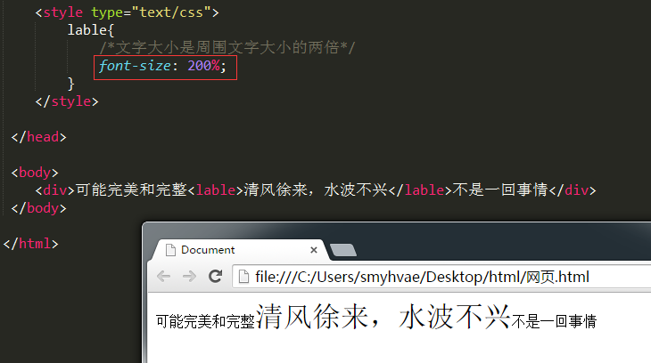

## font 字体属性

CSS中，有很多**非布局样式**（与布局无关），包括：字体、行高、颜色、大小、背景、边框、滚动、换行、装饰性属性（粗体、斜体、下划线）等。

这一段，我们先来讲一下字体属性。

css样式中，常见的字体属性有以下几种：

```css
p{
	font-size: 50px; 		/*字体大小*/
	line-height: 30px;      /*行高*/
	font-family: 幼圆,黑体; 	/*字体类型：如果没有幼圆就显示黑体，没有黑体就显示默认*/
	font-style: italic ;		/*italic表示斜体，normal表示不倾斜*/
	font-weight: bold;	/*粗体*/
	font-variant: small-caps;  /*小写变大写*/
}
```

### 行高

CSS中，所有的行，都有行高。盒子模型的padding，绝对不是直接作用在文字上的，而是作用在“行”上的

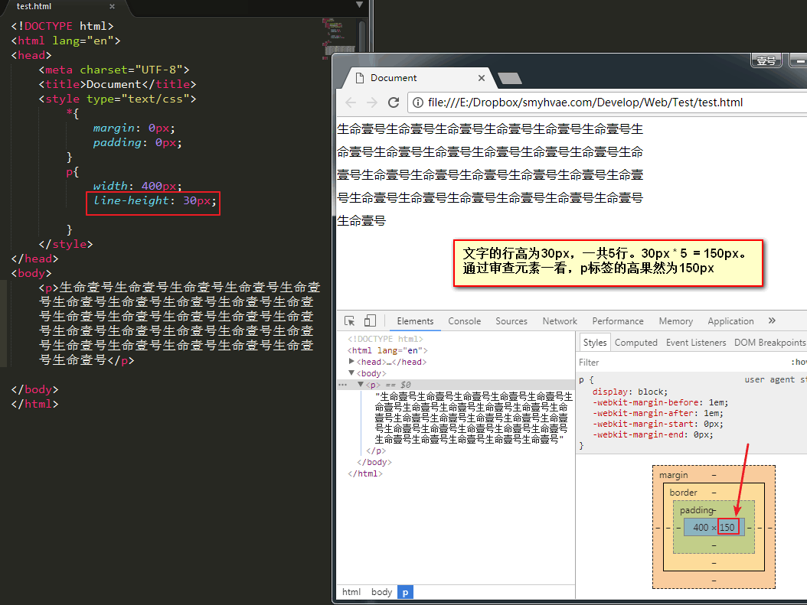

上图中，我们设置行高为30px，30px * 5 = 150px，通过查看审查元素，这个p标签的高度果然为150px。而且我们发现，我们并没有给这个p标签设置高度，显然是内容将其撑高的。

垂直方向来看，文字在自己的行里是居中的。比如，文字是14px，行高是24px，那么padding就是5px：

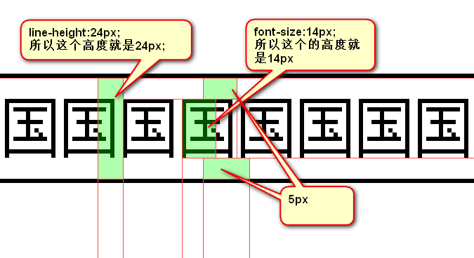为了严格保证字在行里面居中，我们的工程师有一个约定： **行高、字号，一般都是偶数**。这样可以保证，它们的差一定偶数，就能够被2整除。

###  如何让单行文本垂直居中

#### 方法 1：使用 line-height（最简单，适用于单行文本）

- **原理**：将行高（line-height）设置为容器的高度，使文本在行高中垂直居中。

- 代码示例：

  ```css
  .container {
    height: 50px; /* 容器高度 */
    line-height: 50px; /* 行高等于容器高度 */
    text-align: center; /* 水平居中，可选 */
  }
  ```

- HTML

  `<div class="container">单行文本</div>`

- 优点：

  - 简单直接，适用于单行文本。
  - 不需要额外的元素或复杂计算。

- 注意：

  - 只适用于单行文本，多行文本会导致行间距异常。
  - 如果有内边距（padding），需要调整line-height（减去上下内边距的总和）。

------

#### 方法 2：使用 Flexbox（现代推荐）

- **原理**：利用Flexbox的align-items和justify-content属性实现垂直和水平居中。

- 代码示例：

  ```css
  .container {
    display: flex;
    height: 50px; /* 容器高度 */
    align-items: center; /* 垂直居中 */
    justify-content: center; /* 水平居中，可选 */
  }
  ```

- HTML

  `<div class="container">单行文本</div>`

- 优点：

  - 灵活，支持单行和多行文本。
  - 不受字体大小或行高影响。

- 注意：

  - 需要现代浏览器支持（兼容性已非常好）。

### 字号、行高、字体三大属性

（1）字号：

```text
	font-size:14px;
```

（2）行高：

```text
	line-height:24px;
```

（3）字体：（font-family就是“字体”，family是“家庭”的意思）

```text
	font-family:"宋体";
```

是否加粗属性以及上面这三个属性，我们可以连写：（是否加粗、字号 font-size、行高 line-height、字体 font-family）

格式：

```text
	font: 加粗 字号/行高/ 字体
```

举例：

```text
	font: 400 14px/24px "宋体";
```

PS：400是nomal，700是bold。

上面这几个属性可以连写，但是有一个要求，font属性连写至少要有**字号和字体**，否则连写是不生效的（相当于没有这一行代码）。

**字体属性的说明：**

（1）网页中不是所有字体都能用，因为这个字体要看用户的电脑里面装没装，比如你设置：

```text
	font-family: "华文彩云";
```

上方代码中，如果用户的 Windows 电脑里面没有这个字体，那么就会变成宋体。

页面中，中文我们一般使用：微软雅黑、宋体、黑体。英文使用：Arial、Times New Roman。页面中如果需要其他的字体，就需要单独安装字体，或者切图。

（2）为了防止用户电脑里，没有微软雅黑这个字体。就要用英语的逗号，提供备选字体。如下：（可以备选多个）

```text
	font-family: "微软雅黑","宋体";
```

上方代码表示：如果用户电脑里没有安装微软雅黑字体，那么就是宋体。

（3）我们须将英语字体放在最前面，这样所有的中文，就不能匹配英语字体，就自动的变为后面的中文字体：

```css
	font-family: "Times New Roman","微软雅黑","宋体";
```

（4）行高可以用百分比，表示字号的百分之多少。

一般来说，百分比都是大于100%的，因为行高一定要大于字号。

比如说， `font:12px/200% “宋体”`等价于`font:12px/24px “宋体”`。`200%`可以理解成word里面的2倍行高。

反过来， `font:16px/48px “宋体”;`等价于`font:16px/300% “宋体”`。

## [#](https://web.qianguyihao.com/02-CSS基础/01-CSS属性：字体属性和文本属性.html#文本属性)文本属性

CSS样式中，常见的文本属性有以下几种：

- `letter-spacing: 0.5cm ;` 单个字母之间的间距
- `word-spacing: 1cm;` 单词之间的间距
- `text-decoration: none;` 字体修饰：none 去掉下划线、**underline 下划线**、line-through 中划线、overline 上划线
- `color:red;` 字体颜色
- `text-align: center;` 在当前容器中的对齐方式。属性值可以是：left、right、center（**在当前容器的中间**）、justify
- `text-transform: lowercase;` 单词的字体大小写。属性值可以是：`uppercase`（单词大写）、`lowercase`（单词小写）、`capitalize`（每个单词的首字母大写）

这里来一张表格的图片吧，一览无遗：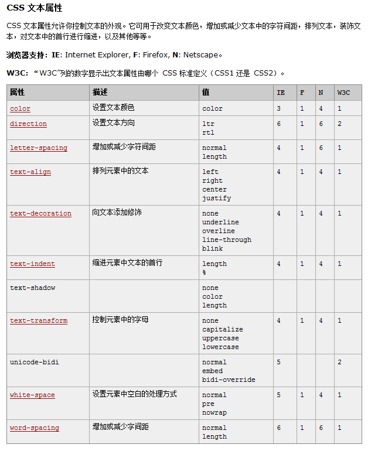

##  列表属性

```css
ul li{
	list-style-image:url(images/2.gif) ;  /*列表项前设置为图片*/
	margin-left:80px;  /*公有属性*/
}
```

另外还有一个简写属性叫做`list-style`，它的作用是：将上面的多个属性写在一个声明中。

我们来看一下`list-style-image`属性的效果：

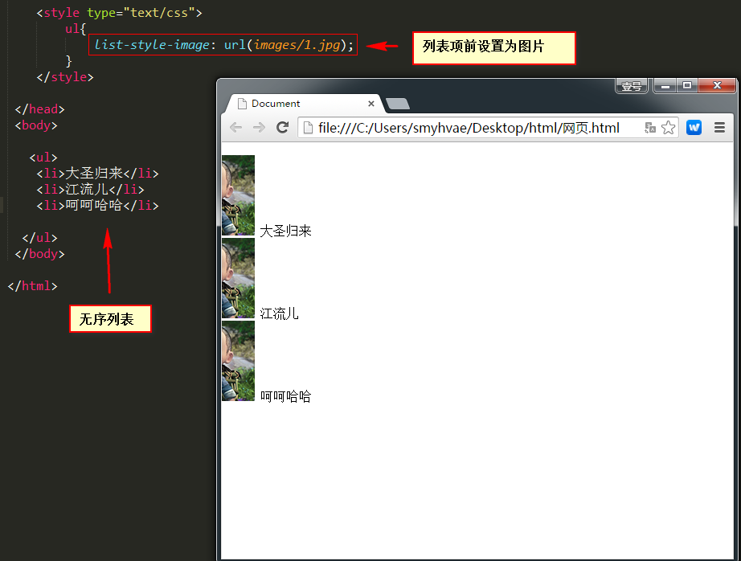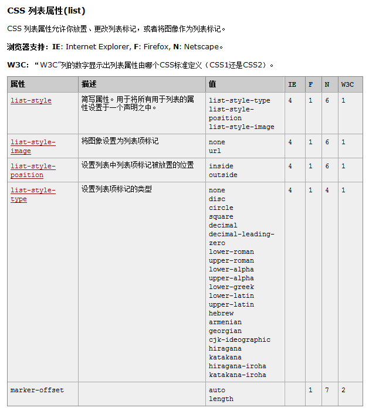

##  overflow属性：超出范围的内容要怎么处理

`overflow`属性的属性值可以是：

- `visible`：默认值。多余的内容不剪切也不添加滚动条，会全部显示出来。
- `hidden`：不显示超过对象尺寸的内容。
- `auto`：如果内容不超出，则不显示滚动条；如果内容超出，则显示滚动条。
- `scroll`：Windows 平台下，无论内容是否超出，总是显示滚动条。Mac 平台下，和 `auto` 属性相同。

针对上面的不同的属性值，我们来看一下效果： 举例：

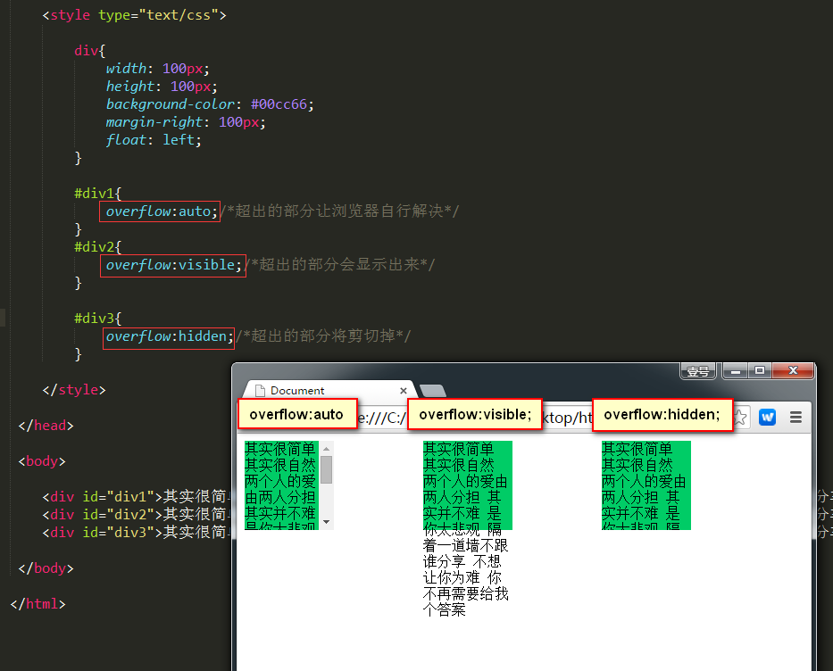

## [#](https://web.qianguyihao.com/02-CSS基础/01-CSS属性：字体属性和文本属性.html#鼠标的属性-cursor)鼠标的属性 cursor

鼠标的属性`cursor`有以下几个属性值：

- `auto`：默认值。浏览器根据当前情况自动确定鼠标光标类型。
- `pointer`：IE6.0，竖起一只手指的手形光标。就像通常用户将光标移到超链接上时那样。
- `hand`：和`pointer`的作用一样：竖起一只手指的手形光标。就像通常用户将光标移到超链接上时那样。

比如说，我想让鼠标放在那个标签上时，光标显示手状，代码如下：

1. **默认和基本指针**

- **auto**：浏览器根据上下文自动决定指针样式（默认值）。

- **default**：默认箭头指针，通常是系统的默认光标。

- pointer

  ：手形指针，常用于表示可点击的元素（如链接或按钮）。

  - 示例：cursor: pointer;（最常用，提示用户可以点击）。

2. **文本相关**

- **text**：文本选择光标（I形），用于可编辑的文本区域。
- **vertical-text**：垂直文本光标，用于垂直书写的文本。
- **not-allowed**：禁止符号，表示操作不可用。

3. **移动和调整大小**

- **move**：十字箭头，表示元素可以被移动。
- **grab**：手掌张开，表示可以抓取（常用于拖拽）。
- **grabbing**：手掌握紧，表示正在抓取。
- **n-resize / s-resize / e-resize / w-resize**：调整大小的单向箭头（北、南、东、西）。
- **ne-resize / nw-resize / se-resize / sw-resize**：调整大小的双向箭头（东北、西北、东南、西南）。
- **ns-resize / ew-resize / nesw-resize / nwse-resize**：双向调整大小的光标。

4. **等待和加载**

- **wait**：沙漏或等待图标，表示正在处理。
- **progress**：箭头加沙漏，表示后台正在加载但仍可交互。

5. **帮助和禁用**

- **help**：问号箭头，表示有帮助信息。
- **no-drop**：禁止放下，表示不能拖放到此处。
- **none**：隐藏鼠标指针。

6. **缩放和上下文**

- **zoom-in**：放大镜加号，表示可以放大。
- **zoom-out**：放大镜减号，表示可以缩小。
- **context-menu**：上下文菜单光标，表示右键菜单可用。

7. **其他**

- **crosshair**：十字光标，常用于精确选择（如绘图工具）。
- **cell**：加号光标，用于表格单元格选择。
- **alias**：快捷方式箭头，表示创建别名或快捷方式。
- **copy**：复制箭头，表示可以复制。

# 02-CSS属性：背景属性

**css2.1** 中，常见的背景属性有以下几种：（经常用到，要记住）

- `background-color:#ff99ff;` 设置元素的背景颜色。
- `background-image:url(images/2.gif);` 将图像设置为背景。
- `background-repeat: no-repeat;` 设置背景图片是否重复及如何重复，默认平铺满。（重要）
  - `no-repeat`不要平铺；
  - `repeat-x`横向平铺；
  - `repeat-y`纵向平铺。
- `background-position:center top;` 设置背景图片在当前容器中的位置。
- `background-attachment:scroll;` 设置背景图片是否跟着滚动条一起移动。 属性值可以是：`scroll`（与fixed属性相反，默认属性）、`fixed`（背景就会被固定住，不会被滚动条滚走）。
- 另外还有一个综合属性叫做`background`，它的作用是：将上面的多个属性写在一个声明中。

**CSS3** 中，新增了一些background属性：

- background-origin
- background-clip 背景裁切
- background-size 调整尺寸
- 多重背景

上面这几个属性经常用到，需要记住。现在我们逐个进行讲解。

## background-color：背景颜色的表示方法

css2.1 中，颜色的表示方法有三种：单词、rgb表示法、十六进制表示法。

比如红色可以有下面的三种表示方法：

```css
	background-color: red;
	background-color: rgb(255,0,0);
	background-color: #ff0000;
```

## `background-repeat`属性

`background-repeat:no-repeat;`设置背景图片是否重复及如何重复，默认平铺满。属性值可以是：

- `no-repeat`（不要平铺）
- `repeat-x`（横向平铺）
- `repeat-y`（纵向平铺）

这个属性在开发的时候也是经常用到的。我们通过设置不同的属性值来看一下效果吧：

（1）不加这个属性时：（即默认时）（背景图片会被平铺满）

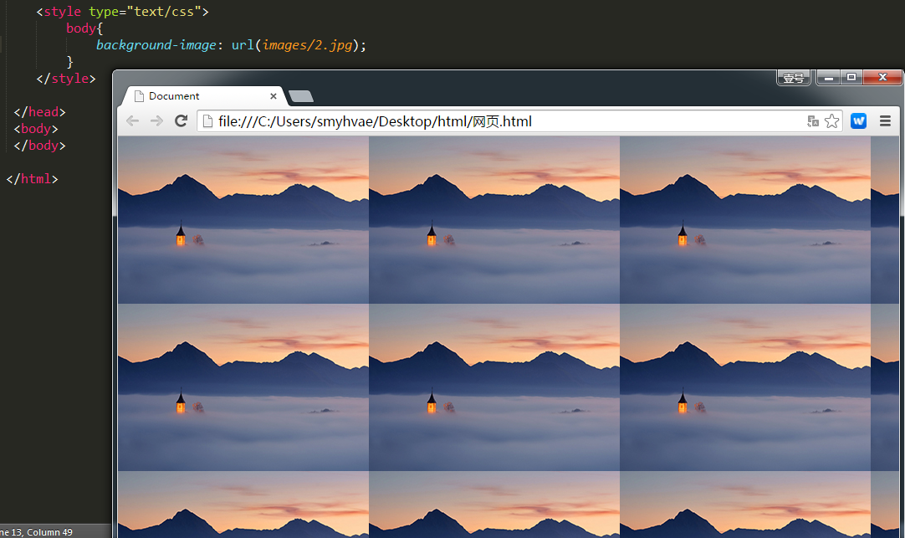

PS：padding的区域也是有背景图的。

（2）属性值为`no-repeat`（不要平铺）时：

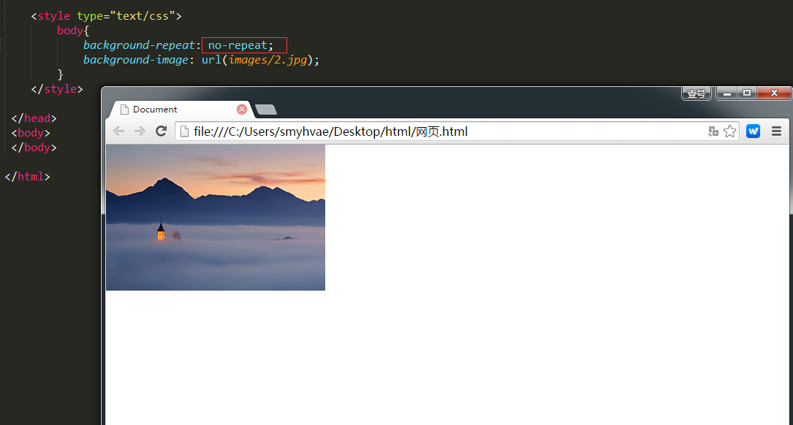

（3）属性值为`repeat-x`（横向平铺）时：

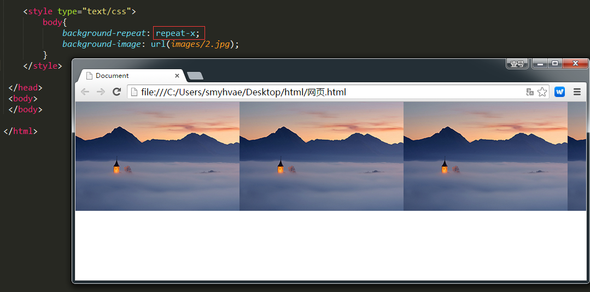

其实这种属性的作用还是很广的。举个例子，设计师设计一张宽度只有1px、颜色纵向渐变的图片，然后我们通过这个属性将其进行水平方向的平铺，就可以看到整个页面都是渐变的了。

在搜索引擎上搜“**平铺背景**”，就可以发现，**周期性的图片**可以采用此种方法进行平铺。

（4）属性值为`repeat-y`（纵向平铺）时：

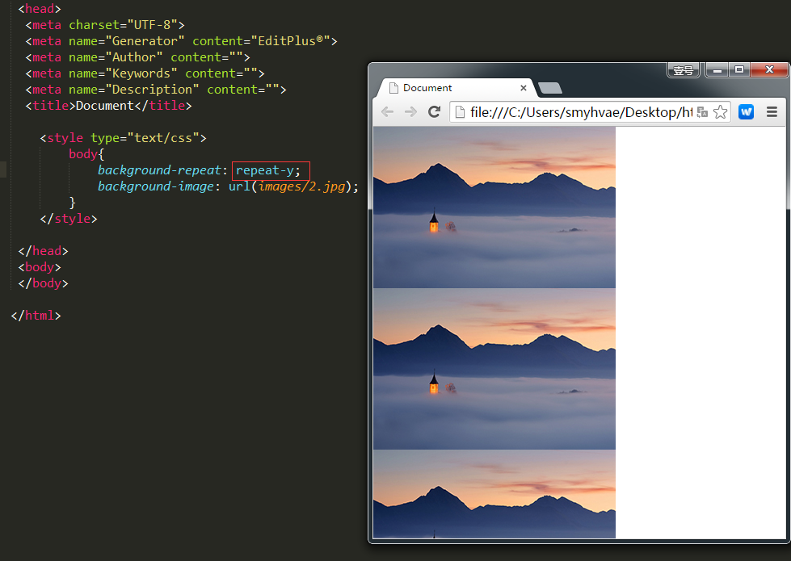

## `background-position`属性

`background-position`属性指的是**背景定位**属性。公式如下：

在描述属性值的时候，有两种方式：用像素描述、用单词描述。下面分别介绍。

**1、用像素值描述属性值：**

格式如下：

```text
background-position:向右偏移量 向下偏移量;
```

属性值可以是正数，也可以是负数。比如：`100px 200px`、`-50px -120px`。

举例如下：

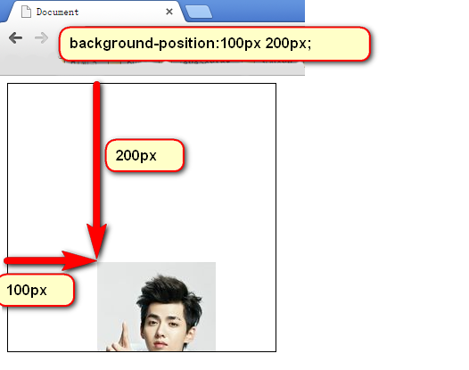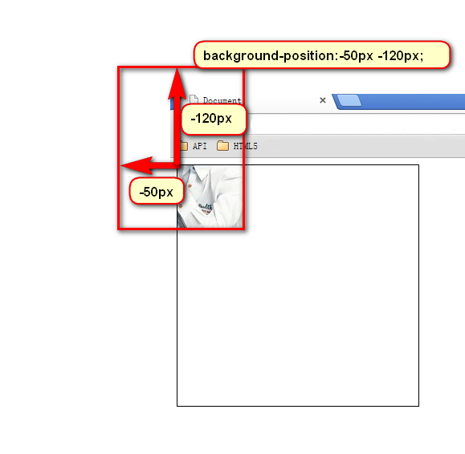

**2、用单词描述属性值：**

格式如下

```text
background-position: 描述左右的词 描述上下的词;
```

- 描述左右的词：left、center、right
- 描述上下的词：top 、center、bottom

比如说，`right center`表示将图片放到右边的中间；`center center`表示将图片放到正中间。

## background-attachment 属性

- ```
  background-attachment:scroll;
  ```

  设置背景图片是否固定。属性值可以是：

  - `fixed`（背景就会被固定住，不会被滚动条滚走）。
  - `scroll`（与fixed属性相反，默认属性）

`background-attachment:fixed;`的效果如下：

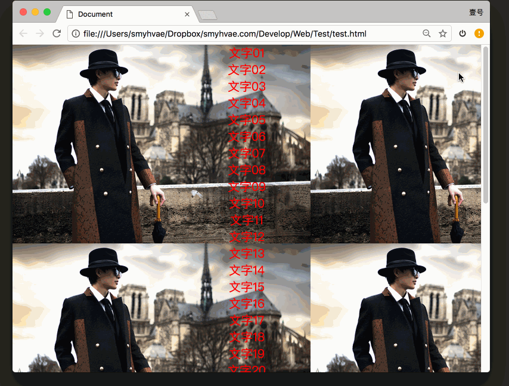

### background 综合属性

background属性和border一样，是一个综合属性，可以将多个属性写在一起。(在[盒子模型 (opens new window)](http://www.cnblogs.com/smyhvae/p/7256371.html)这篇文章中专门讲到border)

举例1:

```css
	background:red url(1.jpg) no-repeat 100px 100px fixed;
```

等价于：

```css
	background-color:red;
	background-image:url(1.jpg);
	background-repeat:no-repeat;
	background-position:100px 100px;
	background-attachment:fixed;
```

## `background-size`属性：背景尺寸

`background-size`属性：设置背景图片的尺寸

```javascript
	/* 宽、高的具体数值 */
	background-size: 500px 500px;

	/* 宽高的百分比（相对于容器的大小） */
	background-size: 50% 50%;   // 如果两个属性值相同，可以简写成：background-size: 50%;

	background-size: 100% auto;  //这个属性可以自己试验一下。

	/* cover：图片始终填充满容器，且保证长宽比不变。图片如果有超出部分，则超出部分会被隐藏。 */
	background-size: cover;

	/* contain：将图片完整地显示在容器中，且保证长宽比不变。可能会导致容器的部分区域为空白。  */
	background-size: contain;
```

这里我们对属性值 `cover` 和 `contain` 进行再次强调：

- `cover`：图片始终**填充满**容器，且保证**长宽比不变**。图片如果有超出部分，则超出部分会被隐藏。
- `contain`：将图片**完整地**显示在容器中，且保证**长宽比不变**。可能会导致容器的部分区域留白。

代码举例：（这张图片本身的尺寸是 1080 * 1350）

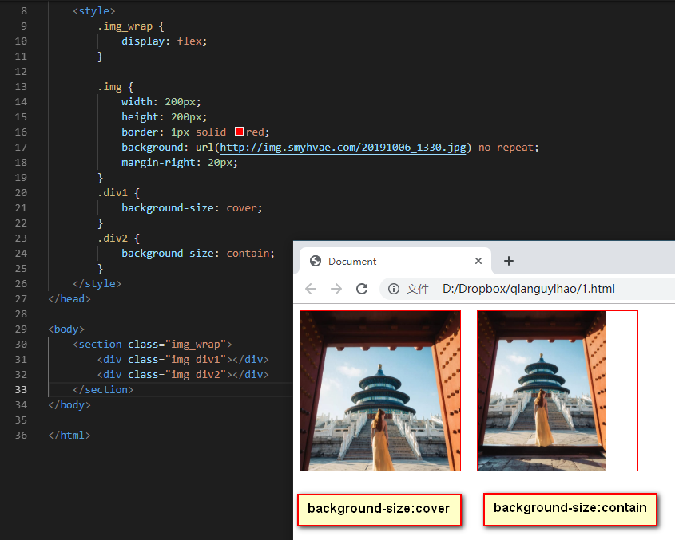

在上方代码的基础之上，再加一个 `background-position: center`属性之后，图片就会在容器里**居中显示**：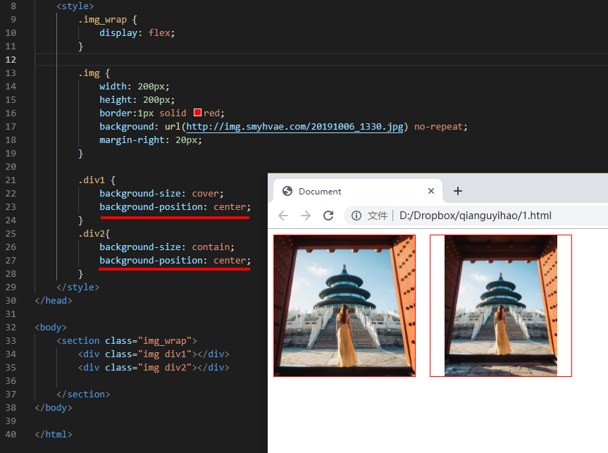

## 背景原点：`background-origin` 属性

`background-origin` 属性：控制背景从什么地方开始显示。

格式举例：

```javascript
	/* 从 padding-box 内边距开始显示背景图 */
	background-origin: padding-box;           //默认值

	/* 从 border-box 边框开始显示背景图  */
	background-origin: border-box;

	/* 从 content-box 内容区域开始显示背景图  */
	background-origin: content-box;
```

## `background-clip`属性：设置元素的背景（背景图片或颜色）是否延伸到边框下面

格式举例：

`background-clip: content-box;` 超出的部分，将裁剪掉。属性值可以是：

- `border-box` 超出 border-box 的部分，将裁剪掉
- `padding-box` 超出 padding-box 的部分，将裁剪掉
- `content-box` 超出 content-box 的部分，将裁剪掉

假设现在有这样的属性设置：

```javascript
	background-origin: border-box;

	background-clip: content-box;
```

上方代码的意思是，背景图片从**边框部分**开始加载，但是呢，超出**内容区域**的部分将被裁减掉。

## 同时设置多个背景

我们可以给一个盒子同时设置多个背景，用以逗号隔开即可。可用于自适应局。

代码举例：

```html
<!DOCTYPE html>
<html>
<head lang="en">
    <meta charset="UTF-8">
    <title></title>
    <style>
        .box {
            height: 416px;
            border: 1px solid #000;
            margin: 100px auto;
            /* 给盒子加多个背景，按照背景语法格式书写，多个背景使用逗号隔开 */
            background: url(images/bg1.png) no-repeat left top,
            url(images/bg2.png) no-repeat right top,
            url(images/bg3.png) no-repeat right bottom,
            url(images/bg4.png) no-repeat left bottom,
            url(images/bg5.png) no-repeat center;
        }
    </style>
</head>
<body>
<div class="box"></div>
</body>
</html>
```

##  渐变：background-image

渐变是CSS3当中比较丰富多彩的一个特性，通过渐变我们可以实现许多炫丽的效果，有效的减少图片的使用数量，并且具有很强的适应性和可扩展性。

渐变分为：

- 线性渐变：沿着某条直线朝一个方向产生渐变效果。
- 径向渐变：从一个**中心点**开始沿着**四周**产生渐变效果。
- 重复渐变。

见下图：

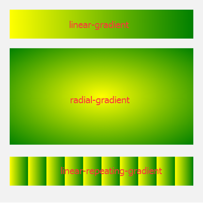

### 线性渐变

格式：

```javascript
    background-image: linear-gradient(方向, 起始颜色, 终止颜色);

    background-image: linear-gradient(to right, yellow, green);
```

参数解释：

- 方向可以是：`to left`、`to right`、`to top`、`to bottom`、角度`30deg`（指的是顺时针方向30°）。

```html
 background-image: linear-gradient(
                    to bottom,
                    #FFB700 0%,
                    #FF8C00 100%
            );
```

### 径向渐变

格式：

```text
background-image: radial-gradient(辐射的半径大小, 中心的位置, 起始颜色, 终止颜色);

	background-image: radial-gradient(100px at center,yellow ,green);
```

解释：围绕中心点做渐变，半径是150px，从黄色到绿色做渐变。

中心点的位置可以是：at left right center bottom top。如果以像素为单位，则中心点参照的是盒子的左上角。

当然，还有其他的各种参数。格式举例

```html
<!DOCTYPE html>
<html>
<head lang="en">
    <meta charset="UTF-8">
    <title></title>
    <style>
        div {
            width: 250px;
            height: 250px;
            border: 1px solid #000;
            margin: 20px;
            float: left;
        }

        /*
            径向渐变：
            radial-gradient（辐射的半径大小, 中心的位置，起始颜色，终止颜色）;
            中心点位置：at  left  right  center bottom  top
        */

        /*辐射半径为100px，中心点在中间*/
        div:nth-child(1) {
            background-image: radial-gradient(100px at center, yellow, green);
        }

        /*中心点在左上角*/
        div:nth-child(3) {
            background-image: radial-gradient(at left top, yellow, green);
        }

        div:nth-child(2) {
            background-image: radial-gradient(at 50px 50px, yellow, green);
        }

        /*设置不同的颜色渐变*/
        div:nth-child(4) {
            background-image: radial-gradient(100px at center,
            yellow 0%,
            green 30%,
            blue 60%,
            red 100%);
        }

        /*如果辐射半径的宽高不同，那就是椭圆*/
        div:nth-child(5) {
            background-image: radial-gradient(100px 50px at center, yellow, green);
        }

    </style>
</head>
<body>
<div class="box"></div>
<div class="box"></div>
<div class="box"></div>
<div class="box"></div>
<div class="box"></div>
</body>
</html>
```

效果如下：

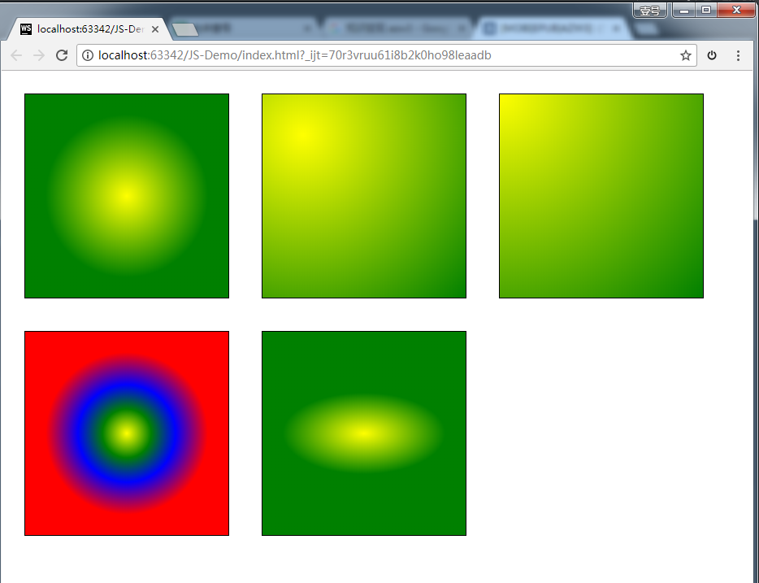

**举例：**利用径向渐变和边框圆角的属性，生成按钮。代码如下：

```html
<!DOCTYPE html>
<html lang="en">
<head>
    <meta charset="UTF-8">
    <title>CSS3 渐变</title>
    <style>

        div:nth-child(1) {
            width: 200px;
            height: 200px;
            margin: 40px auto;
            border-radius: 100px;
            background-color: yellowgreen;
        }

        div:nth-child(2) {
            width: 200px;
            height: 200px;
            margin: 40px auto;
            border-radius: 100px;
            background-color: yellowgreen;
            background-image: radial-gradient(
                    200px at 100px 100px,
                    rgba(0, 0, 0, 0),
                    rgba(0, 0, 0, 0.5)
            );
        }
    </style>
</head>
<body>
<div></div>
<div></div>
</body>
</html>
```

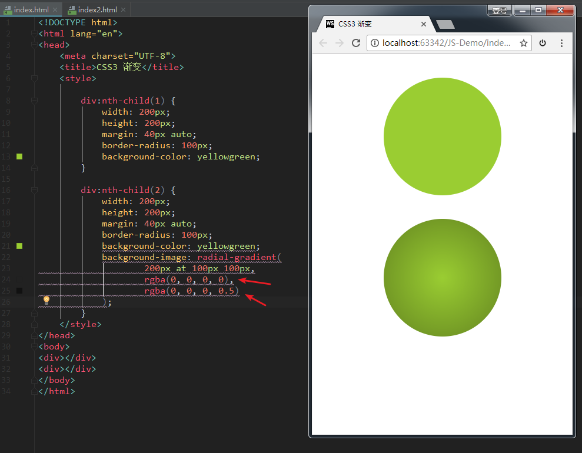

上图中，给第二个div设置的透明度是从0到0.5。如果设置的透明度是从0到0，则样式无变化，和第一个div一样。如果设置的透明度是从1到1，则盒子是全黑的。

## clip-path：裁剪出元素的部分区域做展示

`clip-path`属性可以创建一个只有元素的部分区域可以显示的剪切区域。区域内的部分显示，区域外的隐藏。

虽然`clip-path`不是背景属性，但这个属性非常强大，但往往会结合背景属性一起使用，达到一些效果。

举例：（鼠标悬停时，放大裁剪的区域）

```css
    .div1 {
        width: 320px;
        height: 320px;
        border: 1px solid red;
        background: url(http://img.smyhvae.com/20191006_1410.png) no-repeat;
        background-size: cover;

        /* 裁剪出圆形区域 */
        clip-path: circle(50px at 100px 100px);
        transition: clip-path .4s;
    }
    .div1:hover{
        /* 鼠标悬停时，裁剪出更大的圆形 */
        clip-path: circle(80px at 100px 100px);
    }
```

`clip-path`属性的好处是，即使做了任何裁剪，**容器的占位大小是不变的**。比如上方代码中，容器的占位大小一直都是 320px * 320px。这样的话，也方便我们做一些动画效果。

`clip-path: polygon()`举例：

```
clip-path: polygon(x1 y1, x2 y2, x3 y3, ..., xn yn);
```

- 参数：
  - (x, y)：表示多边形的一个顶点坐标。
  - 坐标可以用绝对单位（如 px、em）或相对单位（如 %）。
  - 至少需要3个点（形成闭合多边形），点的数量没有上限。

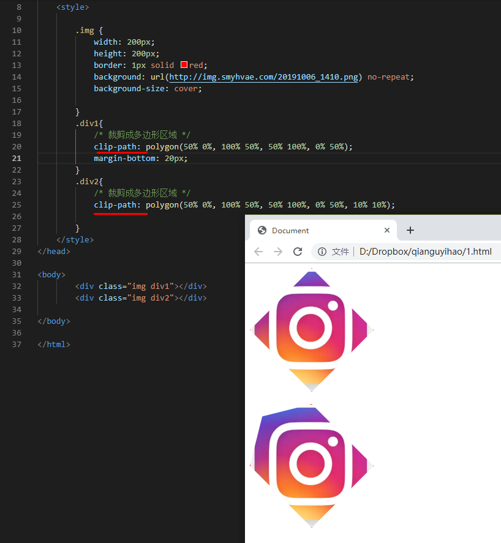

# 03-CSS样式表和选择器

## CSS 概述

CSS：Cascading Style Sheet，层叠样式表。CSS 的作用就是给 HTML 页面标签添加各种样式，**定义网页的显示效果**。简单一句话：CSS 将网页**内容和显示样式进行分离**，提高了显示功能。

css 的最新版本是 css3，**我们目前学习的是 css2.1**。 因为 css3 和 css2.1 不矛盾，必须先学 2.1 然后学 3。

接下来我们要讲一下为什么要使用 CSS。

**HTML 的缺陷：**

1. 不能够适应多种设备
2. 要求浏览器必须智能化足够庞大
3. 数据和显示没有分开
4. 功能不够强大

**CSS 优点：**

1. 使数据和显示分开
2. 降低网络流量
3. 使整个网站视觉效果一致
4. 使开发效率提高了（耦合性降低，一个人负责写 html，一个人负责写 css）

## CSS 语法

**语法格式：**（其实就是键值对）

```html
选择器{ 属性名: 属性值; 属性名: 属性值; }
```

或者可以写成：

```css
选择器 {
    k: v;
    k: v;
    k: v;
    k: v;
}
选择器 {
    k: v;
    k: v;
    k: v;
    k: v;
}
```


## CSS 的一些简单常见的属性

以下属性值中，括号中的内容表示 sublime 中的快捷键。

**字体颜色：**（c）

```html
color:red;
```

color 属性的值，可以是英语单词，比如 red、blue、yellow 等等；也可以是 rgb、十六进制(后期详细讲)。

**字号大小：**（fos）

```html
font-size:40px;
```

font 就是“字体”，size 就是“尺寸”。px 是“像素”。单位必须加，不加不行。

**背景颜色：**（bgc）

```html
background-color: blue;
```

background 就是“背景”。

**加粗：**（fwb）

```html
font-weight: bold;
```

font 是“字体” weight 是“重量”的意思，bold 粗。

**不加粗：**（fwn）

```html
font-weight: normal;
```

normal 就是正常的意思。

**斜体：**（fsi）

```html
font-style: italic;
```

italic 就是“斜体”。

**不斜体：**（fsn）

```html
font-style: normal;
```

**下划线：**（tdu）

```html
text-decoration: underline;
```

decoration 就是“装饰”的意思。

**没有下划线：**（tdn）

```html
text-decoration:none;
```

## CSS 的书写方式

CSS 的书写方式，实就是问你 CSS 的代码放在哪个位置。CSS 代码理论上的位置是任意的，**但通常写在`<style>`标签里**。

### 1、CSS 和 HTML 结合方式一：行内样式

采用 style 属性。范围只针对此标签适用。

该方式比较灵活，但是对于多个相同标签的同一样式定义比较麻烦，适合局部修改。

举例：

```html
<p style="color:white;background-color:red">我不会就这样轻易的狗带</p>
```

效果：

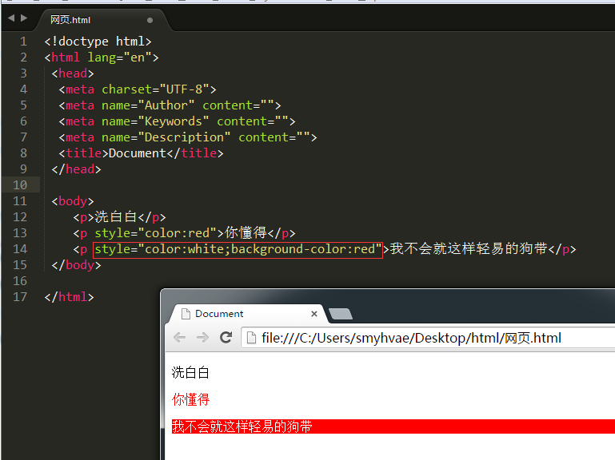

### 2、CSS 和 HTML 结合方式二：内嵌样式表

在 head 标签中加入`<style>`标签，对多个标签进行统一修改，范围针对此页面。

该方式可以对单个页面的样式进行统一设置，但对于局部不够灵活。

举例：

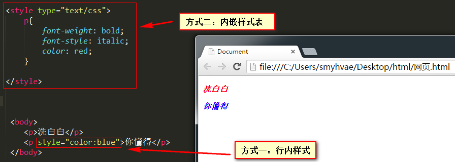

### 3、CSS 和 HTML 结合方式三：引入外部样式表 css 文件

**引入样式表文件**的方式又分为两种：

- （1）**采用`<link>`标签**。例如：`<link rel = "stylesheet" type = "text/css" href = "a.css"></link>`
- （2）**采用 import**，必须写在`<style>`标签中，并且必须是第一句。例如：`@import url(a.css) ;`

## [#](https://web.qianguyihao.com/02-CSS基础/03-CSS样式表和选择器.html#css-的四种基本选择器)CSS 的四种基本选择器

CSS 选择器：就是指定 CSS 要作用的标签，那个标签的名称就是选择器。意为：选择哪个容器。

CSS 的选择器分为两大类：基本选择器和扩展选择器。

**基本选择器：**

- 标签选择器：针对**一类**标签
- ID 选择器：针对某**一个**特定的标签使用
- 类选择器：针对**你想要的所有**标签使用
- 通用选择器（通配符）：针对所有的标签都适用（不建议使用）

### 1、标签选择器：选择器的名字代表 html 页面上的标签

标签选择器，选择的是页面上所有这种类型的标签，所以经常描述“**共性**”，无法描述某一个元素的“个性”。

举例：

```html
p{ font-size:14px; }
```

上方选择器的意思是说：所有的`<p>`标签里的内容都将显示 14 号字体。

效果：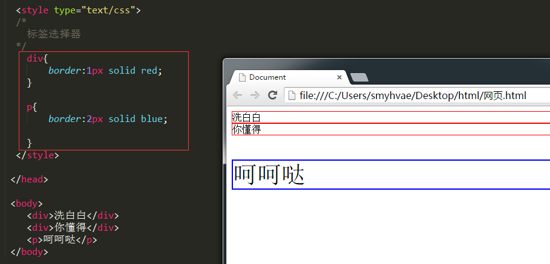

再比如说，我想让“千古壹号学完了安卓，继续学前端哟”这句话中的“前端”两个变为红色字体，那么我可以用`<span>`标签把“前端”这两个字围起来，然后给`<span>`标签加一个标签选择器。

代码如下：

```html
<!DOCTYPE html>
<html lang="en">
    <head>
        <meta charset="UTF-8" />
        <title>Document</title>
        <style type="text/css">
            span {
                color: red;
            }
        </style>
    </head>
    <body>
        <p>千古壹号学完了安卓，继续学<span>前端</span>哟</p>
    </body>
</html>
```

**【总结】需要注意的是：**

（1）所有的标签，都可以是选择器。比如 ul、li、label、dt、dl、input。

（2）无论这个标签藏的多深，一定能够被选择上。

（3）选择的所有，而不是一个。

### 2、ID 选择器：规定用`#`来定义

针对某一个特定的标签来使用，只能使用一次。css 中的 ID 选择器以”#”来定义。

举例：

```html
#mytitle{ border:3px dashed green; }
```

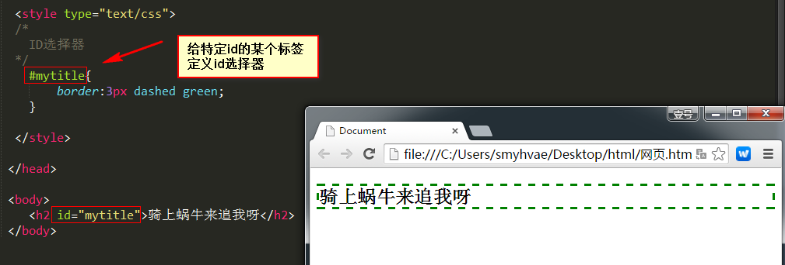id 选择器的选择符是“#”。

任何的 HTML 标签都可以有 id 属性。表示这个标签的名字。这个标签的名字，可以任取，但是：

- （1）只能有字母、数字、下划线。

- （2）必须以字母开头。

- （3）不能和标签同名。比如 id 不能叫做 body、img、a。

  另外，特别强调的是：**HTML 页面，不能出现相同的 id，哪怕他们不是一个类型**。比如页面上有一个 id 为 pp 的 p，一个 id 为 pp 的 div，是非法的！

  **一个标签可以被多个 css 选择器选择：**

  比如，我们可以同时让标签选择器和 id 选择器作用于同一个标签。如下

### 3、类选择器：规定用圆点`.`来定义

、针对**你想要的所有**标签使用。优点：灵活。

css 中用`.`来表示类。举例如下

```html
.one{ width:800px; }
```

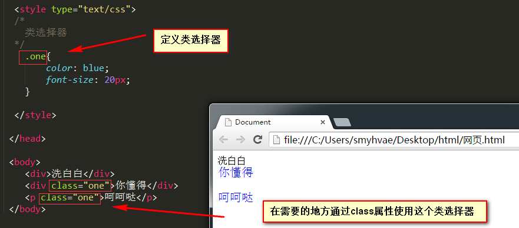

和 id 非常相似，任何的标签都可以携带 id 属性和 class 属性。class 属性的特点：

- 特性 1：类选择器可以被多种标签使用。
- 特性 2：同一个标签可以使用多个类选择器。用**空格**隔开。举例如下：（正确）

```html
<h3 class="teshu  zhongyao">我是一个h3啊</h3>
```

初学者常见的错误，就是写成了两个 class。举例如下：（错误）

```html
<h3 class="teshu" class="zhongyao">我是一个h3啊</h3>
```

**类选择器使用的举例：**

类选择器的使用，能够决定一个人的 css 水平。

比如，我们现在要做下面这样一个页面：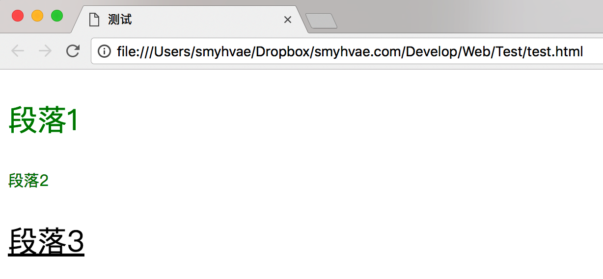

正确的思路，就是用所谓“公共类”的思路，就是我们类就是提供“公共服务”，比如有绿、大、线，一旦携带这个类名，就有相应的样式变化。对应 css 里的代码如下：

```html
<style type="text/css">
    .lv {
        color: green;
    }
    .da {
        font-size: 30px;
    }
    .underline {
        text-decoration: underline;
    }
</style>
```

然后让每个标签去选取自己想要用的类选择器：

```html
<p class="lv da">段落1</p>
<p class="lv xian">段落2</p>
<p class="da xian">段落3</p>
```

也就是说：

（1）不要去试图用一个类名，把某个标签的所有样式写完。这个标签要多携带几个类，共同完成这个标签的样式。

（2）每一个类要尽可能小，有“公共”的概念，能够让更多的标签使用。

问题：到底用 id 还是用 class？

答案：尽可能的用 class，除非极特殊的情况可以用 id。

原因：id 是 js 用的。也就是说，js 要通过 id 属性得到标签，所以 css 层面尽量不用 id，要不然 js 就很别扭。另一层面，我们会认为一个有 id 的元素，有动态效果。

我们记住这句话：**类上样式，id 上行为**。意思是说，`class`属性交给 css 使用，`id`属性交给 js 使用。

**上面这三种选择器的区别：**

- 标签选择器针对的是页面上的一类标签。
- ID 选择器是只针对特定的标签(一个)，ID 是此标签在此页面上的唯一标识。
- 类选择器可以被多种标签使用。

### 4、通配符`*`：匹配任何标签

通用选择器，将匹配任何标签。不建议使用，IE 有些版本不支持，大网站增加客户端负担。

效率不高，如果页面上的标签越多，效率越低，所以页面上不能出现这个选择器。

举例：

```css
* {
    margin-left: 0px;
    margin-top: 0px;
}
```

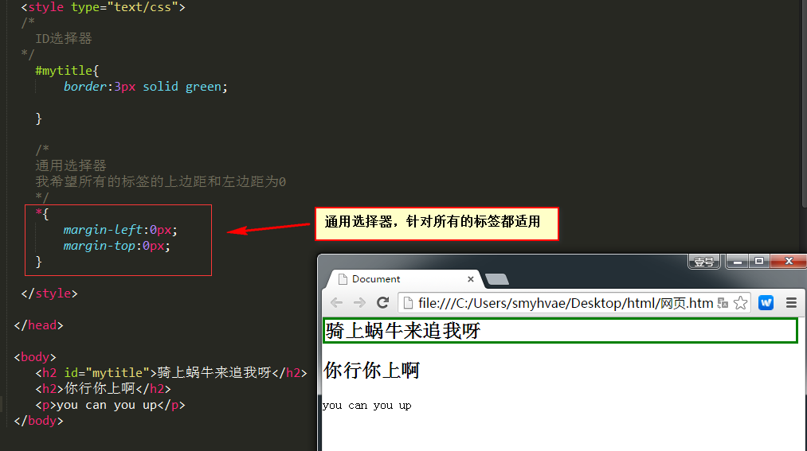

## CSS 的几种高级选择器

**高级选择器：**

- 后代选择器：用空格隔开
- 交集选择器：选择器之间紧密相连
- 并集选择器（分组选择器）：用逗号隔开
- 伪类选择器

下面详细讲一下这几种高级（扩展）选择器。

### 1、后代选择器: 定义的时候用空格隔开

对于`E F`这种格式，表示**所有属于 E 元素后代的 F 元素**，有这个样式。空格就表示后代。

后代选择器，就是一种平衡：共性、特性的平衡。当要把**某一个部分的所有的什么**，进行样式改变，就要想到后代选择器。

后代选择器，描述的是祖先结构。

看定义可能有点难理解，我们来看例子吧。

举例 1

```html
<style type="text/css">
    .div1 p {
        color: red;
    }
</style>
```

空格就表示后代。`.div1 p` 表示`.div1`的后代所有的`p`。

这里强调一下：这两个标签不一定是连续紧挨着的，只要保持一个后代的关联即可。也就是说，选择的是后代，不一定是儿子。

举例：

```html
<style type="text/css">
    h3 b i {
        color: red;
    }
</style>
```

上方代码的意思是说：定义了`<h3>`标签中的`<b>`标签中的`<i>`标签的样式。 同理：h3 和 b 和 i 标签不一定是连续紧挨着的，只要保持一个后代的关联即可。

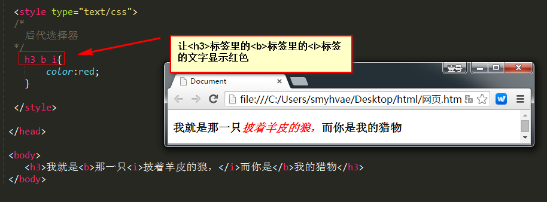

或者还有下面这种写法：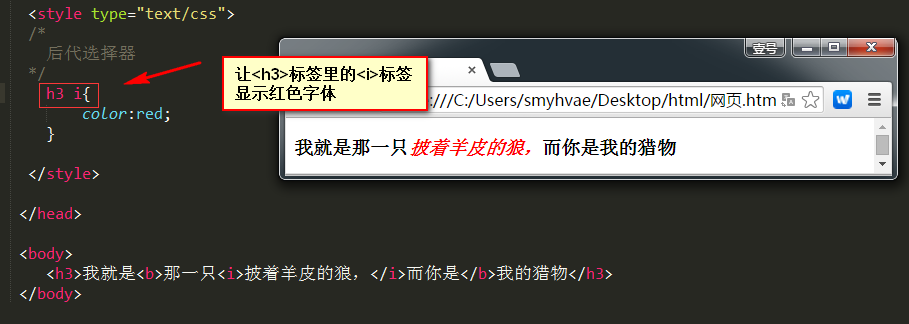

上面的这种写法，`<h3>`标签和`<i>`标签并不是紧挨着的，但他们保持着一种后代关系。

还有下面这种写法：（含类选择器、id 选择器都是可以的）

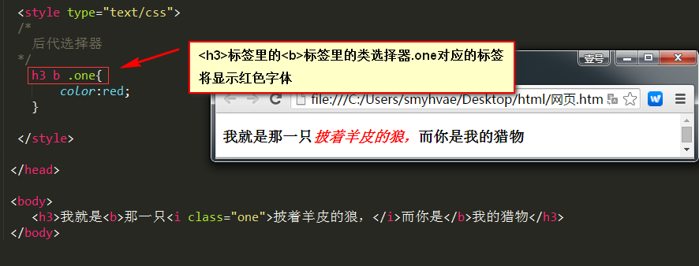

### 2、交集选择器：定义的时候紧密相连

**交集选择器（Intersection Selector）** 是一种选择器写法，用于选择同时满足多个条件的元素。它的特点是**多个选择器紧密相连，没有空格分隔**，表示这些条件必须同时应用到同一个元素上。

定义交集选择器的时候，两个选择器之间紧密相连。一般是以标签名开头，比如`div.haha`，再比如`p.special`。

如果后一个选择器是类选择器，则写为`div.special`；如果后一个选择器 id 选择器，则写为`div#special`。

来看下面这张图就明白了：

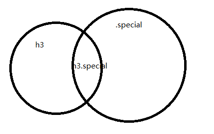

```css
h3.special {
    color: red;
}
```

选择的元素要求同时满足两个条件：必须是 h3 标签，然后必须是 special 标签。

举例：

```html
<!DOCTYPE html>
<html lang="en">
    <head>
        <meta charset="UTF-8" />
        <title>交集选择器测试</title>
        <style type="text/css">
            h3.special {
                color: red;
            }
        </style>
    </head>
    <body>
        <h3 class="special zhongyao">标题1</h3>
        <h3 class="special">我也是标题</h3>
        <p>我是段落</p>
    </body>
</html>
```

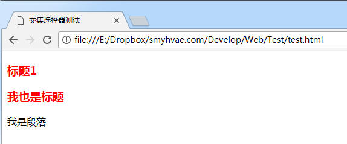

注意，交集选择器没有空格。所以，没有空格的`div.red`（交集选择器）和有空格的`div .red`（后代选择器）不是一个意思。

###  3、并集选择器：定义的时候用逗号隔开

三种基本选择器都可以放进来。

举例：

```css
p,h1,.title1,#one {
    color: red;
}
```

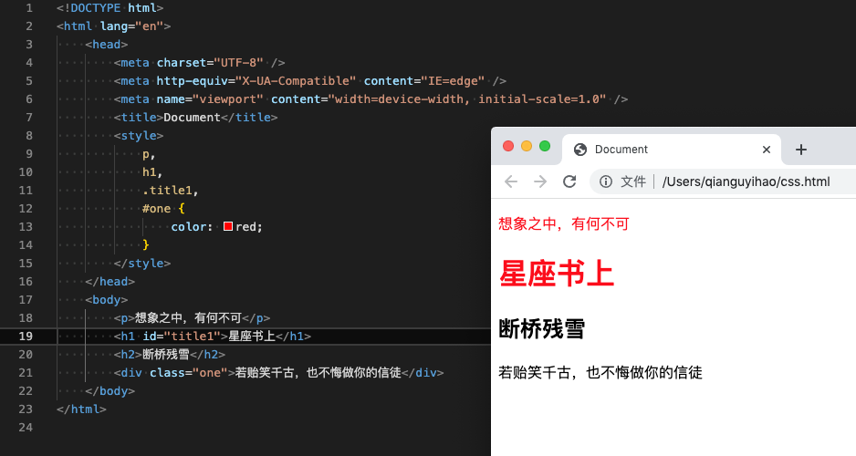

# 04-CSS选择器：伪类

## 伪类（伪类选择器）

**伪类**：同一个标签，根据其**不同的种状态，有不同的样式**。这就叫做“伪类”。伪类用冒号来表示。

比如div是属于box类，这一点很明确，就是属于box类。但是a属于什么类？不明确。因为需要看用户点击前是什么状态，点击后是什么状态。所以，就叫做“伪类”。

### [#](https://web.qianguyihao.com/02-CSS基础/04-CSS选择器：伪类.html#静态伪类选择器、动态伪类选择器)静态伪类选择器、动态伪类选择器

伪类选择器分为两种。

（1）**静态伪类**：只能用于**超链接**的样式。如下：

- `:link` 超链接点击之前
- `:visited` 链接被访问过之后

PS：以上两种样式，只能用于超链接。

（2）**动态伪类**：针对**所有标签**都适用的样式。如下：

- `:hover` “悬停”：鼠标放到标签上的时候
- `:active` “激活”： 鼠标点击标签，但是不松手时。
- `:focus` 是某个标签获得焦点时的样式（比如某个输入框获得焦点）

## 超链接a标签

### [#](https://web.qianguyihao.com/02-CSS基础/04-CSS选择器：伪类.html#超链接的四种状态)超链接的四种状态

a标签有4种伪类（即对应四种状态），要求背诵。如下：

- `:link` “链接”：超链接点击之前
- `:visited` “访问过的”：链接被访问过之后
- `:hover` “悬停”：鼠标放到标签上的时候
- `:active` “激活”： 鼠标点击标签，但是不松手时。

```html
<style type="text/css">
	/*让超链接点击之前是红色*/
	a:link{
		color:red;
	}

	/*让超链接点击之后是绿色*/
	a:visited{
		color:orange;
	}

	/*鼠标悬停，放到标签上的时候*/
	a:hover{
		color:green;
	}

	/*鼠标点击链接，但是不松手的时候*/
	a:active{
		color:black;
	}
</style>
```

记住，在css中，这四种状态**必须按照固定的顺序写**：

> a:link 、a:visited 、a:hover 、a:active

如果不按照顺序，那么将失效。“爱恨准则”：love hate。必须先爱，后恨。

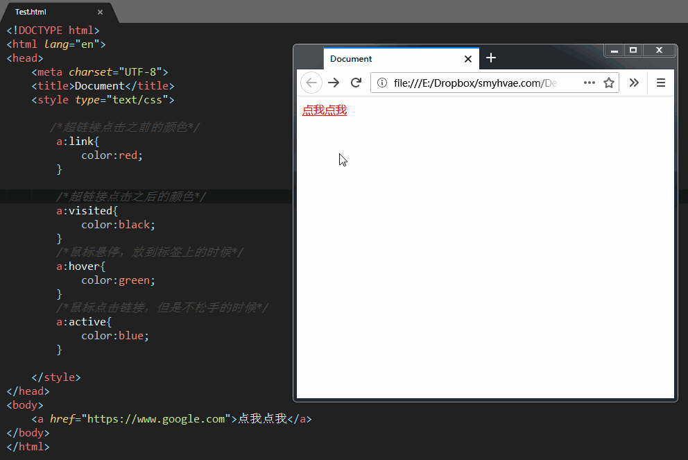

### 超链接的美化

问：既然`a{}`定义了超链的属性，和`a:link{}`定义了超链点击之前的属性，那这两个有啥区别呢？

答：

**`a{}`和`a:link{}`的区别：**

- `a{}`定义的样式针对所有的超链接(包括锚点)
- `a:link{}`定义的样式针对所有写了href属性的超链接(不包括锚点)

| 特性              | a{}                          | a:link{}                  |
| ----------------- | ---------------------------- | ------------------------- |
| **选择器类型**    | 元素选择器                   | 伪类选择器                |
| **匹配范围**      | 所有 <a> 标签                | 仅未访问的 <a>（有 href） |
| **状态限制**      | 无状态限制                   | 只匹配未访问状态          |
| **是否需要 href** | 不需要                       | 通常需要（视浏览器实现）  |
| **覆盖性**        | 影响所有状态，除非被伪类覆盖 | 只影响未访问状态          |

针对超链接，我们来举个例子：

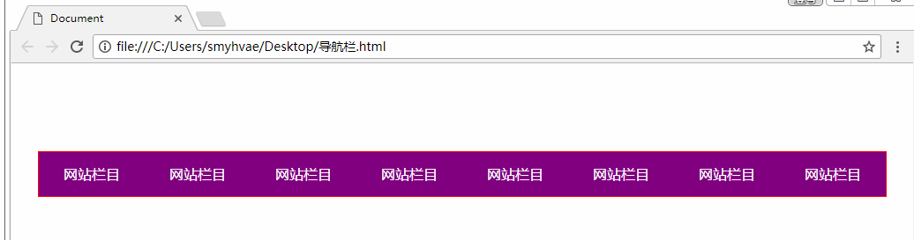

为了实现上面这个效果，完整版代码如下：

```html
<!DOCTYPE html PUBLIC "-//W3C//DTD XHTML 1.0 Transitional//EN" "http://www.w3.org/TR/xhtml1/DTD/xhtml1-transitional.dtd">
<html xmlns="http://www.w3.org/1999/xhtml" xml:lang="en">
<head>
	<meta http-equiv="Content-Type" content="text/html;charset=UTF-8">
	<title>Document</title>
	<style type="text/css">
		*{
			margin: 0;
			padding: 0;
		}
		.nav{
			width: 960px;
			height: 50px;
			border: 1px solid red;
			margin: 100px auto;
		}
		.nav ul{
			/*去掉小圆点*/
			list-style: none;
		}
		.nav ul li{
			float: left;
			width: 120px;
			height: 50px;
			/*让内容水平居中*/
			text-align: center;
			/*让行高等于nav的高度，就可以保证内容垂直居中*/
			line-height: 50px;
		}
		.nav ul li a{
			display: block;
			width: 120px;
			height: 50px;
		}
		/*两个伪类的属性，可以用逗号隔开*/
		.nav ul li a:link , .nav ul li a:visited{
			text-decoration: none;
			background-color: purple;
			color:white;
		}
		.nav ul li a:hover{
			background-color: orange;
		}
	</style>
</head>
<body>
	<div class="nav">
		<ul>
			<li><a href="#">网站栏目</a></li>
			<li><a href="#">网站栏目</a></li>
			<li><a href="#">网站栏目</a></li>
			<li><a href="#">网站栏目</a></li>
			<li><a href="#">网站栏目</a></li>
			<li><a href="#">网站栏目</a></li>
			<li><a href="#">网站栏目</a></li>
			<li><a href="#">网站栏目</a></li>
		</ul>
	</div>
</body>
</html>
```

上方代码中，我们发现，当我们在定义`a:link`和 `a:visited`这两个伪类的时候，如果它们的属性相同，我们其实可以写在一起，用逗号隔开就好，摘抄如下：

```css
		.nav ul li a{
			display: block;
			width: 120px;
			height: 50px;
		}
		/*两个伪类的属性，可以用逗号隔开*/
		.nav ul li a:link , .nav ul li a:visited{
			text-decoration: none;
			background-color: purple;
			color:white;
		}
		.nav ul li a:hover{
			background-color: orange;
		}
```

如上方代码所示，最标准的写法，就是把link、visited、hover这三个伪类都要写。但是前端开发工程师在大量的实践中，发现不写link、visited也挺兼容。写法是：

```css
		.nav ul li a{
			display: block;
			width: 120px;
			height: 50px;
			text-decoration: none;
			background-color: purple;
			color:white;
		}
		.nav ul li a:hover{
			background-color: orange;
		}
```

## 动态伪类举例

我们在第一段中描述过，下面这三种动态伪类，针对所有标签都适用。

- `:hover` “悬停”：鼠标放到标签上的时候
- `:active` “激活”： 鼠标点击标签，但是不松手时。
- `:focus` 是某个标签获得焦点时的样式（比如某个输入框获得焦点）

我们不妨来举下例子。

举例1：

```html
<style type="text/css">
  /*
	伪类选择器：动态伪类
  */

   /*
	让文本框获取焦点时：
	边框：#FF6F3D这种橙色
	文字：绿色
	背景色：#6a6a6a这种灰色
   */
	input:focus{
		border:3px solid #FF6F3D;
		color:white;
		background-color:#6a6a6a;
	}

	/*
	鼠标放在标签上时显示蓝色
    */
	label:hover{
		color:blue;
	}

	/*
	点击标签鼠标没有松开时显示红色
    */
	label:active{
		color:red;
	}

  </style>
```

效果：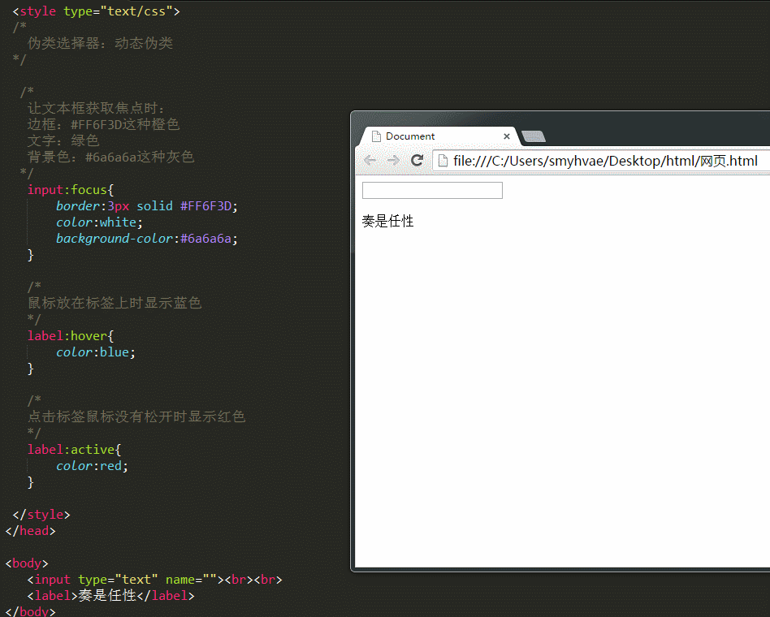

## **动态伪类 vs 静态伪类的区别**

| 特性         | 动态伪类                 | 静态伪类                      |
| ------------ | ------------------------ | ----------------------------- |
| **触发条件** | 用户交互（如悬停、点击） | 元素固有状态或结构位置        |
| **状态变化** | 实时变化，临时生效       | 固定不变，除非结构/属性改变   |
| **依赖性**   | 依赖用户行为             | 不直接依赖用户行为            |
| **示例**     | :hover, :active, :focus  | :link, :visited, :first-child |
| **持续性**   | 操作结束即恢复           | 条件满足时持续应用            |