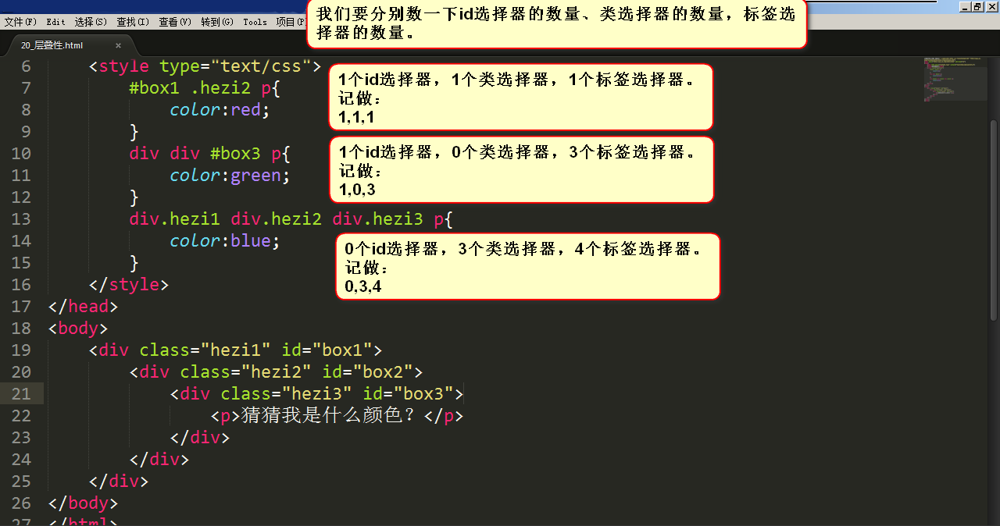
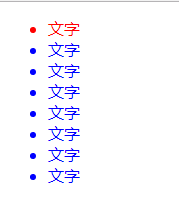

# 05-CSS样式表的继承性和层叠性

##  CSS的继承性

我们来看下面这样的代码，来引入继承性：


上方代码中，我们给div标签增加红色属性，却发现，div里的每一个子标签`<p>`也增加了红色属性。于是我们得到这样的结论：

> 有一些属性，当给自己设置的时候，自己的后代都继承上了，这个就是**继承性。**

继承性是从自己开始，直到最小的元素。

但是呢，如果再给上方的代码加一条属性：


上图中，我们给div加了一个border，但是发现只有div具备了border属性，而p标签却没有border属性。于是我们可以得出结论：

- **关于文字样式的属性，都具有继承性。**这些属性包括：color、 text-开头的、line-开头的、font-开头的。
- **关于盒子、定位、布局的属性，都不能继承。**

以后当我们谈到css有哪些特性的时候，我们要首先想到继承性。而且，要知道哪些属性具有继承性、哪些属性没有继承性。

## CSS的层叠性

### 层叠性：计算权重

**层叠性：就是css处理冲突的能力。** 所有的权重计算，没有任何兼容问题！

CSS像艺术家一样优雅，像工程师一样严谨。

我们来看一个例子，就知道什么叫层叠性了。


上图中，三种选择器同时给P标签增加颜色的属性，但是，文字最终显示的是蓝色，这个时候，就出现了层叠性的情况。

当多个选择器，选择上了某个元素的时候，要按照如下顺序统计权重：

- id 选择器
- 类选择器、属性选择器、伪类选择器
- 标签选择器、伪元素选择器

因为对于相同方式的样式表，其选择器排序的优先级为：**ID选择器 > 类选择器 > 标签选择器**

针对上面这句话，我们接下来举一些复杂一点的例子。

### 层叠性举例

#### 举例1：计算权重



如上图所示，统计各个选择器的数量，优先级高的胜出。文字的颜色为红色。

PS：不进位，实际上能进位（奇淫知识点：255个标签，等于1个类名）但是没有实战意义！

#### 举例2：权重相同时

上图可以看到，第一个样式和第二个样式的权重相同。但第二个样式的书写顺序靠后，因此以第二个样式为准（就近原则)

#### 举例3：具有实战性的例子



现在我要让一个列表实现上面的这种样式：第一个li为红色，剩下的li全部为蓝色。

如果写成下面这种代码是无法实现的：


无法实现的原因很简单，计算一下三个选择器的权重就清楚了，显然第二个样式被第一个样式表覆盖了。

正确的做法是：（**非常重要**）


上图中，第二个样式比第一个样式的权重要大。因此在实战中可以实现这种效果：**所有人当中，让某一个人为红，让其他所有人为蓝。**

#### 举例4：继承性造成的影响

这里需要声明一点：

> 如果不能直接选中某个元素，通过继承性影响的话，那么权重是0。

为了验证上面这句话，我们来看看下面这样的例子：


另外：**如果大家的权重相同，那么就采用就近原则：谁描述的近，听谁的**。举例如下：(box3 描述得最近，所以采用 box3 的属性)

### 层叠性：权重计算的问题大总结（非常重要）

层叠性。层叠性是一种能力，就是处理冲突的能力。当不同选择器，对一个标签的同一个样式，有不同的值，听谁的？这就是冲突。css有着严格的处理冲突的机制。


上面这个图非常重要，我们针对这个图做一个文字描述：

- 选择上了，数权重，(id的数量，类的数量，标签的数量)。如果权重一样，谁写在后面听谁的。
- 没有选择上，通过继承影响的，就近原则，谁描述的近听谁的。如果描述的一样近，比如选择器权重，如果权重再一样重，谁写在后面听谁的。

### CSS样式表的冲突的总结

- 1、对于相同的选择器（比如同样都是类选择器），其样式表排序：行级样式 > 内嵌样式表 > 外部样式表（就近原则）
- 2、对于相同类型的样式表（比如同样都是内部样式表），其选择器排序：ID选择器 > 类选择器 > 标签选择器
- 3、外部样式表的ID选择器 > 内嵌样式表的标签选择器

> 总结：就近原则。ID选择器优先级最大。

举例：如果都是内嵌样式表，优先级的顺序如下：（ID 选择器 > 类选择器 > 标签选择器）


另外还有两个冲突的情况：

- 1、对同一个标签，如果用到的都是内嵌样式表，且权重一致，那它的优先级：**定义**的CSS样式表中，谁最近，就用谁。
- 2、对于同一个标签，如果用到的都是外部样式表，且权重一致，那它的优先级：html文件中，引用样式表的位置越近，就用谁。

例如：


## 权重问题深入

### [#](https://web.qianguyihao.com/02-CSS基础/05-CSS样式表的继承性和层叠性.html#同一个标签-携带了多个类名-有冲突)同一个标签，携带了多个类名，有冲突：

这里需要补充两种冲突的情况：

- 1、对同一个标签，如果用到了了多个相同的内嵌样式表，它的优先级：**定义**的样式表中，谁最近，就用谁。
- 2、对于同一个标签，如果引用了多个相同的外部样式表，它的优先级：html文件中，引用样式表的位置越近，就用谁。

例如：（就近原则）


上图中，**文字显示的颜色均为红色**。因为这和在标签中的挂类名的书序无关，只和css的顺序有关。

### !important标记：优先级最高

来看个很简单的例子：


上图中，显然id选择器的权重最大，所以文字的颜色是红色。

如果我们想让文字的颜色显示为绿色，只需要给标签选择器的加一个`!important`标记，此时其权重为无穷大。如下：


`!important`标记需要强调如下3点：

**（1）!important提升的是一个属性，而不是一个选择器**

```css
	p{
			color:red !important;    只写了这一个!important，所以只有字体颜色属性提升了权重
			font-size: 100px ;       这条属性没有写!important，所以没有提升权重
		}
		#para1{
			color:blue;
			font-size: 50px;
		}
		.spec{
			color:green;
			font-size: 20px;
		}
```

所以，综合来看，字体颜色是red（听important的）；字号是50px（听id的）。

**（2）!important无法提升继承的权重，该是0还是0**

比如HTML结构：

```html
	<div>
		<p>哈哈哈哈哈哈哈哈</p>
	</div>
```

有CSS样式：

```css
	div{
		color:red !important;
	}
	p{
		color:blue;
	}
```

由于div是通过继承性来影响文字颜色的，所以!important无法提升它的权重，权重依然是0。

干不过p标签，因为p标签是实实在在选中了，所以字是蓝色的（以p为准）。

**(3)!important不影响就近原则**

如果大家都是继承来的，按理说应该按照“就近原则”，那么important能否影响就近原则呢？ 答案是：不影响。远的，永远是远的。不能给远的写一个important，干掉近的。

为了验证这个问题，我们可以搞两层具有继承性的标签，然后给外层标签加一个!important，最终看看就近原则有没有被打破。举例如下：

# 06-CSS盒模型详解

## 盒子模型

### [#](https://web.qianguyihao.com/02-CSS基础/06-CSS盒模型详解.html#前言)前言

盒子模型，英文即box model。无论是div、span、还是a都是盒子。

但是，图片、表单元素一律看作是文本，它们并不是盒子。这个很好理解，比如说，一张图片里并不能放东西，它自己就是自己的内容。

### [#](https://web.qianguyihao.com/02-CSS基础/06-CSS盒模型详解.html#盒子中的区域)盒子中的区域

一个盒子中主要的属性就5个：width、height、padding、border、margin。如下：

- width和height：**内容**的宽度、高度（不是盒子的宽度、高度）。
- padding：内边距。
- border：边框。
- margin：外边距。


代码演示：


上面这个盒子，width:200px; height:200px; 但是真实占有的宽高是302*302。 这是因为还要加上padding、border。

注意：**宽度和真实占有宽度，不是一个概念！**来看下面这例子。

### [#](https://web.qianguyihao.com/02-CSS基础/06-CSS盒模型详解.html#标准盒模型和ie盒模型)标准盒模型和IE盒模型

标准盒子模型：


IE盒子模型：


上图显示：

在 CSS 盒子模型 (Box Model) 规定了元素处理元素的几种方式：

- width和height：**内容**的宽度、高度（不是盒子的宽度、高度）。
- padding：内边距。
- border：边框。
- margin：外边距。

CSS盒模型和IE盒模型的区别：

- 在 **标准盒子模型**中，**width 和 height 指的是内容区域**的宽度和高度。增加内边距、边框和外边距不会影响内容区域的尺寸，但是会增加元素框的总尺寸。
- **IE盒子模型**中，**width 和 height 指的是内容区域+border+padding**的宽度和高度。

### `<body>`标签也有margin

`<body>`标签有必要强调一下。很多人以为`<body>`标签占据的是整个页面的全部区域，其实是错误的，正确的理解是这样的：整个网页最大的盒子是`<document>`，即浏览器。而`<body>`是`<document>`的儿子。浏览器给`<body>`默认的margin大小是8个像素，此时`<body>`占据了整个页面的一大部分区域，而不是全部区域。来看一段代码。


## 认识width、height

一定要知道，在前端开发工程师眼中，世界中的一切都是不同的。

比如说，丈量稿纸，前端开发工程师只会丈量内容宽度：

下面这两个盒子，真实占有宽高，都是302*302：

盒子1：

```css
.box1{
	width: 100px;
	height: 100px;
	padding: 100px;
	border: 1px solid red;
}
```

盒子2：

```css
.box2{
	width: 250px;
	height: 250px;
	padding: 25px;
	border: 1px solid red;
}
```

真实占有宽度 = 左border + 左padding + width + 右padding + 右border

上面这两个盒子的盒模型图如下：

**如果想保持一个盒子的真实占有宽度不变，那么加width的时候就要减padding。加padding的时候就要减width**。因为盒子变胖了是灾难性的，这会把别的盒子挤下去。

## 认识padding

### [#](https://web.qianguyihao.com/02-CSS基础/06-CSS盒模型详解.html#padding区域也有颜色)padding区域也有颜色

padding就是内边距。padding的区域有背景颜色，css2.1前提下，并且背景颜色一定和内容区域的相同。也就是说，background-color将填充**所有border以内的区域。**

### padding有四个方向

padding是4个方向的，所以我们能够分别描述4个方向的padding。

方法有两种，第一种写小属性；第二种写综合属性，用空格隔开。

小属性的写法：

```css
	padding-top: 30px;
	padding-right: 20px;
	padding-bottom: 40px;
	padding-left: 100px;
```

综合属性的写法：(上、右、下、左)（顺时针方向，用空格隔开。margin的道理也是一样的）

```css
padding:30px 20px 40px 100px;
```

如果写了四个值，则顺序为：上、右、下、左。

如果只写了三个值，则顺序为：上、右和左、下。

如果只写了两个值，则顺序为：上和下、左和右。

比如说：

```text
padding: 30px 40px;
```

则顺序等价于：30px 40px 30px 40px;

### 一些元素，默认带有padding

一些元素，默认带有`padding`，比如ul标签。如下：


上图显示，不加任何样式的ul，也是有40px的padding-left。

所以，我们做站的时候，为了便于控制，总是喜欢清除这个默认的padding。

可以使用`*`进行清除：

```css
	*{
			margin: 0;
			padding: 0;
		}
```

但是，`*`的效率不高，所以我们使用并集选择器，罗列所有的标签（不用背，有专业的清除默认样式的样式表，今后学习）：

```text
body,div,dl,dt,dd,ul,ol,li,h1,h2,h3,h4,h5,h6,pre,code,form,fieldset,legend,input,textarea,p,blockquote,th,td{
    margin:0;
    padding:0;
}
```

## 认识border

border就是边框。边框有三个要素：像素（粗细）、线型、颜色。

比如：

```css
.div1{
	width: 10px;
	height: 10px;
	border: 2px solid red;
}
```

颜色如果不写，默认是黑色。另外两个属性如果不写，则无法显示边框。

### border-style

border的所有的线型如下：（我们可以通过查看`CSS参考手册`得到）


比如`border:10px ridge red;`这个属性，在chrome和firefox、IE中有细微差别：（因为可以显示出效果，因此并不是兼容性问题，只是有细微差别而已）

###  border拆分

border是一个大综合属性。比如说：

```css
border:1px solid red;
```

就是把上下左右这四个方向的边框，都设置为 1px 宽度、线型实线、red颜色。

border属性是能够被拆开的，有两大种拆开的方式：

- （1）按三要素拆开：border-width、border-style、border-color。（一个border属性是由三个小属性综合而成的）
- （2）按方向拆开：border-top、border-right、border-bottom、border-left。

现在我们明白了：**一个border属性，是由三个小属性综合而成的**。如果某一个小属性后面是空格隔开的多个值，那么就是上右下左的顺序。举例如下：


（1）按三要素拆：

```css
border-width:10px;    //边框宽度
border-style:solid;   //线型
border-color:red;     //颜色。
```

等价于：

```text
border:10px solid red;
```

(2)按方向来拆：

```css
border-top:10px solid red;
border-right:10px solid red;
border-bottom:10px solid red;
border-left:10px solid red;
```

等价于：

```css
border:10px solid red;
```

border可以没有：

```css
border:none;
```

可以某一条边没有：

```css
border-left: none;
```

也可以调整左边边框的宽度为0：

```css
border-left-width: 0;
```

# 07-浮动

## 标准文档流

宏观地讲，我们的web页面和photoshop等设计软件有本质的区别：web页面的制作，是个“流”，必须从上而下，像“织毛衣”。而设计软件，想往哪里画个东西，都能画。

### 标准文档流的特性

**（1）空白折叠现象：**

无论多少个空格、换行、tab，都会折叠为一个空格。

比如，如果我们想让img标签之间没有空隙，必须紧密连接：

```text

```

**（2）高矮不齐，底边对齐：**

举例如下


**（3）自动换行，一行写不满，换行写。**


### 行内元素和块级元素

学习的初期，我们就要知道，标准文档流等级森严。标签分为两种等级：

- 行内元素（Inline Elements）
- 块级元素（Block-level Elements）

我们可以举一个例子，看看块级元素和行内元素的区别：

上图中可以看到，`h1`标签是块级元素，占据了整行，`span`标签是行内元素，只占据内容这一部分。

现在我们尝试给两个标签设置宽高。效果如下：


上图中，我们尝试给两个标签设置宽高，但发现，宽高属性只对块级元素`h1`生效。于是我们可以做出如下总结。

**行内元素和块级元素的区别：**（非常重要）

行内元素：

- 与其他行内元素并排；
- 不能设置宽、高。默认的宽度，就是文字的宽度。

块级元素：

- 霸占一行，不能与其他任何元素并列；
- 能接受宽、高。如果不设置宽度，那么宽度将默认变为父亲的100%。

**行内元素和块级元素的分类：**

在以前的HTML知识中，我们已经将标签分过类，当时分为了：文本级、容器级。

从HTML的角度来讲，标签分为：

- 文本级标签：p、span、a、b、i、u、em。
- 容器级标签：div、h系列、li、dt、dd。

现在，从CSS的角度讲，CSS的分类和上面的很像，就p不一样：

- 行内元素：除了p之外，所有的文本级标签，都是行内元素。p是个文本级，但是是个块级元素。
- 块级元素：所有的容器级标签都是块级元素，还有p标签。

我们把上面的分类画一个图，即可一目了然：


### 行内元素和块级元素的相互转换

我们可以通过`display`属性将块级元素和行内元素进行相互转换。display即“显示模式”。

#### [#](https://web.qianguyihao.com/02-CSS基础/07-浮动.html#块级元素可以转换为行内元素)块级元素可以转换为行内元素：

一旦，给一个块级元素（比如div）设置：

```text
display: inline;
```

那么，这个标签将立即变为行内元素，此时它和一个span无异。inline就是“行内”。也就是说：

- 此时这个div不能设置宽度、高度；
- 此时这个div可以和别人并排了。

#### 行内元素转换为块级元素：

同样的道理，一旦给一个行内元素（比如span）设置：

```text
display: block;
```

那么，这个标签将立即变为块级元素，此时它和一个div无异。block”是“块”的意思。也就是说：

- 此时这个span能够设置宽度、高度
- 此时这个span必须霸占一行了，别人无法和他并排
- 如果不设置宽度，将撑满父亲

标准流里面的限制非常多，导致很多页面效果无法实现。如果我们现在就要并排、并且就要设置宽高，那该怎么办呢？办法是：移民！**脱离标准流**！

css中一共有三种手段，使一个元素脱离标准文档流：

- （1）浮动
- （2）绝对定位
- （3）固定定位

## 浮动的性质

现在有两个div，分别设置宽高。我们知道，它们的效果如下：


此时，如果给这两个div增加一个浮动属性，比如`float: left;`，效果如下


这就达到了浮动的效果。此时，两个元素并排了，并且两个元素都能够设置宽度、高度了（这在上一段的标准流中，不能实现）。

浮动想学好，一定要知道三个性质。接下来讲一讲。

### 性质1：浮动的元素脱标

脱标即脱离标准流。我们来看几个例子。


上图中，在默认情况下，两个div标签是上下进行排列的。现在由于float属性让上图中的第一个`<div>`标签出现了浮动，于是这个标签在另外一个层面上进行排列。而第二个`<div>`还在自己的层面上遵从标准流进行排列。


上图中，span标签在标准流中，是不能设置宽高的（因为是行内元素）。但是，一旦设置为浮动之后，即使不转成块级元素，也能够设置宽高了。

所以能够证明一件事：**一旦一个元素浮动了，那么，将能够并排了，并且能够设置宽高了。无论它原来是个div还是个span。**所有标签，浮动之后，已经不区分行内、块级了。

### 性质2：浮动的元素互相贴靠

我们来看一个例子就明白了。

我们给三个div均设置了`float: left;`属性之后，然后设置宽高。当改变浏览器窗口大小时，可以看到div的贴靠效果：


上图显示，3号如果有足够空间，那么就会靠着2号。如果没有足够的空间，那么会靠着1号大哥。 如果没有足够的空间靠着1号大哥，3号自己去贴左墙。

不过3号自己去贴墙的时候，注意：


上图显示，3号贴左墙的时候，并不会往1号里面挤。

同样，float还有一个属性值是`right`，这个和属性值`left`是对称的。

### 性质3：浮动的元素有“字围”效果

来看一张图就明白了。我们让div浮动，p不浮动。


上图中，我们发现：**div挡住了p，但不会挡住p中的文字**，形成“字围”效果。

总结：**标准流中的文字不会被浮动的盒子遮挡住**。（文字就像水一样）

关于浮动我们要强调一点，浮动这个东西，为避免混乱，我们在初期一定要遵循一个原则：**永远不是一个东西单独浮动，浮动都是一起浮动，要浮动，大家都浮动。**

### 性质4：收缩

收缩：一个浮动的元素，如果没有设置width，那么将自动收缩为内容的宽度（这点非常像行内元素）。

举例如下：


上图中，div本身是块级元素，如果不设置width，它会单独霸占整行；但是，设置div浮动后，它会收缩

## 浮动的清除

> 这里所说的清除浮动，指的是清除浮动与浮动之间的影响。

### 前言

通过上面这个例子，我们发现，此例中的网页就是通过浮动实现并排的。

比如说一个网页有header、content、footer这三部分。就拿content部分来举例，如果设置content的儿子为浮动，但是，这个儿子又是一个全新的标准流，于是儿子的儿子仍然在标准流里。

从学习浮动的第一天起，我们就要明白，浮动有开始，就要有清除。我们先来做个实验。

下面这个例子，有两个块级元素div，div没有任何属性，每个div里有li，效果如下：


上图中，我们发现：第二组中的第1个li，去贴靠第一组中的最后一个li了（我们本以为这些li会分成两排）。

这便引出我们要讲的：清除浮动的第一种方式。 那该怎么解决呢？

### 方法1：给浮动元素的祖先元素加高度

造成前言中这个现象的根本原因是：li的**父亲div没有设置高度**，导致这两个div的高度均为0px（我们可以通过网页的审查元素进行查看）。div的高度为零，导致不能给自己浮动的孩子，撑起一个容器。

撑不起一个容器，导致自己的孩子没办法在自己的内部进行正确的浮动。

好，现在就算给这个div设置高度，可如果div自己的高度小于孩子的高度，也会出现不正常的现象：


给div设置一个正确的合适的高度（至少保证高度大于儿子的高度），就可以看到正确的现象：


**总结：**

**如果一个元素要浮动，那么它的祖先元素一定要有高度。**

**有高度的盒子，才能关住浮动**。（记住这句过来人的经验之语）

只要浮动在一个有高度的盒子中，那么这个浮动就不会影响后面的浮动元素。所以就是清除浮动带来的影响了。

### 方法2：clear:both;

网页制作中，高度height其实很少出现。为什么？因为能被内容撑高！也就是说，刚刚我们讲解的方法1，工作中用得很少。

那么，能不能不写height，也把浮动清除了呢？也让浮动之间，互不影响呢？

这个时候，我们可以使用`clear:both;`这个属性。如下：


clear就是清除，both指的是左浮动、右浮动都要清除。`clear:both`的意思就是：**不允许左侧和右侧有浮动对象。**

这种方法有一个非常大的、致命的问题，**它所在的标签，margin属性失效了**。读者可以试试看。

margin失效的本质原因是：上图中的box1和box2，高度为零。

### 方法3：隔墙法

上面这个例子中，为了防止第二个div贴靠到第二个div，我们可以在这两个div中间用一个新的div隔开，然后给这个新的div设置`clear: both;`属性；同时，既然这个新的div无法设置margin属性，我们可以给它设置height，以达到margin的效果（曲线救国）。这便是隔墙法。

我们看看例子效果就知道了：


上图这个例子就是隔墙法。

**内墙法：**

近些年，有演化出了“内墙法”：

为了讲内墙法，我们先记住一句重要的话：**一个父亲是不能被浮动的儿子撑出高度的**。举例如下：

（1）我们在一个div里放一个有宽高的p，效果如下：（很简单）


（2）可如果在此基础之上，给p设置浮动，却发现父亲div没有高度了：


3）此时，我么可以在div的里面放一个div（作为内墙），就可以让父亲div恢复高度：


于是，我们采用内墙法解决前言中的问题：


### 清除浮动方法4：overflow:hidden;

我们可以使用如下属性：

```text
overflow:hidden;
```

overflow即“溢出”， hidden即“隐藏”。这个属性的意思是“溢出隐藏”。顾名思义：所有溢出边框的内容，都要隐藏掉。如下：


上图显示，`overflow:hidden;`的本意是清除溢出到盒子外面的文字。但是，前端开发工程师发现了，它能做偏方。如下：

一个父亲不能被自己浮动的儿子，撑出高度。但是，只要给父亲加上`overflow:hidden`; 那么，父亲就能被儿子撑出高了。这是一个偏方。

举个例子：

那么对于前言中的例子，我们同样可以使用这一属性：


##  margin相关

### margin塌陷/margin重叠

**标准文档流中，竖直方向的margin不叠加，取**较大的值**作为margin(水平方向的margin是可以叠加的，即水平方向没有塌陷现象)。如下图所示：

如果不在标准流，比如盒子都浮动了，那么两个盒子之间是没有塌陷现象的。

### 盒子居中`margin:0 auto;`

margin的值可以为auto，表示自动。当left、right两个方向都是auto的时候，盒子居中了：

```text
margin-left: auto;
margin-right: auto;
```

盒子居中的简写为：

```text
margin:0 auto;
```

对上方代码的理解：上下的margin为0，左右的margin都尽可能的大，于是就居中了。

注意：

- （1）只有标准流的盒子，才能使用`margin:0 auto;`居中。也就是说，当一个盒子浮动了、绝对定位了、固定定位了，都不能使用margin:0 auto;
- （2）使用`margin:0 auto;`的盒子，必须有width，有明确的width。（可以这样理解，如果没有明确的width，那么它的width就是霸占整行，没有意义）
- （3）`margin:0 auto;`是让盒子居中，不是让盒子里的文本居中。文本的居中，要使用`text-align:center;`

对上面的第三条总结一下：（非常重要）

```text
margin:0 auto;    //让这个div自己在大容器中的水平方向上居中。
text-align: center;  //让这个div内部的文本居中。
```

顺便普及一下知识，text-align还有：

```text
text-align:left;     //没啥用，因为默认居左
text-align:right;    //文本居右
```

### 善于使用父亲的padding，而不是儿子的margin

我们来看一个奇怪的现象。现在有下面这样一个结构：（div中放一个p）

```text
	<div>
		<p></p>
	</div>
```

上面的结构中，我们尝试通过给儿子`p`一个`margin-top:50px;`的属性，让其与父亲保持50px的上边距。结果却看到了下面的奇怪的现象：


此时我们给父亲div加一个border属性，就正常了：


如果父亲没有border，那么儿子的margin实际上踹的是“流”，踹的是这“行”。所以，父亲整体也掉下来了。

**margin这个属性，本质上描述的是兄弟和兄弟之间的距离； 最好不要用这个marign表达父子之间的距离。**

所以，如果要表达父子之间的距离，我们一定要善于使用父亲的padding，而不是儿子的margin。

# 08-CSS属性：定位属性

## 相对定位

**相对定位**：让元素相对于自己原来的位置，进行位置调整（可用于盒子的位置微调）。

我们之前学习的背景属性中，是通过如下格式：

```text
	background-position:向右偏移量 向下偏移量;
```

但这回的定位属性，是通过如下格式：

```text
	position: relative;
	left: 50px;
	top: 50px;
```

相对定位的举例：

```html
<!doctype html>
<html lang="en">
 <head>
  <meta charset="UTF-8">
  <meta name="Generator" content="EditPlus®">
  <meta name="Author" content="">
  <meta name="Keywords" content="">
  <meta name="Description" content="">
  <title>Document</title>

	<style type="text/css">

		body{
			margin: 0px;
		}

		.div1{
			width: 200px;
			height: 200px;
			border: 1px solid red;
		}

		.div2{
			position: relative;/*相对定位：相对于自己原来的位置*/
			left: 50px;/*横坐标：正值表示向右偏移，负值表示向左偏移*/
			top: 50px;/*纵坐标：正值表示向下偏移，负值表示向上偏移*/

			width: 200px;
			height: 200px;
			border: 1px solid red;
		}
	</style>
 </head>

 <body>

	<div class="div1">有生之年</div>
	<div class="div2">狭路相逢</div>

 </body>

</html>
```


### 相对定位不脱标

**相对定位**：不脱标，老家留坑，**别人不会把它的位置挤走**。

也就是说，相对定位的真实位置还在老家，只不过影子出去了，可以到处飘。

### 相对定位的用途

如果想做“压盖”效果（把一个div放到另一个div之上），我们一般**不用**相对定位来做。相对定位，就两个作用：

- （1）微调元素
- （2）做绝对定位的参考，子绝父相

### 相对定位的定位值

- left：盒子右移
- right：盒子左移
- top：盒子下移
- bottom：盒子上移

PS：负数表示相反的方向。


如果要描述上面这张图的方向，我们可以首先可以这样描述：

```text
	position: relative;
	left: 200px;
	top: 100px;
```

## 绝对定位

**绝对定位**：定义横纵坐标。原点在父容器的左上角或左下角。横坐标用left表示，纵坐标用top或者bottom表示。

格式举例如下：

```text
	position: absolute;  /*绝对定位*/
	left: 10px;  /*横坐标*/
	top/bottom: 20px;  /*纵坐标*/
```

### 绝对定位脱标

**绝对定位的盒子脱离了标准文档流。**

所以，所有的标准文档流的性质，绝对定位之后都不遵守了。

绝对定位之后，标签就不区分所谓的行内元素、块级元素了，不需要`display:block`就可以设置宽、高了。

### 绝对定位的参考点（重要）

（1）如果用**top描述**，那么参考点就是**页面的左上角**，而不是浏览器的左上角：


（2）如果用**bottom描述**，那么参考点就是**浏览器首屏窗口尺寸**（好好理解“首屏”二字），对应的页面的

（First Screen）是一个前端开发中的术语，指用户打开网页时，**无需滚动即可看到的页面区域**。

左下角：

问题：


答案：

用bottom的定位的时候，参考的是浏览器首屏大小对应的页面左下角。


### 以盒子为参考点

一个绝对定位的元素，如果父辈元素中也出现了已定位（无论是绝对定位、相对定位，还是固定定位）的元素，那么将以父辈这个元素，为参考点。

如下：（子绝父相）


以下几点需要注意。

（1） 要听最近的已经定位的祖先元素的，不一定是父亲，可能是爷爷：

```text
	<div class="box1">        相对定位
			<div class="box2">    没有定位
				<p></p>           绝对定位，将以box1为参考，因为box2没有定位，box1就是最近的父辈元素
			</div>
		</div>
```

再比如：

```text
		<div class="box1">        相对定位
			<div class="box2">    相对定位
				<p></p>           绝对定位，将以box2为参考，因为box2是自己最近的父辈元素
			</div>
		</div>
```

（2）不一定是相对定位，任何定位，都可以作为儿子的参考点：

子绝父绝、**子绝父相**、子绝父固，都是可以给儿子定位的。但是在工程上，如果子绝、父绝，没有一个盒子在标准流里面了，所以页面就不稳固，没有任何实战用途。

（3）绝对定位的儿子，无视参考的那个盒子的padding：

下图中，绿色部分是父亲div的padding，蓝色部分p是div的内容区域。此时，如果div相对定位，p绝对定位，那么， p将无视父亲的padding，在border内侧为参考点，进行定位：


## 固定定位

**固定定位**：就是相对浏览器窗口进行定位。无论页面如何滚动，这个盒子显示的位置不变。

备注：IE6不兼容。

**用途1**：网页右下角的“返回到顶部”

比如我们经常看到的网页右下角显示的“返回到顶部”，就可以固定定位。

```html
	<style type="text/css">
		.backtop{
			position: fixed;
			bottom: 100px;
			right: 30px;
			width: 60px;
			height: 60px;
			background-color: gray;
			text-align: center;
			line-height:30px;
			color:white;
			text-decoration: none;   /*去掉超链接的下划线*/
		}
	</style>
```

**用途2：**顶部导航条

我们经常能看到固定在网页顶端的导航条，可以用固定定位来做。

需要注意的是，假设顶部导航条的高度是60px，那么，为了防止其他的内容被导航条覆盖，我们要给body标签设置60px的padding-top。

### 5、z-index属性：

**z-index**属性：表示谁压着谁。数值大的压盖住数值小的。

有如下特性：

（1）属性值大的位于上层，属性值小的位于下层。

（2）z-index值没有单位，就是一个正整数。默认的z-index值是0。

（3）如果大家都没有z-index值，或者z-index值一样，那么在HTML代码里写在后面，谁就在上面能压住别人。定位了的元素，永远能够压住没有定位的元素。

（4）只有定位了的元素，才能有z-index值。也就是说，不管相对定位、绝对定位、固定定位，都可以使用z-index值。**而浮动的元素不能用**。

（5）从父现象：父亲怂了，儿子再牛逼也没用。意思是，如果父亲1比父亲2大，那么，即使儿子1比儿子2小，儿子1也能在最上层。

针对（1）（2）（3）条，举例如下：

这是默认情况下的例子：（div2在上层，div1在下层）


现在加一个`z-index`属性，要求效果如下：

