# 10-CSS3选择器详解

## CSS3介绍

CSS3在CSS2基础上，**增强**或**新增**了许多特性， 弥补了CSS2的众多不足之处，使得Web开发变得更为高效和便捷。

### [#](https://web.qianguyihao.com/02-CSS基础/10-CSS3选择器详解.html#css3的现状)CSS3的现状

- 浏览器支持程度不够好，有些需要添加**私有前缀**
- 移动端支持优于PC端
- 不断改进中
- 应用相对广泛

## CSS3 选择器

我们之前学过 CSS 的选择器，比如：

```text
  div 标签选择器

 .box 类名选择器

 #box　id选择器

 div p 后代选择器

 div.box 交集选择器

 div,p,span 并集选择器

 div>p 子代选择器

 * : 通配符

 div+p: 选中div后面相邻的第一个p

 div~p: 选中的div后面所有的p
```

### 属性选择器

属性选择器的标志性符号是 `[]`。

匹配含义：

```text
^：开头  $：结尾  *：包含
```

**1. 基本属性选择器**

- **语法**：`[attribute]`  
- **作用**：选择具有指定属性的所有元素，无论属性值是什么。  
- **示例**：  
  ```css
  [title] {
    color: blue;
  }
  ```
  **HTML**：  
  ```html
  <p title="提示">这是一个段落</p>
  <span title="信息">这是文本</span>
  ```
  **效果**：所有带有`title`属性的元素（例如`<p>`和`<span>`）文字颜色变为蓝色。

---

**2. 精确属性值选择器**

- **语法**：`[attribute="value"]`  
- **作用**：选择属性值完全匹配指定值的元素。  
- **示例**：  
  ```css
  [type="text"] {
    border: 1px solid gray;
  }
  ```
  **HTML**：  
  ```html
  <input type="text" placeholder="输入文字">
  <input type="password" placeholder="输入密码">
  ```
  **效果**：仅`<input type="text">`会被选中并应用边框样式，而`type="password"`不会被选中。

---

**3. 部分匹配属性选择器**

这些选择器允许更灵活地匹配属性值的一部分，适用于属性值较复杂的情况。

**(1) 包含某字符串**

- **语法**：`[attribute*="value"]`  
- **作用**：选择属性值中包含指定子字符串的元素。  
- **示例**：  
  ```css
  [href*="example"] {
    color: green;
  }
  ```
  **HTML**：  
  ```html
  <a href="https://example.com">链接1</a>
  <a href="https://sub.example.org">链接2</a>
  ```
  **效果**：所有`href`属性包含"example"的链接文字变为绿色。

**(2) 以某字符串开头**

- **语法**：`[attribute^="value"]`  
- **作用**：选择属性值以指定字符串开头的元素。  
- **示例**：  
  ```css
  [src^="https"] {
    border: 2px dashed red;
  }
  ```
  **HTML**：  
  ```html
  
  
  ```
  **效果**：仅`src`以"https"开头的``会被选中并应用样式。

**(3) 以某字符串结尾**

- **语法**：`[attribute$="value"]`  
- **作用**：选择属性值以指定字符串结尾的元素。  
- **示例**：  
  ```css
  [src$=".png"] {
    opacity: 0.8;
  }
  ```
  **HTML**：  
  ```html
  
  
  ```
  **效果**：仅`src`以".png"结尾的图片透明度变为0.8。

**(4) 包含某单词**

- **语法**：`[attribute~="value"]`  
- **作用**：选择属性值中包含指定单词的元素（单词需以空格分隔）。  
- **示例**：  
  ```css
  [class~="item"] {
    font-weight: bold;
  }
  ```
  **HTML**：  
  ```html
  <div class="item main">元素1</div>
  <div class="item-sub">元素2</div>
  ```
  **效果**：仅`class`属性包含独立单词"item"的元素（例如`class="item main"`）会被选中，而"item-sub"不会。

**(5) 以某字符串开头并紧跟连字符**

- **语法**：`[attribute|="value"]`  
- **作用**：选择属性值以指定字符串开头且后面紧跟连字符（`-`）的元素，常用于语言标记等场景。  
- **示例**：  
  ```css
  [lang|="en"] {
    color: purple;
  }
  ```
  **HTML**：  
  ```html
  <p lang="en-US">English</p>
  <p lang="en-GB">British English</p>
  <p lang="fr">French</p>
  ```
  **效果**：`lang`属性以"en"开头并紧跟"-"的元素（例如"en-US"和"en-GB"）文字变为紫色。

---

**4. 结合其他选择器使用**

属性选择器可以与其他选择器组合，进一步限定选择范围。  
- **示例**：  
  ```css
  input[type="checkbox"]:checked {
    width: 20px;
    height: 20px;
  }
  ```
  **作用**：仅选中被勾选的`type="checkbox"`的`<input>`元素，并调整其大小。


### 结构伪类选择器

伪类选择器的标志性符号是 `:`。

CSS中有一些伪类选择器，比如`:link`、`:visited`、`:hover`、`:active`、`:focus`。

CSS3又新增了其它的伪类选择器。这一小段，我们来学习CSS3中的**结构伪类选择器**：即通过**结构**来进行筛选。

结构伪类选择器（Structural Pseudo-classes）是CSS中一类特殊的伪类选择器，用于根据元素在文档结构中的位置或关系来选择元素，而不是基于元素的状态（如`:hover`）或内容。它们通常以`:`开头，结合特定的关键字或参数，帮助开发者精确地定位HTML结构中的元素。以下是对结构伪类选择器的详细介绍：

**常见的结构伪类选择器**

**1. `:first-child`**

- **作用**：选择作为父元素第一个子元素的元素。
- **示例**：
  ```css
  li:first-child {
    color: red;
  }
  ```
  **HTML**：
  ```html
  <ul>
    <li>项目1</li> <!-- 选中 -->
    <li>项目2</li>
    <li>项目3</li>
  </ul>
  ```
  **效果**：每个`<ul>`中的第一个`<li>`文字变为红色。

**2. `:last-child`**

- **作用**：选择作为父元素最后一个子元素的元素。
- **示例**：
  ```css
  li:last-child {
    font-weight: bold;
  }
  ```
  **HTML**：
  ```html
  <ul>
    <li>项目1</li>
    <li>项目2</li>
    <li>项目3</li> <!-- 选中 -->
  </ul>
  ```
  **效果**：每个`<ul>`中的最后一个`<li>`文字加粗。

**3. `:nth-child(n)`**

- **作用**：根据元素在父元素中的位置序号选择，`n`可以是数字、关键字（如`odd`或`even`）或表达式（如`2n`）。
- **示例**：
  ```css
  li:nth-child(2) {
    background-color: yellow;
  }
  ```
  **HTML**：
  ```html
  <ul>
    <li>项目1</li>
    <li>项目2</li> <!-- 选中 -->
    <li>项目3</li>
  </ul>
  ```
  **效果**：每个`<ul>`中的第2个`<li>`背景变为黄色。
- **扩展用法**：
  - `odd`：奇数位置（如1、3、5）。
    ```css
    tr:nth-child(odd) {
      background-color: #f2f2f2;
    }
    ```
    效果：表格中奇数行变灰。
  - `even`：偶数位置（如2、4、6）。
  - `an+b`：公式选择，例如`2n`（偶数）、`3n+1`（第1、4、7...个）。
    ```css
    li:nth-child(2n+1) {
      color: blue;
    }
    ```
    效果：第1、3、5...个`<li>`文字变蓝。

**4. `:nth-last-child(n)`**

- **作用**：从父元素的最后一个子元素开始倒数选择，`n`用法同`:nth-child`。
- **示例**：
  ```css
  li:nth-last-child(2) {
    text-decoration: underline;
  }
  ```
  **HTML**：
  ```html
  <ul>
    <li>项目1</li>
    <li>项目2</li>
    <li>项目3</li> <!-- 选中 -->
    <li>项目4</li>
  </ul>
  ```
  **效果**：每个`<ul>`中倒数第2个`<li>`加下划线。

**5. `:first-of-type`**

- **作用**：选择父元素中第一个指定类型的元素。
- **示例**：
  ```css
  p:first-of-type {
    font-size: 20px;
  }
  ```
  **HTML**：
  ```html
  <div>
    <span>文本</span>
    <p>段落1</p> <!-- 选中 -->
    <p>段落2</p>
  </div>
  ```
  **效果**：`<div>`中第一个`<p>`字体变大，忽略前面的`<span>`。

**6. `:last-of-type`**

- **作用**：选择父元素中最后一个指定类型的元素。
- **示例**：
  ```css
  p:last-of-type {
    color: green;
  }
  ```
  **HTML**：
  ```html
  <div>
    <p>段落1</p>
    <p>段落2</p> <!-- 选中 -->
    <span>文本</span>
  </div>
  ```
  **效果**：`<div>`中最后一个`<p>`文字变绿。

**7. `:nth-of-type(n)`**

- **作用**：根据元素类型在同类型兄弟元素中的位置选择，`n`用法同`:nth-child`。
- **示例**：
  ```css
  p:nth-of-type(2) {
    background-color: lightblue;
  }
  ```
  **HTML**：
  ```html
  <div>
    <span>文本</span>
    <p>段落1</p>
    <p>段落2</p> <!-- 选中 -->
    <p>段落3</p>
  </div>
  ```
  **效果**：`<div>`中第2个`<p>`背景变浅蓝，忽略`<span>`。

**8. `:nth-last-of-type(n)`**

- **作用**：从同类型兄弟元素的最后一个开始倒数选择。
- **示例**：
  ```css
  p:nth-last-of-type(2) {
    font-style: italic;
  }
  ```
  **HTML**：
  ```html
  <div>
    <p>段落1</p>
    <p>段落2</p> <!-- 选中 -->
    <p>段落3</p>
    <span>文本</span>
  </div>
  ```
  **效果**：`<div>`中倒数第2个`<p>`变为斜体。

**9. `:only-child`**

- **作用**：选择父元素中唯一的子元素。
- **示例**：
  ```css
  p:only-child {
    color: purple;
  }
  ```
  **HTML**：
  ```html
  <div>
    <p>唯一段落</p> <!-- 选中 -->
  </div>
  <div>
    <p>段落1</p>
    <p>段落2</p>
  </div>
  ```
  **效果**：只有`<div>`中仅有一个`<p>`时，该`<p>`文字变紫。

**10. `:only-of-type`**

- **作用**：选择父元素中唯一某种类型的元素。
- **示例**：
  ```css
  p:only-of-type {
    border: 1px solid black;
  }
  ```
  **HTML**：
  ```html
  <div>
    <p>唯一段落</p> <!-- 选中 -->
    <span>文本</span>
  </div>
  ```
  **效果**：`<div>`中只有一个`<p>`时，该`<p>`加边框。

---

**关键区别**

- **`-child` vs `-of-type`**：
  
  - `:nth-child`基于所有子元素的顺序，不考虑类型。
  - `:nth-of-type`仅考虑同类型元素的顺序，忽略其他类型。
  - 示例：
    ```html
    <div>
      <span>文本</span>
      <p>段落1</p> <!-- :nth-child(2) -->
      <p>段落2</p> <!-- :nth-of-type(2) -->
    </div>
    ```

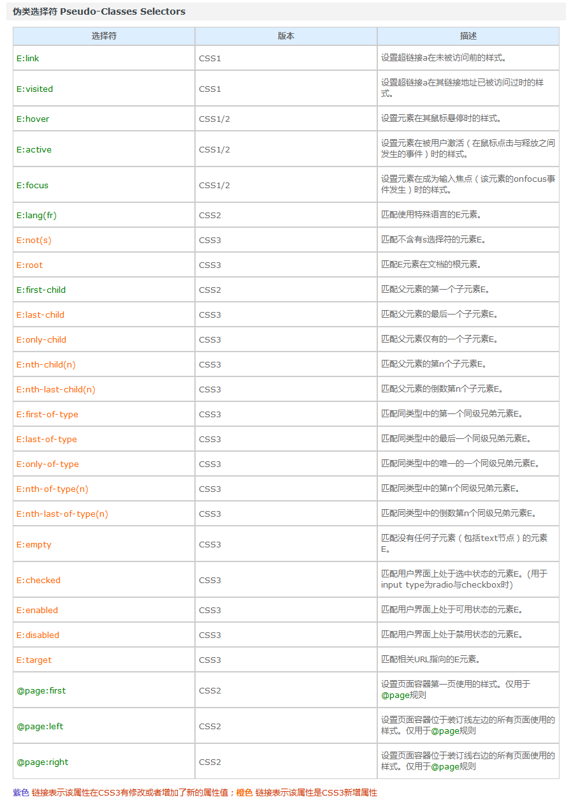

###  伪元素选择器

伪元素选择器的标志性符号是 `::`。

伪元素选择器（Pseudo-elements）是CSS中用于选择元素特定部分或在元素中插入虚拟内容的特殊选择器。它们与伪类（Pseudo-classes）不同，伪类选择的是元素的状态或位置，而伪元素选择的是元素的某一部分（如首行、首字母）或生成额外的内容（如在元素前后插入内容）。伪元素通常以双冒号`::`开头（现代标准），但为了兼容旧浏览器，单冒号`:`也能用于某些伪元素。

下面是对伪元素选择器的详细介绍，包括常见的类型和用法：

---

**常见的伪元素选择器**

**1. `::before`**

- **作用**：在元素的内容之前插入虚拟内容，通常与`content`属性配合使用。
- **示例**：
  
  ```css
  p::before {
    content: "★ ";
    color: red;
  }
  ```
  **HTML**：
  ```html
  <p>这是一个段落</p>
  ```
  **效果**：在每个`<p>`元素内容前插入一个红色的“★ ”，显示为“★ 这是一个段落”。

**2. `::after`**

- **作用**：在元素的内容之后插入虚拟内容，也需要`content`属性。
- **示例**：
  ```css
  p::after {
    content: " [完]";
    font-style: italic;
  }
  ```
  **HTML**：
  
  ```html
  <p>这是一个段落</p>
  ```
  **效果**：在每个`<p>`元素内容后插入斜体的“ [完]”，显示为“这是一个段落 [完]”。

**3. `::first-line`**

- **作用**：选择元素的第一行文本，常用于段落排版。
- **示例**：
  ```css
  p::first-line {
    font-weight: bold;
    color: blue;
  }
  ```
  **HTML**：
  ```html
  <p>这是一个很长的段落，可能会换行。第一行的样式会不同。</p>
  ```
  **效果**：`<p>`元素的第一行文字变为蓝色加粗，具体影响范围取决于浏览器窗口宽度和换行情况。
- **限制**：仅适用于块级元素，且只能使用与文本排版相关的属性（如`color`、`font`、`background`等）。

**4. `::first-letter`**

- **作用**：选择元素的第一个字符，常用于首字下沉效果。
- **示例**：
  ```css
  p::first-letter {
    font-size: 2em;
    color: red;
    float: left;
  }
  ```
  **HTML**：
  ```html
  <p>这是一个段落</p>
  ```
  **效果**：`<p>`的首字母“这”变大变红并浮动在左侧，形成首字下沉效果。
- **限制**：仅适用于块级元素，且字符前不能有其他内容（如图片）。

**5. `::selection`**

- **作用**：选择用户高亮的文本部分（鼠标拖选或键盘选择）。
- **示例**：
  ```css
  ::selection {
    background: yellow;
    color: black;
  }
  ```
  **HTML**：
  ```html
  <p>选择我试试</p>
  ```
  **效果**：用户选中`<p>`中的文本时，高亮背景变为黄色，文字变为黑色。
- **注意**：仅支持`color`、`background`和`text-shadow`等少数属性。

---

**关键特性**

1. **双冒号 vs 单冒号**：
   
   - 现代标准使用`::`区分伪元素和伪类（如`:hover`）。
   - 旧浏览器（如IE8）仅支持单冒号`:`，例如`:before`。
   - 为了兼容性，许多开发者仍使用单冒号，但`::`是推荐写法。
   
2. **`content`属性**：
   - `::before`和`::after`必须配合`content`属性使用，即使值为空字符串（`content: ""`）。
   - `content`支持字符串、URL（如图片）、计数器等：
     ```css
     li::before {
       content: url("icon.png");
     }
     ```

3. **虚拟内容**：
   - 伪元素生成的内容不在DOM中，无法通过JavaScript直接操作，但可以通过CSS调整样式。

---

**实际应用**

- **装饰效果**：用`::before`和`::after`添加图标、引号、分隔线等。
  ```css
  blockquote::before {
    content: "“";
    font-size: 2em;
  }
  blockquote::after {
    content: "”";
    font-size: 2em;
  }
  ```
- **清除浮动**：
  ```css
  .clearfix::after {
    content: "";
    display: block;
    clear: both;
  }
  ```
- **排版优化**：用`::first-line`和`::first-letter`调整文章首行或首字样式。

---

**注意事项**

1. **浏览器兼容性**：
   - `::before`和`::after`在IE8+支持（单冒号）。
   - `::selection`在旧浏览器（如IE8）中不受支持。
   - `::first-line`和`::first-letter`在大多数现代浏览器中表现一致，但受限于块级元素。

2. **优先级**：
   - 伪元素的优先级与普通选择器相同，取决于选择器的具体性（Specificity）。

3. **限制**：
   - 一个选择器只能使用一个伪元素（例如，不能写`p::before::after`）。
   - 但可以结合伪类使用，例如`p:hover::before`。

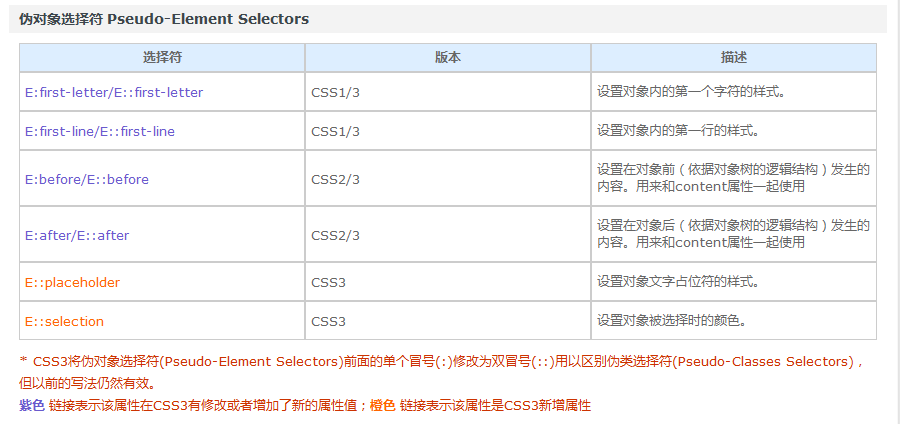

# 11-CSS3属性详解（一）

## 文本

### [#](https://web.qianguyihao.com/02-CSS基础/11-CSS3属性详解（一）.html#text-shadow-设置文本的阴影)text-shadow：设置文本的阴影

格式举例：

```javascript
text-shadow: 20px 27px 22px pink;
```

参数解释：水平位移 垂直位移 模糊程度 阴影颜色。

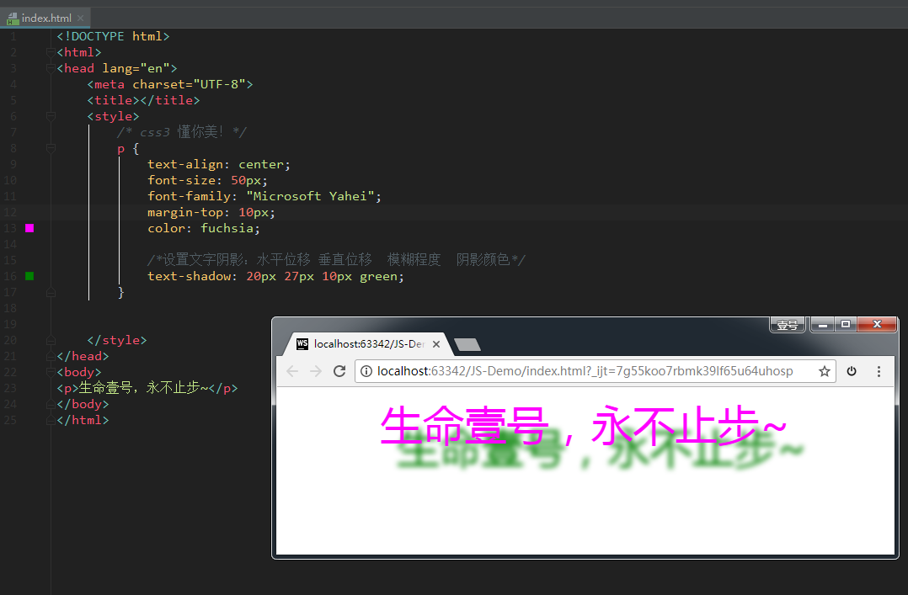

### 举例：凹凸文字效果

text-shadow 可以设置多个阴影，每个阴影之间使用逗号隔开。我们来看个例子。

```html
<!DOCTYPE html>
<html>
<head lang="en">
    <meta charset="UTF-8">
    <title></title>
    <style>
        body {
            background-color: #666;
        }

        div {
            font-size: 100px;
            text-align: center;
            font-weight: bold;
            font-family: "Microsoft Yahei";
            color: #666;
        }

        /* text-shadow 可以设置多个阴影，每个阴影之间使用逗号隔开*/
        .tu {
            text-shadow: -1px -1px 1px #fff, 1px 1px 1px #000;
        }

        .ao {
            text-shadow: -1px -1px 1px #000, 1px 1px 1px #fff;
        }
    </style>
</head>
<body>
<div class="ao">生命壹号</div>
<div class="tu">生命壹号</div>
</body>
</html>
```

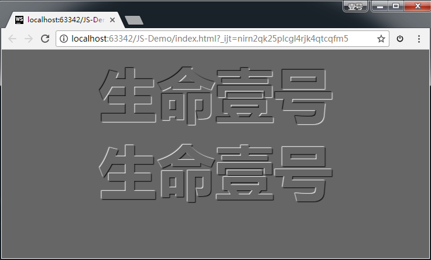

## 盒模型中的 box-sizing 属性

在CSS的盒模型（Box Model）中，`box-sizing` 是一个关键属性，用于控制元素的尺寸计算方式，直接影响宽度（`width`）和高度（`height`）的定义。CSS盒模型默认包含内容（content）、内边距（padding）、边框（border）和外边距（margin），而`box-sizing`决定了这些部分的计算规则。以下是对`box-sizing`属性的详细介绍：

---

**1. 盒模型的基本概念**

在标准的CSS盒模型中，一个元素的总宽度和总高度是这样计算的：
- **总宽度** = `width`（内容宽度） + `padding-left` + `padding-right` + `border-left` + `border-right` + `margin-left` + `margin-right`
- **总高度** = `height`（内容高度） + `padding-top` + `padding-bottom` + `border-top` + `border-bottom` + `margin-top` + `margin-bottom`

这里的`width`和`height`默认只代表**内容区域**的尺寸，不包括内边距和边框。

---

**2. `box-sizing` 的取值**

`box-sizing` 属性可以改变这种计算方式，它有以下几个常用值：

**(1) `content-box`（默认值）**

- **定义**：`width`和`height`只包括内容区域，不包括内边距和边框。
- **计算方式**：总尺寸 = 内容 + 内边距 + 边框 + 外边距。
- **示例**：
  ```css
  div {
    box-sizing: content-box;
    width: 200px;
    height: 100px;
    padding: 20px;
    border: 10px solid black;
  }
  ```
  **结果**：
  - 内容区域：200px × 100px
  - 总宽度：200px + 20px (左padding) + 20px (右padding) + 10px (左border) + 10px (右border) = **260px**
  - 总高度：100px + 20px (上padding) + 20px (下padding) + 10px (上border) + 10px (下border) = **160px**

**(2) `border-box`**

- **定义**：`width`和`height`包括内容、内边距和边框的总和，外边距仍独立计算。
- **计算方式**：总尺寸 = 设置的`width`或`height`（内容 + 内边距 + 边框） + 外边距。
- **示例**：
  ```css
  div {
    box-sizing: border-box;
    width: 200px;
    height: 100px;
    padding: 20px;
    border: 10px solid black;
  }
  ```
  **结果**：
  - 总宽度：200px（包括内容、内边距和边框）
  - 总高度：100px（包括内容、内边距和边框）
  - 内容区域宽度：200px - 20px (左padding) - 20px (右padding) - 10px (左border) - 10px (右border) = **140px**
  - 内容区域高度：100px - 20px (上padding) - 20px (下padding) - 10px (上border) - 10px (下border) = **40px**

**(3) `inherit`**

- **定义**：从父元素继承`box-sizing`的值。
- **示例**：
  
  ```css
  .parent {
    box-sizing: border-box;
  }
  .child {
    box-sizing: inherit;
    width: 100px;
    padding: 10px;
  }
  ```
  **效果**：`.child` 会使用与`.parent`相同的`border-box`模型。

---

**3. 为什么要用 `box-sizing`？**

- **默认模型的问题**：`content-box`下，添加内边距或边框会让元素变大，可能破坏布局。例如，设置`width: 100%`的元素加上`padding`后会溢出父容器。
- **`border-box`的优势**：将内边距和边框包含在`width`和`height`中，尺寸更直观，布局更可控，特别适合响应式设计。

---

**4. 实际应用**

**全局设置**

许多开发者在项目中全局应用`border-box`，以简化布局计算：
```css
* {
  box-sizing: border-box;
}
```
- 这样，所有元素的`width`和`height`都包含内边距和边框，避免意外溢出。
- 注意：需要确保`*`选择器覆盖所有元素，包括伪元素：
  ```css
  *,
  *::before,
  *::after {
    box-sizing: border-box;
  }
  ```

#### **表单元素**
表单元素（如`<input>`、`<textarea>`）在不同浏览器中的盒模型可能不一致，使用`border-box`可以统一行为：
```css
input, textarea {
  box-sizing: border-box;
  width: 100%;
  padding: 10px;
}
```

## 处理兼容性问题：私有前缀

**1. 什么是私有前缀？**

私有前缀是CSS属性名前加上的特定字符串，用于标识该属性是某个浏览器厂商的实验性实现。常见的私有前缀包括：

- -webkit-：适用于基于Webkit引擎的浏览器（如Chrome、Safari、部分Opera版本）。
- -moz-：适用于Mozilla Firefox。
- -ms-：适用于Microsoft的Internet Explorer或Edge。
- -o-：适用于老版本的Opera（基于Presto引擎）。

**私有前缀的举例**：

比如说，我想给指定的div设置下面这样一个属性：

```css
	background: linear-gradient(left, green, yellow);
```

上面这个属性的作用是：添加从左到右的线性渐变，颜色从绿色变为黄色。

如果直接这样写属性，是看不到效果的：

此时，我们可以**为浏览器添加不同的私有前缀**，属性就可以生效了。

格式如下：

```html
    -webkit-: 谷歌 苹果
    -moz-:火狐
    -ms-：IE
    -o-：欧朋
```

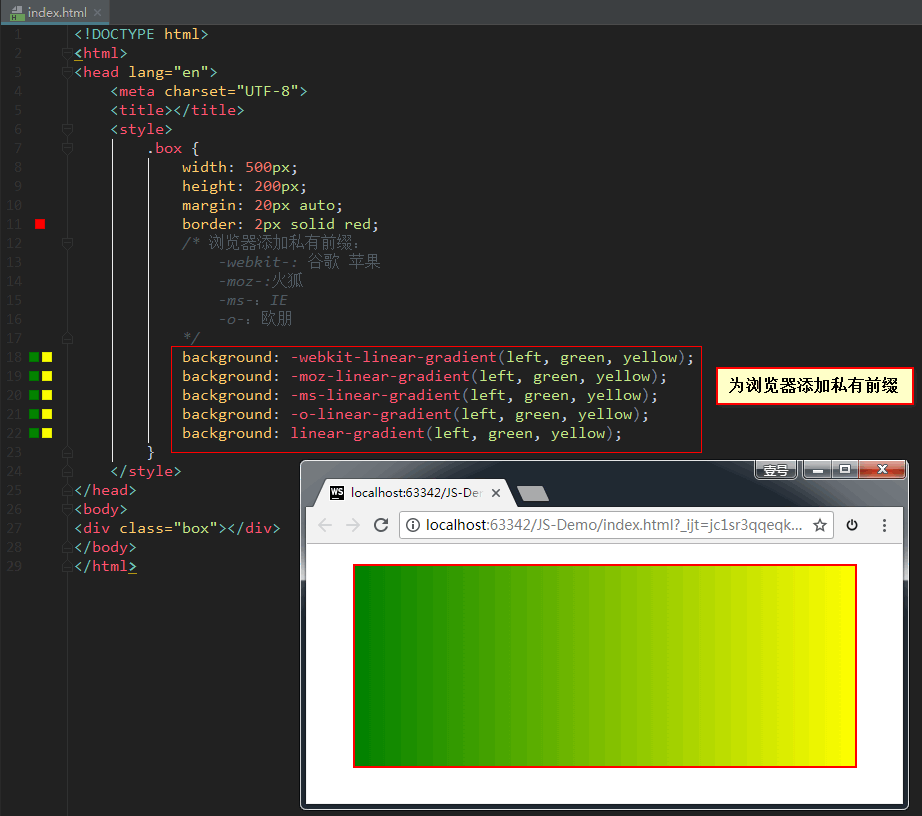

## 边框

边框的属性很多，其中**边框圆角**和**边框阴影**这两个属性，应用十分广泛，兼容性也相对较好，且符合**渐进增强**的原则，需要重点熟悉。

### 边框圆角：`border-radius` 属性

边框的每个圆角，本质上是一个圆，圆有**水平半径**和**垂直半径**：如果二者相等，就是圆；如果二者不等， 就是椭圆。

单个属性的写法：

```css
	border-top-left-radius: 60px 120px;        //参数解释：水平半径   垂直半径

	border-top-right-radius: 60px 120px;

	border-bottom-left-radius: 60px 120px;

	border-bottom-right-radius: 60px 120px;
```

复合写法：

```text
	border-radius: 60px/120px;             //参数：水平半径/垂直半径

	border-radius: 20px 60px 100px 140px;  //从左上开始，顺时针赋值。如果当前角没有值，取对角的值

	border-radius: 20px 60px;
```

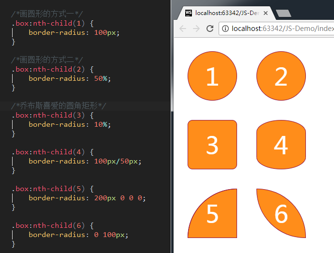

### 边框阴影：`box-shadow` 属性

格式举例：

```javascript
	box-shadow: 水平偏移 垂直偏移 模糊程度 阴影大小 阴影颜色

	box-shadow: 15px 21px 48px -2px #666;
```

参数解释：

- 水平偏移：正值向右 负值向左。
- 垂直偏移：正值向下 负值向上。
- 模糊程度：不能为负值。

效果如下：

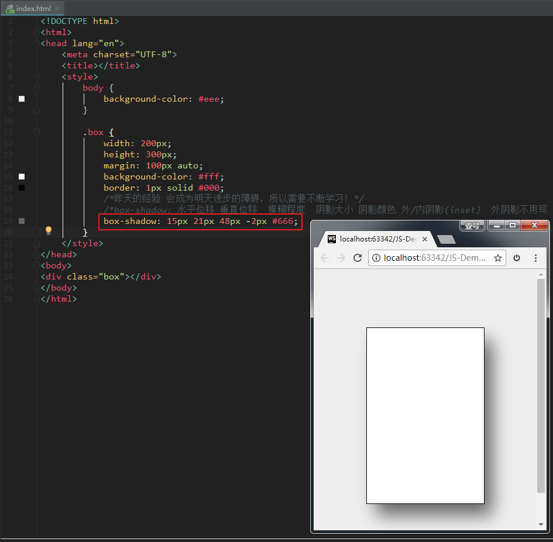

另外，后面还可以再加一个inset属性，表示内阴影。如果不写，则默认表示外阴影。例如：

```javascript
	box-shadow:3px 3px 3px 3px #666 inset;
```

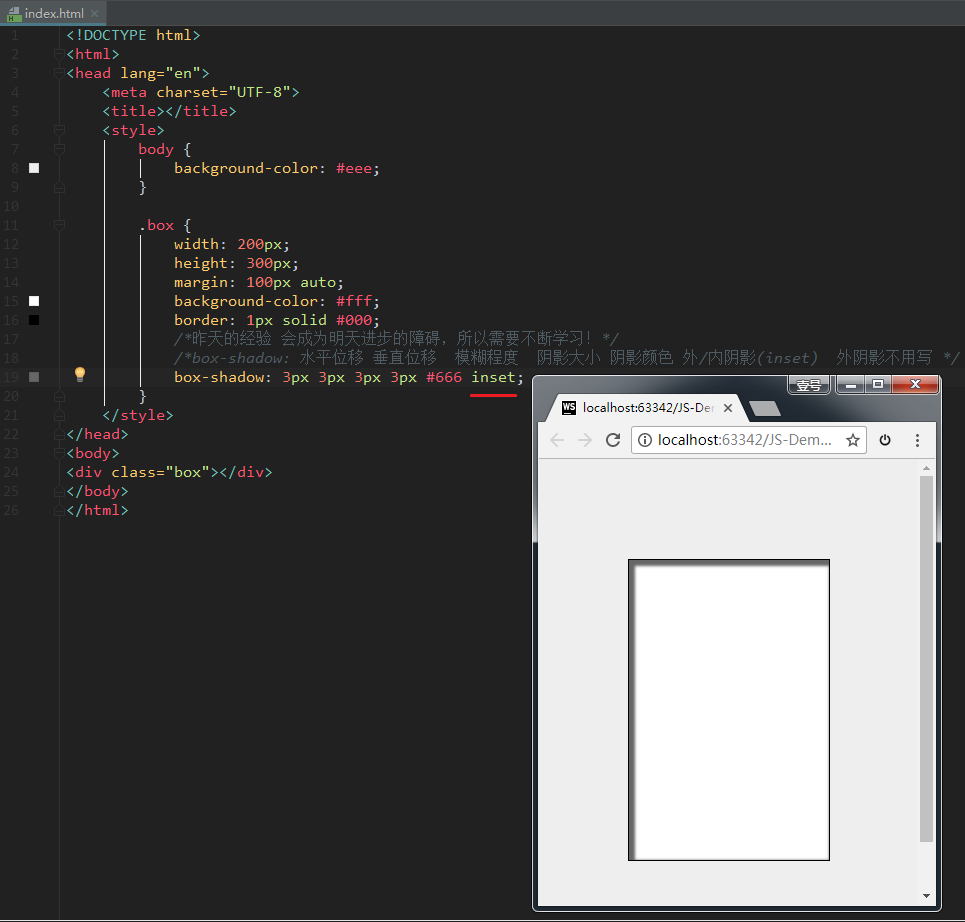

**注意**：设置边框阴影不会改变盒子的大小，即不会影响其兄弟元素的布局。

我们还可以设置多重边框阴影，实现更好的效果，增强立体感。

### 边框图片

边框图片有以下属性：

```javascript
/* 边框图片的路径*/
	border-image-source: url("images/border.png");

	/* 图片边框的裁剪*/
	border-image-slice: 27;

	/*图片边框的宽度*/
	border-image-width: 27px;

	/*边框图片的平铺*/
	/* repeat :正常平铺 但是可能会显示不完整*/
	/*round: 平铺 但是保证 图片完整*/
	/*stretch: 拉伸显示*/
	border-image-repeat: stretch;
```

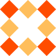


这张图片将会被“切割”成**九宫格**形式，然后进行平铺。四个角位置、形状保持不变，中心位置和水平垂直向两个方向平铺：

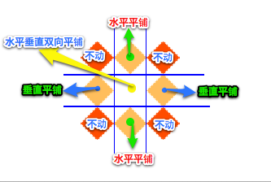

再具体一点：

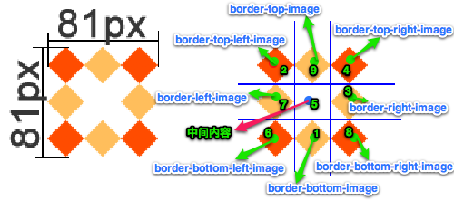

# 12-CSS3属性详解：动画详解

## 过渡：transition

`transition`的中文含义是**过渡**。过渡是CSS3中具有颠覆性的一个特征，可以实现元素**不同状态间的平滑过渡**（补间动画），经常用来制作动画效果。

- 补间动画：自动完成从起始状态到终止状态的的过渡。不用管中间的状态。
- 帧动画：通过一帧一帧的画面按照固定顺序和速度播放。如电影胶片。

transition 包括以下属性

- `transition-property: all;` 如果希望所有的属性都发生过渡，就使用all。
- `transition-duration: 1s;` 过渡的持续时间。
- `transition-timing-function: linear;` 运动曲线。属性值可以是：
  - `linear` 线性
  - `ease` 减速
  - `ease-in` 加速
  - `ease-out` 减速
  - `ease-in-out` 先加速后减速
- `transition-delay: 1s;` 过渡延迟。多长时间后再执行这个过渡动画。

上面的四个属性也可以写成**综合属性**：

```javascript
	transition: 让哪些属性进行过度 过渡的持续时间 运动曲线 延迟时间;

	transition: all 3s linear 0s;
```

其中，`transition-property`这个属性是尤其需要注意的，不同的属性值有不同的现象。我们来示范一下。

如果设置 `transition-property: width`，意思是只让盒子的宽度在变化时进行过渡。效果如下：

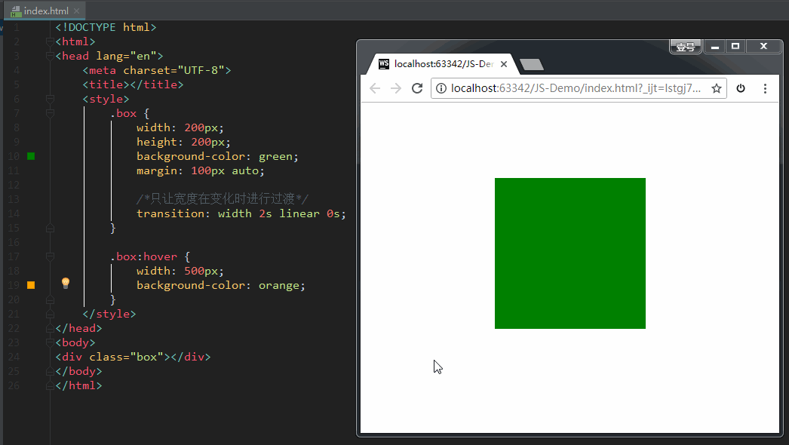

如果设置 `transition-property: all`，意思是让盒子的所有属性（包括宽度、背景色等）在变化时都进行过渡。效果如下：

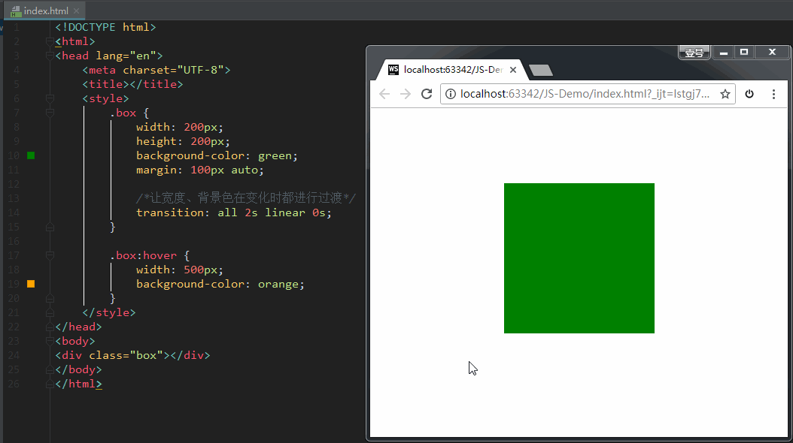

## 2D 转换

**转换**是 CSS3 中具有颠覆性的一个特征，可以实现元素的**位移、旋转、变形、缩放**，甚至支持矩阵方式。

转换再配合过渡和动画，可以取代大量早期只能靠 Flash 才可以实现的效果。

在 CSS3 当中，通过 `transform` 转换来实现 2D 转换或者 3D 转换。

- 2D转换包括：缩放、移动、旋转。

我们依次来讲解。

### 1、缩放：`scale`

格式：

```javascript
	transform: scale(x, y);

	transform: scale(2, 0.5);
```

参数解释： x：表示水平方向的缩放倍数。y：表示垂直方向的缩放倍数。如果只写一个值就是等比例缩放。

取值：大于1表示放大，小于1表示缩小。不能为百分比。

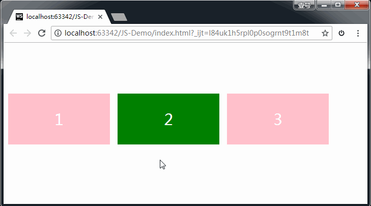

```html
        .box .box2:hover {
            /*width: 500px;*/
            /*height: 400px;*/
            background-color: yellowgreen;

            /* transform:  css3中用于做变换的属性
                scale(x,y)：缩放 */
            transform: scale(2, 0.5);
        }
```

上图可以看到，给 box1 设置 2D 转换，并不会把兄弟元素挤走。

### 2、位移：translate

格式：

```javascript
	transform: translate(水平位移, 垂直位移);

	transform: translate(-50%, -50%);
```

参数解释：

- 参数为百分比，相对于自身移动。
- 正值：向右和向下。 负值：向左和向上。如果只写一个值，则表示水平移动。

格式举例：

```html
        div:nth-child(2) {
            background-color: pink;
            transition: all 1s;
        }

        /* translate:(水平位移，垂直位移)*/
        div:nth-child(2):hover {
            transform: translate(-50%, -50%);
        }
```

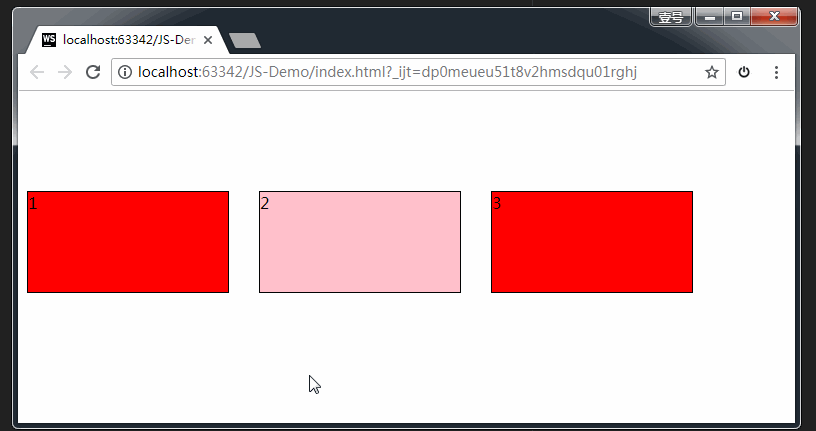

**应用：**让绝对定位中的盒子在父亲里居中

我们知道，如果想让一个**标准流中的盒子在父亲里居中**（水平方向看），可以将其设置`margin: 0 auto`属性。

可如果盒子是绝对定位的，此时已经脱标了，如果还想让其居中（位于父亲的正中间），可以这样做：

```text
	div {
		width: 600px;
		height: 60px;
		position: absolute;  绝对定位的盒子
		left: 50%;           首先，让左边线居中
		top: 0;
		margin-left: -300px;  然后，向左移动宽度（600px）的一半
	}
```

如上方代码所示，我们先让这个宽度为600px的盒子，左边线居中，然后向左移动宽度（600px）的一半，就达到效果了。

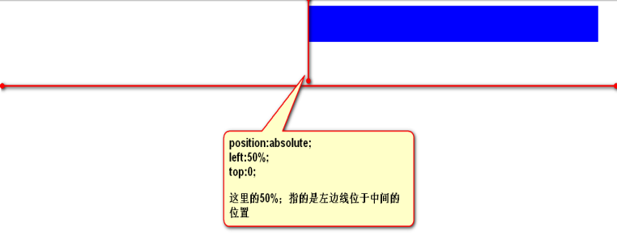

现在，我们还可以利用偏移 translate 来做，这也是比较推荐的写法：

```javascript
	div {
	    width: 600px;
	    height: 60px;
	    background-color: red;
	    position: absolute;       绝对定位的盒子
	    left: 50%;               首先，让左边线居中
	    top: 0;
	    transform: translate(-50%);    然后，利用translate，往左走自己宽度的一半【推荐写法】
	}
```

### 3、旋转：rotate

格式：

```javascript
	transform: rotate(角度);

	transform: rotate(45deg);
```

参数解释：正值 顺时针；负值：逆时针。

举例：

```html
<!DOCTYPE html>
<html>
<head lang="en">
    <meta charset="UTF-8">
    <title></title>
    <style>
        .box {
            width: 200px;
            height: 200px;
            background-color: red;
            margin: 50px auto;
            color: #fff;
            font-size: 50px;
            transition: all 2s; /* 过渡：让盒子在进行 transform 转换的时候，有个过渡期 */
        }

        /* rotate（角度）旋转 */
        .box:hover {
            transform: rotate(-405deg); /* 鼠标悬停时，让盒子进行旋转 */
        }

    </style>
</head>
<body>
<div class="box">1</div>

</div>
</body>
</html>
```

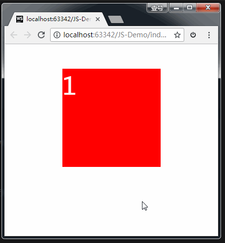

注意，上方代码中，我们给盒子设置了 transform 中的 rotate 旋转，但同时还要给盒子设置 transition 过渡。如果没有这行过渡的代码，旋转会直接一步到位，效果如下：（不是我们期望的效果）

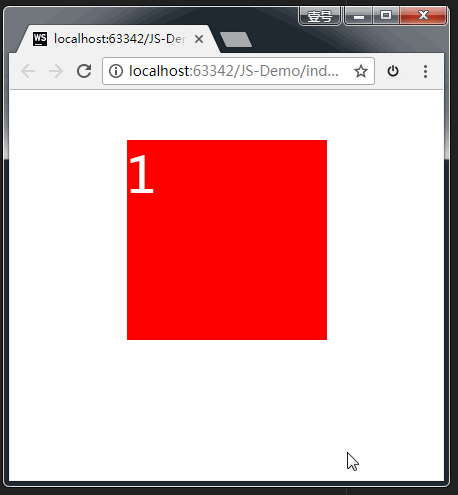

## 3D 转换

### [#](https://web.qianguyihao.com/02-CSS基础/12-CSS3属性详解：动画详解.html#_1、旋转-rotatex、rotatey、rotatez)1、旋转：rotateX、rotateY、rotateZ

**3D坐标系（左手坐标系）**


如上图所示，伸出左手，让拇指和食指成“L”形，大拇指向右，食指向上，中指指向前方。拇指、食指和中指分别代表X、Y、Z轴的正方向，这样我们就建立了一个左手坐标系。

浏览器的这个平面，是X轴、Y轴；垂直于浏览器的平面，是Z轴。

**旋转的方向：（左手法则）**

左手握住旋转轴，竖起拇指指向旋转轴的**正方向**，正向就是**其余手指卷曲的方向**。

从上面这句话，我们也能看出：所有的3d旋转，对着正方向去看，都是顺时针旋转。

**格式：**

```javascript
	transform: rotateX(360deg);    //绕 X 轴旋转360度

	transform: rotateY(360deg);    //绕 Y 轴旋转360度

	transform: rotateZ(360deg);    //绕 Z 轴旋转360度
```

**格式举例：**

（1）rotateX 举例：

```html
<!DOCTYPE html>
<html>
<head lang="en">
    <meta charset="UTF-8">
    <title></title>
    <style>
        .rotateX {
            width: 300px;
            height: 226px;
            margin: 200px auto;

            /* 透视 :加给变换的父盒子*/
            /* 设置的是用户的眼睛距离 平面的距离*/
            /* 透视效果只是视觉上的呈现，并不是正真的3d*/
            perspective: 110px;
        }

        img {
            /* 过渡*/
            transition: transform 2s;
        }

        /* 所有的3d旋转，对着正方向去看，都是顺时针旋转*/
        .rotateX:hover img {
            transform: rotateX(360deg);
        }

    </style>
</head>
<body>
<div class="rotateX">
    
</div>
</body>
</html>
```


上方代码中，我们最好加个透视的属性，方能看到3D的效果；没有这个属性的话，图片旋转的时候，像是压瘪了一样。

而且，透视的是要加给图片的父元素 div，方能生效。我们在后面会讲解透视属性。

（2）rotateY 举例：

```html
<!DOCTYPE html>
<html>
<head lang="en">
    <meta charset="UTF-8">
    <title></title>
    <style>
        .rotateY {
            width: 237px;
            height: 300px;
            margin: 100px auto;

            /* 透视 */
            perspective: 150px;
        }

        img {
            transition: all 2s;  /* 过渡 */
        }

        .rotateY:hover img {
            transform: rotateY(360deg);
        }
    </style>
</head>
<body>
<div class="rotateY">
    
</div>
</body>
</html>
```


（3）rotateZ 举例：

```html
<!DOCTYPE html>
<html>
<head lang="en">
    <meta charset="UTF-8">
    <title></title>
    <style>
        .rotateZ {
            width: 330px;
            height: 227px;
            margin: 100px auto;

            /* 透视*/
            perspective: 200px;
        }

        img {
            transition: all 1s;
        }

        .rotateZ:hover img {
            transform: rotateZ(360deg);
        }
    </style>
</head>
<body>
<div class="rotateZ">
    
</div>
</body>
</html>
```


### 3、透视：perspective

在CSS中，`perspective` 是一个与3D变换相关的属性，用于定义观察者与元素之间的透视距离，从而影响3D效果的深度感和视觉表现。它通常与`transform`属性（如`rotateX`、`rotateY`、`translateZ`等）配合使用，模拟现实世界中的透视效果。以下是对`perspective`的详细解释，包括其作用、用法和逻辑：

**1. 什么是 `perspective`？**

- **定义**：`perspective` 指定了观察者（用户）与元素Z轴平面的距离，决定了3D变换的透视效果强度。
- **直观理解**：想象你在看一个物体，离得越近，物体变形（透视感）越明显；离得越远，透视感越弱。`perspective` 就像设置了这个“距离”。
- **单位**：通常使用长度值（如`px`、`em`），值越小，透视效果越强（变形更夸张）；值越大，效果越平缓。

**2. 如何使用 `perspective`？**

`perspective` 有两种使用方式：

**(1) 作为单独属性**

- **语法**：`perspective: 值;`
- **应用范围**：作用于元素的父容器，影响所有子元素的3D变换。
- **示例**：
  ```css
  .container {
      perspective: 500px; /* 设置透视距离为500px */
  }
  .box {
      width: 100px;
      height: 100px;
      background: red;
      transform: rotateY(45deg); /* 子元素应用3D变换 */
  }
  ```
  **HTML**：
  ```html
  <div class="container">
      <div class="box"></div>
  </div>
  ```
  **效果**：
  - `.box` 沿Y轴旋转45度，透视点基于父容器的`perspective: 500px`，呈现3D倾斜效果。

**(2) 作为 `transform` 的函数**

- **语法**：`transform: perspective(值);`
- **应用范围**：仅作用于当前元素，与其他变换函数（如`rotate`、`translate`）组合。
- **示例**：
  ```css
  .box {
      width: 100px;
      height: 100px;
      background: blue;
      transform: perspective(500px) rotateY(45deg);
  }
  ```
  **效果**：
  - 透视效果直接应用于`.box`，与其他变换一起执行。

**区别**：

- **父元素方式**（`perspective: 值`）：适合多个子元素共享同一透视点，模拟统一场景。
- **变换函数方式**（`transform: perspective()`）：适合单独控制某个元素的透视，灵活但不影响其他元素

## 动画

动画是CSS3中具有颠覆性的特征，可通过设置**多个节点** 来精确控制一个或一组动画，常用来实现**复杂**的动画效果。

### 1、定义动画的步骤

（1）通过@keyframes定义动画；

（2）将这段动画通过百分比，分割成多个节点；然后各节点中分别定义各属性；

（3）在指定元素里，通过 `animation` 属性调用动画。

之前,我们在 js 中定义一个函数的时候，是先定义，再调用：

我们在 CSS3 中**定义动画**的时候，也是**先定义，再调用**：

```javascript
    定义动画：
        @keyframes 动画名{
            from{ 初始状态 }
            to{ 结束状态 }
        }

     调用：
      animation: 动画名称 持续时间；
```

其中，animation属性的格式如下：

```javascript
            animation: 定义的动画名称 持续时间  执行次数  是否反向  运动曲线 延迟执行。(infinite 表示无限次)

            animation: move1 1s  alternate linear 3;

            animation: move2 4s;
```

```html
<!DOCTYPE html>
<html>
<head lang="en">
    <meta charset="UTF-8">
    <title></title>
    <style>
        .box {
            width: 100px;
            height: 100px;
            margin: 100px;
            background-color: red;

            /* 调用动画*/
            /* animation: 动画名称 持续时间  执行次数  是否反向  运动曲线 延迟执行。infinite 表示无限次*/
            /*animation: move 1s  alternate linear 3;*/
            animation: move2 4s;
        }

        /* 方式一：定义一组动画*/
        @keyframes move1 {
            from {
                transform: translateX(0px) rotate(0deg);
            }
            to {
                transform: translateX(500px) rotate(555deg);
            }
        }

        /* 方式二：定义多组动画*/
        @keyframes move2 {
            0% {
                transform: translateX(0px) translateY(0px);
                background-color: red;
                border-radius: 0;
            }

            25% {
                transform: translateX(500px) translateY(0px);

            }

            /*动画执行到 50% 的时候，背景色变成绿色，形状变成圆形*/
            50% {
                /* 虽然两个方向都有translate，但其实只是Y轴上移动了200px。
                因为X轴的500px是相对最开始的原点来说的。可以理解成此时的 translateX 是保存了之前的位移 */
                transform: translateX(500px) translateY(200px);
                background-color: green;
                border-radius: 50%;
            }

            75% {
                transform: translateX(0px) translateY(200px);
            }

            /*动画执行到 100% 的时候，背景色还原为红色，形状还原为正方形*/
            100% {
                /*坐标归零，表示回到原点。*/
                transform: translateX(0px) translateY(0px);
                background-color: red;
                border-radius: 0;
            }
        }
    </style>
</head>
<body>
<div class="box">

</div>
</body>
</html>
```


### 2、动画属性

我们刚刚在调用动画时，animation属性的格式如下：

animation属性的格式如下：

```javascript
       animation: 定义的动画名称  持续时间  执行次数  是否反向  运动曲线 延迟执行。(infinite 表示无限次)

            animation: move1 1s  alternate linear 3;

            animation: move2 4s;
```

可以看出，这里的 animation 是综合属性，接下来，我们把这个综合属性拆分看看。

（1）动画名称：

```javascript
	animation-name: move;
```

（2）执行一次动画的持续时间：

```javascript
	animation-duration: 4s;
```

备注：上面两个属性，是必选项，且顺序固定。

（3）动画的执行次数：

```javascript
	animation-iteration-count: 1;       //iteration的含义表示迭代
```

属性值`infinite`表示无数次。

（4）动画的方向：

```javascript
	animation-direction: alternate;
```

属性值：normal 正常，alternate 反向。

（5）动画延迟执行：

```javascript
	animation-delay: 1s;
```

（6）设置动画结束时，盒子的状态：

```javascript
	animation-fill-mode: forwards;
```

属性值： forwards：保持动画结束后的状态（默认）， backwards：动画结束后回到最初的状态。

（6）运动曲线：

```text
	animation-timing-function: ease-in;
```

属性值可以是：linear ease-in-out steps()等。

注意，如果把属性值写成**`steps()`**，则表示动画**不是连续执行**，而是间断地分成几步执行。我们接下来专门讲一下属性值 `steps()`。

### [#](https://web.qianguyihao.com/02-CSS基础/12-CSS3属性详解：动画详解.html#steps-的效果)steps()的效果

我们还是拿上面的例子来举例，如果在调用动画时，我们写成：

```javascript
	animation: move2 4s steps(2);
```

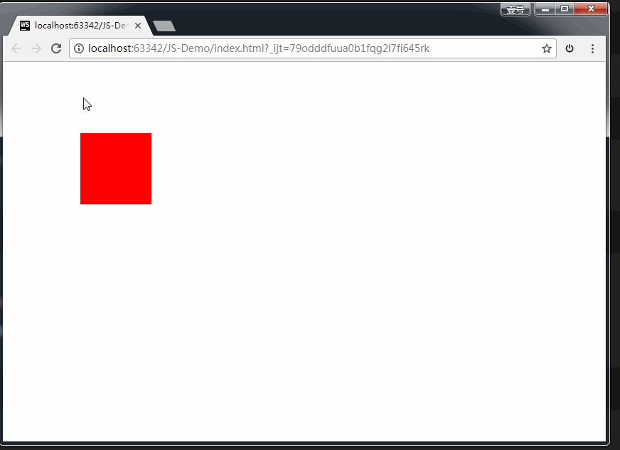

有了属性值 `steps()`，我们就可以作出很多不连续地动画效果。比如时钟；再比如，通过多张静态的鱼，作出一张游动的鱼。