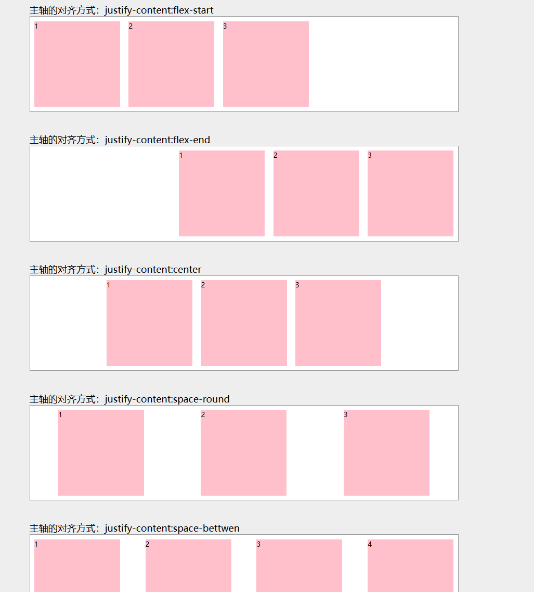
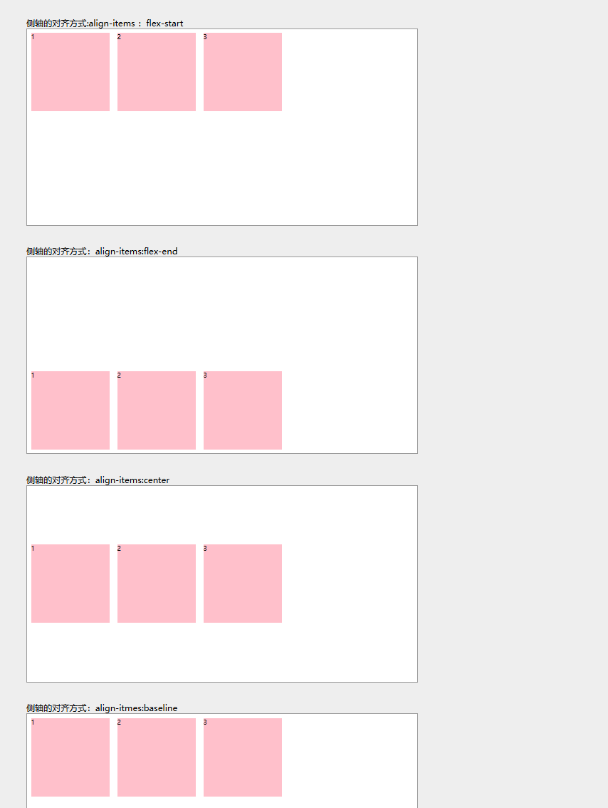
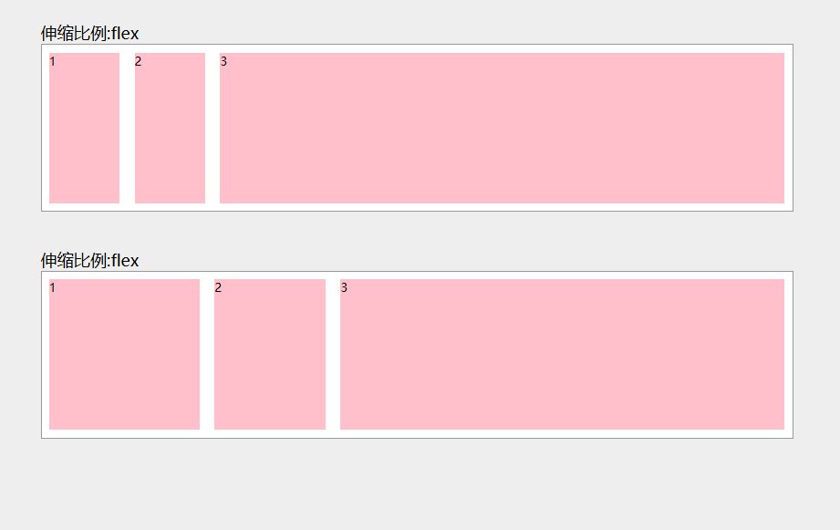
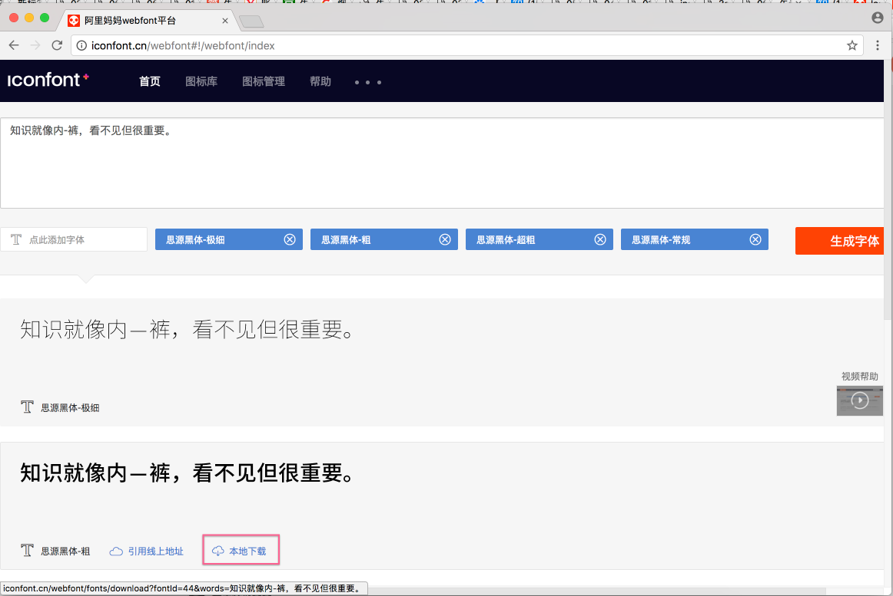
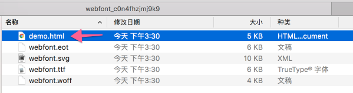
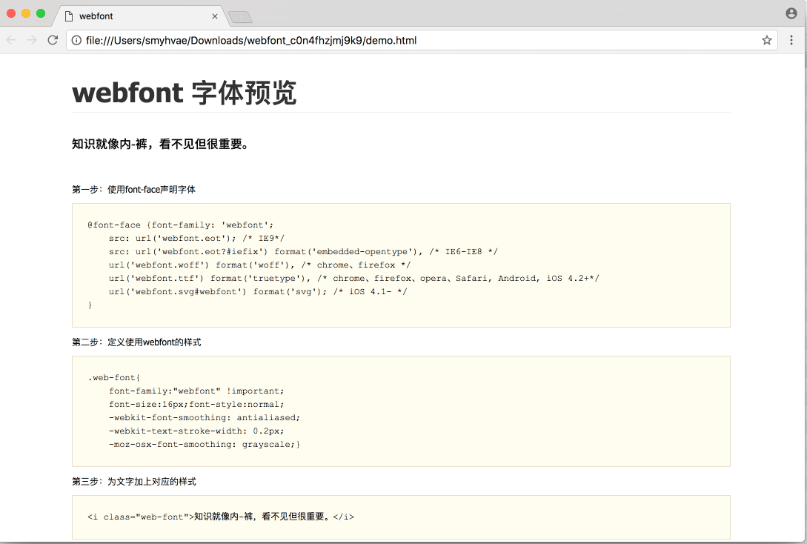
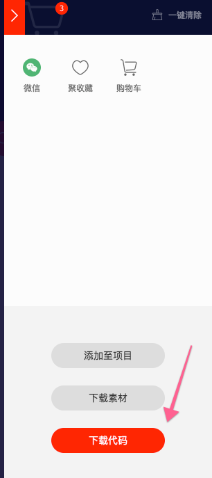
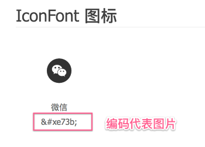
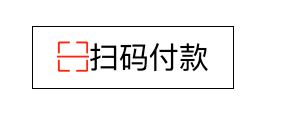
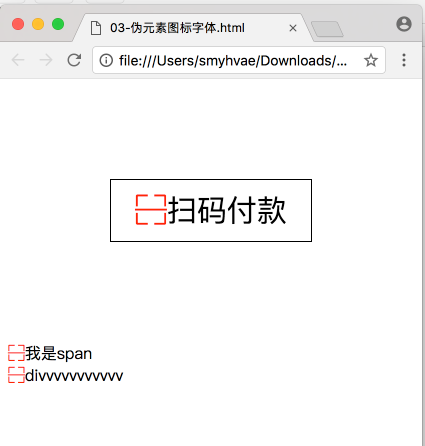

# 13-CSS3属性：Flex布局图文详解

### flex 布局的优势

1、**flex 布局的子元素不会脱离文档流**，很好地遵从了“流的特性”。

但你如果用 float 来做布局，float 属性的元素会脱离文档流，而且会涉及到各种 BFC、清除浮动的问题。浮动相关的问题，比较麻烦，所以也成了面试必问的经典题目。但有了 flex 布局之后，这些问题都不存在的。

2、**flex 是一种现代的布局方式，是 W3C 第一次提供真正用于布局的 CSS 规范**。 flex 提供了非常丰富的属性，非常灵活，让布局的实现更佳多样化，且方便易用。

flex 唯一的缺点就在于，它不支持低版本的 IE 浏览器。

flex 布局不支持 IE9 及以下的版本；IE10及以上也只是部分支持。如果你的页面不需要处理 IE浏览器的兼容性问题，则可以放心大胆地使用 flex 布局。

###  概念：弹性盒子、子元素

在讲 flex 的知识点之前，我们事先约定两个概念：

- **弹性盒子**：指的是使用 `display:flex` 或 `display:inline-flex` 声明的**父容器**。
- **子元素/弹性元素**：指的是父容器里面的子元素们（父容器被声明为 flex 盒子的情况下）。

### 概念：主轴和侧轴

在上面的“初体验”例子中，我们发现，弹性盒子里面的子元素们，默认是从左至右排列的，这个方向，代表的就是主轴的方向。

在此，我们引入主轴和侧轴的概念。

- 主轴：flex容器的主轴，默认是水平方向，从左向右。
- 侧轴：与主轴垂直的轴称作侧轴，默认是垂直方向，从上往下。

## 弹性盒子

### 声明定义

使用 `display:flex` 或 `display:inline-flex` 声明一个**父容器**为弹性盒子。此时，这个父容器里的子元素们，会遵循弹性布局。

备注：一般是用 `display:flex`这个属性。`display:inline-flex`用得较少。

### flex-direction 属性

`flex-direction`：用于设置盒子中**子元素**的排列方向。属性值可以是：

| 属性值         | 描述                             |
| :------------- | :------------------------------- |
| row            | 从左到右水平排列子元素（默认值） |
| column         | 从上到下垂直排列子元素           |
| row-reverse    | 从右向左排列子元素               |
| column-reverse | 从下到上垂直排列子元素           |

### flex-wrap 属性

`flex-wrap`：控制子元素溢出时的换行处理。

### [#](https://web.qianguyihao.com/02-CSS基础/13-CSS3属性：Flex布局图文详解.html#justify-content-属性)justify-content 属性

`justify-content`：控制子元素在主轴上的排列方式。

## [#](https://web.qianguyihao.com/02-CSS基础/13-CSS3属性：Flex布局图文详解.html#弹性元素)弹性元素

### justify-content 属性

- ```
  justify-content: flex-start;
  ```

  设置子元素在

  主轴上的对齐方式

  。属性值可以是：

  - `flex-start` 从主轴的起点对齐（默认值）
  - `flex-end` 从主轴的终点对齐
  - `center` 居中对齐
  - `space-around` 在父盒子里平分
  - `space-between` 两端对齐 平分

  **flex-start 和 flex-end**：集中一端，剩余空间在另一端。

  **center**：居中，两侧对称。

  **space-between**：两端贴边，中间均分。

  **space-around**：周围均分，项间距是两端间距的两倍。

  **space-evenly**：所有间距完全相等。

代码演示：（在浏览器中打开看效果）



### align-items 属性

`align-items`：设置子元素在**侧轴上的对齐方式**。属性值可以是： - `flex-start` 从侧轴开始的方向对齐 - `flex-end` 从侧轴结束的方向对齐 - `baseline` 基线 默认同flex-start - `center` 中间对齐 - `stretch` 拉伸

交叉轴是与主轴垂直的方向，默认情况下，如果主轴是水平方向（flex-direction: row），交叉轴就是垂直方向。

**flex-start**：靠交叉轴起点。

**flex-end**：靠交叉轴末尾。

**center**：交叉轴居中。

**baseline**：按文本基线对齐。

**stretch**：拉伸填满交叉轴。




### `flex`属性：设置子盒子的权重

**增长权重（flex-grow）**：

- 决定子项如何瓜分主轴上的剩余空间。
- 权重越高，分配的空间越多。

**缩小权重（flex-shrink）**：

- 决定子项如何分担空间不足时的压缩量。
- 权重越高，压缩得越多。



# 14-CSS3属性详解：Web字体

## 字体的常见格式

#### TureTpe格式：(**.ttf**)

.ttf 字体是Windows和Mac的最常见的字体，是一种RAW格式。

支持这种字体的浏览器有IE9+、Firefox3.5+、Chrome4+、Safari3+、Opera10+、iOS Mobile、Safari4.2+。

#### [#](https://web.qianguyihao.com/02-CSS基础/14-CSS3属性详解：Web字体.html#opentype格式-otf)OpenType格式：(**.otf**)

.otf 字体被认为是一种原始的字体格式，其内置在TureType的基础上。

支持这种字体的浏览器有Firefox3.5+、Chrome4.0+、Safari3.1+、Opera10.0+、iOS Mobile、Safari4.2+。

#### [#](https://web.qianguyihao.com/02-CSS基础/14-CSS3属性详解：Web字体.html#web-open-font-format格式-woff)Web Open Font Format格式：(**.woff**)

woff字体是Web字体中最佳格式，他是一个开放的TrueType/OpenType的压缩版本，同时也支持元数据包的分离。

支持这种字体的浏览器有IE9+、Firefox3.5+、Chrome6+、Safari3.6+、Opera11.1+。

#### [#](https://web.qianguyihao.com/02-CSS基础/14-CSS3属性详解：Web字体.html#embedded-open-type格式-eot)Embedded Open Type格式：(**.eot**)

.eot字体是IE专用字体，可以从TrueType创建此格式字体，支持这种字体的浏览器有IE4+。

#### [#](https://web.qianguyihao.com/02-CSS基础/14-CSS3属性详解：Web字体.html#svg格式-svg)SVG格式：(**.svg**)

.svg字体是基于SVG字体渲染的一种格式。

支持这种字体的浏览器有Chrome4+、Safari3.1+、Opera10.0+、iOS Mobile Safari3.2+。

**总结：**

了解了上面的知识后，**我们就需要为不同的浏览器准备不同格式的字体**。通常我们会通过字体生成工具帮我们生成各种格式的字体，因此无需过于在意字体格式之间的区别。

## WebFont 的使用步骤

打开网站[http://iconfont.cn/webfont#!/webfont/index (opens new window)](http://iconfont.cn/webfont#!/webfont/index)，如下：



上图中，比如我想要「思源黑体-粗」这个字体，那我就点击红框中的「本地下载」。

解压后如下：

上图中， 我们把箭头处的html文件打开，里面告诉了我们 webfont 的**使用步骤**：



（1）第一步：使用font-face声明字体

```css
@font-face {font-family: 'webfont';
    src: url('webfont.eot'); /* IE9*/
    src: url('webfont.eot?#iefix') format('embedded-opentype'), /* IE6-IE8 */
    url('webfont.woff') format('woff'), /* chrome、firefox */
    url('webfont.ttf') format('truetype'), /* chrome、firefox、opera、Safari, Android, iOS 4.2+*/
    url('webfont.svg#webfont') format('svg'); /* iOS 4.1- */
}
```

（2）第二步：定义使用webfont的样式

```css
.web-font{
    font-family:"webfont" !important;
    font-size:16px;font-style:normal;
    -webkit-font-smoothing: antialiased;
    -webkit-text-stroke-width: 0.2px;
    -moz-osx-font-smoothing: grayscale;}
```

（3）第三步：为文字加上对应的样式

```html
<i class="web-font">这一分钟，你和我在一起，因为你，我会记得那一分钟。从现在开始，我们就是一分钟的朋友。这是事
```

**举例：**

我们按照上图中的步骤来，引入这个字体。完整版代码如下：

```html
<!DOCTYPE html>
<html>
<head lang="en">
    <meta charset="UTF-8">
    <title></title>
    <style>

        p{
            font-size:30px;
        }

        /*  如果要在网页中使用web字体（用户电脑上没有这种字体）*/
        /* 第一步：声明字体*/
        /* 告诉浏览器 去哪找这个字体*/
        @font-face {font-family: 'my-web-font';
            src: url('font/webfont.eot'); /* IE9*/
            src: url('font/webfont.eot?#iefix') format('embedded-opentype'), /* IE6-IE8 */
            url('font/webfont.woff') format('woff'), /* chrome、firefox */
            url('font/webfont.ttf') format('truetype'), /* chrome、firefox、opera、Safari, Android, iOS 4.2+*/
            url('font/webfont.svg#webfont') format('svg'); /* iOS 4.1- */
        }
        /* 第二步：定义一个类名，谁加这类名，就会使用 webfont 字体*/
        .webfont{
            font-family: 'my-web-font';
        }
    </style>
</head>
<body>
    <!-- 第三步：引用 webfont 字体 -->
    <p class="webfont">生命壹号，永不止步</p>
</body>
</html>
```

代码解释：

（1）`my-web-font`这个名字是随便起的，只要保证第一步和第二步中的名字一样就行。

（2）因为我把字体文件单独放在了font文件夹中，所以在src中引用字体资源时，写的路径是 `font/...`

## 字体图标（阿里的 iconfont 网站举例）

我们其实可以把图片制作成字体。常见的做法是：把网页中一些小的图标，借助工具生成一个字体包，然后就可以像使用文字一样使用图标了。这样做的优点是：

- 将所有图标打包成字体库，减少请求；
- 具有矢量性，可保证清晰度；
- 使用灵活，便于维护。

也就是说，我们可以把这些图标当作字体来看待，凡是字体拥有的属性（字体大小、颜色等），均适用于图标。

**使用步骤如下：**（和上一段的使用步骤是一样的）

打开网站[http://iconfont.cn/ (opens new window)](http://iconfont.cn/)，找到想要的图标，加入购物车。然后下载下来：



压缩包下载之后，解压，打开里面的demo.html，里面告诉了我们怎样引用这些图标。



**举例1**：（图标字体引用）

```html
<!DOCTYPE html>
<html>
<head lang="en">
    <meta charset="UTF-8">
    <title></title>
    <style>
        /*申明字体*/
        @font-face {font-family: 'iconfont';
            src: url('font/iconfont.eot'); /* IE9*/
            src: url('font/iconfont.eot?#iefix') format('embedded-opentype'), /* IE6-IE8 */
            url('font/iconfont.woff') format('woff'), /* chrome、firefox */
            url('font/iconfont.ttf') format('truetype'), /* chrome、firefox、opera、Safari, Android, iOS 4.2+*/
            url('font/iconfont.svg#iconfont') format('svg'); /* iOS 4.1- */
        }

        .iconfont{
            font-family: iconfont;
        }

        p{
            width: 200px;
            border: 1px solid #000;
            line-height: 60px;
            font-size:30px;
            margin:100px auto;
            text-align: center;
        }

        p span{
            color:red;
        }
    </style>
</head>
<body>
    <!-- 【重要】编码代表图标 -->
    <p><span class="iconfont">&#xe628;</span>扫码付款</p>
</body>
</html>
```

效果如下：



**举例2**：（伪元素的方式使用图标字体）

如果想要在文字的前面加图标字体，我们更习惯采用**伪元素**的方式进行添加。

代码如下：

```html
<!DOCTYPE html>
<html>
<head lang="en">
    <meta charset="UTF-8">
    <title></title>
    <style>
        /*申明字体*/
        @font-face {font-family: 'iconfont';
            src: url('font/iconfont.eot'); /* IE9*/
            src: url('font/iconfont.eot?#iefix') format('embedded-opentype'), /* IE6-IE8 */
            url('font/iconfont.woff') format('woff'), /* chrome、firefox */
            url('font/iconfont.ttf') format('truetype'), /* chrome、firefox、opera、Safari, Android, iOS 4.2+*/
            url('font/iconfont.svg#iconfont') format('svg'); /* iOS 4.1- */
        }


        p{
            width: 200px;
            border: 1px solid #000;
            line-height: 60px;
            font-size:30px;
            margin:100px auto;
            text-align: center;
            position: relative;
        }

        .icon::before{
            /*&#xe628;*/
            content:"\e628";
            /*position: absolute;*/
            /*left:10px;*/
            /*top:0px;*/
            font-family: iconfont;
            color:red;
        }

        span{
            position: relative;

        }


    </style>
</head>
<body>
    <p class="icon">扫码付款</p>
    <span class="icon" >我是span</span>
    <div class="icon">divvvvvvvvvvv</div>
</body>
</html>
```

效果如下：




