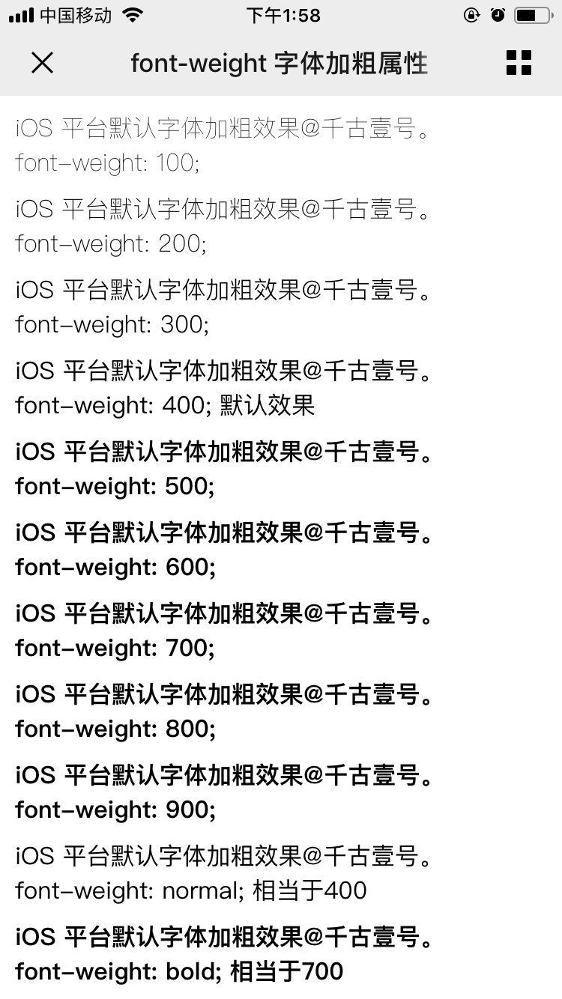

# 01-CSS中的非布局样式

## 前言

CSS中，有很多**非布局样式**，这些样式（属性）和与布局无关，包括：

- 字体、字重、颜色、大小、行高
- 背景、边框
- 滚动、换行
- 装饰性属性（粗体、斜体、下划线）等。

这篇文章，我们来对上面的部分样式做一个回顾。

## [#](https://web.qianguyihao.com/03-CSS进阶/01-CSS中的非布局样式.html#边框)边框

如何用边框画一个三角形？详见《02-CSS基础/06-CSS盒模型详解》中的最后一段。

```html
<!DOCTYPE html>
<html>
<head>
  <style>
    .triangle {
      width: 0;
      height: 0;
      border-left: 50px solid transparent; /* 左边透明 */
      border-right: 50px solid transparent; /* 右边透明 */
      border-top: 50px solid red; /* 上边有颜色，形成向下三角形 */
    }
  </style>
</head>
<body>
  <div class="triangle"></div>
</body>
</html>
```

## [#](https://web.qianguyihao.com/03-CSS进阶/01-CSS中的非布局样式.html#文字换行)文字换行

- ovferflow-wrap：通用的属性。用来说明当一个不能被分开的字符串（单词）太长而不能填充其包裹盒时，为防止其溢出，浏览器是否允许这样的单词**中断换行**。
- word-break：指定了怎样在单词内断行。这里涉及到CJK（中文/日文/韩文）的文字换行。
- white-space：空白处是否换行。

上面这三个 css 属性进行组合，可以设置各种不同的属性。

当然，如果想让一段很长的文本不换行，可以直接设置`white-space: nowrap` 这一个属性即可。如果想换行，可以试试`white-space: pre-wrap`。

# 02-CSS布局

### 常见的布局属性

（1）`display` 确定元素的显示类型：

- block：块级元素。
- inline：行内元素。
- inline-block：对外的表现是行内元素（不会独占一行），对内的表现是块级元素（可以设置宽高）。

（2）`position` 确定元素的位置：

- static：默认属性值。
- relative：相对定位。相对于元素本身进行偏移，**不会改变它所占据的空间**。
- absolute：绝对定位。相对于父元素中最近的 relative/absolute 进行偏移，会脱离文档流。音标：[ˈæbsəluːt]。
- fixed：固定定位。相对于可视区域固定，会脱离文档流。

`relative`、`absolute`、`fixed`这三个属性，可以结合 z-index 来设置层级。

### 常见的布局方法

1、**table 表格布局**：早期使用的布局，如今用得很少。

2、**float 浮动 + margin**：为了兼容低版本的IE浏览器，很多网站（比如腾讯新闻、网易新闻、淘宝等）都会采用 float 布局。

3、**inline-block 布局**：对外的表现是行内元素（不会独占一行），对内的表现是块级元素（可以设置宽高）。

4、**flex 布局**：为布局而生，非常灵活，是最为推荐的布局写法。

唯一的缺点是兼容性问题

## float 布局

是 CSS 中一种比较麻烦的属性，涉及到 BFC 和清除浮动（面试的重点）。

### [#](https://web.qianguyihao.com/03-CSS进阶/02-CSS布局.html#float-属性的特点)float 属性的特点

- 元素浮动
- **脱离文档流，但不脱离文本流**

代码举例：

下面这两个并列的`div1`和`div2`，默认是在标准流中的：


在此基础之上，如果给`div1`增加`float: left`属性后，效果如下：


上图中，可以看到，`div1`设置为浮动后，会脱离文档流，不会对`div2`的布局造成影响；但是`div1`不会脱离文本流，它会影响`div2`中文字的排列。

其实，这正是 float 属性的作用。float 本身是用来做图文混排、文字环绕的效果。

### float 所带来的影响

**1、对自身的影响**：

- 形成“块”（BFC）
- 位置尽量靠上
- 位置尽量靠左/右

下面这两个并列的`div1`和`div2`，设置为浮动之后的效果：（都是尽量靠左显示的）


在上方代码的基础之上，增加 `div2`的宽度之后，会发现，`div2`掉下来了：


**2、对兄弟元素的影响**：

- 不影响其他块级元素的位置
- 影响其他块级元素的内部文本

**3、对父级元素的影响**：

- 从父级的布局中“消失”
- 造成父级元素的高度塌陷：父级元素撑开 div1 之后（父级元素里没有其他元素的情况下），如果设置 div1 为 float 之后，，会让父级元素的高度变为0。

## [#](https://web.qianguyihao.com/03-CSS进阶/02-CSS布局.html#inline-block-布局)inline-block 布局

对外的表现是行内元素（不会独占一行），对内的表现是块级元素（可以设置宽高）。

**思路**：像文本一样去排列 block 元素，没有清除浮动等问题。

**存在的问题**：需要处理间隙。代码举例如下：

```html
<!DOCTYPE html>
<html lang="en">

<head>
	<meta charset="UTF-8">
	<meta name="viewport" content="width=device-width, initial-scale=1.0">
	<title>Document</title>
</head>
<style>
	.container{
		width: 300px;
		height: 300px;
		background: pink;
	}

	.div1{
		width: 100px;
		height: 100px;
		background: green;
		display: inline-block;
	}

	.div2{
		width: 100px;
		height: 100px;
		background: yellowgreen;
		display: inline-block;
	}

	.div3{
		background: yellow;
	}
</style>

<body>
	<div class="container">
		<div class="div1">div1的inline-block 属性</div>
		<div class="div2">div2的inline-block 属性</div>
		<div class="div3">
			琴棋书画不会，洗衣做饭嫌累。
		</div>
	</div>
</body>

</html>
```


上面的代码，存在两个问题。

**问题一**：如果设置`div2`的宽度为 200px 之后，`div2` 掉下来。

**问题二**：`div1`和`div2`设置为 inline-block之后，这两个盒子之间存在了间隙。这是因为，此时的 `div1`和`div2` 已经被当成文本了。文本和文本之间，本身就会存在间隙。

为了去掉这个间隙，可以有几种解决办法：

办法1：设置父元素`container`的字体大小为0，即`font-size: 0`，然后设置子元素 `div1`、`div2`的字体`font-size: 12px`。

办法2：在写法上，去掉`div1`和`div2`之间的换行。改为：

```html
<div class="div1">div1的inline-block 属性</div><div class="div2">div2的inline-block 属性<
```

# 03-网页设计和开发中，关于字体的常识

## 字体分类

常见的字体可以分为两类：**衬线体、无衬线体**。


**1、serif（衬线体）**：在字的笔画开始、结束的地方有额外的装饰，而且笔画的粗细会有所不同。

常见的衬线体有：

- 宋体、楷体
- Times New Roman

**2、sans-serif（无衬线体）**：笔划粗细基本一致，只剩下主干，造型简明有力，起源也很晚。适用于标题、广告等，识别性高。

常见的无衬线体有：

- 黑体
- Windows 平台默认的中文字体：微软雅黑（Microsoft Yahei）
- Windows 平台默认的英文字体：Arial
- Mac & iOS 平台默认的中文字体：苹方（PingFang SC）
- Mac & iOS 平台默认的英文字体：San Francisco
- Android 平台默认字体：Droid Sans

## 字体族

CSS 中的字体族可以理解成是某一类字体。常见的字体族可以分为五类：

- serif：衬线体。
- sans-serif：无衬线体。
- monospace：等宽字体。每一个字母所占的宽度是相同的。写代码的字体尽量用等宽字体。
- cursive：手写字体。比如徐静蕾手写体。
- fantasy：梦幻字体。比如一些艺术字。

## 多字体 fallback 机制

多字体 fallback 机制：当指定的字体找不到（或者某些文字不支持这个字体）时，那就接着往后找。比如：

```css
.div1{
    font-family: "PingFang SC", "Microsoft Yahei", monospace;
}
```

上方 CSS 代码的意思是：让指定标签元素中的文字，在 Mac & iOS 平台用苹方字体，在 Win 平台用微软雅黑字体，如果这两个字体都没有，就随便找一个等宽的字体进行渲染。

## font-weight：字体的加粗属性

**font-weight 属性**：在设置字体是否加粗时，属性值既可以直接填写 100 至 900 这样的数字，也可以填写`normal`、`bold`这样的单词。`normal`的值相当于 400，`bold`的值相当于 700。如下：

```css
font-weight: 100;
font-weight: 200;
font-weight: 300;
font-weight: 400;
font-weight: 500;
font-weight: 600;
font-weight: 700;
font-weight: 800;
font-weight: 900;

font-weight: normal; // 相当于 400
font-weight: bold;   // 相当于 700
```

关键问题来了。很多人会发现，在 Windows 平台的浏览器中， font-weight 无论是设置300、400，还是500，文字的粗细都没有任何变化，只有到600的时候才会加粗一下，感觉浏览器好像不支持这些数值，那搞这么多档位不就是多余的吗？

这个时候，大家就开始吐槽 Windows 电脑太挫、Windows 浏览器太挫；同时还会感叹 Mac 真香，支持字体的各种粗细。

**实际上，所有这些数值关键字浏览器都是支持的，之所以没有看到任何粗细的变化，是因为你所使用的字体不支持**。

就拿“微软雅黑”来举例，它只支持 400 和 700 这两种粗细，所以当你在代码里写成500的时候，也会被认为是400。但是 Mac 上的“苹方”字体，就支持从100到900之间的各种粗细。

再比如，前段时间，阿里巴巴开源的普惠字体，也是支持多种粗细的：

## 各大平台的默认字体加粗效果

一张图，胜过千言万语。解释了这么多，我们来看看各大平台的字体加粗效果是什么样的。

以下截图，都是我亲测的结果，如果你打算让别人看效果，直接把下面的图丢给他即可。像我这样贴心的前端，不多见了。

**1、Mac 平台的默认字体加粗效果**：（苹方字体）


**2、Windows 平台的默认字体加粗效果**：（微软雅黑字体）


**3、iOS 平台的默认字体加粗效果**：（苹方字体）



**4、Android 平台（华为 P30 Pro）的默认字体加粗效果**：（Droid Sans 字体）


### 总结各大平台的默认字体加粗档位（字重）

> 注意，系统默认的 normal 字重是400；加粗的 bold 字重是700。

1、Mac & iOS 平台的“苹方”字体的字重：（有6种粗细，`>=600`的加粗效果是相同的）

- 极细体：100
- 纤细体：200
- 细体：300
- 常规体：400
- 中黑体：500
- 中粗体：600、700、800、900

2、Windows 平台的“微软雅黑”字体的字重：（只有两种粗细 ；`>=600` 才会加粗，而且加粗效果相同）

- 不加粗的默认字体：100、200、300、400、500
- 加粗字体：600、700、800

3、Android 平台的 Droid Sans 字体的字重：（只有 `>=700`才会加粗；而且加粗效果相同）

- 不加粗的默认字体：100、200、300、400、500、600
- 加粗字体：700、800

**实战中，系统默认字体的加粗总结**：

- 如果你做的软件产品只有苹果系统（比如iOS或Mac），可以使用各种粗细和字重。
- 如果你做的软件产品包括了苹果系统（比如iOS或Mac）和非苹果系统（比如Android或Windows），建议直接使用normal（系统默认） 和 bold 这两种粗细。

# 04-如何让一个元素水平垂直居中？

## 如何让一个行内元素（文字、图片等）水平垂直居中

> 行内元素的居中问题比较简单。

### [#](https://web.qianguyihao.com/03-CSS进阶/04-如何让一个元素水平垂直居中？.html#行内元素水平居中)行内元素水平居中

给父容器设置：

```text
    text-align: center;
```

### 行内元素垂直居中

让**文字的行高** 等于 **盒子的高度**，可以让单行文本垂直居中。比如：

```css
    .father {
        height: 20px;
        line-height: 20px;
    }
```

## 如何让一个块级元素水平垂直居中

### margin: auto 的问题

在 CSS 中对元素进行水平居中是非常简单的：如果它是一个行内元素，就对它的父容器应用 `text-align: center`；如果它是一个块级元素，就对它自身应用 `margin: auto`或者 `margin: 0 auto`。

在这里，`margin: auto`相当于`margin: auto auto auto auto`。`margin: 0 auto`相当于`margin: 0 auto 0 auto`，四个值分别对应上右下左。其计算值取决于**剩余空间**。

但是，如果要对一个元素垂直居中，`margin: auto`就行不通了。

比如下面这段代码：

```html
<!DOCTYPE html>
<html lang="en">
<head>
    <meta charset="UTF-8">
    <meta name="viewport" content="width=device-width, initial-scale=1.0">
    <title>Document</title>
    <style>
        .father{
            height: 500px;
            background: pink;
        }
        .son {
            width: 300px;
            height: 200px;
            background: red;

            margin: auto;
        }
    </style>
</head>
<body>
    <div class="father">
        <div class="son"></div>
    </div>
    <script></script>
</body>
</html>
```

上面的代码中，父元素和子元素都是定宽高的，即便在这种情况下，我给子元素设置 `margin: auto`，子元素依然没有垂直居中。

那还有没有比较好的通用的做法呢？

### [#](https://web.qianguyihao.com/03-CSS进阶/04-如何让一个元素水平垂直居中？.html#方式1-绝对定位-margin)方式1：绝对定位 + margin

> 需要指定子元素的宽高，不推荐。

```html
<!DOCTYPE html>
<html lang="en">
<head>
    <meta charset="UTF-8">
    <meta name="viewport" content="width=device-width, initial-scale=1.0">
    <title>Document</title>
    <style>
        * {
            margin: 0;
            padding: 0;
        }
        .father{
            position: relative;
            min-height: 500px;
            background: pink;
        }
        .son {
            position: absolute;
            width: 200px;
            height: 100px;
            background: red;
            top: 50%;
            left: 50%;
            margin-top: -50px;
            margin-left: -100px;
        }
    </style>
</head>
<body>
    <div class="father">
        <div class="son">子元素的内容</div>
    </div>
    <script></script>
</body>
</html>
```

**代码解释**：我们先让子元素的左上角居中，然后向上移动宽度的一半(50px)，就达到了垂直居中的效果；水平居中的原理类似。

**不足之处**：要求指定子元素的宽高，才能写出 `margin-top` 和 `margin-left` 的属性值。

但是，在通常情况下，对那些需要居中的元素来说，其宽高往往是由其内容来决定的，不建议固定宽高。

top: 50% 将 .son 的顶部定位到父容器高度的 50%（即 500px * 50% = 250px）。

margin-top: -100px 将 .son 向上移动自身高度的一半（200px / 2 = 100px），使其顶部位于 250px - 100px = 150px，底部位于 150px + 200px = 350px，正好在 500px 的父容器中垂直居中。

left: 50% 将 .son 的左侧定位到父容器宽度的 50%（假设父容器宽度是 1000px，则是 500px）。

margin-left: -150px 将 .son 向左移动自身宽度的一半（300px / 2 = 150px），使其水平居中。

### 方式2：绝对定位 + translate

> 无需指定子元素的宽高，推荐。

```html
<!DOCTYPE html>
<html lang="en">
<head>
    <meta charset="UTF-8">
    <meta name="viewport" content="width=device-width, initial-scale=1.0">
    <title>Document</title>
    <style>
        * {
            margin: 0;
            padding: 0;
        }
        .father{
            position: relative;
            min-height: 500px;
            background: pink;
        }
        .son {
            position: absolute;
            background: red;
            top: 50%;
            left: 50%;
            transform: translate(-50%, -50%);
        }
    </style>
</head>
<body>
    <div class="father">
        <div class="son">子元素的内容</div>
    </div>
    <script></script>
</body>
</html>
```

这种写法，在没有指定子元素宽高的情况下，也能让其在父容器中垂直居中。因为 translate() 函数中使用百分比值时，是以这个元素自身的宽度和高度为基准进行换算和移动的（**动态计算宽高**）。

### 方式3：绝对定位 + top,left,bottom,right = 0 + margin: auto

> 无需指定子元素的宽高，推荐。

### 方式4：flex 布局（待改进）

将父容器设置为 Flex 布局，再给父容器加个属性`justify-content: center`，这样的话，子元素就能水平居中了；再给父容器加个属性 `align-items: center`，这样的话，子元素就能垂直居中了。

代码举例：

```html
<!DOCTYPE html>
<html lang="en">
<head>
    <meta charset="UTF-8">
    <meta name="viewport" content="width=device-width, initial-scale=1.0">
    <title>Document</title>
    <style>
        * {
            margin: 0;
            padding: 0;
        }
        .father{
            display: flex;
            justify-content: center;
            align-items: center;
            min-height: 100vh;
            background: pink;
        }
        .son {
            background: red;
        }
    </style>
</head>
<body>
    <div class="father">
        <div class="son">子元素的内容</div>
    </div>
    <script></script>
</body>
</html>
```

代码举例：

```html
<!DOCTYPE html>
<html lang="en">
<head>
    <meta charset="UTF-8">
    <meta name="viewport" content="width=device-width, initial-scale=1.0">
    <title>Document</title>
    <style>
        * {
            margin: 0;
            padding: 0;
        }
        .father{
            display: flex;
            justify-content: center;
            align-items: center;
            min-height: 100vh;
            background: pink;
        }
        .son {
            background: red;
        }
    </style>
</head>
<body>
    <div class="father">
        <div class="son">子元素的内容</div>
    </div>
    <script></script>
</body>
</html>
```

上面这种写法，不足之处在于：给父容器设置属性`justify-content: center`和`align-items: center`之后，导致父容器里的所有子元素们都垂直居中了（如果父容器里有多个子元素的话）。可我明明想让指定的**某个子元素**居中，要怎么改进呢？

### 方式5： flex 布局 + margin: auto（推荐）

我们只需写两行声明即可：先给父容器设置 `display: flex`，再给指定的子元素设置我们再熟悉不过的 `margin: auto`，即可让这个指定的子元素在**剩余空间**里，水平垂直居中。大功告成。

代码举例：

```html
<!DOCTYPE html>
<html lang="en">
<head>
    <meta charset="UTF-8">
    <meta name="viewport" content="width=device-width, initial-scale=1.0">
    <title>Document</title>
    <style>
        * {
            margin: 0;
            padding: 0;
        }
        .father{
            display: flex;
            min-height: 100vh;
            background: pink;
        }
        .son {
            margin: auto;
            background: red;
        }
    </style>
</head>
<body>
    <div class="father">
        <div class="son">子元素的内容，想水平垂直居中</div>
        <div class="son2">这个元素不想水平垂直居中</div>
    </div>
    <script></script>
</body>
</html>
```

请注意，当我们给父容器使用 Flex 布局 时，子元素的`margin: auto`不仅能让其在水平方向上居中，**垂直方向上也是居中的**。

>为什么传统布局中 margin: auto 不垂直居中？
>
>在传统块级布局中：
>
>- margin: auto 只对水平方向有效，因为块级元素的宽度可以撑满容器，剩余空间只在左右分配。
>- 垂直方向的布局由文档流控制，margin: auto 无法影响高度的分配，除非使用绝对定位或特定高度约束。
>
>而在 Flex 布局中：
>
>- Flex 容器动态管理子元素的对齐和空间分配。
>- margin: auto 被赋予了新的含义：它不仅分配主轴的剩余空间，也分配交叉轴的剩余空间，因此可以实现垂直居中。

