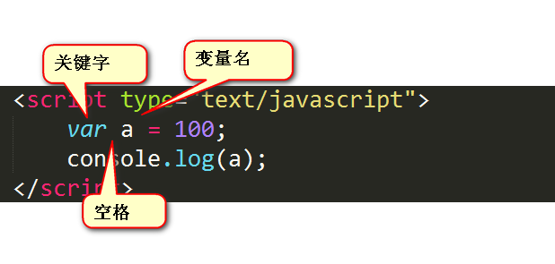

# 01-编程语言和JavaScript简介

### 计算机语言的分类

计算机语言的种类非常多，总的来说可以分成三大类：**机器语言、汇编语言和高级语言**。他们之间的转换过程如下：


计算机最终所执行的都是机器语言，它是由“0”和“1”组成的二进制数，二进制是计算机语言的基础。

**计算机语言**的范围比**编程语言**的范围更广，后者是前者的子集。比如：

- HTML 是**标记语言**，CSS 是**样式语言**，这两个是属于**计算机语言**；但不属于**编程语言**，因为它们编写出来的不是**程序**，只是简单的标记和样式。
- JavaScript 是属于**编程语言**，当然也属于**计算机语言**。

计算机语言的分类如下：


从机器语言到汇编语言，再到高级语言，这些语言的发展越来越高级，编写方式越来越接近人的思维。我们来具体看看这三种计算机语言的发展历史。

### 机器语言

计算机的存储单元只有0和1两种状态。

将数字0和1按照一定的规律组成的编码称为**机器码**，也称为**二进制编码**或者**机器指令**或者**计算机指令**。用这些机器指令所编写的程序称为**机器语言**。

机器语言的优点是可以直接被计算机识别、直接操作硬件、不需要经过编译解析、程序的执行效率很高；缺点是可读性差、可维护性差、出错概率高。

现如今，几乎没有人用这种方式编程。

### [#](https://web.qianguyihao.com/04-JavaScript基础/01-编程语言和JavaScript简介.html#汇编语言)汇编语言

对于人类来说，二进制程序是不可读的，根本看不出来机器干了什么。为了解决可读性和维护性的问题，就诞生了汇编语言。

**汇编语言**：是二进制指令的文本形式，与指令是一一对应的关系，比如，加法指令00000011写成汇编语言就是 ADD；汇编语言使用助记符（Mnemonics）来代替和表示特定低级机器语言的操作。

汇编语言经过**汇编器**，可翻译成机器语言，进而被 CPU 直接执行，所以汇编语言是最底层的低级语言。

不同的硬件系统有不同的汇编语言语法。换而言之，每一种特定的汇编语言和其特定的机器语言指令集是一一对应的。汇编语言的常见的应用场景有：**操作系统内核、驱动程序、单片机程序**等。

举例：用汇编语言写一个简单的加法程序“3+5=8”，加数和结果分别存在内存单元NUM1、NUM2、NUM3中。

[代码实现 (opens new window)](https://blog.csdn.net/qq_40871466/article/details/84720703)：

```text
data segment
  num1 db 3
  num2 db 5
  num3 db ?
data ends
code segment
assume cs:code,ds:data
 start:mov ax,data
    mov ds,ax
    mov al,num1
    add al,num2
    mov num3,al
    mov ax,4c00h
    int 21h
code ends
end start
```

### [#](https://web.qianguyihao.com/04-JavaScript基础/01-编程语言和JavaScript简介.html#高级语言)高级语言

高级语言更接近人的思维方式。

优点是可读性好、易于理解；上手门槛低，无需熟悉硬件知识即可进行编程入门的学习；很多高级语言可跨平台兼容，具备可移植性，在不同的机器上运行。

缺点是无法直接被计算机硬件识别，需要通过**编译器**翻译为机器语言后，才能在计算机上运行。

编译器的作用，就是将高级语言写好的程序，翻译成一条条机器指令。

## [#](https://web.qianguyihao.com/04-JavaScript基础/01-编程语言和JavaScript简介.html#编程语言)编程语言

### [#](https://web.qianguyihao.com/04-JavaScript基础/01-编程语言和JavaScript简介.html#概念-2)概念

**编程**：让计算机为解决特定的问题而使用某种程序设计语言编写程序代码，并最终得到结果的过程。

**编程语言**：是一种用于编写计算机**程序**的形式化语言。它定义了一套语法和规则，用来描述计算机程序的结构和逻辑，并精确定义了在不同情况下需要执行的行为。编程语言通过编写程序代码，将人类的思想和需求转化为计算机可以理解和执行的指令。不同的编程语言有不同的特点和用途，这些特点至少有：

- 数据结构和算法、数据处理
- 流程控制（if语句、循环语句等）
- 引用机制和重用机制
- 设计思想

不同的编程语言有不同的语法，需要遵守。常见的编程语言有 C 语言、C++、Java、JavaScript、Python 等。

如今通用的编程语言大致可以分成两类：**高级语言和汇编语言**。

- **高级语言**：主要是相对于低级语言而言，它并不是特指某一种具体的语言，而是包括了很多编程语言，比如：C 语言、C++、Java、C#、PHP、JavaScript、Python、Objective-C、Swift、Go 语言等。
- **汇编语言**：与机器语言实质是相同的，都是直接对硬件操作，只不过指令采用了英文缩写的标识符，容易识别和记忆。

### 1、编译型语言

- 定义：需要事先通过编译器**把所有的代码一次性翻译（编译/转换）好**，然后整体执行。比如 exe 文件。
- 优点：执行效率高，运行更快。
- 不足：移植性不好，不跨平台；编译之后如果需要修改就需要整个模块重新编译。
- 编译型语言举例：C、C++

比如，C 语言的代码文件是`.c`后缀，翻译之后文件是`.obj`后缀，系统执行的是 obj 文件；再比如， java 语言的代码文件是`.java`后缀，翻译之后的文件是`.class`后缀。（但是，Java 语言不是严格的 编译型语言，这个稍后讲）

以 C 语言的`hello.c`来举例：

```c
#include <stdio.h>
int main(int argc, char const *argv[])
{
  printf("Hello world!");
  return 0;
}
```

对于以上 C 语言代码，main 是程序入口，实现的功能是打印字符串`hello world`到屏幕上，编译和执行过程如下：

1. C 语言代码经过预处理（比如依赖处理、宏替换）。以上方代码示例，`#include<stdio.h>`会在预处理阶段被替换。
2. 编译：编译器会把 C 语言翻译成汇编程序。一条 C 语言通常被编译为多条汇编代码，同时编译器会对程序进行优化，生成目标汇编程序。旁征博
3. 汇编语言通过汇编器再汇编成目标程序`hello.o`。
4. 链接：程序中往往包含一些共享目标文件，如示例代码中的`printf()`函数位于静态库，需要经过链接器进行链接。


（上方图片来源：[JavaScript 基础-基本概念 (opens new window)](https://www.jianshu.com/p/230093183f47)）


（上方图片来源：[编译型语言 (opens new window)](https://p.0x06.cn/zh/program/)）

### [#](https://web.qianguyihao.com/04-JavaScript基础/01-编程语言和JavaScript简介.html#_2、解释型语言)2、解释型语言

- 定义：在运行过程中（runtime）通过解释器**边翻译边执行**，也就是逐行翻译。不需要事先一次性翻译，而是在运行时，边翻译变执行（翻译一行，执行一行）。
- 优点：移植性好，跨平台。
- 缺点：运行速度不如编译型语言。
- 解释型语言举例：JavaScript、PHP、Python。

为什么 JS 是解释型语言呢？这和浏览器的工作原理有关。浏览器中有一个专门的“JS 解析器”可以让 JS 边解析边执行。

由于少了事先编译这一步骤，所以解释型语言开发起来尤为方便，但是解释型语言运行较慢也是它的劣势。不过解释型语言中使用了 JIT 技术，使得运行速度得以改善。

### [#](https://web.qianguyihao.com/04-JavaScript基础/01-编程语言和JavaScript简介.html#java-语言)Java 语言

Java 语言是属于半编译半解释型语言。翻译过程：

（1）编译：`.java`代码文件先通过 javac 命令编译成`.class`文件。

（2）执行：`.class`文件再通过 jvm 虚拟机，解释执行。有了 jvm 的存在， java 就可以跨平台了。

### JavaScript 既是前端语言，又是后端语言

当 JavaScript 运行在用户的终端网页，而不是运行在服务器上的时候，我们称之为“**前端语言**”。前端语言是服务于页面的显示和交互，不能直接操作数据库。

**后端语言**是运行在服务器上的，比如 Java、C++、PHP 等等，这些语言都能够操作数据库（对数据库进行“增删改查”），并在后台执行各种任务。

另外，Node.js 是用 JavaScript 开发的，我们也可以用 Node.js 技术进行服务器端编程。

### JavaScript 的组成

JavaScript 基础分为三个部分：

- **ECMAScript**：JavaScript 的**语法标准**。包括变量、表达式、运算符、函数、if 语句、for 语句等。
- **DOM**：Document Object Model（文档对象模型），JS 操作**页面上的元素**（标签）的 API。比如让盒子移动、变色、改变大小、轮播图等等。
- **BOM**：Browser Object Model（浏览器对象模型），JS 操作**浏览器部分功能**的 API。通过 BOM 可以操作浏览器窗口，比如弹框、控制浏览器跳转、获取浏览器分辨率等等。

通俗理解就是：ECMAScript 是 JS 的语法；DOM 和 BOM 是浏览器运行环境为 JS 提供的 API。

### JavaScript 的特点

1、解释型语言。 2、遵守ECMAScript 标准。 3、单线程。

# 02-开始写JavaScript：hello world

## 开始写第一行 JavaScript：hello world

JS 代码的书写位置在哪里呢？这个问题，也可以理解成：引入 JS 代码，有哪几种方式？有三种方式：（和 CSS 的引入方式类似）

1. **行内式**：写在HTML标签内部。
2. **内嵌式**（内联式）：写在 script 标签中。
3. **外链式**：引入外部 JS 文件。

### 方式 1：行内式

代码举例：

```javascript
<input type="button" value="点我点我" onclick="alert('千古壹号 Hello 方式1')" />
```


完整的可执行代码如下：

```html
<!DOCTYPE html>
<html lang="en">
  <head>
    <meta charset="UTF-8" />
    <meta name="viewport" content="width=device-width, initial-scale=1.0" />
    <title>Document</title>
  </head>
  <body>
    <input type="button" value="点我点我" onclick="alert('千古壹号 Hello 方式1')" />
  </body>
</html>
```

解释：

- 可以将单行或少量 JS 代码写在 HTML 标签的事件属性中（以 on 开头的属性），比如放在上面的 `onclick`点击事件中。
- 这种书写方式，不推荐使用，原因是：可读性差，尤其是需要编写大量 JS 代码时，很难维护；引号多层嵌套时，也容易出错。
- 关于代码中的「引号」，在 HTML 标签中，我们推荐使用双引号，JS 中推荐使用单引号。

### 方式 2、内嵌式（内联式）

我们可以在 HTML 页面的 `<body>` 标签里放入`<script></script>`标签对，并在`<script>`里书写 JavaScript 代码：

```html
<!DOCTYPE html>
<html lang="en">
  <head>
    <meta charset="UTF-8" />
    <meta name="viewport" content="width=device-width, initial-scale=1.0" />
    <title>Document</title>
  </head>
  <body>
    <script type="text/javascript">
      // 在这里写 js 代码
      alert('千古壹号 hello 方式2');
      console.log('qianguyihao hello 方式2');
    </script>
  </body>
</html>
```

解释：

- tyue属性中的text 表示纯文本，因为 JavaScript 代码本身就是纯文本。当然，type属性可以省略，因为 JavaScript 是所有现代浏览器以及 HTML5 中的默认脚本语言。
- 可以将多行 JS 代码写到 `<script>` 标签中。
- 内嵌式 JS 是学习时常用的书写方式。

### 方式 3、外链式（引入独立的JS文件）

```html
<!DOCTYPE html>
<html lang="en">
  <head>
    <meta charset="UTF-8" />
    <meta name="viewport" content="width=device-width, initial-scale=1.0" />
    <title>Document</title>
  </head>
  <body>
    <!-- 外链式：引入外部的 js 文件：这个 utils.js 文件与当前的 html 文件，处于同一级目录 -->
    <script src="utils.js"></script>
  </body>
</html>
```

解释：

- 上面这段代码，依然是放到 body 标签里，可以和内嵌的 JS 代码并列。
- 上方代码的 script 标签已经引入了外部 JS 文件，所以这个标签里面，不可以再写 JS 代码。
- 方式2和方式3不能混用

## 拓展知识

### [#](https://web.qianguyihao.com/04-JavaScript基础/02-开始写JavaScript：hello world.html#window-onload-先加载-最后执行)window.onload：先加载，最后执行

上面的三种方式，有个共同的地方是：JS 代码都是写在 body 标签中的，准确来说，是在页面标签元素（比如 `title` 标签）的后面，在 `</body>`结束标签的前面。

为什么一般是按这样的顺序来写呢？这是因为：浏览器默认遵循**HTML文档**的加载顺序，即按照**从上至下**的加载顺序解析网页（这句话很重要）。所以，通常情况下，我们会把JS代码写在 body 内部的末尾。

然而，当你需要通过 JS 来操作界面上的标签元素时，假如将 JS 代码或者`<script>`标签写到`<head>`标签中，或者写在HTML标签元素的前面，那么这样的 JS 是无效的，因为标签元素在此时都还没来得及加载，自然无法操作这个元素。

**重点来了：当你需要通过 JS 来操作界面上的标签元素**时，如果实在想把 JS 写到`<head>`标签中，那么就必须用 window.onload 将 JS 代码进行包裹。代码格式如下：

```html
<head>
  window.onload = function(){
    // 这里可以写操作界面元素的JS代码，等页面加载完毕后再执行。这里面的JS代码，会延迟执行。
    ...
  }
</head>
```

**window.onload** 的含义是：等界面上所有内容都加载完毕后（不仅要等文本加载完毕，而且要等图片也要加载完毕），再执行window.onload 内部的代码。做到了**先加载，最后执行**，也就是：**延迟执行**，等页面加载完毕后再执行。

我们可以根据具体需要来决定，将 window.onload 写在 `<head>`标签中，或者写在`<script>`标签中。

### `<noscript>` 标签：浏览器不支持JS脚本时的降级方案

`<noscript>` 标签是一种HTML标签，用于提供在浏览器禁用JavaScript或无法执行JavaScript脚本时的替代内容。它允开发者在需要时向用户显示备用内容。这有助于提高网站的可访问性和用户体验。

如果有些浏览器不支持 JS 脚本，或者用户禁用了浏览器的JS脚本（如下图），那么，该如何给用户提供一个友好的提示呢？我们可以通过 `<noscript>` 标签作为**降级**的处理方案。


`<noscript>` 标签的基础语法：

```html
<noscript>
  <!-- 降级方案：这里放置备用内容，当浏览器禁用 JS 或者浏览器不支持 JS 时将显示 -->
  <p>请启用JavaScript以获得最佳网站体验。</p>
</noscript>
```

说明：

- `<noscript>` 标签内部可以包含任何HTML内容，通常包括用于向用户传达信息或提供备用功能的文本、图像、链接等。
- `<noscript>` 标签的内容仅在浏览器不支持或禁用 JS 的情况下才会显示。换而言之，如果用户的浏览器支持JS脚本，则`<noscript>` 标签里的内容将无法显示，会被忽略；如果用户的浏览器不支持JS脚本（或者关闭了JS脚本），则会显示`<noscript>` 标签的内容。

## JavaScript 一些简单的语法规则

学习编程语言，是有规律可循的，程序会有相同的部分，这些部分就是一种规定，不能更改，我们称之为：语法。我们先来了解一个简单的语法规则。

1、JS 对换行、缩进、空格不敏感。每一条语句以分号结尾。

也就是说：

代码一：

```html
<script type="text/javascript">
    alert('今天蓝天白云');
    alert('我很高兴');
</script>
```

等价于代码二：

```html
<script type="text/javascript">
    alert('今天蓝天白云');alert('我很高兴');
</script>
```

2、每一条语句末尾建议加上**分号**。

当存在换行符（line break）时，大多数情况下可以省略分号，JavaScript 会将换行符理解成“隐式”的分号，进而自动添加分号。

也就是说，分号不是必须加的，如果不写分号，浏览器会在换行符的位置自动添加分号，但是会消耗一些系统资源和性能，甚至有可能**添加错误**，导致一些奇怪的bug。

3、所有的符号都是英文的，比如括号、引号、分号。

如果你用的是搜狗拼音，**建议不要用 shift 切换中英文**（可以在搜狗软件里进行设置），不然很容易输入中文的分号；建议用 ctrl+space 切换中英文输入法。

4、JS 严格区分大小写。HTML和CSS不区分大小写，但是 JS 严格区分大小写。

## 前端代码的注释

注释：即解释、注解。注释有利于提高代码的可读性，且有利于程序员之间的沟通和工作交接。

注释可以用来解释某一段代码的功能和作用；通过注释，还可以补充代码中未体现出来的部分。代码只是开发工作的结果，注释可以阐述开发工作的过程、思路、注意事项，以及踩过的坑。

注释可以是任何文字，可以写中文。

**我们不要把 HTML、CSS、JavaScript 三者的注释格式搞混淆了**。

### [#](https://web.qianguyihao.com/04-JavaScript基础/02-开始写JavaScript：hello world.html#html-的注释)HTML 的注释

格式：

```html
<!-- 我是 HTML 注释  -->
```

举例：

```html
<!--头部开始-->
<div class="header"></div>
<!--头部结束-->

<!--内容开始-->
<div class="main"></div>
<!--内容结束-->

<!--底部开始-->
<div class="footer"></div>
<!--底部结束-->
```

### [#](https://web.qianguyihao.com/04-JavaScript基础/02-开始写JavaScript：hello world.html#css-的注释)CSS 的注释

举例：

```html
<style type="text/css">
  /* 我是 CSS 注释 */
  p {
    font-weight: bold;
    font-style: italic;
    color: red;
  }
</style>
```

注意：CSS 只有`/* */`这种注释，没有`//`这种注释。而且注释要写在`<style>`标签里面才算生效。

### [#](https://web.qianguyihao.com/04-JavaScript基础/02-开始写JavaScript：hello world.html#javascript-的注释)JavaScript 的注释

单行注释：

```js
// 我是注释
```

1

多行注释：（写法1）

```js
/*
 多行注释1
 多行注释2
*/
```

多行注释：（写法2）

```js
/**
 * 多行注释1
 * 多行注释2
 */
```

补充：VS Code 中，单行注释的快捷键是「Ctrl + /」，多行注释的默认快捷键是「Alt + Shift + A」。

当然，如果你觉得多行注释的默认快捷键不方便，我们还可以修改默认快捷键。操作如下：

VS Code --> 首选项 --> 键盘快捷方式 --> 查找“注释”这两个字 --> 将原来的快捷键修改为其他的快捷键，比如「Ctrl + Shift + /」。

### [#](https://web.qianguyihao.com/04-JavaScript基础/02-开始写JavaScript：hello world.html#注释的高级用法-文档注释-jsdoc)注释的高级用法：文档注释（JSDoc）

**JSDoc** 是 JavaScript 中用于**文档注释**的一种标准化格式。写完 JSDoc 的注释之后，再通过相关工具，开发者便可以为函数、方法、类和变量等添加注释，以便**生成可读性强的API文档**。

以下是一个基本的 JSDoc 注释示例：

```js
/**
 * 这是一个示例函数，用于求两个数字的和。
 * @param {number} num1 - 第一个数字
 * @param {number} num2 - 第二个数字
 * @returns {number} - 两个数字的和
 */
function sum(num1, num2) {
  return num1 + num2;
}
```


如上图所示，鼠标悬停在函数调用的地方就能看到关于这个函数的文档说明，而不需要定位函数的源码处，很神奇吧？

JSDoc经常应用于工具函数，我们甚至可以借助 JSDoc的相关工具，生成函数的一系列的API文档，部署到到网站上，方便其他开发者查阅，非常方便。这种协作方式在日常开发中极为常见。具体如何实战，各位读者可自行查阅 JSDoc 这个关键词。

另外需要说明的是，VS Code默认集成了文档注释的显示功能，可以在**单独的 JS 文件**中显示文档注释的效果，但是无法在 HTML 文件中显示效果：

### 对注释的认知

很多人认为：代码注释是多余的。他们的理由是：如果注释太多，说明代码写得不清晰；而且，代码更新的同时，如果注释没更新，那段注释就成了磁盘上的垃圾，误导他人。

还有人认为：注释应该尽可能详细，就像写小作文一样。

上面这样的理由，都不具有说服力。我告诉你为什么要写注释：

1. 注释有利于提高代码的可读性，且有利于程序员之间的沟通和工作交接。
2. 所有注释都是必要的吗？当然不是。注释不应该用来解释某些代码正在做什么。如果代码无法清楚到去解释自己时，那么代码需要变得更简单。有一些例外，比如正则表达式和复杂算法通常会从解释他们正在做什么事情的注释中获益很多。
3. 注释用于解释为什么某些代码存在时很有用。大多数注释都是针对代码本身无法包含的信息，例如决策背后的推理、业务流程、业务逻辑、注意事项、踩坑经验总结、参考链接。
4. 注释的本质是文档，需要持续更新维护，新陈代谢。文档也会过期，但不能因噎废食。即便文档过期，至少它记载了曾经的开发记录。

## JavaScript 输出语句

在下面的这几个输出语句中， 按照使用频率来排序的话，console.log()用得最多，其次是 alert()语句；其他语句用得较少，了解即可。

### [#](https://web.qianguyihao.com/04-JavaScript基础/02-开始写JavaScript：hello world.html#弹窗-alert-语句)弹窗：alert()语句

我们要学习的第一个语句，就是 alert 语句。

代码举例如下：

```html
<!DOCTYPE html>
<html lang="en">
  <head>
    <meta charset="UTF-8" />
    <meta name="viewport" content="width=device-width, initial-scale=1.0" />
    <title>Document</title>
  </head>
  <body>
    <script>
      alert('千古壹号');
    </script>
  </body>
</html>
```

上面的代码中，如果写了两个 alert()语句，则网页的效果是：弹出第一个警告框，点击确定后，继续弹出第二个警告框。

补充：该方法只能传入一个参数。

### 控制台输出：console.log() 打印日志

`console.log()`用于在浏览器的控制台中输出信息，里面可以传入一个或多个参数，常用于代码调试和测试。console 表示“控制台”，log 表示“输出”。括号里可以写字符串、数字、变量、表达式等。

语法格式：

```js
console.log('传入一个参数：' +arg1);
// 传入多个参数时，可以用逗号隔开
console.log('传入多个参数：', arg2, arg3);
```

控制台是程序员调试程序的地方。我们可以使用 console 语句打印日志，在控制台的 console 面板查看打印的内容，测试程序是否运行正常。

在 Chrome 浏览器中，按 F12 即可打开控制台，选择「console」栏，即可看到打印的内容。


console 语句可以设置不同的打印等级：

```js
console.log('千古壹号1'); // 普通打印
console.warn('千古壹号2'); // 警告打印
console.error('千古壹号3'); // 错误打印
```

效果如下：


上图中，不同的打印等级，区别不大，只是颜色背景上的区别，方便肉眼区分、过滤信息。

**总结**：alert() 主要用来显示消息给用户，console.log() 用来给程序员做调试用。

### 弹窗：confirm()语句（含确认/取消）

代码举例如下：

```text
var result = confirm('你听说过千古壹号吗？');
console.log(result);
```

代码运行后，页面上会显示一个弹窗。弹窗上有“确认”和“取消”两个按钮，点击“确定”返回 `true`，点击“取消”返回 `false`。

### 弹出输入框：prompt()语句

`prompt()`就是专门弹出能够让用户输入内容的对话框。用得少，测试的时候偶尔会用。

JS 代码如下：

```javascript
var a = prompt('请随便输入点什么东西吧');
console.log(a);
```

上方代码中，用户输入的内容，将被传递到变量 a 里面，并在控制台打印出来。

**alert()和 prompt()的区别：**

- alert() 语句中可以输出数字和字符串，如果要输出字符串，则必须用引号括起来；prompt()语句中，用户不管输入什么内容，都是字符串。
- prompt() 会返回用户输入的内容。我们可以用一个变量，来接收用户输入的内容。

### 网页内容区域输出：document.write()语句

该方法的作用是向网页中写入文本内容，可以是 HTML 代码。传入的参数可以是一个或者多个字符串。

代码举例：

```text
document.write('千古前端图文教程');
```

页面效果：


# 03-常量和变量

## 常量（字面量）：数字和字符串

**常量**也称之为“字面量”，是固定值，不可改变。看见什么，它就是什么。

常量有下面这几种：

- 数字常量（数值常量）
- 字符串常量
- 布尔常量
- 自定义常量

### 数字常量

数字常量非常简单，直接写数字就行，不需要任何其他的符号。既可以是整数，也可以是浮点数。

例如：

```javascript
// 不需要加引号
alert(996); // 996是整数
alert(3.14); // 3.14是浮点数（即带了小数）
```

### [#](https://web.qianguyihao.com/04-JavaScript基础/03-常量和变量.html#字符串常量)字符串常量

字符串常量就是用单引号或双引号括起来的内容。可以是单词、句子等，一定要加引号。在JS中，只要是单引号或双引号括起来的内容，都是字符串常量。

```javascript
console.log('996');

console.log("千古壹号，永不止步");
```


### 布尔常量

布尔常量就是表达**真**或者**假**，在JS中用 true 和 false 来表达。

布尔字面量举例：

```javascript
if (true) {
	console.log('如果为真，就走这里面的代码);
}
```

### 自定义常量：const

自定义常量是ES6中新增的语法。它的语法格式是这样的：

```js
const 常量名称 = 常量取值;
```

举例：

```js
const name = '千古壹号'; // 定义常量name，它的取值是 千古壹号

// name =  '许嵩'; // 既然 name 是常量，所以这一行是错误的写法，因为 name 无法被修改为其他的值

console.log(name); // 打印结果：千古壹号
```

后续我们讲ES6语法的时候，会深入学习 const 用法。

## 变量的概念

**变量**表示可以改变的数据，一个变量，就是一个用于存放这个数据的容器。我们通过「变量名」获取数据，甚至修改数据。

变量还可以用来保存常量。

**本质**：变量是程序在内存中申请的一块用来存放数据的空间。比如，超市货架的储物格就是变量, 在不同的时间段里，储物格中存储的数据可以不一样。

实际开发中，变量使用得非常频繁，因为这些数据并非固定不变。比如，以下使用场景中的信息都可以用变量存储：

- 商品信息：价格、库存数量、购买的客单价
- 歌曲信息：时长、播放进度、歌词内容
- 用户信息：用户名、年龄、性别、地址
- 时间和日期
- App系统设置的配置参数；用户的偏好设置，比如主题、语言等。
- 微博：用户关注的人、粉丝数量；发布的帖子数量、点赞数。

## 变量的定义和赋值

定义变量是在告诉浏览器，我们需要一块内存空间，相当于生成超市里的储物格。

给变量赋值就是往相当于往储物格里塞东西，可能今天上午塞的是面包🍞，下午就换成了蛋糕🍰。

### [#](https://web.qianguyihao.com/04-JavaScript基础/03-常量和变量.html#变量的定义-声明-es5)变量的定义/声明（ES5）

在 ES6 语法之前，统一使用`var`关键字来声明一个变量。比如：

```javascript
var name; // 定义一个名为 name 的变量。name是变量名。
```

var 是英语“variable”变量的缩写。var的后面要加一个空格，空格后面的紧跟的就是“变量名”。

PS：**在 JavaScript 中，永远都是用 var 来定义变量**（在 ES6 之前），这和 C、Java 等语言不同。

### [#](https://web.qianguyihao.com/04-JavaScript基础/03-常量和变量.html#变量的定义-声明-es6)变量的定义/声明（ES6）

在 ES6 语法及之后的版本里，可以使用 `const`、`let`关键字来定义一个变量。比如：

```js
const name; // 定义一个常量

let age; // 定义一个变量
```

如果你想定义一个常量，就用 const；如果你想定义一个变量，就用 let。

###  变量的赋值

使用 `=` 这个符号即可给变量赋值。举例：

```javascript
name = '千古壹号';
```

综合起来，变量的定义、赋值、取值，举例如下：

```js
// 定义：声明一个变量
var num;
// 赋值：往变量中存储数据
num = 996;
// 取值：从变量中获取存储的数据
console.log(num);
```

### 定义+赋值的合并写法

变量的定义和赋值，还可以合并写在一起，是实战中常用的写法。举例如下：

```javascript
var a = 100; // ES5语法
console.log(a);

const b = 'hello'; // ES6 语法

let c = 'world'; // ES6 语法
c = 'qianguyihao'; // 修改 变量 C 的值
```

定义一个变量并赋值， 我们称之为**变量的初始化**。如下图所示：



### 变量的初始化【重要】

第一次给变量赋值，称之为“**变量的初始化**”，这个概念非常重要。第二次给这个变量赋值（也就是修改这个变量的值）就不叫初始化了。

一个变量如果没有进行初始化（只声明，不赋值），那么这个变量中存储的值是`undefined`，这个知识点必须知道。

变量的初始化，可以有两种形式，如下。

形式1：先定义，在赋值。举例：

```js
var name;
name = 'qianguyhihao';
```

形式2：在定义的同时进行初始化。也就是上一小段讲的“合并写法”。举例：

```js
var name = 'qianguyihao';
```

## 变量定义和赋值的补充

### [#](https://web.qianguyihao.com/04-JavaScript基础/03-常量和变量.html#修改变量的值)修改变量的值

一个变量被重新复赋值后，它原有的值就会被覆盖，变量值将以最后一次赋的值为准。

举例：

```javascript
var a = 100;
a = 110;

console.log(a); // 打印结果：110。因为 110 覆盖了 100
```

### 同时定义多个变量

1、同时定义多个变量时，只需要写一个 var， 多个变量名之间用英文逗号隔开。举例：

```javascript
// 同时定义多个变量
var num1, num2;
```

2、定义多个变量的同时，分别进行初始化。举例：

```js
// 定义多个变量的同时，进行初始化
var num1 = 10, num2 = 20;
```

如果多个变量的初始化值都是一样的，则可以这样简写：

```js
var num1, num2;
num1 = num2 = 10; // 重点在这一行

console.log(num1); // 10
console.log(num2); // 10
```

上面的写法和下面的写法是有区别的：（注意看打印结果）

```js
var num1, num2 = 10;

console.log(num1); // undefined
console.log(num2); // 10
```

### 变量声明和赋值的几种情况

变量建议先声明，再使用；否则可能会产生意想不到的结果。具体如下。

**写法 1**、先声明，再赋值：（正常）

```javascript
var a;
a = 100;
console.log(a); // 打印结果：100
```

写法 2**、只声明，不赋值：（默认值为 undefined）

```javascript
var a;
console.log(a); // 打印结果：undefined
```

**写法 3**、不声明，直接赋值：（正常）

```javascript
a = 100;
console.log(a); // 打印结果：100
```

写法3虽然不报错，但并不推荐这么写。变量 a 会被添加到 windows 对象上。它跟写法1是有区别的，等以后学习了「变量提升」的概念就明白了。相比之下，我们更推荐用写法 1。

**写法 4**、不声明，不赋值，直接使用：（会报错）

```javascript
console.log(a); // 会报错
```

# 04-标识符、关键字、保留字

## 变量的命名规则（重要）

JS是大小敏感的语言。也就是说 A 和 a 是两个变量，并非同一个变量，比如：

```javascript
var A = 250; //变量1
var a = 888; //变量2
```

我们来整理一下**变量的命名规则**，非常重要。

必须遵守：

- 只能由字母(A-Z、a-z)、数字(0-9)、下划线(_)、美元符( $ )组成。
- **不能以数字开头**。必须以字母(A-Z、a-z)、下划线(_)或者美元符( $ )开头。变量名中不允许出现空格。尤其注意，变量名中不能出现**中划线**`-`，很多人写了多年代码都不知道这一点，让人大跌眼镜。
- 严格区分大小写（JS 是区分大小写的语言）。
- 不能使用 JS 语言中保留的「关键字」和「保留字」作为变量名。下一段会讲。
- 变量名长度不能超过 255 个字符。
- 汉语可以作为变量名。但是不建议使用，因为 low。

## 标识符

**标识符**：在 JS 中所有的可以由我们**自主命名**的都可以称之为标识符。包括：**变量名、函数名、属性名、参数名**都是属于标识符。

通俗来讲，标识符就是我们写代码时为某些东西起的名字。类似于人出生的时候，起个人名。

**标识符的命名规则**和变量的命令规则是一样的。关于变量的命名规则，详见上一段。

标识符不能使用语言中保留的**关键字**及**保留字**。

## 关键字

**关键字**：被JS赋予了特殊含义的单词。也就是说，关键字是 JS 本身已经使用了的单词，我们不能再用它们充当变量名、函数名等标识符。关键字在开发工具中会显示特殊的高亮颜色。

JS 中的关键字如下：

```bash
if、else、switch、break、case、default、for、in、do、while、

var、let、const、void、function、continue、return、

try、catch、finally、throw、debugger、

this、typeof、instanceof、delete、with、

export、new、class、extends、super、with、yield、import、static、

true、false、null、undefined、NaN
```

## [#](https://web.qianguyihao.com/04-JavaScript基础/04-标识符、关键字、保留字.html#保留字)保留字

**保留字**：实际上就是预留的“关键字”。它们虽然现在还不是关键字，但是未来可能会成为关键字。同样不能用它们当充当变量名、函数名等标识符。

JS 中的保留字如下：

```bash
enum、await

abstract、boolean、byte、char、double、final、float、goto、int、long、native、short、synchronized、transient、volatile、

arguments eval Infinity

# 以下关键字只在严格模式中被当成保留字，在ES6中是属于关键字
implements、interface、package、private、protected、public
```