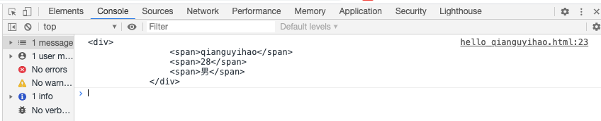
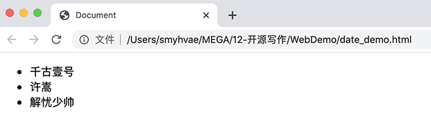

# 05-变量的数据类型：基本数据类型和引用数据类型

## 数据分类

数据分为：静态数据、动态数据。

### 静态数据

静态数据是指一些永久性的数据。一般是以文件的形式存储在硬盘上，比如文档、照片、视频等文件。

电脑关闭后，静态数据仍然还在。只要不主动删掉数据或者硬盘没损坏，这些数据就一直都在。

### [#](https://web.qianguyihao.com/04-JavaScript基础/05-变量的数据类型：基本数据类型和引用数据类型.html#动态数据)动态数据

动态数据是在程序运行过程中，动态产生的临时数据，这些数据可能随时发生变化。一般存储在内存中。

电脑关闭后，这些数据会被清除。

为何不把应用程序的动态数据加载到硬盘中执行呢？这主要是因为，内存的访问速度比硬盘快无数倍。

## 变量的数据类型

### [#](https://web.qianguyihao.com/04-JavaScript基础/05-变量的数据类型：基本数据类型和引用数据类型.html#为什么需要数据类型)为什么需要数据类型

在计算机中，不同的数据所需占用的存储空间不同，为了充分利用存储空间，于是定义了不同的数据类型。而且，不同的数据类型，寓意也不同。

我们都知道，无论这个变量是字符串类型，还是数字类型，我们都可以直接用 `var` 去定义它。比如：

```javascript
var a = 'hello word';

var b = 123;
```

为什么可以这样做呢？这是因为：JavaScript 是一种「弱类型语言」，或者说是一种「动态语言」，这意味着不需要事先声明变量的具体数据类型，在程序运行过程中，类型会自动被确定。

**JS 的变量数据类型，是在程序运行的过程中，根据等号右边的值来确定的**。而且，变量的数据类型是可以变化的。一个变量可以在上一秒是字符串类型，下一秒是数字类型。比如：

```javascript
var name = 'qianguyihao';

name = 123; // 强制将变量 name 修改为 数字类型
```

### JS 中一共有八种数据类型

- **基本数据类型（值类型）**：String 字符串、Boolean 布尔值、Number 数值、Undefined 未定义、Null 空对象、BigInt 大型数值、Symbol。

- **引用数据类型（引用类型）**：Object 对象。

注意：内置对象 Function、Array、Date、RegExp、Error 等都是属于 Object 类型。也就是说，除了那七种基本数据类型之外，其他的，都称之为 Object 类型。

**数据类型之间最大的区别**：

- 基本数据类型：参数赋值的时候，传数值。
- 引用数据类型：参数赋值的时候，传地址。

## 一个经典的例子

**基本数据类型举例**：

```javascript
var a = 23;
var b = a;

a++;

console.log(a); // 打印结果：24
console.log(b); // 打印结果：23
```

上面的代码中：a 和 b 都是基本数据类型，让 b 等于 a，然后**改变 a 的值之后，发现 b 的值并没有被改变**。

但是在引用数据类型中，就不同了，我们来看一看。

**引用数据类型举例**：

```javascript
var obj1 = new Object();
obj1.name = 'smyh';

// 让 obj2 等于 obj1
var obj2 = obj1;

// 修改 obj1 的 name 属性
obj1.name = 'vae';

console.log(obj1.name); // 打印结果：vae
console.log(obj2.name); // 打印结果：vae
```

上面的代码中：obj1 和 obj2 都是引用数据类型，让 obj2 等于 obj1，然后**修改 obj1.name 的值之后，发现 obj2.name 的值也发生了改变**。

从上面的例子中，可以反映出，基本数据类型和引用数据类型是有区别的。

那到底有什么区别呢？我们进一步往下看。

## 栈内存和堆内存

我们首先记住一句话：JS 中，所有的**变量**都是保存在**栈内存**中的。

然后来看看下面的区别。

**基本数据类型**：

基本数据类型的值，直接保存在栈内存中。值与值之间是独立存在，修改一个变量不会影响其他的变量。

**引用数据类型**：

对象是保存到**堆内存**中的。每创建一个新的对象，就会在堆内存中开辟出一个新的空间；而**变量保存了对象的内存地址**（对象的引用），保存在栈内存当中。如果两个变量保存了同一个对象的引用，当一个通过一个变量修改属性时，另一个也会受到影响。

**内存状态**：

- 栈：obj1 → [指向堆中某个地址]，obj2 → [指向堆中同一个地址]
- 堆：[某个地址] → { name: 'smyh' }

# 06-基本数据类型：String 和 Boolean

##  String 字符串

### [#](https://web.qianguyihao.com/04-JavaScript基础/06-基本数据类型：String 和 Boolean.html#语法)语法

如果在开发中需要使用文本，就可以用 String 字符串类来表示，比如姓名、商品简介等。

其语法为：双引号 `""` 或者单引号 `''`。引号中的内容都是文本。

来看个示例。下面的这些，都是字符串：

```javascript
var a = 'abcde';
var b = '千古壹号';
var c = '123123';
var d = '哈哈哈哈哈';
var e = ''; //空字符串

var f = haha; // 没使用引号，到这里会直接报错。因为会被认为是js代码，但是之前并没有定义 haha。

console.log(typeof a);
console.log(typeof b);
console.log(typeof c);
console.log(typeof d);
console.log(typeof e);
```

控制台输出如下：

```text
string
string
string
string
string
```

### 转义字符

假设现在有这样一个字符串——`千古'壹号"前端开发"`。

上面的字符串中，前端开发 这四个字是被双引号包围的， 千古 和 壹号 之间有一个单引号。难点就在于这个单引号。

如果你想在JS中定义上述字符串的话，直接在代码中这样写是不行的，会报错：

```js
var str = '千古'壹号"前端开发"'; // 会报错
```

那要怎么办呢？这个时候，转移字符就派上用场了。

在字符串中我们可以使用`\`作为转义字符。如果你想表示一些特殊符号，可以使用`\`进行转义。

- `\'` 表示 `'` 单引号
- `\"` 表示 `"` 双引号
- `\\` 表示`\`
- `\r` 表示回车
- `\n` 表示换行。n 的意思是 newline。
- `\t` 表示缩进。t 的意思是 tab，制表符。
- `\b` 表示空格。b 的意思是 blank。

举例：

```javascript
var str1 = '我说:"今天\t天气真不错！"';
var str2 = '\\\\\\';
var str3 = '千古\'壹号"前端开发"';

console.log(str1);
console.log(str2);
console.log(str3);
```

上方代码的打印结果：

```text
我说:"今天	天气真不错！"
\\\
千古'壹号"前端开发"	
```

### 获取字符串的长度

字符串是由若干个字符组成的，这些字符的数量就是字符串的长度。我们可以通过字符串的 `length` 属性可以获取整个字符串的长度。

代码举例：

```javascript
var str1 = '千古壹号';
var str2 = '千古壹号，永不止步！';

var str3 = 'qianguyihao';
var str4 = 'qianguyihao, keep moving!';

console.log(str1.length); // 4
console.log(str2.length); // 10
console.log(str3.length); // 11
console.log(str4.length); // 25
```

由此可见，字符串的 length 属性，在判断字符串的长度时，会认为：

- 一个中文算一个字符，一个英文算一个字符
- 一个标点符号（包括中文标点、英文标点）算一个字符
- 一个空格算一个字符

### [#](https://web.qianguyihao.com/04-JavaScript基础/06-基本数据类型：String 和 Boolean.html#字符串拼接)字符串拼接

多个字符串之间可以使用加号 `+` 进行拼接。

**拼接语法**：

```text
字符串 + 任意数据类型 = 拼接之后的新字符串;
```

**拼接规则**：拼接前，会把与字符串相加的这个数据类型转成字符串，然后再拼接成一个新的字符串。

**代码举例**：（字符串与六大数据类型相加）

```javascript
var str1 = '千古壹号' + '永不止步';
var str2 = '千古壹号' + 666;
var str3 = '千古壹号' + true;
var str4 = '千古壹号' + null;
var str5 = '千古壹号' + undefined;

var obj = { name: '千古壹号', age: 28 };
var str6 = '千古壹号' + obj;

console.log(str1);
console.log(str2);
console.log(str3);
console.log(str4);
console.log(str5);
console.log(str6);
```

打印结果：

```text
千古壹号永不止步

千古壹号666

千古壹号true

千古壹号null

千古壹号undefined

千古壹号[object Object]
```

## 字符串的不可变性

字符串里面的值不可被改变。虽然看上去可以改变内容，但其实是地址变了，内存中新开辟了一个内存空间。

代码举例：

```js
var str = 'hello';

str = 'qianguyihao';
```

比如上面的代码，当重新给变量 str 赋值时，常量`hello`不会被修改，依然保存在内存中；str 会改为指向`qianguyihao`。

## [#](https://web.qianguyihao.com/04-JavaScript基础/06-基本数据类型：String 和 Boolean.html#模板字符串-模板字面量)模板字符串（模板字面量）

以前，让字符串进行拼接的时候，是这样做的：（传统写法的字符串拼接）

```javascript
var name = 'smyhvae';
var age = '26';
console.log('name:' + name + ',age:' + age); //传统写法
```

这种写法，比较繁琐，而且容易出错。

现在，有了 ES6 语法，字符串拼接可以这样写：

```javascript
var name = 'qianguyihao';
var age = '26';

console.log('我是' + name + ',age:' + age); //传统写法
console.log(`我是${name},age:${age}`); //ES6 写法。注意语法格式
```

### 在模板字符串中插入表达式

以前，在字符串中插入表达式的写法必须是这样的：

```js
const a = 5;
const b = 10;
console.log('this is ' + (a + b) + ' and\nnot ' + (2 * a + b) + '.');
```

现在，通过模板字符串，我们可以使用一种更优雅的方式来表示：

```js
const a = 5;
const b = 10;

// 下面这行代码，故意做了换行。
console.log(`this is ${a + b} and
not ${2 * a + b}.`);
```

打印结果：

```bash
this is 15 and
not 20.
```

### 模板字符串中可以换行

因为模板字符串支持换行，所以可以让代码写得非常美观。

代码举例：

```js
const result = {
    name: 'qianguyihao',
    age: 28,
    sex: '男',
};

// 模板字符串支持换行
const html = `<div>
	<span>${result.name}</span>
	<span>${result.age}</span>
	<span>${result.sex}</span>
</div>`;

console.log(html); // 打印结果也会换行
```



### 模板字符串中可以调用函数

模板字符串中可以调用函数。字符串中调用函数的位置，将会显示函数执行后的返回值。

举例：

```js
function getName() {
    return 'qianguyihao';
}

console.log(`www.${getName()}.com`); // 打印结果：www.qianguyihao.com
```

### 模板字符串支持嵌套使用

```js
const nameList = ['千古壹号', '许嵩', '解忧少帅'];

function myTemplate() {
    // join('') 的意思是，把数组里的内容合并成一个字符串
    return `<ul>
	${nameList.map((item) => `<li>${item}</li>`).join('')}
	</ul>`;
}
document.body.innerHTML = myTemplate();
```



## 布尔值：Boolean

布尔型有两个值：true 和 false。主要用来做逻辑判断： true 表示真，false 表示假。布尔值直接使用就可以了，千万不要加引号。

布尔（英语：Boolean）是计算机科学中的逻辑数据类型，以发明布尔代数的英国数学家**乔治·布尔**为名。

代码举例：

```javascript
var a = true;
console.log(typeof a);
```

1控制台输出结果：

```text
boolean
```

# 07-基本数据类型：Number

## 数值型：Number

在 JS 中所有的数值都是 Number 类型，包括整数和浮点数（小数）。

```javascript
var a = 100; // 定义一个变量 a，并且赋值整数100
console.log(typeof a); // 输出变量 a 的类型

var b = 12.3; // 定义一个变量 b，并且赋值浮点数 12.3
console.log(typeof a);
```

上方代码的输出结果为：

```bash
number
number
```

再次补充：在 JS 中，只要是数，就是 Number 数值型的。无论整浮、浮点数（即小数）、无论大小、无论正负，都是 Number 类型的。包括接下来要讲的Infinity、-Infinity、NaN 等特殊数值也是 Number 类型的。

### 数值范围

ECMAScript 并不能表示世界上所有的数值。

- 最大正数值：`Number.MAX_VALUE`，这个值为： 1.7976931348623157e+308
- 最小正数值：`Number.MIN_VALUE`，这个值为： 5e-324 ，或者 2的负1074 次方。它是能够在浮点精度范围内表示的最小正数（**不是最小负数**）。小于这个数的正数会被转成0。

如果使用 Number 表示的变量超过了最大值，则会返回 Infinity。

- `Infinity`：无穷大（正无穷）。比如 1/0 的值就是无穷大。
- `-Infinity`：无穷小（负无穷）

注意：`typeof Infinity`的返回结果是 number。

### NaN

**NaN**：是一个特殊的数字，表示 Not a Number，非数值。在进行数值运算时，如果得不到正常结果，就会返回 NaN。

比如：

```javascript
console.log('abc' / 18); //结果是NaN

console.log('abc' * 'abcd'); //按理说，字符串相乘是没有结果的，但如果你非要让JS去算，它就一定会给你一个结果，结果是NaN。
```

注意事项：

1. `typeof NaN`的返回结果是 number。
2. **Undefined 和任何数值计算的结果为 NaN。NaN 与任何值都不相等，包括 NaN 本身。**
3. 关于 isNaN() 函数，可以看后续要将的内容——数据类型转换。

### 连字符和加号的区别

键盘上的`+`可能是连字符，也可能是数字的加号。如下：

```js
console.log("我" + "爱" + "你");	// 连字符，把三个独立的汉字，连接在一起了
console.log("我+爱+你");			// 原样输出
console.log(1+2+3);				// 输出6
```

输出：

```text
我爱你
我+爱+你
6
```

**总结**：如果加号两边**都是** Number 类型，此时是数字相加。否则，就是连字符（用来连接字符串）。

举例 1：

```javascript
var a = '1';
var b = 2;
console.log(a + b);
```

控制台输出：

```text
12
```

举例 2：

```text
var a = 1;
var b = 2;
console.log("a" + b);	//"a"就不是变量了！所以就是"a"+2 输出a2
```

控制台输出：

```text
a2
```

于是我们明白了，在变量中加入字符串进行拼接，可以被同化为字符串。【重要】

### 隐式转换

我们知道，`"2"+1`得到的结果其实是字符串，但是`"2"-1`得到的结果却是数值 1，这是因为计算机自动帮我们进行了“**隐式转换**”。

也就是说，`-`、`*`、`/`、`%`这几个符号会自动进行隐式转换。例如：

```javascript
var a = '4' + 3 - 6;
console.log(a);
```

输出结果：

```javascript
37;
```

虽然程序可以对`-`、`*`、`/`、`%``这几个符号自动进行“隐式转换”；但作为程序员，我们最好自己完成转换，方便程序的可读性。

关于隐式转换的详细知识，可以看后续的内容——和数据类型转换。

## 浮点数的运算

### [#](https://web.qianguyihao.com/04-JavaScript基础/07-基本数据类型：Number.html#运算精度问题)运算精度问题

在 JS 中，整数的运算**基本**可以保证精确；但是**小数的运算，可能会得到一个不精确的结果**。所以，千万不要使用 JS 进行对精确度要求比较高的运算。

如下：

```javascript
var a = 0.1 + 0.2;
console.log(a); //打印结果十分意外：0.30000000000000004
```

上方代码中，打印结果并不是 0.3，而是 0.30000000000000004。

这是因为，计算机在做运算时，所有的运算都要转换成二进制去计算。然而，有些数字转换成二进制之后，无法精确表示。比如说，0.1 和 0.2 转换成二进制之后，是无穷的，因此存在浮点数的计算不精确的问题。

### 处理数学运算的精度问题

如果只是一些简单的精度问题，可以使用 `toFix()` 方法进行小数的截取。备注：关于 `toFixed()`方法， 详见《JavaScript 基础/内置对象：Number 和 Math》。

在实战开发中，关于浮点数计算的精度问题，往往比较复杂。市面上有很多针对数学运算的开源库，比如[decimal.js (opens new window)](https://github.com/MikeMcl/decimal.js/)、 [Math.js (opens new window)](https://github.com/josdejong/mathjs)。这些开源库都比较成熟，我们可以直接拿来用。

- Math.js：属于很全面的运算库，文件很大，压缩后的文件就有 500kb。如果你的项目涉及到大型的复杂运算，可以使用 Math.js。
- decimal.js：属于轻量的运算库，压缩后的文件只有 32kb。大多数项目的数学运算，使用 decimal.js 足够了。

在使用这几个开源库时，既可以用 cdn 的方式引入，也可以用 npm 包的方式引入。

比如说，通过 cdn 的方式引入 decimal.js 时，可以这样用：

```html
<!DOCTYPE html>
<html lang="en">
  <head>
    <meta charset="UTF-8" />
    <meta name="viewport" content="width=device-width, initial-scale=1.0" />
    <title>Document</title>
  </head>
  <body>
    <script src="https://cdn.bootcdn.net/ajax/libs/decimal.js/10.2.0/decimal.min.js"></script>
    <script>
      console.log('加法：');
      var a = 0.1;
      var b = 0.2;
      console.log(a + b);
      console.log(new Decimal(a).add(new Decimal(b)).toNumber());

      console.log('减法：');
      var a = 1.0;
      var b = 0.7;
      console.log(a - b);
      console.log(new Decimal(a).sub(new Decimal(b)).toNumber());

      console.log('乘法：');
      var a = 1.01;
      var b = 1.003;
      console.log(a * b);
      console.log(new Decimal(a).mul(new Decimal(b)).toNumber());

      console.log('除法：');
      var a = 0.029;
      var b = 10;
      console.log(a / b);
      console.log(new Decimal(a).div(new Decimal(b)).toNumber());
    </script>
  </body>
</html>
```

```text
加法：
0.30000000000000004
0.3

减法：
0.30000000000000004
0.3

乘法：
1.0130299999999999
1.01303

除法：
0.0029000000000000002
0.0029
```

## 变量值的传递（赋值）

语句：

```text
a = b;
```

把 b 的值赋给 a，b 不变。

将等号右边的值，赋给左边的变量；等号右边的变量，值不变。

# 08-基本数据类型：Null 和 Undefined

## Undefined：未定义类型

Undefined 类型的值只有一个，就是 undefind。比如 `var a = undefined`。

使用 typeof 检查一个 undefined 值时，会返回 undefined。

undefined 的出现有以下几种情况。

### case1：变量已声明，未赋值（未初始化）

一个变量如果只**声明**了，但没有**赋值**，此时它的值就是 `undefined`。举例：

```js
var name;
console.log(name); // 打印结果：undefined
console.log(typeof name); // 打印结果：undefined
```

下面这两行代码是等价的：

```js
// 写法1
var name;
// 写法2。这种写法冗余了，不推荐。
var name = undefined;
```

注意事项：

1、不要显式地将变量赋值为 undefined，不太规范。也就是说，上面的写法 2 是冗余的，增加了不必要的代码量，这种写法不太规范。

2、变量在定义时，尽量做一下初始化（赋值操作），而不是只声明一个变量。上面的写法 1 就是属于只声明一个变量，也不太推荐这种写法。

如果变量刚开始没有值，我们可以将其赋一个默认值（空字符串、false、0、null 等值），这有利于代码书写的语义化。推荐的代码举例：

```js
var a = ''; // 字符串类型的变量，如果刚开始没有值，则可以初始化为空字符串
var b = false; // 布尔类型的变量，如果刚开始没有值，则可以考虑默认值为 false
var c = 0;  // 字符串类型的变量，如果刚开始没有值，可以考虑默认值为 0
var d = null; // 空对象，可以初始化为 null
```

### case2：变量未声明（未定义）

如果你从未声明一个变量，就去使用它，则会报错（这个大家都知道）；此时，如果用 `typeof` 检查这个变量时，会返回 `undefined`。举例：

```js
console.log(typeof a); // undefined
console.log(a); // 打印结果：Uncaught ReferenceError: a is not defined
```

### [#](https://web.qianguyihao.com/04-JavaScript基础/08-基本数据类型：Undefined 和 Null.html#case3-函数无返回值时)case3：函数无返回值时

如果一个函数没有返回值，那么，这个函数的返回值就是 undefined。

或者，也可以这样理解：在定义一个函数时，如果末尾没有 return 语句，那么，其实就是 `return undefined`。

举例：

```js
function foo() {}

console.log(foo()); // 打印结果：undefined
```

### [#](https://web.qianguyihao.com/04-JavaScript基础/08-基本数据类型：Undefined 和 Null.html#case4-调用函数时-未传参)case4：调用函数时，未传参

调用函数时，如果没有传实参，那么，对应形参的值就是 undefined。

举例：

```js
function foo(name) {
    console.log(name);
}

foo(); // 调用函数时，未传参。执行函数后的打印结果：undefined
```

实际开发中，如果调用函数时没有传参，我们可以根据需要给形参设置一个默认值：

```js
function foo(name) {
    name = name || 'qianguyihao';
}

foo();
```

等学习了 ES6 之后，上方代码也可以这样写：

```js
function foo(name = 'qianguyihao') {}

foo();
```

## Null：空对象

Null 类型的值只有一个，就是 null。比如 `var a = null`。

null 专门用来定义一个**空对象**。例如：`let a = null`，又例如 `Object.create(null)`。

如果你想定义一个变量用来保存引用类型（也就是对象），但是还不确定放什么内容，这个时候，可以在初始化时将其赋值为 null。

从语义上讲，null表示一个空对象，所以使用 typeof 检查一个 null 值时，会返回 object。举例：

```js
var myObj = null;
cosole.log(typeof myObj); // 打印结果：object
```