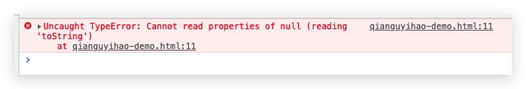
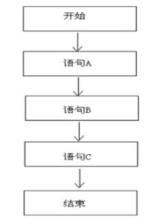
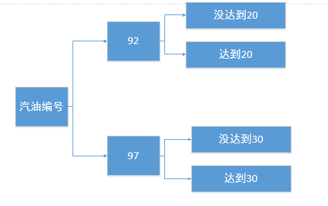
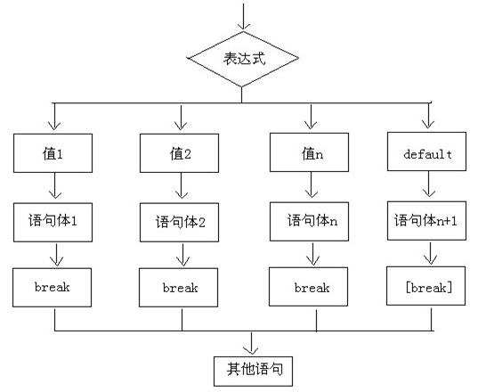

# 09-数据类型转换

通常有三种形式的数据类型转换：

- 转换为字符串类型
- 转换为数字型
- 转换为布尔型

我需要专门把某个数据类型转换成 null 或者 undefined 吗？因为这样做没有意义。

## 变量的类型转换的分类

类型转换分为两种：显式类型转换、隐式类型转换。

### 显式类型转换

显式类型转换：**手动**将某种数据类型，**强制**转换为另一种数据类型。也就是说，通过调用特定函数或运算符显式地将一个数据类型转换为另一个数据类型。

常见的显示类型转换方法，有这几种：

- toString()
- String()
- Number()
- parseInt(string)
- parseFloat(string)
- Boolean()

### 隐式类型转换

隐式类型转换：这是JS在运行时会**自动执行**的一种类型转换，不需要明确的代码指示。JS 在某些情况下会隐式地将一个数据类型转换为另一个数据类型，以完成某些操作或比较。

常见的隐式类型转换，包括下面这几种：

- isNaN() 函数
- 自增/自减运算符：`++`、`—-`
- 运算符：正号`+a`、负号`-a`
- 运算符：加号`+`
- 运算符：`-`、`*`、`/`、`%`
- 比较运算符：`<`、`>`、 `<=`、 `>=`、`==`等。比较运算符的运算结果都是布尔值：要么是 true，要么是 false。
- 逻辑运算符：`&&`、`||`、`!` 。非布尔值进行**与或**运算时，会先将其转换为布尔值，然后再运算。`&&`、`||`的运算结果是**原值**，`!`的运算结果为布尔值。

重点：**隐式类型转换，内部调用的都是显式类型转换的方法**。

接下来详细讲讲各种数据类型转换。

## 一、转换为 String

### [#](https://web.qianguyihao.com/04-JavaScript基础/09-数据类型转换.html#_1、调用-tostring-方法)1、调用 toString() 方法

语法：

```javascript
变量.toString();
常量.toString(); // 这里的常量，不要直接写数字，但可以是其它常量；下文会具体讲。

// 或者用一个新的变量接收转换结果
var result = 变量.toString();
```

该方法**不会影响到原变量**，它会将转换的结果返回。当然我们还可以直接写成`a = a.toString()`，这样的话，就是直接修改原变量。

当我们对一个字符串字面量调用 toString() 方法时，它实际上是调用了 String 构造函数，并将字符串字面量转换为一个 String 对象，然后调用该对象的 toString() 方法。String 对象的 toString() 方法返回调用它的原始字符串值。

```js
// 基本数据类型
var a1 = 'qianguyihao';
var a2 = 29;
var a3 = true;

// 引用数据类型
var a4 = [1, 2, 3];
var a5 = { name: 'qianguyihao', age: 29 };

// undefined 和 null
var a6 = null;
var a7 = undefined;

// 打印结果都是字符串
console.log(a1.toString()); // "qianguyihao"
console.log(a2.toString()); // "29"
console.log(a3.toString()); // "true"
console.log(a4.toString()); // "1,2,3"
console.log(a5.toString()); // "object"

// 下面这两个，打印报错
console.log(a6.toString()); // 报错：Uncaught TypeError: Cannot read properties of undefined'
console.log(a7.toString()); // 报错：Uncaught TypeError: Cannot read properties of null
```

一起来看看 toString() 的注意事项：

（1）undefined 和 null 这两个值没有 toString() 方法，所以它们不能用 toString() 。如果调用，会报错。

```js
console.log(undefined.toString());
console.log(null.toString());
```



如果你不确定一个值是不是`null`或`undefined`，可以使用`String()`函数，下一小段会讲。

（2）多数情况下，`toString()`不接收任何参数；当然也有例外：Number 类型的变量，在调用 toString()时，可以在方法中传递一个整数作为参数。此时它会把数字转换为指定的进制，如果不指定则默认转换为 10 进制。例如：

```javascript
var a = 255;

//Number数值在调用toString()时，可以在方法中传递一个整数作为参数
//此时它将会把数字转换为指定的进制,如果不指定则默认转换为10进制
a = a.toString(2); // 转换为二进制

console.log(a); // "11111111"
console.log(typeof a); // string
```

（3）纯小数的小数点后面，如果紧跟连续6个或6个以上的“0”时，那么，将用e来表示这个小数。代码举例：

```js
const num1 = 0.000001; // 小数点后面紧跟五个零
console.log(num1.toString()); // 打印结果："0.000001"

const num2 = 0.0000001; // 小数点后面紧跟六个零
console.log(num2.toString()); // 【重点关注】打印结果："1e-7"

const num3 = 1.0000001;
console.log(num3.toString()); // 打印结果："1.0000001"

const num4 = 0.10000001;
console.log(num4.toString()); // 打印结果："0.10000001"
```

（4）常量可以直接调用 toString() 方法，但这里的常量，不允许直接写数字。举例如下：

```js
1.toString(); // 注意，会报错
1..toString(); // 合法。得到的结果是字符串"1"
1.2.toString(); // 合法。得到的结果是字符串"1.2"
(1).toString(); // 合法。得到的结果是字符串"1"
'1'.toString(); // 合法。得到的结果是字符串"1"
```

上方代码中，为何出现这样的打印结果？这是因为：

- 第一行代码：JS引擎认为`1.toString()`中的`.`是小数点，**是数字字面量的一部分，而不是方法调用的分隔符**。小数点后面的字符是非法的。
- 第二行、第三行代码：JS引擎认为第一个`.`是小数点，第二个`.`是属性访问的语法，所以能正常解释实行。
- 第四行代码：用`()`排除了`.`被视为小数点的语法解释，所以这种写法也能正常解释执行。

小结：因为点号（.）被解释为数字字面量的一部分，而不是方法调用的分隔符。为了正确调用 toString 方法，可以使用括号或额外的点号。

如果想让数字调 toString() 方法，更推荐的做法是先把数字放到变量中存起来，然后通过变量调用 toString()。举例：

```js
const a = 1;
a.toString(); // 合法。得到的结果是字符串"1"
```

### 2、使用 String() 函数

语法：

```javascript
String(变量/常量);
```

该方法**不会影响到原数值**，它会将转换的结果返回。

使用 String()函数做强制类型转换时：

- 对于 Number、Boolean、String、Object 而言，本质上就是调用 toString()方法，返回结果同 toString()方法。
- 但是对于 null 和 undefined，则不会调用 toString() 方法。它会，将 undefined 直接转换为 "undefined"，将 null 直接转换为 "null"。

使用String()函数转为字符串的规则如下：

| 原始值              | 转换后的值              |
| ------------------- | ----------------------- |
| 布尔值：true、false | 字符串：'true'、'false' |
| 数字                | 字符串                  |
| undefined           | 字符串：'undefined'     |
| null                | 字符串：'null'          |
| 对象                | 字符串：'object'        |

| 特性                    | String                           | toString                       |
| ----------------------- | -------------------------------- | ------------------------------ |
| **类型**                | 全局函数/构造函数                | 对象方法                       |
| **调用方式**            | String(value)                    | value.toString()               |
| **适用范围**            | 任何值（包括 null 和 undefined） | 必须是有 toString 方法的对象   |
| **返回值**              | 总是原始字符串                   | 字符串，具体由对象实现决定     |
| **处理 null/undefined** | 可转换为 "null" 或 "undefined"   | 报错（无 toString 方法）       |
| **自定义性**            | 不可自定义转换逻辑               | 可通过重写 toString 方法自定义 |
| **上下文**              | 无需对象实例，直接使用           | 依赖调用者的类型和原型         |

### 3、隐式类型转换：字符串拼接

如果加号的两边有一个是字符串，则另一边会自动转换成字符串类型进行拼接。

字符串拼接的格式：变量+"" 或者 变量+"abc"

举例：

```javascript
var a = 123; // Number 类型
// 使用空字符串进行拼接
console.log(a + ''); // 打印结果："123"
// 使用普通字符串进行拼接
console.log(a + 'haha'); // 打印结果："123haha"
```

## 二、转换为 Number

### 1、使用 Number() 函数

语法：

```js
const result = Number(变量/常量);
```

使用 Number() 函数转为数字的规则如下：

| 原始值    | 转换后的值                                                   |
| --------- | ------------------------------------------------------------ |
| 字符串    | （1）字符串去掉首尾空格后，剩余字符串的内容如果是纯数字，则直接将其转换为数字。 （2）字符串去掉首尾空格后，剩余字符串包的内容只要含了其他非数字的内容（`小数点`按数字来算），则转换为 NaN。怎么理解这里的 **NaN** 呢？可以这样理解，使用 Number() 函数之后，**如果无法转换为数字，就会转换为 NaN**。 （3）如果字符串是一个**空串**或者是一个**全是空格**的字符串，则转换为 0。 |
| 布尔值    | true 转成 1；false 转成 0                                    |
| undefined | NaN                                                          |
| null      | 0                                                            |

###  2、隐式类型转换——运算符：加号 `+`

（1）**字符串 + 其他数据类型 = 字符串**

任何数据类型和字符串做加法运算，都会先自动将那个数据类型调用 String() 函数转换为字符串，然后再做拼串操作。最终的运算结果是字符串。

比如：

```javascript
result1 = 1 + 2 + '3'; // 字符串：33

result2 = '1' + 2 + 3; // 字符串：123
```

某些函数在执行时也会自动将参数转为字符串类型，比如 `console.log()`函数。

（2）**Boolean + 数字 = 数字**

Boolean 型和数字型相加时， true 按 1 来算 ，false 按 0 来算。这里其实是先调 Number() 函数，将 Boolean 类型转为 Number 类型，然后再和 数字相加。

（3）**null + 数字 = 数字**

等价于：0 + 数字

（4）**undefined + 数字 = NaN**

计算结果：NaN

（5）任何值和 **NaN** 运算的结果都是 NaN。

###  3、隐式类型转换——运算符：`-`、`*`、`/`、`%`

任何非 Number 类型的值做`-`、`*`、`/`、`%`运算时，会将这些值转换为 Number 然后再运算(内部调用的是 Number() 函数），运算结果是 Number 类型。

任何数据和 NaN进行运算，结果都是NaN。

###  4、隐式类型转换：正负号 `+a`、`-a`

任何值做`+a`、`-a`运算时， 底层调用的是 Number() 函数。不会改变原数值；得到的结果，会改变正负性。

代码举例：

```js
const a1 = '123';
console.log(+a1); // 123
console.log(-a1); // -123

const a2 = '123abc';
console.log(+a2); // NaN
console.log(-a2); // NaN

const a3 = true;
console.log(+a3); // 1
console.log(-a3); // -1


const a4 = false;
console.log(+a4); // 0
console.log(-a4); // -0

const a5 = null;
console.log(+a5); // 0
console.log(-a5); // -0

const a6 = undefined;
console.log(+a6); // NaN
console.log(-a6); // NaN
```

### 5、使用 parseInt()函数：字符串 -> 整数

语法：

```js
const result = parseInt(需要转换的字符串)
```

**parseInt()**：将传入的数据当作**字符串**来处理，从左至右提取数值，一旦遇到非数值就立即停止；停止时如果还没有提取到数值，就返回NaN。

parse 表示“转换”，Int 表示“整数”。例如：

```javascript
parseInt('5'); // 得到的结果是数字 5
```

按照上面的规律，使用 parseInt() 函数转为数字的规则如下：

| 原始值              | 转换后的值                                                   |
| ------------------- | ------------------------------------------------------------ |
| 字符串              | （1）**只保留字符串最开头的数字**，后面的中文自动消失。 （2）如果字符串不是以数字开头，则转换为 NaN。 （3）如果字符串是一个空串或者是一个全是空格的字符串，转换时会报错。 |
| 布尔值：true、false | NaN                                                          |
| undefined           | NaN                                                          |
| null                | NaN                                                          |

### 6、parseFloat()函数：字符串 --> 浮点数（小数）

parseFloat()的作用是：将字符串转换为**浮点数**。

parseFloat()和 parseInt()的作用类似，不同的是，parseFloat()可以获得小数部分。

代码举例：

```javascript
var a = '123.456.789px';
console.log(parseFloat(a)); // 打印结果：123.456
```

parseFloat() 的几个特性，可以参照 parseInt()。

## 三、转换为 Boolean

### [#](https://web.qianguyihao.com/04-JavaScript基础/09-数据类型转换.html#转换结果列举【重要】)转换结果列举【重要】

其他的数据类型都可以转换为 Boolean 类型。无论是隐式转换，还是显示转换，转换结果都是一样的。有下面几种情况：

转换为 Boolean 类型的规则如下：

| 原始值    | 转换后的值                                                   |
| --------- | ------------------------------------------------------------ |
| 字符串    | 空串的转换结果是false，其余的都是 true。 全是空格的字符串，转换结果也是 true。 字符串`'0'`的转换结果也是 true。 |
| 数字      | 0 和 NaN的转换结果 false，其余的都是 true。比如 `Boolean(NaN)`的结果是 false。 |
| undefined | false                                                        |
| null      | false                                                        |
| 对象      | 引用数据类型会转换为 true。 注意，空数组`[]`和空对象`{}`，**转换结果也是 true**，这一点，很多人不知道。 |

小结：空字符串''、0、NaN、undefined、null会转换为 false；其他值会转换为 true。

**重中之重来了：**

转换为 Boolean 的上面这几种情况，**极其重要**，项目开发中会频繁用到。比如说，我们在项目开发中，经常需要对一些**非布尔值**做**逻辑判断或者逻辑运算**，符合条件后，才做下一步的事情。这个逻辑判断就是依据上面的四种情况。

这里再次强调一下，空数组`[]`和空对象`{}`转换为 Boolean 值时，转换结果为 true。

# 10-运算符

## 运算符的定义和分类

### 运算符的定义

运算符和表达式形影不离，先来介绍一下概念。

**运算符**：也叫操作符，是一种符号。通过运算符可以对一个或多个值进行运算，并获取运算结果。

**表达式**：数字、运算符、变量的组合（组成的式子）。

表达式最终都会有一个运算结果，我们将这个结果称为表达式的**返回值**。

例如：`+`、`*`、`/`、`()` 都是**运算符**，而`（3+5）/2`则是**表达式**。

比如：typeof 就是运算符，可以获得一个值的类型。它会将该值的类型以**字符串**的形式返回，返回值可以是 number、string、boolean、undefined、object。

**运算元**：参与运算的对象。这个对象一般是数值或者变量。

例如：在加法运算中，运算元就是加法操作符两侧的值或变量。在逻辑运算中，运算元是指用于计算逻辑表达式的操作数。

如果一个运算符（比如加法运算符）拥有两个运算元，那么它是二元运算符。一元运算符、三元运算符的概念同理。

### 运算符的分类

JS 中的运算符，分类如下：

- 算数运算符
- 自增/自减运算符
- 一元运算符
- 三元运算符（条件运算符）
- 逻辑运算符
- 赋值运算符
- 比较运算符

下面来逐一讲解。

## 算数运算符

**算术运算符**：用于执行两个变量或值的算术运算。

此外，算数运算符存在隐式类型转换的情况，前文“数据类型转换”一节中已讲过，本文不再赘述。

常见的算数运算符有以下几种：

| 运算符 |          描述           |
| :----- | :---------------------: |
| +      |     加、字符串连接      |
| -      |           减            |
| *      |           乘            |
| /      |           除            |
| %      |  获取余数（取余/取模）  |
| **     | 幂运算，是 ES7 新增特性 |

### 浮点数运算的精度问题

浮点数值的最高精度是 17 位小数，但在进行算术计算时，会丢失精度，导致计算不够准确。比如：

```javascript
console.log(0.1 + 0.2); // 运算结果不是 0.3，而是 0.30000000000000004

console.log(0.07 * 100); // 运算结果不是 7，而是 7.000000000000001
```

因此，**不要直接判断两个浮点数是否相等**。前面的文章《JavaScript 基础：基本数据类型：Number》有详细介绍。

实际项目中，涉及数字计算的这部分，比较麻烦，且非常严谨；尤其是交易、金钱相关的业务，则一定不能出错。

如果你直接把两个数字进行加减乘除，很容易丢失精度，导致计算不准确。实战中，往往需要把计算相关的代码封装成公共方法，提供给业务侧调用。

我们也可以在开源网站找到一些已经封装好的工具类，比较知名的是 [big.js (opens new window)](https://github.com/MikeMcl/big.js)。

## 赋值运算符

赋值：将等号右侧的值赋给符号左侧的变量。

### 赋值运算符包括哪些

| 运算符 | 运算规则     | 举例                        |
| ------ | ------------ | --------------------------- |
| =      | 直接赋值     | let a = 5                   |
| +=     | 加后赋值     | a += 5 等价于 a = a + 5     |
| -=     | 减后赋值     | a -= 5 等价于 a = a - 5     |
| *=     | 乘后赋值     | a *= 5 等价于 a = a * 5     |
| /=     | 除后赋值     | a /= 5 等价于 a = a / 5     |
| %=     | 取余数后赋值 | a %= 5 等价于 a = a % 5     |
| **=    | 幂运算后赋值 | `a **= 5` 等价于 `a = a**5` |

## 自增和自减运算符

### [#](https://web.qianguyihao.com/04-JavaScript基础/10-运算符.html#自增运算符)自增运算符 `++`

作用：可以快速对一个变量进行加1操作。

注意事项：只能操作变量，不能操作常量或者表达式，否则会报错。

例如：

```js
let a1 = 1;
let a2 = 2;

a1++;
const result = a1++ + a2; // result的结果为4
// (a1+a2)++; // 报错，不支持表达式的写法，

const a3 = 3;
a3++; // 报错，因为常量无法再自加
```

自增分成两种：`a++`和`++a`。共同点：

（1）无论是 `a++` 还是`++a`，自增都会使原变量的值加 1。

（2）**我们要注意的是**：`a`是变量，而`a++`和`++a`是**表达式**。

（3）如果只想使用 a 的值，不使用表达式的值，那么这两种写法都可以，因为 a 的值没有区别。一般是用 a++ 这种写法更多一些。

那这两种自增，有啥区别呢？区别是：`a++` 和 `++a`的值不同：（也就是说，表达式的值不同）

- `a++`这个表达式的值等于原变量的值（a 自增前的值）。可以这样理解：先把 a 的值赋值给表达式，然后 a 再自增。
- `++a`这个表达式的值等于新值 （a 自增后的值）。 可以这样理解：a 先自增，然后把自增后的值赋值给表达式。

### 自减运算符 `--`

作用：可以快速对一个变量进行减1操作。原理同自增运算符。

开发时，大多使用后置的自增/自减，并且代码独占一行，例如：`num++`，或者 `num--`。

### 隐式类型转换的过程

自增和自减时，变量 a 包含了隐式类型转换的过程：

（1）先调用`Number(a)`函数；

（2）然后将`Number(a)`的返回结果进行 加 1 操作，得到的结果赋值给 a。

举例 1：

```javascript
let a = '666'; // 这里不能用 const 定义，否则报错。
a++;

console.log(a); // 打印结果：667
console.log(typeof a); // 打印结果： number
```

举例2：

```javascript
let a = 'abc';
a++;

console.log(a); // 打印结果：NaN。因为 Number('abc')的结果为 NaN，再自增后，结果依然是 NaN
console.log(typeof a); // 打印结果：number
```

>typeof(NaN) is **a number because it is a numeric value**

## 一元运算符

一元运算符，只需要一个操作数。常见的一元运算符如下。

### typeof

> typeof 是典型的一元运算符，因为后面只跟一个操作数。

因为 JS是弱类型语言，是[松散型 (opens new window)](https://blog.csdn.net/cuk0051/article/details/108340196)语言，所以我们不需要**显式**指定数据的具体类型。但是很多时候，我们仍需要通过一种手段知道某个变量到底是哪一种数据类型，typeof 运算符应运而生。

`typeof()`表示“**获取变量的数据类型**”，它是 JS 提供的一个操作符。返回的是小写，语法为：（两种写法都可以）

```javascript
// 写法1
typeof 变量;

// 写法2
typeof(变量);
```

typeof 这个运算符的返回结果就是变量的数据类型。那返回结果的类型是什么呢？是字符串。

typeof 是一个运算符，或者说是一个操作符，所以说，typeof() 并不是一个函数，`()`只是将括起来的内容当做一个整体而已。

typeof() 的**返回结果**：

| typeof 的语法                | 返回结果  |
| :--------------------------- | :-------: |
| typeof 数字（含 typeof NaN） |  number   |
| typeof 字符串                |  string   |
| typeof 布尔型                |  boolean  |
| typeof 对象                  |  object   |
| typeof 方法                  | function  |
| typeof null                  |  object   |
| typeof undefined             | undefined |

- 为啥 `typeof null`的返回值也是 object 呢？因为 null 代表的是**空对象**。
- `typeof NaN`的返回值是 number，之前的内容中讲过，NaN 是一个特殊的数字。

### 正号/负号：`+a`、`-a`

> 注意，这里说的是正号/负号，不是加号/减号。

（1）不会改变原数值。

（1）正号不会对数字产生任何影响。比如说，`2`和`+2`是一样的。

（2）我们可以对其他的数据类型使用`+`，来将其转换为 number【重要的小技巧】。比如：

```javascript
var a = true;
a = +a; // 注意这行代码的一元运算符操作
console.log('a：' + a);
console.log(typeof a);

console.log('-----------------');

var b = '18';
b = +b; // 注意这行代码的一元运算符操作
console.log('b：' + b);
console.log(typeof b);
```

打印结果：

```text
a：1
number

-----------------

b：18
number
```

（3）负号可以对数字进行取反。

### 隐式类型转换——正号/负号

任何值做`+a`、`-a`运算时， 内部调用的是 Number() 函数。

**举例**：

```javascript
const a = '666';
const b = +a; // 对 a 进行一元运算，b是运算结果

console.log(typeof a); // 打印结果：string。说明 a 的数据类型保持不变。
console.log(a); // 打印结果："666"。不会改变原数值。

console.log(typeof b); // 打印结果：number。说明 b 的数据类型发生了变化。
console.log(b); // 打印结果：666
```

## 三目运算符

三目运算符也叫三元运算符、条件运算符。

语法：

```text
条件表达式 ? 语句1 : 语句2;
```

**执行流程**——条件运算符在执行时，首先对条件表达式进行求值：

- 如果该值为 true，则执行语句 1，并返回执行结果
- 如果该值为 false，则执行语句 2，并返回执行结果

如果条件表达式的求值结果是一个非布尔值，会将其转换为布尔值然后再运算。

## 逻辑运算符

逻辑运算符有三个：

- `&&`： 与（且）。两个都为真，结果才为真。特点：一假则假。
- `||` ：或。只要有一个是真，结果就是真。特点：特点: 一真则真。
- `!` ：非。对一个布尔值进行取反。特点: 真变假, 假变真。

注意：能参与逻辑运算的，都是布尔值。

`a>=18 && a<= 65`千万别想当然地写成`18<= a <= 65`，没有这种语法

### 非布尔值的与或运算【重要】

> 之所以重要，是因为在实际开发中，我们经常用这种代码做容错处理或者兜底处理。

非布尔值进行**与或运算**时，会通过隐式类型转换，先将其转换为布尔值，然后再运算，但返回结果是**原值**。比如说

```javascript
var result = 5 && 6; // 运算过程：true && true;
console.log('result：' + result); // 打印结果：6（也就是最后面的那个值）
```

上方代码可以看到，虽然运算过程为布尔值的运算，但返回结果是原值。

那么，返回结果是哪个原值呢？我们来看一下。

1、两个非布尔值，做逻辑运算：

**与运算**的返回结果：

- 如果第一个值为 false，则只执行第一条语句，并直接返回第一个值；不会再往后执行。
- 如果第一个值为 true，则继续执行第二条语句，并返回第二个值（无论第二个值的结果如何）。

**或运算**的返回结果：

- 如果第一个值为 true，则只执行第一条语句，并直接返回第一个值；不会再往后执行。
- 如果第一个值为 false，则继续执行第二条语句，并返回第二个值（无论第二个值的结果如何）。

2、三个及以上的非布尔值，做逻辑运算：

**与运算**的返回结果：（value1 && value2 && value3）

- 从左到右依次计算操作数，找到**第一个为 false** 的值为止。
- 如果所有的值都为 true，则返回最后一个值。

**或运算**的返回结果：（value1 || value2 || value3）

- 从左到右依次计算操作数，找到**第一个为 true** 的值为止。
- 如果所有的值都为 false，则返回最后一个值。

### 非布尔值的 `!` 运算

非布尔值进行**非运算**时，会先将其转换为布尔值，然后再运算，返回结果是**布尔值**。

举例：

```javascript
let a = 10;
a = !a;

console.log(a); // false
console.log(typeof a); // boolean
```

### 短路运算的妙用【重要】

> 下方举例中的写法技巧，在实际开发中，经常用到。这种写法，是一种很好的「容错、容灾、降级」方案，需要多看几遍。

1、JS 中的`&&`属于**短路**的与：

- 如果第一个值为 false，则不会执行后面的内容。
- 如果第一个值为 true，则继续执行第二条语句，并返回第二个值。

举例：

```javascript
const a1 = 'qianguyihao';
// 第一个值为true，会继续执行后面的内容
a1 && alert('看 a1 出不出来'); // 可以弹出 alert 框

const a2 = undefined;
// 第一个值为false，不会继续执行后面的内容
a2 && alert('看 a2 出不出来'); // 不会弹出 alert 框
```

2、JS 中的`||`属于**短路**的或：

- 如果第一个值为 true，则不会执行后面的内容。
- 如果第一个值为 false，则继续执行第二条语句，并返回第二个值。

实际开发中，我们经常是这样来做「容错处理」的，如下。

举例1：

```js
const result; // 请求接口时，后台返回的内容
let errorMsg = ''; // 前端的文案提示
if (result & result.retCode == 0) {
  errorMsg = '恭喜你中奖啦~'
}

if (result && result.retCode != 0) {
	// 接口返回异常码时
	errorMsg = result.msg || '活动太火爆，请稍后再试'; // 文案提示信息，优先用 接口返回的msg字段，其次用 '活动太火爆，请稍后再试' 这个文案兜底。
}

if (!result) {
	// 接口挂掉时
	errorMsg = '网络异常，请稍后再试';
}
```

举例2，当前端成功调用一个接口后，返回的数据为 result 对象。这个时候，我们用变量 a 来接收 result 里的图片资源：

```javascript
if (result.retCode == 0) {
    var a = result && result.data && result.data.imgUrl || 'http://img.smyhvae.com/20160401_01.jpg';
}
```

上方代码的意思是，获取返回结果中的`result.data.imgUrl`这个图片资源；如果返回结果中没有 `result.data.imgUrl` 这个字段，就用 `http://img.smyhvae.com/20160401_01.jpg` 作为**兜底**图片。这种写法，在实际开发中经常用到。

## [#](https://web.qianguyihao.com/04-JavaScript基础/10-运算符.html#比较运算符)比较运算符

比较运算符可以比较两个值之间的大小关系，如果关系成立它会返回 true，如果关系不成立则返回 false。

比较运算符有很多种，比如：

```text
>	大于号
<	小于号
>= 	大于或等于
<=  小于或等于
== 	等于
=== 全等于
!=	不等于
!== 不全等于
```

**比较运算符，得到的结果都是布尔值：要么是 true，要么是 false**。如果关系成立，就返回true；如果关系不成立，就返回false。

### 非数值的比较

（1）对于非数值进行比较时，会将其转换为数值类型（内部是调用`Number()方法`），再进行比较。

举例如下：

```javascript
console.log(1 > true); //false
console.log(1 >= true); //true
console.log(1 > '0'); //true

//console.log(10 > null); //true

//任何值和NaN做任何比较都是false

console.log(10 <= 'hello'); //false
console.log(true > false); //true
```

（2）特殊情况：如果参与比较的都是字符串，则**不会**将其转换为数字进行比较，比较的是字符串的**Unicode 编码**。【非常重要，这里是个大坑，很容易踩到】

比较字符编码时，是一位一位进行比较，顺序从左到右。如果大一样，则继续比较下一位。

比如说，当你尝试去比较`"123"`和`"56"`这两个字符串时，你会发现，字符串"56"竟然比字符串"123"要大（因为 5 比 1 大）。也就是说，下面这样代码的打印结果，其实是 true:（这个我们一定要注意，在日常开发中，很容易忽视）

```javascript
// 比较两个字符串时，比较的是字符串的字符编码，所以可能会得到不可预期的结果
console.log('56' > '123'); // true
```

**因此**：当我们想比较两个字符串型的数字时，**一定一定要先转型**再比较大小，比如 `parseInt()`。

（3）任何值和 NaN 做任何比较都是 false。


### `==`符号的强调

`==`这个符号，它是**判断是否等于**，而不是赋值。注意事项如下：

（1）`==`这个符号，还可以验证字符串是否相同。例如：

```javascript
console.log('我爱你中国' == '我爱你中国'); // 输出结果为true
```

（2）`==`这个符号并不严谨，会做隐式转换，将不同的数据类型，**转为相同类型**进行比较。例如：

```javascript
console.log('6' == 6); // 打印结果：true。这里的字符串"6"会先转换为数字6，然后再进行比较
console.log(true == '1'); // 打印结果：true
console.log(0 == -0); // 打印结果：true

console.log(null == 0); // 打印结果：false
```

（3）undefined 衍生自 null，所以这两个值做相等判断时，会返回 true。

```javascript
console.log(undefined == null); //打印结果：true。
```

（4）NaN 不和任何值相等，包括它本身。

```javascript
console.log(NaN == NaN); //false
console.log(NaN === NaN); //false
```

### `===`全等符号的强调

**全等在比较时，不会做类型转换**。如果要保证**完全等于**（即：不仅要判断取值相等，还要判断数据类型相同），我们就要用三个等号`===`。例如：

```javascript
console.log('6' === 6); //false
console.log(6 === 6); //true
```

上述内容分析出：

- `==`两个等号，不严谨，"6"和 6 是 true。
- `===`三个等号，严谨，"6"和 6 是 false。

### 数值类型和其他类型比较

先将其他类型隐式转换为数值类型（内部是调用`Number()`方法），然后比较大小。代码举例：

```js
//字符串与数字比较
console.log('200' > 100); // true
console.log('a' > 100); // false。 'a' 被转换成 NaN 进行比较
console.log('110a' > 100); // false。 '110a' 被转换成 NaN 进行比较。说明`110a`在做隐式转换的时候，是调用了 Number('110a')方法，而不是调用  parseInt('110a')方法

// 布尔值与数字比较
console.log(true == 1); // true
console.log(false == 0); // true

// null 与数字进行比较
console.log(null < 0); // false
console.log(null == 0); // false
console.log(null > 0); // false
console.log(null <= 0); // true。这是一个很严重的bug
console.log(null >= 0); // true。同上

// undefined 与数字进行比较：结果都是 false
console.log(undefined > 0);
console.log(undefined == 0);
console.log(undefined < 0);
console.log(undefined >= 0);
```

### 日期大小比较

如果日期的格式为字符串，则比较字符串的**Unicode 编码**。代码举例：

```js
const myDate1 = new Date(2022, 8, 8);
const myDate2 = new Date(2022, 8, 9);
const myDate3 = new Date(2022, 9, 8);
const myDate4 = new Date(2023, 8, 8);
console.log(myDate1 < myDate2); // true
console.log(myDate1 < myDate3); // true
console.log(myDate3 < myDate4); // true

const date1 = '2022-08-08'; // "2022/08/08"同理
const date2 = '2022-08-09'; // "2022/08/09"同理
const date3 = '2022-09-08'; // "2022/09/08"同理
const date4 = '2023-08-08'; // "2023/08/08"同理
console.log(date1 < date2); // true
console.log(date1 < date3); // true
console.log(date3 < date4); // true

const time1 = '2022-08-08 08:00:00';
const time2 = '2022-08-08 08:00:01';
const time3 = '2022-08-08 08:01:00';
const time4 = '2022-08-08 09:00:00';
console.log(time1 < time2); // true
console.log(time1 < time3); // true
console.log(time1 < time4); // true

// 数据类型不同，此处是先将 myDate1 转为字符串类型，然后比较大小。可想而知，结果都是 false
console.log(myDate1 >= date1); // false
console.log(myDate1 <= date1); // false

// 虽然时间格式不同，但都是字符串，所以可以比较大小
console.log(date1 < time1); // true
```

## 逗号运算符

逗号运算符一般用于简化代码。逗号运算符的优先级是所有运算符中最低的。

逗号运算符也是一个运算符, 所以也有运算符结果。它的运算符结果是最后一个表达式的结果。

代码举例：

```js
// 利用逗号运算符同时定义多个变量
let a, b;
// 利用逗号运算符同时给多个变量赋值
a = 10, b = 5;

const res1 = (1 + 2, 3 + 4, 5 + 6); // 打印结果：11
```

## 运算符的优先级

运算符的优先级如下：（优先级从高到低）

- `.`、`[]`、`new`
- `()`
- `++`、`--`
- `!`、`~`、`+`（单目）、`-`（单目）、`typeof`、`void`、`delete`
- `*`、`/`、`%`
- `+`（双目）、`-`（双目）
- `<<`、`>>`、`>>>`
- 比较运算符：`<`、`<=`、`>`、`>=`
- 比较运算符：`==`、`!==`、`===`、`!==`
- `&`
- `^`
- `|`
- 逻辑运算符：`&&` （注意：逻辑与 `&&` 比逻辑或 `||` 的优先级更高）
- 逻辑运算符：`||`
- `?:`
- `=`、`+=`、`-=`、`*=`、`/=`、`%=`、`<<=`、`>>=`、`>>>=`、`&=`、`^=`、`|=`
- `,`

备注：在实际写代码的时候，如果你不清楚哪个优先级更高，可以先尝试把括号用上。

# 11-流程控制语句：选择结构（if和switch）

## 代码块

用`{}`包围起来的代码，就是代码块。

在 ES5 语法中，代码块，只具有**分组**的作用，没有其他的用途。代码块中的内容，在外部是完全可见的。举例：

```javascript
{
    var a = 2;
    alert('qianguyihao');
    console.log('千古壹号');
}

console.log('a = ' + a);
```

打印结果：（可以看出，虽然变量 a 是定义在代码块中的，但是在外部依然可以访问）

```text
千古壹号
a = 2
```

## 流程控制语句

在一个程序执行的过程中，各条语句的执行顺序对程序的结果是有直接影响的。所以，我们必须清楚每条语句的执行流程。而且，很多时候我们要通过控制语句的执行顺序来实现我们想要的业务逻辑和功能。

### 流程控制语句分类

- 顺序结构
- 选择结构：if 语句、switch 语句
- 循环结构：while 语句、for 语句

## 顺序结构

按照代码的先后顺序，依次执行。结构图如下：



## if 语句

if 语句有以下三种形式。

### [#](https://web.qianguyihao.com/04-JavaScript基础/11-流程控制语句：选择结构（if和switch）.html#if-语句的三种形式)if 语句的三种形式

形式1：（条件成立才执行。如果条件不成立，那就什么都不做）

```javascript
if (条件表达式) {
    // 条件为真时，做的事情
}
```

对于非布尔类型的数据，会先转换成布尔类型再判断。下同。

形式 2：

```javascript
if (条件表达式) {
    // 条件为真时，做的事情
} else {
    // 条件为假时，做的事情
}
```

形式3：（多分支的 if 语句）

```javascript
if (条件表达式1) {
    // 条件1为真时，做的事情
} else if (条件表达式2) {
    // 条件1不满足，条件2满足时，做的事情
} else if (条件表达式3) {
    // 条件1、2不满足，条件3满足时，做的事情
} else {
    // 条件1、2、3都不满足时，做的事情
}
```

以上所有的语句体中，只执行其中一个。

### if 语句的嵌套

我们通过下面这个例子来引出 if 语句的嵌套。

```text
一个加油站为了鼓励车主多加油，所以加的多有优惠。
92号汽油，每升6元；如果大于等于20升，那么每升5.9；
97号汽油，每升7元；如果大于等于30升，那么每升6.95
编写JS程序，用户输入自己的汽油编号，然后输入自己加多少升，弹出价格。
```



代码实现如下：

```javascript
//第一步，输入
const bianhao = parseInt(prompt('您想加什么油？填写92或者97'));
const sheng = parseFloat(prompt('您想加多少升？'));

//第二步，判断
if (bianhao == 92) {
    //编号是92的时候做的事情
    if (sheng >= 20) {
        const price = sheng * 5.9;
    } else {
        const price = sheng * 6;
    }
} else if (bianhao == 97) {
    //编号是97的时候做的事情
    if (sheng >= 30) {
        const price = sheng * 6.95;
    } else {
        const price = sheng * 7;
    }
} else {
    alert('不好意思，没有这个编号的汽油！');
}

alert('价格是' + price);
```

## switch 语句（条件分支语句）

switch 语句也叫条件分支语句。

### [#](https://web.qianguyihao.com/04-JavaScript基础/11-流程控制语句：选择结构（if和switch）.html#语法格式)语法格式

```javascript
switch(表达式) {
	case 值1：
		语句体1;
		break;

	case 值2：
		语句体2;
		break;

	...
	...

	default：
		语句体 n+1;
		break;
}
```

**解释**：switch 可以理解为“开关、转换” 。case 可以理解为“案例、选项”。

###  switch 语句的执行流程

流程图如下：



执行流程如下：

（1）首先，计算出表达式的值，和各个 case 依次比较，一旦有对应的值，就会执行相应的语句，在执行的过程中，遇到 break 就会结束。

（2）然后，如果所有的 case 都和表达式的值不匹配，就会执行 default 语句体部分。

### [#](https://web.qianguyihao.com/04-JavaScript基础/11-流程控制语句：选择结构（if和switch）.html#switch-语句的结束条件【非常重要】)switch 语句的结束条件【非常重要】

- 情况 a：遇到 break 就结束（而不是遇到 default 就结束）。因为 break 在此处的作用是，立即结束并退出整个 switch 语句。
- 情况 b：执行到程序的末尾就结束。

### 注意点

1、switch 后面的括号里可以是变量、常量、表达式， 通常是一个**变量**（一般做法是：先把表达式存放到变量中）。

case 后面的值可以是变量、常量、表达式。

2、**case的判断逻辑是`===`，不是`==`**。因此，字符串`'6'`和 数字 `6` 是不一样的。

### case 穿透

switch 语句中的`break`可以省略，但一般不建议（对于新手而言）。否则结果可能不是你想要的，会出现一个现象：**case 穿透**。

当然，如果你能利用好 case 穿透，会让代码写得十分优雅。

**举例 1**：（case 穿透的情况）

```javascript
const num = 4;

//switch判断语句
switch (num) {
    case 1:
        console.log('星期一');
        break;
    case 2:
        console.log('星期二');
        break;
    case 3:
        console.log('星期三');
        break;
    case 4:
        console.log('星期四');
    //break;
    case 5:
        console.log('星期五');
    //break;
    case 6:
        console.log('星期六');
        break;
    case 7:
        console.log('星期日');
        break;
    default:
        console.log('你输入的数据有误');
        break;
}
```

上方代码的解释：因为在 case 4 和 case 5 中都没有 break，那语句走到 case 6 的 break 才会停止。

# 12-流程控制语句：循环结构（for和while）

## for 循环

### [#](https://web.qianguyihao.com/04-JavaScript基础/12-流程控制语句：循环结构（for和while）.html#for-循环的语法)for 循环的语法

语法：

```text
for(①初始化表达式; ②条件表达式; ④更新表达式){
	③语句...
}
```

执行流程：

```text
①执行初始化表达式，初始化变量（初始化表达式只会执行一次）

②执行条件表达式，判断是否执行循环：
	如果为true，则执行循环③
	如果为false，终止循环

④执行更新表达式，更新表达式执行完毕继续重复②
```

for 循环举例：

```javascript
for (let i = 1; i <= 100; i++) {
    console.log(i);
}
```

## while 循环语句

### [#](https://web.qianguyihao.com/04-JavaScript基础/12-流程控制语句：循环结构（for和while）.html#while-循环)while 循环

语法：

```javascript
while(条件表达式){
	语句...
}
```

**如果有必要的话，我们可以使用 break 来终止循环**。

### do...while 循环

语法：

```javascript
do{
	语句...
}while(条件表达式)
```

```text
do...while语句在执行时，会先执行循环体：

	循环体执行完毕以后，再对while后的条件表达式进行判断：
		如果结果为true，则继续执行循环体，执行完毕继续判断，以此类推
		如果结果为false，则终止循环
```

### [#](https://web.qianguyihao.com/04-JavaScript基础/12-流程控制语句：循环结构（for和while）.html#while-循环和-do-while-循环的区别)while 循环和 do...while 循环的区别

这两个语句的功能类似，不同的是：

- while：先判断后执行。只有条件表达式为真，才会执行循环体。
- do...while：先执行后判断。无论条件表达式是否为真，循环体至少会被执行一次。

##  break 和 continue

> 这个知识点非常重要。

### break

- break 可以用来退出 switch 语句或退出**整个**循环语句（循环语句包括 for 循环、while 循环。不包括 if。单独的 if 语句里不能用 break 和 continue，否则会报错）。
- break 会立即终止离它**最近**的那个循环语句。
- 可以为循环语句创建一个 label，来标识当前的循环（格式：label:循环语句）。使用 break 语句时，可以在 break 后跟着一个 label，这样 break 将会结束指定的循环，而不是最近的。

**举例 1**：通过 break 终止循环语句

```javascript
for (let i = 0; i < 5; i++) {
    console.log('i的值:' + i);
    if (i == 2) {
        break; // 注意，虽然在 if 里 使用了 break，但这里的 break 是服务于外面的 for 循环。
    }
}
```

```text
i的值:0
i的值:1
i的值:2
```

**举例 2**：label 的使用

```javascript
outer: for (let i = 0; i < 5; i++) {
    console.log('外层循环 i 的值：' + i);
    for (let j = 0; j < 5; j++) {
        break outer; // 直接跳出outer所在的外层循环（这个outer是我自定义的label）
        console.log('内层循环 j 的值:' + j);
    }
}
```

打印结果：

```text
外层循环 i 的值：0
```

### continue

- continue 只能用于循环语句（包括 for 循环、while 循环，不包括 if。单独的 if 语句里不能用 break 和 continue，否则会报错）。可以用来跳过**当次**循环，继续下一次循环。
- 同样，continue 默认只会离他**最近**的循环起作用。
- 同样，如果需要跳过指定的当次循环，可以使用 label 标签。

举例：

```javascript
for (let i = 0; i < 10; i++) {
    if (i % 2 == 0) {
        continue;
    }
    console.log('i的值:' + i);
}
```

打印结果：

```text
i的值:1

i的值:3

i的值:5

i的值:7

i的值:9
```