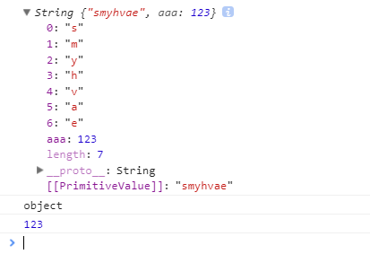
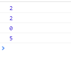
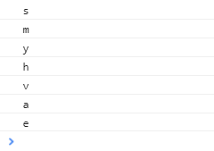
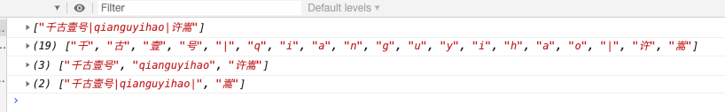
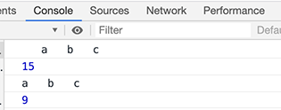

# 13-对象简介

## 对象简介

### [#](https://web.qianguyihao.com/04-JavaScript基础/13-对象简介.html#对象的概念)对象的概念

在 JavaScript 中，对象是一组**无序**的相关属性和方法的集合。

**对象的作用是：封装信息**。比如 Student 类里可以封装学生的姓名、年龄、成绩等。

对象具有**特征**（属性）和**行为**（方法）。

### 对象包括哪些数据类型

我们知道，JS 中的数据类型，包括以下几种：

- **基本数据类型（值类型）**：String 字符串、Number 数值、BigInt 大型数值、Boolean 布尔值、Null 空值、Undefined 未定义、Symbol。
- **引用数据类型（引用类型）**：Object 对象。

只要不是那七种基本数据类型，就全都是对象。对象属于一种复合的数据类型，在对象中可以保存多个不同数据类型的属性。

### 对象的分类

1、内置对象：

- 由 ES 标准中定义的对象，在任何的 ES 的实现中都可以使用。
- 比如：Object、Math、Date、String、Array、Number、Boolean、Function 等。

2、宿主对象：

- 由 JS 的运行环境提供的对象，目前来讲主要指由浏览器提供的对象。
- 比如 BOM、DOM，比如`console`、`document`。

3、自定义对象：

- 由开发人员自己创建的对象。

通过 new 关键字创建出来的对象实例，都是属于对象类型。

## 自定义对象

### 为什么需要自定义对象

保存一个值时，可以使用**变量**，保存多个值（一组值）时，可以使用**数组**。

比如，如果要保存一个人的信息，通过数组的方式可以这样保存：

```javascript
const arr = ['王二', 35, '男', '180'];
```

上面这种表达方式比较乱。而如果用 JS 中的**自定义对象**来表达，**结构会更清晰**。如下：

```javascript
const person = {
    name: 'qianguyihao',
    age: 30,
    sex: '男',
    favor: ['阅读', '羽毛球'],
    sayHi: function () {
        console.log('qianguyihao');
    },
};
```

由此可见，自定义对象里面的属性均是**键值对（key: value）**，表示属性和值的映射关系：

- 键/属性：属性名。
- 值：属性值，可以是任意类型的值（数字类型、字符串类型、布尔类型，函数类型等）。

### 自定义对象的语法

语法如下：

```js
const obj = {
    key: value,
    key: value,
    key: value,
};
```

key 和 value 之间用冒号分隔，每组 key:vaue 之间用逗号分隔，最后一对 key:value 的末尾可以写逗号，也可以不写逗号。

问：对象的属性名是否需要加引号？

答：如果属性名不符合 JS 标识符的命名规范，则需要用引号包裹。比如：

```js
const person = {
    'my-name': 'qianguyihao',
};
```

补充：其实，JS 的内置对象、宿主对象，底层也是通过自定义对象的形式（也就是键值对的形式）进行封装的。

## 对象的属性值补充

### 什么叫对象的方法【重要】

对象的属性值可以是任意的数据类型，也可以是个**函数**（也称之为方法）。换而言之，**如果对象的属性值是函数，则这个函数可被称之为对象的“方法”**。

```javascript
const obj = new Object();
obj.sayName = function () {
    console.log('qianguyihao');
};

// 没加括号，就是获取方法
console.log(obj.sayName);
console.log('-----------');
// 加了括号，就是调用方法。即：执行函数内容，并执行函数体的内容
console.log(obj.sayName());
```

打印结果：


**输出解释**

1. console.log(obj.sayName)
    输出 [Function: sayName]，因为你只是打印了函数的引用，没有调用它。
2. console.log(obj.sayName())
   - 首先执行 sayName()，打印 qianguyihao。
   - 然后 sayName() 返回 undefined（因为没有 return），所以 console.log 输出 undefined。

### 对象中的属性值，也可以是一个对象

举例：

```javascript
const company = {
    name: "Tech Corp",
    employee: {
        id: 1,
        info: {
            name: "李四",
            role: "工程师"
        }
    }
};

console.log(company.employee.info.name); // 输出: "李四"
```

## 传值和传址的区别

### 对象保存在哪里

1、基本数据类型的值直接保存在**栈内存**中，变量与变量之间是独立的，值与值之间是独立的，修改一个变量不会影响其他的变量。

2、对象是保存到**堆内存**中的，每创建一个新的对象，就会在堆内存中开辟出一个新的空间。变量保存的是对象的内存地址（对象的引用）。换而言之，对象的值是保存在**堆内存**中的，而对象的引用（即变量）是保存在**栈内存**中的。

**如果两个变量保存的是同一个对象引用，当一个通过一个变量修改属性时，另一个也会受到影响**。这句话很重要，我们来看看下面的例子。

### [#](https://web.qianguyihao.com/04-JavaScript基础/13-对象简介.html#传值)传值

代码举例：

```js
let a = 1;

let b = a; // 将 a 赋值给 b

b = 2; // 修改 b 的值
```

上方代码中，当我修改 b 的值之后，a 的值并不会发生改变。这个大家都知道。我们继续往下看。

### [#](https://web.qianguyihao.com/04-JavaScript基础/13-对象简介.html#传址-一个经典的例子)传址（一个经典的例子）

代码举例：

```javascript
var obj1 = new Object();
obj1.name = '孙悟空';

var obj2 = obj1; // 将 obj1 的地址赋值给 obj2。从此， obj1 和 obj2 指向了同一个堆内存空间

//修改obj2的name属性
obj2.name = '猪八戒';
```

上面的代码中，当我修改 obj2 的 name 属性后，会发现，obj1 的 name 属性也会被修改。因为 obj1 和 obj2 指向的是堆内存中的同一个地址。

这个例子要尤其注意，实战开发中，很容易忽略。

对于引用类型的数据，赋值相当于地址拷贝，a、b 指向了同一个堆内存地址。所以改了 b，a 也会变；本质上 a、b 就是一个东西。

如果你打算把引用类型 A 的值赋值给 B，让 A 和 B 相互不受影响的话，可以通过 Object.assign() 来复制对象。效果如下：

```js
var obj1 = { name: '孙悟空' };

// 复制对象：把 obj1 赋值给 obj3。两者之间互不影响
var obj3 = Object.assign({}, obj1);
```

# 14-基本包装类型

## 基本数据类型不能绑定属性和方法

属性和方法只能添加给对象，不能添加给基本数据类型。我们拿字符串来举例。

**1、基本数据类型：**

基本数据类型`string`是**无法绑定属性和方法**的。

```javascript
var str = 'qianguyihao';

str.aaa = 12;
console.log(typeof str); //打印结果为：string
console.log(str.aaa); //打印结果为：undefined
```

当你执行 str.aaa = 12 时，JavaScript 会：

- 自动将基本类型 str 转换为一个临时的 String 对象（new String('qianguyihao')）。
- 在这个临时对象上设置属性 aaa = 12。
- 但是，这个包装对象只在操作时临时存在，操作完成后立即销毁，str 本身仍然是一个基本类型字符串，而不是那个临时的 String 对象。

上方代码中，当我们尝试打印`str.aaa`的时候，会发现打印结果为：undefined。也就是说，不能给 `string` 绑定属性和方法。

**2、引用数据类型：**

引用数据类型`String`是可以绑定属性和方法的。如下：

```javascript
var strObj = new String('smyhvae');
strObj.aaa = 123;
console.log(strObj);
console.log(typeof strObj); //打印结果：Object
console.log(strObj.aaa);
```

打印结果：



内置对象 Number 也有一些自带的方法，比如：

- Number.MAX_VALUE;
- Number.MIN_VALUE;

内置对象 Boolean 也有一些自带的方法，但是用的不多。

### 基本包装类型

### [#](https://web.qianguyihao.com/04-JavaScript基础/14-基本包装类型.html#介绍)介绍

我们都知道，JS 中的数据类型包括以下几种。

- 基本数据类型：String 字符串、Number 数值、BigInt 大型数值、Boolean 布尔值、Null 空值、Undefined 未定义、Symbol。
- 引用数据类型：Object 对象。

JS 为我们提供了三个**基本包装类**：

- String()：将基本数据类型字符串，转换为 String 对象。
- Number()：将基本数据类型的数字，转换为 Number 对象。
- Boolean()：将基本数据类型的布尔值，转换为 Boolean 对象。

通过上面这这三个包装类，我们可以**将基本数据类型的数据转换为对象**。

代码举例：

```javascript
let str1 = 'qianguyihao';
let str2 = new String('qianguyihao');

let num = new Number(3);

let bool = new Boolean(true);

console.log(typeof str1); // 打印结果：string
console.log(typeof str2); // 注意，打印结果：object
```

**需要注意的是**：我们在实际应用中一般不会使用基本数据类型的**对象**。如果使用基本数据类型的对象，在做一些比较时可能会带来一些**不可预期**的结果。

比如说：

```javascript
var boo1 = new Boolean(true);
var boo2 = new Boolean(true);

console.log(boo1 === boo2); // 打印结果竟然是：false
```

它们的引用地址（0x123 和 0x456）不同。

再比如说：

```javascript
var boo3 = new Boolean(false);

if (boo3) {
    console.log('qianguyihao'); // 这行代码竟然执行了
}
```

boo3 的类型是 'object'，而不是基本类型 'boolean'。

即使 boo3 内部包装的值是 false，它仍然是一个对象，而对象永远不会被视为“假值”。

### 基本包装类型的作用

当我们对一些基本数据类型的值去调用属性和方法时，JS引擎会**临时使用包装类将基本数据类型转换为引用数据类型**（即“隐式类型转换”），这样的话，基本数据类型就有了属性和方法，然后再调用对象的属性和方法；调用完以后，再将其转换为基本数据类型。

举例：

```js
var str = 'qianguyihao';
console.log(str.length); // 打印结果：11
```

比如，上面的代码，执行顺序是这样的：

```js
// 步骤（1）：把简单数据类型 string 转换为 引用数据类型  String，保存到临时变量中
var temp = new String('qianguyihao');

// 步骤（2）：把临时变量的值 赋值给 str
str = temp;

//  步骤（3）：销毁临时变量
temp = null;
```

##  在底层，字符串以字符数组的形式保存

在底层，字符串是以字符数组的形式保存的。代码举例：

```javascript
var str = 'smyhvae';
console.log(str.length); // 获取字符串的长度
console.log(str[2]); // 获取字符串中的第3个字符（下标为2的字符）
```

上方代码中，`smyhvae`这个字符串在底层是以`["s", "m", "y", "h", "v", "a", "e"]`的形式保存的。因此，我们既可以获取字符串的长度，也可以获取指定索引 index 位置的单个字符。这很像数组中的操作。

再比如，String 对象的很多内置方法，也可以直接给字符串用。此时，也是临时将字符串转换为 String 对象，然后再调用内置方法。

# 15-内置对象 String：字符串的常见方法

## [#](https://web.qianguyihao.com/04-JavaScript基础/15-内置对象 String：字符串的常见方法.html#内置对象简介)内置对象简介

> JavaScript 中的对象分为3种：自定义对象、内置对象、浏览器对象。

> 前面两种对象：是JS的基础内容，属于 ECMAScript； 第三个浏览器对象：属于JS独有，即 JS 内置的API。

**内置对象**：就是指这个语言自带的一些对象，供开发者使用，这些对象提供了一些常用或者基本而必要的功能（属性和方法）。

内置对象最大的优点就是帮助我们快速开发。

**JavaScript的内置对象**：

| 内置对象  | 对象说明       |
| :-------- | :------------- |
| Arguments | 函数参数集合   |
| Array     | 数组           |
| Boolean   | 布尔对象       |
| Math      | 数学对象       |
| Date      | 日期时间       |
| Error     | 异常对象       |
| Function  | 函数构造器     |
| Number    | 数值对象       |
| Object    | 基础对象       |
| RegExp    | 正则表达式对象 |
| String    | 字符串对象     |

## 字符串前言

> 在日常开发中，String 对象（字符串对象）的使用频率是非常高的。所以有必要详细介绍。

需要注意的是：**字符串的所有方法，都不会改变原字符串**（字符串的不可变性），操作完成后会返回一个新的值。

字符串的常见方法如下。

## 查找字符串

### [#](https://web.qianguyihao.com/04-JavaScript基础/15-内置对象 String：字符串的常见方法.html#_1、indexof-lastindexof-获取字符串中指定内容的索引)1、indexOf()/lastIndexOf()：获取字符串中指定内容的索引

> 这个方法，是使用频率最高的一个方法。

**语法 1**：

```javascript
索引值 = str.indexOf(想要查询的字符串);
```

备注：`indexOf()` 是从前向后查找字符串的位置。同理，`lastIndexOf()`是从后向前寻找。

**indexOf()**：从头开始找，找到第一个匹配的索引。

**lastIndexOf()**：从尾开始找，返回最后一个匹配的索引。

**解释**：可以检索一个字符串中是否含有指定内容。如果字符串中含有该内容，则会返回其**第一次出现**的索引；如果没有找到指定的内容，则返回 -1。

因此可以得出一个重要技巧：

- **如果获取的索引值为 0，说明字符串是以查询的参数为开头的**。
- 如果获取的索引值为-1，说明这个字符串中没有指定的内容。

举例 1：(查找单个字符)

```javascript
const str = 'abcdea';

//给字符查索引(索引值为0,说明字符串以查询的参数为开头)
console.log(str.indexOf('c'));
console.log(str.lastIndexOf('c'));

console.log(str.indexOf('a'));
console.log(str.lastIndexOf('a'));
```

打印结果：



举例 2：（查找字符串）

```js
const name = 'qianguyihao';

console.log(name.indexOf('yi')); // 打印结果：6
```

**语法 2**：

这个方法还可以指定第二个参数，用来指定查找的**起始位置**。语法如下：

```javascript
索引值 = str.indexOf(想要查询的字符串, [起始位置]);
```

举例 3：（两个参数时，需要特别注意）

```javascript
var str = 'qianguyihao';
result = str.indexOf('a', 3); // 从下标为3的位置开始查找 'a'这个字符 【重要】

console.log(result); // 打印结果：9
```

上方代码中，`indexOf()`方法中携带了两个参数，具体解释请看注释。

### [#](https://web.qianguyihao.com/04-JavaScript基础/15-内置对象 String：字符串的常见方法.html#indexof-举例)indexOf 举例

**案例**：查找字符串"qianguyihao"中，所有 `a` 出现的位置以及次数。

（1）先查找第一个 a 出现的位置。

（2）只要 indexOf 返回的结果不是 -1 就继续往后查找。

（3）因为 indexOf 只能查找到第一个，所以后面的查找，可以利用第二个参数，在当前索引加 1，从而继续查找。

代码实现：

```js
var str = 'qianguyihao';
var index = str.indexOf('a');
var num = 0;
while (index !== -1) {
    console.log(index);
    num++; // 每打印一次，就计数一次
    index = str.indexOf('a', index + 1);
}

console.log('a 出现的次数是: ' + num);
```

### 2、search()：获取字符串中指定内容的索引（参数里一般是正则）

**语法**：

```javascript
索引值 = str.search(想要查找的字符串);
索引值 = str.search(正则表达式);
```

备注：`search()` 方法里的参数，既可以传字符串，也可以传正则表达式。

**解释**：可以检索一个字符串中是否含有指定内容。如果字符串中含有该内容，则会返回其**第一次出现**的索引；如果没有找到指定的内容，则返回 -1。

举例：

```js
const name = 'qianguyihao';

console.log(name.search('yi')); // 打印结果：6
console.log(name.search(/yi/i)); // 打印结果：6
```

备注：上方的`/yi/i`采用的是正则表达式的写法，意思是，让 name去匹配字符`yi`，忽略大小写。我们在后面会专门介绍正则表达式。

### 3、includes()：字符串中是否包含指定的内容

**语法**：

```js
布尔值 = str.includes(想要查找的字符串, [position]);
```

**解释**：判断一个字符串中是否含有指定内容。如果字符串中含有该内容，则会返回 true；否则返回 false。

参数中的 `position`：如果不指定，则默认为0；如果指定，则规定了检索的起始位置。

```js
const name = 'qianguyihao';

console.log(name.includes('yi')); // 打印结果：true
console.log(name.includes('haha')); // 打印结果：false

console.log(name.includes('yi',7)); // 打印结果：false
```

### 4、startsWith()：字符串是否以指定的内容开头

**语法**：

```js
布尔值 = str.startsWith(想要查找的内容, [position]);
```

**解释**：判断一个字符串是否以指定的子字符串开头。如果是，则返回 true；否则返回 false。

**参数中的position**：

- 如果不指定，则默认为0。
- 如果指定，则规定了**检索的起始位置**。检索的范围包括：这个指定位置开始，直到字符串的末尾。即：[position, str.length)

举例：

```js
const name = 'abcdefg';

console.log(name.startsWith('a')); // 打印结果：true
console.log(name.startsWith('b')); // 打印结果：false

// 因为指定了起始位置为3，所以是在 defg 这个字符串中检索。
console.log(name.startsWith('d',3)); // 打印结果：true
console.log(name.startsWith('c',3)); // 打印结果：false
```

### 5、endsWith()：字符串是否以指定的内容结尾

**语法**：

```js
布尔值 = str.endsWith(想要查找的内容, [position]);
```

**解释**：判断一个字符串是否以指定的子字符串结尾。如果是，则返回 true；否则返回 false。

**参数中的position**：

- 如果不指定，则默认为 str.length。

- 如果指定，则规定了**检索的结束位置**。检索的范围包括：从第一个字符串开始，直到这个指定的位置。即：[0, position)
- 或者你可以这样简单理解：endsWith() 方法里的position，表示**检索的长度**。

## 获取指定位置的字符

### 1、charAt(index)

语法：

```javascript
字符 = str.charAt(index);
```

解释：返回字符串指定位置的字符。这里的 `str.charAt(index)`和`str[index]`的效果是一样的。

注意：字符串中第一个字符的下标是 0。如果参数 index 不在 [0, string.length) 之间，该方法将返回一个空字符串。

**代码举例**：

```javascript
var str = new String('smyhvae');

for (var i = 0; i < str.length; i++) {
    console.log(str.charAt(i));
}
```



上面这个例子一般不用。一般打印数组和 json 的时候用索引，打印 String 不建议用索引。

### 2、str[index]

`str.charAt(index)`和`str[index]`的效果是一样的，不再赘述。区别在于：`str[index]`是 H5 标准里新增的特性。

### 3、charCodeAt(index)

语法：

```javascript
字符 = str.charCodeAt(index);
```

解释：返回字符串指定位置的字符的 Unicode 编码。不会修改原字符串。

在实际应用中，通过这个方法，我们可以判断用户按下了哪个按键。

**代码举例**：打印字符串的**占位长度**。

提示：一个英文占一个位置，一个中文占两个位置。

思路：判断该字符是否在 0-127 之间（在的话是英文，不在是非英文）。

代码实现：

```html
<script>
    //    sort();   底层用到了charCodeAt();

    var str = 'I love my country!我你爱中国！';

    //需求：求一个字符串占有几个字符位。
    //思路；如果是英文，站一个字符位，如果不是英文占两个字符位。
    //技术点：判断该字符是否在0-127之间。（在的话是英文，不在是非英文）
    alert(getZFWlength(str));
    alert(str.length);

    //定义方法：字符位
    function getZFWlength(string) {
        //定义一个计数器
        var count = 0;
        for (var i = 0; i < string.length; i++) {
            //对每一位字符串进行判断，如果Unicode编码在0-127，计数器+1；否则+2
            if (string.charCodeAt(i) < 128 && string.charCodeAt(i) >= 0) {
                count++;
            } else {
                count += 2;
            }
        }
        return count;
    }
</script>
```

打印结果：

```text
    30
    24
```

从打印结果可以看出：字符串的长度是 24，但是却占了 30 个字符位（一个中文占两个字符位）。

另外，sort()方法其实底层也是用到了 charCodeAt()，因为用到了 Unicode 编码。

## 字符串截取

### 1、slice()

> slice() 方法用的最多。

语法：

```javascript
新字符串 = str.slice(开始索引, 结束索引); //两个参数都是索引值。包左不包右。
```

解释：从字符串中截取指定的内容。不会修改原字符串，而是将截取到的内容返回。

注意：上面的参数，包左不包右。参数举例如下：

- `(2, 5)` 截取时，包左不包右。
- `(2)` 表示**从指定的索引位置开始，截取到最后**。
- `(-3)` 表示从倒数第三个开始，截取到最后。
- `(1, -1)` 表示从第一个截取到倒数第一个。
- `(5, 2)` 表示前面的大，后面的小，返回值为空。

### 2、substring()

```javascript
新字符串 = str.substring(开始索引, 结束索引); //两个参数都是索引值。包左不包右。
```

解释：从字符串中截取指定的内容。和`slice()`类似。

`substring()`和`slice()`是类似的。但不同之处在于：

- `substring()`不能接受负值作为参数。如果传递了一个**负值**，则默认使用 0。
- `substring()`还会自动调整参数的位置，如果第二个参数小于第一个，则自动交换。比如说， `substring(1, 0)`相当于截取的是第一个字符。

### 3、substr()

语法：

```javascript
字符串 = str.substr(开始索引, 截取的长度);
```

解释：从字符串中截取指定的内容。不会修改原字符串，而是将截取到的内容返回

注意，这个方法的第二个参数**截取的长度**，不是结束索引。

参数举例：

- `(2,4)` 从索引值为 2 的字符开始，截取 4 个字符。
- `(1)` 从指定位置开始，截取到最后。
- `(-3)` 从倒数第几个开始，截取到最后。

备注：ECMAscript 没有对 `substr()` 方法进行标准化，因此不建议使用它。

## split()：字符串转换为数组 【重要】

语法：

```javascript
新的数组 = str.split(分隔符);
```

解释：通过指定的分隔符，将一个字符串拆分成一个**数组**。不会改变原字符串。

备注：`split()`这个方法在实际开发中用得非常多。一般来说，从接口拿到的 json 数据中，经常会收到类似于`"q, i, a, n"`这样的字符串，前端需要将这个字符串拆分成`['q', 'i', 'a', 'n']`数组，这个时候`split()`方法就派上用场了。

**代码举例 1**：

```javascript
var str = 'qian, gu, yi, hao'; // 用逗号隔开的字符串
var array = str.split(','); // 将字符串 str 拆分成数组，通过逗号来拆分

console.log(array); // 打印结果是数组：["qian", " gu", " yi", " hao"]
```

**代码举例 2**：

```javascript
//split()方法：字符串变数组
var str3 = '千古壹号|qianguyihao|许嵩';

console.log('结果1：' +str3.split()); // 无参数，表示：把整个字符串作为一个元素添加到数组中。

console.log(str3.split('')); // 参数为空字符串，则表示：分隔字符串中每一个字符，分别添加到数组中

console.log(str3.split('|')); // 参数为指定字符，表示：用 '|' 分隔字符串。此分隔符将不会出现在数组的任意一个元素中

console.log(str3.split('许')); // 同上
```

打印结果：（都是数组）



## replace()

语法：

```javascript
新的字符串 = str.replace(被替换的子串，新的子串);
```

解释：将字符串中的指定内容，替换为新的内容并返回。不会修改原字符串。

注意：这个方法，默认只会替换第一个被匹配到的字符。如果要全局替换，需要使用正则。

代码举例：

```javascript
//replace()方法：替换
var str2 = 'Today is fine day,today is fine day !';
console.log(str2);

console.log(str2.replace('today', 'tomorrow')); //只能替换第一个today
console.log(str2.replace(/today/gi, 'tomorrow')); //这里用到了正则，才能替换所有的today
```

## repeat()：重复字符串

语法：

```js
newStr = str.repeat(重复的次数);
```

解释：将字符串重复指定的次数。会返回新的值，不会修改原字符串。

举例1：

```js
const name = 'qianguyihao';

console.log(name.repeat(2)); // 打印内容：qianguyihaoqianguyihao
```

举例2：（模糊字符串的后四位）

```js
const telephone = '13088889999';
const mix_telephone = telephone.slice(0, -4) + '*'.repeat(4); // 模糊电话号码的后四位

console.log(telephone); // 打印结果：13088889999
console.log(mix_telephone); // 打印结果：1308888****
```

## trim()

`trim()`：去除字符串前后的空白。

代码举例：

```javascript
//去除字符串前后的空格，trim();
let str = '   a   b   c   ';
console.log(str);
console.log(str.length);

console.log(str.trim());
console.log(str.trim().length);
```

打印结果：



# 16-内置对象：Number和Math

## 内置对象 Number 的常见方法

### [#](https://web.qianguyihao.com/04-JavaScript基础/16-内置对象：Number和Math.html#number-isinteger-判断是否为整数)Number.isInteger() 判断是否为整数

语法：

```text
布尔值 = Number.isInteger(数字);
```

### toFixed() 小数点后面保留多少位

语法：

```js
字符串 = myNum.toFixed(num);
```

解释：将数字 myNum 的小数点后面保留 num 位小数（四舍五入），并返回。不会改变原数字。注意，**返回结果是字符串**。

参数 num：指定了小数点后面的位数。

举例：

```js
let num = 3.456;
let num2 = num.toFixed(2);

console.log(num); // 打印结果：3.456
console.log(num2); // 打印结果：3.46

console.log(typeof num); // number
console.log(typeof num2); // string
```

上方代码中，`num2`的结果是3.46，但是请注意，`num`的类型Number型，而`num2`的类型却是String型。

另外需要注意的是，数字常量不能直接调 toFixed 方法。比如 `1.toFixed(2)`在 JS 中会引发语法错误。因为点号（.）被解释为数字字面量的一部分，而不是方法调用的分隔符。为了正确调用 toFixed 方法，可以使用括号或额外的点号。

toFixed()在这一点上，跟前面讲的 toString() 是类似的，推荐的做法是先把数字放到变量中存起来，然后通过变量调用 toFixed()。

## 内置对象 Math 的常见方法

Math 和其他的对象不同，它不是一个构造函数，不需要创建对象。所以我们不需要 通过 new 来调用，而是直接使用里面的属性和方法即可。

Math属于一个工具类，里面封装了数学运算相关的属性和方法。如下：

| 方法              | 描述                                       | 备注              |
| :---------------- | :----------------------------------------- | :---------------- |
| Math.PI           | 圆周率                                     | Math对象的属性    |
| Math.abs()        | **返回绝对值**                             |                   |
| Math.random()     | 生成0-1之间的**随机浮点数**                | 取值范围是 [0，1) |
| Math.floor()      | **向下取整**（往小取值）                   |                   |
| Math.ceil()       | **向上取整**（往大取值）                   |                   |
| Math.round()      | 四舍五入取整（正数四舍五入，负数五舍六入） |                   |
| Math.max(x, y, z) | 返回多个数中的最大值                       |                   |
| Math.min(x, y, z) | 返回多个数中的最小值                       |                   |
| Math.pow(x,y)     | 乘方：返回 x 的 y 次幂                     |                   |
| Math.sqrt()       | 开方：对一个数进行开方运算                 |                   |