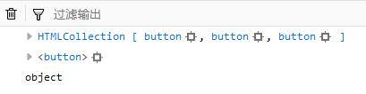
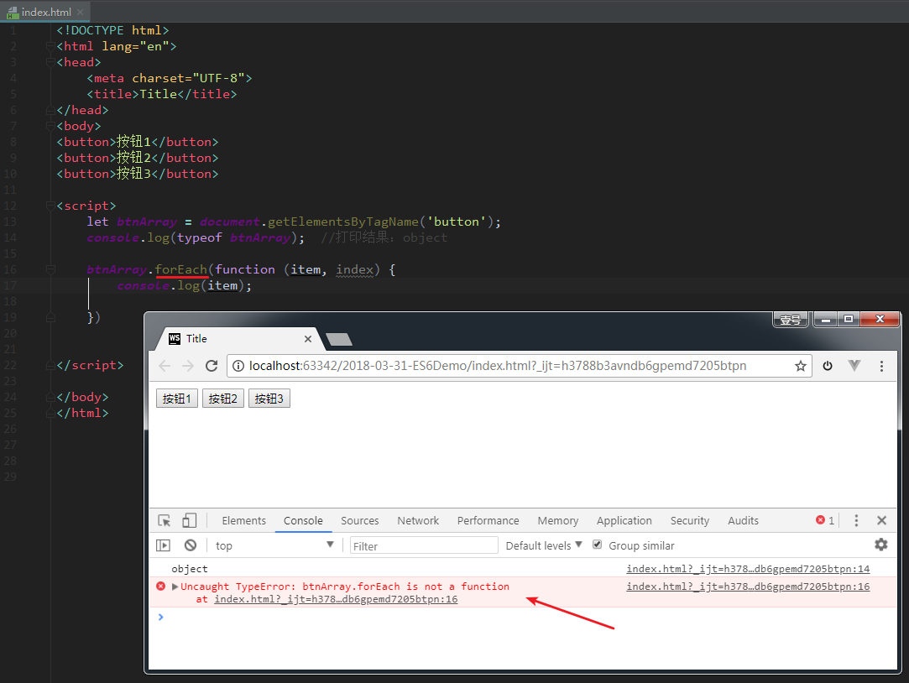

# 17-内置对象：Date

## 内置对象：Date

> Date 对象在实际开发中，使用得很频繁，且容易在细节地方出错，需要引起重视。

内置对象 Date 用来处理日期和时间。

**需要注意的是**：与 Math 对象不同，Date 对象是一个**构造函数** ，需要**先实例化**后才能使用。

## 创建Date对象

创建Date对象有两种写法：

- 写法一：如果Date()不写参数，就返回当前时间对象
- 写法二：如果Date()里面写参数，就返回括号里输入的时间对象

针对这两种写法，我们来具体讲一讲。

### 写法一：不传递参数时，则获取系统的当前时间对象

代码举例：

```javascript
var date1 = new Date();
console.log(date1);
console.log(typeof date1);
```

代码解释：不传递参数时，表示的是获取系统的当前时间对象。也可以理解成是：获取当前代码执行的时间。

打印结果：

```text
Wed Mar 26 2025 10:09:29 GMT+0800 (中国标准时间)
3.26.html:13 object
```

### 写法二：传递参数

传递参数时，表示获取指定时间的时间对象。参数中既可以传递字符串，也可以传递数字，也可以传递时间戳。

通过传参的这种写法，我们可以把时间字符串/时间数字/时间戳，按照指定的格式，转换为时间对象。

举例1：（参数是字符串）

```js
const date11 = new Date('2020/02/17 21:00:00');
console.log(date11); // Mon Feb 17 2020 21:00:00 GMT+0800 (中国标准时间)

const date12 = new Date('2020/04/19'); // 返回的就是四月
console.log(date12); // Sun Apr 19 2020 00:00:00 GMT+0800 (中国标准时间)

const date13 = new Date('2020-05-20');
console.log(date13); // Wed May 20 2020 08:00:00 GMT+0800 (中国标准时间)

const date14 = new Date('Wed Jan 27 2017 12:00:00 GMT+0800 (中国标准时间)');
console.log(date14); // Fri Jan 27 2017 12:00:00 GMT+0800 (中国标准时间)
```

举例2：（参数是多个数字）

```js
const date21 = new Date(2020, 2, 18); // 注意，第二个参数返回的是三月，不是二月
console.log(date21); // Wed Mar 18 2020 00:00:00 GMT+0800 (中国标准时间)

const date22 = new Date(2020, 3, 18, 22, 59, 58);
console.log(date22); // Sat Apr 18 2020 22:59:58 GMT+0800 (中国标准时间)

const params = [2020, 06, 12, 16, 20, 59];
const date23 = new Date(...params);
console.log(date23); // Sun Jul 12 2020 16:20:59 GMT+0800 (中国标准时间)
```

举例3：（参数是时间戳）

```js
const date31 = new Date(1591950413388);
console.log(date31); // Fri Jun 12 2020 16:26:53 GMT+0800 (中国标准时间)

// 先把时间对象转换成时间戳，然后把时间戳转换成时间对象
const timestamp = new Date().getTime();
const date32 = new Date(timestamp);
console.log(date32); // Fri Jun 12 2020 16:28:21 GMT+0800 (中国标准时间)
```

>参数 1591950413388 是一个以**毫秒**为单位的时间戳，表示从 **1970年1月1日 00:00:00 UTC**（Unix 纪元）开始经过的毫秒数。

## 日期的格式化

上一段内容里，我们获取到了 Date **对象**，但这个对象，打印出来的结果并不是特别直观。

如果我们需要获取日期的**指定部分**，就需要用到 Date对象自带的方法。

获取了日期指定的部分之后，我们就可以让日期按照指定的格式，进行展示（即日期的格式化）。比如说，我期望能以 `2020-02-02 19:30:59` 这种格式进行展示。

在这之前，我们先来看看 Date 对象有哪些方法。

### Date对象的方法

Date对象 有如下方法，可以获取日期和时间的**指定部分**：

| 方法名            | 含义              | 备注                 |
| ----------------- | ----------------- | -------------------- |
| getFullYear()     | 获取年份          |                      |
| getMonth()        | **获取月： 0-11** | 0代表一月            |
| getDate()         | **获取日：1-31**  | 获取的是几号         |
| getDay()          | **获取星期：0-6** | 0代表周日，1代表周一 |
| getHours()        | 获取小时：0-23    |                      |
| getMinutes()      | 获取分钟：0-59    |                      |
| getSeconds()      | 获取秒：0-59      |                      |
| getMilliseconds() | 获取毫秒          | 1s = 1000ms          |

**代码举例**：

```javascript
	// 我在执行这行代码时，当前时间为 2019年2月4日，周一，13:23:52
	var myDate = new Date();

	console.log(myDate); // 打印结果：Mon Feb 04 2019 13:23:52 GMT+0800 (中国标准时间)

	console.log(myDate.getFullYear()); // 打印结果：2019
	console.log(myDate.getMonth() + 1); // 打印结果：2
	console.log(myDate.getDate()); // 打印结果：4

	var dayArr  = ['星期日', '星期一', '星期二', '星期三', '星期四','星期五', '星期六'];
	console.log(myDate.getDay()); // 打印结果：1
	console.log(dayArr[myDate.getDay()]); // 打印结果：星期一

	console.log(myDate.getHours()); // 打印结果：13
	console.log(myDate.getMinutes()); // 打印结果：23
	console.log(myDate.getSeconds()); // 打印结果：52
	console.log(myDate.getMilliseconds()); // 打印结果：393

	console.log(myDate.getTime()); // 获取时间戳。打印结果：1549257832393
```

> getMonth()方法，它的计数是从 **0 开始的**（0 表示1月，1 表示2月，依此类推）。

获取了日期和时间的指定部分之后，我们把它们用字符串拼接起来，就可以按照自己想要的格式，来展示日期。

### 举例：年月日的格式化

代码举例

```js
console.log(formatDate());

/*
    方法：日期格式化。
    格式要求：今年是：2020年02月02日 08:57:09 星期日
*/
function formatDate() {
    var date = new Date();

    var year = date.getFullYear(); // 年
    var month = date.getMonth() + 1; // 月
    var day = date.getDate(); // 日

    var week = date.getDay(); // 星期几
    var weekArr = ['星期日', '星期一', '星期二', '星期三', '星期四', '星期五', '星期六'];

    var hour = date.getHours(); // 时
    hour = hour < 10 ? '0' + hour : hour; // 如果只有一位，则前面补零

    var minute = date.getMinutes(); // 分
    minute = minute < 10 ? '0' + minute : minute; // 如果只有一位，则前面补零

    var second = date.getSeconds(); // 秒
    second = second < 10 ? '0' + second : second; // 如果只有一位，则前面补零

    var result = '今天是：' + year + '年' + month + '月' + day + '日 ' + hour + ':' + minute + ':' + second + ' ' + weekArr[week];

    return result;
}
```

## 获取时间戳

### [#](https://web.qianguyihao.com/04-JavaScript基础/17-内置对象：Date.html#时间戳的定义和作用)时间戳的定义和作用

**时间戳**：指的是从格林威治标准时间的`1970年1月1日，0时0分0秒`到当前日期所花费的**毫秒数**（1秒 = 1000毫秒）。

计算机底层在保存时间时，使用的都是时间戳。时间戳的存在，就是为了**统一**时间的单位。

我们经常会利用时间戳来计算时间，因为它更精确。而且，在实战开发中，接口返回给前端的日期数据，都是以**时间戳**的形式。

我们再来看下面这样的代码：

```javascript
	var myDate = new Date("1970/01/01 0:0:0");

	console.log(myDate.getTime()); // 获取时间戳
```

打印结果（可能会让你感到惊讶）

```javascript
	-28800000
```

为啥打印结果是`-28800000`，而不是`0`呢？这是因为，我们的当前代码，是在中文环境下运行的，与英文时间会存在**8个小时的时差**（中文时间比英文时间早了八个小时）。如果代码是在英文环境下运行，打印结果就是`0`。

### getTime()：获取时间戳

`getTime()` 获取日期对象的**时间戳**（单位：毫秒）。这个方法在实战开发中，用得比较多。但还有比它更常用的写法，我们往下看。

### [#](https://web.qianguyihao.com/04-JavaScript基础/17-内置对象：Date.html#获取-date-对象的时间戳)获取 Date 对象的时间戳

代码演示：

```js
// 方式一：获取 Date 对象的时间戳（最常用的写法）
const timestamp1 = +new Date();
console.log(timestamp1); // 打印结果举例：1589448165370

// 方式二：获取 Date 对象的时间戳（较常用的写法）
const timestamp2 = new Date().getTime();
console.log(timestamp2); // 打印结果举例：1589448165370

// 方式三：获取 Date 对象的时间戳
const timestamp3 = new Date().valueOf();
console.log(timestamp3); // 打印结果举例：1589448165370

// 方式4：获取 Date 对象的时间戳
const timestamp4 = new Date() * 1;
console.log(timestamp4); // 打印结果举例：1589448165370

// 方式5：获取 Date 对象的时间戳
const timestamp5 = Number(new Date());
console.log(timestamp5); // 打印结果举例：1589448165370
```

>在 JavaScript 中，+ 是一个一元操作符（ unary plus），当它作用于一个对象时，会尝试将其转换为数值。

上面这五种写法都可以获取任意 Date 对象的时间戳，最常见的写法是**方式一**，其次是方式二。

### 获取当前时间的时间戳

如果我们要获取**当前时间**的时间戳，除了上面的几种方式之外，还有另一种方式。代码如下：

```js
// 方式六：获取当前时间的时间戳（很常用的写法）
console.log(Date.now()); // 打印结果举例：1589448165370
```

## Moment.js

Moment.js 是一个轻量级的JavaScript时间库，我们可以利用它很方便地进行时间操作，提升开发效率。

使用举例：

```html
<!DOCTYPE html>
<html lang="en">
    <head>
        <meta charset="UTF-8" />
        <meta name="viewport" content="width=device-width, initial-scale=1.0" />
        <title>Document</title>
    </head>
    <body>
        <script src="https://cdn.bootcdn.net/ajax/libs/moment.js/2.26.0/moment.min.js"></script>
        <script>
            // 按照指定的格式，格式化当前时间
            console.log(moment().format('YYYY-MM-DD HH:mm:ss')); // 打印结果举例：2020-06-12 16:38:38
            console.log(typeof moment().format('YYYY-MM-DD HH:mm:ss')); // 打印结果：string

            // 按照指定的格式，格式化指定的时间
            console.log(moment('2020/06/12 18:01:59').format('YYYY-MM-DD HH:mm:ss')); // 打印结果：2020-06-12 18:01:59

            // 按照指定的格式，获取七天后的时间
            console.log(moment().add(7, 'days').format('YYYY-MM-DD hh:mm:ss')); // 打印结果举例：2020-06-19 04:43:56
        </script>
    </body>
</html>
```

# 18-数组简介

## 数组简介

数组（Array）是属于**内置对象**，数组和普通对象的功能类似，都可以用来存储一些值。不同的是：

- 普通对象是使用字符串作为属性名，而数组是使用数字作为**索引**来操作元素。索引：从 0 开始的整数就是索引。

数组的存储性能比普通对象要好。在实际开发中我们经常使用数组存储一些数据（尤其是**列表数据**），使用频率非常高。


比如说，上面这个页面的列表数据，它的数据结构就是一个数组。

数组中的元素可以是任意的数据类型，可以是对象，可以是函数，也可以是数组。数组的元素中，如果存放的是数组，我们就称这种数组为二维数组。

接下来，我们讲一讲数组的基本操作。

## [#](https://web.qianguyihao.com/04-JavaScript基础/18-数组简介.html#创建数组对象)创建数组对象

### [#](https://web.qianguyihao.com/04-JavaScript基础/18-数组简介.html#方式一-使用字面量创建数组)方式一：使用字面量创建数组

举例：

```javascript
let arr1 = []; // 创建一个空的数组

let arr2 = [1, 2, 3]; // 创建带初始值的数组
```

方式一最简单，也用得最多

### 方式二：使用构造函数创建数组

语法：

```js
let arr = new Array(参数);

let arr = Array(参数);
```

如果**参数为空**，表示创建一个空数组；如果参数是**一个数值**，表示数组的长度；如果**有多个参数**，表示数组中的元素内容。

举个例子：

```javascript
// 方式一
let arr1 = [11, 12, 13];

// 方式二
let arr2 = new Array(); // 参数为空：创建空数组
let arr3 = new Array(4); // 参数为 size
let arr4 = new Array(15, 16, 17); // 参数为多个数值：创建一个带数据的数组

console.log(typeof arr1); // 打印结果：object

console.log('arr1 = ' + JSON.stringify(arr1));
console.log('arr2 = ' + JSON.stringify(arr2));
console.log('arr3 = ' + JSON.stringify(arr3));
console.log('arr4 = ' + JSON.stringify(arr4));
```

打印结果：

```javascript
object;

arr1 = [11, 12, 13];
arr2 = [];
arr3 = [null, null, null, null];
arr4 = [15, 16, 17];
```

从上方打印结果的第一行可以看出，数组的类型是属于**对象**。

### [#](https://web.qianguyihao.com/04-JavaScript基础/18-数组简介.html#数组中的元素的类型)数组中的元素的类型

数组中可以存放**任意类型**的数据，例如字符串、数字、布尔值、对象等。

比如：

```javascript
const arr = ['qianguyihao', 28, true, { name: 'qianguyihao' }];
```

我们甚至可以在数组里存放数组。比如：

```js
const arr2 = [
    [11, 12, 13],
    [21, 22, 23],
];
```

## 数组的基本操作

### 数组的索引

**索引** (下标) ：用来访问数组元素的序号，代表的是数组中的元素在数组中的位置（下标从 0 开始算起）。

数组可以通过索引来访问、修改对应的数组元素。我们继续看看。

### [#](https://web.qianguyihao.com/04-JavaScript基础/18-数组简介.html#向数组中添加元素)向数组中添加元素

语法：

```javascript
数组[索引] = 值;
```

代码举例：

```javascript
const arr = [];

// 向数组中添加元素
arr[0] = 10;
arr[1] = 20;
arr[2] = 30;
arr[3] = 40;
arr[5] = 50;

console.log(JSON.stringify(arr));
```

打印结果：

```text
[10,20,30,40,null,50]
```

### 获取数组中的元素

语法：

```javascript
数组[索引];
```

如果读取不存在的索引（比如元素没那么多），系统不会报错，而是返回 undefined。

代码举例：

```javascript
const arr = [21, 22, 23];

console.log(arr[0]); // 打印结果：21
console.log(arr[5]); // 打印结果：undefined
```

### 获取数组的长度

可以使用`length`属性来获取数组的长度(即“元素的个数”)。

数组的长度是元素个数，不要跟索引号混淆。

语法：

```javascript
数组的长度 = 数组名.length；
```

代码举例：

```javascript
const arr = [21, 22, 23];

console.log(arr.length); // 打印结果：3
```

补充：

对于连续的数组，使用 length 可以获取到数组的长度（元素的个数）；对于非连续的数组（即“稀疏数组”，本文稍后会讲），length 的值会大于元素的个数。因此，尽量不要创建非连续的数组。

### 修改数组的长度

可以通过修改length属性修改数组的长度。

- 如果修改的 length 大于原长度，则多出部分会空出来，置为 null。
- 如果修改的 length 小于原长度，则多出的元素会被删除，数组将从后面删除元素。
- （特例：伪数组 arguments 的长度可以修改，但是不能修改里面的元素，以后单独讲。）

代码举例：

```javascript
const arr1 = [11, 12, 13];
const arr2 = [21, 22, 23];

// 修改数组 arr1 的 length
arr1.length = 1;
console.log(JSON.stringify(arr1));

// 修改数组 arr2 的 length
arr2.length = 5;
console.log(JSON.stringify(arr2));
```

打印结果：

```javascript
[11]
[21, 22, 23, null, null]
```

### 遍历数组

**遍历**: 就是把数组中的每个元素从头到尾都访问一次。

最简单的做法是通过 for 循环，遍历数组中的每一项。举例：

```javascript
const arr = [10, 20, 30, 40, 50];

for (let i = 0; i < arr.length; i++) {
    console.log(arr[i]); // 打印出数组中的每一项
}
```

下一篇文章，会学习数组的各种方法，到时候，会有更多的做法去遍历数组。

## JS语言中，数组的注意点

> 和其他编程语言相比，JS语言中的数组比较灵活，有许多与众不同的地方。

1、如果访问数组中不存在的索引时，不会报错，会返回undefined。

2、当数组的存储空间不够时，数组会自动扩容。其它编程语言中数组的大小是固定的，不会自动扩容。

3、数组可以存储不同类型数据，其它编程语言中数组只能存储相同类型数据。

4、数组分配的存储空间不一定是连续的。其它语言数组分配的存储空间是连续的。

JS中的数组采用"哈希映射"的方式分配存储空间，我们可以通过索引找到对应空间。各大浏览器也对数组分配的存储空间进行了优化：如果存储的都是相同类型的数据，则会尽量分配连续的存储空间；如果存储的不是相同的数据类型，则不会分配连续的存储空间。

## 数组的解构赋值

解构赋值是ES6中新增的一种赋值方式。

ES5中，如果想把数组中的元素赋值给其他变量，是这样做的：

```js
const arr = [1, 2, [3,4]];
let a = arr[0]; // 1
let b = arr[1]; // 2
let c = arr[2]; // [3, 4]
```

上面这种写法比较啰嗦。通过ES6中的结构复制，我们可以像下面这样做。

1、数组解构赋值，代码举例：

```js
let [a, b, c] = [1, 2, [3, 4]];
console.log(a); // 1
console.log(b); // 2
console.log(c); // [3, 4]
```

注意点：

（1）等号左边的个数和格式，必须和右边的一模一样，才能完全解构。

（2）当然，左边的个数和右边的个数，可以不一样。

2、默认值。在赋值之前，我们可以给左边的变量指定**默认值**：

```js
let [a, b = 3, c = 4] = [1, 2];
console.log(a); // 1
console.log(b); // 2。默认值被覆盖。
console.log(c); // 4。继续保持默认值。
```

3、我们可以使用ES6中新增的**扩展运算符**打包剩余的数据。如果使用了扩展运算符, 那么扩展运算符只能写在最后。代码举例：

```js
let [a, ...b] = [1, 2, 3];
console.log(a); // 1
console.log(b); // [2, 3]
```

## 稀疏数组与密集数组

> 这个知识点，简单了解即可。

- 稀疏数组：索引不连续、数组长度大于元素个数的数组，可以简单理解为有 `empty`（有空隙）的数组。
- 密集数组：索引连续、数组长度等于元素个数的数组

# 19-数组的常见方法

## 数组的方法清单

### [#](https://web.qianguyihao.com/04-JavaScript基础/19-数组的常见方法.html#数组的类型相关)数组的类型相关

| 方法                             | 描述                                             | 备注             |
| :------------------------------- | :----------------------------------------------- | :--------------- |
| Array.isArray()                  | 判断是否为数组                                   |                  |
| toString()                       | 将数组转换为字符串                               | 不会改变原数组   |
| join()                           | 将数组转换为字符串，返回结果为**转换后的字符串** | 不会改变原数组   |
| 字符串的方法：split()            | 将字符串按照指定的分隔符，组装为数组             | 不会改变原字符串 |
|                                  |                                                  |                  |
| Array.from(arrayLike)            | 将**伪数组**转化为**真数组**                     |                  |
| Array.of(value1, value2, value3) | 创建数组：将**一系列值**转换成数组               |                  |

注意：

（1）获取数组的长度是用`length`属性，不是方法。关于 `length`属性，详见上一篇文章。

（2）`split()`是字符串的方法，不是数组的方法。

### 数组元素的添加和删除

| 方法      | 描述                                                         | 备注           |
| :-------- | :----------------------------------------------------------- | :------------- |
| push()    | 向数组的**最后面**插入一个或多个元素，返回结果为新数组的**长度** | 会改变原数组   |
| pop()     | 删除数组中的**最后一个**元素，返回结果为**被删除的元素**     | 会改变原数组   |
| unshift() | 在数组**最前面**插入一个或多个元素，返回结果为新数组的**长度** | 会改变原数组   |
| shift()   | 删除数组中的**第一个**元素，返回结果为**被删除的元素**       | 会改变原数组   |
|           |                                                              |                |
| splice()  | 从数组中**删除**指定的一个或多个元素，返回结果为**被删除元素组成的新数组** | 会改变原数组   |
| slice()   | 从数组中**提取**指定的一个或多个元素，返回结果为**新的数组** | 不会改变原数组 |
|           |                                                              |                |
| concat()  | 合并数组：连接两个或多个数组，返回结果为**新的数组**         | 不会改变原数组 |
| fill()    | 填充数组：用固定的值填充数组，返回结果为**新的数组**         | 会改变原数组   |

### 数组排序

| 方法      | 描述                                                    | 备注         |
| :-------- | :------------------------------------------------------ | :----------- |
| reverse() | 反转数组，返回结果为**反转后的数组**                    | 会改变原数组 |
| sort()    | 对数组的元素,默认按照**Unicode 编码**，从小到大进行排序 | 会改变原数组 |

### [#](https://web.qianguyihao.com/04-JavaScript基础/19-数组的常见方法.html#查找数组的元素)查找数组的元素

| 方法                  | 描述                                                         | 备注                                                     |
| :-------------------- | :----------------------------------------------------------- | :------------------------------------------------------- |
| indexOf(value)        | 从前往后索引，检索一个数组中是否含有指定的元素               |                                                          |
| lastIndexOf(value)    | 从后往前索引，检索一个数组中是否含有指定的元素               |                                                          |
| includes(item)        | 数组中是否包含指定的内容                                     |                                                          |
| find(function())      | 找出**第一个**满足「指定条件返回 true」的元素                |                                                          |
| findIndex(function()) | 找出**第一个**满足「指定条件返回 true」的元素的 index        |                                                          |
| every()               | 确保数组中的每个元素都满足「指定条件返回 true」，则停止遍历，此方法才返回 true | 全真才为真。要求每一项都返回 true，最终的结果才返回 true |
| some()                | 数组中只要有一个元素满足「指定条件返回 true」，则停止遍历，此方法就返回 true | 一真即真。只要有一项返回 true，最终的结果就返回 true     |

### [#](https://web.qianguyihao.com/04-JavaScript基础/19-数组的常见方法.html#遍历数组)遍历数组

| 方法      | 描述                                                         | 备注                                                         |
| :-------- | :----------------------------------------------------------- | :----------------------------------------------------------- |
| for 循环  | 最传统的方式遍历数组，这个大家都懂                           |                                                              |
| forEach() | 遍历数组，但需要兼容 IE8 以上                                | 不会改变原数组。forEach() 没有返回值。也就是说，它的返回值是 undefined |
| for of    | 遍历数组（ES6语法）                                          | 不会改变原数组。另外，不要使用 for in 遍历数组               |
| map()     | 对原数组中的每一项进行加工，将组成新的数组                   | 不会改变原数组                                               |
| filter()  | 过滤数组：返回结果是 true 的项，将组成新的数组，返回结果为**新的数组** | 不会改变原数组                                               |
| reduce    | 接收一个函数作为累加器，返回值是回调函数累计处理的结果       | 比较复杂                                                     |

## isArray()：判断是否为数组

语法：

```javascript
布尔值 = Array.isArray(被检测的数组);
```

以前，我们会通过 `A instanceof B`来判断 A 是否属于 B 类型。但是在数组里，这种 instanceof 方法已经用的不多了，因为有 isArray()方法。

## 数组转换为字符串

数组转为字符串，有三种方式。

### [#](https://web.qianguyihao.com/04-JavaScript基础/19-数组的常见方法.html#方式1、tostring)方式1、toString()

```javascript
// 语法
字符串 = 数组.toString();

// 举例
const result = [1, 3, 5].toString(); // 转换结果 result 为字符串 '1, 3, 5'
```

解释：把数组转换成字符串，每一项用英文逗号`,`分割。

备注：大多数的数据类型都可以使用`.toString()`方法，将其转换为字符串。

### 方式 2

```js
// 语法
字符串 = String(数组);

// 举例
const result = String([1, 3, 5]); // 转换结果 result 为字符串 '1, 3, 5'
```

### 方式 3：join()方法

```js
字符串 = 数组.join(','); // 将数组转为字符串，每一项用 英文逗号 分隔
```

关于 join()方法的详细介绍，详见下一段。

## join()

`join()`：将数组转换为字符串，返回结果为**转换后的字符串**（不会改变原来的数组）。

补充：`join()`方法可以指定一个**字符串**作为参数，这个参数是元素之间的**连接符**；如果不指定连接符，则默认使用英文逗号`,` 作为连接符，此时和 `toString()的`效果是一致的。

语法：

```javascript
新的字符串 = 原数组.join(参数); // 参数选填
```

代码举例：

```javascript
const arr = ['a', 'b', 'c'];

const result1 = arr.join(); // 这里没有指定连接符，所以默认使用 , 作为连接符

const result2 = arr.join('-'); // 使用指定的字符串作为连接符

console.log(typeof arr); // 打印结果：object
console.log(typeof result1); // 打印结果：string

console.log('arr =' + JSON.stringify(arr));
console.log('result1：' + result1);
console.log('result2：' + result2);
```

上方代码中，最后三行的打印结果是：

```bash
arr =["a","b","c"]
result1:a,b,c
result2:a-b-c
```

## split()

> 注意，`split()`是字符串的方法，不是数组的方法。

语法：

```javascript
新的数组 = str.split(分隔符);
```

解释：通过指定的分隔符，将一个字符串拆分成一个**数组**。不会改变原字符串。

备注：`split()`这个方法在实际开发中用得非常多。一般来说，从接口拿到的 json 数据中，经常会收到类似于`"q, i, a, n"`这样的字符串，前端需要将这个字符串拆分成`['q', 'i', 'a', 'n']`数组，这个时候`split()`方法就派上用场了。

## Array.from()：将伪数组转换为真数组

**语法**：

```javascript
array = Array.from(arrayLike);
```

**作用**：将**伪数组**或可遍历对象转换为**真数组**。

代码举例：

```js
const name = 'qianguyihao';
console.log(Array.from(name)); // 打印结果是数组：["q","i","a","n","g","u","y","i","h","a","o"]
```

### [#](https://web.qianguyihao.com/04-JavaScript基础/19-数组的常见方法.html#伪数组与真数组的区别)伪数组与真数组的区别

**伪数组**：包含 length 属性的对象或可迭代的对象。

另外，伪数组的原型链中没有 Array.prototype，而真数组的原型链中有 Array.prototype。因此伪数组没有数组的一般方法，比如 pop()、join() 等方法。

### 伪数组举例

```html
<body>
    <button>按钮1</button>
    <button>按钮2</button>
    <button>按钮3</button>

    <script>
        let btnArray = document.getElementsByTagName('button');
        console.log(btnArray);
        console.log(btnArray[0]);
    </script>
</body>
```

上面的布局中，有三个 button 标签，我们通过`getElementsByTagName`获取到的`btnArray`实际上是**伪数组**，并不是真实的数组：



既然`btnArray`是伪数组，它就不能使用数组的一般方法，否则会报错：



解决办法：采用`Array.from`方法将`btnArray`这个伪数组转换为真数组即可：

```javascript
Array.from(btnArray);
```

然后就可以使用数组的一般方法了：

## Array.of()：创建数组

**语法**：

```javascript
Array.of(value1, value2, value3);
```

**作用**：根据参数里的内容，创建数组。

**举例**：

```javascript
const arr = Array.of(1, 'abc', true);
console.log(arr); // 打印结果是数组：[1, "abc", true]
```

补充：`new Array()`和 `Array.of()`的区别在于：当参数只有一个时，前者表示数组的长度，后者表示数组中的内容。

## 数组元素的添加和删除

### [#](https://web.qianguyihao.com/04-JavaScript基础/19-数组的常见方法.html#push)push()

`push()`：向数组的**最后面**插入一个或多个元素，返回结果为新数组的**长度**。会改变原数组，因为原数组变成了新数组。

语法：

```javascript
新数组的长度 = 数组.push(元素);
新数组的长度 = 数组.push(元素1，元素2 ...);
```

代码举例：

```javascript
var arr = ['王一', '王二', '王三'];

var result1 = arr.push('王四'); // 末尾插入一个元素
var result2 = arr.push('王五', '王六'); // 末尾插入多个元素

console.log(JSON.stringify(arr)); // 打印结果：["王一","王二","王三","王四","王五","王六"]
console.log(result1); // 打印结果：4
console.log(result2); // 打印结果：6
```

### pop()

`pop()`：删除数组中的**最后一个**元素，返回结果为**被删除的元素**。

语法：

```javascript
被删除的元素 = 数组.pop();
```

代码举例：

```javascript
var arr = ['王一', '王二', '王三'];
var result1 = arr.pop();

console.log(JSON.stringify(arr)); // 打印结果：["王一","王二"]
console.log(result1); // 打印结果：王三
```

### unshift()

`unshift()`：在数组**最前面**插入一个或多个元素，返回结果为新数组的**长度**。会改变原数组，将原数组变成了新数组。插入元素后，其他元素的索引会依次调整。

语法：

```javascript
新数组的长度 = 数组.unshift(元素);
新数组的长度 = 数组.unshift(元素1，元素2...);
```

代码举例：

```javascript
var arr = ['王一', '王二', '王三'];

var result1 = arr.unshift('王四'); // 最前面插入一个元素
var result2 = arr.unshift('王五', '王六'); // 最前面插入多个元素

console.log(JSON.stringify(arr)); // 打印结果：["王五","王六","王四","王一","王二","王三"]
console.log(result1); // 打印结果：4
console.log(result2); // 打印结果：6
```

### shift()

`shift()`：删除数组中的**第一个**元素，返回结果为**被删除的元素**。

语法：

```javascript
被删除的元素 = 数组.shift();
```

```javascript
被删除的元素 = 数组.shift();
```

代码举例：

```javascript
var arr = ['王一', '王二', '王三'];

var result1 = arr.shift();

console.log(JSON.stringify(arr)); // 打印结果：["王二","王三"]
console.log(result1); // 打印结果：王一
```

### splice()

`splice()`：从数组中**删除**指定的一个或多个元素，返回结果为**被删除元素组成的新数组**（会改变原来的数组）。

备注：该方法会改变原数组，会将指定元素从原数组中删除；被删除的元素会封装到一个新的数组中返回。

语法：

```javascript
新数组 = 原数组.splice(起始索引index);

新数组 = 原数组.splice(起始索引index, 需要删除的个数);

新数组 = 原数组.splice(起始索引index, 需要删除的个数, 新的元素1, 新的元素2...);
```

上方语法中，第三个及之后的参数，表示：删除元素之后，向原数组中添加新的元素，这些元素将会自动插入到起始位置索引的前面。也可以理解成：删除了哪些元素，就在那些元素的所在位置补充新的内容。

`slice()`方法和`splice()`方法很容易搞混，请一定要注意区分。

举例 1：

```javascript
var arr1 = ['a', 'b', 'c', 'd', 'e', 'f'];
var result1 = arr1.splice(1); //从第index为1的位置开始，删除元素

console.log('arr1：' + JSON.stringify(arr1));
console.log('result1：' + JSON.stringify(result1));
```

打印结果：

```text
    arr1：["a"]
    result1：["b","c","d","e","f"]
```

举例 2：

```javascript
var arr2 = ['a', 'b', 'c', 'd', 'e', 'f'];
var result2 = arr2.splice(-2); //删除最后两个元素

console.log('arr2：' + JSON.stringify(arr2));
console.log('result2：' + JSON.stringify(result2));
```

打印结果：

```text
    arr2：["a","b","c","d"]
    result2：["e","f"]
```

举例 3：

```javascript
var arr3 = ['a', 'b', 'c', 'd', 'e', 'f'];
var result3 = arr3.splice(1, 3); //从第index为1的位置开始删除元素，一共删除三个元素

console.log('arr3：' + JSON.stringify(arr3));
console.log('result3：' + JSON.stringify(result3));
```

打印结果：

```text
    arr3：["a","e","f"]
    result3：["b","c","d"]
```

举例4：（删除指定元素，用得很多）

```js
const arr4 = ['a', 'b', 'c', 'd'];
arr4.splice(arr4.indexOf('c'), 1); // 删除数组中的'c'这个元素

console.log('arr4：' + JSON.stringify(arr4));
```

举例 5：（**第三个参数**的用法）

```javascript
var arr5 = ['a', 'b', 'c', 'd', 'e', 'f'];

//从第index为1的位置开始删除元素,一共删除三个元素。并且在index=1的位置前面追加两个元素"千古壹号"、"vae"（其实就是将index为1的元素改为"千古壹号"，index为2的元素改为"vae"）。
var result5 = arr5.splice(1, 3, '千古壹号', 'vae');

console.log('arr5：' + JSON.stringify(arr5));
console.log('result5：' + JSON.stringify(result5));
```

打印结果：

```javascript
arr5：["a","千古壹号","vae","e","f"]
result5：["b","c","d"]
```

我们再看个类似的例子：

```js
// 需求：针对数组 [a, b, c, d] 将索引为1的数据修改为e, 索引为2的修改为f

// 写法1：普通写法
const arr = [a, b, c ,d];
arr[1] = 'e';
arr[2] = 'f';

// 写法2：通过 splice() 实现
const arr = [a, b, c ,d];
arr.splice(1,2, 'e', 'f');
```

| 方法     | 修改原数组 | 返回值             | 用途               |
| -------- | ---------- | ------------------ | ------------------ |
| slice()  | 否         | 新数组（提取部分） | 提取子数组         |
| splice() | 是         | 新数组（删除部分） | 删除/插入/替换元素 |

### concat()

`concat()`：连接两个或多个数组，返回结果为**新的数组**。不会改变原数组。`concat()`方法的作用是**数组合并**。

语法：

```javascript
    新数组 = 数组1.concat(数组2, 数组3 ...);
```

举例：

```javascript
const arr1 = [1, 2, 3];
const arr2 = ['a', 'b', 'c'];
const arr3 = ['千古壹号', 'vae'];

const result1 = arr1.concat(arr2);

const result2 = arr2.concat(arr1, arr3);

console.log('arr1 =' + JSON.stringify(arr1));
console.log('arr2 =' + JSON.stringify(arr2));
console.log('arr3 =' + JSON.stringify(arr3));

console.log('result1 =' + JSON.stringify(result1));
console.log('result2 =' + JSON.stringify(result2));
```

打印结果：

```javascript
arr1 = [1, 2, 3];
arr2 = ['a', 'b', 'c'];
arr3 = ['千古壹号', 'vae'];

result1 = [1, 2, 3, 'a', 'b', 'c'];
result2 = ['a', 'b', 'c', 1, 2, 3, '千古壹号', 'vae'];
```

从打印结果中可以看到，原数组并没有被修改。

**数组合并的另一种方式**：

我们可以使用`...`这种扩展运算符，将两个数组进行合并。举例如下：

```js
const arr1 = [1, 2, 3];

const result = ['a', 'b', 'c', ...arr1];
console.log(JSON.stringify(result)); // 打印结果：["a","b","c",1,2,3]
```

备注：数组不能使用加号进行拼接。如果使用加号进行拼接会先转换成字符串再拼接。

### slice()

`slice()`：从数组中**提取**指定的一个或者多个元素，返回结果为**新的数组**（不会改变原来的数组）。

备注：该方法不会改变原数组，而是将截取到的元素封装到一个新数组中返回。

**语法**：

```javascript
新数组 = 原数组.slice(开始位置的索引);

新数组 = 原数组.slice(开始位置的索引, 结束位置的索引);  //注意：提取的元素中，包含开始位置，不包含结束位置
```

举例：

```javascript
const arr = ['a', 'b', 'c', 'd', 'e', 'f'];

const result1 = arr.slice(); // 不加参数时，则获取所有的元素。相当于数组的整体赋值
const result2 = arr.slice(2); // 从第二个值开始提取，直到末尾
const result3 = arr.slice(-2); // 提取最后两个元素
const result4 = arr.slice(2, 4); // 提取从第二个到第四个之间的元素（不包括第四个元素）
const result5 = arr.slice(4, 2); // 空

console.log('arr:' + JSON.stringify(arr));
console.log('result1:' + JSON.stringify(result1));
console.log('result2:' + JSON.stringify(result2));
console.log('result3:' + JSON.stringify(result3));
console.log('result4:' + JSON.stringify(result4));
console.log('result5:' + JSON.stringify(result5));
```

打印结果：

```javascript
arr: ['a', 'b', 'c', 'd', 'e', 'f'];
result1: ['a', 'b', 'c', 'd', 'e', 'f'];
result2: ['c', 'd', 'e', 'f'];
result3: ['e', 'f'];
result4: ['c', 'd'];
result5: [];
```

**补充**：

很多前端开发人员会用 slice()将伪数组，转化为真数组。写法如下：

```javascript
// 方式1
array = Array.prototype.slice.call(arrayLike);

// 方式2
array = [].slice.call(arrayLike);
```

### fill()

`fill()`：用一个固定值填充数组，返回结果为**新的数组**。会改变原数组。

语法：

```js
// 用一个固定值填充数组。数组里的每个元素都会被这个固定值填充
新数组 = 数组.fill(固定值);

// 从 startIndex 开始的数组元素，用固定值填充
新数组 = 数组.fill(固定值, startIndex);

// 从 startIndex 到 endIndex 之间的元素（包左不包右），用固定值填充
新数组 = 数组.fill(固定值, startIndex, endIndex);
```

举例1：

```js
// 创建一个长度为4的空数组，然后用 'f' 来填充这个空数组
console.log(Array(4).fill('f')); // ['f', 'f', 'f,' 'f']

// 将现有数组的每一个元素都进行填充
console.log(['a', 'b', 'c', 'd'].fill('f')); // ['f', 'f', 'f,' 'f']
```

举例2：

```js
// 指定位置进行填充
let arr1 = ['a', 'b', 'c', 'd'];
let arr2 = arr1.fill('f', 1, 3);

console.log(arr1); // ['a', 'f', 'f,' 'd']
console.log(arr2); // ['a', 'f', 'f,' 'd']
```

## reverse()

`reverse()`：反转数组，返回结果为**反转后的数组**（会改变原来的数组）。

语法：

```js
反转后的数组 = 数组.reverse();
```

举例：

```javascript
var arr = ['a', 'b', 'c', 'd', 'e', 'f'];

var result = arr.reverse(); // 将数组 arr 进行反转

console.log('arr =' + JSON.stringify(arr));
console.log('result =' + JSON.stringify(result));
```

打印结果：

```text
arr =["f","e","d","c","b","a"]
result =["f","e","d","c","b","a"]
```

## sort()

> sort()方法需要好好理解。

`sort()`：对数组的元素进行从小到大来排序（会改变原来的数组）。

### 无参时

如果在使用 sort() 方法时不带参，则默认按照元素的**Unicode 编码**，从小到大进行排序。

**举例 1**：（当数组中的元素为字符串时）

```javascript
let arr1 = ['e', 'b', 'd', 'a', 'f', 'c'];

let result = arr1.sort(); // 将数组 arr1 进行排序

console.log('arr1 =' + JSON.stringify(arr1));
console.log('result =' + JSON.stringify(result));
```

打印结果：

```text
    arr1 =["a","b","c","d","e","f"]
    result =["a","b","c","d","e","f"]
```

从上方的打印结果中，我们可以看到，sort 方法会改变原数组，而且方法的返回值也是同样的结果。

**举例 2**：（当数组中的元素为数字时）

```javascript
let arr2 = [5, 2, 11, 3, 4, 1];

let result = arr2.sort(); // 将数组 arr2 进行排序

console.log('arr2 =' + JSON.stringify(arr2));
console.log('result =' + JSON.stringify(result));
```

打印结果：

```text
arr2 =[1,11,2,3,4,5]
result =[1,11,2,3,4,5]
```

上方的打印结果中，你会发现，使用 sort() 排序后，数字`11`竟然在数字`2`的前面。这是为啥呢？因为上面讲到了，`sort()`方法是按照**Unicode 编码**进行排序的。

那如果我想让 arr2 里的数字，完全按照从小到大排序，怎么操作呢？继续往下看。

### 带参时，自定义排序规则

如果在 sort()方法中带参，我们就可以**自定义**排序规则。具体做法如下：

我们可以在 sort()的参数中添加一个回调函数，来指定排序规则。回调函数中需要定义两个形参，JS将会分别使用数组中的元素作为实参去调用回调函数。

JS根据回调函数的返回值来决定元素的排序：（重要）

- 如果返回一个大于 0 的值，则元素会交换位置
- **如果返回一个小于 0 的值，则不交换位置**。
- 如果返回一个等于 0 的值，则认为两个元素相等，则不交换位置

如果只是看上面的文字，可能不太好理解，我们来看看下面的例子，你肯定就能明白。

### [#](https://web.qianguyihao.com/04-JavaScript基础/19-数组的常见方法.html#举例-将数组中的数字按照从小到大排序)举例：将数组中的数字按照从小到大排序

**写法 1**：

```javascript
var arr = [5, 2, 11, 3, 4, 1];

// 自定义排序规则
var result = arr.sort(function (a, b) {
    if (a > b) {
        // 如果 a 大于 b，则交换 a 和 b 的位置
        return 1;
    } else if (a < b) {
        // 如果 a 小于 b，则位置不变
        return -1;
    } else {
        // 如果 a 等于 b，则位置不变
        return 0;
    }
});

console.log('arr =' + JSON.stringify(arr));
console.log('result =' + JSON.stringify(result));
```

打印结果：

```javascript
arr = [1, 2, 3, 4, 5, 11];
result = [1, 2, 3, 4, 5, 11];
```

上方代码的写法太啰嗦了，其实也可以简化为如下写法：

**写法 2**：（ES5写法）

```javascript
var arr = [5, 2, 11, 3, 4, 1];

// 自定义排序规则
var result = arr.sort(function (a, b) {
    return a - b; // 升序排列
    // return b - a; // 降序排列
});

console.log('arr =' + JSON.stringify(arr));
console.log('result =' + JSON.stringify(result));
```

打印结果不变。

上方代码还可以写成 ES6 的形式，也就是将 function 改为箭头函数，其写法如下。

**写法 3**：（ES6写法，箭头函数）

```js
let arr = [5, 2, 11, 3, 4, 1];

// 自定义排序规则
let result = arr.sort((a, b) => {
    return a - b; // 升序排列
});

console.log('arr =' + JSON.stringify(arr));
console.log('result =' + JSON.stringify(result));
```

上方代码，因为函数体内只有一句话，所以可以去掉 return 语句，继续简化为如下写法。

**写法 4**：（推荐写法）

```js
let arr = [5, 2, 11, 3, 4, 1];

// 自定义排序规则：升序排列
let result = arr.sort((a, b) => a - b);

console.log('arr =' + JSON.stringify(arr));
console.log('result =' + JSON.stringify(result));
```

## indexOf() 和 lastIndexOf()：获取元素的索引

**语法 1**：

```javascript
元素的索引 = 数组.indexOf(想要查询的元素);

元素的索引 = 数组.lastIndexOf(想要查询的元素);
```

备注：`indexOf()` 是从左往右查找元素的位置。同理，`lastIndexOf()`是从右往左寻找。

**解释**：可以检索一个数组中是否含有指定的元素。如果数组中含有该元素，则会返回其**第一次出现**的索引，并立即停止查找；如果没有找到指定的内容，则返回 -1。

这个方法的作用：

- 如果找到了指定的元素，就返回元素对应的位置。
- 如果没有找到指定的元素，就会返回-1。

**注意**：`indexOf()`在检索时，是严格类型约束，类似于`===`。

**举例** ：

```javascript
const arr = ['a', 'b', 'c', 'd', 'e', 'd', 'c'];

console.log(arr.indexOf('c')); //从前往后，找第一个"c"在哪个位置
console.log(arr.lastIndexOf('d')); //从后往前，找第一个"d"在哪个位置
```

打印结果：

```text
2
5
```

**语法 2**：

这个方法还可以指定第二个参数，用来指定查找的**起始位置**。语法如下：

```javascript
索引值 = 数组.indexOf(想要查找的元素, [查找的起始位置]);
```

这个方法的第二个参数非常巧妙，数据结构与算法的面试题中，时常出现。

举例：（两个参数时，需要特别注意）

```javascript
let arr = ['q', 'i', 'a', 'n', 'g', 'u', 'y', 'i', 'h', 'a', 'o'];
result = str.indexOf('a', 3); // 从下标为3的位置开始查找 'a'这个元素 【重要】

console.log(result); // 打印结果：9
```

上方代码中，`indexOf()`方法中携带了两个参数，具体解释请看注释。

## includes()

**语法**：

```js
布尔值 = arr.includes(想要查找的元素, [position]);
```

**解释**：判断一个数组中是否包含指定的元素。如果是，则会返回 true；否则返回 false。

参数中的 `position`：如果不指定，则默认为0；如果指定，则规定了检索的起始位置。

```js
const arr = [11, 12, 13, 14, 15];
console.log(arr.includes(12)); // 打印结果：true
console.log(arr.includes(20)); // 打印结果：false

console.log(arr.includes(11, 1)); // 打印结果：false
```

## find()和findIndex()

### [#](https://web.qianguyihao.com/04-JavaScript基础/19-数组的常见方法.html#find)find()

**语法**：

```javascript
const itemResult = arr.find((currentItem, currentIndex, currentArray) => {
    return true;
})
```

**作用**：找出**第一个**满足「指定条件返回 true」的元素，并立即停止查找；如果没找到，则返回 undefined。

备注：一旦找到符合条件的第一个元素，将不再继续往下遍历。

举例1：

```javascript
let arr = [2, 3, 2, 5, 7, 6];

let result = arr.find((item, index) => {
    return item > 4; //遍历数组arr，一旦发现有第一个元素大于4，就把这个元素返回
  	// 上面这行代码是简写方式；完整写法也可以这样写：ccif (item > 4) {return true}
});

console.log(result); //打印结果：5
```

## every()和some()

### [#](https://web.qianguyihao.com/04-JavaScript基础/19-数组的常见方法.html#every)every()

**语法**：

```javascript
const boolResult = arr.every((currentItem, currentIndex, currentArray) => {
    return true;
});
```

`every()`：对数组中每一项运行回调函数，如果都返回 true，every 就返回 true；如果有一项返回 false，则停止遍历，此方法返回 false。

注意：every()方法的返回值是 boolean 值，参数是回调函数。

**item**: 当前正在处理的数组元素（必须）。

**index**: 当前元素的索引（可选）。

**array**: 调用 every() 的原始数组（可选）。

举例：

```javascript
var arr1 = ['千古', '宿敌', '南山忆', '素颜'];
var bool1 = arr1.every(function (item, index, array) {
    if (item.length > 2) {
        return false;
    }
    return true;
});
console.log(bool1); //输出结果：false。只要有一个元素的长度是超过两个字符的，就返回false

var arr2 = ['千古', '宿敌', '南山', '素颜'];
var bool2 = arr2.every(function (item, index, array) {
    if (item.length > 2) {
        return false;
    }
    return true;
});
console.log(bool2); //输出结果：true。因为每个元素的长度都是两个字符。
```

### some()

`some()`：对数组中每一个元素运行回调函数，只要有一个元素返回 true，则停止遍历，此方法返回 true。

注意：some()方法的返回值是 boolean 值。

### [#](https://web.qianguyihao.com/04-JavaScript基础/19-数组的常见方法.html#every-和-some-的使用场景)every() 和 some() 的使用场景

every() 和 some() 这两个方法，初学者很容易搞混。要怎么区分呢？你可以这样记：

- every()：全部真，才为真。当你需要让数组中的每一个元素都满足指定条件时，那就使用 every()。
- some()：一个真，则为真，点到为止。数组中只要有一个元素满足指定条件时，就停止遍历。那就使用 some()。

## valueOf()：返回数组本身

```javascript
数组本身 = 数组.valueOf();
```

这个方法的意义不大。因为我们直接写数组对象的名字，就已经是数组本身了。

## [#](https://web.qianguyihao.com/04-JavaScript基础/19-数组的常见方法.html#遍历数组-2)遍历数组

### 概念

**遍历数组**：获取并操作数组中的每一个元素，然后得到想要的返回结果。在实战开发中使用得非常频繁。

语法：

```js
// ES5语法
数组/boolean/无 = 数组.forEach/map/filter(function (item, index, arr) {
   相关代码和返回值；
})

// ES6语法
数组/boolean/无 = 数组.forEach/map/filter((item, index, arr) => {
   相关代码和返回值；
})
```

有了上面这些方法（其实远不止这几个），就可以替代 for 循环了。

我们先来看看传统的for循环，然后依次介绍其他方法。

### [#](https://web.qianguyihao.com/04-JavaScript基础/19-数组的常见方法.html#for-循环遍历)for 循环遍历

举例：

```javascript
const arr = ['千古壹号', '许嵩', 'vae'];
for (let i = 0; i < arr.length; i++) {
    console.log(arr[i]); // arr[i]代表的是数组中的每一个元素i
}

console.log(JSON.stringify(arr));
```

```text
千古壹号
许嵩
vae

["千古壹号","许嵩","vae"]
```

## forEach()

> `forEach()` 这种遍历方法只支持 IE8 以上的浏览器。IE8 及以下的浏览器均不支持该方法。所以如果需要兼容 IE8，则不要使用 forEach，改为使用 for 循环来遍历即可。

### [#](https://web.qianguyihao.com/04-JavaScript基础/19-数组的常见方法.html#语法)语法

```js
// ES5语法
arr.forEach(function (currentItem, currentIndex, currentArray) {
	console.log(currentValue);
});

// ES6语法
arr.forEach((currentItem, currentIndex, currentArray) => {
	console.log(currentValue);
});
```

forEach()方法需要一个函数作为参数。这种函数，是由我们创建但是不由我们调用的，我们称为回调函数。

数组中有几个元素，该回调函数就会执行几次。

回调函数中传递三个参数：

- 参数1：当前正在遍历的元素
- 参数2：当前正在遍历的元素的索引
- 参数3：正在遍历的数组

注意，forEach() 没有返回值。也可以理解成：forEach() 的返回值是 undefined。如果你尝试 `newArray = currentArray.forEach()`这种方式来接收，是达不到效果的。

代码举例：

```javascript
let myArr = ['王一', '王二', '王三'];

myArr.forEach((currentItem, currentIndex, currentArray) => {
    console.log('item:' + currentItem);
    console.log('index:' + currentIndex);
    console.log('arr:' + JSON.stringify(currentArray));
    console.log('----------');
});
```

```javascript
item:王一
index:0
arr:["王一","王二","王三"]
----------
item:王二
index:1
arr:["王一","王二","王三"]
----------
item:王三
index:2
arr:["王一","王二","王三"]
----------
```

### forEach() 会不会改变原数组？

forEach() 会不会改变原数组？关于这个问题，大部分人会搞错。我们来看看下面的代码。

**1、数组的元素是基本数据类型**：（无法改变原数组）

```js
let numArr = [1, 2, 3];

numArr.forEach((item) => {
    item = item * 2;
});
console.log(JSON.stringify(numArr)); // 打印结果：[1, 2, 3]
```

上面这段代码，你可要看仔细了，打印结果是 `[1, 2, 3]`，不是 `[2, 4, 6]`。

**2、数组的元素是引用数据类型**：（直接修改整个元素对象时，无法改变原数组）

```js
let objArr = [
    { name: '千古壹号', age: 20 },
    { name: '许嵩', age: 30 },
];

objArr.forEach((item) => {
    item = {
        name: '邓紫棋',
        age: '29',
    };
});
console.log(JSON.stringify(objArr)); // 打印结果：[{"name":"千古壹号","age":20},{"name":"许嵩","age":30}]
```

**3、数组的元素是引用数据类型**：（修改元素对象里的某个属性时，可以改变原数组）

```js
let objArr = [
    { name: '千古壹号', age: 28 },
    { name: '许嵩', age: 30 },
];

objArr.forEach((item) => {
    item.name = '邓紫棋';
});
console.log(JSON.stringify(objArr)); // 打印结果：[{"name":"邓紫棋","age":28},{"name":"邓紫棋","age":
```

如果你需要通过 forEach 修改原数组，建议用 forEach 里面的参数 2 和参数 3 来做，具体请看下面的标准做法。

**4、forEach() 通过参数 2、参数 3 修改原数组**：（标准做法，一定要看）

```js
// 1、数组的元素是基本数据类型
let numArr = [1, 2, 3];

numArr.forEach((item, index, arr) => {
    arr[index] = arr[index] * 2;
});
console.log(JSON.stringify(numArr)); // 打印结果：[2,4,6]

// 2、数组的元素是引用数据类型时，直接修改对象
let objArr = [
    { name: '千古壹号', age: 28 },
    { name: '许嵩', age: 34 },
];

objArr.forEach((item, index, arr) => {
    arr[index] = {
        name: '小明',
        age: '10',
    };
});
console.log(JSON.stringify(objArr)); // 打印结果：[{"name":"小明","age":"10"},{"name":"小明","age":"10"}]

// 3、数组的元素是引用数据类型时，修改对象的某个属性
let objArr2 = [
    { name: '千古壹号', age: 28 },
    { name: '许嵩', age: 34 },
];

objArr2.forEach((item, index, arr) => {
    arr[index].name = '小明';
});
console.log(JSON.stringify(objArr2)); // 打印结果：[{"name":"小明","age":28},{"name":"小明","age":34}]
```

**总结**：

如果纯粹只是遍历数组，那么，可以用 forEach() 方法。但是，如果你想在遍历数组的同时，去改变数组里的元素内容，那么，最好是用 map() 方法来做，不要用 forEach()方法，避免出现一些低级错误。

## for of

ES6语法推出了 for of，可用于循环遍历数组。

### [#](https://web.qianguyihao.com/04-JavaScript基础/19-数组的常见方法.html#语法-2)语法

```js
for(let value of arr) {
	console.log(value);
}
```

### 不要使用 for in 遍历数组

for in 是专门用于遍历对象的。对象的属性是无序的（而数组的元素有顺序），for in循环就是专门用于遍历无序的对象。所以，不要用 for in 遍历数组。

for in语法：

```js
for (let key in obj) {
	console.log(key);
	console.log(obj.key);
}
```

## map()

### [#](https://web.qianguyihao.com/04-JavaScript基础/19-数组的常见方法.html#语法-3)语法

```js
// ES5语法
const newArr =  arr.map(function (currentItem, currentIndex, currentArray) {
    return newItem;
});

// ES6语法
const newArr = arr.map((currentItem, currentIndex, currentArray) => {
    return newItem;
});
```

解释：对数组中每一项运行回调函数，返回该函数的结果，组成的新数组（返回的是**加工后**的新数组）。不会改变原数组。

作用：对数组中的每一项进行加工。

**举例 1**：（拷贝的过程中改变数组元素的值）

有一个已知的数组 arr1，我要求让 arr1 中的每个元素的值都加 10，这里就可以用到 map 方法。代码举例：

```javascript
const arr1 = [1, 3, 6, 2, 5, 6];
const arr2 = arr1.map(item => {
  return item + 10; //让arr1中的每个元素加10
});
console.log(arr2); // 数组 arr2 的值：[11, 13, 16, 12, 15, 16]
```

**举例 2**：【重要案例，实际开发中经常用到】

将 A 数组中某个属性的值，存储到 B 数组中。代码举例：

```javascript
const arr1 = [
    { name: '千古壹号', age: '28' },
    { name: '许嵩', age: '32' },
];

// 举例2.1、将数组 arr1 中的 name 属性，存储到 数组 arr2 中
const arr2 = arr1.map(item => item.name);

// 上面的代码是简写的方式。完整写法是下面这样：（这两种写法是等价的）
const _arr2 = arr1.map(item => {
  return item.name;
});

// 举例2.2、将数组 arr1 中的 name、age这两个属性，改一下“键”的名字，存储到 arr3中
const arr3 = arr1.map(item => ({
    myName: item.name,
    myAge: item.age,
})); // 将数组 arr1 中的 name 属性，存储到 数组 arr2 中

console.log('arr1:' + JSON.stringify(arr1));
console.log('arr2:' + JSON.stringify(arr2));
console.log('arr3:' + JSON.stringify(arr3));
```

打印结果：

```text
arr1:[{"name":"千古壹号","age":"28"},{"name":"许嵩","age":"32"}]

arr2:["千古壹号","许嵩"]

arr3:[{"myName":"千古壹号","myAge":"28"},{"myName":"许嵩","myAge":"32"}]
```

map 的应用场景，主要就是以上两种。

### map() 方法会不会改变原数组？

答案：不一定。

举例：

```javascript
     const arr = [
        {
          name: "qianguyihao1",
          age: 22,
        },
        {
          name: "qianguyihao2",
          age: 23,
        },
      ];

      arr.map((item) => {
        item.name = "haha"; // 修改 item 里的某个属性
        return item;
      });
      console.log(JSON.stringify(arr));
```

打印结果：

```text
[{"name":"haha","age":22},{"name":"haha","age":23}]
```

总结：map方法如果是修改整个item的值，则不会改变原数组。但如果是修改 item 里面的某个属性，那就会改变原数组。

### map()在遍历时，如果不写 return 会怎么样

举例：

```js
const arr1 = [{ name: 'hehe1' }, { name: 'hehe2' }];

const arr2 = arr1.map(item => {
  item.name = 'haha';
});

console.log(arr1);
console.log(arr2);
```

代码执行完成后：

- arr1 的结果：[{ name: 'haha' }, { name: 'haha' }]
- arr2 的结果：[undefined, undefined]

由此可见，如果 map() 方法中没有 return 语句也是合法的，它会默认返回 `undefined`。

所以，针对对象数组，**如果你只是想修改对象中的某个属性值，而不想创建新数组的话，建议使用 forEach() 方法，而不是 map() 方法**。map() 方法的初衷是创建一个新数组。

## filter()

### 语法

```js
const newArr = arr.filter((currentItem, currentIndex, currentArray) => {
    return true;
});
```

解释：对数组中的**每一项**运行回调函数，该函数返回结果是 true 的项，将组成新的数组（返回值就是这个新数组）。不会改变原数组。

作用：对数组进行过滤。

### [#](https://web.qianguyihao.com/04-JavaScript基础/19-数组的常见方法.html#举例)举例

**举例 1**：找出数组 arr1 中大于 4 的元素，返回一个新的数组。代码如下：

```javascript
let arr1 = [1, 3, 6, 2, 5, 6];

let arr2 = arr1.filter(item => {
    if (item > 4) {
        return true; // 将arr1中大于4的元素返回，组成新的数组
    }
    return false;
});

console.log(JSON.stringify(arr1)); // 打印结果：[1,3,6,2,5,6]
console.log(JSON.stringify(arr2)); // 打印结果：[6,5,6]
```

上方代码更简洁的写法如下：

```javascript
let arr1 = [1, 3, 6, 2, 5, 6];

let arr2 = arr1.filter(item => item > 4); // 将arr1中大于4的元素返回，组成新的数组

console.log(JSON.stringify(arr1)); // 打印结果：[1,3,6,2,5,6]
console.log(JSON.stringify(arr2)); // 打印结果：[6,5,6]
```

## reduce()

### [#](https://web.qianguyihao.com/04-JavaScript基础/19-数组的常见方法.html#reduce-语法)reduce() 语法

> reduce 的发音：[rɪ'djuːs]。中文含义是减少，但这个方法跟“减少”没有任何关系。

reduce() 方法接收一个函数作为累加器，数组中的每个值（从左到右）开始缩减，最终计算为一个值。返回值是回调函数累计处理的结果。

**语法**：

```javascript
arr.reduce(function (previousValue, currentValue, currentIndex, arr) {}, initialValue);
```

参数解释：

- previousValue：必填，上一次调用回调函数时的返回值
- currentValue：必填，当前正在处理的数组元素
- currentIndex：选填，当前正在处理的数组元素下标
- arr：选填，调用 reduce()方法的数组
- initialValue：选填，可选的初始值（作为第一次调用回调函数时传给 previousValue 的值）

在以往的数组方法中，匿名的回调函数里是传三个参数：item、index、arr。但是在 reduce() 方法中，前面多传了一个参数`previousValue`，这个参数的意思是上一次调用回调函数时的返回值。第一次执行回调函数时，previousValue 没有值怎么办？可以用 initialValue 参数传给它。

备注：绝大多数人在一开始接触 reduce() 的时候会很懵逼，但是没关系，有事没事多看几遍，自然就掌握了。如果能熟练使用 reduce() 的用法，将能替代很多其他的数组方法，并逐渐走上进阶之路，领先于他人。

为了方便理解 reduce()，我们先来看看下面的简单代码，过渡一下：

```js
let arr1 = [1, 2, 3, 4, 5, 6];

arr1.reduce((prev, item) => {
    console.log(prev);
    console.log(item);
    console.log('------');
    return 88;
}, 0);
```

# 20-函数简介

## 函数的介绍

函数：就是一些功能或语句的**封装**。在需要的时候，通过**调用**的形式，执行这些语句。

补充：

- **函数也是一个对象**
- 使用`typeof`检查一个函数对象时，会返回 function

**函数的作用**：

- 一次定义，多次调用。将大量重复的语句抽取出来，写在函数里，以后需要这些语句时，可以直接调用函数，避免重复劳动。
- 简化代码，可读性更强，让编程模块化。高内聚、低耦合。

## 函数的定义/声明

我们使用`function`关键字定义函数，中文含义是“函数”、“功能”。可以使用如下方式进行定义。

### [#](https://web.qianguyihao.com/04-JavaScript基础/20-函数简介.html#方式一-函数声明-命名函数)方式一：函数声明（命名函数）

使用`函数声明`来创建一个函数。语法：

```javascript
function 函数名([形参1,形参2...形参N]){  // 备注：语法中的中括号，表示“可选”
	// 函数体语句
}
```

举例：

```javascript
function sum(a, b){
	return a+b;
}
```

### [#](https://web.qianguyihao.com/04-JavaScript基础/20-函数简介.html#方式二-函数表达式-匿名函数)方式二：函数表达式（匿名函数）

使用`函数表达式`来创建一个函数。语法：

```javascript
const 变量名  = function([形参1,形参2...形参N]){
	语句....
}
```

举例：

```javascript
const fun2 = function() {
	console.log("我是匿名函数中封装的代码");
};
```

解释如下：

- 上面的 fun2 是变量名，不是函数名。
- 函数表达式的声明方式跟声明变量类似，只不过变量里存的是值，而函数表达式里存的是函数。
- 函数表达式也可以传递参数。

从方式二的举例中可以看出：所谓的“函数表达式”，其实就是将匿名函数赋值给一个变量。因为，一个匿名函数终究还是要给它一个接收对象，进而方便地调用这个函数。

### 方式三：使用构造函数 new Function()

使用构造函数`new Function()`来创建一个对象。这种方式，用的少。

语法：

```javascript
const 变量名/函数名  = new Function('形参1', '形参2', '函数体');
```

注意，Function 里面的参数都必须是**字符串**格式。也就是说，形参也必须放在**字符串**里；函数体也是放在**字符串**里包裹起来，放在 Function 的最后一个参数的位置。

代码举例：

```javascript
const fun3 = new Function('a', 'b', 'console.log("我是函数内部的内容");  console.log(a + b);');

fun3(1, 2); // 调用函数
```

打印结果：

```text
我是函数内部的内容
3
```

## [#](https://web.qianguyihao.com/04-JavaScript基础/20-函数简介.html#函数的调用)函数的调用

调用函数即：执行函数体中的语句。函数必须要等到被调用时才执行。

函数调用的语法：

```javascript
// 写法1（最常用）
函数名();

// 写法2
函数名.call();
```

代码举例：

```javascript
function fn1() {
	console.log('我是函数体里面的内容1');
}

function fn2() {
	console.log('我是函数体里面的内容2');
}

fn1(); // 调用函数

fn2.call(); // 调用函数
```

### 方式2：通过对象的方法来调用

```javascript
var obj = {
	a: 'qianguyihao',
	fn2: function() {
		console.log('千古壹号，永不止步!');
	},
};

obj.fn2(); // 调用函数
```

如果一个函数是作为一个对象的属性保存，那么，我们称这个函数是这个对象的**方法**。

PS：关于函数和方法的区别，本文的后续内容里有讲到，可以往下面翻。

### [#](https://web.qianguyihao.com/04-JavaScript基础/20-函数简介.html#方式3-立即执行函数)方式3：立即执行函数

代码举例：

```javascript
(function() {
	console.log('我是立即执行函数');
})();
```

立即执行函数在定义后，会自动调用。

PS：关于立即执行函数，本文的后续内容里有讲到，可以往下面翻。

上面讲到的这三种方式，是用得最多的。接下来讲到的三种方式，暂时看不懂也没关系，可以等学完其他的知识点，再回过头来看。

### 方式4：通过构造函数来调用

代码举例：

```javascript
function Fun3() {
	console.log('千古壹号，永不止步~');
}

new Fun3();
```

这种方式用得不多。

### 方式5：绑定事件函数

代码举例：

```html
<!DOCTYPE html>
<html lang="en">
    <head>
        <meta charset="UTF-8" />
        <meta name="viewport" content="width=device-width, initial-scale=1.0" />
        <title>Document</title>
    </head>
    <body>
        <div id="btn">我是按钮，请点击我</div>

        <script>
            var btn = document.getElementById('btn');
            //2.绑定事件
            btn.onclick = function() {
                console.log('点击按钮后，要做的事情');
            };
        </script>
    </body>
</html>
```

### 方式6：定时器函数

代码举例：（每间隔一秒，将 数字 加1）

```javascript
    let num = 1;
   setInterval(function () {
       num ++;
       console.log(num);
   }, 1000);
```

## 函数的参数：形参和实参

### 定义

函数的参数包括形参和实参。形参是函数内的一些**待定值**。在调用函数时，需传入这些参数的具体值（即实参）。

可以在函数的`()`中指定一个或多个参数，也可以不指定参数。多个参数之间用英文逗号隔开。

举例：

```js
// a, b 是形参，表示待定值
function add(a, b) {
const sum = a + b;
console.log(sum);
}

// 1, 2 是实参，表示传入的具体值。调用函数时，传入实参
add(1, 2);
```

**形参：**

- 概念：形式上的参数。定义函数时传递的待定值（此时并不知道是什么值）。
- 声明形参相当于在函数内部声明了变量，但并不赋值。也可以说，**形参的默认值是 undefined**。

**实参**：

- 概念：实际上的参数。调用函数时传递的具体值。实参将传递给函数中对应的形参。

### 形参和实参的个数

实际参数和形式参数的个数，可以不同。调用函数时，解析器不会检查实参的数量。

- 如果实参个数 > 形参个数，则末尾的实参是多余的，不会被赋值，因为没有形参能接收它。
- 如果实参个数 < 形参个数，则末尾的形参是多余的，值是 undefined，因为它没有接收到实参。（undefined参与运算时，表达式的运算结果为NaN）

代码举例：

```javascript
	function sum(a, b) {
		console.log(a + b);
	}

	sum(1, 2);
	sum(1, 2, 3);
	sum(1);
```

打印结果：

```text
3
3
NaN
```

## 函数的返回值

### [#](https://web.qianguyihao.com/04-JavaScript基础/20-函数简介.html#return-关键字)return 关键字

函数体内可以没有返回值，也可以根据需要加返回值。语法格式：`return 函数的返回值`。

举例：

```javascript
console.log(sum(3, 4)); // 将函数的返回值打印出来

//函数：求和
function sum(a, b) {
	return a + b;
}
```

（3）如果return语句后不跟任何值，就相当于返回一个undefined

（4）如果函数中不写return，则也会返回undefined

### break、continue、return 的区别

- break ：结束当前的循环体（如 for、while）
- continue ：跳出本次循环，继续执行下次循环（如 for、while）
- return ：1、退出循环。2、返回 return 语句中的值，同时结束当前的函数体内的代码，退出当前函数。

## 函数名、函数体和函数加载问题（重要，请记住）

我们要记住：**函数名 == 整个函数**。举例：

```javascript
console.log(fn) == console.log(function fn(){alert(1)});

//定义fn方法
function fn(){
	alert(1)}
```

我们知道，当我们在调用一个函数时，通常使用`函数()`这种格式；可如果，我们是直接使用`函数`这种格式，它的作用相当于整个函数。

**函数的加载问题**：JS加载的时候，只加载函数名，不加载函数体。所以如果想使用内部的成员变量，需要调用函数。

- `fn()`：调用函数。调用之后，还获取了函数的返回值。
- `fn`：函数对象。相当于直接获取了整个函数对象。

| 写法 | 含义         | 获取的内容   | 是否执行函数体 |
| ---- | ------------ | ------------ | -------------- |
| fn() | 调用函数     | 函数的返回值 | 是             |
| fn   | 引用函数对象 | 函数本身     | 否             |

## [#](https://web.qianguyihao.com/04-JavaScript基础/20-函数简介.html#方法)方法

函数也可以成为对象的属性。**如果一个函数是作为一个对象的属性保存，那么，我们称这个函数是这个对象的方法**。

调用这个函数就说调用对象的方法（method）。函数和方法，有什么本质的区别吗？它只是名称上的区别，并没有其他的区别。

函数举例：

```javascript
	// 调用函数
	fn();
```

方法举例：

```javascript
	// 调用方法
	obj.fn();
```

我们可以这样说，如果直接是`fn()`，那就说明是函数调用。如果是`XX.fn()`的这种形式，那就说明是**方法**调用。