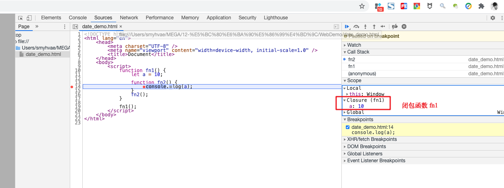

# 25-this指向

## 执行期上下文

当**函数执行**时（准确来说，是在函数发生预编译的前一刻），会创建一个执行期上下文的内部对象。一个执行期上下文定义了一个函数执行时的环境。

每调用一次函数，就会创建一个新的上下文对象，他们之间是相互独立且独一无二的。当函数执行完毕，它所产生的执行期上下文会被销毁。

参考链接：[https://www.cnblogs.com/chenyingjie1207/p/9966036.html(opens new window)](https://www.cnblogs.com/chenyingjie1207/p/9966036.html)

- **执行期上下文（Execution Context）**：函数执行时的环境，包含变量对象、作用域链和 this。
- **创建时机**：函数调用时，在预编译（Precompilation）前一刻生成一个新的上下文对象。
- **独立性**：每次函数调用生成一个独立且唯一的上下文，互不干扰。
- **销毁**：函数执行完毕后，其上下文被销毁，释放内存（除非被闭包引用）。

简而言之：函数调用 → 新上下文创建 → 执行 → 销毁，循环往复。

## [#](https://web.qianguyihao.com/04-JavaScript基础/25-this指向.html#this-指向)this 指向

解析器在调用函数每次都会向函数内部传递进一个隐含的参数，这个隐含的参数就是 this，this 指向的是一个对象，这个对象我们称为函数执行的 上下文对象。

### ES5 函数内 this 的指向【非常重要】

我们在《JavaScript 基础/函数.md》这篇文章讲过，函数的调用有**六种**形式。

在ES5语法中，根据函数的调用方式的不同，this 会指向不同的对象：

1、以函数的形式（包括普通函数、定时器函数、立即执行函数）调用时，this 的指向永远都是 window。比如`fun();`相当于`window.fun();`

2、以方法的形式调用时，this 指向调用方法的那个对象

3、以构造函数的形式调用时，this 指向实例对象

4、以事件绑定函数的形式调用时，this 指向**绑定事件的对象**

5、使用 call 和 apply 调用时，this 指向指定的那个对象

**第 1 条的举例**：

```javascript
function fun() {
    console.log(this);
    console.log(this.name);
}

var obj1 = {
    name: 'smyh',
    sayName: fun,
};

var obj2 = {
    name: 'vae',
    sayName: fun,
};

var name = '全局的name属性';

//以函数形式调用，this是window
fun(); //可以理解成 window.fun()
```

打印结果：

```text
    Window
    全局的name属性
```

上面的举例可以看出，this 指向的是 window 对象，所以 this.name 指的是全局的 name。

**第 2 条的举例**：

```javascript
function fun() {
    console.log(this);
    console.log(this.name);
}

var obj1 = {
    name: 'smyh',
    sayName: fun,
};

var obj2 = {
    name: 'vae',
    sayName: fun,
};

var name = '全局的name属性';

//以方法的形式调用，this是调用方法的对象
obj2.sayName();
```

打印结果：

```text
    Object
    vae
```

上面的举例可以看出，this 指向的是 对象 obj2 ，所以 this.name 指的是 obj2.name。

### ES6 箭头函数中 this 的指向

ES6 中的箭头函数并不使用上面的准则，而是会继承外层函数调用的 this 绑定（无论 this 绑定到什么）。

### [#](https://web.qianguyihao.com/04-JavaScript基础/25-this指向.html#改变函数内部的-this-指向)改变函数内部的 this 指向

JS 专门为我们提供了一些方法来改变函数内部的 this 指向。常见的方法有 call()、apply()、bind() 方法。继续往下看。

## call()

### [#](https://web.qianguyihao.com/04-JavaScript基础/25-this指向.html#call-方法的作用)call() 方法的作用

call() 方法的作用：可以**调用**一个函数，与此同时，它还可以改变这个函数内部的 this 指向。

call() 方法的另一个应用：**可以实现继承**。之所以能实现继承，其实是利用了上面的作用。

语法：

```js
fn1.call(想要将this指向哪里, 函数实参1, 函数实参2);
```

备注：第一个参数中，如果不需要改变 this 指向，则传 null。

### call() 方法举例

**举例 1**、通过 call() 调用函数：

```js
const obj1 = {
    nickName: 'qianguyihao',
    age: 28,
};
function fn1() {
    console.log(this);
    console.log(this.nickName);
}
fn1.call(this); // this的指向并没有被改变，此时相当于 fn1();
```

上方代码的打印结果：

```text
window
undefined
```

上面的代码，跟普通的函数调用 `fn1()` 没有区别。

**举例 2**、通过 call() 改变 this 指向：

```js
var obj1 = {
    nickName: 'qianguyihao',
    age: 28,
};

function fn1(a, b) {
    console.log(this);
    console.log(this.nickName);
    console.log(a + b);
}

fn1.call(obj1, 2, 4); // 先将 this 指向 obj1，然后执行 fn1() 函数
```

>在这段代码中，fn1.call(obj1, 2, 4) 的意思是：
>
>- 把 fn1 函数的 this 指向 obj1。
>- 然后马上执行 fn1，并把 2 和 4 作为参数传进去。

上方代码的打印结果：

```text
obj1
qianguyihao
6
```

**举例 3**、通过 call() 实现继承：

```js
// 给 Father 增加 name 和 age 属性
function Father(myName, myAge) {
    this.name = myName;
    this.age = myAge;
}

function Son(myName, myAge) {
    // 【下面这一行，重要代码】
    // 通过这一步，将 father 里面的 this 修改为 Son 里面的 this；另外，给 Son 加上相应的参数，让 Son 自动拥有 Father 里的属性。最终实现继承
    Father.call(this, myName, myAge);
}

const son1 = new Son('千古壹号', 28);
console.log(JSON.stringify(son1));
```

上方代码中，通过 call() 方法，让 Son 继承了 Father 里面的 name 和 age 属性。

打印结果：

```text
{"myName":"千古壹号","myAge":28}
```

## apply() 方法

### [#](https://web.qianguyihao.com/04-JavaScript基础/25-this指向.html#apply-方法的作用)apply() 方法的作用

apply() 方法的作用：可以**调用**一个函数，与此同时，它还可以改变这个函数内部的 this 指向。这一点，和 call()类似。

apply() 方法的应用： 由于 apply()需要传递**数组**，所以它有一些巧妙应用，稍后看接下来的应用举例就知道了。

语法：

```js
fn1.apply(想要将this指向哪里, [函数实参1, 函数实参2]);
```

备注：第一个参数中，如果不需要改变 this 指向，则传 null。

到这里可以看出， call() 和 apply() 方法的作用是相同的。唯一的区别在于，apply() 里面传入的**实参，必须是数组（或者伪数组）**。

### [#](https://web.qianguyihao.com/04-JavaScript基础/25-this指向.html#apply-方法举例)apply() 方法举例

**举例**、通过 apply() 改变 this 指向：

```js
var obj1 = {
    nickName: 'qianguyihao',
    age: 28,
};

function fn1(a) {
    console.log(this);
    console.log(this.nickName);
    console.log(a);
}

fn1.apply(obj1, ['hello']); // 先将 this 指向 obj1，然后执行 fn1() 函数
```

注意，上方代码中，apply() 里面传实参时，需要以数组的形式。即便是传一个实参，也需要传数组。

打印结果：

```text
obj1
qianguyihao
hello
```

### apply() 方法的巧妙应用：求数组的最大值

我们知道，如果想要求数组中元素的最大值，数组本身是没有自带方法的。那怎么办呢？

虽然数组里没有获取最大值的方法，但是数值里有 `Math.max(数字1，数字2，数字3)` 方法，可以获取**多个数值中的最大值**。 另外，由于 apply() 方法在传递实参时，传的刚好是**数组**，所以我们可以 通过 Math.max() 和 apply() 曲线救国。

**举例**：求数组中多个元素的最大值：

```js
const arr1 = [3, 7, 10, 8];

// 下面这一行代码的目的，无需改变 this 指向，所以：第一个参数填 null，或者填 Math，或者填 this 都可以。严格模式中，不让填null。
const maxValue = Math.max.apply(Math, arr1); // 求数组 arr1 中元素的最大值
console.log(maxValue);

const minValue = Math.min.apply(Math, arr1); // 求数组 arr1 中元素的最小值
console.log(minValue);
```

打印结果：

```text
10
3
```

##  bind() 方法

### bind() 方法的作用

bind() 方法**不会调用函数**，但是可以改变函数内部的 this 指向。

把call()、apply()、bind()这三个方法做一下对比，你会发现：实际开发中， bind() 方法使用得最为频繁。如果有些函数，我们不需要立即调用，但是又想改变这个函数内部的this指向，此时用 bind() 是最为合适的。

语法：

```js
新函数 = fn1.bind(想要将this指向哪里, 函数实参1, 函数实参2);
```

参数：

- 第一个参数：在 fn1 函数运行时，指定 fn1 函数的this 指向。如果不需要改变 this 指向，则传 null。
- 其他参数：fn1 函数的实参。

解释：它不会调用 fn1 函数，但会返回 由指定this 和指定实参的**原函数拷贝**。可以看出， bind() 方法是有返回值的。

# 26-闭包

## 闭包的引入

我们知道，变量根据作用域的不同分为两种：全局变量和局部变量。

- 函数内部可以访问全局变量和局部变量。
- 函数外部只能访问全局变量，不能访问局部变量。
- 当函数执行完毕，本作用域内的局部变量会销毁。

比如下面这样的代码：

```js
function foo() {
    let a = 1;
}

foo();
console.log(a); // 打印报错：Uncaught ReferenceError: a is not defined
```

上方代码中，由于变量 `a` 是函数内的局部变量，所以外部无法访问。

但是，在有些场景下，我们就是想要在函数外部访问**函数内部作用域的局部变量**，那要怎么办呢？这就引入了闭包的概念。

## [#](https://web.qianguyihao.com/04-JavaScript基础/26-闭包.html#什么是闭包)什么是闭包

### 闭包（closure）的概念

**闭包**：如果**外部作用域**有权访问另外一个**函数内部**的**局部变量**时，那就产生了闭包。这个内部函数称之为闭包函数。注意，这里强调的是访问**局部变量**。

闭包代码举例：

```js
function fun1() {
  const a = 10;
  return function fun2() {
    console.log(a);
  };
}
fun1();
// 调用外部函数，就能得到内部函数，并用 变量 result 接收
const result = fun1();
// 在 fun1函数的外部，执行了内部函数 fun2，并访问到了 fun2的内部变量a
result(); // 10
```

上方代码中，外部作用域（即全局作用域） 访问了函数 fun1 中的局部变量，那么，在 fun1 中就产生了闭包，函数 fun1是闭包函数。

全局作用域中，并没有定义变量a。正常情况下作为函数内的局部变量 a，无法被外部访问到。但是通过闭包，我们最后还是可以在全局作用域中拿到局部变量 a 的值。

注意，闭包函数是fun1，不是fun2。fun2在这里的作用是让全局作用域访问到变量a，fun2只是一个桥梁。

###  闭包的生命周期

1. 产生：内部函数fn1被声明时（即被创建时，不是被调用时）就产生了。
2. 死亡：嵌套的内部函数成为垃圾对象时。（比如fun1 = null，就可以让 fun1 成为垃圾对象）

### 在 chrome 浏览器控制台中，调试闭包

上面的代码中，要怎么验证，确实产生了闭包呢？我们可以在 chrome 浏览器的控制台中设置断点，当代码执行到 `console.log(a)`这一行的时候，如下图所示：



上图中， Local 指的是局部作用域，Global 指的是全局作用域；而 Closure 则是**闭包**，fn1 是一个闭包函数。

## 闭包的表现形式

### [#](https://web.qianguyihao.com/04-JavaScript基础/26-闭包.html#形式1-将一个函数作为另一个函数的返回值)形式1：将一个函数作为另一个函数的返回值

```javascript
    function fn1() {
      var a = 2

      function fn2() {
        a++
        console.log(a)
      }
      return fn2
    }

    var f = fn1();   //执行外部函数fn1，返回的是内部函数fn2
    f() // 3       //执行fn2
    f() // 4       //再次执行fn2
```

当f()第二次执行的时候，a加1了，也就说明了：闭包里的数据没有消失，而是保存在了内存中。如果没有闭包，代码执行完倒数第三行后，变量a就消失了。

上面的代码中，虽然调用了内部函数两次，但是，闭包对象只创建了一个。

也就是说，要看闭包对象创建了几个，就看：**外部函数执行了几次**（与内部函数执行几次无关）。

### 形式2：将函数作为实参传递给另一个函数调用

在定时器、事件监听、Ajax 请求、Web Workers 或者任何异步中，只要使用了回调函数，实际上就是在使用闭包。

```javascript
    function showDelay(msg, time) {
      setTimeout(function() {  //这个function是闭包，因为是嵌套的子函数，而且引用了外部函数的变量msg
        alert(msg)
      }, time)
    }
    showDelay('qianguyihao', 2000)
```

上面的代码中，闭包是里面的function，因为它是嵌套的子函数，而且引用了外部函数的变量msg。

## 闭包的作用

- 作用1：延长局部变量的生命周期。
- 作用2：让函数外部可以操作（读写）函数内部的数据（变量/函数）。

代码演示

```javascript
function fun1() {
  let a = 2

  function fun2() {
    a++
    console.log(a)
  }
  return fun2;
}

const foo = fun1();   //执行外部函数fn1，返回的是内部函数fn2
foo() // 3       //执行fun2
foo() // 4       //再次执行fun2
```

上方代码中，foo 代表的就是整个 fun2 函数。当执行了 `foo()` 语句之后，也就执行了fun2()函数，fun1() 函数内就产生了闭包。

**作用1分析**：

一般来说，在 fn1() 函数执行完毕后，它里面的变量 a 会立即销毁。但此时由于产生了闭包，所以 **fun1 函数中的变量 a 不会立即销毁，仍然保留在内存中，因为 fn2 函数还要继续调用变量 a**。只有等所有函数把变量 a 调用完了，变量 a 才会销毁。

**作用2分析：**

在执行 `foo()`语句之后，竟然能够打印出 `3`，这就完美通过闭包实现了：全局作用域成功访问到了局部作用域中的变量 a。

达到的效果是：**外界看不到变量a，但可以操作a**。当然，如果你真想看到a，可以在fun2中将a返回即可。

## 闭包的应用场景

### [#](https://web.qianguyihao.com/04-JavaScript基础/26-闭包.html#场景1-高阶函数)场景1：高阶函数

题目：不同的班级有不同成绩检测标准。比如：A班的合格线是60分，B 班的合格线是70分。已知某个人班级和分数，请用闭包函数判断他的成绩是否合格。

思路：创建成绩检测函数 checkStandard(n)，检查成绩 n 是否合格，函数返回布尔值。

代码实现：

```js
// 高阶函数：判断学生的分数是否合格。形参 standardTemp 为标准线
function createCheckTemp(standardTemp) {
  // 形参 n 表示具体学生的分数
  function checkTemp(n) {
    if (n >= standardTemp) {
      alert('成绩合格');
    } else {
      alert('成绩不合格');
    }
  }
  return checkTemp;
}

// 创建一个 checkStandard_A 函数，它以60分为合格线
var checkStandard_A = createCheckTemp(60);
// 再创建一个 checkStandard_B 函数，它以70分为合格线
var checkStandard_B = createCheckTemp(70);

// 调用函数
checkStandard_A(65); // 成绩合格
checkStandard_B(65); // 成绩不合格
```

对于A班来说，它的闭包函数是createCheckTemp()，闭包范围是 checkTemp()函数和参数`standardTemp = 60`。对于B班来说，它的闭包函数是全新的createCheckTemp()，闭包范围是全新的checkTemp()函数和全新的参数`standardTemp = 70`。

因为有闭包存在，所以，并不会因为 createCheckTemp() 执行完毕后就销毁 standardTemp 的值；且A班和B班的standardTemp参数不会混淆。

备注：关于“高阶函数”的更多解释，我们在以后的内容中讲解。

### 场景2：封装JS模块

闭包的第二个使用场景是：定义具有特定功能的JS模块，将所有的数据和功能都封装在一个函数内部，只向外暴露指定的对象或方法。模块的调用者，只能调用模块暴露的对象或方法来实现对应的功能。

比如有这样一个需求：定义一个私有变量a，要求a只能被进行指定操作（加减），不能进行其他操作（乘除）。在 Java、C++ 等语言中，有私有属性的概念，但在JS中只能通过闭包模拟。

我们来看看下面的代码，如何通过闭包封装JS模块。

写法1：

（1）myModule.js：（定义一个模块，向外暴露多个方法，供外界调用）

```javascript
function myModule() {
    //私有数据
    var msg = 'Qinguyihao Haha'

    //操作私有数据的函数
    function doSomething() {
        console.log('doSomething() ' + msg.toUpperCase()); //字符串大写
    }

    function doOtherthing() {
        console.log('doOtherthing() ' + msg.toLowerCase()) //字符串小写
    }

    //通过【对象字面量】的形式进行包裹，向外暴露多个函数
    return {
        doSomething1: doSomething,
        doOtherthing2: doOtherthing
    }
}
```

上方代码中，外界只能通过doSomething1和doOtherthing2来操作里面的数据，但不让外界看到里面的具体实现。

（2）index.html:

```html
<!DOCTYPE html>
<html lang="en">
<head>
    <meta charset="UTF-8">
    <title>闭包的应用-自定义JS模块</title>
</head>
<body>
<!--
闭包应用举例: 定义JS模块
  * 具有特定功能的js文件
  * 将所有的数据和功能都封装在一个函数内部(私有的)
  * 【重要】只向外暴露一个包含n个方法的对象或方法
  * 模块的使用者, 只需要调用模块暴露的对象或者方法来实现对应的功能
-->
<script type="text/javascript" src="myModule.js"></script>
<script type="text/javascript">
    var module = myModule();
    module.doSomething1();
    module.doOtherthing2();
</script>
</body>
</html>
```

写法2：

同样是实现上面的功能，我们还采取另外一种写法，写起来更方便。如下：

（1）myModule2.js：（是一个立即执行的匿名函数）

```javascript
(function () {
    //私有数据
    var msg = 'Qinguyihao Haha'

    //操作私有数据的函数
    function doSomething() {
        console.log('doSomething() ' + msg.toUpperCase())
    }

    function doOtherthing() {
        console.log('doOtherthing() ' + msg.toLowerCase())
    }

    //外部函数是即使运行的匿名函数，我们可以把两个方法直接传给window对象
    window.myModule = {
        doSomething1: doSomething,
        doOtherthing2: doOtherthing
    }
})()
```

（2）index.html：

```html
<!DOCTYPE html>
<html lang="en">
<head>
    <meta charset="UTF-8">
    <title>闭包的应用-自定义JS模块</title>
</head>
<body>
<!--
闭包的应用2 : 定义JS模块
  * 具有特定功能的js文件
  * 将所有的数据和功能都封装在一个函数内部(私有的)
  * 只向外暴露一个包信n个方法的对象或函数
  * 模块的使用者, 只需要通过模块暴露的对象调用方法来实现对应的功能
-->

<!--引入myModule文件-->
<script type="text/javascript" src="myModule2.js"></script>
<script type="text/javascript">
    myModule.doSomething1()
    myModule.doOtherthing2()
</script>
</body>
</html>
```

上方两个文件中，我们在`myModule2.js`里直接把两个方法直接传递给window对象了。于是，在index.html中引入这个js文件后，会立即执行里面的匿名函数。在index.html中把myModule直接拿来用即可。

**小结：**

写法1和写法2都采用了闭包。

## 内存溢出和内存泄露

> 我们再讲两个概念，这两个概念和闭包有些联系。

### 内存泄漏

**内存泄漏**：**占用的内存**没有及时释放。

内存泄露的次数积累多了，就容易导致内存溢出。

**常见的内存泄露**：

1、意外的全局变量

2、没有及时清理的计时器或回调函数

3、闭包

情况1举例：

```javascript
// 意外的全局变量
function fn() {
  a = new Array(10000000);
  console.log(a);
}

fn();
```

在 fn 函数内部，a 前面没有 var、let 或 const 关键字。

在 JavaScript 中，如果给一个未声明的变量赋值（比如 a = ...），JavaScript 会自动在**全局作用域**中创建这个变量。

这就是“意外的全局变量”的来源。

情况2举例：

```javascript
// 没有及时清理的计时器或回调函数
var intervalId = setInterval(function () { //启动循环定时器后不清理
  console.log('----')
}, 1000)

// clearInterval(intervalId);  //清理定时器
```

情况3举例：

```js
function fn1() {
  var a = 4;
  function fn2() {
    console.log(++a)
  }
  return fn2
}
var f = fn1()
f()

// f = null //让内部函数成为垃圾对象-->回收闭包
```

### 内存溢出

**内存溢出**：程序运行时出现的错误。当程序运行**需要的内存**超过**剩余的内存**时，就抛出内存溢出的错误。

代码举例：

```javascript
  var obj = {};
    for (var i = 0; i < 10000; i++) {
    obj[i] = new Array(10000000);  //把所有的数组内容都放到obj里保存，导致obj占用了很大的内存空间
    console.log("-----");
    }
```

### 闭包是否会造成内存泄漏

一般来说，答案是否定的。因为内存泄漏是非预期情况，本来想回收，但实际没回收；而闭包是预期情况，一般不会造成内存泄漏。

但如果因代码质量不高，滥用闭包，也会造成内存泄漏。

# 27-面向对象简介

## 面向过程和面向对象

### [#](https://web.qianguyihao.com/04-JavaScript基础/27-面向对象简介.html#面向过程)面向过程

**面向过程**：先分析好的具体步骤，然后按照步骤，一步步解决问题。

优点：性能比面向对象高，适合跟硬件联系很紧密的东西，例如单片机就采用的面向过程编程。

缺点：没有面向对象易维护、易复用、易扩展。

### 面向对象

**面向对象**（OOP，Object Oriented Programming）：以对象功能来划分问题，而不是步骤。

优点：易维护、易复用、易扩展，由于面向对象有封装、继承、多态性的特性，可以设计出低耦合的系统，使系统 更加灵活、更加易于维护。

缺点：性能比面向过程低。

### [#](https://web.qianguyihao.com/04-JavaScript基础/27-面向对象简介.html#面向对象的编程思想)面向对象的编程思想

面向对象的编程思想：对代码和数据进行封装，并以对象调用的方式，对外提供统一的调用接口。

比如说，当我们在开车的时候，无需关心汽车的内部构造有多复杂，对于大多数人而言，只需要会开、知道汽车有哪些功能就行了。

### [#](https://web.qianguyihao.com/04-JavaScript基础/27-面向对象简介.html#面向对象的特性)面向对象的特性

在面向对象程序开发思想中，每一个对象都是功能中心，具有明确分工。面向对象编程具有灵活、代码可复用、容易维护和开发的优点，适合多人合作的大型软件项目，更符合我们认识事物的规律。

面向对象的特性如下：

- 封装性
- 继承性
- 多态性

### [#](https://web.qianguyihao.com/04-JavaScript基础/27-面向对象简介.html#js-中的面向对象)JS 中的面向对象

JS 中的面向对象，是基于**原型**的面向对象。JS 中的对象（Object）是依靠构造器（constructor）和原型（prototype）构造出来的。

另外，在ES6中，新引入了 类（Class）和继承（Extends）来实现面向对象。

# 28-对象的创建&构造函数

## 创建自定义对象的几种方法

### [#](https://web.qianguyihao.com/04-JavaScript基础/28-对象的创建&构造函数.html#方式一-对象字面量)方式一：对象字面量（Object Literal）

**对象的字面量**就是一个{}。里面的属性和方法均是**键值对**：

- 键：相当于属性名。
- 值：相当于属性值，可以是任意类型的值（数字类型、字符串类型、布尔类型，函数类型等）。

使用对象字面量来创建一个对象，非常简洁，举例如下：：

```javascript
var obj = {};
```

使用对象字面量，可以在创建对象时，直接指定对象中的属性。语法：{属性名:属性值,属性名:属性值....}

例 1：（一个简单的对象）

```js
const obj1 = {
    name: '千古壹号',
    age: 28
};
```

例 2：（一个较复杂的对象）

```javascript
const obj2 = {
    name: "千古壹号",
    age: 26,
    isBoy: true,
    // 还可以存放一个嵌套的对象
    test: {
        id: 123,
        tel: 180
    }
    //我们还可以在对象中增加一个方法。以后可以通过obj2.sayName()的方式调用这个方法
    sayName: function() {
        console.log(this.name);
    }
};

console.log(JSON.stringify(obj2));
obj2.sayName();
```

对象字面量的属性名可以加引号也可以不加，建议不加。如果要使用一些特殊的名字，则必须加引号。

属性名和属性值是一组一组的键值对结构，键和值之间使用`:`连接，多个值对之间使用`,`隔开。

### [#](https://web.qianguyihao.com/04-JavaScript基础/28-对象的创建&构造函数.html#方式二-工厂模式-new-object)方式二：工厂模式 new Object()

通过该方法可以大批量的创建对象。

```javascript
/*
 * 使用工厂方法创建对象
 *  通过该方法可以大批量的创建对象
 */
function createPerson(name, age, gender) {
    //创建一个新的对象
    var obj = new Object();
    //向对象中添加属性
    obj.name = name;
    obj.age = age;
    obj.gender = gender;
    obj.sayName = function () {
        alert(this.name);
    };
    //将新的对象返回
    return obj;
}

var obj2 = createPerson('猪八戒', 28, '男');
var obj3 = createPerson('白骨精', 16, '女');
var obj4 = createPerson('蜘蛛精', 18, '女');
```

第一次看到这种工厂模式时，你可能会觉得陌生。如果简化一下，可以写成下面这种形式，更容易理解：（也就是，利用 new Object 创建对象）

```javascript
var obj = new Obejct();
obj.name = '猪八戒';
obj.age = 28;
obj.gender = '男';
obj.sayHi = function () {
    alert('hello world');
};
```

**弊端：**

使用工厂方法创建的对象，使用的构造函数都是 Object。**所以创建的对象都是 Object 这个类型，就导致我们无法区分出多种不同类型的对象**。

### 方式三：利用构造函数

```javascript
//利用构造函数自定义对象
var stu1 = new Student('smyh');
console.log(stu1);
stu1.sayHi();

var stu2 = new Student('vae');
console.log(stu2);
stu2.sayHi();

// 创建一个构造函数
function Student(name) {
    this.name = name; //this指的是当前对象实例【重要】
    this.sayHi = function () {
        console.log(this.name + '厉害了');
    };
}
```

## 构造函数

### [#](https://web.qianguyihao.com/04-JavaScript基础/28-对象的创建&构造函数.html#代码引入)代码引入

```javascript
// 创建一个构造函数，专门用来创建Person对象
function Person(name, age, gender) {
    this.name = name;
    this.age = age;
    this.gender = gender;
    this.sayName = function () {
        alert(this.name);
    };
}

var per = new Person('孙悟空', 18, '男');
var per2 = new Person('玉兔精', 16, '女');
var per3 = new Person('奔波霸', 38, '男');

// 创建一个构造函数，专门用来创建 Dog 对象
function Dog() {}

var dog = new Dog();
```

### 构造函数的概念

**构造函数**：是一种特殊的函数，主要用来创建和初始化对象，也就是为对象的成员变量赋初始值。它与 `new` 一起使用才有意义。

我们可以把对象中一些公共的属性和方法抽取出来，然后封装到这个构造函数里面。

### [#](https://web.qianguyihao.com/04-JavaScript基础/28-对象的创建&构造函数.html#构造函数和普通函数的区别)构造函数和普通函数的区别

构造函数的创建方式和普通函数没有区别，不同的是构造函数习惯上首字母大写。

构造函数和普通函数的区别就是**调用方式**的不同：普通函数是直接调用，而构造函数需要使用 new 关键字来调用。

**this 的指向也有所不同**：

- 1.以函数的形式调用时，this 永远都是 window。比如`fun();`相当于`window.fun();`
- 2.以方法的形式调用时，this 是调用方法的那个对象
- 3.以构造函数的形式调用时，this 是新创建的实例对象

### [#](https://web.qianguyihao.com/04-JavaScript基础/28-对象的创建&构造函数.html#new-一个构造函数的执行流程)new 一个构造函数的执行流程

new 在执行时，会做下面这四件事：

（1）开辟内存空间，在内存中创建一个新的空对象。

（2）让 this 指向这个新的对象。

（3）执行构造函数里面的代码，给这个新对象添加属性和方法。

（4）返回这个新对象（所以构造函数里面不需要 return）。

因为 this 指的是 new 一个 Object 之后的对象实例。于是，下面这段代码：

```javascript
// 创建一个函数
function createStudent(name) {
    var student = new Object();
    student.name = name; //第一个name指的是student对象定义的变量。第二个name指的是createStudent函数的参数。二者不一样
}
```

可以改进为：

```javascript
// 创建一个函数
function Student(name) {
    this.name = name; //this指的是构造函数中的对象实例
}
```

注意上方代码中的注释。

### 静态成员和实例成员

JavaScript 的构造函数中可以添加一些成员，可以在构造函数本身上添加，也可以在构造函数内部的 this 上添加。通过这两种方式添加的成员，就分别称为静态成员和实例成员。

- 静态成员：在构造函数本上添加的成员称为静态成员，只能由构造函数本身来访问。
- 实例成员：在构造函数内部创建的对象成员称为实例成员，只能由实例化的对象来访问。

### [#](https://web.qianguyihao.com/04-JavaScript基础/28-对象的创建&构造函数.html#类、实例)类、实例

使用同一个构造函数创建的对象，我们称为一类对象，也将一个构造函数称为一个**类**。

通过一个构造函数创建的对象，称为该类的**实例**。

### [#](https://web.qianguyihao.com/04-JavaScript基础/28-对象的创建&构造函数.html#instanceof)instanceof

使用 instanceof 可以检查**一个对象是否为一个类的实例**。

**语法如下**：

```javascript
对象 instanceof 构造函数;
```

如果是，则返回 true；否则返回 false。

**代码举例**：

```javascript
function Person() {}

function Dog() {}

var person1 = new Person();

var dog1 = new Dog();

console.log(person1 instanceof Person); // 打印结果： true
console.log(dog1 instanceof Person); // 打印结果：false

console.log(dog1 instanceof Object); // 所有的对象都是Object的后代。因此，打印结果为：true
```

根据上方代码中的最后一行，需要补充一点：**所有的对象都是 Object 的后代，因此 `任何对象 instanceof Object` 的返回结果都是 true**。

## others

### [#](https://web.qianguyihao.com/04-JavaScript基础/28-对象的创建&构造函数.html#json-的介绍)json 的介绍

> 对象字面量和 json 比较像，这里我们对 json 做一个简单介绍。

JSON：JavaScript Object Notation（JavaScript 对象表示形式）。

JSON 和对象字面量的区别：JSON 的属性必须用双引号引号引起来，对象字面量可以省略。

json 举例：

```text
      {
            "name" : "zs",
            "age" : 18,
            "sex" : true,
            "sayHi" : function() {
                console.log(this.name);
            }
        
```

注：json 里一般放常量、数组、对象等，但很少放 function。

另外，对象和 json 没有长度，json.length 的打印结果是 undefined。于是乎，自然也就不能用 for 循环遍历（因为遍历时需要获取长度 length）。

**json 遍历的方法：**

json 采用 `for...in...`进行遍历，和数组的遍历方式不同。如下：

```html
<script>
    var myJson = {
        "name": "qianguyihao",
        "aaa": 111,
        "bbb": 222,
    };

    //json遍历的方法：for...in...
    for (var key in myJson) {
        console.log(key); //获取 键
        console.log(myJson[key]); //获取 值（第二种属性绑定和获取值的方法）
        console.log('------');
    }
</script>
```