# 34-正则表达式Regular Expression

## 正则表达式简介

**定义**：正则表达式用于定义一些字符串的规则。

**作用**：计算机可以根据正则表达式，来检查一个字符串是否符合指定的规则；或者将字符串中符合规则的内容提取出来。

## 创建正则表达式的对象

### [#](https://web.qianguyihao.com/04-JavaScript基础/34-正则表达式.html#方式一-使用构造函数创建正则表达式的对象)方式一：使用构造函数创建正则表达式的对象

语法：

```javascript
var 变量 = new RegExp("正则表达式"); // 注意，参数是字符串

var 变量 = new RegExp("正则表达式", "匹配模式"); // 注意，两个参数都是字符串
```

备注：`RegExp`的意思是 **Regular expression**。使用typeof检查正则对象，会返回object。

上面的语法中，既可以传一个参数，也可以传两个参数。

创建了正则表达式的对象后，该怎么使用呢？大致分为两个步骤：

- （1）创建正则表达式的对象 reg。
- （2）使用 reg 的test() 方法，判断指定字符串是否符合规则。

**正则表达式的`test()`方法**：【重要】

```javascript
myReg.test(str); // 判断字符串 str 是否符合 指定的 myReg 这个正则表达式的规则
```

解释：使用`test()`这个方法可以用来检查一个字符串是否符合正则表达式的规则，**如果符合则返回true，否则返回false**。

我们来看看下面的例子。

**1、传一个参数时**：

构造函数 RegExp 中，可以只传一个参数。

代码举例：

```javascript
	var reg = new RegExp("a"); // 定义一个正则表达式：检查一个字符串中是否含有 a

	var str1 = "qianguyihao";
	var str2 = "smyh";

	// 通过 test()方法，判断字符串是否符合 上面定义的 reg 规则
	console.log(reg.test(str1)); // 打印结果：true
	console.log(reg.test(str2)); // 打印结果：false
```

注意，上面的例子中，我们是先定义了一个正则表达式的规则，然后通过正则表达式的`test()`方法来判断字符串是否符合之前定义的规则。

**2、传两个参数时**：匹配模式 【重要】

构造函数 RegExp 中，也可以传两个参数。我们可以传递一个**匹配模式**作为第二个参数。这个参数可以是：

- `i` 忽略大小写。这里的 i 指的是 ignore。（ignoreCase（忽略大小写）。）

- `g` 全局匹配模式。这里的 g 指的是 global。

- **全称**：global（全局匹配）。

  **作用**：使正则表达式在字符串中查找所有匹配项，而不是只返回第一个匹配。结合 test() 或 exec() 时，会影响 lastIndex 的行为。

代码举例：

```javascript
    var reg = new RegExp('A', 'i');
    var str = 'qiangu';

    console.log(reg.test(str)); // 打印结果：true
```

```js
var myReg = new RegExp("cat", "gi");
var str = "Cat and CAT and cat";
console.log(myReg.test(str)); // 输出：true（匹配 "Cat"）
console.log(myReg.lastIndex); // 输出：3
console.log(myReg.test(str)); // 输出：true（匹配 "CAT"）
console.log(myReg.lastIndex); // 输出：10
console.log(myReg.test(str)); // 输出：true（匹配 "cat"）
console.log(myReg.lastIndex); // 输出：19
```

### 方式二：使用字面量创建正则表达式

我们可以使用字面量来创建正则表达式。

语法：

```javascript
	var 变量 = /正则表达式/;  // 注意，这个语法里没有引号

	var 变量 = /正则表达式/匹配模式;  // 注意，这个语法里没有引号
```

代码举例：

```javascript
	var reg = /A/i; // 定义正则表达式的规则：检查一个字符串中是否含有 a。忽略大小写。
	var str = "qiangu";

	console.log(typeof reg);  // 打印结果：object
	console.log(reg.test(str)); // 打印结果：true
```

### 以上两种方式的对比

- 方式一：使用构造函数创建时，更加灵活，因为参数中还可以传递变量。
- 方式二：使用字面量的方式创建，更加简单。

代码举例：

```javascript
	var reg = new RegExp("a", "i"); // 方式一

	var reg = /a/i; // 方式二
```

上面这两行代码的作用是等价的。

###  避坑指南：全局匹配 g 慎用test()方法

对于非全局匹配的正则表达式，`test()`只会检测**是否存在某个目标字符串**（只要存在就为 true），多次检测的结果都相同。例如：

```javascript
const reg = /test/;
const str = '_test_test';

reg.test(str) // true
reg.test(str) // true
reg.test(str) // true
```

重点来了。

当设置全局标志 `/g` 时，一旦字符串中还存在匹配，test() 方法都将返回 true，同时匹配成功后将把 `lastIndex` 属性的值**设置为上次匹配成功结果之后的第一个字符所在的位置**，下次匹配将从 `lastIndex` 指示的位置开始；在匹配失败后，lastIndex 通常保持不变，停留在最后一次尝试匹配的起始位置。

举例：（很重要的例子，看仔细）

```javascript
const reg = /test/g;
const str = '_test_test';

console.log(reg.test(str)); // true
console.log(reg.lastIndex); // 5

console.log(reg.test(str)); // true
console.log(reg.lastIndex); // 10

console.log(reg.test(str)); // false
console.log(reg.lastIndex); // 0
```

**总结**：

全局匹配模式`g`一般用于 `exec()`、`match()`、`replace()`等方法。

全局匹配模式`g`如果用于test()方法会有问题。因为g模式会生成一个`lastindex`参数来存储匹配最后一次的位置。

## 正则表达式的简单语法

### 检查一个字符串中是否包含 a或b

**写法1**：

```javascript
	var reg = /a|b/;
```

解释：使用 `|` 表示`或`的意思。

**写法2**：

```javascript
	var reg = /[ab]/;  // 跟上面的那行语法，是等价的
```

解释：这里的`[]`也是表示`或`的意思。

`[]`这个符号在正则还是比较常用的。我们接下来看几个例子。

###  []表示：或

一些规则：

- `/[ab]/` 等价于 `/a|b/`：检查一个字符串中是否包含 **a或b**
- `/[a-z]/`：检查一个字符串那种是否包含**任意小写字母**
- `/[A-Z]/`：任意大写字母
- `/[A-z]/`：任意字母
- `/[0-9]/`：任意数字
- `/a[bde]c/`：检查一个字符串中是否包含 abc 或 adc 或 aec

### [^ ] 表示：除了

举例1：

```javascript
  var reg = /[^ab]/; // 规则：字符串中，除了a、b之外，还有没有其他的字符内容？
  var str = "acb";

  console.log(reg.test(str)); // 打印结果：true
```

举例2：（可以用来验证某字符串是否为 纯数字）

```javascript
	var reg = /[^0-9]/;  // 规则：字符串中，除了数字之外，还有没有其他的内容？
	var str1 = "1991";
	var str2 = "199a1";

	console.log(reg.test(str1)); // 打印结果：false （如果字符串是 纯数字，则返回 false）
	console.log(reg.test(str2)); // 打印结果：true
```

## 支持正则表达式的 String 对象的方法

String对象的如下方法，是支持正则表达式的：

| 方法      | 描述                                                   | 备注 |
| :-------- | :----------------------------------------------------- | :--- |
| split()   | 将字符串拆分成数组                                     |      |
| search()  | 搜索字符串中是否含有指定内容，返回索引 index           |      |
| match()   | 根据正则表达式，从一个字符串中将符合条件的内容提取出来 |      |
| replace() | 将字符串中的指定内容，替换为新的内容并返回             |      |

下面来分别介绍和举例。

### split()

`split()`：将一个字符串拆分成一个数组。可以接受一个正则表达式作为参数。

备注：关于`split()`更详细的用法，可以看之前的关于《内置对象：String》这篇文章。

**正则相关的举例**：根据任意字母，将字符串拆分成数组。

代码实现：（通过正则）

```javascript
var str = "1a2b3c4d5e6f7g";

	var result = str.split(/[A-z]/); // 参数是一个正则表达式：表示所有字母
	console.log(result);
```

打印结果：

```json
	["1", "2", "3", "4", "5", "6", "7", ""]
```

### search()

`search()`：搜索字符串中是否含有指定内容。如果搜索到指定内容，则会返回第一次出现的索引；否则返回-1。

`search()`方法可以接受一个正则表达式作为参数，然后会根据正则表达式去检索字符串。`serach()`只会查找第一个，即使设置全局匹配也没用。

**举例**：

```javascript
	var str = "hello abc hello aec afc";
	/*
	* 搜索字符串中是否含有abc 或 aec 或 afc
	*/
	result = str.search(/a[bef]c/);
	console.log(result); // 打印结果：6
```

### match()

`match()`：根据正则表达式，从一个字符串中将符合条件的内容提取出来，封装到一个数组中返回（即使只查询到一个结果）。

**注意**：默认情况下，`match()`方法只会找到**第一个**符合要求的内容，找到以后就停止检索。我们可以设置正则表达式为**全局匹配**模式，这样就会匹配到所有的内容，并以**数组**的形式返回。

另外，我们可以为一个正则表达式设置多个匹配模式，且匹配模式的顺序无所谓。

**代码举例**：

```javascript
	var str = "1a2a3a4a5e6f7A8B9C";

	var result1 = str.match(/[a-z]/);   // 找到符合要求的第一个内容，然后返回
	var result2 = str.match(/[a-z]/g);  // 设置为“全局匹配”模式，匹配字符串中 所有的小写字母
	var result3 = str.match(/[a-z]/gi); // 设置多个匹配模式，匹配字符串中 所有的字母（忽略大小写）

	console.log(result1); // 打印结果：["a"]
	console.log(result2); // 打印结果：["a", "a", "a", "a", "e", "f"]
	console.log(result3); // 打印结果：["a", "a", "a", "a", "e", "f", "A", "B", "C"]
```

**总结**：

match()这个方法还是很实用的，可以在一个很长的字符串中，提取出**有规则**的内容。这不就是爬虫的时候经常会遇到的场景么？

### replace()

`replace()`：将字符串中的指定内容，替换为新的内容并返回。不会修改原字符串。

语法

```javascript
	新的字符串 = str.replace(被替换的内容，新的内容);
```

参数解释：

- 被替换的内容：可以接受一个正则表达式作为参数。
- 新的内容：默认只会替换第一个。如果需要替换全部符合条件的内容，可以设置正则表达式为**全局匹配**模式。

代码举例：

```javascript
  //replace()方法：替换
    var str2 = "Today is fine day,today is fine day !!!"

    console.log(str2);
    console.log(str2.replace("today","tomorrow"));  //只能替换第一个today
    console.log(str2.replace(/today/gi,"tomorrow")); //这里用到了正则，且为“全局匹配”模式，才能替换所有的today
```

## 常见正则表达式举例

### [#](https://web.qianguyihao.com/04-JavaScript基础/34-正则表达式.html#检查一个字符串是否是一个合法手机号)检查一个字符串是否是一个合法手机号

手机号的规则：

- 以1开头（`^1` 表示1开头 , `[^1]`表示非1或除了1）
- 第二位是3~9之间任意数字
- 三位以后任意9位数字

正则实现：

```javascript
	var phoneStr = "13067890123";

	var phoneReg = /^1[3-9][0-9]{9}$/;

	console.log(phoneReg.test(phoneStr));
```

**备注**：如果在正则表达式中同时使用`^`和`$`符号，则要求字符串必须完全符合正则表达式。

### 去掉字符串开头和结尾的空格

正则实现：

```javascript
	str = str.replace(/^\s*|\s*$/g,"");
```

解释如下：

```javascript
	str = str.replace(/^\s*/, ""); //去除开头的空格

	str = str.replace(/\s*$/, ""); //去除结尾的空格
```

### 判断字符串是否为电子邮件

正则实现：

```javascript
	var emailReg = /^\w{3,}(\.\w+)*@[A-z0-9]+(\.[A-z]{2,5}){1,2}$/;

	var email = "abchello@163.com";

	console.log(emailReg.test(email));
```

# 35-事件简介

## 事件简介

事件：就是文档或浏览器窗口中发生的一些特定的交互瞬间。对于 Web 应用来说，有下面这些代表性的事件：点击某个元素、将鼠标移动至某个元素上方、关闭弹窗等等。

JavaScript 是以**事件驱动为核心**的一门语言。JavaScript 与 HTML 之间的交互是通过事件实现的。

### [#](https://web.qianguyihao.com/04-JavaScript基础/35-事件简介.html#事件的三要素)事件的三要素

**事件的三要素：事件源、事件、事件驱动程序**。

比如，我用手去按开关，灯亮了。这件事情里，事件源是：手。事件是：按开关。事件驱动程序是：灯开了或者关了。

再比如，网页上弹出一个广告，我点击右上角的`X`，广告就关闭了。这件事情里，事件源是：`X`。事件是：onclick。事件驱动程序是：广告关闭了。

于是我们可以总结出：谁引发的后续事件，谁就是事件源。

**总结如下：**

- 事件源：引发后续事件的html标签。
- 事件：js已经定义好了（见下图）。
- 事件驱动程序：对样式和html的操作。也就是DOM。

也就是说，我们可以在时间对应的属性中写一些js代码，当事件被触发时，这些代码将会执行。

**代码书写步骤如下：**（重要）

- （1）获取事件源：document.getElementById(“box”); // 类似于Android里面的findViewById
- （2）绑定事件： 事件源box.事件onclick = function(){ 事件驱动程序 };
- （3）书写事件驱动程序：关于DOM的操作。

最简单的代码举例：（点击box1，然后弹框）

```html
<body>
<div id="box1"></div>

<script type="text/javascript">
    // 1、获取事件源
    var div = document.getElementById("box1");
    // 2、绑定事件
    div.onclick = function () {
        // 3、书写事件驱动程序
        alert("我是弹出的内容");
    }
</script>

</body>
```

常见的事件如下：

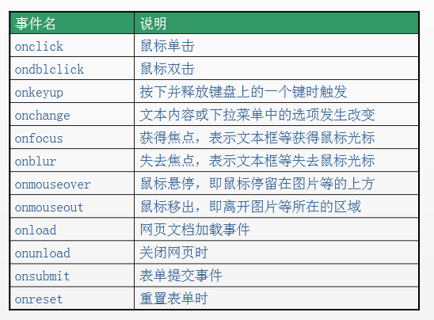

### 1、获取事件源的方式（DOM节点的获取）

获取事件源的常见方式如下：

```javascript
var div1 = document.getElementById("box1");      //方式一：通过id获取单个标签

var arr1 = document.getElementsByTagName("div");     //方式二：通过 标签名 获得 标签数组，所以有s

var arr2 = document.getElementsByClassName("hehe");  //方式三：通过 类名 获得 标签数组，所以有s
```

### 2、绑定事件的方式

方式一：直接绑定匿名函数

```html
<div id="box1" ></div>

<script type="text/javascript">
    var div1 = document.getElementById("box1");
    //绑定事件的第一种方式
    div1.onclick = function () {
        alert("我是弹出的内容");
    }
</script>
```

方式二：先单独定义函数，再绑定

```html
 <div id="box1" ></div>

<script type="text/javascript">
    var div1 = document.getElementById("box1");
    //绑定事件的第二种方式
    div1.onclick = fn;   //注意，这里是fn，不是fn()。fn()指的是返回值。
    //单独定义函数
    function fn() {
        alert("我是弹出的内容");
    }
</script>
```

注意上方代码的注释。**绑定的时候，是写fn，不是写fn()**。fn代表的是整个函数，而fn()代表的是返回值。

方式三：行内绑定

```html
<!--行内绑定-->
<div id="box1" onclick="fn()"></div>

<script type="text/javascript">

    function fn() {
        alert("我是弹出的内容");
    }

</script>
```

注意第一行代码，绑定时，是写的`"fn()"`，不是写的`"fn"`。因为绑定的这段代码不是写在js代码里的，而是被识别成了**字符串**。

### 3、事件驱动程序

我们在上面是拿alert举例，不仅如此，我们还可以操作标签的属性和样式。举例如下：

点击鼠标时，原本粉色的div变大了，背景变红：

```html
   <style>
        #box1 {
            width: 100px;
            height: 100px;
            background-color: pink;
            cursor: pointer;
        }
    </style>
</head>

<body>

<div id="box1" ></div>

<script type="text/javascript">
    var div1 = document.getElementById("box1");
    //点击鼠标时，原本粉色的div变大了，背景变红了
    div1.onclick = function () {
        div1.style.width = "200px";   //属性值要写引号
        div1.style.height = "200px";
        div1.style.backgroundColor = "red";   //属性名是backgroundColor，不是background-color
    }
</script>
```

上方代码的注意事项：

- 在js里写属性值时，要用引号
- 在js里写属性名时，是`backgroundColor`，不是CSS里面的`background-color`。

实现效果如下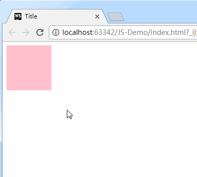

### onload事件

> onload事件比较特殊，这里单独讲一下。

**当页面加载（文本和图片）完毕的时候，触发onload事件。**

举例：

```html
<script type="text/javascript">
    window.onload = function () {
        console.log("smyhvae");  //等页面加载完毕时，打印字符串
    }
</script>
```

有一点我们要知道：**js的加载是和html同步加载的**。因此，如果使用元素在定义元素之前，容易报错。这个时候，onload事件就能派上用场了，我们可以把使用元素的代码放在onload里，就能保证这段代码是最后执行。

建议是：整个页面上所有元素加载完毕再执行js内容。所以，window.onload可以预防使用标签在定义标签之前。

# 36-DOM简介和DOM操作

## 常见概念

### [#](https://web.qianguyihao.com/04-JavaScript基础/36-DOM简介和DOM操作.html#javascript的组成)JavaScript的组成

JavaScript基础分为三个部分：

- ECMAScript：JavaScript的语法标准。包括变量、表达式、运算符、函数、if语句、for语句等。
- **DOM**：文档对象模型（Document object Model），操作**网页上的元素**的API。比如让盒子移动、变色、轮播图等。
- **BOM**：浏览器对象模型（Browser Object Model），操作**浏览器部分功能**的API。比如让浏览器自动滚动。

### [#](https://web.qianguyihao.com/04-JavaScript基础/36-DOM简介和DOM操作.html#节点)节点

**节点**（Node）：构成 HTML 网页的最基本单元。网页中的每一个部分都可以称为是一个节点，比如：html标签、属性、文本、注释、整个文档等都是一个节点。

虽然都是节点，但是实际上他们的具体类型是不同的。常见节点分为四类：

- 文档节点（文档）：整个 HTML 文档。整个 HTML 文档就是一个文档节点。
- 元素节点（标签）：HTML标签。
- 属性节点（属性）：元素的属性。
- 文本节点（文本）：HTML标签中的文本内容（包括标签之间的空格、换行）。

节点的类型不同，属性和方法也都不尽相同。所有的节点都是Object。

### 什么是DOM

**DOM**：Document Object Model，文档对象模型。DOM 为文档提供了结构化表示，并定义了如何通过脚本来访问文档结构。目的其实就是为了能让js操作html元素而制定的一个规范。

DOM就是由节点组成的。

**解析过程**： HTML加载完毕，渲染引擎会在内存中把HTML文档，生成一个DOM树，getElementById是获取内中DOM上的元素节点。然后操作的时候修改的是该元素的**属性**。

**DOM树**：（一切都是节点）

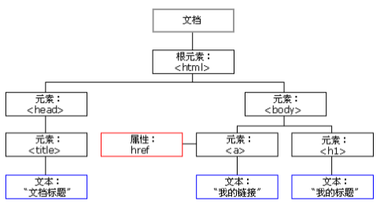

上图可知，**在HTML当中，一切都是节点**（非常重要）。节点的分类，在上一段中，已经讲了。

整个html文档就是一个文档节点。所有的节点都是Object。

### DOM可以做什么

- 找对象（元素节点）
- 设置元素的属性值
- 设置元素的样式
- 动态创建和删除元素
- 事件的触发响应：事件源、事件、事件的驱动程序

## 元素节点的获取

DOM节点的获取方式其实就是**获取事件源的方式**。关于事件，上一篇文章中已经讲到了。

想要操作元素节点，必须首先要找到该节点。有三种方式可以获取DOM节点：

```javascript
var div1 = document.getElementById("box1"); //方式一：通过 id 获取 一个 元素节点（为什么是一个呢？因为 id 是唯一的）

var arr1 = document.getElementsByTagName("div"); //方式二：通过 标签名 获取 元素节点数组，所以有s

var arr2 = document.getElementsByClassName("hehe"); //方式三：通过 类名 获取 元素节点数组，所以有s
```

既然方式二、方式三获取的是标签数组，那么习惯性是**先遍历之后再使用**。

特殊情况：数组中的值只有1个。即便如此，这一个值也是包在数组里的。这个值的获取方式如下：

```javascript
document.getElementsByTagName("div1")[0];    //取数组中的第一个元素

document.getElementsByClassName("hehe")[0];  //取数组中的第一个元素
```

## [#](https://web.qianguyihao.com/04-JavaScript基础/36-DOM简介和DOM操作.html#dom访问关系的获取)DOM访问关系的获取

DOM的节点并不是孤立的，因此可以通过DOM节点之间的相对关系对它们进行访问。如下：

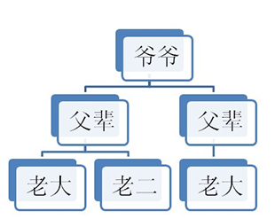

节点的访问关系，是以**属性**的方式存在的。

JS中的**父子兄**访问关系：

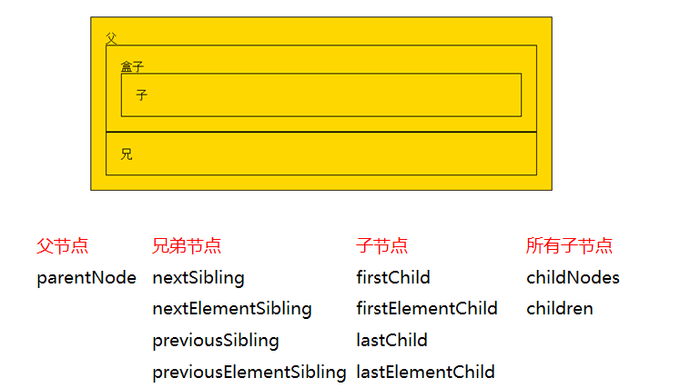

这里我们要重点知道**parentNode**和**children**这两个属性的用法。下面分别介绍。

### 获取父节点

调用者就是节点。一个节点只有一个父节点，调用方式就是

```javascript
	节点.parentNode
```

### 获取兄弟节点

**1、下一个节点 | 下一个元素节点**：

> Sibling的中文是**兄弟**。

（1）nextSibling：

- 火狐、谷歌、IE9+版本：都指的是下一个节点（包括标签、空文档和换行节点）。
- IE678版本：指下一个元素节点（标签）。

（2）nextElementSibling：

- 火狐、谷歌、IE9+版本：都指的是下一个元素节点（标签）。

**总结**：为了获取下一个**元素节点**，我们可以这样做：在IE678中用nextSibling，在火狐谷歌IE9+以后用nextElementSibling，于是，综合这两个属性，可以这样写：

```javascript
	下一个兄弟节点 = 节点.nextElementSibling || 节点.nextSibling
```

**2、前一个节点 | 前一个元素节点**：

> previous的中文是：前一个。

（1）previousSibling：

- 火狐、谷歌、IE9+版本：都指的是前一个节点（包括标签、空文档和换行节点）。
- IE678版本：指前一个元素节点（标签）。

（2）previousElementSibling：

- 火狐、谷歌、IE9+版本：都指的是前一个元素节点（标签）。

**总结**：为了获取前一个**元素节点**，我们可以这样做：在IE678中用previousSibling，在火狐谷歌IE9+以后用previousElementSibling，于是，综合这两个属性，可以这样写：

```javascript
	前一个兄弟节点 = 节点.previousElementSibling || 节点.previousSibling
```

**3、补充**：获得任意一个兄弟节点：

```javascript
	节点自己.parentNode.children[index];  //随意得到兄弟节点
```

### 获取单个的子节点

**1、第一个子节点 | 第一个子元素节点**：

（1）firstChild：

- 火狐、谷歌、IE9+版本：都指的是第一个子节点（包括标签、空文档和换行节点）。
- IE678版本：指第一个子元素节点（标签）。

（2）firstElementChild：

- 火狐、谷歌、IE9+版本：都指的是第一个子元素节点（标签）。

**总结**：为了获取第一个**子元素节点**，我们可以这样做：在IE678中用firstChild，在火狐谷歌IE9+以后用firstElementChild，于是，综合这两个属性，可以这样写：

```javascript
	第一个子元素节点 = 节点.firstElementChild || 节点.firstChild
```

**2、最后一个子节点 | 最后一个子元素节点**：

（1）lastChild：

- 火狐、谷歌、IE9+版本：都指的是最后一个子节点（包括标签、空文档和换行节点）。
- IE678版本：指最后一个子元素节点（标签）。

（2）lastElementChild：

- 火狐、谷歌、IE9+版本：都指的是最后一个子元素节点（标签）。

**总结**：为了获取最后一个**子元素节点**，我们可以这样做：在IE678中用lastChild，在火狐谷歌IE9+以后用lastElementChild，于是，综合这两个属性，可以这样写：

```javascript
	最后一个子元素节点 = 节点.lastElementChild || 节点.lastChild
```

###  获取所有的子节点

（1）**childNodes**：标准属性。返回的是指定元素的**子节点**的集合（包括元素节点、所有属性、文本节点）。是W3C的亲儿子。

- 火狐 谷歌等高本版会把换行也看做是子节点。

用法：

```javascript
	子节点数组 = 父节点.childNodes;   //获取所有节点。
```

（2）**children**：非标准属性。返回的是指定元素的**子元素节点**的集合。【重要】

- 它只返回HTML节点，甚至不返回文本节点。
- 在IE6/7/8中包含注释节点（在IE678中，注释节点不要写在里面）。

虽然不是标准的DOM属性，但它和innerHTML方法一样，得到了几乎所有浏览器的支持。

用法：（**用的最多**）

```javascript
子节点数组 = 父节点.children;   //获取所有节点。用的最多。
```

## DOM节点的操作（重要）

上一段的内容：节点的**访问关系**都是**属性**。

本段的内容：节点的**操作**都是**函数**（方法）。

### [#](https://web.qianguyihao.com/04-JavaScript基础/36-DOM简介和DOM操作.html#创建节点)创建节点

格式如下：

```javascript
	新的标签(元素节点) = document.createElement("标签名");
```

比如，如果我们想创建一个li标签，或者是创建一个不存在的adbc标签，可以这样做：

```html
<script type="text/javascript">
    var a1 = document.createElement("li");   //创建一个li标签
    var a2 = document.createElement("adbc");   //创建一个不存在的标签

    console.log(a1);
    console.log(a2);

    console.log(typeof a1);
    console.log(typeof a2);
</script>
```

打印结果：

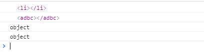

### 插入节点

插入节点有两种方式，它们的含义是不同的。

方式1：

```javascript
	父节点.appendChild(新的子节点);
```

解释：父节点的最后插入一个新的子节点。

方式2：

```javascript
	父节点.insertBefore(新的子节点,作为参考的子节点)
```

解释：

- 在参考节点前插入一个新的节点。
- 如果参考节点为null，那么他将在父节点里面的最后插入一个子节点。

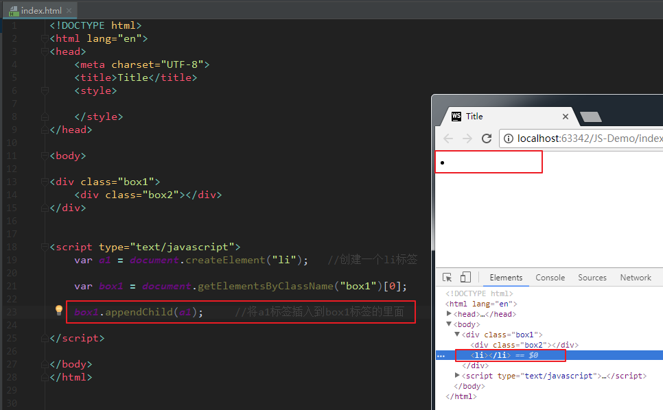

我们可以看到，li标签确实被插入到了box1标签的里面，和box2并列了。

方式2的举例：

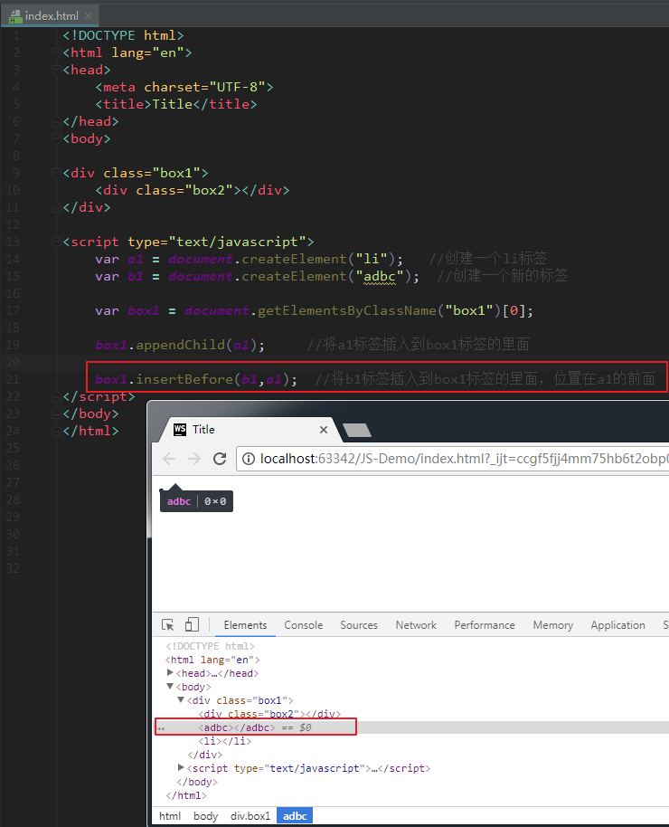

我们可以看到，b1标签被插入到了box1标签的里面，和a1标签并列，在a1标签的前面。

**特别强调：**

关于方式1的appendChild方法，这里要强调一下。比如，现在有下面这样一个div结构：

```html
<div class="box11">
    <div class="box12">生命壹号</div>
</div>

<div class="box21">
    <div class="box22">永不止步</div>

</div>
```

上方结构中，子盒子box12是在父亲box11里的，子盒子box22是在父亲box21里面的。现在，如果我调用方法`box11.appendChild(box22)`，**最后产生的结果是：box22会跑到box11中**（也就是说，box22不在box21里面了）。这是一个很神奇的事情：

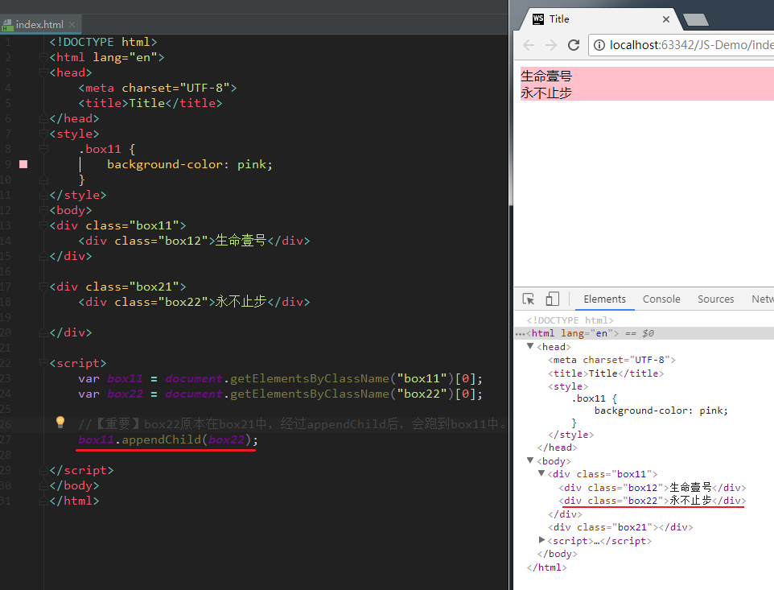

### 删除节点

格式如下：

```javascript
父节点.removeChild(子节点);
```

解释：**用父节点删除子节点**。必须要指定是删除哪个子节点。

如果我想删除自己这个节点，可以这么做：

```javascript
	node1.parentNode.removeChild(node1);
```

### [#](https://web.qianguyihao.com/04-JavaScript基础/36-DOM简介和DOM操作.html#复制节点-克隆节点)复制节点（克隆节点）

格式如下：

```javascript
	要复制的节点.cloneNode();       //括号里不带参数和带参数false，效果是一样的。

	要复制的节点.cloneNode(true);
```

括号里带不带参数，效果是不同的。解释如下：

- 不带参数/带参数false：只复制节点本身，不复制子节点。
- 带参数true：既复制节点本身，也复制其所有的子节点。

## 设置节点的属性

我们可以获取节点的属性值、设置节点的属性值、删除节点的属性。

我们就统一拿下面这个标签来举例：

```html

```

下面分别介绍。

### [#](https://web.qianguyihao.com/04-JavaScript基础/36-DOM简介和DOM操作.html#_1、获取节点的属性值)1、获取节点的属性值

**方式1**：

```javascript
	元素节点.属性名;
	元素节点[属性名];
```

举例：（获取节点的属性值）

```html
<body>


<script type="text/javascript">
    var myNode = document.getElementsByTagName("img")[0];

    console.log(myNode.src);
    console.log(myNode.className);    //注意，是className，不是class
    console.log(myNode.title);

    console.log("------------");

    console.log(myNode["src"]);
    console.log(myNode["className"]); //注意，是className，不是class
    console.log(myNode["title"]);
</script>
</body>
```

上方代码中的img标签，有各种属性，我们可以逐一获取，打印结果如下：

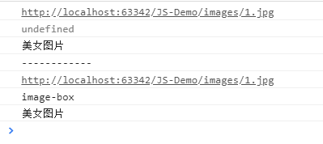

**方式2**：

```javascript
	元素节点.getAttribute("属性名称");
```

举例：

```javascript
    console.log(myNode.getAttribute("src"));
    console.log(myNode.getAttribute("class"));   //注意是class，不是className
    console.log(myNode.getAttribute("title"));
```

打印结果：

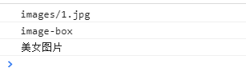

方式1和方式2的区别在于：前者是直接操作标签，后者是把标签作为DOM节点。推荐方式2。

### 2、设置节点的属性值

方式1举例：（设置节点的属性值）

```javascript
    myNode.src = "images/2.jpg"   //修改src的属性值
    myNode.className = "image2-box";  //修改class的name
```

方式2：

```javascript
	元素节点.setAttribute("属性名", "新的属性值");
```

方式2举例：（设置节点的属性值）

```javascript
    myNode.setAttribute("src","images/3.jpg");
    myNode.setAttribute("class","image3-box");
    myNode.setAttribute("id","你好");
```

### 3、删除节点的属性

格式：

```javascript
	元素节点.removeAttribute(属性名);
```

举例：（删除节点的属性）

```javascript
    myNode.removeAttribute("class");
    myNode.removeAttribute("id");
```


获取节点的属性值和设置节点的属性值，都有两种方式。

**如果是节点的“原始属性”**（比如 普通标签的`class/className`属性、普通标签的`style`属性、普通标签的 title属性、img 标签的`src`属性、超链接的`href`属性等），**方式1和方式2是等价的**，可以混用。怎么理解混用呢？比如说：用 `div.title = '我是标题'`设置属性，用 `div.getAttribute('title')`获取属性，就是混用。

但如果是节点的“非原始属性”，比如：

```javascript
div.aaa = 'qianguyihao';

div.setAttribute('bbb', 'qianguyihao');
```

上面的这个“非原始属性”，在使用这两种方式时，是有区别的。区别如下：

- 方式1 的`元素节点.属性`和`元素节点[属性]`：绑定的属性值不会出现在标签上。
- 方式2 的`get/set/removeAttribut`：绑定的属性值会出现在标签上。
- **这两种方式不能交换使用**，get值和set值必须使用同一种方法。

举例：

举例：

```html
<body>
<div id="box" title="主体" class="asdfasdfadsfd">我爱你中国</div>
<script>

    var div = document.getElementById("box");

    //采用方式一进行set
    div.aaaa = "1111";
    console.log(div.aaaa);    //打印结果：1111。可以打印出来，但是不会出现在标签上

    //采用方式二进行set
    div.setAttribute("bbbb","2222");    //bbbb作为新增的属性，会出现在标签上

    console.log(div.getAttribute("aaaa"));   //打印结果：null。因为方式一的set，无法采用方式二进行get。
    console.log(div.bbbb);                   //打印结果：undefined。因为方式二的set，无法采用方式一进行get。

</script>
</body>
```

## DOM对象的属性-补充

### innerHTML和innerText的区别

- value：标签的value属性。
- **innerHTML**：双闭合标签里面的内容（包含标签）。
- **innerText**：双闭合标签里面的内容（不包含标签）。（老版本的火狐用textContent）

**获取内容举例：**

如果我们想获取innerHTML和innerText里的内容，看看会如何：（innerHTML会获取到标签本身，而innerText则不会）

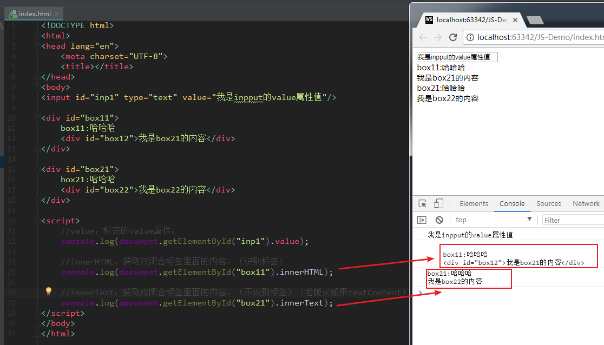

**修改内容举例：**（innerHTML会修改标签本身，而innerText则不会）

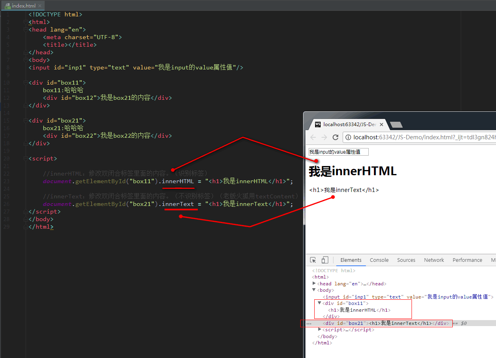

### nodeType属性

这里讲一下nodeType属性。

- **nodeType == 1 表示的是元素节点**（标签） 。记住：在这里，元素就是标签。
- nodeType == 2 表示是属性节点。
- nodeType == 3 是文本节点。

### nodeType、nodeName、nodeValue

我们那下面这个标签来举例：

```html
<div id="box" value="111">
    生命壹号
</div>
```

上面这个标签就包含了三种节点：

- 元素节点（标签）
- 属性节点
- 文本节点

获取这三个节点的方式如下：

```javascript
    var element = document.getElementById("box1");  //获取元素节点（标签）
    var attribute = element.getAttributeNode("id"); //获取box1的属性节点
    var txt = element.firstChild;                   //获取box1的文本节点

    var value = element.getAttribute("id");         //获取id的属性值

    console.log(element);
    console.log("--------------");
    console.log(attribute);
    console.log("--------------");
    console.log(txt);
    console.log("--------------");
    console.log(value);
```

打印结果如下：

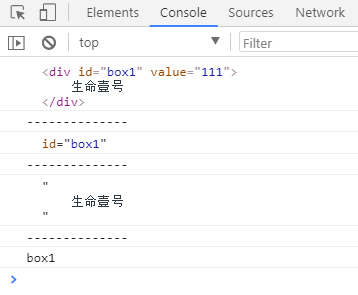

既然这三个都是节点，如果我想获取它们的nodeType、nodeName、nodeValue，代码如下：

```javascript
    var element = document.getElementById("box1");  //获取元素节点（标签）
    var attribute = element.getAttributeNode("id"); //获取box1的属性节点
    var txt = element.firstChild;                   //获取box1的文本节点

    //获取nodeType
    console.log(element.nodeType);       //1
    console.log(attribute.nodeType);     //2
    console.log(txt.nodeType);           //3

    console.log("--------------");

    //获取nodeName
    console.log(element.nodeName);       //DIV
    console.log(attribute.nodeName);     //id
    console.log(txt.nodeName);           //#text

    console.log("--------------");

    //获取nodeValue
    console.log(element.nodeValue);     //null
    console.log(attribute.nodeValue);   //box1
    console.log(txt.nodeValue);         //生命壹号
```

打印结果如下：

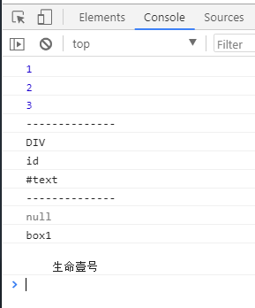

## [#](https://web.qianguyihao.com/04-JavaScript基础/36-DOM简介和DOM操作.html#文档的加载)文档的加载

浏览器在加载一个页面时，是按照自上向下的顺序加载的，读取到一行就运行一行。如果将script标签写到页面的上边，在代码执行时，页面还没有加载，页面没有加载DOM对象也没有加载，会导致无法获取到DOM对象。

**onload 事件**：

onload 事件会在整个页面加载完成之后才触发。为 window 绑定一个onload事件，该事件对应的响应函数将会在页面加载完成之后执行，这样可以确保我们的代码执行时所有的DOM对象已经加载完毕了。

代码举例：

```html
<!DOCTYPE html>
<html>
  <head>
    <meta charset="UTF-8" />
    <title></title>
    <script type="text/javascript">
      // 【方式一：先加载，后执行】这段 js 代码是写在 <head> 标签里的，所以建议放在 window.onload 里面。
      window.onload = function() {
        // 获取id为btn的按钮
        var btn = document.getElementById("btn");
        // 为按钮绑定点击事件
        btn.onclick = function() {
          alert("hello");
        };
      };
    </script>
  </head>
  <body>
    <button id="btn">点我一下</button>

    <script type="text/javascript">
      // 【方式二：后加载，后执行】这段 js 代码是写在 <body> 标签里的，代码的位置是处在页面的下方。这么做，也可以确保：在页面加载完毕后，再执行 js 代码。

      // 获取id为btn的按钮
      var btn = document.getElementById("btn");
      // 为按钮绑定点击事件
      btn.onclick = function() {
        alert("hello");
      };
    </script>
  </body>
</html>
```

上方代码中，方式一和方式二均可以确保：在页面加载完毕后，再执行 js 代码。


# 37-通过style对象获取和设置行内样式

## [#](https://web.qianguyihao.com/04-JavaScript基础/37-通过style对象获取和设置行内样式.html#style属性的获取和修改)style属性的获取和修改

在DOM当中，如果想设置样式，有两种形式：

- className（针对内嵌样式）
- style（针对行内样式）

这篇文章，我们就来讲一下style。

需要注意的是：style是一个对象，只能获取**行内样式**，不能获取内嵌的样式和外链的样式。例如：

```html
<!DOCTYPE html>
<html lang="en">
<head>
    <meta charset="UTF-8">
    <title>Title</title>
    <style>
        div {
            border: 6px solid red;
        }
    </style>
</head>
<body>

    <div class="box1" style="width: 200px;height: 100px;background-color: pink;"></div>

    <script>
        var box1 = document.getElementsByTagName("div")[0];

        console.log(box1.style.backgroundColor);
        console.log(box1.style.border);  //没有打印结果，因为这个属性不是行内样式
        console.log(typeof box1.style);  //因为是对象，所以打印结果是Object
        console.log(box1.style);         //打印结果是对象
    </script>
</body>
</html>
```

打印结果：

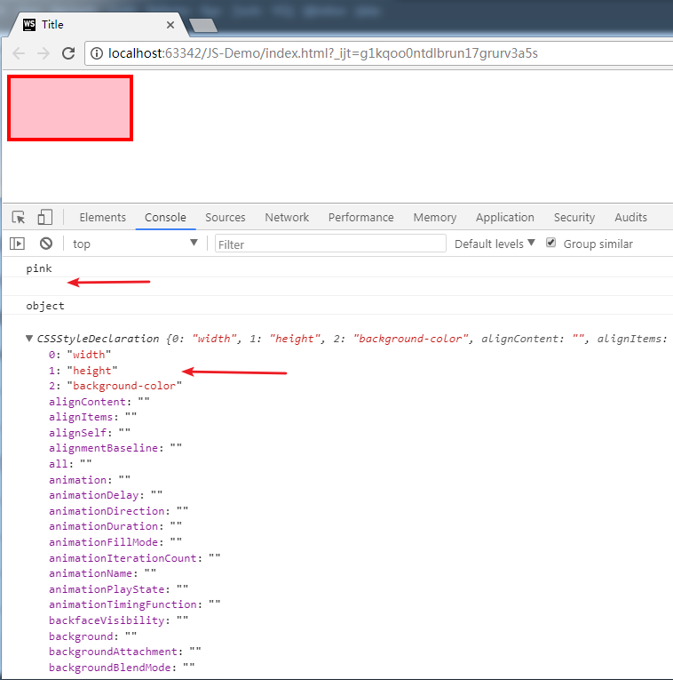

上图显示，因为borde通过 js 读取元素的样式属性不是行内样式，所以无法通过style对象获取。

### 通过 js 读取元素的样式

语法：（方式一）

```javascript
    元素.style.样式名
```

备注：我们通过style属性读取的样式都是**行内样式**。

语法：（方式二）

```javascript
    元素.style["属性"];  //格式

    box.style["width"];  //举例
```

方式二最大的优点是：可以给属性传递参数。

### 通过 js 设置元素的样式

语法：

```javascript
    元素.style.样式名 = 样式值;
```

举例：

```text
    box1.style.width = "300px";
    box1.style.backgroundColor = "red"; // 驼峰命名法
```

备注：我们通过style属性设置的样式都是**行内样式**，而行内样式有较高的优先级。但是如果在样式中的其他地方写了`!important`，则此时`!important`会有更高的优先级。

### style属性的注意事项

style属性需要注意以下几点：

（1）样式少的时候使用。

（2）style是对象。我们在上方已经打印出来，typeof的结果是Object。

（3）值是字符串，没有设置值是“”。

（4）命名规则，驼峰命名。

（5）只能获取行内样式，和内嵌和外链无关。

（6）box.style.cssText = “字符串形式的样式”。

`cssText`这个属性，其实就是把行内样式里面的值当做字符串来对待。在上方代码的基础之上，举例：

```html
    <script>
        var box1 = document.getElementsByTagName("div")[0];

        //通过cssText一次性设置行内样式
        box1.style.cssText = "width: 300px;height: 300px;background-color: green;";

        console.log(box1.style.cssText);   //这一行更加可以理解,style是对象

    </script>
```

打印结果：

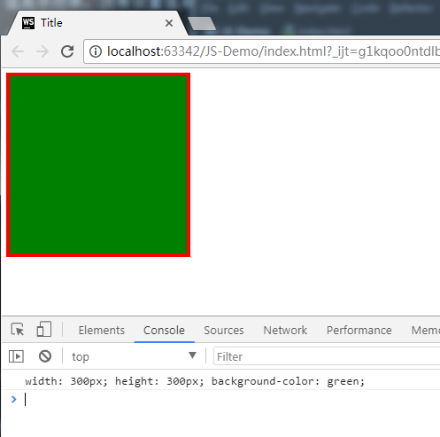

### style的常用属性

style的常用属性包括：

- backgroundColor
- backgroundImage
- color
- width
- height
- border
- opacity 设置透明度 (IE8以前是filter: alpha(opacity=xx))

注意DOM对象style的属性和标签中style内的值不一样，因为在JS中，`-`不能作为标识符。比如：

- DOM中：backgroundColor
- CSS中：background-color

## [#](https://web.qianguyihao.com/04-JavaScript基础/37-通过style对象获取和设置行内样式.html#style属性的举例)style属性的举例

我们针对上面列举的几个style的样式，来举几个例子：

- 举例1、改变div的大小和透明度
- 举例2、当前输入的文本框高亮显示
- 举例3、高级隔行变色、高亮显示

### 举例1：改变div的大小和透明度

代码举例：

```html
<body>
<div style="width: 100px;height: 100px;background-color: pink;"></div>
<script>

    var div = document.getElementsByTagName("div")[0];
    div.onmouseover = function () {
        div.style.width = "200px";
        div.style.height = "200px";
        div.style.backgroundColor = "black";
        div.style.opacity = "0.2";   //设置背景色的透明度。单位是0.1
        div.style.filter = "alpha(opacity=20)";   //上一行代码的兼容性写法。注意单位是百进制
    }

</script>

</body>
```

### 举例2：当前输入的文本框高亮显示

代码实现

```html
<!DOCTYPE html>
<html>
<head lang="en">
    <meta charset="UTF-8">
    <title></title>
    <style>
        input {
            display: block;
        }
    </style>

</head>

<body>
<ul>
    <input type="text"/>
    <input type="text"/>
    <input type="text"/>
    <input type="text"/>
    <input type="text"/>
</ul>
<script>
    //需求：让所有的input标签获取焦点后高亮显示

    //1.获取事件源
    var inpArr = document.getElementsByTagName("input");
    //2.绑定事件
    //3.书写事件驱动程序
    for (var i = 0; i < inpArr.length; i++) {
        //获取焦点后，所有的input标签被绑定onfocus事件
        inpArr[i].onfocus = function () {
            this.style.border = "2px solid red";
            this.style.backgroundColor = "#ccc";
        }
        //绑定onblur事件，取消样式
        inpArr[i].onblur = function () {
            this.style.border = "";
            this.style.backgroundColor = "";
        }
    }
</script>
</body>
</html>
```

### 举例3：高级隔行变色、高亮显示

```html
<!DOCTYPE html>
<html>
<head lang="en">
    <meta charset="UTF-8">
    <title></title>
    <style>
        * {
            padding: 0;
            margin: 0;
            text-align: center;
        }

        .wrap {
            width: 500px;
            margin: 100px auto 0;
        }

        table {
            border-collapse: collapse;
            border-spacing: 0;
            border: 1px solid #c0c0c0;
            width: 500px;
        }

        th,
        td {
            border: 1px solid #d0d0d0;
            color: #404060;
            padding: 10px;
        }

        th {
            background-color: #09c;
            font: bold 16px "微软雅黑";
            color: #fff;
        }

        td {
            font: 14px "微软雅黑";
        }

        tbody tr {
            background-color: #f0f0f0;
            cursor: pointer;
        }

        .current {
            background-color: red !important;
        }
    </style>
</head>
<body>
<div class="wrap">
    <table>
        <thead>
        <tr>
            <th>序号</th>
            <th>姓名</th>
            <th>课程</th>
            <th>成绩</th>
        </tr>
        </thead>
        <tbody id="target">
        <tr>
            <td>
                1
            </td>
            <td>生命壹号</td>
            <td>语文</td>
            <td>100</td>

        </tr>
        <tr>
            <td>
                2
            </td>
            <td>生命贰号</td>
            <td>日语</td>
            <td>99</td>
        </tr>
        <tr>
            <td>
                3
            </td>
            <td>生命叁号</td>
            <td>营销学</td>
            <td>98</td>
        </tr>
        <tr>
            <td>
                4
            </td>
            <td>生命伍号</td>
            <td>数学</td>
            <td>90</td>
        </tr>
        <tr>
            <td>
                5
            </td>
            <td>许嵩</td>
            <td>英语</td>
            <td>96</td>
        </tr>
        <tr>
            <td>
                6
            </td>
            <td>vae</td>
            <td>体育</td>
            <td>90</td>
        </tr>
        </tbody>
    </table>
</div>

<script>
    //需求：让tr各行变色，鼠标放入tr中，高亮显示。

    //1.隔行变色。
    var tbody = document.getElementById("target");
    var trArr = tbody.children;
    //循环判断并各行赋值属性（背景色）
    for (var i = 0; i < trArr.length; i++) {
        if (i % 2 !== 0) {
            trArr[i].style.backgroundColor = "#a3a3a3";
        } else {
            trArr[i].style.backgroundColor = "#ccc";
        }

        //鼠标进入高亮显示
        //难点：鼠标移开的时候要回复原始颜色。
        //计数器（进入tr之后，立刻记录颜色，然后移开的时候使用记录好的颜色）
        var myColor = "";
        trArr[i].onmouseover = function () {
            //赋值颜色之前，先记录颜色
            myColor = this.style.backgroundColor;
            this.style.backgroundColor = "#fff";
        }
        trArr[i].onmouseout = function () {
            this.style.backgroundColor = myColor;
        }
    }


</script>


</body>
</html>
```

## 通过 js 获取元素当前显示的样式

我们在上面的内容中，通过`元素.style.className`的方式只能获取**行内样式**。但是，有些元素，也写了**内嵌样式或外链样式**。

既然样式有这么多种，那么，如何获取元素当前显示的样式（包括行内样式、内嵌样式、外链样式）呢？我们接下来看一看。

### [#](https://web.qianguyihao.com/04-JavaScript基础/37-通过style对象获取和设置行内样式.html#获取元素当前正在显示的样式)获取元素当前正在显示的样式

（1）w3c的做法：

```javascript
    window.getComputedStyle("要获取样式的元素", "伪元素");
```

两个参数都是必须要有的。参数二中，如果没有伪元素就用 null 代替（一般都传null）。

```html
<style>
    #box1 {
        font-size: 20px;
        color: blue;
    }
</style>
<div id="box1" style="color: red;">这是一个 div</div>
<script>
    var div1 = document.getElementById("box1");
    var styles = window.getComputedStyle(div1);
    
    console.log(styles.fontSize); // 输出："20px"（来自内嵌样式）
    console.log(styles.color);    // 输出："rgb(255, 0, 0)"（来自行内样式，red）
    console.log(styles.width);    // 输出："auto"（浏览器默认值）
</script>
```

