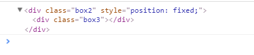
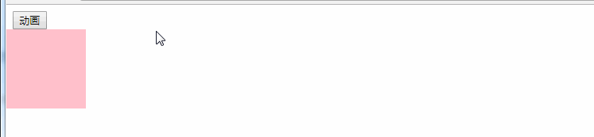
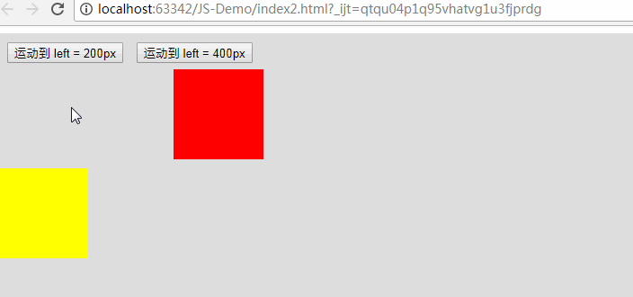
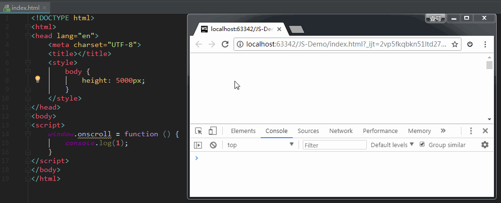
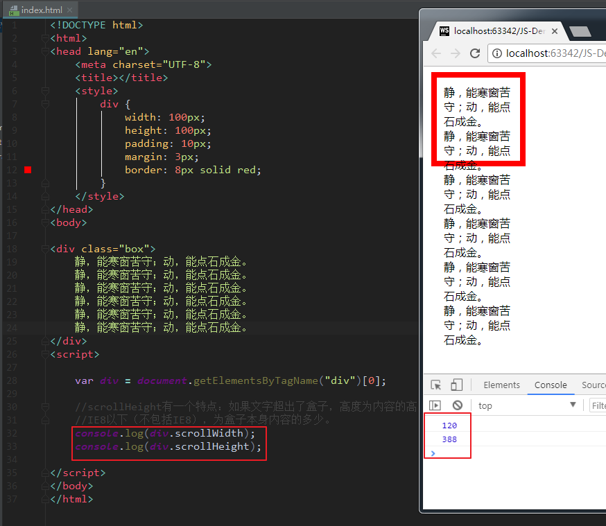
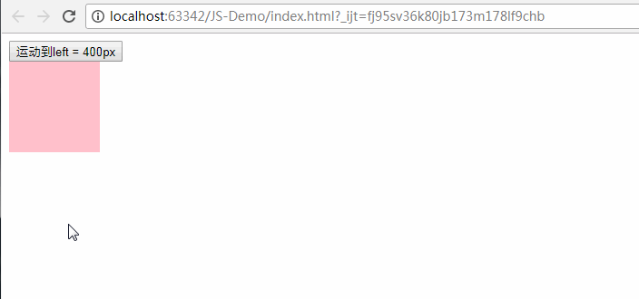
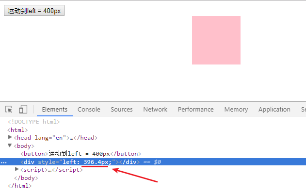
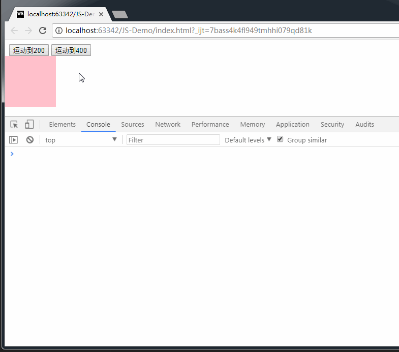
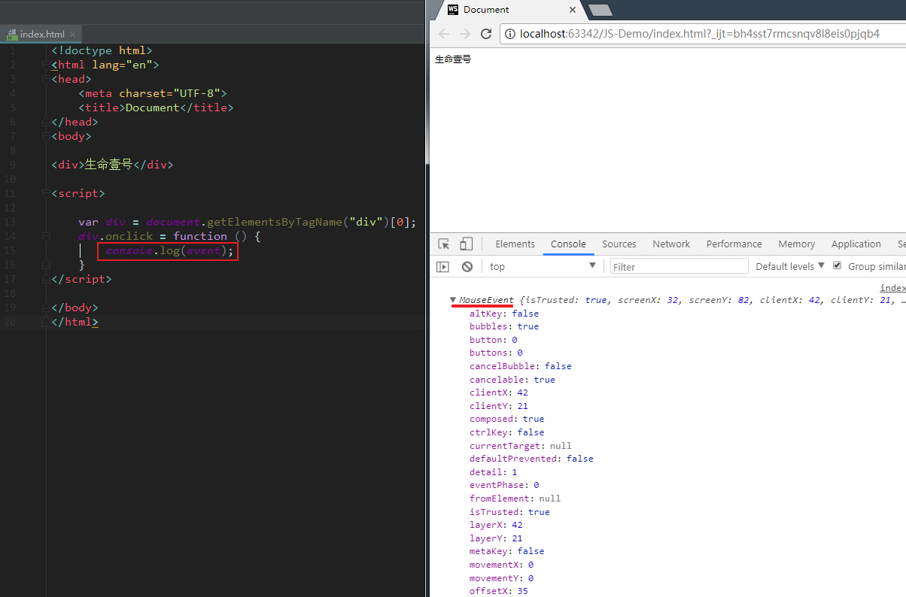
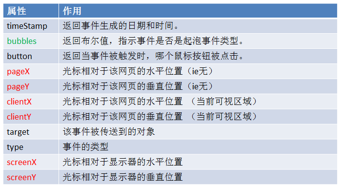

# 38-offset相关属性和匀速动画（含轮播图的实现）

## 前言

JS动画的主要内容如下：

1、三大家族和一个事件对象：

- 三大家族：offset/scroll/client。也叫三大系列。
- 事件对象/event（事件被触动时，鼠标和键盘的状态）（通过属性控制）。

2、动画(闪现/匀速/缓动)

3、冒泡/兼容/封装

## offset 家族的组成

我们知道，JS动画的三大家族包括：offset/scroll/client。今天来讲一下offset，以及与其相关的匀速动画。

> offset的中文是：偏移，补偿，位移。

js中有一套方便的**获取元素尺寸**的办法就是offset家族。offset家族包括：

- offsetWidth
- offsetHight
- offsetLeft
- offsetTop
- offsetParent

下面分别介绍。

### 1、offsetWidth 和 offsetHight

`offsetWidth` 和 `offsetHight`：获取元素的**宽高 + padding + border**，不包括margin。如下：

- offsetWidth = width + padding + border
- offsetHeight = Height + padding + border

这两个属性，他们绑定在了所有的节点元素上。获取元素之后，只要调用这两个属性，我们就能够获取元素节点的宽和高。

举例如下：

```html
<!DOCTYPE html>
<html>
<head lang="en">
    <meta charset="UTF-8">
    <title></title>
    <style>
        div {
            width: 100px;
            height: 100px;
            padding: 10px;
            border: 10px solid #000;
            margin: 100px;
            background-color: pink;
        }
    </style>
</head>
<body>

<div class="box"></div>
<script>
    var div1 = document.getElementsByTagName("div")[0];

    console.log(div1.offsetHeight);          //打印结果：140（100+20+20）
    console.log(typeof div1.offsetHeight);   //打印结果：number

</script>
</body>
</html>
```

### 2、offsetParent

`offsetParent`：获取当前元素的**定位父元素**。

- 如果当前元素的父元素，**有CSS定位**（position为absolute、relative、fixed），那么 `offsetParent` 获取的是**最近的**那个父元素。
- 如果当前元素的父元素，**没有CSS定位**（position为absolute、relative、fixed），那么`offsetParent` 获取的是**body**。

举例：

```html
<!DOCTYPE html>
<html>
<head lang="en">
    <meta charset="UTF-8">
    <title></title>
</head>
<body>
<div class="box1" style="position: absolute;">
    <div class="box2" style="position: fixed;">
        <div class="box3"></div>
    </div>
</div>
<script>

    var box3 = document.getElementsByClassName("box3")[0];

    console.log(box3.offsetParent);
</script>
</body>
</html>
```

打印结果：



### 3、offsetLeft 和 offsetTop

`offsetLeft`：当前元素相对于其**定位父元素**的水平偏移量。

`offsetTop`：当前元素相对于其**定位父元素**的垂直偏移量。

备注：从父亲的 padding 开始算起，父亲的 border 不算在内。

举例：

```html
<!DOCTYPE html>
<html>
<head lang="en">
    <meta charset="UTF-8">
    <title></title>
    <style>
        .box1 {
            width: 300px;
            height: 300px;
            padding: 100px;
            margin: 100px;
            position: relative;
            border: 100px solid #000;
            background-color: pink;
        }

        .box2 {
            width: 100px;
            height: 100px;
            background-color: red;
            /*position: absolute;*/
            /*left: 10px;*/
            /*top: 10px;*/
        }
    </style>
</head>
<body>
<div class="box1">
    <div class="box2" style="left: 10px"></div>
</div>

<script>

    var box2 = document.getElementsByClassName("box2")[0];

    //offsetTop和offsetLeft
    console.log(box2.offsetLeft);  //100
    console.log(box2.style.left);  //10px


</script>

</body>
</html>
```

在父盒子有定位的情况下，offsetLeft == style.left(去掉px之后)。注意，后者只识别行内样式。但区别不仅仅于此，下面会讲。

### offsetLeft 和 style.left 区别

（1）最大区别在于：

offsetLeft 可以返回无定位父元素的偏移量。如果父元素中都没有定位，则body为准。

style.left 只能获取行内样式，如果父元素中都没有设置定位，则返回""（意思是，返回空字符串）;

（2）offsetTop 返回的是数字，而 style.top 返回的是字符串，而且还带有单位：px。

比如：

```javascript
div.offsetLeft = 100;
div.style.left = "100px";
```

（3）offsetLeft 和 offsetTop **只读**，而 style.left 和 style.top 可读写（只读是获取值，可写是修改值）

总结：我们一般的做法是：**用offsetLeft 和 offsetTop 获取值，用style.left 和 style.top 赋值**（比较方便）。理由如下：

- style.left：只能获取行内式，获取的值可能为空，容易出现NaN。
- offsetLeft：获取值特别方便，而且是现成的number，方便计算。它是只读的，不能赋值。

## 动画的种类

- 闪现（基本不用）
- 匀速（本文重点）
- 缓动（后续重点）

简单举例如下：（每间隔500ms，向右移动盒子100px）

```html
<!DOCTYPE html>
<html>
<head lang="en">
    <meta charset="UTF-8">
    <title></title>
    <style>
        div {
            width: 100px;
            height: 100px;
            background-color: pink;
            position: absolute;
        }
    </style>
</head>
<body>
<button>动画</button>
<div class="box" style="left: 0px"></div>

<script>
    var btn = document.getElementsByTagName("button")[0];
    var div = document.getElementsByTagName("div")[0];

    //1、闪动
    //    btn.onclick = function () {
    //        div.style.left = "500px";
    //    }

    //2、匀速运动
    btn.onclick = function () {
        //定时器，每隔一定的时间向右走一些
        setInterval(function () {
            console.log(parseInt(div.style.left));
            //动画原理： 盒子未来的位置 = 盒子现在的位置 + 步长；
            //方法1：用offsetLeft获取值，用style.left赋值。
            div.style.left = div.offsetLeft + 100 + 'px';

            // 方法2：必须一开始就在DOM节点上添加 style="left: 0px;"属性，才能用方法2。否则， div.style.left 的值为 NaN
            // div.style.left = parseInt(div.style.left)+100+"px";  //方法2：
        }, 500);
    };
</script>
</body>
</html>
```

效果如下：

## 匀速动画的封装：每间隔30ms，移动盒子10px【重要】

代码如下：

```html
<!DOCTYPE html>
<html>
<head lang="en">
    <meta charset="UTF-8">
    <title></title>
    <style>
        .box1 {
            margin: 0;
            padding: 5px;
            height: 300px;
            background-color: #ddd;
            position: relative;
        }

        button {
            margin: 5px;
        }

        .box2 {
            width: 100px;
            height: 100px;
            background-color: red;
            position: absolute;
            left: 195px;
            top: 40px;
        }

        .box3 {
            width: 100px;
            height: 100px;
            background-color: yellow;
            position: absolute;
            left: 0;
            top: 150px;
        }
    </style>
</head>
<body>
<div class="box1">
    <button>运动到 left = 200px</button>
    <button>运动到 left = 400px</button>
    <div class="box2"></div>
    <div class="box3"></div>
</div>

<script>
    var btnArr = document.getElementsByTagName("button");
    var box2 = document.getElementsByClassName("box2")[0];
    var box3 = document.getElementsByClassName("box3")[0];

    //绑定事件
    btnArr[0].onclick = function () {
        //如果有一天我们要传递另外一个盒子，那么我们的方法就不好用了
        //所以我们要增加第二个参数，被移动的盒子本身。
        animate(box2, 200);
        animate(box3, 200);
    }

    btnArr[1].onclick = function () {
        animate(box2, 400);
        animate(box3, 400);
    }

    //【重要】方法的封装：每间隔30ms，将盒子向右移动10px
    function animate(ele, target) {
        //要用定时器，先清除定时器
        //一个盒子只能有一个定时器，这样的话，不会和其他盒子出现定时器冲突
        //我们可以把定时器本身，当成为盒子的一个属性
        clearInterval(ele.timer);
        //我们要求盒子既能向前又能向后，那么我们的步长就得有正有负
        //目标值如果大于当前值取正，目标值如果小于当前值取负
        var speed = target > ele.offsetLeft ? 10 : -10;  //speed指的是步长
        ele.timer = setInterval(function () {
            //在执行之前就获取当前值和目标值之差
            var val = target - ele.offsetLeft;
            ele.style.left = ele.offsetLeft + speed + "px";
            //移动的过程中，如果目标值和当前值之差如果小于步长，那么就不能在前进了
            //因为步长有正有负，所有转换成绝对值来比较
            if (Math.abs(val) < Math.abs(speed)) {
                ele.style.left = target + "px";
                clearInterval(ele.timer);
            }
        }, 30)
    }
</script>
</body>
</html>
```

实现的效果：



上方代码中的方法封装，可以作为一个模板步骤，要记住。其实，这个封装的方法，写成下面这样，会更严谨，更容易理解：（将if语句进行了改进）

```javascript
 //【重要】方法的封装：每间隔30ms，将盒子向右移动10px
    function animate(ele, target) {
        //要用定时器，先清除定时器
        //一个盒子只能有一个定时器，这样的话，不会和其他盒子出现定时器冲突
        //我们可以把定时器本身，当成为盒子的一个属性
        clearInterval(ele.timer);
        //我们要求盒子既能向前又能向后，那么我们的步长就得有正有负
        //目标值如果大于当前值取正，目标值如果小于当前值取负
        var speed = target > ele.offsetLeft ? 10 : -10;  //speed指的是步长
        ele.timer = setInterval(function () {
            //在执行之前就获取当前值和目标值之差
            var val = target - ele.offsetLeft;

            //移动的过程中，如果目标值和当前值之差如果小于步长，那么就不能在前进了
            //因为步长有正有负，所有转换成绝对值来比较
            if (Math.abs(val) < Math.abs(speed)) {  //如果val小于步长，则直接到达目的地；否则，每次移动一个步长
                ele.style.left = target + "px";
                clearInterval(ele.timer);
            } else {
                ele.style.left = ele.offsetLeft + speed + "px";
            }
        }, 30)
    }
```

## 代码举例：轮播图的实现

```html
<!doctype html>
<html lang="en">
<head>
    <meta http-equiv="Content-Type" content="text/html; charset=utf-8"/>
    <title>无标题文档</title>
    <style type="text/css">
        * {
            padding: 0;
            margin: 0;
            list-style: none;
            border: 0;
        }

        .all {
            width: 500px;
            height: 200px;
            padding: 7px;
            border: 1px solid #ccc;
            margin: 100px auto;
            position: relative;
        }

        .screen {
            width: 500px;
            height: 200px;
            overflow: hidden;
            position: relative;
        }

        .screen li {
            width: 500px;
            height: 200px;
            overflow: hidden;
            float: left;
        }

        .screen ul {
            position: absolute;
            left: 0;
            top: 0px;
            width: 3000px;
        }

        .all ol {
            position: absolute;
            right: 10px;
            bottom: 10px;
            line-height: 20px;
            text-align: center;
        }

        .all ol li {
            float: left;
            width: 20px;
            height: 20px;
            background: #fff;
            border: 1px solid #ccc;
            margin-left: 10px;
            cursor: pointer;
        }

        .all ol li.current {
            background: yellow;
        }

        #arr {
            display: none;
        }

        #arr span {
            width: 40px;
            height: 40px;
            position: absolute;
            left: 5px;
            top: 50%;
            margin-top: -20px;
            background: #000;
            cursor: pointer;
            line-height: 40px;
            text-align: center;
            font-weight: bold;
            font-family: '黑体';
            font-size: 30px;
            color: #fff;
            opacity: 0.3;
            border: 1px solid #fff;
        }

        #arr #right {
            right: 5px;
            left: auto;
        }
    </style>

    <script>
        window.onload = function () {

            //需求：无缝滚动。
            //思路：赋值第一张图片放到ul的最后，然后当图片切换到第五张的时候
            //     直接切换第六章，再次从第一张切换到第二张的时候先瞬间切换到
            //     第一张图片，然后滑动到第二张
            //步骤：
            //1.获取事件源及相关元素。（老三步）
            //2.复制第一张图片所在的li,添加到ul的最后面。
            //3.给ol中添加li，ul中的个数-1个，并点亮第一个按钮。
            //4.鼠标放到ol的li上切换图片
            //5.添加定时器
            //6.左右切换图片（鼠标放上去隐藏，移开显示）


            //1.获取事件源及相关元素。（老三步）
            var all = document.getElementById("all");
            var screen = all.firstElementChild || all.firstChild;
            var imgWidth = screen.offsetWidth;
            var ul = screen.firstElementChild || screen.firstChild;
            var ol = screen.children[1];
            var div = screen.lastElementChild || screen.lastChild;
            var spanArr = div.children;

            //2.复制第一张图片所在的li,添加到ul的最后面。
            var ulNewLi = ul.children[0].cloneNode(true);
            ul.appendChild(ulNewLi);
            //3.给ol中添加li，ul中的个数-1个，并点亮第一个按钮。
            for (var i = 0; i < ul.children.length - 1; i++) {
                var olNewLi = document.createElement("li");
                olNewLi.innerHTML = i + 1;
                ol.appendChild(olNewLi)
            }
            var olLiArr = ol.children;
            olLiArr[0].className = "current";

            //4.鼠标放到ol的li上切换图片
            for (var i = 0; i < olLiArr.length; i++) {
                //自定义属性，把索引值绑定到元素的index属性上
                olLiArr[i].index = i;
                olLiArr[i].onmouseover = function () {
                    //排他思想
                    for (var j = 0; j < olLiArr.length; j++) {
                        olLiArr[j].className = "";
                    }
                    this.className = "current";
                    //鼠标放到小的方块上的时候索引值和key以及square同步
//                    key = this.index;
//                    square = this.index;
                    key = square = this.index;
                    //移动盒子
                    animate(ul, -this.index * imgWidth);
                }
            }

            //5.添加定时器
            var timer = setInterval(autoPlay, 1000);

            //固定向右切换图片
            //两个定时器（一个记录图片，一个记录小方块）
            var key = 0;
            var square = 0;

            function autoPlay() {
                //通过控制key的自增来模拟图片的索引值，然后移动ul
                key++;
                if (key > olLiArr.length) {
                    //图片已经滑动到最后一张，接下来，跳转到第一张，然后在滑动到第二张
                    ul.style.left = 0;
                    key = 1;
                }
                animate(ul, -key * imgWidth);
                //通过控制square的自增来模拟小方块的索引值，然后点亮盒子
                //排他思想做小方块
                square++;
                if (square > olLiArr.length - 1) {//索引值不能大于等于5，如果等于5，立刻变为0；
                    square = 0;
                }
                for (var i = 0; i < olLiArr.length; i++) {
                    olLiArr[i].className = "";
                }
                olLiArr[square].className = "current";
            }

            //鼠标放上去清除定时器，移开后在开启定时器
            all.onmouseover = function () {
                div.style.display = "block";
                clearInterval(timer);
            }
            all.onmouseout = function () {
                div.style.display = "none";
                timer = setInterval(autoPlay, 1000);
            }

            //6.左右切换图片（鼠标放上去显示，移开隐藏）
            spanArr[0].onclick = function () {
                //通过控制key的自增来模拟图片的索引值，然后移动ul
                key--;
                if (key < 0) {
                    //先移动到最后一张，然后key的值取之前一张的索引值，然后在向前移动
                    ul.style.left = -imgWidth * (olLiArr.length) + "px";
                    key = olLiArr.length - 1;
                }
                animate(ul, -key * imgWidth);
                //通过控制square的自增来模拟小方块的索引值，然后点亮盒子
                //排他思想做小方块
                square--;
                if (square < 0) {//索引值不能大于等于5，如果等于5，立刻变为0；
                    square = olLiArr.length - 1;
                }
                for (var i = 0; i < olLiArr.length; i++) {
                    olLiArr[i].className = "";
                }
                olLiArr[square].className = "current";
            }
            spanArr[1].onclick = function () {
                //右侧的和定时器一模一样
                autoPlay();
            }


            function animate(ele, target) {
                clearInterval(ele.timer);
                var speed = target > ele.offsetLeft ? 10 : -10;
                ele.timer = setInterval(function () {
                    var val = target - ele.offsetLeft;
                    ele.style.left = ele.offsetLeft + speed + "px";

                    if (Math.abs(val) < Math.abs(speed)) {
                        ele.style.left = target + "px";
                        clearInterval(ele.timer);
                    }
                }, 10)
            }
        }
    </script>
</head>

<body>
<div class="all" id='all'>
    <div class="screen" id="screen">
        <ul id="ul">
            <li></li>
            <li></li>
            <li></li>
            <li></li>
            <li></li>
        </ul>
        <ol>

        </ol>
        <div id="arr">
            <span id="left"><</span>
            <span id="right">></span>
        </div>
    </div>
</div>
</body>
</html>
```

# 39-scroll相关属性和缓动动画

## scroll 相关属性

### window.onscroll() 方法

当我们用鼠标滚轮，滚动网页的时候，会触发 window.onscroll() 方法。效果如下：（注意看控制台的打印结果）



如果你需要做滚动监听，可以使用这个方法。

我们来看看和 scroll 相关的有哪些属性。

###  1、ScrollWidth 和 scrollHeight

`ScrollWidth` 和 `scrollHeight`：获取元素**整个滚动区域**的宽、高。包括 width 和 padding，不包括 border和margin。

**注意**：

`scrollHeight` 的特点是：如果内容超出了盒子，`scrollHeight`为内容的高（包括超出的内容）；如果不超出，`scrollHeight`为盒子本身的高度。`ScrollWidth`同理。

```html
<!DOCTYPE html>
<html>
<head lang="en">
    <meta charset="UTF-8">
    <title></title>
    <style>
        div {
            width: 100px;
            height: 100px;
            padding: 10px;
            margin: 3px;
            border: 8px solid red;
        }
    </style>
</head>
<body>

<div class="box">
    静，能寒窗苦守；动，能点石成金。
    静，能寒窗苦守；动，能点石成金。
    静，能寒窗苦守；动，能点石成金。
    静，能寒窗苦守；动，能点石成金。
    静，能寒窗苦守；动，能点石成金。
    静，能寒窗苦守；动，能点石成金。
</div>
<script>

    var div = document.getElementsByTagName("div")[0];

    // `scrollHeight` 的特点是：如果内容超出了盒子，`scrollHeight`为内容的高（包括超出的内容）；如果不超出，`scrollHeight`为盒子本身的高度。
    //IE8以下（不包括IE8），为盒子本身内容的高度。
    console.log(div.scrollWidth);
    console.log(div.scrollHeight);

</script>
</body>
</html>
```

打印结果：



### 2、scrollTop 和 scrollLeft

- `scrollLeft`：获取水平滚动条滚动的距离。
- `scrollTop`：获取垂直滚动条滚动的距离。

当某个元素满足`scrollHeight - scrollTop == clientHeight`时，说明垂直滚动条滚动到底了。

当某个元素满足`scrollWidth - scrollLeft == clientWidth`时，说明水平滚动条滚动到底了。

这个实战经验非常有用，可以用来判断用户是否已经将内容滑动到底了。比如说，有些场景下，希望用户能够看完“长长的活动规则”，才允许触发接下来的表单操作

### scrollTop 的兼容性

如果要获取页面滚动的距离，scrollTop 这个属性的写法要注意兼容性，如下。

（1）如果文档没有 DTD 声明，写法为

```javascript
    document.body.scrollTop
```

在没有 DTD 声明的情况下，要求是这种写法，chrome浏览器才能认出来。

（2）如果文档有 DTD 声明，写法为：

```javascript
   document.documentElement.scrollTop
```

在有 DTD 声明的情况下，要求是这种写法，IE6、7、8才能认出来。

综合上面这两个，就诞生了一种兼容性的写法：

```javascript
 document.body.scrollTop || document.documentElement.scrollTop //方式一

    document.body.scrollTop + document.documentElement.scrollTop  //方式二
```

综合上面的几种写法，为了兼容，不管有没有DTD，**最终版的兼容性写法：**

```javascript
    window.pageYOffset || document.body.scrollTop || document.documentElement.scrollTop;
```

### 判断是否已经 DTD 声明

方法如下：

```javascript
    document.compatMode === "CSS1Compat"   // 已声明
    document.compatMode === "BackCompat"   // 未声明
```

### 将 scrollTop 和 scrollLeft 进行封装

这里，我们将 scrollTop 和 scrollLeft 封装为一个方法，名叫scroll()，返回值为 一个对象。以后就直接调用`scroll().top` 和 `scroll().left`就好。

代码实现：

```html
<html>
<head lang="en">
    <meta charset="UTF-8">
    <title></title>
    <style>
        body {
            height: 6000px;
            width: 5000px;
        }
    </style>
</head>
<body>

<script>

    //需求：封装一个兼容的scroll().返回的是对象，用scroll().top获取scrollTop，用scroll().left获取scrollLeft

    window.onscroll = function () {
//        var myScroll = scroll();
//        myScroll.top;
        console.log(scroll().top);
        console.log(scroll().left);
    }

    //函数封装（简单封装，实际工作使用）
    function scroll() {
        return { //此函数的返回值是对象
            left: window.pageYOffset || document.body.scrollTop || document.documentElement.scrollTop,
            right: window.pageXOffset || document.body.scrollLeft || document.documentElement.scrollLeft
        }
    }
</script>
</body>
</html>
```

上方代码中，函数定义的那部分就是要封装的代码。

另外还有一种比较麻烦的封装方式：（仅供参考）

```javascript
function scroll() {  // 开始封装自己的scrollTop
    if(window.pageYOffset !== undefined) {  // ie9+ 高版本浏览器
        // 因为 window.pageYOffset 默认的是  0  所以这里需要判断
        return {
            left: window.pageXOffset,
            top: window.pageYOffset
        }
    }
    else if(document.compatMode === "CSS1Compat") {    // 标准浏览器   来判断有没有声明DTD
        return {
            left: document.documentElement.scrollLeft,
            top: document.documentElement.scrollTop
        }
    }
    return {   // 未声明 DTD
        left: document.body.scrollLeft,
        top: document.body.scrollTop
    }
}
```

## 获取 html 文档的方法

获取title、body、head、html标签的方法如下：

- `document.title` 文档标题；
- `document.head` 文档的头标签
- `document.body` 文档的body标签；
- `document.documentElement` （这个很重要）。

`document.documentElement`表示文档的html标签。也就是说，基本结构当中的 `html 标签`而是通过`document.documentElement`访问的，并不是通过 document.html 去访问的。

## 缓动动画

### 三个函数

缓慢动画里，我们要用到三个函数，这里先列出来：

- Math.ceil() 向上取整
- Math.floor() 向下取整
- Math.round(); 四舍五入

### 缓动动画的原理

缓动动画的原理就是：在移动的过程中，步长越来越小。

设置步长为：**目标位置和盒子当前位置的十分之一**。用公式表达，即：

```text
    盒子位置 = 盒子本身位置 + (目标位置 - 盒子本身位置)/ 10；
```

代码举例：

```html
<!DOCTYPE html>
<html>
<head lang="en">
    <meta charset="UTF-8">
    <title></title>
    <style>
        div {
            width: 100px;
            height: 100px;
            background-color: pink;
            position: absolute;
        }
    </style>
</head>
<body>
<button>运动到left = 400px</button>
<div></div>

<script>

    var btn = document.getElementsByTagName("button")[0];
    var div = document.getElementsByTagName("div")[0];

    btn.onclick = function () {
        setInterval(function () {
            //动画原理：盒子未来的位置 = 盒子当前的位置+步长
            div.style.left = div.offsetLeft + (400 - div.offsetLeft) / 10 + "px";
        }, 30);
    }

</script>
</body>
</html>
```

效果：



### 缓慢动画的封装（解决四舍五入的问题）

我们发现一个问题，上图中的盒子最终并没有到达400px的位置，而是只到了396.04px就停住了：

原因是：JS在取整的运算时，进行了四舍五入。

我们把打印396.04px这个left值打印出来看看：

我么发现，通过`div.style.left`获取的值是精确的，通过`div.offsetLeft`获取的left值会进行四舍五入。

此时，我们就要用到取整的函数了。

通过对缓动动画进行封装，完整版的代码实现如下：

```html
<!DOCTYPE html>
<html>
<head lang="en">
    <meta charset="UTF-8">
    <title></title>
    <style>
        div {
            width: 100px;
            height: 100px;
            background-color: pink;
            position: absolute;
            left: 0;
        }
    </style>
</head>
<body>
<button>运动到200</button>
<button>运动到400</button>
<div></div>

<script>

    var btn = document.getElementsByTagName("button");
    var div = document.getElementsByTagName("div")[0];

    btn[0].onclick = function () {
        animate(div, 200);
    }

    btn[1].onclick = function () {
        animate(div, 400);
    }

    //缓动动画封装
    function animate(ele, target) {
        //要用定时器，先清定时器
        //一个萝卜一个坑儿，一个元素对应一个定时器
        clearInterval(ele.timer);
        //定义定时器
        ele.timer = setInterval(function () {
            //获取步长
            //步长应该是越来越小的，缓动的算法。
            var step = (target - ele.offsetLeft) / 10;
            //对步长进行二次加工(大于0向上取整,小于0向下取整)
            //达到的效果是：最后10像素的时候都是1像素1像素的向目标位置移动，就能够到达指定位置。
            step = step > 0 ? Math.ceil(step) : Math.floor(step);
            //动画原理： 目标位置 = 当前位置 + 步长
            ele.style.left = ele.offsetLeft + step + "px";
            console.log(step);
            //检测缓动动画有没有停止
            console.log("smyhvae");
            if (Math.abs(target - ele.offsetLeft) <= Math.abs(step)) {
                //处理小数赋值
                ele.style.left = target + "px";
                clearInterval(ele.timer);
            }
        }, 30);
    }

</script>
</body>
</html>
```

实现效果：




# 40-client（可视区）相关属性

## client 家族的组成

### [#](https://web.qianguyihao.com/04-JavaScript基础/40-client（可视区）相关属性.html#clientwidth-和-clientheight)clientWidth 和 clientHeight

元素调用时：

- clientWidth：获取元素的可见宽度（width + padding）。
- clientHeight：获取元素的可见高度（height + padding）。

body/html 调用时：

- clientWidth：获取网页可视区域宽度。
- clientHeight：获取网页可视区域高度。

**声明**：

- `clientWidth` 和 `clientHeight` 属性是只读的，不可修改。
- `clientWidth` 和 `clientHeight` 的值都是不带 px 的，返回的都是一个数字，可以直接进行计算。

### clientX 和 clientY

event调用：

- clientX：鼠标距离可视区域左侧距离。
- clientY：鼠标距离可视区域上侧距离。

### clientTop 和 clientLeft

- clientTop：盒子的上border。
- clientLeft：盒子的左border。

## [#](https://web.qianguyihao.com/04-JavaScript基础/40-client（可视区）相关属性.html#三大家族-offset-scroll-client-的区别)三大家族 offset/scroll/client 的区别

###  区别1：宽高

- offsetWidth = width + padding + border
- offsetHeight = height + padding + border
- scrollWidth = 内容宽度（不包含border）
- scrollHeight = 内容高度（不包含border）
- clientWidth = width + padding
- clientHeight = height + padding

### 区别2：上左

offsetTop/offsetLeft：

- 调用者：任意元素。(盒子为主)
- 作用：距离父系盒子中带有定位的距离。

scrollTop/scrollLeft：

- 调用者：document.body.scrollTop（window调用）(盒子也可以调用，但必须有滚动条)
- 作用：浏览器无法显示的部分（被卷去的部分）。

clientY/clientX：

- 调用者：event
- 作用：鼠标距离浏览器可视区域的距离（左、上）。

| 属性家族   | 主要用途             | 包含内容                   | 可读写性            | 示例场景               |
| ---------- | -------------------- | -------------------------- | ------------------- | ---------------------- |
| **offset** | 元素位置和总尺寸     | content + padding + border | 只读                | 获取元素位置、计算布局 |
| **scroll** | 滚动内容尺寸和偏移量 | 内容总尺寸（含溢出）       | scrollTop/Left 可写 | 滚动条控制、溢出检测   |
| **client** | 可视区域尺寸         | content + padding          | 只读                | 计算可用空间、边框厚度 |

## 函数封装：获取浏览器的宽高（可视区域）

函数封装如下：

```javascript
//函数封装：获取屏幕可视区域的宽高
function client() {
    if (window.innerHeight !== undefined) {
        //ie9及其以上的版本的写法
        return {
            "width": window.innerWidth,
            "height": window.innerHeight
        }
    } else if (document.compatMode === "CSS1Compat") {
        //标准模式的写法（有DTD时）
        return {
            "width": document.documentElement.clientWidth,
            "height": document.documentElement.clientHeight
        }
    } else {
        //没有DTD时的写法
        return {
            "width": document.body.clientWidth,
            "height": document.body.clientHeight
        }
    }
}
```

**案例：根据浏览器的可视宽度，给定不同的背景的色。**

> PS：这个可以用来做响应式。

代码如下：（需要用到上面的封装好的方法）

```html
<!DOCTYPE html>
<html>
<head lang="en">
    <meta charset="UTF-8">
    <title></title>
</head>
<body>

<script src="tools.js"></script>
<script>
    //需求：浏览器每次更改大小，判断是否符合某一标准然后给背景上色。
    //  // >960红色，大于640小于960蓝色，小于640绿色。

    window.onresize = fn;  //页面大小发生变化时，执行该函数。
    //页面加载的时候直接执行一次函数，确定浏览器可视区域的宽，给背景上色
    fn();

    //封装成函数，然后指定的时候去调用和绑定函数名
    function fn() {
        if (client().width > 960) {
            document.body.style.backgroundColor = "red";
        } else if (client().width > 640) {
            document.body.style.backgroundColor = "blue";
        } else {
            document.body.style.backgroundColor = "green";
        }
    }
</script>
</body>
</html>
```

上当代码中，`window.onresize`事件指的是：在窗口或框架被调整大小时发生。各个事件的解释如下：

- window.onscroll 屏幕滑动
- window.onresize 浏览器大小变化
- window.onload 页面加载完毕
- div.onmousemove 鼠标在盒子上移动（注意：不是盒子移动）


# 41-事件的绑定和事件对象Event

## 绑定事件的两种方式/DOM事件的级别

我们在之前的一篇文章《04-JavaScript/22-DOM简介和DOM操作》中已经讲过事件的概念。这里讲一下绑定（注册）事件的两种方式，我们以onclick事件为例。

### DOM0的写法：onclick

```javascript
    element.onclick = function () {

    }
```

举例：

```html
<body>
<button>点我</button>
<script>
    var btn = document.getElementsByTagName("button")[0];

    //这种事件绑定的方式，如果绑定多个，则后面的会覆盖掉前面的
    btn.onclick = function () {
        console.log("事件1");
    }

    btn.onclick = function () {
        console.log("事件2");
    }

</script>
</body>
```

点击按钮后，上方代码的打印结果：

```html
事件2
```

我们可以看到，`DOM对象.事件 = 函数`的这种绑定事件的方式：一个元素的一个事件只能绑定一个响应函数。如果绑定了多个响应函数，则后者会覆盖前者。

### DOM2的写法：addEventListener（高版本浏览器）

```javascript
    element.addEventListener('click', function () {

    }, false);
```

参数解释：

- 参数1：事件名的字符串(注意，没有on)
- 参数2：回调函数：当事件触发时，该函数会被执行
- 参数3：**true表示捕获阶段触发，false表示冒泡阶段触发（默认）**。如果不写，则默认为false。【重要】

>要理解第三个参数的意义，需要先了解 DOM 中的 **事件流**（Event Flow）。事件流描述了事件在 DOM 树中的传播顺序，分为三个阶段：
>
>1. 捕获阶段（Capturing Phase）：
>   - 事件从 window 开始，沿着 DOM 树向下传播到目标元素（从外到内）。
>   - 例如：window → document → <html> → <body> → 目标元素。
>2. 目标阶段（Target Phase）：
>   - 事件到达目标元素本身。
>3. 冒泡阶段（Bubbling Phase）：
>   - 事件从目标元素向上传播到 window（从内到外）。
>   - 例如：目标元素 → <body> → <html> → document → window。
>
>第三个参数的作用
>
>- false（默认值）：
>  - 事件监听器在 **冒泡阶段** 执行。
>  - 事件会先到达目标元素，然后从目标元素向上传播，触发绑定在冒泡路径上的监听器。
>- true：
>  - 事件监听器在 **捕获阶段** 执行。
>  - 事件会从 window 向下传播到目标元素，触发绑定在捕获路径上的监听器。

举例：

```html
<body>
<button>按钮</button>
<script>
    var btn = document.getElementsByTagName("button")[0];

    // addEventListener: 事件监听器。 原事件被执行的时候，后面绑定的事件照样被执行
    // 这种写法不存在响应函数被覆盖的情况。（更适合团队开发）
    btn.addEventListener("click", fn1);
    btn.addEventListener("click", fn2);

    function fn1() {
        console.log("事件1");
    }

    function fn2() {
        console.log("事件2");
    }

</script>
</body>
```

点击按钮后，上方代码的打印结果：

```html
    事件1
    事件2
```

我们可以看到，`addEventListener()`这种绑定事件的方式：

- 一个元素的一个事件，可以绑定多个响应函数。不存在响应函数被覆盖的情况。**执行顺序是**：事件被触发时，响应函数会按照函数的绑定顺序执行。
- addEventListener()中的this，是绑定事件的对象。
- `addEventListener()`不支持 IE8 及以下的浏览器。在IE8中可以使用`attachEvent`来绑定事件（详见下一小段）。

### DOM2的写法：attachEvent（IE8及以下版本浏览器）

```javascript
    element.attachEvent('onclick', function () {

    });
```

参数解释：

- 参数1：事件名的字符串(注意，有on)
- 参数2：回调函数：当事件触发时，该函数会被执行

举例：

```html
    <body>
        <button>按钮</button>
        <script>
            var btn = document.getElementsByTagName('button')[0];

            btn.attachEvent('onclick', function() {
                console.log('事件1');
            });

            btn.attachEvent('onclick', function() {
                console.log('事件2');
            });
        </script>
    </body>
```

在低版本的IE浏览器上，点击按钮后，上方代码的打印结果：

```html
    事件2
    事件1
```

- 一个元素的一个事件，可以绑定多个响应函数。不存在响应函数被覆盖的情况。**注意**：执行顺序是，后绑定的先执行。
- attachEvent()中的this，是window

### 兼容性写法

上面的内容里，需要强调的是：

- `addEventListener()`中的this，是绑定事件的对象。
- `attachEvent()`中的this，是window。

## 事件对象

当事件的响应函数被触发时，会产生一个事件对象`event`。浏览器每次都会将这个事件`event`作为实参传进之前的响应函数。

这个对象中包含了与当前事件相关的一切信息。比如鼠标的坐标、键盘的哪个按键被按下、鼠标滚轮滚动的方向等。

###  获取 event 对象（兼容性问题）

所有浏览器都支持event对象，但支持的方式不同。如下。

（1）普通浏览器的写法是 `event`。比如：



（2）ie 678 的写法是 `window.event`。此时，事件对象 event 是作为window对象的属性保存的。

于是，我们可以采取一种兼容性的写法。如下：

```javascript
    event = event || window.event; // 兼容性写法
```

### event 属性

event 有很多属性，比如：



由于pageX 和 pageY的兼容性不好，我们可以这样做：

- 鼠标在页面的位置 = 滚动条滚动的距离 + 可视区域的坐标

### 举例2：获取鼠标距离所在盒子的距离

关键点：

```text
    鼠标距离所在盒子的距离 = 鼠标在整个页面的位置 - 所在盒子在整个页面的位置
```

```html
<!DOCTYPE html>
<html>
<head lang="en">
    <meta charset="UTF-8">
    <title></title>
    <style>
        .box {
            width: 300px;
            height: 200px;
            padding-top: 100px;
            background-color: pink;
            margin: 100px;
            text-align: center;
            font: 18px/30px "simsun";
            cursor: pointer;
        }
    </style>
</head>
<body>
<div class="box">

</div>

<script src="animate.js"></script>
<script>
    //需求：鼠标进入盒子之后只要移动，哪怕1像素，随时显示鼠标在盒子中的坐标。
    //技术点：新事件，onmousemove：在事件源上，哪怕鼠标移动1像素也会触动这个事件。
    //一定程度上，模拟了定时器
    //步骤：
    //1.老三步和新五步
    //2.获取鼠标在整个页面的位置
    //3.获取盒子在整个页面的位置
    //4.用鼠标的位置减去盒子的位置赋值给盒子的内容。

    //1.老三步和新五步
    var div = document.getElementsByTagName("div")[0];

    div.onmousemove = function (event) {

        event = event || window.event;
        //2.获取鼠标在整个页面的位置
        var pagex = event.pageX || scroll().left + event.clientX;
        var pagey = event.pageY || scroll().top + event.clientY;
        //3.获取盒子在整个页面的位置
        // var xx =
        // var yy =
        //4.用鼠标的位置减去盒子的位置赋值给盒子的内容。
        var targetx = pagex - div.offsetLeft;
        var targety = pagey - div.offsetTop;
        this.innerHTML = "鼠标在盒子中的X坐标为：" + targetx + "px;<br>鼠标在盒子中的Y坐标为：" + targety + "px;"
    }

</script>
</body>
</html>
```

