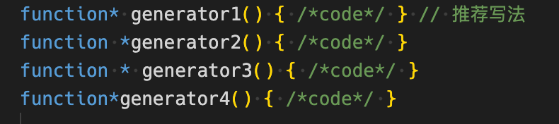

# 01-var、let、const的区别

### 1、var 声明的变量会挂载在 window 对象上，而 let 和 const 声明的变量不会

举例：

```js
var a = '我是a';
console.log(a); // 打印结果：我是a
console.log(window.a); // 打印结果：我是a
```

```js
let b = '我是b';
console.log(b); // 打印结果：我是b
console.log(window.b); // 打印结果：undefined
```

```js
let c = '我是c';
console.log(c); // 打印结果：我是c
console.log(window.b); // 打印结果：undefined
```

var 的这一特性，会造成 window 全局变量的污染。举例如下：

```js
var innerHeight = 100;
console.log(window.innerHeight); // 打印结果：永远都是100  ==> 会覆盖 window 自带的 innerHeight 属性
```

### 2、var 声明的变量存在变量提升，let 和 const 声明的变量不存在变量提升

举例：(先使用，再声明)

```js
console.log(a); // 打印结果：undefined ==> a已经声明但没有赋值
var a = '我是a';
```

```js
console.log(b); // 报错：Uncaught ReferenceError: Cannot access 'b' before initialization ==> 找不到b这个变量
let b = '我是b';
```

```js
console.log(c); // 报错：Uncaught ReferenceError: Cannot access 'c' before initialization ==> 找不到c这个变量
const c = '我是c';
```

### 3、var 声明不存在块级作用域，let 和 const 声明存在块级作用域

举例：

```js
{
    var a = '我是a';
    let b = '我是b';
    const c = '我是c';
}

console.log(a); // 我是a
console.log(b); // 报错：Uncaught ReferenceError: b is not defined ==> 找不到b这个变量
console.log(c); // 报错：Uncaught ReferenceError: c is not defined ==> 找不到c这个变量
```

报错是因为找不到 b 和 c 这两个变量。

### [#](https://web.qianguyihao.com/07-JavaScript进阶/01-var、let、const的区别.html#_4、同一作用域下-var-可以重复声明变量-let-和-const-不能重复声明变量)4、同一作用域下，var 可以重复声明变量，let 和 const 不能重复声明变量

```js
var a = '我是a';
var a = 'qianguyihao';
console.log(a); // 打印结果：qianguyihao
```

```js
let b = '我是b';
let b = 'qianguyihao';
console.log(b); //报错：Uncaught SyntaxError: Identifier 'b' has already been declared  ==> 变量 b 已经被声明了
```

```js
const c = '我是c';
const c = 'qianguyihao';
console.log(c); //报错：Uncaught SyntaxError: Identifier 'c' has already been declared  ==> 变量 c 已经被声明了
```

### 5、let 和 const 的暂时性死区（TDZ）

##### 1. **什么是暂时性死区？**

- 对于使用 let 和 const 声明的变量，从代码块（通常是 {}）开始到变量实际声明的位置之前，这段区域称为暂时性死区。
- 在 TDZ 内，访问变量会导致 ReferenceError，因为变量尚未被初始化。
- 这一点与 var 不同，var 声明的变量在声明前会被提升（hoisted）并初始化为 undefined，因此不会触发类似错误。

**举例 1**：（表现正常）

```js
const name = 'qianguyihao';

function foo() {
    console.log(name);
}

foo(); // 执行函数后，打印结果：smyhvae
```

上方例子中， 变量 name 被声明在函数外部，此时函数内部可以直接使用。

**举例 2**：（报错）

```js
const name = 'qianguyihao';

function foo() {
    console.log(name);
    const name = 'hello';
}

foo(); // 执行函数后，控制台报错：Uncaught ReferenceError: Cannot access 'name' before initial
```

代码解释：如果在当前块级作用域中使用了变量 name，并且当前块级作用域中通过 let/const 声明了这个变量，那么，**声明语句必须放在使用之前，也就是所谓的 DTC（暂时性死区）**。DTC 其实是一种保护机制，可以让我们养成良好的编程习惯。

关于”暂时性死区“的更多介绍，详本项目的另一篇文章《JavaScript之ES6语法：变量let、const和块级作用域.md》。

### 6、const：一旦声明必须赋值；声明后不能再修改

一旦声明必须赋值：

```js
const a;
console.log(a); // 报错：Uncaught SyntaxError: Missing initializer in const declaration
```

### 总结

基于上面的种种区别，我们可以知道：var 声明的变量，很容易造成全局污染。以后我们尽量使用 let 和 const 声明变量吧。

## const 常量到底能不能被修改

我们知道：用 const 声明的变量无法被修改。但还有一点，我们一定要记住：

- 如果用 const 声明基本数据类型，则无法被修改；
- 如果用 const 声明引用数据类型（即“对象”），这里的“无法被修改”指的是**不能改变内存地址的引用**；但对象里的内容是可以被修改的。

>在 JavaScript 中，const 声明的变量并不是完全不可变，而是其**绑定**（binding）不可变。具体到对象，const 限制的是变量对对象的**引用**不能被重新赋值，但并不限制对象内部属性的修改。

举例 1：（不能修改）

```js
const name = 'qianguyihao';
name = 'vae'; // 因为无法被修改，所以报错：Uncaught TypeError: Assignment to constant variable
```

举例 2：（不能修改）

```js
const obj = {
    name: 'qianguyihao',
    age: 28,
};

obj = { name: 'vae' }; // 因为无法被修改，所以报错：Uncaught TypeError: Assignment to constant variable
```

举例 3：（可以修改）

```js
const obj = {
    name: 'qianguyihao',
    age: 28,
};
obj.name = 'vae'; // 对象里的 name 属性可以被修改
```

因为 变量名 obj 是保存在**栈内存**中的，它代表的是对象的引用地址，它是基本数据类型，无法被修改。但是 obj 里面的内容是保存在**堆内存**中的，它是引用数据类型，可以被修改。

# 02-浅拷贝和深拷贝

## [#](https://web.qianguyihao.com/07-JavaScript进阶/02-浅拷贝和深拷贝.html#前言)前言

在 JavaScript 的编程中经常需要对数据进行复制，这就涉及到浅拷贝和深拷贝，是非常重要的概念。

## 浅拷贝

### [#](https://web.qianguyihao.com/07-JavaScript进阶/02-浅拷贝和深拷贝.html#概念)概念

创建一个新的对象B，来接收你要重新复制的对象A的值：

- 如果对象A里面的属性是基本类型，拷贝的是基本类型的值；
- 但如果对象A里面的属性是引用类型，拷贝的是内存中的**地址**（不是拷贝**值**）。也就是说，拷贝后的内容和原始内容，指向的是同一个地址。如果一个对象的属性值发生了变化，另一个对象的属性值也会发生变化。

浅拷贝在拷贝引用类型的数据时，只拷贝**第一层**的属性，再深层的属性无法进行拷贝。用一个成语形容叫“藕断丝连”。

#### 示例 1：基本类型和引用类型的浅拷贝

```js
const objA = {
  name: 'qianguyihao', // 基本类型
  info: { city: 'Beijing' } // 引用类型
};
const objB = { ...objA }; // 浅拷贝

// 修改基本类型
objB.name = 'vae';
console.log(objA.name); // 'qianguyihao'（不受影响）
console.log(objB.name); // 'vae'（独立修改）

// 修改引用类型
objB.info.city = 'Shanghai';
console.log(objA.info.city); // 'Shanghai'（受影响）
console.log(objB.info.city); // 'Shanghai'（修改成功）
```

>info 的值是一个地址，指向堆内存中的 { city: 'Beijing' }。

#### 示例 2：数组的浅拷贝

```js
const arrA = [1, 2, { num: 3 }];

// 浅拷贝：使用展开运算符
const arrB = [...arrA];

console.log(arrA); // [1, 2, { num: 3 }]
console.log(arrB); // [1, 2, { num: 3 }]

// 修改基本类型
arrB[0] = 10;
console.log(arrA[0]); // 1（不受影响）
console.log(arrB[0]); // 10（修改成功）

// 修改引用类型
arrB[2].num = 30;
console.log(arrA[2].num); // 30（受影响）
console.log(arrB[2].num); // 30（修改成功）
```


## [#](https://web.qianguyihao.com/07-JavaScript进阶/02-浅拷贝和深拷贝.html#深拷贝)深拷贝

###  概念

创建一个新的对象B，来接收你要重新复制的对象A的值：

- 在堆内存中开辟了一块全新的内存地址，将对象A的属性完全复制过来。
- 这两个对象相互独立、互不影响，彻底实现了内存上的分离。

下面讲一下实现深拷贝的几种方式

### 方式1：JSON.stringify() 和 JSON.parse()

这是最简单的深拷贝方法，先把对象序列化成 json 字符串，然后将JSON 字符串生成一个新的对象。

**JSON.stringify(obj)**：

- 将 JavaScript 对象（或数组）序列化为一个 JSON 格式的字符串。
- 这个过程会递归遍历对象的所有属性（包括嵌套对象），将它们转换为字符串形式。
- 基本类型（如 number、string、boolean、null）直接转为对应的字符串表示，引用类型（如对象、数组）被展开为字符串化的结构。
- 例如：{ name: 'qianguyihao', info: { city: 'Beijing' } } 变成 "{\"name\":\"qianguyihao\",\"info\":{\"city\":\"Beijing\"}}".

**JSON.parse(str)**：

- 将 JSON 字符串解析为一个新的 JavaScript 对象。
- 解析过程会重新分配内存，生成一个全新的对象结构。
- 新对象的所有属性（包括嵌套对象）都是新创建的，与原对象没有任何引用关系。

代码实现：

```js
let obj1 = { a:1, b:[1,2,3] }
let str = JSON.stringify(obj1)；
let obj2 = JSON.parse(str)；
console.log(obj2);   //{a:1,b:[1,2,3]}

obj1.a = 2；
obj1.b.push(4);
console.log(obj1);   //{a:2,b:[1,2,3,4]}
console.log(obj2);   //{a:1,b:[1,2,3]}
```

方式1属于乞丐版。缺点是：

（1）主要缺点：

- 无法拷贝函数、undefined、symbol。经过 JSON.stringify 序列化之后的字符串中这个键值对会消失。
- 无法拷贝 Map、Set；
- 无法拷贝对象的循环引用，即 obj[key] = obj。

（2）其他缺点：

- 拷贝 Date 引用类型会变成字符串；
- 拷贝 RegExp 引用类型会变成空对象；
- 无法拷贝不可枚举的属性；
- 无法拷贝对象的原型链；
- 对象中含有 NaN、Infinity 以及 -Infinity，JSON 序列化的结果会变成 null；

无法拷贝函数的代码举例：

```js
const obj = { fn: () => {}, name: 'qianguyihao' };
console.log(JSON.stringify(obj)); // {"name":"qianguyihao"}
```

无法拷贝循环引用的代码举例：

```js
const obj = { fn: () => {}, name: 'qianguyihao' };
obj.self = obj;
/*
	控制台报错：
		Uncaught TypeError: Converting circular structure to JSON
		--> starting at object with constructor 'Object'
		--- property 'self' closes the circle
		at JSON.stringify (<anonymous>)
*/
console.log(JSON.stringify(obj));
```

小结：如果你的数据结构是简单的数据类型，使用方式1是最简单和快捷的选择；但如果数据类型稍微复杂一点，方式1 就不行了。

### 方式2：手写递归

如果只考虑简单的数组、对象，方式2是满足要求的。

```js
function deepClone(obj = {}) {
    // 1、判断是值类型还是引用类型
    if (typeof obj !== 'object' || obj == null) {
        return obj;
    }

    // 2、判断是数组还是对象
    let result;
    if (obj instanceof Array) {
        result = [];
    } else {
        result = {};
    }

    // 3、遍历属性并递归复制
    for (let key in obj) {
        if (obj.hasOwnProperty(key)) { // 过滤掉继承的属性，只处理 obj 自身的属性。
            result[key] = deepClone(obj[key]);
        }
    }

    return result;
}
```

上面的代码，还有一种写法，更容易理解：

```js
function deepClone(obj) {
    let cloneObj = {}
    for(let key in obj) {                 // 遍历
        if(typeof obj[key] ==='object') {
        cloneObj[key] = deepClone(obj[key])  // 是对象就再次调用该函数递归
        } else {
        cloneObj[key] = obj[key]  // 如果是基本类型，直接复制值
        }
    }
    return cloneObj
}

let obj1 = {
    a:{
        b:1
    }
}
let obj2 = deepClone(obj1);
obj1.a.b = 2;
console.log(obj2);   //  {a:{b:1}}
```

方式2只考虑了 object 和 Array这种 对普通的引用类型的值，是属于比较基础的深拷贝。缺点是：

（1）主要缺点：

- 无法拷贝函数 Function。
- 无法拷贝 Map、Set。
- 无法拷贝对象的循环引用，即 obj[key] = obj。

（2）其他缺点：

- 无法拷贝不可枚举的属性以及 Symbol 类型。
- 无法拷贝 Date、RegExp、Error 这样的引用类型。

### 方式3：改进版

针对上面几个问题，可以用如下几点改进：

（1）针对能够遍历对象的不可枚举属性以及 Symbol 类型，我们可以使用 Reflect.ownKeys 方法；

（2）当参数为 Date、RegExp 类型，则直接生成一个新的实例返回；

（3）利用 Object 的 getOwnPropertyDescriptors 方法可以获得对象的所有属性，以及对应的特性，顺便结合 Object 的 create 方法创建一个新对象，并继承传入原对象的原型链；

（4）利用 WeakMap 类型作为 Hash 表，因为 WeakMap 是弱引用类型，可以有效防止内存泄漏（你可以关注一下 Map 和 weakMap 的关键区别，这里要用 weakMap），作为检测循环引用很有帮助，如果存在循环，则引用直接返回 WeakMap 存储的值。

```js
/**
 * 深拷贝
 * @param obj obj
 * @param map weakmap 为了避免循环引用
 */
function cloneDeep(obj, map = new WeakMap()) {
    if (typeof obj !== 'object' || obj == null ) return obj

    // 避免循环引用
    const objFromMap = map.get(obj)
    if (objFromMap) return objFromMap

    let target = {}
    map.set(obj, target)

    // Map
    if (obj instanceof Map) {
        target = new Map()
        obj.forEach((v, k) => {
            const v1 = cloneDeep(v, map)
            const k1 = cloneDeep(k, map)
            target.set(k1, v1)
        })
    }

    // Set
    if (obj instanceof Set) {
        target = new Set()
        obj.forEach(v => {
            const v1 = cloneDeep(v, map)
            target.add(v1)
        })
    }

    // Array
    if (obj instanceof Array) {
        target = obj.map(item => cloneDeep(item, map))
    }

    // Object
    for (const key in obj) {
        const val = obj[key]
        const val1 = cloneDeep(val, map)
        target[key] = val1
    }

    return target
}
```

# 迭代器

## 迭代器

### [#](https://web.qianguyihao.com/07-JavaScript进阶/03-迭代器和生成器.html#概念)概念

**迭代器**（Iterator）是 JavaScript 中一种特殊的对象，它提供了一种**统一的、通用的**方式**遍历**个各种不同类型的数据结构。可以遍历的数据结构包括：数组、字符串、Set、Map 等**可迭代对象**。我们也可以自定义实现迭代器，以支持遍历自定义的数据结构。

通过迭代器，我们可以按顺序逐个获取数据中的元素，不需要手动跟踪索引（索引也可称之为指针、游标）。迭代器的行为很像数据库中的游标（cursor）。

我们也不需要关心可迭代对象内部的实现细节，即不需要关心目标对象是数组还是字符串，还是其他的数据结构。对于迭代器来说，这些数据结构都是一样的处理方式。

迭代器是一种常见的编程模式，最早出现在1974年设计的CLU编程语言中。不仅仅在JS中，其他许多编程语言（比如 Java、Python 等）都提供了迭代器的概念和实现。技术实现各有不同，但目的都是帮助我们用通用的方式遍历对象的数据结构，提高代码的简洁性、可读性和维护性。

### [#](https://web.qianguyihao.com/07-JavaScript进阶/03-迭代器和生成器.html#迭代协议)迭代协议

迭代协议并不是编程语言的内置实现或语法，而是协议。迭代协议具体分为两个协议：可迭代协议、迭代器协议。

**迭代器协议**规定了产生一系列值（无论是有限个还是无限个）的标准方式。

迭代器是一个具体的对象，这个对象要符合迭代器协议。**在JS中，某个对象只有实现了符合特定要求的 next() 方法，这个对象才能成为迭代器**。

### [#](https://web.qianguyihao.com/07-JavaScript进阶/03-迭代器和生成器.html#实现原理-next-方法)实现原理：next() 方法

在JS中，迭代器的实现原理是通过定义一个特定的`next()` 方法，该方法在每次迭代中返回一个包含两个属性的对象：done 和 value。

具体来说，next() 方法有如下要求：

（1）参数：无参数或者有一个参数。

（2）返回值：返回一个应当有以下两个属性的对象。属性值如下：

- done 属性（Boolean 类型）：表示迭代是否已经完成。当迭代器遍历完所有元素时，done 为 true，否则为 false。具体解释如下：
  - 如果迭代器可以产生序列中的下一个值，则为 false，这等价于没有指定 done 属性。
  - 如果迭代器已将序列迭代完毕，则为 true。这种情况下，value 可以省略，如果 value 依然存在，即为迭代结束之后的默认返回值。
- value 属性：包含当前迭代步骤的值，可能是具体的值，也可能是 undefined。每次调用 next() 方法时，迭代器返回下一个值。done 为true时，可以省略。

### [#](https://web.qianguyihao.com/07-JavaScript进阶/03-迭代器和生成器.html#举例-为数组创建迭代器)举例：为数组创建迭代器

按照上面讲的迭代器协议，我们可以给一个数组手动创建一个用于遍历的迭代器。代码举例如下：

```js
const strArr = ['qian', 'gu', 'yi', 'hao'];

// 为数组封装迭代器
function createArrayIterator(arr) {
  let index = 0;
  return {
    next: () => {
      if (index < arr.length) {
        return { done: false, value: arr[index++] };
      } else {
        return { done: true };
      }
    },
  };
}

const strArrIterator = createArrayIterator(strArr);
console.log(JSON.stringify(strArrIterator.next()));
console.log(JSON.stringify(strArrIterator.next()));
console.log(JSON.stringify(strArrIterator.next()));
console.log(JSON.stringify(strArrIterator.next()));
console.log(JSON.stringify(strArrIterator.next()));
```

打印结果：

```text
{"done":false,"value":"qian"}
{"done":false,"value":"gu"}
{"done":false,"value":"yi"}
{"done":false,"value":"hao"}
{"done":true}
```

## 可迭代对象

我们要注意区分一些概念：迭代器、可迭代对象、容器。迭代器是提供迭代功能的对象。可迭代对象是被迭代的目标对象，也称之为容器。

### 概念

当一个对象实现了 **iterable protocol 协议**时，它就是一个可迭代对象。这个对象要求必须实现了 `@@iterator` 方法，在内部封装了迭代器。我们可以通过 `Symbol.iterator` 函数调用该迭代器。

当我们使用迭代器的方式去遍历数组、字符串、Set、Map 等数据结构时，这些数据对象就属于可迭代对象。这些数据对象本身，内部就自带了迭代器。

可是，有些数据对象，并不具备可迭代的能力，那要怎么封装成可迭代对象呢？以及，可迭代对象需要具备什么特征？可迭代对象有什么用处？这就是本段要讲的内容。

### [#](https://web.qianguyihao.com/07-JavaScript进阶/03-迭代器和生成器.html#可迭代对象的特征)可迭代对象的特征

凡是可迭代对象，都具备如下特征：

1、可迭代对象都有一个 [Symbol.iterator] 函数。通过这个函数，我们可以进行数据遍历操作。以一个简单的数组进行举例：

```js
const myArr = ['qian', 'gu', 'yi', 'hao'];

console.log(typeof myArr[Symbol.iterator]);
console.log(myArr[Symbol.iterator]);

console.log(typeof myArr[Symbol.iterator]());
console.log(myArr[Symbol.iterator]());
// 获取数组自带的迭代器对象
const myIterator = myArr[Symbol.iterator]();

// 通过迭代器的 next() 方法遍历数组
console.log(myIterator.next());
console.log(myIterator.next());
console.log(myIterator.next());
console.log(myIterator.next());
console.log(myIterator.next());
```

打印结果：


2、可迭对象可以进行 for ... of 操作。其实 for ... of 底层就是调用了 `@@iterator` 方法。代码举例：

```js
const myArr = ['qian', 'gu', 'yi', 'hao'];

// 可迭代对象可以进行 for ... of 操作。for ... of 也是一种遍历操作。
for (const item of myArr) {
  // 这里的 item，其实就是迭代器里的 value 属性的值。
  console.log(item);
}
```

打印结果：

```text
qian
gu
yi
hao
```

### 原生可迭代对象

以下这些对象，都是原生可迭代对象，请务必记住：

- String 字符串
- Array 数组
- Map
- Set
- arguments 对象
- NodeList 对象（DOM节点的集合）

原生可迭代对象的内部已经实现了可迭代协议，它们都符合可迭代对象的特征。比如，它们内部都有一个迭代器；他们可以用 for ... of 进行遍历。

为何要记住上面这些可迭代对象，因为可迭代对象的应用场景非常多，且非常好用。我们继续往下学习。

### 可迭代对象的应用场景（重要）

可迭代对象有许多应用场景，包括但不仅限于：

1、JavaScript的语法：

- for ... of
- 展开语法 ...
- yield*
- 解构赋值

2、创建一些对象：

- new Map([Iterable])：参数是可选的，可不传参数，也可以传一个可迭代对象作为参数
- new WeakMap([iterable])
- new Set([iterable])
- new WeakSet([iterable])

3、方法调用

- Array.from(iterable)：将一个可迭代对象转为数组
- Promise.all(iterable)
- Promise.race(iterable)

今后在遇到这些应用场景时，这些原生可迭代对象可以直接拿来用。

比如说，通过阅读官方文档后我们得知，`new Set()`的写法中，括号里的参数可以不写，也可以传入一个可迭代对象 `iterable`。那么，字符串、数组、Set、Map等可迭代对象，在你需要的时候都可以传进去使用。而且，`const a = new Set()`写法中，变量 a 也是一个可迭代对象。

`Promise.all(iterable)` 只能传数组吗？非也。准确来说，Promise.all()的参数中，传入的不是数组，而是一个可迭代对象。代码举例：

```js
const promise1 = Promise.resolve('promise1 resolve');
const promise2 = Promise.resolve('promise2 resolve');
const promise3 = Promise.resolve('promise3 resolve');

const promiseSet = new Set();
promiseSet.add(promise1);
promiseSet.add(promise2);
promiseSet.add(promise3);

// 准确来说，Promise.all()的参数中，传入的不是数组，而是一个可迭代对象
Promise.all(promiseSet).then(res => {
  console.log('res:', res);
});
```

代码举例：

```text
res: ['promise1 resolve', 'promise2 resolve', 'promise3 resolve']
```

arguments 同样是一个可迭代对象，但不是数组。我们可以通过`Array.from(iterable)`方法将 arguments 转为数组，进而让其享受数组的待遇，调用数组的各种方法。代码举例：

```js
foo('a', 'b', 'c');

// 定义函数
function foo() {
  // Array.from() 中的参数可以传入可迭代对象，将参数转为数组。arguments 是 foo() 函数的参数
  const arr = Array.from(arguments);
  console.log(arr);
}
```

打印结果：

```text
['a', 'b', 'c']
```

学完了迭代器、可迭代对象的知识之后，很多关于函数传参、数据遍历、数据结构等方面的JS知识，就能融会贯通了。

## [#](https://web.qianguyihao.com/07-JavaScript进阶/03-迭代器和生成器.html#手写迭代器)手写迭代器

很多数据对象由于不是可迭代对象，我们可以为其手动创建一个迭代器，这个数据对象就成了可迭代对象。

### [#](https://web.qianguyihao.com/07-JavaScript进阶/03-迭代器和生成器.html#为普通对象创建外部迭代器)为普通对象创建外部迭代器

代码举例：

```js
const myObj1 = {
  strArr: ['qian', 'gu', 'yi', 'hao'],
};

// 为 myObj.strArr 封装迭代器
let index = 0;
const strArrIterator = {
  next: () => {
    if (index < myObj1.strArr.length) {
      return { done: false, value: myObj1.strArr[index++] };
    } else {
      return { done: true };
    }
  },
};

console.log(strArrIterator.next());
console.log(strArrIterator.next());
console.log(strArrIterator.next());
console.log(strArrIterator.next());
console.log(strArrIterator.next());
```

打印结果：

```text
{done: false, value: 'qian'}
{done: false, value: 'gu'}
{done: false, value: 'yi'}
{done: false, value: 'hao'}
{done: true}
```

### 将普通对象封装为可迭代对象

上面的数据 myObj1，不属于可迭代对象，因此我们单独写了一个迭代器对象 strArrIterator。但是这两个对象是分开的。

还有一种更高级的做法是，把迭代器封装到数据对象的内部。完事之后，这个数据对象就是妥妥的可迭代对象。

将普通的数据对象封装为可迭代对象时，**具体做法**是：在数据对象内部，创建一个名为`[Symbol.iterator]`的迭代器函数，这个函数名是固定的（这种写法属于计算属性名）；然后这个函数内需要返回一个迭代器，用于迭代当前的数据对象。

我们以下面这两个对象为例：

```js
const myObj1 = {
  strArr: ['qian', 'gu', 'yi', 'hao'],
};

const myObj2 = {
  name: 'qianguyihao',
  skill: 'web',
};
```

如果尝试用 for of 去遍历它们，会报错：

```js
const myObj2 = {
  name: 'qianguyihao',
  skill: 'web',
};

for (const item of myObj2) {
   // 打印报错：Uncaught TypeError: myObj2 is not iterable。意思是：myObj2 不是可迭代对象
  console.log(item);
}
```

所以，我们可以将这两个普通对象封装为可迭代对象。

1、将 myObj1 封装为可迭代对象，遍历 myObj1.strArr。代码举例如下：

```js
const myObj1 = {
  strArr: ['qian', 'gu', 'yi', 'hao'],
  // 在 myObj1 的内部创建一个迭代器
  [Symbol.iterator]: function () {
    let index = 0;
    const strArrIterator = {
      next: function () {
        if (index < myObj1.strArr.length) {
          return { done: false, value: myObj1.strArr[index++] };
        } else {
          return { done: true };
        }
      },
    };
    return strArrIterator;
  },
};

// 获取 myObj1 的迭代器对象
const strArrIterator = myObj2[Symbol.iterator]();
// 通过迭代器遍历 myObj1.strArr 的数据
console.log(strArrIterator.next());
console.log(strArrIterator.next());
console.log(strArrIterator.next());
console.log(strArrIterator.next());
console.log(strArrIterator.next());
```

打印结果：

```text
{done: false, value: 'qian'}
{done: false, value: 'gu'}
{done: false, value: 'yi'}
{done: false, value: 'hao'}
{done: true}
```

上方代码有一个改进之处，如果把迭代器函数改成箭头函数，就可以通过 `this.strArr` 代表 `myObj2.strArr` 了，写法更简洁。代码改进如下：

```js
const myObj1 = {
  strArr: ['qian', 'gu', 'yi', 'hao'],
  // 在 myObj1 的内部创建一个迭代器
  [Symbol.iterator]: function () {
    let index = 0;
    const strArrIterator = {
      next: () => {
        if (index < this.strArr.length) {
          return { done: false, value: this.strArr[index++] };
        } else {
          return { done: true };
        }
      },
    };
    return strArrIterator;
  },
};

// 获取 myObj1 的迭代器对象
const strArrIterator = myObj2[Symbol.iterator]();
// 通过迭代器遍历 myObj1.strArr 的数据
console.log(strArrIterator.next());
console.log(strArrIterator.next());
console.log(strArrIterator.next());
console.log(strArrIterator.next());
console.log(strArrIterator.next());
```

打印结果不变。

2、将 myObj2 封装为可迭代对象，遍历里面的键值对。代码举例如下：

```js
const myObj2 = {
  name: 'qianguyihao',
  skill: 'web',
  // 将普通对象 myObj2 封装为可迭代对象，目的是遍历 myObj2 的键值对
  [Symbol.iterator]: function () {
    // const keys = Object.keys(this); // 获取对象的 key
    // const values = Object.values(this); // 获取对象的 value
    const entries = Object.entries(this); // 获取对象的键值对
    let index = 0;
    const iterator = {
      next: () => {
        if (index < entries.length) {
          return { done: false, value: entries[index++] };
        } else {
          return { done: true };
        }
      },
    };
    return iterator;
  },
};

// 可迭对象可以进行for of操作，遍历对象的键值对
for (const item of myObj2) {
  const [key, value] = item;
  console.log(key, value);
}
```

打印结果：

```text
name qianguyihao
skill web
```

### [#](https://web.qianguyihao.com/07-JavaScript进阶/03-迭代器和生成器.html#将自定义类封装为可迭代对象)将自定义类封装为可迭代对象

在面向对象开发时，如果你希望自己创建的类也具备可迭代的能力，那么，你可以在定义类的时候手动添加一个 `@@iterator`方法，让其成为可迭代对象。

代码举例：

```json
// 定义类
class Person {
  constructor(name, arr) {
    this.name = name;
    this.arr = arr;
  }

  // 定义一个名为 [Symbol.iterator] 的实例方法，封装迭代器
  [Symbol.iterator]() {
    let index = 0;
    const iterator = {
      next: () => {
        if (index < this.arr.length) {
          return { done: false, value: this.arr[index++] };
        } else {
          return { done: true };
        }
      },
    };
    return iterator;
  }
}

const person1 = new Person('千古壹号', ['前端', '工程师']);
const person2 = new Person('许嵩', ['想象之中', '有何不可']);

// Person的实例已经封装为可迭代对象了，可以通过 for ... of 进行遍历
for (const item of person2) {
  console.log(item);
}
```

打印结果：

```text
想象之中
有何不可
```

### 如何中断迭代器，停止继续遍历

迭代器在遍历数据对象的过程中，如果我们希望在符合指定条件下停止继续遍历，那么，我们可以使用 break、return、throw 等关键字中断迭代器。其中， break 关键字用得最多。

此外，我们还可在迭代器函数中添加一个名为`return()`的方法，这个方法的作用是监听迭代器的中断，书写代码的位置与 `next()`方法并列。

代码举例如下：

```js
const myObj2 = {
  name: 'qianguyihao',
  skill: 'web',
  // 将普通对象 myObj2 封装为可迭代对象，目的是遍历 myObj2 的键值对
  [Symbol.iterator]: function () {
    const entries = Object.entries(this); // 获取对象的键值对
    let index = 0;
    const iterator = {
      next: () => {
        if (index < entries.length) {
          return { done: false, value: entries[index++] };
        } else {
          return { done: true };
        }
      },
      // 【关键代码】监听迭代器的中断
      return: () => {
        console.log('迭代器被中断了');
        return { done: true };
      },
    };
    return iterator;
  },
};

// 可迭对象可以进行 for of 操作，遍历对象的键值对
for (const item of myObj2) {
  const [key, value] = item;
  console.log(key, value);
  if (value == 'qianguyihao') {
    // 【关键代码】如果发现 value 为 qianguyihao，则中断迭代器，停止继续遍历
    break;
  }
}
```

打印结果：

```text
name qianguyihao
迭代器被中断了
```

根据打印结果可以看出，迭代器只遍历了 myObj2 对象的第一个元素，符合指定条件后，通过 break 语句中断了迭代器，停止了继续遍历；与此同时，迭代器中的 return() 函数监听到了迭代器的中断。对了，return() 函数中，还需要写 `return { done: true }`表示迭代器的使命已结束；如果不写这行则会报错：`Uncaught TypeError: Iterator result undefined is not an object`。

## 生成器

### [#](https://web.qianguyihao.com/07-JavaScript进阶/03-迭代器和生成器.html#概念-3)概念

我们平时写的函数，基本是通过 return 返回值，或者发生异常，函数才会终止执行。这还不够灵活。

**生成器**是 ES6 中新增的一种特殊的函数，所以也称为“生成器函数”。它可以更灵活地控制函数什么时候执行， 什么时候暂停等等，**控制精度很高**。

生成器函数使用 `function*` 语法编写。最初调用时，生成器函数不执行任何代码，而是返回一个称为 Generator 的迭代器。通过调用生成器的 next() 方法时，Generator 函数将执行，直到遇到 yield 关键字时暂停执行。

可以根据需要多次调用该函数，并且每次都返回一个新的 Generator，但每个 Generator 只能迭代一次。

### [#](https://web.qianguyihao.com/07-JavaScript进阶/03-迭代器和生成器.html#生成器函数和普通函数的区别)生成器函数和普通函数的区别

- 生成器函数需要在 `function` 关键字后面加一个符号 `*`。
- 生成器函数可以通过 `yield` 关键字控制函数的执行流程。
- 生成器函数的返回值是一个生成器（Generator）。生成器是一种特殊的迭代器。

## [#](https://web.qianguyihao.com/07-JavaScript进阶/03-迭代器和生成器.html#生成器函数拆解)生成器函数拆解

### [#](https://web.qianguyihao.com/07-JavaScript进阶/03-迭代器和生成器.html#定义一个生成器函数)定义一个生成器函数

如果要定义一个生成器函数，我们需要在`function`单词和函数名之间加一个`*`符号。

`*`符号有下面四种写法，最推荐的是第一种写法：

```js
function* generator1() { /*code*/ } // 推荐写法
function *generator2() { /*code*/ }
function * generator3() { /*code*/ }
function*generator4() { /*code*/ }
```

截图如下：



代码举例：

```js
function* foo() {
  console.log('1');
  console.log('2');
  console.log('3');
}

foo();
```

### yield 表达式

但是上面的代码写完后，并不会有打印结果，因为**我们还需要调用生成器的 next()方法，生成器函数才会执行，直到遇到 yield 关键字后暂停执行**；反反复复，**直到遇到 return关键字，或者遇到函数末尾时，结束执行**。代码举例：

```js
// 通过 * 符号，定义一个生成器函数
function* foo() {
  console.log('1');
  yield;

  console.log('2');
  // 下面这行 console.log('a') 会跟 yield 一起执行
  yield console.log('a');

  console.log('3');
}

const generator = foo(); // 返回一个生成器对象
// 调用生成器的 next()方法，生成器才会执行，直到遇到 yield 后暂停执行
generator.next(); // 这行代码执行后，打印结果是：1
generator.next(); // 这行代码执行后，打印结果是：1 2 a
generator.next(); // 这行代码执行后，打印结果是：1 2 a 3
```

仔细看注释，生成器 generator 每调用一次 next() ，foo()函数里的代码就往下执行一次，直到遇到 yield 后暂停。

### next() 方法的返回值

生成器既然是一种特殊的迭代器，那么它也有 next()方法，而且 next()方法里同样有 done 和 value 这两个属性。我们来看看这两个属性的**默认属性值**是什么：

```js
// 通过 * 符号，定义一个生成器函数
function* foo() {
  console.log('阶段1');
  yield;

  console.log('阶段2');
  yield;

  console.log('阶段3');
  return; // 执行 return 之后，函数不再继续往下走了，生成器的 next()方法的 done 属性值为 true。

  console.log('阶段4');
}

// 执行生成器函数，返回一个生成器对象
const generator = foo();
// 调用生成器的 next()方法，生成器才会执行，直到遇到 yield 后暂停执行；遇到 return关键字，或者遇到函数末尾时，结束执行。
console.log(generator.next());
console.log(generator.next());
console.log(generator.next());
```

打印结果：

```text
阶段1
{value: undefined, done: false}

阶段2
{value: undefined, done: false}

阶段3
{value: undefined, done: true}
```

上方代码的打印结果可以看出，生成器函数在遇到函数的末尾，或者遇到 return 之后，函数就不再继续往下走了，next()方法的 done 属性值为 true。

还可以看到，next()方法的 value 属性值默认为 undefined，**如果某些情况下我们希望 value属性有值**的话，可以通过 yield 关键字进行传递。代码举例：

```js
// 通过 * 符号，定义一个生成器函数
function* foo() {
  console.log('阶段1');
  yield 'a'; // 【关键代码】yield 后面写的内容，就是传递给 next() 方法的 value 属性值

  console.log('阶段2');
  yield 'b';

  console.log('阶段3');
  return; // 这里的 return，相当于 return undefined

  console.log('阶段4');
}

// 执行生成器函数，返回一个生成器对象
const generator = foo();
// 调用生成器的 next()方法，生成器才会执行，直到遇到 yield 后暂停执行；遇到 return关键字，或者遇到函数末尾时，结束执行。
console.log(generator.next()); // 打印生成器对象的 next()方法
console.log(generator.next());
console.log(generator.next());
```

打印结果：

```text
阶段1
{value: 'a', done: false}

阶段2
{value: 'b', done: false}

阶段3
{value: undefined, done: true}
```

### next() 方法的参数

根据前面的代码实例得知，生成器函数是分多个阶段执行的。此时有一个诉求：如何给当前阶段传递参数呢？

答案是：可以通过当前阶段 next() 方法的参数，给当前阶段传值。这个参数值会成为**上一个阶段** yield 语句的返回值。

代码举例：

```js
// 通过 * 符号，定义一个生成器函数
function* foo() {
  console.log('阶段1');
  // 【关键代码】第二次调用 next()方法时，通过 res2 接收 next()方法的参数值
  const res2 = yield 'a';

  console.log('阶段2:', res2);
  // 第三次调用 next()方法时，通过 res3 接收 next()方法的参数值
  const res3 = yield 'b';

  console.log('阶段3:', res3);
  return;
}

// 执行生成器函数，返回一个生成器对象
const generator = foo();
// 调用生成器的 next()方法，生成器才会执行，直到遇到 yield 后暂停执行；遇到 return关键字，或者遇到函数末尾时，结束执行。
console.log(generator.next()); // 执行第一阶段
console.log(generator.next('next2')); // 执行第二阶段，并传参
console.log(generator.next('next3')); // 指定第三阶段
```

打印结果：

```text
阶段1
{value: 'a', done: false}

阶段2: next2
{value: 'b', done: false}

阶段3: ntext3
{value: undefined, done: true}
```

第一次学习时，这段代码可能比较难理解。在理解时需要注意的是，将 next2 这个属性值赋值给 res2，这个操作的执行时机是在**第二阶段的最开始**做的，不是在第一阶段的末尾做的。并且，这个属性值是通过第一阶段的 yield 返回值接收的。

### 如何中途结束生成器的执行

如果想在中途结束生成器的执行，有三种方式：

- 方式1：return 语句。这个在前面已经讲过。
- 方式2：通过生成器的 return() 函数。
- 方式3：通过生成器的 throw() 函数抛出异常。

方式2的代码举例：

```js
// 通过 * 符号，定义一个生成器函数
function* foo() {
  console.log('阶段1');
  const res2 = yield 'a';

  console.log('阶段2:', res2);
  const res3 = yield 'b';

  console.log('阶段3:', res3);
  return;
}

// 执行生成器函数，返回一个生成器对象
const generator = foo();
console.log(generator.next());
// 【关键代码】通过生成器的 return()方法， 立即结束 foo 函数的执行
console.log(generator.return('next2'));
// 这行写了也没用，阶段2、阶段3都不会执行的
console.log(generator.next('next3'));
```

打印结果：

```text
阶段1
{value: 'a', done: false}

{value: 'next2', done: true}

{value: undefined, done: true}
```

上方代码可以看出，阶段2、阶段3都不会执行；return()方法里的参数传给了 value 属性。

方式3的代码举例：

```js
// 通过 * 符号，定义一个生成器函数
function* foo() {
  console.log('阶段1');
  const res2 = yield 'a';

  console.log('阶段2:', res2);
  const res3 = yield 'b';

  console.log('阶段3:', res3);
  return;
}

// 执行生成器函数，返回一个生成器对象
const generator = foo();
console.log(generator.next());
// 【关键代码】通过生成器的 throw()方法抛出异常， 立即结束 foo 函数的执行
console.log(generator.throw(new Error('next2 error')));
// 这行写了也没用，阶段2、阶段3都不会执行的
console.log(generator.next('next3'));
```

打印结果：

```text
阶段1
{value: 'a', done: false}

Uncaught Error: next2 error
```

## 生成器的应用

### [#](https://web.qianguyihao.com/07-JavaScript进阶/03-迭代器和生成器.html#用生成器代替迭代器)用生成器代替迭代器

在前面的迭代器内容中，我们学习过“将普通对象封装为可迭代对象”。那段代码改用生成器的写法也可以实现。代码举例：

```js
const myObj2 = {
  name: 'qianguyihao',
  skill: 'web',
  // 将普通对象 myObj2 封装为可迭代对象，目的是遍历 myObj2 的键值对。通过生成器 function* 的的方式实现
  [Symbol.iterator]: function* () {
    const entries = Object.entries(this); // 获取对象的键值对
    for (let index = 0; index < entries.length; index++) {
      // 【关键代码】通过 yield 控制迭代器分阶段执行；并将每个阶段的值存放到迭代器的 next() 方法的 value 属性中
      yield entries[index];
    }
  },
};


// 写法1：通过 for ... of 遍历可迭代对象
for (const item of myObj2) {
  const [key, value] = item;
  console.log(key, value);
}

console.log('---');

// 写法2：通过 next() 方法遍历可迭代对象。与写法1等价。
const iterator = myObj2[Symbol.iterator]();
console.log(iterator.next());
console.log(iterator.next());
console.log(iterator.next());
```

打印结果：

```text
name qianguyihao
demo.html:30 skill web
---
done: false, value:['name', 'qianguyihao']
done: false, value:['skill', 'web']
done: true, value:undefined
```