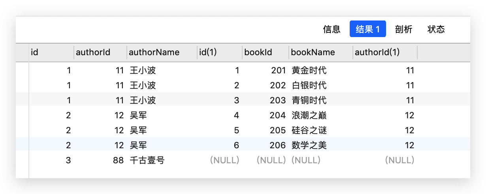

# 04-MySQL字段的数据类型

##  前言

MySQL 中的字段，主要有四种数据类型：

- 整型（整数）
- 小数
- 字符串类型
- 时间日期类型

下面来详细讲一讲。

## 整数类型

### [#](https://web.qianguyihao.com/10-MySQL数据库/04-MySQL字段的数据类型.html#整数类型的分类)整数类型的分类

MySQL中，整型有五种：

- 迷你整型：tinyint，使用**1个字节**存储整数，最多存储256个整数（-128~127）。
- 短整型：smallint，使用**2个字节**存储整数。
- 中整型：mediumint，使用**3个字节**存储整数。
- 标准整型：int，使用**4个字节**存储整数。
- 大整型：bigint，使用**8个字节**存储。

**强调**：

（1）如果你不知道用哪一种，或者懒得计算，那就用标准整型 `int`吧，这个用的最多。

（2）整型在 MySQL 中默认是有符号的，即有正负；无符号需要使用 `unsigned` 修饰整型，代表正整数。

**举例**：

在指定的表中新增 age 字段，要求 age 是正整数：

```sql
alter table table_qiangu1 add age int unsigned;
```

### 设计思路

如果需要新建整型的字段，设计思路如下：

（1）确定需要存储的数据是整数。

（2）预估整数的范围，选择合适的整数类型。

（3）确定这个整数是否需要包含负数。

### 整数类型的显示宽度、零填充

所谓的**显示宽度**，其实就是显示的时候，看到的最少数字个数。

比如 int(2) ，表示不管你的数值是多少，最少可以看到两个数字。假如你存的数值是9，没有满两位，就会在前面补零，显示为`09`；假如你的数值是120，超过了显示宽度，则直接显示原始值，不会做**零填充**。

**显示宽度的注意事项**：

- 显示宽度只适用于 MySQL 的整数类型。
- 显示宽度只是指明 MySQL 整数类型最少显示的数字个数（可以通过desc查看表字段显示）。
- **显示宽度只是在显示的时候改变数值的样式，不会对原本的值进行更改**。
- 显示宽度和数值类型的取值范围无关。例如int(10) 他的取值范围依然是(-2 147 483 648，2 147 483 647)。

**零填充的注意事项**：

- 要想让显示宽度自动进行**零填充**，必须要配合 `ZEROFILL`这个关键字一起使用。
- **零填充只能针对正整数**，也就是说，`ZEROFILL` 要求整型为无符号型。

**举例**：

1、新建一张表，然后在这张表中新增 num1 字段，要求 num1 显示3位，不够3位的自动进行零填充：

```sql
# 新建一张表
CREATE TABLE table_qiangu1 (
  id int NOT NULL AUTO_INCREMENT PRIMARY KEY
);

# 显示宽度有效（正确写法）
alter table table_qiangu1 add num1 int(3) zerofill;

# 对比：普通写法，显示宽度无效
alter table table_qiangu1 add num2 int(3);

# 对比：普通写法
alter table table_qiangu1 add num3 int;
```

上述命令中，如果把 `zerofill` 这个关键字去掉，是达不到显示宽度的效果的。执行完上述命令后，我们执行 `desc table_qiangu1` 命令，对比一下 num1、num2、num3 的字段结构就知道了：

上方截图可以看到，只有 num1 才有显示宽度，它可以进行零填充，num2、num3不行。我们往表中插入整数 `6`，然后看看显示结果，就一目了然：

# 05-MySQL数据库的常用命令

## MySQL 的一些简单命令

我们可以在 Navicat Premium 软件中，创建数据库和表，然后输入查询命令来查询数据。选择菜单栏「查询->新建查询->输入 sql 命令->运行」即可，效果如下：


我们还可以直接在终端输入命令行来操作。

注意，在 Mac 终端执行 sql 命令时，命令的末尾必须加上`;`（英文格式的分号）。效果如下：


MySQL 命令行的一些简单命令如下。

**以 root 身份进入命令行**：

```text
mysql -u root -p
```

**查看有哪些数据库**：

```sql
show databases;
```

**选择进入指定的数据库**：

```sql
use xxx_database;

# 举例
use qianguyihao_database;
```

**在当前数据库中，查看有哪些表**：

```sql
show tables;
```

**在当前数据库中，查询指定表的全部数据**：

```sql
SELECT * FROM xxx_table;

# 举例
SELECT * FROM qianguyihao_student_table
```

**删除指定的表**：

```sql
drop table xxx;

# 举例
drop table qianguyihao_student_table;
```

**删除指定的数据库**：

```sql
drop database qianguyihao_student_table;
```

**创建一个数据库**：

```sql
create database qianguyihao_database2;
```

## where 条件查询

使用 `where` 子句可以对表中的数据进行筛选，结果为 true 的行会出现在查询结果中。

语法格式如下：

```上面的语法格式中，条件 具体要怎么写呢？这个可能有很多种情况。我们继续往下看。
SELECT * FROM 表名 where 条件;
```

### 逻辑运算符

- AND
- OR
- NOT

**举例**：

```sql
# 查询 age 在20至30之间的数据
SELECT * FROM qianguyihao_table WHERE age BETWEEN 20 AND 30;
```

### 范围查询

- `in` 表示在一个非连续的范围内。
- `between ... and ...` 表示在一个连续的范围内

举例：

```sql
# 查询 name 为 千古壹号 或者 许嵩的数据
SELECT * FROM qianguyihao_table WHERE name IN ['千古壹号', '许嵩'];

SELECT * FROM qianguyihao_table WHERE age BETWEEN 20 AND 30;
```

### 模糊查询

- ```
  like
  ```

  - `%` 表示任意多个任意字符
  - `_` 表示一个任意字符

`%` 符号举例：

```sql
# 查询标题中包含“前端”这两个字的数据（“前端”这两个字的前后可能都有内容）
select * from qianguyihao_table where `title` like "%前端%";

# 查询标题以“前端”开头的数据
select * from qianguyihao_table where `title` like "前端%";
```

`_`符号举例：

```sql
# 查询标题，查询条件是：标题中至少有五个字符，而且，这五个字符中，前两个字符一定是“千古”开头的。
SELECT * FROM qianguyihao_table WHERE `title` LIKE "千古___";
```

### NULL 的判断

- `is null` 判断为空
- `is not null` 判断为非空

注意，`is null` 和**空字符串**`""` 是有区别的。学过 js 基础之后，你应该知道：空字符串并非 null，只不过是里面的值为空而已；空字符串也是会占有内存空间的。

举例：

```sql
select * from qianguyihao_table where name is not NULL;
```

## join 联表查询

### [#](https://web.qianguyihao.com/10-MySQL数据库/05-MySQL数据库的常用命令.html#联表查询命令)联表查询命令

- `tableA inner join tableB`：表 A 与表 B 匹配的行会出现在结果中。
- `tableA left join tableB`：表 A 与表 B 匹配的行会出现在结果中。表 A 中独有的数据，对应表 B 中用 null 填充。
- `tableA right join tableB`：表 A 与表 B 匹配的行会出现在结果中。表 B 中独有的数据，对应表 A 中用 null 填充。

光是这样看，不好理解，我们来举个例子。

### [#](https://web.qianguyihao.com/10-MySQL数据库/05-MySQL数据库的常用命令.html#举例)举例

现在有下面这两张表：作者表 author、图书表 book。

**表 1**、作者表 author：

| id   | authorId | authorName |
| :--- | :------- | :--------- |
| 1    | 11       | 王小波     |
| 2    | 12       | 吴军       |
| 3    | 88       | 千古壹号   |

**表 2**、图书表 book：

| id   | bookId | bookName   | authorId |
| :--- | :----- | :--------- | -------- |
| 1    | 201    | 黄金时代   | 11       |
| 2    | 202    | 白银时代   | 11       |
| 3    | 203    | 青铜时代   | 11       |
| 4    | 204    | 浪潮之巅   | 12       |
| 5    | 205    | 硅谷之谜   | 12       |
| 6    | 206    | 数学之美   | 12       |
| 7    | 777    | 设计心理学 | 99       |

注意，表2中的每本图书都有对应的 authorId，这个 authorId 就是对应表1中的 authorId。**通过 authorId 把两张表关联起来**。

通过联表查询上面的两张表，我们来对比一下查询结果。

**情况 0**：（inner join）

```sql
SELECT * FROM author INNER JOIN book;
```

查询结果：


上面这种查询，没有意义，因为没有加任何查询条件。

**情况 1**：（inner join）

```sql
SELECT * FROM author INNER JOIN book ON author.authorId = book.authorId;
```

查询结果：


上面这行命令，跟下面这行命令等价：

```sql
SELECT * FROM author, book WHERE author.authorId = book.authorId;
```

**情况 2**：（left join）

```sql
SELECT * FROM author LEFT JOIN book ON author.authorId = book.authorId;
```

查询结果：

**情况 3**：（right join）

```sql
SELECT * FROM author RIGHT JOIN book ON author.authorId = book.authorId;
```

查询结果：

