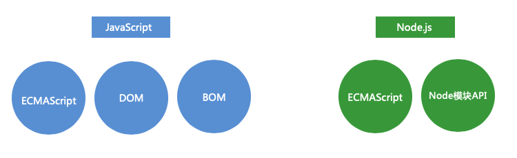
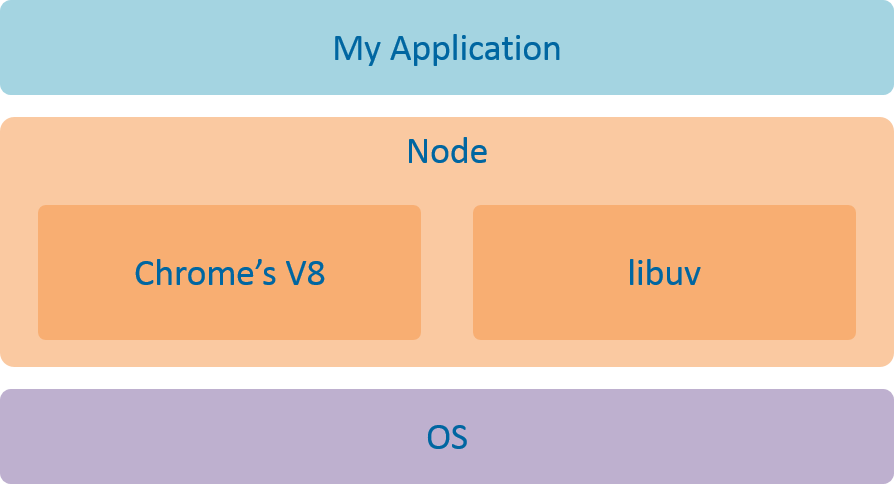
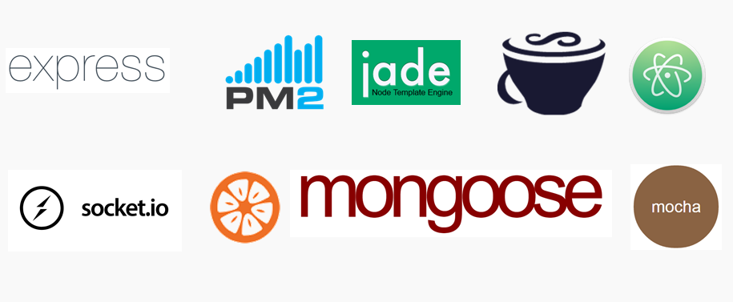
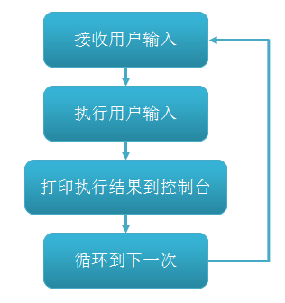
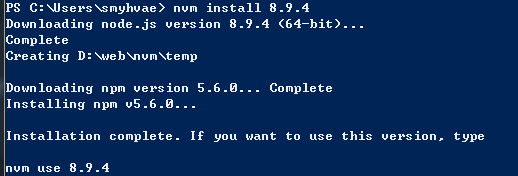
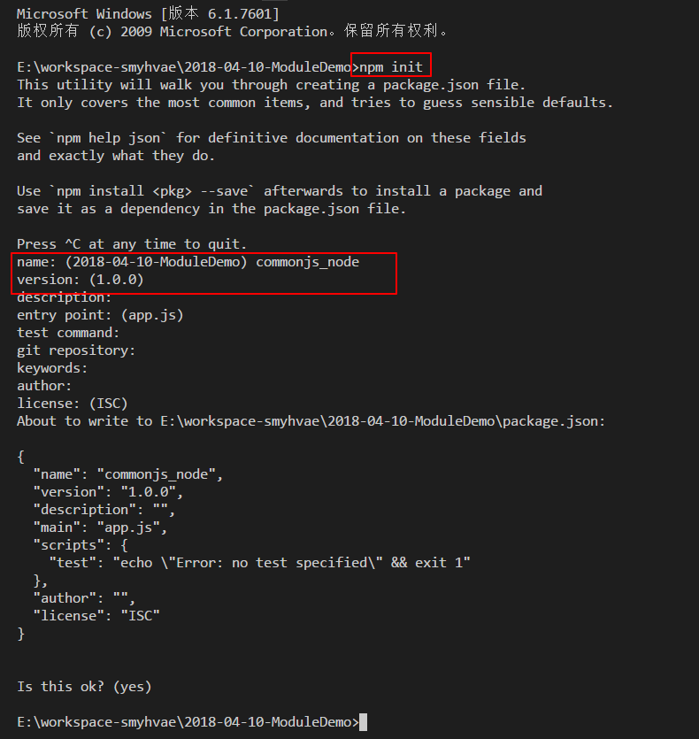
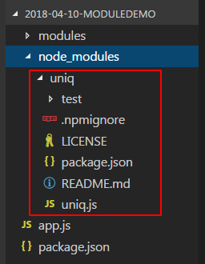
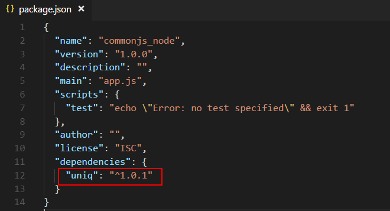

# 01-Node.js介绍

## 前言

Node 的重要性已经不言而喻，很多互联网公司都已经有大量的高性能系统运行在 Node 之上。Node 凭借其单线程、异步等举措实现了极高的性能基准。此外，目前最为流行的 Web 开发模式是前后端分离的形式，即前端开发者与后端开发者在自己喜欢的 IDE 上独立进行开发，然后通过 HTTP 或是 RPC 等方式实现数据与流程的交互。这种开发模式在 Node 的强大功能的引领下变得越来越高效，也越来越受到各个互联网公司的青睐。

### 前端同学为什么要学习后端/后端同学为什么要学习前端

- 了解前后端交互流程。
- 前端同学能够和后台开发的程序员更佳紧密地结合、更顺畅地沟通。
- 当网站的业务逻辑需要前置时，前端人员需要学习一些后台开发的技术，以完成相应的任务；；反过来也一样。
- 拓宽知识视野和技术栈，能够站在全局的角度审视整个项目。

### 前端同学为什么要学 Node.js

1、Node.js 使用 JavaScript 语言开发服务器端应用，**便于前端同学上手**（一些公司甚至要求前端工程师掌握 Node.js 开发）。

2、实现了前后端的语法统一，**有利于和前端代码整合**，甚至共用部分代码。

比如说，针对接口返回的各种字段，前后端都必须要做校验。此时，如果用 Node.js 来做后台开发的话，前后端可以共用校验的代码。

3、Node.js 性能高、生态系统活跃，提供了大量的开源库。

4、Jeff Atwood 在 2007 年提出了著名的 Atwood 定律：**任何能够用 JavaScript 实现的应用系统，最终都必将用 JavaScript 实现**。 Jeff Atwood 是谁不重要（他是 Stack Overflow 网站的联合创始人），重要的是这条定律。

### [#](https://web.qianguyihao.com/11-Node.js/01-Node.js介绍.html#后端同学为什么要学-node-js)后端同学为什么要学 Node.js

因为前端同学在学 Node.js。

## 什么是 Node.js

### 官方定义

[Node.js (opens new window)](https://nodejs.org/zh-cn/)是一个基于 **Chrome V8 引擎**的 JavaScript 运行环境。Node.js 使用了一个**事件驱动**、**非阻塞式 I/O**的模型，使其轻量又高效。Node.js 的包管理工具 npm 是全球最大的开源库生态系统。

Node.js 不是一门语言，也不是 JavaScript 的框架，也不是像Nginx一样的Web服务器 ，**Node.js 是 JavaScript 在服务器端的运行环境（平台）**。

### Node.js 的组成

在 Node.js 里运行 JavaScript，跟在 Chrome 里运行 JavaScript 有什么不同？

二者采用的是同样的 JS 引擎。在 Node.js 里写 JS，和在前端写 JS，几乎没有不同。在写法上的区别在于：Node.js 没有浏览器、页面标签相关的 API，但是新增了一些 Node.js 相关的 API。通俗来说，对于开发者而言，**在前端写 JS 是用于控制浏览器；而 Node.js 环境写 JS 可以控制整个计算机。**

我们知道，JavaScript 的组成分为三个部分：

- ECMAScript
- DOM：标签元素相关的API
- BOM：浏览器相关的API

ECMAScript 是 JS 的语法；DOM 和 BOM 浏览器端为 JS 提供的 API。

而 Node.js 的组成分为：

- **ECMAScript**。ECMAScript 的所有语法在 Node 环境中都可以使用。
- **Node 环境**提供的一些**附加 API**(包括文件、网络等相关的 API)。

如下图所示：



### 补充

与 PHP、JSP、Python、Perl、Ruby 的“既是语言，也是平台”不同，Node.js 的使用 JavaScript 进行编程，运行在 Chrome 的 V8 引擎上。

与 PHP、JSP 等相比（PHP、JSP、.net 都需要运行在服务器程序上，Apache、Nginx、Tomcat、IIS。 ），Node.js 跳过了 Apache、Nginx、IIS 等 HTTP 服务器，它自己不用建设在任何服务器软件之上。Node.js 的许多设计理念与经典架构（LAMP = Linux + Apache + MySQL + PHP）有着很大的不同，可以提供强大的伸缩能力。Node.js 没有 web 容器。

JS 语言非常灵活，使得它在严谨性方面不如 Java 等传统的静态语言。JS 是一门动态语言，而且融合了面向对象和函数式编程这两种编程范式。

随着 ES6、ES7 等 JS 语法规范的出现，以及浏览器对这些规范的支持，使得我们可以用更为现代化的 JS 语言特性，来编写现代化的应用。

## [#](https://web.qianguyihao.com/11-Node.js/01-Node.js介绍.html#node-js-的架构和依赖)Node.js 的架构和依赖

Node.js 的架构如下：



Node.js 内部采用 Google Chrome 的 V8 引擎，作为 JavaScript 语言解释器；同时结合自行开发的 libuv 库，**扩展了 JS 在后端的能力（比如 I/O 操作、文件读写、数据库操作等）**。使得 JS 既可以在前端进行 DOM 操作（浏览器前端），又可以在后端调用操作系统资源，是目前最简单的全栈式语言。

其次，Node 生态系统活跃，提供了大量的开源库，使得 JavaScript 语言能与操作系统进行更多的交互。

### [#](https://web.qianguyihao.com/11-Node.js/01-Node.js介绍.html#node-js-运行环境的核心-v8-引擎-和-libuv-库)Node.js 运行环境的核心：V8 引擎 和 libuv 库

Node.js 是 JavaScript 在服务器端的运行环境，在这个意义上，Node.js 的地位其实就是 JavaScript 在服务器端的虚拟机，类似于 Java 语言中的 Java 虚拟机。

- [V8 引擎 (opens new window)](https://v8.dev/)：编译和执行 JS 代码、管理内存、垃圾回收。V8 给 JS 提供了运行环境，可以说是 JS 的虚拟机。V8 引擎本身是用 C++ 写的。
- [libuv (opens new window)](https://zh.wikipedia.org/wiki/Libuv)： libuv 是一个专注于异步 I/O 的跨平台类库，目前主要在 Node.js 上使用。它是 Node.js 最初的作者 Ryan Dahl 为 Node.js 写的底层类库，也可以称之为虚拟机。libuv 本身是用 C 写的。

### [#](https://web.qianguyihao.com/11-Node.js/01-Node.js介绍.html#java-虚拟机和-v8-引擎-是由同一人开发)Java 虚拟机和 V8 引擎，是由同一人开发

Chrome 浏览器成功的背后，离不开 JS 的 V8 引擎。作为虚拟机，V8 的性能表现优异，它的开发者是 Lars Bak。在 Lars 的工作履历里，绝大部分都是与虚拟机相关的工作。在开发 V8 之前，他曾经在 Sun 公司工作，担任 HotSpot 团队的技术领导，主要致力于开发高性能的 Java 虚拟机。在这之前，他也曾为 Self、Smalltalk 语言开发过高性能虚拟机。这些无与伦比的经历让 V8 一出世就超越了当时所有的 JS 虚拟机。


V8 的性能优势使得用 JavaScript 写高性能后台服务程序成为可能。在这样的契机下，Ryan Dahl 选择了 JavaScript，选择了 V8，在事件驱动、非阻塞 I/O 模型的设计下实现了 Node。

### V8 的内存限制

在一般的后端开发语言中，在基本的内存使用上没有什么限制，然而在 Node 中通过 JavaScript 使用内存时就会发现只能使用部分内存（64 位系统下约为 1.4GB，32 位系统下约为 0.7GB）。在这样的限制下，将会导致 Node 无法直接操作大内存对象。

造成这个问题的主要原因在于 Node 基于 V8 构建，所以在 Node 中使用的 JavaScript 对象基本上都是通过 V8 自己的方式来进行分配和管理的。V8 的这套内存管理机制在浏览器的应用场景下使用起来绰绰有余，足以胜任前端页面中的所有需求。但在 Node 中，这却限制了开发者随心所欲使用大内存的想法。

## Node 的发展历史

- 2008 年左右，随着 Ajax 的逐渐普及，Web 开发逐渐走向复杂化，系统化；
- Node.js 诞生于 2009 年，由 Joyent 的员工 Ryan Dahl 开发而成。2009 年 5 月，Ryan Dahl 在 GitHub 中开源了 Node 的最初版本，同年 11 月，在 JSConf 大会上展示了 Node 项目；
- 2010 年 1 月，NPM 包管理工具诞生，使得程序员能够更方便地发布和分享 Node.js 的第三方库。
- Node.js 最初只支持 Linux 和 Mac OS 操作系统。2011 年 7 月，微软参与合作，Node.js 终于支持了 Windows 平台。PS：不过，node 的生产环境基本是在 Linux 下。
- 目前官网最新版本已经更新到 14.x.x 版本，最新稳定的是 12.18.0。

据 Node.js 创始人 Ryan Dahl 回忆，他最初希望采用 Ruby，但是 Ruby 的虚拟机效率不行。

注意：是 Node 选择了 JavaScript，不是 JavaScript 发展出来了一个 Node。

## Node.js 的应用

Node.js 拥有强大的开发者社区，现在已经发展出比较成熟的技术体系，以及庞大的生态。它被广泛地应用在 Web 服务、开发工作流、客户端应用等诸多领域。其中，在 **Web 服务**领域，业界对 Node.js 的接受程度最高。

### 1、BFF 中间层

BFF，即 Backend For Frontend（服务于前端的后端）。玉伯在《[从前端技术进化到体验科技 (opens new window)](https://mp.weixin.qq.com/s/IYddaaw2ps1wR2VT1dZWPg)》这篇文章中点出了 BFF 层的概念：

> BFF 模式下，整体分工很清晰，**后端通过 Java/C++ 等语言负责服务实现，理想情况下给前端提供的是基于领域模型的 RPC 接口，前端则在 BFF 层直接调用服务端 RPC 接口拿到数据**，按需加工消费数据，并实现人机交互。基于 BFF 模式的研发，很适合拥有前端技术背景的全栈型工程师。这种模式的好处很明显，后端可以专注于业务领域，更多从领域模型的视角去思考问题，页面视角的数据则交给前端型全栈工程师去搞定。**领域模型与页面数据是两种思维模式，通过 BFF 可以很好地解耦开，让彼此更专业高效**。

在 Web 服务里，搭建一个中间层，前端访问中间层的接口，中间层再访问后台的 Java/C++ 服务。这类服务的特点是不需要太强的服务器运算能力，但对程序的灵活性有较高的要求。这两个特点，正好和 Node.js 的优势相吻合。Node.js 非常适合用来做 BFF 层，优势如下：

- 对于前端来说：让前端**有能力自由组装后台数据**，这样可以减少大量的业务沟通成本，加快业务的迭代速度；并且，前端同学能够**自主决定**与后台的通讯方式。
- 对于后台和运维来说，好处是：安全性（不会把主服务器暴露在外面）、降低主服务器的复杂度等。

### 2、服务端渲染

**客户端渲染**（CSR / Client side render）：前端通过一大堆接口请求数据，然后通过 JS 动态处理和生成页面结构和展示。优点是**前后端分离**、减小服务器压力、局部刷新。缺点是不利于 SEO（如果你的页面然后通过 Ajax 异步获取内容，抓取工具并不会等待异步完成后再行抓取页面内容）、首屏渲染慢。

**服务端渲染**（SSR / Server Side Render）：服务器返回的不是接口数据，而是一整个页面（或整个楼层）的 HTML 字符串，浏览器直接显示即可。也就是说，在服务器端直接就渲染好了，然后一次性打包返回给前端。优点是**有利于 SEO、首屏渲染很快**。

**总结： 搜索引擎优化 + 首屏速度优化 = 服务端渲染**。

备注：这里的「服务端渲染」只是让 Node.js 做中间层，不会替代后端的，后台同学请放心。

历史回顾：

（1）一开始，页面很简单，html 是后端渲染的（比如PHP、ASP、JSP等方式）。后端发现页面中的 js 好麻烦（虽然简单，但是坑多），于是让公司招聘专门写 js 的人，简称「前端切图仔」。

（2）随着 Node.js 和前端 MVC 的兴起，以及前端越来越复杂，慢慢演变成了「前后端分离」。

（3）前端的 SPA 应用流行之后，发现 SEO 问题很大，而且首屏渲染速度很慢，但是自己选的路再难走也要走下去，于是用 Node.js 在服务端渲染被看成是一条出路。

（4）以前在一起的时候，是后端做部分前端的工作；现在在一起的时候，是前端做部分后端的工作。

### 3、做小型服务、小型网站的后端（基于 Express、Koa 框架）

现在很多公司的后台管理系统，都是用 Node.js 来开发接口，毕竟，后台管理系统对性能和并发的要求不是太高。有了 Node.js 之后，通过 JS 直接操作 DB，做增删改查，生成接口，极大降低了前端同学的学习门槛。

当然，有时候做 Node.js 开发，是因为：后台人力不够，所以把后台开发的一部分工作量，转移给前端同学。

### [#](https://web.qianguyihao.com/11-Node.js/01-Node.js介绍.html#_4、做项目构建工具)4、做项目构建工具

前端正在广泛使用的构建工具 gulp、Webpack，就是基于 Node.js 来实现的。

### 5、 做 PC 客户端软件（基于 Electron 框架）

Electron 框架就是基于 Node.js 的，可以用来开发客户端软件。

Electron 原名为 Atom Shell，是由 GitHub 开发的一个开源框架。Electron 以 Node.js 作为运行时（runtime），以 chromium 作为渲染引擎，使开发者可以使用 JS 这种前端技术栈开来发跨平台的桌面GUI应用程序。

有一点你可能会感到惊讶：程序员们都在用的代码编辑器 VS Code 软件， 就是基于 Electron 框架来开发的。其他使用 Electron 进行开发的知名应用还有：Skype、GitHub Desktop、Slack、WhatsApp等。

还有一个例子是：电子游戏直播网站 [Twitch (opens new window)](https://www.twitch.tv/)，号称是国外游戏直播的鼻祖，它在 PC 端的客户端软件，就是用 Electron 框架的。你会发现，Twitch 的网站视觉，和 PC 端的视觉，几乎是一样的。如果两端都采用 JS 语言，就可以极大的复用现有的工程。

### [#](https://web.qianguyihao.com/11-Node.js/01-Node.js介绍.html#知名度较高的-node-js-开源项目)知名度较高的 Node.js 开源项目

- express：Node.js 中著名的 web 服务框架。
- Koa：下一代的 Node.js 的 Web 服务框架。所谓的“下一代”是相对于 Express 而言的。
- [Egg (opens new window)](https://eggjs.org/zh-cn/)：2016 年，阿里巴巴研发了知名的 Egg.js 开源项目，号称企业级 Web 服务框架。Egg.js 是基于 Koa 开发的。

- mocha：是现在最流行的 JavaScript 测试框架，在浏览器和 Node 环境都可以使用。
- PM2：node 多进程管理。
- jade：非常优秀的模板引擎，不仅限于 js 语言。
- CoffeeScript：用简洁的方式展示 JavaScript 优秀的部分。
- Atom：编辑器。
- VS Code：最酷炫的编辑器。
- socket.io：实时通信框架。

### 总结

或许，能用 Node.js 做的后台应用，Java/C++ 也能做；但是 Node.js 可以让我们多一种选择。

短期来看，Node.js 很难像 Java/C++ 那样，成为后台的主力开发语言。这并非是因为 Node.js 的性能问题，主要是因为，Node.js 还比较年轻，经验积累太少，框架的支持度不够。搞企业级服务，Node.js 敌不过 Java/C++，所以目前只能搞「轻量级」；但未来可期。

限制语言能力的不是语言本身，而是生态。

## 最后一段：前端同学会 Node.js 就真的全栈了吗？

一个人的精力是有限的，既擅长前端、又精通后端的人，毕竟是极少数。

林肯说过：“你可以在所有的时间欺骗一部分人，也可以在一段时间欺骗所有的人，但你不可能在所有的时间欺骗所有的人”。

同样的，我也说过：“你可以在这一段时间擅长前端技术，也可以在另一段时间擅长后台技术，但你不可能在**同一段时间**同时擅长前端和后台，更不可能在**所有的时间**同时擅长前端和后台。”

所谓的全栈，只是一个伪命题。个人不一定需要全栈，企业和项目也不强制要求全栈，分工协作，才最高效。

对于个人而言，虽然全栈很难，但是 Node.js 的出现，**让 JS 语言实现了前后端语法的统一，让 JS 语言的技术栈更佳全面**。

涉及到后台开发相关的技术，无论如何，也绕不开**框架设计、开发调试、数据库操作、高并发处理、大规模存储、性能优化、容灾方案、RPC 调用、进程管理、操作系统调度、网络安全、系统运维、日常维护、甚至是 Linux 内核、驱动开发**等过硬的知识技能和经验积累。等你亲身经历过这些，才算明白：语言只是一种工具。

# 02-Node.js的特点

- 异步、非阻塞 IO 模型
- 事件循环
- 单线程
- 总结：轻量和高效

Node.js 的性能和效率非常高。

传统的 Java 语言是一个请求开启一个线程，当请求处理完毕后就关闭这个线程。而 Node.js 则完全没有采用这种模型，它本质上就是一个单线程。

你可能会疑问：一个线程如何服务于大量的请求、如何处理高并发的呢？这是因为，Node.js 采用的是异步的、非阻塞的模型。

这里所谓的“单线程”，指的是 Node 的主线程只有一个。为了确保主线程不被阻塞，主线程是用于接收客户端请求。但不会处理具体的任务。而 Node 的背后还有一个线程池，线程池会处理长时间运行的任务（比如 IO 操作、网络操作）。线程池里的任务是通过队列和事件循环的机制来执行。

## [#](https://web.qianguyihao.com/11-Node.js/02-Node.js的特点.html#使用-node-js-时的劣势)使用 Node.js 时的劣势

- 程序运行不稳定，可能会出现服务不可用的情况
- 程序运行效率较低，每秒的请求数维持在一个较低的水平
- 前端同学对服务器端的技术不太熟悉。

# 03-Node.js开发环境安装

## Node.js 的常用命令

查看 node 的版本：

```bash
$ node -v
```

执行脚本字符串：

```bash
$ node -e 'console.log("Hello World")'
```

运行脚本文件：

```bash
$ node index.js

$ node path/index.js

$ node path/index
```

查看帮助：

```bash
$ node --help
```

**进入 REPL 环境：**

```bash
$ node
```

REPL 的全称：Read、Eval、 Print、Loop。类似于浏览器的控制台。



如果要退出 REPL 环境，可以输入`.exit` 或 `process.exit()`。

在 VS Code 里，我们可以在菜单栏选择“帮助->切换开发人员工具”，打开 console 控制台。

## 包和 NPM

### [#](https://web.qianguyihao.com/11-Node.js/03-Node.js开发环境安装.html#什么是包)什么是包

由于 Node 是一套轻内核的平台，虽然提供了一系列的内置模块，但是不足以满足开发者的需求，于是乎出现了包（package）的概念： 与核心模块类似，就是将一些预先设计好的功能或者说 API 封装到一个文件夹，提供给开发者使用。

Node 本身并没有太多的功能性 API，所以市面上涌现出大量的第三方人员开发出来的 Package。

### [#](https://web.qianguyihao.com/11-Node.js/03-Node.js开发环境安装.html#包的加载机制)包的加载机制

如果 Node 中自带的包和第三方的包名冲突了，该怎么处理呢？原则是：

- 先在系统核心（优先级最高）的模块中找；
- 然后到当前项目中 node_modules 目录中找。

比如说：

```javascript
requiere(`fs`);
```

那加载的肯定是系统的包。所以，我们尽量不要创建一些和现有的包重名的包。

### NPM 的概念

**NPM**：Node Package Manager。官方链接： [https://www.npmjs.com/(opens new window)](https://www.npmjs.com/)

Node.js 发展到现在，已经形成了一个非常庞大的生态圈。包的生态圈一旦繁荣起来，就必须有工具去来管理这些包。NPM 应运而生。

举个例子，当我们在使用 Java 语言做开发时，需要用到 JDK 提供的内置库，以及第三方库。同样，在使用 JS 做开发时，我们可以使用 NPM 包管理器，方便地使用成熟的、优秀的第三方框架，融合到我们自己的项目中，极大地加速日常开发的构建过程。

随着时间的发展，NPM 出现了两层概念：

- 一层含义是 Node 的开放式模块登记和管理系统，亦可以说是一个生态圈，一个社区。
- 另一层含义是 Node 默认的模块管理器，是一个命令行下的软件，用来安装和管理 Node 模块。

### [#](https://web.qianguyihao.com/11-Node.js/03-Node.js开发环境安装.html#npm-的安装-不需要单独安装)NPM 的安装（不需要单独安装）

NPM 不需要单独安装。默认在安装 Node 的时候，会连带一起安装 NPM：



# 04-Node.js模块化规范：CommonJS

## 前言

网站越来越复杂，js代码、js文件也越来越多，会遇到**一些问题**：

- 文件依赖
- 全局污染、命名冲突

程序模块化包括：

- 日期模块
- 数学计算模块
- 日志模块
- 登陆认证模块
- 报表展示模块等。

所有这些模块共同组成了程序软件系统。

一次编写，多次使用，才是提高效率的核心。

## 模块化的理解

### [#](https://web.qianguyihao.com/11-Node.js/04-Node.js模块化规范：CommonJS.html#什么是模块化)什么是模块化

**概念**：将一个复杂的程序依据一定的规则（规范）封装成几个块（文件），并组合在一起。

模块的内部数据、实现是私有的, 只是向外部暴露一些接口(方法)与外部其它模块通信。

最早的时候，我们会把所有的代码都写在一个js文件里，那么，耦合性会很高（关联性强），不利于维护；而且会造成全局污染，很容易命名冲突。

### 模块化的好处

- 避免命名冲突，减少命名空间污染
- 降低耦合性；更好地分离、按需加载
- **高复用性**：代码方便重用，别人开发的模块直接拿过来就可以使用，不需要重复开发类似的功能。
- **高可维护性**：软件的声明周期中最长的阶段其实并不是开发阶段，而是维护阶段，需求变更比较频繁。使用模块化的开发，方式更容易维护。
- 部署方便

## 模块化规范

### [#](https://web.qianguyihao.com/11-Node.js/04-Node.js模块化规范：CommonJS.html#模块化规范的引入)模块化规范的引入

假设我们引入模块化，首先可能会想到的思路是：在一个文件中引入多个js文件。如下：

```html
<body>
    <script src="zepto.js"></script>
    <script src="fastClick.js"></script>
    <script src="util/login.js"></script>
    <script src="util/base.js"></script>
    <script src="util/city.js"></script>
</body>
```

但是这样做会带来很多问题：

- 请求过多：引入十个js文件，就有十次http请求。
- 依赖模糊：不同的js文件可能会相互依赖，如果改其中的一个文件，另外一个文件可能会报错。

以上两点，最终导致：**难以维护**。

于是，这就引入了模块化规范。

### 模块化的概念解读

模块化起源于 Node.js。Node.js 中把很多 js 打包成 package，需要的时候直接通过 require 的方式进行调用（CommonJS），这就是模块化的方式。

那如何把这种模块化思维应用到前端来呢？这就产生了两种伟大的 js：RequireJS 和 SeaJS。

### 模块化规范

服务器端规范：

- [**CommonJS规范** (opens new window)](http://www.commonjs.org/)：是 Node.js 使用的模块化规范。

CommonJS 就是一套约定标准，不是技术。用于约定我们的代码应该是怎样的一种结构。

浏览器端规范：

- [**AMD规范** (opens new window)](https://github.com/amdjs/amdjs-api)：是 **[RequireJS (opens new window)](http://requirejs.org/)**在推广过程中对模块化定义的规范化产出。

```text
- 异步加载模块；

- 依赖前置、提前执行：require([`foo`,`bar`],function(foo,bar){});   //也就是说把所有的包都 require 成功，再继续执行代码。

- define 定义模块：define([`require`,`foo`],function(){return});
```

- **[CMD规范](https://web.qianguyihao.com/11-Node.js/04-Node.js模块化规范：CommonJS.html)**：是 **[SeaJS (opens new window)](http://seajs.org/)**在推广过程中对模块化定义的规范化产出。淘宝团队开发。

```text
  同步加载模块；

  依赖就近，延迟执行：require(./a) 直接引入。或者Require.async 异步引入。   //依赖就近：执行到这一部分的时候，再去加载对应的文件。

  define 定义模块， export 导出：define(function(require, export, module){});
```

PS：面试时，经常会问AMD 和 CMD 的区别。

另外，还有ES6规范：import & export。

这篇文章，我们来讲一下`CommonJS`，它是 Node.js 使用的模块化规范。

## CommonJS 的基本语法

### [#](https://web.qianguyihao.com/11-Node.js/04-Node.js模块化规范：CommonJS.html#commonjs-的介绍)CommonJS 的介绍

[CommonJS (opens new window)](http://www.commonjs.org/)：是 Node.js 使用的模块化规范。也就是说，Node.js 就是基于 CommonJS 这种模块化规范来编写的。

CommonJS 规范规定：每个模块内部，module 变量代表当前模块。这个变量是一个对象，它的 exports 属性（即 module.exports）是对外的接口对象。加载某个模块，其实是加载该模块的 module.exports 对象。

在 CommonJS 中，每个文件都可以当作一个模块：

- 在服务器端：模块的加载是运行时同步加载的。
- 在浏览器端: 模块需要提前编译打包处理。首先，既然同步的，很容易引起阻塞；其次，浏览器不认识`require`语法，因此，需要提前编译打包。

### [#](https://web.qianguyihao.com/11-Node.js/04-Node.js模块化规范：CommonJS.html#模块的暴露和引入)模块的暴露和引入

Node.js 中只有模块级作用域，两个模块之间的变量、方法，默认是互不冲突，互不影响，这样就导致一个问题：模块 A 要怎样使用模块B中的变量&方法呢？这就需要通过 `exports` 关键字来实现。

Node.js中，每个模块都有一个 exports 接口对象，我们可以把公共的变量、方法挂载到这个接口对象中，其他的模块才可以使用。

接下来详细讲一讲模块的暴露、模块的引入。

### 暴露模块的方式一： exports

`exports`对象用来导出当前模块的公共方法或属性。别的模块通过 require 函数调用当前模块时，得到的就是当前模块的 exports 对象。

**语法格式**：

```js
// 相当于是：给 exports 对象添加属性
exports.xxx = value
```

这个 value 可以是任意的数据类型。

**注意**：暴露的关键词是`exports`，不是`export`。其实，这里的 exports 类似于 ES6 中的 export 的用法，都是用来导出一个指定名字的对象。

**代码举例**：

```js
const name = 'qianguyihao';

const foo = function (value) {
	return value * 2;
};

exports.name = name;
exports.foo = foo;
```

### 暴露模块的方式二： module.exports

`module.exports`用来导出一个默认对象，没有指定对象名。

语法格式：

```javascript
// 方式一：导出整个 exports 对象
module.exports = value;

// 方式二：给 exports 对象添加属性
module.exports.xxx = value;
```

这个 value 可以是任意的数据类型。

代码举例：

```js
// 方式1
module.exports = {
    name: '我是 module1',
    foo(){
        console.log(this.name);
    }
}

// 我们不能再继续写 module.exports = value2。因为重新赋值，会把 exports 对象 之前的赋值覆盖掉。

// 方式2
const age = 28;
module.exports.age = age;
```

`module.exports` 还可以修改模块的原始导出对象。比如当前模块原本导出的是一个对象，我们可以通过 module.exports 修改为导出一个函数。如下：

```js
module.exports = function () {
    console.log('hello world')
}
```

### exports 和 module.exports 的区别

最重要的区别：

- 使用exports时，只能单个设置属性 `exports.a = a;`
- 使用module.exports时，既单个设置属性 `module.exports.a`，也可以整个赋值 `module.exports = obj`。

其他要点：

- Node中每个模块的最后，都会执行 `return: module.exports`。
- Node中每个模块都会把 `module.exports`指向的对象赋值给一个变量 `exports`，也就是说 `exports = module.exports`。
- `module.exports = XXX`，表示当前模块导出一个单一成员，结果就是XXX。
- 如果需要导出多个成员，则必须使用 `exports.add = XXX; exports.foo = XXX`。或者使用 `module.exports.add = XXX; module.export.foo = XXX`。

### 问题: 暴露的模块到底是谁？

**答案**：暴露的本质是`exports`对象。【重要】

比如，方式一的 `exports.a = a` 可以理解成是，**给 exports 对象添加属性**。方式二的 `module.exports = a`可以理解成是给整个 exports 对象赋值。方式二的 `module.exports.c = c`可以理解成是给 exports 对象添加属性。

Node.js 中每个模块都有一个 module 对象，module 对象中的有一个 exports 属性称之为**接口对象**。我们需要把模块之间公共的方法或属性挂载在这个接口对象中，方便其他的模块使用。

### [#](https://web.qianguyihao.com/11-Node.js/04-Node.js模块化规范：CommonJS.html#引入模块的方式-require)引入模块的方式：require

require函数用来在一个模块中引入另外一个模块。传入模块名，返回模块导出对象。

**语法格式**：

```js
const module1 = require('模块名');
```

解释：

- 内置模块：require的是**包名**。
- 下载的第三方模块：require的是**包名**。
- 自定义模块：require的是**文件路径**。文件路径既可以用绝对路径，也可以用相对路径。后缀名`.js`可以省略。

**代码举例**：

```js
const module1 = require('./main.js');

const module2 = require('./main');

const module3 = require('Demo/src/main.js');
```

**require()函数的两个作用**：

- 执行导入的模块中的代码。
- 返回导入模块中的接口对象。

### [#](https://web.qianguyihao.com/11-Node.js/04-Node.js模块化规范：CommonJS.html#主模块)主模块

主模块是整个程序执行的入口，可以调度其他模块。

```bash
# 运行main.js启动程序。此时，main.js就是主模块
$ node main.js
```

### 模块的初始化

一个模块中的 JS 代码仅在模块**第一次被使用时**执行一次，并且在使用的过程中进行初始化，然后会被缓存起来，便于后续继续使用。

代码举例：

（1）calModule.js:

```js
var a = 1;

function add () {
  return ++a;
}

exports.add = add;
```

（2）main.js：（在 main.js 中引入 hello.js 模块）

```js
var addModule1 = require('./calModule')
var addModule2 = require('./calModule')

console.log(addModule1.add());
console.log(addModule2.add());
```

在命令行执行 `node main.js` 运行程序，打印结果：

```bash
2
3
```

从打印结果中可以看出，`calModule.js`这个模块虽然被引用了两次，但只初始化了一次。

## CommonJS 在服务器端的实现举例

### [#](https://web.qianguyihao.com/11-Node.js/04-Node.js模块化规范：CommonJS.html#_1、初始化项目)1、初始化项目

在工程文件中新建如下目录和文件：

```text
modules
    | module1.js
    | module2.js
    | module3.js

app.js
```

然后在根目录下新建如下命令：

```text
  npm init
```

然后根据提示，依次输入如下内容：

- **包名**：可以自己起包名，也可以用默认的包名。注意，包名里不能有中文，不能有大写。
- **版本**：可以用默认的版本 1.0.0，也可以自己修改包名。

其他的参数，一路回车即可。效果如下：



于是，根目录下会自动生成`package.json`这个文件。点进去看一下：

```json
{
  "name": "commonjs_node",
  "version": "1.0.0",
  "description": "",
  "main": "app.js",
  "scripts": {
    "test": "echo \"Error: no test specified\" && exit 1"
  },
  "author": "smyhvae",
  "license": "ISC"
}
```

### 2、导入第三方包

`uniq`这个第三方包的作用是保证唯一性（我们拿它来举例）。我们在当前工程目录下，输入如下命令进行安装：

```text
  npm install uniq
```

安装成功后，根目录下会自动生成相应的文件：



需要说明的是，我的node版本是 v8.10.0（v8以上），对应的 npm 版本是 v5.6.0，版本比较高，因此，当我输入完`npm install uniq`之后，`package.json`中就会自动添加`uniq`包的依赖：



如果有些童鞋的npm版本较低，就需要手动去添加依赖；另一种方式是，可以使用`npm install uniq --save`命令，这个多出来的`--save`就可以自动添加依赖。

我们去[官网 (opens new window)](https://www.npmjs.com/package/uniq)看一下`uniq`的用法：

```javascript
  let uniq = require('uniq');

  let arr = [1, 1, 2, 2, 3, 5];
  uniq(arr);
  console.log(arr);  //输出结果：[ 1, 2, 3, 5 ]
```

可以看出，这个包可以起到数组去重的作用。

### [#](https://web.qianguyihao.com/11-Node.js/04-Node.js模块化规范：CommonJS.html#_3、自定义模块)3、自定义模块

（1）module1.js：

```javascript
//暴露方式一：module.exports = value

//暴露一个对象出去
module.exports = {
    name: '我是 module1',
    foo(){
        console.log(this.name);
    }
}

//我们不能再继续写 module.exports = xxx。因为重新赋值，会把之前的赋值覆盖掉。
```

（2）module2.js：

```javascript
//暴露方式一：module.exports = value

//暴露一个函数出去
module.exports = function(){
    console.log('我是 module2');
}
```

注意，此时暴露出去的 exports 对象 等价于整个函数。

（3）module3.js：

```javascript
//暴露方式二：exports.xxx = value

//可以往 export 对象中不断地添加属性，进行暴露

exports.foo1 = function(){
    console.log('module3 中的 foo1 方法');
}

exports.foo2 = function(){
    console.log('module3 中的 foo2 方法');
}

exports.arr = [1,1,2,2,3,5,11];
```

（4）app.js：（将其他模块汇集到主模块）

```javascript
//将其他模块汇集到主模块

let uniq = require('uniq'); //引入时，第三方模块要放在自定义模块的上面

let module1 = require('./modules/module1');
let module2 = require('./modules/module2');
let module3 = require('./modules/module3');

//调用module1对象的方法
module1.foo();

//调用module2的函数
module2();  //注意，在定义时，module2对象等价于整个函数function。所以，module2()的意思是，直接调用了函数。

//调用module3中的属性
module3.foo1();
module3.foo2();

uniq(module3.arr); //将module3中的数组进行去重操作
console.log(module3.arr); //打印数组去重后的结果
```

这样的话，我们的代码就写完了。

我们在命令行中输入`node app.js`，就可以把代码跑起来了。打印结果如下：

```bash
我是 module1
我是 module2
module3 中的 foo1 方法
module3 中的 foo2 方法
[ 1, 11, 2, 3, 5 ]
```

## [#](https://web.qianguyihao.com/11-Node.js/04-Node.js模块化规范：CommonJS.html#commonjs-基于浏览器端的实现举例)CommonJS 基于浏览器端的实现举例

### [#](https://web.qianguyihao.com/11-Node.js/04-Node.js模块化规范：CommonJS.html#_1、初始化项目-2)1、初始化项目

在工程文件中新建如下目录和文件：

```text
js
    dist //打包生成文件的目录
    src //源码所在的目录
      | module1.js
      | module2.js
      | module3.js
      | app.js //应用主源文件
index.html    //因为CommonJS是基于浏览器端，js文件要跑在浏览器的页面上，所以要有这个html页面
```

然后在根目录下新建如下命令：

```text
  npm init
```

然后根据提示，依次输入如下内容：

- **包名**：可以自己起包名，也可以用默认的包名。注意，包名里不能有中文，不能有大写。
- **版本**：可以用默认的版本 1.0.0，也可以自己修改包名。

其他的参数，一路回车即可。

于是，根目录下会自动生成`package.json`这个文件。点进去看一下：

```json
{
  "name": "commonjs_browser",
  "version": "1.0.0",
  "description": "",
  "main": "index.js",
  "scripts": {
    "test": "echo \"Error: no test specified\" && exit 1"
  },
  "author": "",
  "license": "ISC"
}
```

### 2、下载第三方包：Browserify

这里需要用到[Browserify (opens new window)](http://browserify.org/)这个工具进行编译打包。Browserify 称为 CommonJS 的浏览器端的打包工具。

输入如下命令进行安装：（两个命令都要输入）

```javascript
    npm install browserify -g          //全局
    npm install browserify --save-dev  //局部。
```

上面的代码中，`-dev`表示开发依赖。这里解释一下相关概念：

- 开发依赖：当前这个包，只在开发环境下使用。
- 运行依赖：当前这个包，是在生产环境下使用。

### 3、自定义模块 & 代码运行

（1）module1.js：

```javascript
//暴露方式一：module.exports = value

//暴露一个对象出去
module.exports = {
    name: '我是 module1',
    foo(){
        console.log(this.name);
    }
}

//我们不能再继续写 module.exports = xxx。因为重新赋值，会把之前的赋值覆盖掉。
```

（2）module2.js：

```javascript
//暴露方式一：module.exports = value

//暴露一个函数出去
module.exports = function(){
    console.log('我是 module2');
}
```

注意，此时暴露出去的 exports 对象 等价于整个函数。

（3）module3.js：

```javascript
//暴露方式二：exports.xxx = value

//可以往export对象中不断地添加属性，进行暴露

exports.foo1 = function(){
    console.log('module3 中的 foo1 方法');
}

exports.foo2 = function(){
    console.log('module3 中的 foo2 方法');
}
```

（4）app.js：（将其他模块汇集到主模块）

```javascript
let module1 = require('./module1');  // ./ 指的是当前路径
let module2 = require('./module2');
let module3 = require('./module3');

module1.foo();
module2();
module3.foo1();
module3.foo2();
```

引入的路径解释：

- `./`是相对路径，指的是当前路径（app.js的当前路径是src）

到此，我们的主要代码就写完了。

但是，如果我们直接在index.html中，像下面这样写，是不行的：（因为浏览器不认识 require 关键字）

```html
<!DOCTYPE html>
<html lang="en">
<head>
    <meta charset="UTF-8">
    <meta name="viewport" content="width=device-width, initial-scale=1.0">
    <meta http-equiv="X-UA-Compatible" content="ie=edge">
    <title>Document</title>
</head>
<body>
    <script src="./js/src/app.js"></script>
</body>
</html>
```

为了能够让index.html引入app.js，我们需要输入如下命令：

打包处理js:

```text
    browserify js/src/app.js -o js/dist/bundle.js
```

然后在index.html中引入打包后的文件：

```html
    <script type="text/javascript" src="js/dist/bundle.js"></script>
```