# 46-定时器

## 定时器的常见方法

- setInterval()：循环调用。将一段代码，**每隔一段时间**执行一次。（循环执行）
- setTimeout()：延时调用。将一段代码，等待一段时间之后**再执行**。（只执行一次）

备注：在实际开发中，二者是可以根据需要，互相替代的。

## setInterval() 的使用

**作用**: 每隔指定的时间（毫秒）重复执行回调函数，直到被清除。

**语法**

```js
setInterval(回调函数, 间隔时间[, 参数1, 参数2, ...]);
```

`setInterval()`：循环调用。将一段代码，**每隔一段时间**执行一次。（循环执行）

**参数**：

- 参数1：回调函数，该函数会每隔一段时间被调用一次。
- 参数2：每次调用的间隔时间，单位是毫秒。

**返回值**：返回一个Number类型的数据。这个数字用来作为定时器的**唯一标识**，方便用来清除定时器。

### 定义定时器

**方式一**：匿名函数

每间隔一秒，将 数字 加1：

```javascript
    let num = 1;
   setInterval(function () {
       num ++;
       console.log(num);
   }, 1000);
```

**方式二：**

每间隔一秒，将 数字 加1：

```javascript
    setInterval(fn,1000);

    function fn() {
       num ++;
       console.log(num);
    }
```

### 清除定时器

定时器的返回值是作为这个定时器的**唯一标识**，可以用来清除定时器。具体方法是：假设定时器setInterval()的返回值是`参数1`，那么`clearInterval(参数1)`就可以清除定时器。

setTimeout()的道理是一样的。

代码举例：

```html
<script>
    let num = 1;

    const timer = setInterval(function () {
        console.log(num);  //每间隔一秒，打印一次num的值
        num ++;
        if(num === 5) {  //打印四次之后，就清除定时器
            clearInterval(timer);
        }

    }, 1000);
</script>
```

## setTimeout() 的使用

`setTimeout()`：延时调用。将一段代码，等待一段时间之后**再执行**。（只执行一次）

**参数**：

- 参数1：回调函数，该函数会每隔一段时间被调用一次。
- 参数2：每次调用的间隔时间，单位是毫秒。

**返回值**：返回一个Number类型的数据。这个数字用来作为定时器的**唯一标识**，方便用来清除定时器。

### [#](https://web.qianguyihao.com/04-JavaScript基础/46-定时器.html#定义和清除定时器)定义和清除定时器

代码举例：

```javascript
   const timer = setTimeout(function() {
        console.log(1); // 3秒之后，再执行这段代码。
    }, 3000);

    clearTimeout(timer);
```

代码举例：（箭头函数写法）

>setTimeout 的任务在执行完回调函数后会自动被垃圾回收，不需要手动清除，除非有特殊需求。

```javascript
    setTimeout(() => {
        console.log(1); // 3秒之后，再执行这段代码。
    }, 3000);
```

### setTimeout() 举例：5秒后关闭网页两侧的广告栏

假设网页两侧的广告栏为两个img标签，它们的样式为：

```html
<style>
    ...
    ...

</style>
```

5秒后关闭广告栏的js代码为：

```html
    <script>
        window.onload = function () {
            //获取相关元素
            var imgArr = document.getElementsByTagName("img");
            //设置定时器：5秒后关闭两侧的广告栏
            setTimeout(fn,5000);
            function fn(){
                imgArr[0].style.display = "none";
                imgArr[1].style.display = "none";
            }
        }
    </script>
```

| 特性         | setTimeout       | setInterval      |
| ------------ | ---------------- | ---------------- |
| **执行次数** | 一次             | 多次             |
| **时间参数** | 延迟时间         | 间隔时间         |
| **清除方法** | clearTimeout     | clearInterval    |
| **灵活性**   | 高（可动态调整） | 低（固定间隔）   |
| **资源占用** | 低（单次）       | 高（需手动清除） |

# 47-jQuery的介绍和选择器

jQuery 是一个快速、轻量级的 JavaScript 库，最初由 John Resig 于 2006 年发布，旨在简化 HTML 文档操作、事件处理、动画效果和 Ajax 请求等常见任务。它的口号是 **"Write less, do more"（写得少，做得多）**，通过提供简洁的 API，大大降低了 JavaScript 开发的复杂性，尤其是在处理浏览器兼容性问题时。

### 学习jQuery，主要是学什么

初期，主要学习如何使用jQuery操作DOM，其实就是学习jQuery封装好的那些API。

这些API的共同特点是：几乎全都是方法。所以，在使用jQuery的API时，都是方法调用，也就是说要加小括号()，小括号里面是相应的参数，参数不同，功能不同。

### jQuery初体验

现在用原生 js 来写下面这一段代码：

```html
<!DOCTYPE html>
<html>
<head lang="en">
    <meta charset="UTF-8">
    <title></title>
    <style>
        div {
            height: 100px;
            background-color: pink;
            margin: 10px;
            display: none;
        }
    </style>

    <script>
        //原生js
        window.onload = function () {
            var btn = document.getElementsByTagName("button")[0];
            var divArr = document.getElementsByTagName("div");

            btn.onclick = function () {
                for (var i = 0; i < divArr.length; i++) {
                    divArr[i].style.display = "block";
                    divArr[i].innerHTML = "生命壹号";
                }
            }
        }
    </script>
</head>
<body>

<button>显示五个div盒子和设置内容</button>
<div></div>
<div></div>
<div></div>
<div></div>
<div></div>

</body>
</html>
```

如果用 jQuery 来写，保持其他的代码不变，`<script>`部分的代码修改为：（需要提前引入 ）

```html
    <script src="jquery-1.11.1.js"></script>
    <script>

        //jquery版
        $(document).ready(function () {
            //获取元素
            var jQbtn = $("button");//根据标签名获取元素
            var jQdiv = $("div");//根据标签名获取元素
            //绑定事件
            jQbtn.click(function () {
                jQdiv.show(1000);//显示盒子。
                jQdiv.html("tomorrow！");//设置内容
                //上面的两行可以写成链式编程：jQdiv.show(3000).html(1111);

            });//事件是通过方法绑定的。

        });
    </script>
```

### jQuery 的两大特点

（1）**链式编程**：比如`.show()`和`.html()`可以连写成`.show().html()`。

链式编程原理：return this。

通常情况下，只有设置操作才能把链式编程延续下去。因为获取操作的时候，会返回获取到的相应的值，无法返回 this。

（2）**隐式迭代**：隐式 对应的是 显式。隐式迭代的意思是：在方法的内部会为匹配到的所有元素进行循环遍历，执行相应的方法；而不用我们再进行循环，简化我们的操作，方便我们调用。

如果获取的是多元素的值，大部分情况下返回的是第一个元素的值。

>**jQuery 的实现**: 当你使用 jQuery 选择器选中多个元素（返回一个 jQuery 对象）并调用方法时，jQuery 内部会自动对这些元素进行遍历并应用操作。
>
>**对比原生 JS**: 在原生 JavaScript 中，通常需要用 for 循环或 forEach 手动遍历元素集合。

## jQuery 的使用

### 使用 jQuery 的基本步骤

（1）引包

（2）入口函数

（3）功能实现代码（事件处理）

如下图所示：

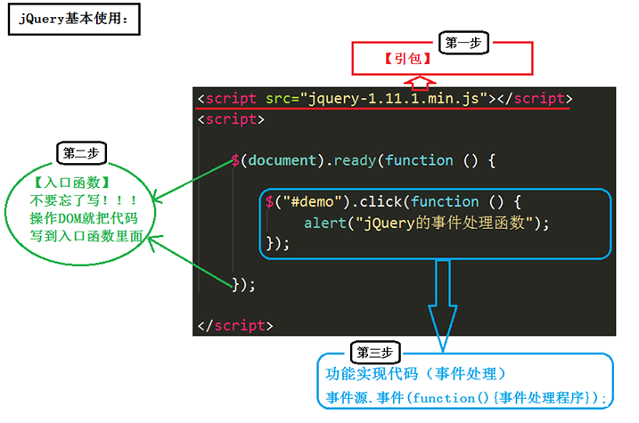

主要，导包的代码一定要放在js代码的最上面。

### jQuery 的版本

jQuery 有两个大版本：

- 1.x版本：最新版为 v1.11.3。
- 2.x版本：最新版为 v2.1.4（不再支持IE6、7、8）。
- 3.x版本。

PS：开发版本一般用1.10以上。

我们以 v1.11.1版本为例，下载下来后发现，里面有两个文件：

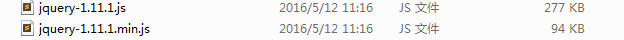

它们的区别是：

- 第一个是未压缩版，第二个是压缩版。
- 平时开发过程中，可以使用任意一个版本；但是，项目上线的时候，推荐使用压缩版

## jQuery 的入口函数和 `$` 符号

### 入口函数（重要）

原生 js 的入口函数指的是：`window.onload = function() {};` 如下

```javascript
        //原生 js 的入口函数。页面上所有内容加载完毕，才执行。
        //不仅要等文本加载完毕，而且要等图片也要加载完毕，才执行函数。
       window.onload = function () {
           alert(1);
       }
```

而 jQuery的入口函数，有以下几种写法：

写法一：

```javascript
       //1.文档加载完毕，图片不加载的时候，就可以执行这个函数。
       $(document).ready(function () {
           alert(1);
       })
```

写法二：（写法一的简洁版）

```javascript
       //2.文档加载完毕，图片不加载的时候，就可以执行这个函数。
       $(function () {
           alert(1);
       });
```

写法三：

```javascript
       //3.文档加载完毕，图片也加载完毕的时候，在执行这个函数。
       $(window).ready(function () {
           alert(1);
       })
```

**jQuery入口函数与js入口函数的区别**：

区别一：书写个数不同：

- Js 的入口函数只能出现一次，出现多次会存在事件覆盖的问题。
- jQuery 的入口函数，可以出现任意多次，并不存在事件覆盖问题。

区别二：执行时机不同：

- Js的入口函数是在**所有的文件资源加载**完成后，才执行。这些**文件资源**包括：页面文档、外部的js文件、外部的css文件、图片等。
- jQuery的入口函数，是在文档加载完成后，就执行。文档加载完成指的是：DOM树加载完成后，就可以操作DOM了，不用等到所有的**外部资源**都加载完成。

文档加载的顺序：从上往下，边解析边执行。

### [#](https://web.qianguyihao.com/04-JavaScript基础/47-jQuery的介绍和选择器.html#jquery的-符号)jQuery的`$`符号

jQuery 使用 `$` 符号原因：书写简洁、相对于其他字符与众不同、容易被记住。

jQuery占用了我们两个变量：`$` 和 jQuery。当我们在代码中打印它们俩的时候：

```html
    <script src="jquery-1.11.1.js"></script>
    <script>

        console.log($);
        console.log(jQuery);
        console.log($===jQuery);


    </script>
```

打印结果如下：

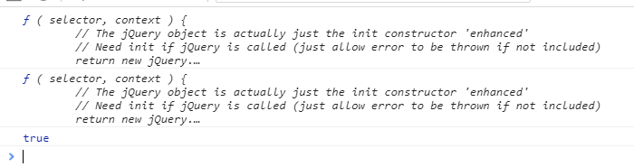

从打印结果可以看出，$ 代表的就是 jQuery。

那怎么理解jQuery里面的 `$` 符号呢？

**`$` 实际上表示的是一个函数名** 如下：

```html
	$(); // 调用上面我们自定义的函数$

	$(document）.ready(function(){}); // 调用入口函数

	$(function(){}); // 调用入口函数

	$(“#btnShow”) // 获取id属性为btnShow的元素

	$(“div”) // 获取所有的div标签元素
```

如上方所示，jQuery 里面的 `$` 函数，根据传入参数的不同，进行不同的调用，实现不同的功能。返回的是jQuery对象。

jQuery这个js库，除了`$` 之外，还提供了另外一个函数：jQuery。jQuery函数跟 `$` 函数的关系：`jQuery === $`。

## [#](https://web.qianguyihao.com/04-JavaScript基础/47-jQuery的介绍和选择器.html#js中的dom对象-和-jquery对象-比较-重点-难点)js中的DOM对象 和 jQuery对象 比较（重点，难点）

### 二者的区别

通过 jQuery 获取的元素是一个**数组**，数组中包含着原生JS中的DOM对象。举例：

针对下面这样一个div结构：

```html
<div></div>
<div class="box"></div>
<div id="box"></div>
<div class="box"></div>
<div></div>
```

通过原生 js 获取这些元素节点的方式是：

```javascript
    var myBox = document.getElementById("box");           //通过 id 获取单个元素
    var boxArr = document.getElementsByClassName("box");  //通过 class 获取的是数组
    var divArr = document.getElementsByTagName("div");    //通过标签获取的是数组
```

通过 jQuery 获取这些元素节点的方式是：（获取的都是数组）

```javascript
    //获取的是数组，里面包含着原生 JS 中的DOM对象。
    var jqBox1 = $("#box");
    var jqBox2 = $(".box");
    var jqBox3 = $("div");
```

我们打印出来看看：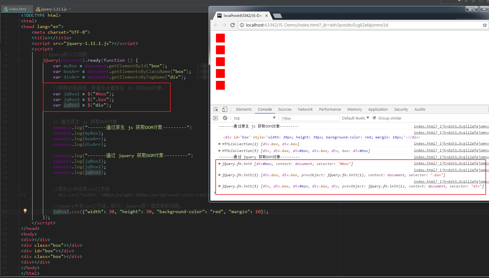

上图显示，由于JQuery 自带了 css()方法，我们还可以直接在代码中给 div 设置 css 属性。

**总结**：jQuery 就是把 DOM 对象重新包装了一下，让其具有了 jQuery 方法。

### 二者的相互转换

**1、 DOM 对象 转为 jQuery对象**：

```javascript
	$(js对象);
```

举例：（拿上一段的代码举例）

```javascript
	//转换。
	jqBox1 = $(myBox);
	jqBox2 = $(boxArr);
	jqBox3 = $(divArr);
```

DOM 对象转换成了 jquery 对象之后，上面的功能可以直接调用

**2、jQuery对象 转为 DOM 对象**：

```javascript
	jquery对象[index];      //方式1（推荐）

	jquery对象.get(index);  //方式2
```

jQuery对象转换成了 DOM 对象之后，可以直接调用 DOM 提供的一些功能。如：

```javascript
    //jquery对象转换成 DOM 对象之后
    jqBox3[0].style.backgroundColor = "black";
    jqBox3.get(4).style.backgroundColor = "pink";
```

**总结**：如果想要用哪种方式设置属性或方法，必须转换成该类型。

### [#](https://web.qianguyihao.com/04-JavaScript基础/47-jQuery的介绍和选择器.html#举例-隔行变色)举例：隔行变色

代码如下：

```html
<!DOCTYPE html>
<html>
<head lang="en">
    <meta charset="UTF-8">
    <title></title>
    <script src="jquery-1.11.1.js"></script>
    <script>
        //入口函数
        jQuery(function () {
            var jqLi = $("li");
            for (var i = 0; i < jqLi.length; i++) {
                if (i % 2 === 0) {
                    //jquery对象，转换成了js对象
                    jqLi[i].style.backgroundColor = "pink";
                } else {
                    jqLi[i].style.backgroundColor = "yellow";
                }
            }
        });
    </script>
</head>
<body>
<ul>
    <li>生命壹号，永不止步</li>
    <li>生命壹号，永不止步</li>
    <li>生命壹号，永不止步</li>
    <li>生命壹号，永不止步</li>
    <li>生命壹号，永不止步</li>
    <li>生命壹号，永不止步</li>
    <li>生命壹号，永不止步</li>
</ul>
</body>
</html>
```

效果如下：

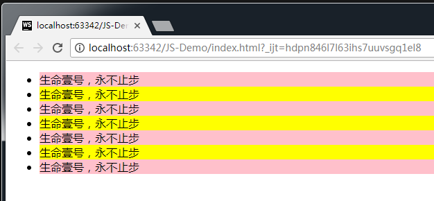

## jQuery 选择器

我们以前在CSS中学习的选择器有：

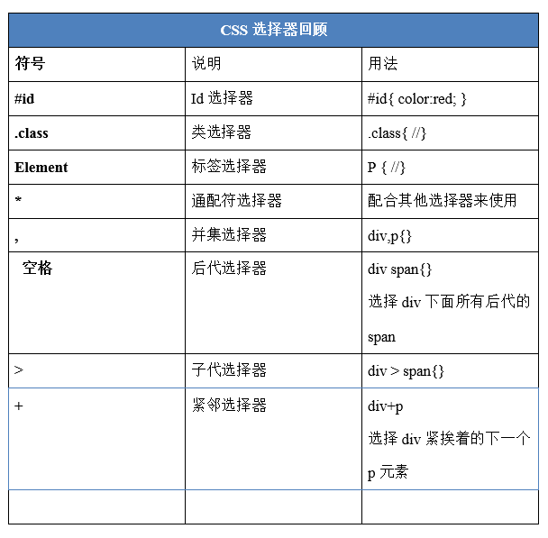

今天来学习一下jQuery 选择器。

jQuery选择器是jQuery强大的体现，它提供了一组方法，让我们更加方便的获取到页面中的元素。

### 1、jQuery 的基本选择器

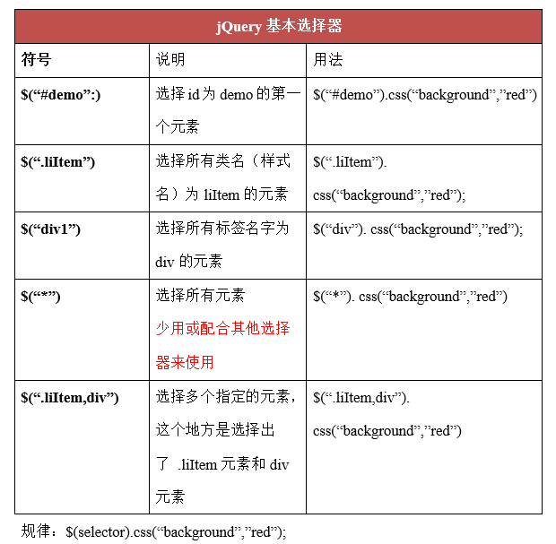

解释如下：


举例：

```html
<!DOCTYPE html>
<html>
<head lang="en">
    <meta charset="UTF-8">
    <title></title>
    <script src="jquery-1.11.1.js"></script>
    <script>
        //入口函数
        jQuery(document).ready(function () {

            //三种方式获取jquery对象
            var jqBox1 = $("#box");
            var jqBox2 = $(".box");
            var jqBox3 = $("div");

            //操作标签选择器
            jqBox3.css("width", 100);
            jqBox3.css("height", 100);
            jqBox3.css("margin", 10);
            jqBox3.css("background", "pink");

            //操作类选择器(隐式迭代，不用一个一个设置)
            jqBox2.css("background", "red");

            //操作id选择器
            jqBox1.css("background", "yellow");

        });
    </script>
</head>
<body>

<div></div>
<div class="box"></div>
<div id="box"></div>
<div class="box"></div>
<div></div>

</body>
</html>
```

效果如下：

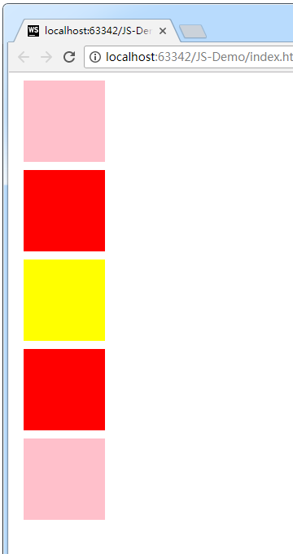

### 2、层级选择器

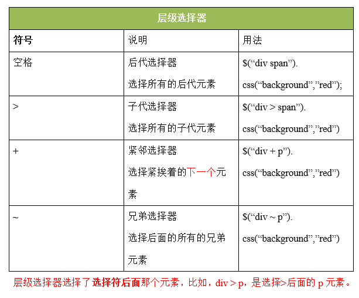

解释如下：

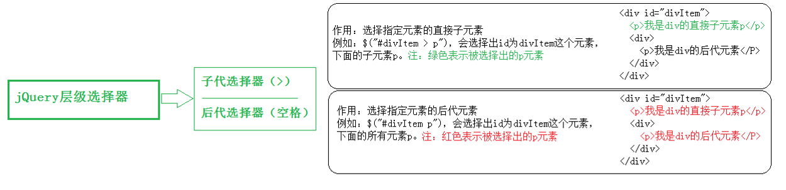

举例：

```html
<!DOCTYPE html>
<html>
<head lang="en">
    <meta charset="UTF-8">
    <title></title>
    <script src="jquery-1.11.1.js"></script>
    <script>
        $(function () {
            //获取ul中的li设置为粉色
            //后代：儿孙重孙曾孙玄孙....
            var jqLi = $("ul li");
            jqLi.css("margin", 5);
            jqLi.css("background", "pink");

            //子代：亲儿子
            var jqOtherLi = $("ul>li");
            jqOtherLi.css("background", "red");
        });
    </script>
</head>
<body>
<ul>
    <li>111</li>
    <li>222</li>
    <li>333</li>
    <ol>
        <li>aaa</li>
        <li>bbb</li>
        <li>ccc</li>
    </ol>
</ul>
</body>
</html>
```

效果：

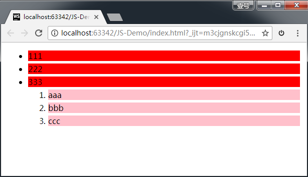

### [#](https://web.qianguyihao.com/04-JavaScript基础/47-jQuery的介绍和选择器.html#_3、基本过滤选择器)3、基本过滤选择器

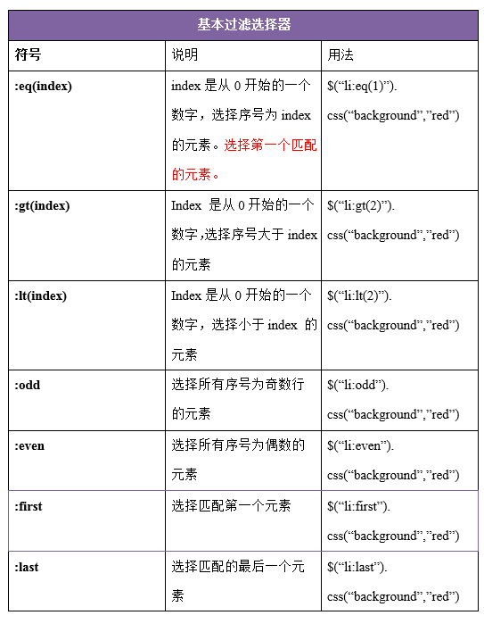

解释：

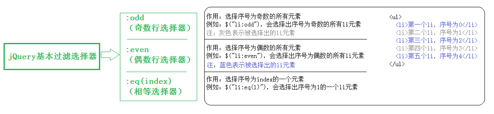

举例：

```html
    <script src="jquery-1.11.1.js"></script>
    <script>
        $(document).ready(function () {

            // :odd
            $("li:odd").css("background", "red");

            // :even
            $("li:even").css("background", "green");

            // :eq(index)
            $("ul li:eq(3)").css("font-size", "30px");  //设置第四个li的字体

            // :lt(index)
            $("li:lt(6)").css("font-size", "30px");

            // :gt(index)
            $(".ulList1 li:gt(7)").css("font-size", "40px");

            // :first
            $(".ulList li:first").css("font-size", "40px");

            // :last
            $("li:last").css("font-size", "40px");
        });
    </script>
```

### 4、属性选择器

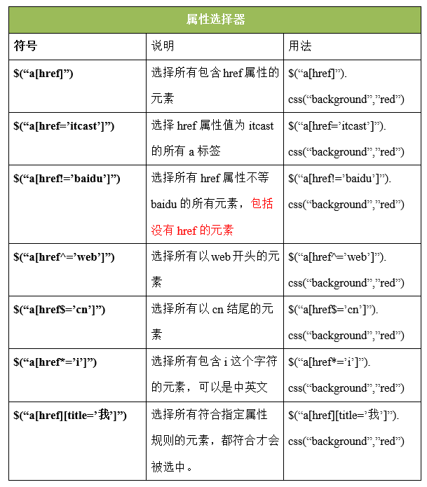

### 5、筛选选择器

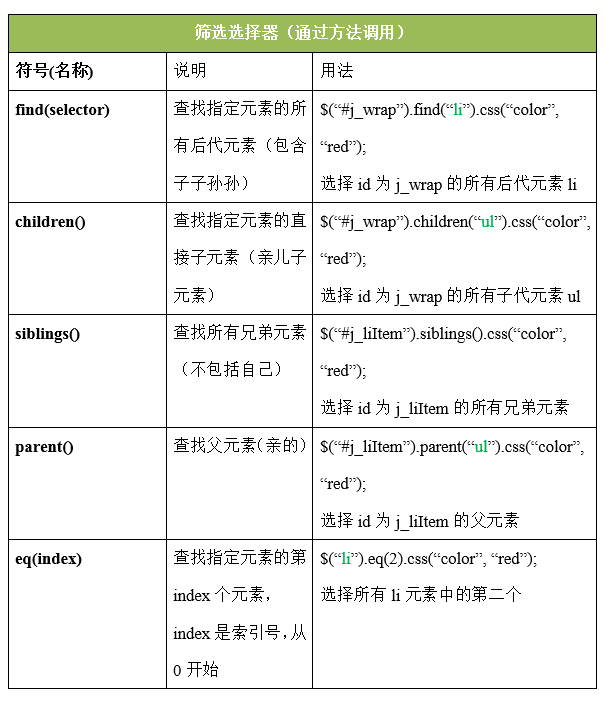

举例：

```html
<!DOCTYPE html>
<html>
<head lang="en">
    <meta charset="UTF-8">
    <title></title>
    <script src="jquery-1.11.1.js"></script>
    <script>
        jQuery(function () {
            var jqul = $("ul");

            //find(selector); 从jquery对象的后代中查找
            //必须制定参数，如果不指定获取不到元素。length === 0
            jqul.find("li").css("background", "pink");
            console.log(jqul.find());

            //chidlren(selector); 从jquery对象的子代中查找
            //不写参数代表获取所有子元素。
            jqul.children("li").css("background", "green");

            //eq(索引值); 从jquery对象的子代中查找该索引值的元素
            //要写该数组中的第几个。
            jqul.children().eq(0).css("background", "red");

            //next(); 该元素的下一个兄弟元素
            jqul.children().eq(0).next().css("background", "yellow");

            //siblings(selector); 该元素的所有兄弟元素
            jqul.children().eq(0).next().siblings().css("border", "1px solid blue");

            //parent(); 该元素的父元素（和定位没有关系）
            console.log(jqul.children().eq(0).parent());
        });
    </script>
</head>
<body>

<ul>
    <li>生命壹号，永不止步</li>
    <li class="box">生命壹号，永不止步</li>
    <span>生命壹号，永不止步</span>
    <li class="box">生命壹号，永不止步</li>
    <i>生命壹号，永不止步</i>
    <li>生命壹号，永不止步</li>
    <a id="box" href="#">生命壹号，永不止步</a>
    <ol>
        <li>我是ol中的li</li>
        <li>我是ol中的li</li>
        <li>我是ol中的li</li>
        <li>我是ol中的li</li>
    </ol>
</ul>

</body>
</html>
```

##  举例

### [#](https://web.qianguyihao.com/04-JavaScript基础/47-jQuery的介绍和选择器.html#举例1-鼠标悬停时-弹出下拉菜单【重要】)举例1：鼠标悬停时，弹出下拉菜单【重要】

完整版代码：

```html
<!DOCTYPE html>
<html>
<head lang="en">
    <meta charset="UTF-8">
    <title></title>
    <style type="text/css">
        * {
            margin: 0;
            padding: 0;
        }

        ul {
            list-style: none;
        }

        .wrap {
            width: 330px;
            height: 30px;
            margin: 100px auto 0;
            padding-left: 10px;
            background-color: pink;
        }

        .wrap li {
            background-color: yellowgreen;
        }

        .wrap > ul > li {
            float: left;
            margin-right: 10px;
            position: relative;
        }

        .wrap a {
            display: block;
            height: 30px;
            width: 100px;
            text-decoration: none;
            color: #000;
            line-height: 30px;
            text-align: center;
        }

        .wrap li ul {
            position: absolute;
            top: 30px;
            display: none;
        }
    </style>
    <script src="jquery-1.11.1.js"></script>
    <script>
        //入口函数
        $(document).ready(function () {
            //需求：鼠标放入一级li中，让他里面的ul显示。移开隐藏。
            var jqli = $(".wrap>ul>li");

            //绑定事件
            jqli.mouseenter(function () {
                //这个位置用到了this.
                // console.log(this);  //打印结果是js中的dom对象。注意：jquery对象绑定的事件中，this指js中的dom对象。【重要】

                //让this中的ul显示出来。
//                原生 js 的做法是：this.children[1].style.display = "block";
                //把js的dom对象包装为jquery对象，然后用jquery方法操作
                $(this).children("ul").show();
            });

            //绑定事件：鼠标移开时，隐藏下拉菜单
            jqli.mouseleave(function () {
                $(this).children("ul").hide();
            });
        });
    </script>

</head>
<body>
<div class="wrap">
    <ul>
        <li>
            <a href="javascript:void(0);">一级菜单1</a>
            <ul>
                <li><a href="javascript:void(0);">二级菜单1</a></li>
                <li><a href="javascript:void(0);">二级菜单2</a></li>
                <li><a href="javascript:void(0);">二级菜单3</a></li>
            </ul>
        </li>
        <li>
            <a href="javascript:void(0);">一级菜单1</a>
            <ul>
                <li><a href="javascript:void(0);">二级菜单1</a></li>
                <li><a href="javascript:void(0);">二级菜单2</a></li>
                <li><a href="javascript:void(0);">二级菜单3</a></li>
            </ul>
        </li>
        <li>
            <a href="javascript:void(0);">一级菜单1</a>
            <ul>
                <li><a href="javascript:void(0);">二级菜单1</a></li>
                <li><a href="javascript:void(0);">二级菜单2</a></li>
                <li><a href="javascript:void(0);">二级菜单3</a></li>
            </ul>
        </li>
    </ul>
</div>
</body>
</html>
```

上方代码中，我们可以看到，用 jQuery来操作，是非常方便的。

实现效果如下：

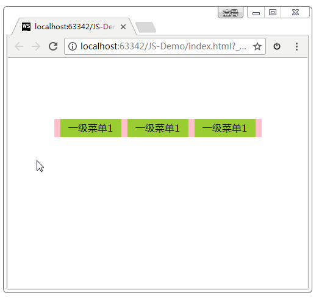

