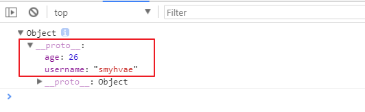
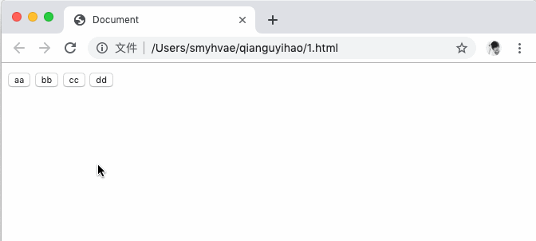
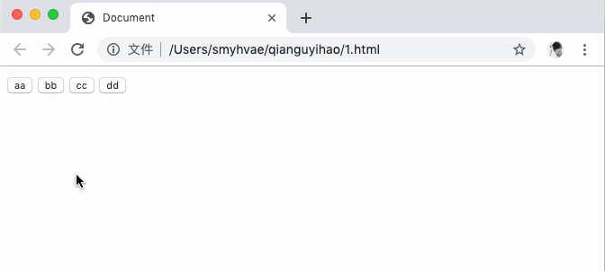

# 03-ES5中的一些扩展

##  JSON 对象

1、js对象(数组) --> json对象(数组)：

```javascript
	JSON.stringify(obj/arr)
```

举例：

```js
let obj = { name: "Alice", age: 25 };
let jsonStr = JSON.stringify(obj);
console.log(jsonStr); // 输出：'{"name":"Alice","age":25}'
```

```js
let arr = [1, 2, 3];
let jsonArrStr = JSON.stringify(arr);
console.log(jsonArrStr); // 输出：'[1,2,3]'
```

注意：转换后的结果是一个字符串，而不是真正的对象或数组。

2、json对象(数组) --> js对象(数组)：

```javascript
	JSON.parse(json)
```

作用：将 JSON 格式的字符串解析为 JavaScript 对象或数组。

举例：

```js
let jsonStr = '{"name":"Alice","age":25}';
let obj = JSON.parse(jsonStr);
console.log(obj); // 输出：{ name: "Alice", age: 25 }
```

```js
let jsonArrStr = '[1,2,3]';
let arr = JSON.parse(jsonArrStr);
console.log(arr); // 输出：[1, 2, 3]
```

注意：输入必须是有效的 JSON 字符串，否则会抛出错误。

### 关键点

- **ES5 中的方法**：JSON.stringify 和 JSON.parse 是 JavaScript 在 ES5（ECMAScript 5）中引入的内置方法，广泛用于数据转换。
- JSON 字符串的两种形式：
  - **JSON 对象**：形如 {"key": "value"} 的字符串。
  - **JSON 数组**：形如 [value1, value2] 的字符串。
  - 其他形式（比如单独的数字、布尔值等）不是我们通常说的“JSON 字符串”。

**类型检测**：

- 使用 typeof 检查 JSON 字符串时，返回值是 "string"，因为它本质上是一个字符串。
- 例如：

```js
let jsonStr = '{"name":"Alice"}';
console.log(typeof jsonStr); // 输出：string
```

##  Object的扩展

ES5给Object扩展了一些静态方法，常用的有2个，我们接下来讲解。

### 方法一

```javascript
	Object.create(prototype, [descriptors])
```

作用: 以指定对象为原型，创建新的对象。同时，第二个参数可以为为新的对象添加新的属性，并对此属性进行描述。

**举例1**：（没有第二个参数时）

```javascript
    var obj1 = {username: 'smyhvae', age: 26};
    var obj2 = {address:'shenzhen'};

    obj2 = Object.create(obj1);
    console.log(obj2);
```

打印结果：



**关键点**：原来的 obj2（即 {address: 'shenzhen'}）被完全覆盖，之前的赋值被丢弃。

**举例2**：（有第二个参数时）

第二个参数可以给新的对象添加新的属性。我们修改上面的代码，尝试给obj2添加新属性`sex`：

obj2 = Object.create(obj1) 的意思是：

- 创建一个新对象并赋值给 obj2。
- 将 obj1 设置为 obj2 的原型。
- obj2 可以通过原型链访问 obj1 的属性，但它本身是独立的。

```javascript
    var obj1 = {username: 'smyhvae', age: 26};
    var obj2 = {address: 'shenzhen'};

    obj2 = Object.create(obj1, {
        sex: {//给obj2添加新的属性`sex`。注意，这一行的冒号不要漏掉
            value: '男',  //通过value关键字设置sex的属性值
            writable: false,
            configurable: true,
            enumerable: true
        }
    });

    console.log(obj2);
```

上方代码中，我们通过第5行的sex给obj2设置了一个新的属性`sex`，但是要通过`value`来设置属性值（第6行）。

设置完属性值后，这个属性值默认是不可修改的，要通过`writable`来设置。总而言之，这几个关键字的解释如下：

- `value`：设置属性值。
- `writable`：标识当前属性值是否可修改。如果不写的话，默认为false，不可修改。
- `configurable`：标识当前属性是否可以被删除。默认为false，不可删除。
- `enumerable`：标识当前属性是否能用 for in 枚举。 默认为false，不可。

### 方法二

> 这个方法有点难理解。

```javascript
	Object.defineProperties(object, descriptors)
```

**作用**：为指定对象定义扩展多个属性。

Object.defineProperties() 是 JavaScript 中的一个内置方法，用于直接在一个对象上定义多个新属性或修改已有属性的描述符。它是 Object.defineProperty() 的批量版本。

**object**：目标对象，即要定义或修改属性的对象。

**descriptors**：一个对象，包含多个属性描述符。它的键是要定义的属性名，值是描述该属性的描述符对象。

```js
var obj2 = {
        firstName : 'smyh',
        lastName : 'vae'
    };
    Object.defineProperties(obj2, {
        fullName : {
            get : function () {
                return this.firstName + '-' + this.lastName
            },
            set : function (data) {  //监听扩展属性，当扩展属性发生变化的时候自动调用，自动调用后将变化的值作为实参注入到set函数
                var names = data.split('-');
                this.firstName = names[0];
                this.lastName = names[1];
            }
        }
    });
    console.log(obj2.fullName);
    obj2.firstName = 'tim';
    obj2.lastName = 'duncan';
    console.log(obj2.fullName);
    obj2.fullName = 'kobe-bryant';
    console.log(obj2.fullName);
```

- get ：用来获取当前属性值的回调函数
- set ：修改当前属性值得触发的回调函数，并且实参即为修改后的值

存取器属性：setter,getter一个用来存值，一个用来取值。

## Object的扩展（二）

obj对象本身就自带了两个方法。格式如下：

```javascript
get 属性名(){} 用来得到当前属性值的回调函数

set 属性名(){} 用来监视当前属性值变化的回调函数
```

举例如下：

```javascript
    var obj = {
        firstName : 'kobe',
        lastName : 'bryant',
        get fullName(){
            return this.firstName + ' ' + this.lastName
        },
        set fullName(data){
            var names = data.split(' ');
            this.firstName = names[0];
            this.lastName = names[1];
        }
    };
    console.log(obj.fullName);
    obj.fullName = 'curry stephen';
    console.log(obj.fullName);
```

>console.log(obj.fullName) 触发 get 方法，因为它是一个读取操作，只需要获取 fullName 的值。
>
>set 方法只在赋值操作（例如 obj.fullName = something）时触发，与读取无关。

##  数组的扩展

**方法1**：

```javascript
	Array.prototype.indexOf(value)
```

作用：获取 value 在数组中的第一个下标。

**方法2**：

```javascript
	Array.prototype.lastIndexOf(value)
```

作用：获取 value 在数组中的最后一个下标。

**方法3**：遍历数组

```javascript
	Array.prototype.forEach(function(item, index){})
```

**方法4**：

```javascript
	Array.prototype.map(function(item, index){})
```

作用：遍历数组返回一个新的数组，返回的是**加工之后**的新数组。

**方法5**：

```javascript
	Array.prototype.filter(function(item, index){})
```

作用：遍历过滤出一个新的子数组，返回条件为true的值。

| 方法        | 作用                   | 返回值            | 是否修改原数组 |
| ----------- | ---------------------- | ----------------- | -------------- |
| indexOf     | 查找第一个下标         | 数字（索引或 -1） | 否             |
| lastIndexOf | 查找最后一个下标       | 数字（索引或 -1） | 否             |
| forEach     | 遍历执行操作           | undefined         | 否             |
| map         | 遍历并生成新数组       | 新数组            | 否             |
| filter      | 过滤出符合条件的子数组 | 新数组            | 否             |

## 函数function的扩展：bind()

```javascript
	Function.prototype.bind(obj)
```

#### 什么是 bind()？

- bind() 是 JavaScript 中 Function.prototype 上的一个方法，所有的函数都可以调用它。
- **作用**：创建一个新函数，新函数的 this 被绑定到指定的对象，并且可以预设部分参数。
- **特点**：bind() 不会立即执行原函数，而是返回一个新的函数（绑定后的函数），可以在需要时调用。

```js
function.bind(thisArg[, arg1[, arg2[, ...]]])
```

**thisArg**：新函数被调用时，this 将绑定到这个值。

**arg1, arg2, ...**（可选）：预设的参数，这些参数会在调用新函数时自动传入原函数。

#### 基本用法

##### 示例 1：绑定 this

```js
var obj = {
    name: "Alice",
    sayHello: function() {
        console.log("Hello, I am " + this.name);
    }
};

var say = obj.sayHello;
say(); // 输出：Hello, I am undefined（this 指向全局对象或 undefined）

var boundSay = obj.sayHello.bind(obj);
boundSay(); // 输出：Hello, I am Alice（this 被绑定到 obj）
```

**解释**：

- say() 直接调用时，this 丢失（在非严格模式下指向全局对象 window，严格模式下是 undefined）。
- bind(obj) 创建的新函数 boundSay，将 this 固定为 obj，无论在哪里调用，this 始终是 obj。

##### 示例 2：预设参数

```js
function add(a, b) {
    return a + b;
}

var addFive = add.bind(null, 5); // 绑定 this 为 null，并预设第一个参数为 5
console.log(addFive(3)); // 输出：8（5 + 3）
console.log(addFive(10)); // 输出：15（5 + 10）
```

**解释**：

- addFive 是 add 的绑定版本，第一个参数 a 被固定为 5。
- 调用 addFive(3) 时，3 作为第二个参数 b，相当于 add(5, 3)。

### **面试题**: call()、apply()和bind()的区别：

- 都能改变this的指向
- call()/apply()是**立即调用函数**
- bind()：绑定完this后，不会立即调用当前函数，而是**将函数返回**，因此后面还需要再加`()`才能调用。

PS：bind()传参的方式和call()一样。

**主要区别：**

| 特性         | `call()`                                                     | `apply()`                                                    | `bind()`                                                     |
| ------------ | ------------------------------------------------------------ | ------------------------------------------------------------ | ------------------------------------------------------------ |
| **作用**     | **立即调用**函数，并显式指定 `this` 的值。                   | **立即调用**函数，并显式指定 `this` 的值。                   | **创建一个新的函数**，该新函数的 `this` 值被永久绑定到指定的值。它**不会立即执行**原函数。 |
| **参数传递** | 除了第一个参数（指定 `this`），后续参数以**逗号分隔**的形式传递给原函数。 | 除了第一个参数（指定 `this`），后续参数以**数组（或类数组对象）**的形式传递给原函数。 | 除了第一个参数（指定 `this`），后续参数在创建新函数时以**逗号分隔**的形式预先传入。当新函数被调用时，这些预设参数会与调用时传入的参数一同传递给原函数。 |
| **返回值**   | 原函数的返回值。                                             | 原函数的返回值。                                             | 返回一个新的函数，这个新函数的 `this` 已经被绑定。           |
| **执行时机** | 立即执行。                                                   | 立即执行。                                                   | 不会立即执行，而是返回一个绑定了 `this` 的新函数，需要稍后调用。 |

**分析**：

为什么ES5中要加入bind()方法来改变this的指向呢？因为bind()不会立即调用当前函数。

bind()通常使用在回调函数中，因为回调函数并不会立即调用。如果你希望在回调函数中改变this，不妨使用bind()。

# 04-ES6：变量 let、const 和块级作用域

## [#](https://web.qianguyihao.com/05-JavaScript基础：ES6语法/04-ES6：变量 let、const 和块级作用域.html#es6-的变量声明)ES6 的变量声明

ES5 中，使用 `var` 定义变量（ var 是 variable 的简写）。

ES6 中，新增了 let 和 const 来定义变量：

- `let`：定义**变量**，替代 var。
- `const`：定义**常量**（定义后，不可修改）。

### var：定义变量（ES5 知识回顾）

看下面的代码：

```javascript
{
    var a = 1;
}

console.log(a); //这里的 a，指的是 区块 里的 a
```

上方代码是可以输出结果的，输出结果为 1。因为 var 是全局声明的，所以，即使是在区块里声明，但仍然在全局起作用。

也就是说：**使用 var 声明的变量不具备块级作用域特性**。

再来看下面这段代码：

>**块级作用域 (Block Scope)** 是指变量的可见性和生命周期被限制在代码块（block）内部的特性。一个代码块通常由一对花括号 `{}` 包裹。

再来看下面这段代码：

```javascript
var a = 1;
{
    var a = 2;
}

console.log(a); //这里的 a，指的是 区块 里的 a
```

上方代码的输出结果为 2 ，因为 var 是全局声明的。

**总结：**

ES5语法中，用 var 定义的变量，容易造成全局污染（污染整个 js 的作用域）。如果不考虑浏览器的兼容性，我们在今后的实战中，**尽量避免**使用 var 定义变量，尽量用接下来要讲的ES6语法。

###  1、let：定义变量

举例 1：

```js
{
    let a = 'hello';
}
console.log(a); // 打印结果报错：Uncaught ReferenceError: a is not defined
```

上方代码，打印报错。

举例 2：

```javascript
var a = 2;
{
    let a = 3;
}

console.log(a); // 打印结果：2
```

通过上面两个例子可以看出，**用块级作用域内， 用let 声明的变量，只在局部起作用**。

**经典面试题**：

let 可以防止数据污染，我们来看下面这个 **for 循环**的经典面试题。

1、用 var 声明变量：

```javascript
for (var i = 0; i < 10; i++) {
    console.log('循环体中:' + i);
}

console.log('循环体外:' + i);
```

上方代码的最后一行可以正常打印结果，且最后一行的打印结果是 10。说明**循环体外**定义的变量 i，是**全局作用域**下的 i。

2、用 let 声明变量：

```javascript
for (let i = 0; i < 10; i++) {
    console.log('循环体中:' + i); // // 每循环一次，就会在 { } 所在的块级作用域中，重新定义一个新的变量 i
}

console.log('循环体外:' + i);
```

上方代码的关键在于：**每次循环都会产生一个块级作用域，每个块级作用域中会重新定义一个新的变量 i**。

另外，上方代码的最后一行，打印会报错。因为用 let 定义的变量 i，只在`{ }`这个**块级作用域**里生效。

**总结：\**我们要习惯用 let 声明，减少 var 声明带来的\**污染全局空间**。

为了进一步强调 let 不会带来污染，需要说明的是：当我们定义了`let a = 1`时，如果我们在同一个作用域内继续定义`let a = 2`，是会报错的。

### 2、const：定义常量

在程序开发中，有些变量是希望声明后，在业务层就不再发生变化，此时可以用 const 来定义**常量**。常量就是值（内存地址）不能变化的量。

举例：

```javascript
const name = 'smyhvae'; //定义常量
```

用 const 声明的常量，只在局部（块级作用域内）起作用；而且，用 const 声明常量时，必须赋值，否则报错。

### let 和 const 的特点【重要】

- 不属于顶层对象 Window
- 不允许重复声明
- 不存在变量提升
- 暂时性死区
- 支持块级作用域

相反， 用`var`声明的变量：存在变量提升、可以重复声明、**没有块级作用域**。

###  var/let/const 的共同点

- 全局作用域中定义的变量，可以在函数中使用。
- 函数中声明的变量，只能在函数及其子函数中使用，外部无法使用。

### 总结

关于 let、const、var 更详细的介绍和区别，可以看本项目的另一篇文章《JavaScript 进阶/var、let、const 的区别》。

## [#](https://web.qianguyihao.com/05-JavaScript基础：ES6语法/04-ES6：变量 let、const 和块级作用域.html#for-循环举例-经典案例)for 循环举例（经典案例）

**代码 1**、我们先来看看如下代码：（用 var 定义变量 i）

```html
<!DOCTYPE html>
<html lang="">
    <head>
        <meta />
        <meta />
        <meta />
        <title>Document</title>
    </head>
    <body>
        <input type="button" value="aa" />
        <input type="button" value="bb" />
        <input type="button" value="cc" />
        <input type="button" value="dd" />

        <script>
            var myBtn = document.getElementsByTagName('input');

            for (var i = 0; i < myBtn.length; i++) {
                myBtn[i].onclick = function () {
                    alert(i);
                };
            }
        </script>
    </body>
</html>
```

上方代码中的运行效果如下：



你可能会感到诧异，为何点击任何一个按钮，弹出的内容都是 4 呢？这是因为，我们用 var 定义的变量 i，是在全局作用域声明的。整个代码中，自始至终只有一个变量。

for 循环是同步代码，而 onclick 点击事件是异步代码。当我们还没点击按钮之前，同步代码已经执行完了，变量 i 已经循环到 4 了。

**代码 2**、上面的代码中，如果我们改为用 let 定义变量 i：

```html
<!DOCTYPE html>
<html lang="">
    <head>
        <meta />
        <meta />
        <meta />
        <title>Document</title>
    </head>
    <body>
        <input type="button" value="aa" />
        <input type="button" value="bb" />
        <input type="button" value="cc" />
        <input type="button" value="dd" />

        <script>
            var myBtn = document.getElementsByTagName('input');

            for (let i = 0; i < myBtn.length; i++) {
                myBtn[i].onclick = function () {
                    alert(i);
                };
            }
        </script>
    </body>
</html>
```

上方代码中的运行效果如下：



上面这个运行结果，才是我们预期的效果。我们用 let 定义变量 i，在循环的过程中，每执行一次循环体，就会诞生一个新的 i。循环体执行 4 次，就会有四个 i。

## 补充知识

###  暂时性死区 DTC

ES6 规定：使用 let/const 声明的变量，会使区块形成封闭的作用域。若在声明之前使用变量，就会报错。

也就是说，在使用 let/const 声明变量时，**变量需要先声明，再使用**（声明语句必须放在使用之前）。这在语法上，称为 “暂时性死区”（ temporal dead zone，简称 TDZ）。

DTC 其实是一种保护机制，可以让我们养成良好的编程习惯。

代码举例：

```js
const name = 'qianguyihao';

function foo() {
    console.log(name);
    const name = 'hello';
}

foo(); // 执行函数后，控制台报错：Uncaught ReferenceError: Cannot access 'name' before initialization
```

### ES5 中如何定义常量

ES5中有`Object.defineProperty`这样一个api，可以定义常量。这个API中接收三个参数。

代码举例：

```js
// 定义常量 PI
Object.defineProperty(window, 'PI', {
    value: 3.14,
    writable: false,
});

console.log(PI); // 打印结果：3.14
PI = 6; //尝试修改常量
console.log(PI); //打印结果：3.14，说明修改失败
```

# 05-ES6：变量的解构赋值

##  解构赋值的概念

**解构赋值**：ES6 允许我们，按照一一对应的方式，从数组或者对象中**提取值**，再将提取出来的值赋值给变量。

解构：分解数据结构；赋值：给变量赋值。

解构赋值在实际开发中可以大量减少我们的代码量，并且让程序结构更清晰。

## 数组的解构赋值

数组的结构赋值：将数组中的值按照**位置**提取出来，然后赋值给变量。

### [#](https://web.qianguyihao.com/05-JavaScript基础：ES6语法/05-ES6：变量的解构赋值.html#语法)语法

在 ES6 之前，当我们在为一组变量赋值时，一般是这样写：

```javascript
var a = 1;
var b = 2;
var c = 3;
```

或者是这样写：

```js
var arr = [1, 2, 3];

var a = arr[0];
var b = arr[1];
var c = arr[2];
```

现在有了 ES6 之后，我们可以通过数组解构的方式进行赋值：（根据**位置**进行一一对应）

```javascript
let [a, b, c] = [1, 2, 3];
```

二者的效果是一样的，但明显后者的代码更简洁优雅。

### [#](https://web.qianguyihao.com/05-JavaScript基础：ES6语法/05-ES6：变量的解构赋值.html#未匹配到的情况)未匹配到的情况

数据的结构赋值，是根据位置进行一一对应来赋值的。可如果左边的数量大于右边的数量时（也就是变量的数量大于值的数量时），多余的变量要怎么处理呢？

答案是：如果变量在一一对应时，没有找到对应的值，那么，**多余的变量会被赋值为 undefined**。

### 解构时，左边允许有默认值

在解构赋值时，是允许使用默认值的。举例如下

```javascript
{
    //一个变量时
    let [foo = true] = [];
    console.log(foo); //输出结果：true
}

{
    //两个变量时
    let [a, b] = ['千古壹号']; //a 赋值为：千古壹号。b没有赋值
    console.log(a + ',' + b); //输出结果：千古壹号,undefined
}

{
    //两个变量时
    let [a, b = 'qianguyihao'] = ['千古壹号']; //a 赋值为：千古壹号。b 采用默认值 qianguyihao
    console.log(a + ',' + b); //输出结果：千古壹号,qianguyihao
}
```

###  将右边的 `undefined`和`null`赋值给变量

如果我们在赋值时，采用的是 `undefined`或者`null`，那会有什么区别呢？

```javascript
{
    let [a, b = 'qianguyihao'] = ['千古壹号', undefined]; //b 虽然被赋值为 undefined，但是 b 会采用默认值
    console.log(a + ',' + b); //输出结果：千古壹号,qianguyihao
}

{
    let [a, b = 'qianguyihao'] = ['千古壹号', null]; //b 被赋值为 null
    console.log(a + ',' + b); //输出结果：千古壹号,null
}
```

上方代码分析：

- undefined：相当于什么都没有，此时 b 采用默认值。
- null：相当于有值，但值为 null。

## 对象的解构赋值

对象的结构赋值：将对象中的值按照**属性匹配的方式**提取出来，然后赋值给变量。

### 语法

在 ES6 之前，我们从接口拿到 json 数据后，一般这么赋值：

```javascript
var name = json.name;

var age = json.age;

var sex = json.sex;
```


上面这种写法，过于麻烦了。

现在，有了 ES6 之后，我们可以使用对象解构的方式进行赋值。举例如下：

```js
const person = { name: 'qianguyihao', age: 28, sex: '男' };
let { name, age, sex } = person; // 对象的结构赋值

console.log(name); // 打印结果：qianguyihao
console.log(age); // 打印结果：28
console.log(sex); // 打印结果：男
```

上方代码可以看出，对象的解构与数组的结构，有一个重要的区别：**数组**的元素是按次序排列的，变量的取值由它的**位置**决定；而**对象的属性没有次序**，是**根据键来取值**的。

###  未匹配到的情况

对象的结构赋值，是根据属性名进行一一对应来赋值的。可如果左边的数量大于右边的数量时（也就是变量的数量大于值的数量时），多余的变量要怎么处理呢？

答案是：如果变量在一一对应时，没有找到对应的值，那么，**多余的变量会被赋值为 undefined**。

### 给左边的变量自定义命名

对象的结构赋值里，左边的变量名一定要跟右边的属性名保持一致么？答案是不一定。我们可以单独给左边的变量自定义命名。

举例如下：

```js
const person = { name: 'qianguyihao', age: 28 };
let { name: myName, age: myAge } = person; // 对象的结构赋值

console.log(myName); // 打印结果：qianguyihao
console.log(myAge); // 打印结果：28

console.log(name); // 打印报错：Uncaught ReferenceError: name is not defined
console.log(age); // 打印报错：Uncaught ReferenceError: age is not defined
```

上方的第 2 行代码中：（请牢记）

- 等号左边的属性名 name、age 是对应等号右边的属性名。
- 等号左边的 myName、myAge 是左边自定义的变量名。

或者，我们也可以理解为：将右边 name 的值赋值给左边的 myName 变量，将右边 age 的值赋值给左边的 myAge 变量。现在，你应该一目了然了吧？

### [#](https://web.qianguyihao.com/05-JavaScript基础：ES6语法/05-ES6：变量的解构赋值.html#圆括号的使用)圆括号的使用

如果变量 foo 在解构之前就已经定义了，此时你再去解构，就会出现问题。下面是错误的代码，编译会报错

```javascript
	let foo = 'haha';
	{ foo } = { foo: 'smyhvae' };
	console.log(foo);
```

要解决报错，只要在解构的语句外边，加一个圆括号即可：

```javascript
let foo = 'haha';
({ foo } = { foo: 'smyhvae' });
console.log(foo); //输出结果：smyhvae
```

## 字符串解构

字符串也可以解构，这是因为，此时字符串被转换成了一个类似数组的对象。举例如下：

```javascript
const [a, b, c, d] = 'hello';
console.log(a);
console.log(b);
console.log(c);

console.log(typeof a); //输出结果：string
```

打印结果：

```text
h
e
l
string
```

# 06-ES6：箭头函数

## 前言

ES6 在**函数扩展**方面，新增了很多特性。例如：

- 箭头函数
- 参数默认值
- 参数结构赋值
- 剩余参数
- 扩展运算符
- this 绑定
- 尾调用

今天这篇文章，我们讲一下箭头函数。

## 箭头函数

### [#](https://web.qianguyihao.com/05-JavaScript基础：ES6语法/06-ES6：箭头函数.html#定义箭头函数的语法)定义箭头函数的语法

语法：

```js
(参数1, 参数2 ...) => { 函数体 }
```

解释：

- 如果有且仅有 1 个形参，则`()`可以省略
- 如果函数体内有且仅有 1 条语句，则`{}`可以省略，但前提是，这条语句必须是 return 语句。

需要强调的是，箭头函数是没有函数名的，既然如此，那要怎么调用箭头函数呢？你可以将箭头函数赋值给一个变量，通过变量名调用函数；也可以直接使用箭头函数。我们来看看下面的例子。

### 举例

写法 1、定义和调用函数：（传统写法）

```javascript
function fn1(a, b) {
    console.log('haha');
    return a + b;
}

console.log(fn1(1, 2)); //输出结果：3
```

写法 2、定义和调用函数：（ES6 中的写法）

```javascript
const fn2 = (a, b) => {
    console.log('haha');
    return a + b;
};

console.log(fn2(1, 2)); //输出结果：3
```

上面的两种写法，效果是一样的。

从上面的箭头函数中，我们可以很清晰地看到变量名、参数名、函数体。

另外，箭头函数的写法还可以精简一下，继续往下看。

【重要】在箭头函数中，如果方法体内只有一句话，且这句话是 return 语句，那就可以把 `{}`省略。写法如下：

```javascript
const fn2 = (a, b) => a + b;

console.log(fn2(1, 2)); //输出结果：3
```

在箭头函数中，如果形参只有一个参数，则可以把`()`省略。写法如下：

```js
const fn2 = (a) => {
    console.log('haha');
    return a + 1;
};

console.log(fn2(1)); //输出结果：2
```

##  箭头函数的 this 的指向

箭头函数只是为了让函数写起来更简洁优雅吗？当然不只是这个原因，还有一个很大的作用是与 this 的指向有关。

ES6 之前的普通函数中：this 指向的是函数被调用的对象（也就是说，谁调用了函数，this 就指向谁）。

而 ES6 的箭头函数中：**箭头函数本身不绑定 this**，this 指向的是**箭头函数定义位置的 this**（也就是说，箭头函数在哪个位置定义的，this 就跟这个位置的 this 指向相同）。

代码举例：

```js
const obj = { name: '千古壹号' };

function fn1() {
    console.log(this); // 第一个 this
    return () => {
        console.log(this); // 第二个 this
    };
}

const fn2 = fn1.call(obj);
fn2();
```

打印结果：

```text
obj
obj
```

代码解释：（一定要好好理解下面这句话）

上面的代码中，箭头函数是在 fn1()函数里面定义的，所以第二个 this 跟 第一个 this 指向的是**同一个位置**。又因为，在执行 `fn1.call(obj)`之后，第一个 this 就指向了 obj，所以第二个 this 也是指向 了 obj。

### 面试题：箭头函数的 this 指向

代码举例：

```js
var name = '许嵩';
var obj = {
    name: '千古壹号',
    sayHello: () => {
        console.log(this.name);
    },
};

obj.sayHello();
```

上方代码的打印结果是什么？你可能很难想到。

正确答案的打印结果是`许嵩`。因为 `obj` 这个对象并不产生作用域， `sayHello()` 这个箭头函数实际仍然是定义在 window 当中的，所以 这里的 this 指向是 window。

## 参数默认值

**传统写法**：

```javascript
function fn(param) {
    let p = param || 'hello';
    console.log(p);
}
```

上方代码中，函数体内的写法是：如果 param 不存在，就用 `hello`字符串做兜底。这样写比较啰嗦。

**ES6 写法**：（参数默认值的写法，很简洁）

```javascript
function fn(param = 'hello') {
    console.log(param);
}
```

在 ES6 中定义方法时，我们可以给方法里的参数加一个**默认值**（缺省值）：

- 方法被调用时，如果没有给参数赋值，那就是用默认值；
- 方法被调用时，如果给参数赋值了新的值，那就用新的值

如下：

```javascript
var fn2 = (a, b = 5) => {
    console.log('haha');
    return a + b;
};
console.log(fn2(1)); //第二个参数使用默认值 5。输出结果：6

console.log(fn2(1, 8)); //输出结果：9
```

**提醒 1**：默认值的后面，不能再有**没有默认值的变量**。比如`(a,b,c)`这三个参数，如果我给 b 设置了默认值，那么就一定要给 c 设置默认值。

**提醒 2**：

我们来看下面这段代码：

```javascript
let x = 'smyh';
function fn(x, y = x) {
    console.log(x, y);
}
fn('vae');
```

注意第二行代码，我们给 y 赋值为`x`，这里的`x`是括号里的第一个参数，并不是第一行代码里定义的`x`。打印结果：`vae vae`。

如果我把第一个参数改一下，改成：

```javascript
let x = 'smyh';
function fn(z, y = x) {
    console.log(z, y);
}
fn('vae');
```

此时打印结果是：`vae smyh`。