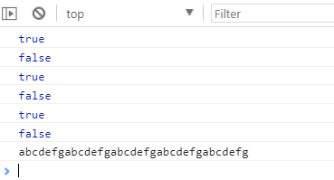
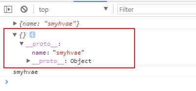
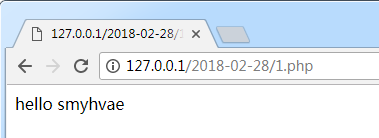
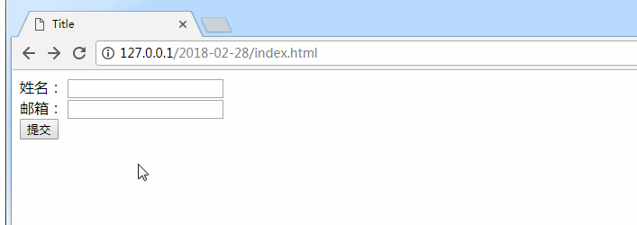
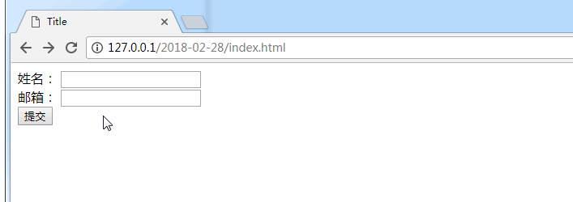
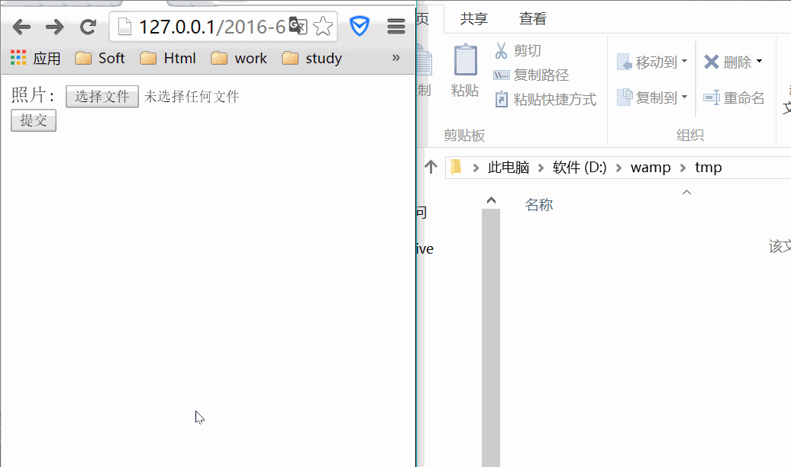

# 07-剩余参数和扩展运算符

##  剩余参数

**剩余参数**允许我们将不确定数量的**剩余的元素**放到一个**数组**中。

比如说，当函数的实参个数大于形参个数时，我们可以将剩余的实参放到一个数组中。

**传统写法**：

ES5 中，在定义方法时，参数要确定个数，如下：（程序会报错）

```javascript
function fn(a, b, c) {
    console.log(a);
    console.log(b);
    console.log(c);
    console.log(d);
}

fn(1, 2, 3);
```

上方代码中，因为方法的参数是三个，但使用时是用到了四个参数，所以会报错：


**ES6 写法**：

ES6 中，我们有了剩余参数，就不用担心报错的问题了。代码可以这样写：

```javascript
const fn = (...args) => {
    //当不确定方法的参数时，可以使用剩余参数
    console.log(args[0]);
    console.log(args[1]);
    console.log(args[2]);
    console.log(args[3]);
};

fn(1, 2);
fn(1, 2, 3); //方法的定义中了四个参数，但调用函数时只使用了三个参数，ES6 中并不会报错。
```

```bash
1
2
undefined
undefined


1
2
3
undefined
```

上方代码中注意，args 参数之后，不能再加别的参数，否则编译报错。

下面这段代码，也是利用到了剩余参数：

```js
function fn1(first, ...args) {
    console.log(first); // 10
    console.log(args); // 数组：[20, 30]
}

fn1(10, 20, 30);
```

### [#](https://web.qianguyihao.com/05-JavaScript基础：ES6语法/07-剩余参数和扩展运算符.html#剩余参数的举例-参数求和)剩余参数的举例：参数求和

代码举例：

```js
const sum = (...args) => {
    let total = 0;
    args.forEach(item => total += item); // 注意 forEach里面的代码，写得 很精简
    return total;
};
console.log(sum(10, 20, 30));
```

打印结果：60

### 剩余参数和解构赋值配合使用

代码举例：

```js
const students = ['张三', '李四', '王五'];
let [s1, ...s2] = students;

console.log(s1); // '张三'
console.log(s2); // ['李四', '王五']
```

## 扩展运算符（展开语法）

在ES6（ECMAScript 2015）中，扩展运算符（Spread Operator），也叫展开语法，使用三个点（...）表示，它可以将一个可迭代对象（如数组、字符串）或对象展开为单独的元素或属性。扩展运算符在现代JavaScript中非常常用，能够简化代码并提高灵活性。下面详细介绍它的特点和用法。

扩展运算符和剩余参数是相反的。

剩余参数是将剩余的元素放到一个数组中；而扩展运算符是将数组或者对象拆分成逗号分隔的参数序列。

代码举例：

```js
const arr = [10, 20, 30];
...arr // 10, 20, 30      注意，这一行是伪代码，这里用到了扩展运算符
console.log(...arr); // 10 20 30

console.log(10, 20, 30); // 10 20 30
```

上面的代码要仔细看：

`arr`是一个数组，而`...arr`则表示`10, 20, 30`这样的序列。

我们把`...arr` 打印出来，发现打印结果竟然是 `10 20 30`，为啥逗号不见了呢？因为逗号被当作了 console.log 的参数分隔符。如果你不信，可以直接打印 `console.log(10, 20, 30)` 看看。

接下来，我们看一下扩展运算符的应用。

### 举例1：数组赋值

数组赋值的代码举例：

```js
let arr2 = [...arr1]; // 将 arr1 赋值给 arr2
```

为了理解上面这行代码，我们先来分析一段代码：（将数组 arr1 赋值给 arr2）

```javascript
let arr1 = ['www', 'smyhvae', 'com'];
let arr2 = arr1; // 将 arr1 赋值给 arr2，其实是让 arr2 指向 arr1 的内存地址
console.log('arr1:' + arr1);
console.log('arr2:' + arr2);
console.log('---------------------');

arr2.push('你懂得'); //往 arr2 里添加一部分内容
console.log('arr1:' + arr1);
console.log('arr2:' + arr2);
```

运行结果：

上方代码中，我们往往 arr2 里添加了`你懂的`，却发现，arr1 里也有这个内容。原因是：`let arr2 = arr1;`其实是让 arr2 指向 arr1 的地址。也就是说，二者指向的是同一个内存地址。

如果不想让 arr1 和 arr2 指向同一个内存地址，我们可以借助**扩展运算符**来做：

```javascript
let arr1 = ['www', 'smyhvae', 'com'];
let arr2 = [...arr1]; //【重要代码】arr2 会重新开辟内存地址
console.log('arr1:' + arr1);
console.log('arr2:' + arr2);
console.log('---------------------');

arr2.push('你懂得'); //往arr2 里添加一部分内容
console.log('arr1:' + arr1);
console.log('arr2:' + arr2);
```

运行结果：

```bash
arr1:www,smyhvae,com
arr2:www,smyhvae,com
---------------------
arr1:www,smyhvae,com
arr2:www,smyhvae,com,你懂得
```

我们明白了这个例子，就可以避免开发中的很多业务逻辑上的 bug。

### 举例2：合并数组

代码举例：

```js
let arr1 = ['王一', '王二', '王三'];
let arr2 = ['王四', '王五', '王六'];
// ...arr1  // '王一','王二','王三'
// ...arr2  // '王四','王五','王六'

// 方法1
let arr3 = [...arr1, ...arr2];
console.log(arr3); // ["王一", "王二", "王三", "王四", "王五", "王六"]

// 方法2
arr1.push(...arr2);
console.log(arr1); // ["王一", "王二", "王三", "王四", "王五", "王六"]
```

### 举例3：将伪数组或者可遍历对象转换为真正的数组

代码举例：

```js
const myDivs = document.getElementsByClassName('div');
const divArr = [...myDivs]; // 利用扩展运算符，将伪数组转为真正的数组
```

**补充**：

我们在《JavaScript基础/数组的常见方法》中也学过，还有一种方式，可以将伪数组（或者可遍历对象）转换为真正的数组。语法格式如下：

```js
let arr2 = Array.from(arrayLike);
```


# 08-字符串、数组、对象的扩展

## 字符串的扩展

ES6 中的字符串扩展如下：

- `includes(str)`：判断是否包含指定的字符串
- `startsWith(str)`：判断是否以指定字符串开头
- `endsWith(str)`：判断是否以指定字符串结尾
- `repeat(count)`：重复指定次数

举例如下：

```javascript
let str = 'abcdefg';

console.log(str.includes('a')); //true
console.log(str.includes('h')); //false

//startsWith(str) : 判断是否以指定字符串开头
console.log(str.startsWith('a')); //true
console.log(str.startsWith('d')); //false

//endsWith(str) : 判断是否以指定字符串结尾
console.log(str.endsWith('g')); //true
console.log(str.endsWith('d')); //false

//repeat(count) : 重复指定次数a
console.log(str.repeat(5));
```

打印结果：



## Number 的扩展

- 二进制与八进制数值表示法: 二进制用`0b`, 八进制用`0o`。

举例：

```javascript
console.log(0b1010); //10
console.log(0o56); //46
```

- `Number.isFinite(i)`：判断是否为有限大的数。比如`Infinity`这种无穷大的数，返回的就是 false。
- `Number.isNaN(i)`：判断是否为 NaN。
- `Number.isInteger(i)`：判断是否为整数。
- `Number.parseInt(str)`：将字符串转换为对应的数值。
- `Math.trunc(i)`：去除小数部分。

举例：

```javascript
//Number.isFinite(i) : 判断是否是有限大的数
console.log(Number.isFinite(NaN)); //false
console.log(Number.isFinite(5)); //true
console.log(Number.isFinite(Infinity)); //false

//Number.isNaN(i) : 判断是否是NaN
console.log(Number.isNaN(NaN)); //true
console.log(Number.isNaN(5)); //falsse

//Number.isInteger(i) : 判断是否是整数
console.log(Number.isInteger(5.23)); //false
console.log(Number.isInteger(5.0)); //true
console.log(Number.isInteger(5)); //true

//Number.parseInt(str) : 将字符串转换为对应的数值
console.log(Number.parseInt('123abc')); //123
console.log(Number.parseInt('a123abc')); //NaN

// Math.trunc(i) : 直接去除小数部分
console.log(Math.trunc(13.123)); //13
```

## 数组的扩展

- Array.from()
- find()
- findIndex()

## 对象的扩展

### [#](https://web.qianguyihao.com/05-JavaScript基础：ES6语法/08-字符串、数组、对象的扩展.html#扩展-1)扩展 1

```javascript
Object.is(v1, v2);
```

**作用：\**判断两个数据是否完全相等。底层是通过\**字符串**来判断的。

我们先来看下面这两行代码的打印结果：

```javascript
console.log(0 == -0);
console.log(NaN == NaN);
```

打印结果：

```text
	true
	false
```

上方代码中，第一行代码的打印结果为 true，这个很好理解。第二行代码的打印结果为 false，因为 NaN 和任何值都不相等。

但是，如果换成下面这种方式来比较：

```javascript
console.log(Object.is(0, -0));
console.log(Object.is(NaN, NaN));
```

打印结果却是：

```bash
	false
	true
```

代码解释：还是刚刚说的那样，`Object.is(v1, v2)`比较的是字符串是否相等。

### Object.assign()

Object.assign() 在实战开发中，使用到的频率非常高，一定要重视。关于它的内容，详见《04-JavaScript 基础/浅拷贝和深拷贝.md》。

### 扩展 3：`__proto__`属性

举例：

```javascript
let obj1 = { name: 'smyhvae' };
let obj2 = {};

obj2.__proto__ = obj1;

console.log(obj1);
console.log(obj2);
console.log(obj2.name);
```

打印结果：



上方代码中，obj2 本身是没有属性的，但是通过`__proto__`属性和 obj1 产生关联，于是就可以获得 obj1 里的属性。

# 09-内置对象扩展：Set数据结构

##  Set 数据结构

### [#](https://web.qianguyihao.com/05-JavaScript基础：ES6语法/09-内置对象扩展：Set数据结构.html#set-数据结构的介绍)Set 数据结构的介绍

ES6 提供了 新的数据结构 Set。Set 类似于**数组**，但成员的值都是**唯一**的，没有重复的值。

Set 的应用有很多。比如，在 H5 页面的搜索功能里，用户可能会多次搜索重复的关键字；但是在数据存储上，不需要存储重复的关键字。此时，我们就可以用 Set 来存储用户的搜索记录，Set 内部会自动判断值是否重复，如果重复，则不会进行存储，十分方便。

### 生成 Set 数据结构

Set 本身就是一个构造函数，可通过 `new Set()` 生成一个 Set 的实例。

举例 1：

```js
const set1 = new Set();
console.log(set1.size); // 打印结果：0
```

**举例 2**、可以接收一个**数组**作为参数，实现**数组去重**：

```js
const set2 = new Set(['张三', '李四', '王五', '张三']); // 注意，这个数组里有重复的值

// 注意，这里的 set2 并不是数组，而是一个单纯的 Set 数据结构
console.log(set2); // {"张三", "李四", "王五"}

// 通过扩展运算符，拿到 set 中的元素（用逗号分隔的序列）
// ...set2 //  "张三", "李四", "王五"

// 注意，到这一步，才获取到了真正的数组
console.log([...set2]); // ["张三", "李四", "王五"]
```

注意上方的第一行代码，虽然参数里传递的是数组结构，但拿到的 `set2` 不是数组结构，而是 Set 结构，而且里面元素是去重了的。通过 `[...set2]`就可以拿到`set2`对应的数组。


# 00-服务器分类及PHP入门

## C/S架构和B/S架构

### [#](https://web.qianguyihao.com/06-JavaScript基础：异步编程/00-服务器分类及PHP入门.html#c-s架构)C/S架构

是Client/Server这两个单词的首字母，指的是客户端，服务器。

优点:

- 性能较高：可以将一部分的计算工作放在客户端上,这样服务器只需要处理数据即可。
- 界面酷炫:客户端可以使用更多系统提供的效果,做出更为炫目的效果。

缺点:

- 更新软件：如果有新的功能，就要推出新的版本。
- 不同设备访问：如果使用其他的电脑，没有安装客户端的话就无法登陆软件。

### B/S架构

是Browser/Server的这两个单词的首字母。指的是浏览器、服务器，是WEB兴起之后的一种架构。

现在所有的网站都是B/S架构，较为常见的例子有百度、知乎、网易云音乐Web等等，只需要通过浏览器即可使用.

优点：

- 更新简洁：如果需要更新内容了,对开发人员而言需要更改服务器的内容，对用户而言只需要刷新浏览器即可。
- 多设备同步：所有数据都在网上,只要能够使用浏览器即可登录使用。

缺点:

- 性能较低：相比于客户端应用性能较低,但是随着硬件性能的提升,这个差距在缩小。
- 浏览器兼容：处理低版本的浏览器显示问题一直是前端开发人员头痛的问题之一。移动设备兼容性较好，ie6已经越来越少人用了。

## 服务器分类

项目开发时，有三套环境：

- Development 开发环境
- Test 测试环境
- Production 生产环境

程序员平时干活儿用开发环境；开发完成后，部署到测试环境；测试完成后，产品上线，部署到生产环境。

三套环境意味着三个服务器。

### 服务器类型

按类型分：

- 文件服务器
- 数据库服务器
- 邮件服务器
- Web 服务器等

按软件分：

- Apache 服务器
- Nginx 服务器
- IIS 服务器
- Tomcat 服务器
- Node 服务器等

按操作系统分：

- Linux服务器
- Windows服务器等

### 服务器软件

提供了某种服务的计算器，我们称之为服务器。那么这些赋予计算器各种服务功能的软件主要有哪一些呢？

常见的服务器软件有：

- 文件服务器：Server-U、FileZilla、VsFTP等；
- 数据库服务器：Oracle、MySQL、PostgreSQL、MSSQL等；
- 邮件服务器：Postfix、Sendmail等；
- HTTP 服务器：Apache（免费、开源）、Nginx、IIS（微软的.net服务器）、Tomcat（java编程的服务器）、NodeJS 等。

##  使用 WampServer 搭建 HTTP服务

### 集成环境的分类

- AMP：Apache + Mysql + PHP。
- WAMP：windows + Apache + Mysql + PHP。
- XAMPP：WAMP 是针对windows的，而 XAMPP 可以安装在Linux、Windows、MacOS、Solaris这些操作系统上面。

在windows平台下，如果想要一步到位安装好这些软件，可是使用软件 **WampServer**。

## 静态网站和动态网站

静态网站：

- 访问的是实实在在保存在服务器上的文件。静态资源包括：html页面、css文件、js文件、图片等。
- 当内容、图片、界面需要更新时，直接修改.html文件。

动态网站：

- 当用户访问网站时，根据`某些逻辑`,动态生成对应的`HTML、CSS、JS`代码给用户（这也就是web服务器开发的本质）。
- 通过某种手段，当有新的消息时，**自动**的完成网站的更新。

总结：

由于静态网站在维护的局限性，所以产生了动态网站。

实现动态网站的技术：php/jsp/.net/python等。

动态网站的原理：浏览器请求动态网站的页面（比如*.php），php拼接数据并动态生成html页面，然后将新生成的页面返回给浏览器

php 之所以被称为最好的语言，是因为：基本上，我们能够想到的功能，它都帮助我们封装成了方法。十分方便。

## PHP的常见语法

**PHP代码执行方式**：

- 在服务器端执行，然后返回给用户结果。如果直接使用浏览器打开，就会解析为文本。
- 意思是说，需要浏览器通过 http请求，才能够执行php页面。

这里只列举常用的PHP语法，更为详细的语法教程可以查阅 [api 文档 (opens new window)](http://www.w3school.com.cn/php/index.asp)。

### 第一段 php 代码

将 WampServer 跑起来，在D:\wamp\www下新建一个`1.php`文件，代码如下：

1.php：

```text
<?php
	echo "hello smyhvae";
?>
```

在浏览器中输入`http://127.0.0.1/2018-02-28/1.php`，效果如下：

**代码的编写位置**：

上方代码中，注意php语言的格式，第一行和第三行的格式中，没有空格。代码的编写位置在`<?php 代码写在这里?>`。

### 注释

php 注释的写法跟 js 一致。

```text
<?php
	//这是单行注释
	/*
		这是多行注释
	*/
?>
```

### 变量

- 变量以`$`符号开头，其后是变量的名称。大小写敏感。
- 变量名称必须以字母或下划线开头。

举例：

```text
	$a1;
	$_abc;
```

###  数据类型

PHP支持的数据类型包括：

- 字符串
- 整数
- 浮点数
- 布尔
- 数组
- 对象
- NULLL

定义字符串时需要注意：

- 单引号`` ：内部的内容只是作为字符串。
- 双引号"" ：如果内部是PHP的变量,那么会将该变量的值解析。如果内部是html代码，也会解析成html。

说白了，单引号里的内容，一定是字符串。双引号里的内容，可能会进行解析。

```text
	echo "<input type=`button` value=`smyhvae`>";
```

上面这个语句，就被会解析成按钮。

```text
	// 字符串
	$str = '123';

	// 字符串拼接
	$str2 = '123'.'哈哈哈';


	// 整数
	$numA = 1; //正数
	$numB = -2;//负数

	// 浮点数
	$x = 1.1;

	// 布尔
	$a = true;
	$b = false;

	// 普通数组：数组中可以放 数字、字符串、布尔值等，不限制类型。
	$arr1 = array('123', 123);
	echo $arr1[0];

	// 关系型数组：类似于json格式
	$arr2 = $array(`name`=>`smyhvae`, `age`=>`26`);
	echo $arr2[`name`];  //获取时，通过  key 来获取
```

上方代码中注意，php 中字符串拼接的方式是 `.`。要注意哦。

### [#](https://web.qianguyihao.com/06-JavaScript基础：异步编程/00-服务器分类及PHP入门.html#运算符)运算符

PHP 中的运算符跟 JavaScript 中的基本一致，用法也基本一致。

- 算数运算符：`+`、`-`、`/`、`*`、`%`
- 赋值运算符：`x = y`、`x += y`,`x -= y`等。

举例：

```php
<?php
	$x = 10;
	$y = 6;

	echo ($x + $y); // 输出 16
	echo ($x - $y); // 输出 4
	echo ($x * $y); // 输出 60
	echo ($x / $y); // 输出 1.6666666666667
	echo ($x % $y); // 输出 4
?>
```

### 函数的定义

语法格式：

```php
function functionName() {
	  //这里写代码
	}
```

（1）有参数、无返回值的函数：

```php
	function sayName($name){
	    echo $name.'你好哦';
	}
	// 调用
	sayName('smyhvae');
```

（2）有参数、参数有默认值的函数：

```php
	function sayFood($food='西兰花'){
	    echo $food.'好吃';
	}
	// 调用
	sayFood('西葫芦');// 如果传入参数,就使用传入的参数
	sayFood();// 如果不传入参数,直接使用默认值
```

（3）有参数、有返回值的函数：

```php
	function sum($a,$b){
		return $a+$b
	}
	sum(1,2);// 返回值为1+2 = 3
```

### 类和对象

PHP中允许使用对象这种**自定义**的数据类型。必须先声明，实例化之后才能够使用。

定义最基础的类：

```php
	class Fox{

	        public $name = 'itcast';
	        public $age = 10;
	}

	$fox = new $fox;
	// 对象属性取值
	$name = $fox->name;
	// 对象属性赋值
	$fox->name = '小狐狸';
```

带构造函数的类：

```php
	class fox{
	    // 私有属性,外部无法访问
	    var $name = '小狐狸';
	    // 定义方法 用来获取属性
	    function Name(){
	    return $this->name;
	    }
	    // 构造函数,可以传入参数
	    function fox($name){
	    $this->name = $name
	    }
	}

    // 定义了构造函数 需要使用构造函数初始化对象
    $fox = new fox('小狐狸');
    // 调用对象方法,获取对象名
    $foxName = $fox->Name();
```

###  内容输出

- `echo`：输出字符串。
- `print_r()`：输出复杂数据类型。比如数组、对象。
- `var_dump()`：输出详细信息。

```php
	$arr =array(1,2,'123');

	echo'123';
	//结果：123


	print_r($arr);
	//结果：Array ( [0] => 1 [1] => 2 [2] => 123 )

	var_dump($arr);
	/* 结果：
	array
	  0 => int 1
	  1 => int 2
	  2 => string '123' (length=3)
	*/
```

### 循环语句

这里只列举了`foreach`、`for`循环。

for 循环：

```php
for ($x=0; $x<=10; $x++) {
	  echo "数字是：$x <br>";
	}
```

foreach 循环：

```php
	$colors = array("red","green","blue","yellow");

	foreach ($colors as $value) {
	  echo "$value <br>";
	}
```

上方代码中，参数一：循环的对象。参数二：将对象的值挨个取出，直到最后。

如果循环的是对象，输出的是对象的属性的值。

输出结果：

```bash
	red
	green
	blue
	yellow
```

## php中的header()函数

浏览器访问http服务器，接收到响应时，会根据响应**报文头**的内容进行一些具体的操作。在php中，我们可以根据 **header** 来设置这些内容。

**header()函数的作用**：用来向客户端(浏览器)发送报头。直接写在php代码的第一行就行。

下面列举几个常见的 header函数。

（1）设置编码格式：

```php
	header('content-type:text/html; charset= utf-8');
```

例如：

```php
<?php
	header('content-type:text/html; charset= utf-8');
	echo "我的第一段 PHP 脚本";
?>
```

（2）设置页面跳转：

```php
	header('location:http://www.baidu.com');
```

设置页面刷新的间隔：

```php
	header('refresh:3; url=http://www.xiaomi.com');
```

## php中的 get 请求和 post 请求

### [#](https://web.qianguyihao.com/06-JavaScript基础：异步编程/00-服务器分类及PHP入门.html#get-请求)get 请求

可以通过`$_GET`对象来获取。

**举例**：下面是一个简单的表单代码，通过 get 请求将数据提交到01.php。

（1）index.html:

```html
<!DOCTYPE html>
<html lang="en">
<head>
    <meta charset="UTF-8">
    <title>Title</title>
</head>
<body>
<!-- 通过 get 请求，将表单提交到 php 页面中 -->
<form action="01.php" method="get">
    <label for="">姓名：
        <input type="text" name="userName"></label>
    <br/>
    <label for="">邮箱：
        <input type="text" name="userEmail"></label>
    <br/>
    <input type="submit" name="">
</form>

</body>
</html>
```

（2）01.php：

```php
<?php
	header('content-type:text/html; charset= utf-8');
    echo "<h1>php 的get 请求演示</h1>";
    echo '用户名：'.$_GET['userName'];
    echo '<br/>';
    echo '邮箱：'.$_GET['userEmail'];
 ?>
```

上方代码可以看出，`$_GET`是关系型数组，可以通过 **$_GET[`key`]**获取值。这里的 key 是 form 标签中表单元素的 name 属性的值。

效果：



### post 请求

可以通过`$_POST`对象来获取。

**举例**：下面是一个简单的表单代码，通过 post 请求将数据提交到02.php。

（1）index.html：

```html
<!DOCTYPE html>
<html lang="en">
<head>
    <meta charset="UTF-8">
    <title>Title</title>
</head>
<body>
<!-- 通过 post 请求，将表单提交到 php 页面中 -->
<form action="02.php" method="post" >
  <label for="">姓名：
      <input type="text" name= "userName"></label>
      <br/>
  <label for="">邮箱：
      <input type="text" name= "userEmail"></label>
      <br/>
      <input type="submit" name="">
</form>

</body>
</html>
```

（2）02.php：

```php
<?php
	header('content-type:text/html; charset= utf-8');
    echo "<h1>php 的 post 请求演示</h1>";
    echo '用户名：'.$_POST['userName'];
    echo '<br/>';
    echo '邮箱：'.$_POST['userEmail'];
 ?>
```

上方代码可以看出，`$_POST`是关系型数组，可以通过 **$_POST[`key`]**获取值。这里的 key 是 form 标签中表单元素的 name 属性的值。

效果演示：



实际开发中，可能不会单独写一个php文件，常见的做法是：在 html 文件中嵌入 php 的代码。

比如说，原本 html 中有个 li 标签是存放用户名的：

```html
	<li>smyhvae</li>
```

嵌入 php后，用户名就变成了动态获取的：

```php
	<li><?php
		echo $_POST[`userName`]
		?></li>
```

## php 中文件相关的操作

###  文件上传 `$_FILES`

上传文件时，需要在html代码中进行如下设置：

（1）在html表单中，设置`enctype="multipart/form-data"`。该值是必须的。

（2）只能用 post 方式获取。

代码如下：

（1）index.html:

```html
<form action="03-fileUpdate.php" method="post" enctype="multipart/form-data">
	  <label for="">照片:
	      <input type="file" name = "picture" multiple=""></label>
	  <br/>
	  <input type="submit" name="">
  </form>
```

（2）在 php 文件中打印 file 的具体内容：

```php
<?php
  sleep(5);// 让服务器休息一会
  print_r($_FILES);  //打印 file 的具体内容
?>
```

演示效果：



上方现象可以看出：

- 点击提交后，服务器没有立即出现反应,而是休息了一会`sleep(5)`。
- 在`wamp/tmp`目录下面出现了一个`.tmp`文件。
- .tmp文件一会就被自动删除了。
- 服务器返回的内容中有文件的名字`[name] => computer.png`，以及上传文件保存的位置`D:\wamp\tmp\php3D70.tmp`。服务器返回的内容如下：

```bash
Array ( [upFile] => Array ( [name] => yangyang.jpg [type] => image/jpeg [tmp_name] => D:\wamp\tmp\phpCC56.tmp [error] => 0 [size] => 18145 ) )
```

### 文件保存

我们尝试一下，把上面的例子中的`临时目录`下面的文件保存起来。这里需要用到 php 里的 `move_uploaded_file()`函数。[#(opens new window)](http://www.w3school.com.cn/php/func_filesystem_move_uploaded_file.asp)

格式如下：

```php
move_uploaded_file($_FILES['photo']['tmp_name'], './images/test.jpg');
```

参数解释：参数一：移动的文件。参数二：目标路径。

（1）index.html：（这部分的代码保持不变）

```php
	<form action="03.fileUpdate.php" method="post" enctype="multipart/form-data">
      <label for="">照片:
          <input type="file" name = "picture" multiple=""></label>
      <br/>
      <input type="submit" name="">
  	</form>
```

（2）PHP代码：

暂略。

### WampServer 中修改上传文件的大小

（1）打开 WampServer的文件`php.ini`：

（2）修改`php.ini`中的如下内容：

设置文件最大上传限制：（值的大小可以根据需求修改）

```php
	file_uploads = On;         是否允许上传文件 On/Off 默认是On
	upload_max_filesize = 32M; 设置 上传文件的最大限制
	post_max_size = 32M;       设置 通过Post提交的最多数据
```

考虑网络传输快慢：这里修改一些参数：

```php
	max_execution_time = 30000      ; 脚本最长的执行时间 单位为秒
	max_input_time = 600            ; 接收提交的数据的时间限制 单位为秒
	memory_limit = 1024M            ; 最大的内存消耗
```