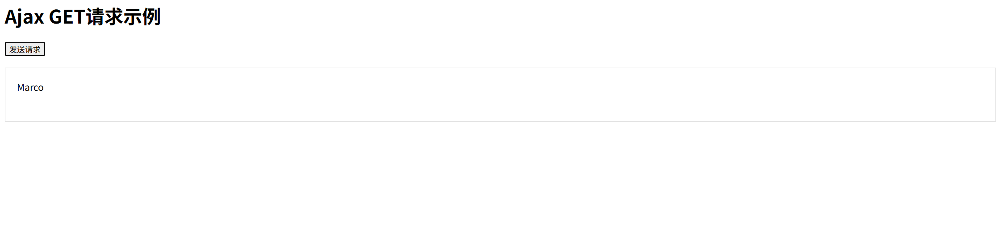
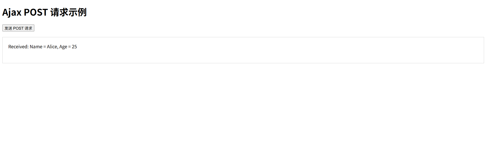
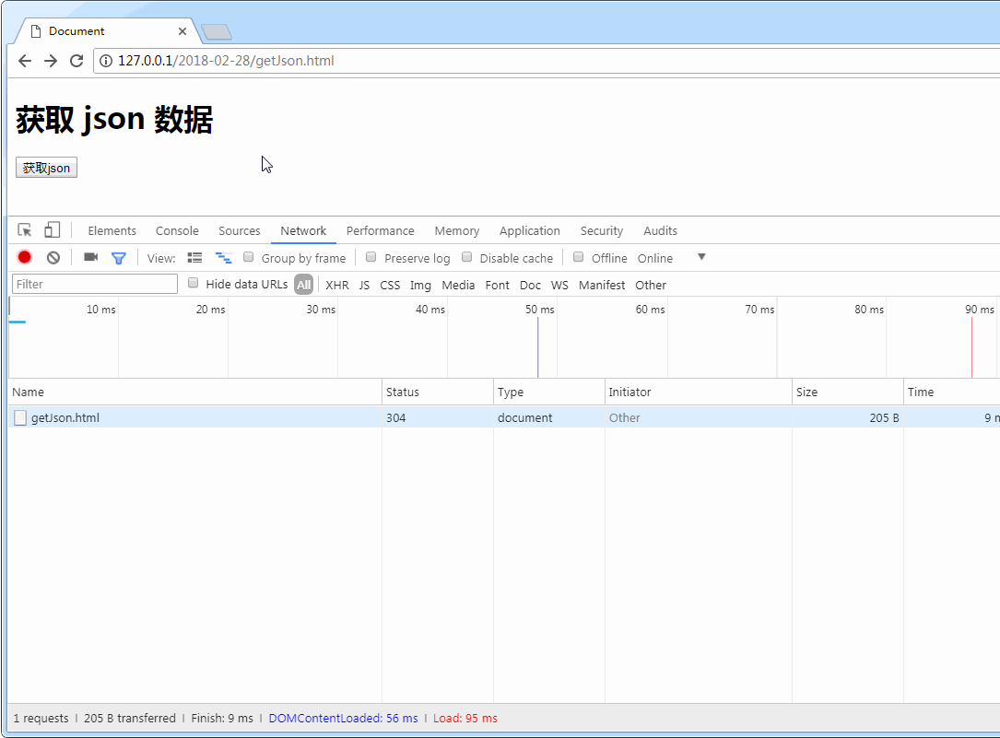
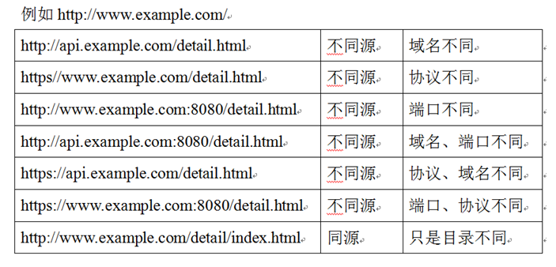

# 01-单线程和异步任务

## 单线程

### JS 是单线程的

JavaScript 语言的执行是**单线程**的。即同一时间，只能处理一个任务。

具体来说，所谓单线程，是指 JS 引擎中负责解释和执行 JavaScript 代码的线程只有一个，即同一时间，只能处理一个任务。这个任务执行完后才能执行下一个。所有的任务都**需要排队**。

#### 为什么 JS 是单线程的？

1. **设计初衷与浏览器环境**
    JavaScript 最初是为浏览器设计的，主要用来操作网页元素（DOM）和处理用户交互。如果 JS 是多线程的，多个线程可能会同时修改同一个 DOM 元素，导致冲突和不可预测的结果。单线程设计简化了开发，避免了复杂的并发问题。
2. **事件循环（Event Loop）**
    JS 通过“事件循环”机制来处理异步任务。虽然是单线程，但它可以把耗时操作（比如网络请求、定时器）交给运行时环境（浏览器或 Node.js）去处理，主线程则继续执行其他任务。任务完成后，结果会被放入事件队列，等待主线程空闲时处理。这种方式让 JS 看起来像是“多任务”的，但实际上仍然是单线程执行。

所以，为了避免这些复杂问题的出现，JS 被设计成了单线程语言。

### 浏览器是多进程、多线程的

JS代码在执行时有它的运行环境（也称之为“容器”），这个运行环境可以是浏览器，也可以是 Node.js 环境。

浏览器是多进程的，**每打开一个新的 tab 标签页就会开启一个新的进程**。每个进程之间是独立的，这是为了防止一个页面卡死而造成所有页面都无法响应，甚至整个浏览器强制退出。

**每个进程中有很多个线程**，其中有一个专门执行JS代码的线程，所以我们常说JS是单线程的，这没有说错。从JS语言的角度看，我们把这个线程称为“**主线程**”。

如果JS正在执行某个耗时的任务，则当前的线程会被阻塞，那应该怎么办呢？

实际上，**耗时的任务并不是在主线程中执行的**。因为浏览器的当前进程中有很多个线程，我们可以把耗时任务交给浏览器的其它线程来协助处理，然后在特定的时机通知主线程，该任务则会进入主线程同步完成。

比如，现在有一个三秒延迟的定时器任务。计时工作是交给浏览器的其他线程完成的，等三秒时间到了之后，通知JS主线程，该任务进入主线程进行同步执行。

## 同步任务和异步任务

在 JavaScript 中，同步任务和异步任务是两种不同的任务执行方式，它们决定了代码是如何被处理和执行的。以下是对它们的详细介绍：

### 同步任务 (Synchronous Tasks)
- **定义**：同步任务是指按照代码的书写顺序，依次执行的任务。前一个任务完成后，后一个任务才会开始执行。整个过程是线性的，任务之间会互相等待。
- **特点**：
  - 执行时，主线程会被占用，直到任务完成。
  - 阻塞性：如果某个同步任务耗时较长，后续任务必须等待。
  - 简单直接，适合需要立即得到结果的操作。
- **例子**：
  ```javascript
  console.log("任务 1");
  console.log("任务 2");
  console.log("任务 3");
  ```
  输出顺序：
  ```
  任务 1
  任务 2
  任务 3
  ```
  每个 `console.log` 都会在上一行执行完成后立即运行。

- **适用场景**：计算、变量赋值、简单的逻辑处理等不需要等待外部资源的情况。

### 异步任务 (Asynchronous Tasks)
- **定义**：异步任务是指不会立即执行的任务，通常涉及需要等待的操作（比如网络请求、文件读写、定时器等）。这些任务会被交给运行时环境处理，主线程不会停下来等待，而是继续执行后续代码。任务完成后，结果会通过回调、Promise 或 async/await 等方式返回。
- **特点**：
  - 非阻塞性：主线程可以继续处理其他任务。
  - 需要依赖事件循环机制：异步任务完成后会被放入任务队列，等待主线程空闲时执行。
  - 更复杂，需要处理回调或状态。
- **例子**：
  ```javascript
  console.log("开始");
  setTimeout(() => console.log("异步任务"), 1000);
  console.log("结束");
  ```
  输出顺序：
  ```
  开始
  结束
  异步任务
  ```
  `setTimeout` 是一个异步任务，它不会阻塞主线程。主线程先执行完同步代码（“开始”和“结束”），然后在 1 秒后处理异步任务。

- **适用场景**：网络请求（AJAX/fetch）、定时器（setTimeout/setInterval）、用户输入事件监听、文件操作等。

### 同步与异步的区别
| 特性         | 同步任务           | 异步任务                   |
| ------------ | ------------------ | -------------------------- |
| **执行顺序** | 按代码顺序立即执行 | 不立即执行，延迟处理       |
| **阻塞性**   | 阻塞主线程         | 非阻塞，主线程继续运行     |
| **机制**     | 直接在调用栈中执行 | 通过事件循环和任务队列处理 |
| **典型例子** | 变量赋值、计算     | setTimeout、fetch          |

### 前端使用异步编程的场景

什么时候需要**等待**，就什么时候用异步。常见的异步场景如下：

- 1、事件监听（比如说，按钮绑定点击事件之后，用户爱点不点。我们不可能卡在按钮那里，什么都不做。所以，应该用异步）
- 2、回调函数：
  - 2.1、定时器：setTimeout（定时炸弹）、setInterval（循环执行）
  - 2.2、ajax请求。
  - 2.3、Node.js：FS文件读写、数据库操作。
- 3、ES6 中的 Promise、Generator、async/await

现在的大部分软件项目，都是前后端分离的。后端生成接口，前端请求接口。前端发送 ajax 请求，向后端请求数据，然后**等待一段时间**后，才能拿到数据。这个请求过程就是异步任务。

### 接口调用的方式

js 中常见的接口调用方式，有以下几种：

- 原生 ajax、基于 jQuery 的 ajax
- Promise
- Fetch
- axios

后续文章，我们会重点讲一下接口调用里的 Ajax，然后在 ES6 语法中学习 **Promise**。在这之前，我们需要先了解同步任务、异步任务的事件循环机制。

### 多次异步调用的顺序

- 多次异步调用的结果，顺序可能不同步。
- 异步调用的结果如果**存在依赖**，则需要通过回调函数进行嵌套。

## 定时器：代码示例

掌握了上面的事件循环原理之后，我们来看几个例子。

### [#](https://web.qianguyihao.com/06-JavaScript基础：异步编程/01-单线程和异步任务.html#举例-1)举例 1

```js
console.log(1);

setTimeout(() => {
    console.log(2);
}, 1000);
console.log(3);
console.log(4);
```

打印结果：

```text
1
3
4
2
```

解释：先等同步任务执行完成后，再执行异步任务

### 举例 2（重要）

如果我把上面的等待时间，从 1 秒改成 0 秒，你看看打印结果会是什么。

```js
console.log(1);

setTimeout(() => {
    console.log(2);
}, 0);
console.log(3);
console.log(4);
```

打印结果：

```text
1
3
4
2
```

可以看到，打印结果没有任何变化，这个题目在面试中经常出现，考的就是 `setTimeout(()=> {}, 0)`会在什么时候执行。这就需要我们了解同步任务、异步任务的执行顺序，即前面讲到的**事件循环机制**。

解释：先等同步任务执行完成后，再执行异步任务。

同理，我们再来看看下面这段伪代码：

```js
setTimeout(() => {
    console.log('异步任务');
}, 2000);

// 伪代码
sleep(5000); //表示很耗时的同步任务
```

**时间线**

- **0 秒**：setTimeout 注册，计时开始，主线程继续执行。
- **0 秒 - 5 秒**：sleep(5000) 阻塞主线程。
- **2 秒时**：setTimeout 的回调被放入任务队列，但主线程仍在阻塞，无法执行。
- **5 秒时**：sleep(5000) 结束，主线程空闲，事件循环立刻执行任务队列中的回调。

### 举例 3（较真系列）

```js
setTimeout(() => {
    console.log('异步任务');
}, 1000);
```

上面的代码中，等到 1 秒之后，真的会执行异步任务吗？其实不是。

在浏览器中， setTimeout()/ setInterval() 的每调用一次定时器的最小时间间隔是**4毫秒**，这通常是由于函数嵌套导致（嵌套层级达到一定深度），或者是由于已经执行的 setInterval 的回调函数阻塞导致的。

上面的案例中，异步任务需要等待 1004 毫秒之后，才会从 Event Table 进入到 Event Queue。这在面试中也经常被问到。

## [#](https://web.qianguyihao.com/06-JavaScript基础：异步编程/01-单线程和异步任务.html#异步任务举例)异步任务举例

###  例 1：加载图片

```js
// 加载图片的异步任务
function loadImage(file, success, fail) {
    const img = new Image();
    img.src = file;
    img.onload = () => {
        // 图片加载成功
        success(img);
    };
    img.onerror = () => {
        // 图片加载失败
        fail(new Error('img load fail'));
    };
}

loadImage(
    'images/qia nguyihao.png',
    (img) => {
        console.log('图片加载成功');
        document.body.appendChild(img);
        img.style.border = 'solid 2px red';
    },
    (error) => {
        console.log('图片加载失败');
        console.log(error);
    }
);
```

### 例 2：定时器计时，移动 DOM 元素

```js
// 函数封装：定义一个定时器，每间隔 delay 毫秒之后，执行 callback 函数
function myInterval(callback, delay = 100) {
    let timeId = setInterval(() => callback(timeId), delay);
}

myInterval((timeId) => {
    // 每间隔 500毫秒之后，向右移动 .box 元素
    const myBox = document.getElementsByClassName('box')[0];
    const left = parseInt(window.getComputedStyle(myBox).left);
    myBox.style.left = left + 20 + 'px';
    if (left > 300) {
        clearInterval(timeId);

        // 每间隔 10 毫秒之后，将 .box 元素的宽度逐渐缩小，直到消失
        myInterval((timeId2) => {
            const width = parseInt(window.getComputedStyle(myBox).width);
            myBox.style.width = width - 1 + 'px';
            if (width <= 0) clearInterval(timeId2);
        }, 10);
    }
}, 200);
```

# 02-Ajax入门和发送http请求

## 同步和异步回顾

### [#](https://web.qianguyihao.com/06-JavaScript基础：异步编程/02-Ajax入门和发送http请求.html#同步和异步的简单理解)同步和异步的简单理解

- 同步：必须等待前面的任务完成，才能继续后面的任务。
- 异步：不受当前任务的影响。

拿排队举例：

- 同步：在银行排队时，只有等到你了，才能够去处理业务。
- 异步：在排队的时候，可以玩手机。

### [#](https://web.qianguyihao.com/06-JavaScript基础：异步编程/02-Ajax入门和发送http请求.html#异步更新网站)异步更新网站

我们在访问一个普通的网站时，当浏览器加载完`HTML、CSS、JS`以后，网站的内容就固定了。如果想让网站内容发生更改，就必须**刷新**页面才能够看到更新的内容。

可如果用到**异步更新**，情况就大为改观了。比如，我们在访问新浪微博时，看到一大半了，点击底部的**加载更多**，会自动帮我们加载更多的微博，同时页面并不会整体刷新。

试想一下，如果没有异步刷新的话，每次点击“加载更多”，网页都要重新刷新，体验就太糟糕了。

web 前端里的异步更新，就要用到 Ajax。很多人说，如果没有 Ajax，就没有互联网的今天。

关于同步和异步的更详细介绍，可以参考本项目的另外一篇文章：《05-JavaScript 基础：异步编程和 Ajax/01-单线程和异步》

## Ajax

### [#](https://web.qianguyihao.com/06-JavaScript基础：异步编程/02-Ajax入门和发送http请求.html#ajax-的概念)Ajax 的概念

在浏览器中，我们可以在不刷新页面的情况下，通过 Ajax 的方式去获取一些新的内容。

Ajax：Asynchronous Javascript And XML（异步 JavaScript 和 XML）。它并不是凭空出现的新技术，而是对于现有技术的结合。Ajax 的核心是 js 对象：**XMLHttpRequest**。

### Ajax 原理（发送 Ajax 请求的五个步骤）

我们先回忆一下，一个完整的 HTTP 请求需要的是：

- 请求的网址、请求方法 get/post。
- 提交请求的内容数据、请求主体等。
- 接收响应回来的内容。

发送 Ajax 请求的五个步骤：

（1）创建异步对象，即 XMLHttpRequest 对象。

（2）使用 open 方法设置请求参数。`open(method, url, async)`。参数解释：请求的方法、请求的 url、是否异步。第三个参数如果不写，则默认为 true。

（3）发送请求：`send()`。

（4）注册事件：注册 onreadystatechange 事件，状态改变时就会调用。

如果要在数据完整请求回来的时候才调用，我们需要手动写一些判断的逻辑。

（5）服务端响应，获取返回的数据。

## XMLHttpRequest 对象详解

我们在上一段讲解了使用 XMLHttpRequest 对象的五个步骤。本段，我们讲一下注意事项。

### [#](https://web.qianguyihao.com/06-JavaScript基础：异步编程/02-Ajax入门和发送http请求.html#发送请求)发送请求

发送请求的方法：

```javascript
open(method, url, async);
```

参数解释：

- method：请求的类型；GET 或 POST
- url：文件在服务器上的位置
- async：true（异步）或 false（同步）

示例
```js
xhr.open('GET', 'https://api.example.com/data', true);
```


另外还有个方法：（仅用于 POST 请求）

**作用**：发送请求到服务器。

**参数**：

- body：请求体数据（GET 请求通常为 null，POST 请求可以是字符串、FormData 等）。

**说明**：调用 send 后，请求正式发出。如果是异步请求，主线程不会等待响应。

```javascript
send(string);
```

示例

```js
xhr.send(); // GET 请求，无请求体
```

### POST 请求时注意

如果想让 像 form 表单提交数据那样使用 POST 请求，就需要使用 XMLHttpRequest 对象的 setRequestHeader()方法 来添加 HTTP 头。然后在 send() 方法中添加想要发送的数据：

```javascript
xmlhttp.open('POST', 'ajax_test.php', true);

xmlhttp.setRequestHeader('Content-type', 'application/x-www-form-urlencoded');

xmlhttp.send('name=smyhvae&age=27');
```

###  onreadystatechange 事件

注册 onreadystatechange 事件后，每当 readyState 属性改变时，就会调用 onreadystatechange 函数。

readyState：（存有 XMLHttpRequest 的状态。从 0 到 4 发生变化）

- 0: 请求未初始化
- 1: 服务器连接已建立
- 2: 请求已接收
- 3: 请求处理中
- 4: 请求已完成，且响应已就绪

status：

- 200: "OK"。
- 404: 未找到页面。

在 onreadystatechange 事件中，**当 readyState 等于 4，且状态码为 200 时，表示响应已就绪**。

### [#](https://web.qianguyihao.com/06-JavaScript基础：异步编程/02-Ajax入门和发送http请求.html#服务器响应的内容)服务器响应的内容

- responseText：获得字符串形式的响应数据。
- responseXML：获得 XML 形式的响应数据。

如果响应的是普通字符串，就使用 responseText；如果响应的是 XML，使用 responseXML。

## [#](https://web.qianguyihao.com/06-JavaScript基础：异步编程/02-Ajax入门和发送http请求.html#手写-ajax)手写 Ajax

### [#](https://web.qianguyihao.com/06-JavaScript基础：异步编程/02-Ajax入门和发送http请求.html#手写第一个-ajax-请求)手写第一个 Ajax 请求

get 请求：

```html
<!DOCTYPE html>
<html lang="en">
<head>
    <meta charset="UTF-8">
    <meta name="viewport" content="width=device-width, initial-scale=1.0">
    <title>Ajax GET请求示例</title>
    <style>
        #result {
            margin-top: 20px;
            padding: 20px;
            border: 1px solid #ccc;
            min-height: 50px;
        }
    </style>
</head>
<body>
    <h1>Ajax GET请求示例</h1>
    <button onclick="sendAjaxRequest()">发送请求</button>
    <div id="result">结果显示在这里</div>

    <script>
        function sendAjaxRequest() {
            var xmlhttp = new XMLHttpRequest();

            // 使用正确的文件名
            xmlhttp.open("get", "2.Ajax.php", true);

            xmlhttp.send();

            xmlhttp.onreadystatechange = function () {
                if (xmlhttp.readyState == 4 && xmlhttp.status == 200) {
                    console.log('数据返回成功：' + xmlhttp.responseText);
                    // 直接显示文本（因为返回的是 "Marco"）
                    document.getElementById('result').innerText = xmlhttp.responseText;
                } else if (xmlhttp.readyState == 4) {
                    console.error('请求失败，状态码：' + xmlhttp.status);
                    document.getElementById('result').innerText =
                        '请求失败，请检查网络连接或服务器状态。';
                }
            };

            // 添加网络错误处理
            xmlhttp.onerror = function () {
                console.error('网络错误');
                document.getElementById('result').innerText = '网络错误，请检查连接';
            };
        }
    </script>
</body>
</html>
```

结果


我来详细解释这段使用 `XMLHttpRequest` 发送 Ajax 请求的 JavaScript 函数 `sendAjaxRequest()`，逐步分解代码的每一部分，说明其作用和逻辑。

---

### 完整代码
```javascript
function sendAjaxRequest() {
    var xmlhttp = new XMLHttpRequest();

    // 使用正确的文件名
    xmlhttp.open("get", "2.Ajax.php", true);

    xmlhttp.send();

    xmlhttp.onreadystatechange = function () {
        if (xmlhttp.readyState == 4 && xmlhttp.status == 200) {
            console.log('数据返回成功：' + xmlhttp.responseText);
            // 直接显示文本（因为返回的是 "Marco"）
            document.getElementById('result').innerText = xmlhttp.responseText;
        } else if (xmlhttp.readyState == 4) {
            console.error('请求失败，状态码：' + xmlhttp.status);
            document.getElementById('result').innerText =
                '请求失败，请检查网络连接或服务器状态。';
        }
    };

    // 添加网络错误处理
    xmlhttp.onerror = function () {
        console.error('网络错误');
        document.getElementById('result').innerText = '网络错误，请检查连接';
    };
}
```

---

### 逐行解释

#### 1. 函数定义
```javascript
function sendAjaxRequest() {
```
- 定义一个名为 `sendAjaxRequest` 的函数，用于封装 Ajax 请求逻辑。
- 通常通过事件触发调用（如按钮的 `onclick`）。

#### 2. 创建 `XMLHttpRequest` 对象
```javascript
var xmlhttp = new XMLHttpRequest();
```
- 创建一个 `XMLHttpRequest` 对象，赋值给变量 `xmlhttp`。
- `XMLHttpRequest` 是浏览器提供的内置对象，用于发起 HTTP 请求。
- 它是 Ajax 的核心工具，用于与服务器通信。

#### 3. 配置请求
```javascript
xmlhttp.open("get", "2.Ajax.php", true);
```
- 调用 `open` 方法初始化请求，设置请求的基本参数。
- 参数说明：
  - **`"get"`**：请求方法为 GET，用于从服务器获取数据。GET 请求通常不带请求体，数据通过 URL 传递（如查询参数）。
  - **`"2.Ajax.php"`**：请求的目标 URL。这里是相对路径，指向服务器上的 `2.Ajax.php` 文件。假设文件返回 `"Marco"`（如你的 `02-ajax.php`）。
  - **`true`**：表示异步请求。请求发送后，主线程不会阻塞，回调函数会在响应到达时处理结果。如果设为 `false`（同步），会阻塞代码执行（不推荐）。
- **作用**：告诉 XHR 对象要发送什么类型的请求以及目标地址。

#### 4. 发送请求
```javascript
xmlhttp.send();
```
- 调用 `send` 方法正式发送请求到服务器。
- 因为是 GET 请求，没有请求体，所以 `send()` 不需要参数（传入 `null` 也可以，但通常省略）。
- 请求发出后，浏览器会在后台处理，等待服务器响应。

#### 5. 监听状态变化
```javascript
xmlhttp.onreadystatechange = function () {
```
- 为 `onreadystatechange` 属性绑定一个匿名函数，用于监听请求状态的变化。
- 每当 `xmlhttp.readyState`（请求状态）发生变化时，这个函数都会被调用。
- `readyState` 的可能值：
  - `0`：请求未初始化（`open` 未调用）。
  - `1`：请求已建立（`open` 已调用）。
  - `2`：请求已发送（`send` 已调用）。
  - `3`：请求处理中（接收部分数据）。
  - `4`：请求完成（数据接收完毕）。

#### 6. 处理成功响应
```javascript
if (xmlhttp.readyState == 4 && xmlhttp.status == 200) {
    console.log('数据返回成功：' + xmlhttp.responseText);
    // 直接显示文本（因为返回的是 "Marco"）
    document.getElementById('result').innerText = xmlhttp.responseText;
}
```
- **条件判断**：
  - `xmlhttp.readyState == 4`：请求已完成，数据已全部返回。
  - `xmlhttp.status == 200`：HTTP 状态码为 200，表示服务器成功处理请求。
- **逻辑**：
  - 如果这两个条件都满足，说明请求成功且数据可用。
- **操作**：
  - `console.log('数据返回成功：' + xmlhttp.responseText);`：
    - 在控制台输出调试信息，显示返回的数据。
    - `xmlhttp.responseText` 是服务器返回的文本内容（这里是 `"Marco"`）。
  - `document.getElementById('result').innerText = xmlhttp.responseText;`：
    - 将返回的数据（`"Marco"`）显示在页面上 `<div id="result">` 元素中。
    - `innerText` 设置元素的文本内容，直接覆盖原有内容。

#### 7. 处理失败响应
```javascript
else if (xmlhttp.readyState == 4) {
    console.error('请求失败，状态码：' + xmlhttp.status);
    document.getElementById('result').innerText =
        '请求失败，请检查网络连接或服务器状态。';
}
```
- **条件判断**：
  - `xmlhttp.readyState == 4`：请求已完成。
  - 如果 `status != 200`（如 404、500 等），说明请求失败。
- **逻辑**：
  - 只检查 `readyState == 4`，但不要求 `status == 200`，捕获所有非成功的状态码。
- **操作**：
  - `console.error('请求失败，状态码：' + xmlhttp.status);`：
    - 在控制台输出错误信息，包含具体的状态码（如 404 表示文件未找到）。
  - `document.getElementById('result').innerText = '请求失败，请检查网络连接或服务器状态。';`：
    - 在页面上显示用户友好的错误提示。

#### 8. 处理网络错误
```javascript
xmlhttp.onerror = function () {
    console.error('网络错误');
    document.getElementById('result').innerText = '网络错误，请检查连接';
};
```
- **作用**：
  - 为 `onerror` 属性绑定一个函数，处理网络层面的错误。
- **触发场景**：
  - 网络断开、服务器不可达、跨域问题（CORS）等。
  - 注意：`onerror` 不会触发 HTTP 错误（如 404、500），这些由 `status` 处理。
- **操作**：
  - `console.error('网络错误');`：在控制台记录错误。
  - `document.getElementById('result').innerText = '网络错误，请检查连接';`：
    - 在页面显示网络错误提示。

---

### 执行流程
1. 调用 `sendAjaxRequest()`（例如点击按钮）。
2. 创建 XHR 对象并配置 GET 请求到 `"2.Ajax.php"`。
3. 发送请求。
4. 服务器处理并返回 `"Marco"`（假设文件存在且内容正确）。
5. `onreadystatechange` 监听到状态变化：
   - 当 `readyState == 4` 且 `status == 200` 时，显示 `"Marco"`。
   - 如果失败（如文件不存在，返回 404），显示错误信息。
6. 如果网络出错，触发 `onerror`，显示网络错误提示。


post请求：

```html
<!DOCTYPE html>
<html lang="zh">
<head>
    <meta charset="UTF-8">
    <title>Ajax POST 请求示例</title>
    <style>
        #result {
            margin-top: 20px;
            padding: 20px;
            border: 1px solid #ccc;
            min-height: 50px;
        }
    </style>
</head>
<body>
    <h1>Ajax POST 请求示例</h1>
    <button onclick="sendAjaxRequest()">发送 POST 请求</button>
    <div id="result">结果显示在这里</div>

    <script>
        function sendAjaxRequest() {
            // 【步骤1】创建 XMLHttpRequest 对象
            var xmlhttp = new XMLHttpRequest();

            // 【步骤2】设置请求参数：POST 方法和 URL
            xmlhttp.open("post", "03.ajax.php", true);

            // 设置请求头，指定发送的数据格式
            xmlhttp.setRequestHeader("Content-Type", "application/x-www-form-urlencoded");

            // 【步骤3】发送请求，附带数据
            var data = "name=Alice&age=25"; // 要发送的表单数据
            xmlhttp.send(data);

            // 【步骤4】注册事件：监听状态变化
            xmlhttp.onreadystatechange = function () {
                if (xmlhttp.readyState == 4 && xmlhttp.status == 200) {
                    // 【步骤5】处理成功响应
                    console.log('数据返回成功：' + xmlhttp.responseText);
                    document.getElementById('result').innerText = xmlhttp.responseText;
                } else if (xmlhttp.readyState == 4) {
                    // 处理失败响应
                    console.error('请求失败，状态码：' + xmlhttp.status);
                    document.getElementById('result').innerText =
                        '请求失败，请检查网络连接或服务器状态。';
                }
            };

            // 处理网络错误
            xmlhttp.onerror = function () {
                console.error('网络错误');
                document.getElementById('result').innerText = '网络错误，请检查连接';
            };
        }
    </script>
</body>
</html>
```

---



### 对应的服务器端代码（`02-ajax.php`）

为了让这个 POST 请求有实际效果，假设 `02-ajax.php` 处理 POST 数据并返回结果：
```php
<?php
// 获取 POST 数据
$name = $_POST['name'] ?? 'Unknown';
$age = $_POST['age'] ?? 'N/A';

// 返回响应
echo "Received: Name = $name, Age = $age";
?>
```

---

### 代码详细解释

#### 1. HTML 结构
- `<button>`：点击触发 `sendAjaxRequest()` 函数。
- `<div id="result">`：显示服务器返回的结果或错误信息。

#### 2. JavaScript 逻辑
与 GET 请求类似，分为五步，但增加了 POST 的特性：

- **步骤 1：创建 XHR 对象**
  ```javascript
  var xmlhttp = new XMLHttpRequest();
  ```
  - 创建 `XMLHttpRequest` 对象，用于发起请求。

- **步骤 2：设置请求参数**
  ```javascript
  xmlhttp.open("post", "02-ajax.php", true);
  ```
  - 使用 `"post"` 方法，表示发送 POST 请求。
  - 目标 URL 是 `"02-ajax.php"`（假设与 HTML 文件在同一目录）。
  - `true` 表示异步请求。

- **设置请求头**
  ```javascript
  xmlhttp.setRequestHeader("Content-Type", "application/x-www-form-urlencoded");
  ```
  - 调用 `setRequestHeader()` 设置 `Content-Type` 请求头。
  - `"application/x-www-form-urlencoded"` 表示数据是表单编码格式（键值对，如 `name=Alice&age=25`），这是传统表单提交的默认格式。
  - **注意**：必须在 `open()` 之后、`send()` 之前设置。

- **步骤 3：发送请求**
  ```javascript
  var data = "name=Alice&age=25";
  xmlhttp.send(data);
  ```
  - 定义要发送的数据 `data`，格式为键值对字符串，模拟表单提交。
  - `send(data)` 将数据作为请求体发送到服务器。
  - **与 GET 的区别**：GET 数据放在 URL 中（查询参数），而 POST 数据放在请求体中。

- **步骤 4：监听状态变化**
  ```javascript
  xmlhttp.onreadystatechange = function () {
      if (xmlhttp.readyState == 4 && xmlhttp.status == 200) {
          console.log('数据返回成功：' + xmlhttp.responseText);
          document.getElementById('result').innerText = xmlhttp.responseText;
      } else if (xmlhttp.readyState == 4) {
          console.error('请求失败，状态码：' + xmlhttp.status);
          document.getElementById('result').innerText =
              '请求失败，请检查网络连接或服务器状态。';
      }
  };
  ```
  - 与 GET 请求相同：
    - `readyState == 4 && status == 200`：请求成功，显示服务器返回的内容（例如 `"Received: Name = Alice, Age = 25"`）。
    - `readyState == 4`（但 `status != 200`）：请求完成但失败，显示错误信息。

- **步骤 5：错误处理**
  ```javascript
  xmlhttp.onerror = function () {
      console.error('网络错误');
      document.getElementById('result').innerText = '网络错误，请检查连接';
  };
  ```
  - 处理网络错误（如断网或跨域问题）。

---

### 执行效果
1. 将 `ajax-test.html` 和 `02-ajax.php` 放入服务器目录（如 `C:\xampp\htdocs`）。
2. 启动服务器（如 XAMPP 的 Apache）。
3. 在浏览器访问 `http://localhost/ajax-test.html`。
4. 点击“发送 POST 请求”按钮：
   - **成功时**：
     - 控制台输出：`"数据返回成功：Received: Name = Alice, Age = 25"`
     - `<div id="result">` 显示：`"Received: Name = Alice, Age = 25"`
   - **失败时**：
     - 如果文件不存在（404）：`"请求失败，请检查网络连接或服务器状态。"`

---

### POST 请求的 HTTP 格式
浏览器发送的请求类似于：
```
POST /02-ajax.php HTTP/1.1
Host: localhost
Content-Type: application/x-www-form-urlencoded
Content-Length: 15

name=Alice&age=25
```
服务器响应：
```
HTTP/1.1 200 OK
Content-Type: text/html; charset=UTF-8

Received: Name = Alice, Age = 25
```

---

### 注意事项
1. **文件路径**：
   - 确保 `"02-ajax.php"` 是正确的文件名和路径。如果文件名不同（如 `2.Ajax.php`），需调整：
     ```javascript
     xmlhttp.open("post", "2.Ajax.php", true);
     ```

2. **运行环境**：
   - 必须通过 Web 服务器运行（如 `http://localhost`），不能用 `file://` 打开 HTML 文件。

3. **数据格式**：
   - 当前使用 `application/x-www-form-urlencoded`，适合表单数据。
   - 如果要发送 JSON，修改如下：
     ```javascript
     xmlhttp.setRequestHeader("Content-Type", "application/json");
     var data = JSON.stringify({ name: "Alice", age: 25 });
     xmlhttp.send(data);
     ```
     服务器端需解析 JSON（用 `json_decode`）。

4. **服务器端支持**：
   - `02-ajax.php` 需正确处理 `$_POST` 数据。如果服务器未返回预期内容，检查 PHP 逻辑。

---

### 与 GET 请求的对比
| 特性          | GET 请求                   | POST 请求                      |
| ------------- | -------------------------- | ------------------------------ |
| **方法**      | `xmlhttp.open("get", ...)` | `xmlhttp.open("post", ...)`    |
| **数据位置**  | URL 查询参数               | 请求体                         |
| **请求头**    | 不需要 `setRequestHeader`  | 需要设置 `Content-Type`        |
| **send 参数** | `xmlhttp.send()`（无数据） | `xmlhttp.send(data)`（带数据） |

### 封装 Ajax 请求（重要）

上面的代码，执行顺序很好理解，但在实战开发中，是不会这么写的。假如你的页面中，需要调十次接口，那岂不是要手写十遍 Ajax 请求？这样会导致大量的重复代码。

所以，我们需要把重复代码封装成一个公共函数，然后通过**回调函数**处理成功和失败的逻辑。

封装 Ajax 请求的代码如下：(get 请求为例)

```js
// 封装 Ajax为公共函数：传入回调函数 success 和 fail
function myAjax(url, success, fail) {
    // 1、创建XMLHttpRequest对象
    var xmlhttp;
    if (window.XMLHttpRequest) {
        xmlhttp = new XMLHttpRequest();
    } else {
        // 兼容IE5、IE6浏览器。不写也没关系
        xmlhttp = new ActiveXObject('Microsoft.XMLHTTP');
    }
    // 2、发送请求
    xmlhttp.open('GET', url, true);
    xmlhttp.send();
    // 3、服务端响应
    xmlhttp.onreadystatechange = function () {
        if (xmlhttp.readyState === 4 && xmlhttp.status === 200) {
            var obj = JSON.parse(xmlhttp.responseText);
            console.log('数据返回成功：' + obj);
            success && success(xmlhttp.responseText);
        } else {
            // 这里的 && 符号，意思是：如果传了 fail 参数，就调用后面的 fail()；如果没传 fail 参数，就不调用后面的内容。因为 fail 参数不一定会传。
            fail && fail(new Error('接口请求失败'));
        }
    };
}

// 单次调用 ajax
myAjax('a.json', (res) => {
    console.log(res);
});

// 多次调用 ajax。接口请求顺序：a --> b --> c
myAjax('a.json', (res) => {
    console.log(res);
    myAjax('b.json', (res) => {
        console.log(res);
        myAjax('c.json', (res) => {
            console.log(res);
        });
    });
});
```

学会了封装 get 请求之后，封装 post请求也是类似的写法。

### Ajax 多个接口的嵌套请求

我们在做异步任务的时候，经常会涉及到多个接口的嵌套请求。比如说，接口 1 请求完成后，需要根据接口 1 的数据请求接口 2；接口 2 请求完成后，需要根据接口 3 的数据请求接口 3，以此类推。

需求描述：

- 请求接口 1，根据用户名获取用户 id
- 请求接口 2，根据用户 id 获取用户的年龄、性别等信息。

代码实现思路：

```js
myAjax('http://localhost:8888/php/user.php?name=千古', (userInfo) => {
    // 根据第一个接口返回的 userInfo.id，继续请求第二个接口
    myAjax(`http://localhost:8888/php/info.php?id=${userInfo['id']}`, (res) => {
        console.log(response);
    });
});
```

##  jQuery 中的 Ajax

JQuery 作为最受欢迎的 js 框架之一，常见的 Ajax 已经帮助我们封装好了，只需要调用即可。更为详细的 api 文档可以查阅：[w3cSchool_JQueryAjax(opens new window)](http://www.w3school.com.cn/jquery/jquery_ref_ajax.asp)

格式举例：

```javascript
$.ajax({
    url: 'https://xxx.com/getUserInfo.php', // 接口的请求地址
    data: 'name=fox&age=18', // 请求参数
    type: 'GET', //请求的方式
    success: function (argument) {
        // 接口请求成功时调用
        console.log('接口请求成功');
    },
    beforeSend: function (argument) {}, // 在发送请求之前调用,可以做一些验证之类的处理
    error: function (argument) {
        // 接口请求失败时调用
        console.log('接口请求失败');
    },
});
```

代码举例：

（1）index.html

```html
<!DOCTYPE html>
<html lang="en">
    <head>
        <meta charset="UTF-8" />
        <title>jquery-ajax</title>
    </head>
    <body>
        <input type="button" value="点击" id="btn" />
        <div id="showInfo"></div>
        <script type="text/javascript" src="jquery-1.11.2.js"></script>
        <script type="text/javascript">
            $(function () {
                $('#btn').click(function () {
                    $.ajax({
                        url: 'https://xxx.com/getUserInfo.php', // 接口的请求地址
                        dataType: 'text',
                        data: 'name=fox&age=18', // 请求参数
                        type: 'get',
                        success: function (data) {
                            console.log('接口请求成功');
                            alert(data);
                            // $("#showInfo").html(data);
                        },
                        error: function (err) {
                            console.log('接口请求失败：' + err);
                        },
                    });
                });
            });
        </script>
    </body>
</html>
```

（2）data.php：

```php
<?php

$text = 'hello world';

echo $text;

 ?>
```

# 03-Ajax传输json和XML

## Ajax 传输 JSON

### [#](https://web.qianguyihao.com/06-JavaScript基础：异步编程/03-Ajax传输json和XML.html#json-的语法)JSON 的语法

JSON(JavaScript Object Notation)：是 ECMAScript 的子集。作用是进行数据的交换。语法更为简洁，网络传输、机器解析都更为迅速。

语法规则：

- 数据在键值对中
- 数据由逗号分隔
- 花括号保存对象
- 方括号保存数组

数据类型：

- 数字（整数或浮点数）
- 字符串（在双引号中）
- 逻辑值（true 或 false）
- 数组（在方括号中）
- 对象（在花括号中）
- null

示例：

```json
// 对象
{
  "name":"fox",
  "age":"18",
  "sex":"true",
  "car":null
}

// 数组
[
  {
      "name":"小小胡",
      "age":"1"
  },
  {
      "name":"小二胡",
      "age":"2"
  }
]
```

### JavaScript 中：json 字符串 <--> js 对象

基本上，所有的语言都有**将 json 字符串转化为该语言对象**的语法。

比如在 js 中：

- JSON.parse()：将 JSON 字符串转化为 js 对象。例如：

```javascript
// 将 JSON 字符串格式化为 js 对象
var jsObj = JSON.parse(ajax.responseText);
```

- JSON.stringify()：将 JS 对象转化为 JSON 字符串。例如：

```javascript
var Obj = {
    name: 'fox',
    age: 18,
    skill: '撩妹',
};

console.log(Obj);

// 将 js 对象格式化为 JSON 字符串
var jsonStr = JSON.stringify(Obj);
```

### PHP 中：json 字符串 <--> js 对象

- **json_decode()**方法：将`json`字符串转化为变量。
- **json_encode()**方法：将变量转化为`json`字符串。

代码举例：

```php
<?php
    header("Content-Type:text/html;charset=utf-8");
    // json字符串
    $jsonStr = '{"name":"itcast","age":54,"skill":"歌神"}';
    // 字符串转化为 php对象
      print_r(json_decode($jsonStr));

      echo "<br>";
      // php数组
      $arrayName = array('name' =>'littleFox' ,'age' => 13 );
      // php对象 转化为 json字符串
      print_r(json_encode($arrayName));
 ?>
```

输出结果：

```bash
	stdClass Object ( [name] => itcast [age] => 54 [skill] => 歌神 )
	{"name":"littleFox","age":13}
```

### ajax 请求解析 json（举例）

（1）Person.json:

```json
{
    "name": "小强",
    "skill": "砍树",
    "friend": "老板"
}
```

（2）myJson.php：

```php
<?php

	// 读取json文件 并返回即可
	echo  file_get_contents('info/Person.json');

 ?>
```

（3）getJson.html：

```html
<!DOCTYPE html>
<html lang="en">
    <head>
        <meta charset="UTF-8" />
        <title>Document</title>
    </head>
    <body>
        <h1>获取 json 数据</h1>
        <input type="button" value="获取json" id="btnJson" />
    </body>
</html>
<script type="text/javascript">
    // 获取的是一个 如果要获取多个
    // document.querySelectorAll(selector)
    document.querySelector('#btnJson').onclick = function () {
        var ajax = new XMLHttpRequest();

        ajax.open('get', 'myJson.php');

        ajax.send();

        ajax.onreadystatechange = function () {
            if (ajax.readyState == 4 && ajax.status == 200) {
                // json 字符串 是字符串 所以我们可以 通过  responseText获取
                console.log(ajax.responseText);

                // 转化为 js对象
                var jsObj = JSON.parse(ajax.responseText);

                console.log(jsObj);

                // 拼接ul s
                var str = '';

                str += '<ul>';
                str += '<li>' + jsObj.name + '</li>';
                str += '<li>' + jsObj.skill + '</li>';
                str += '<li>' + jsObj.friend + '</li>';
                str += '</ul>';

                // 设置到界面上

                document.body.innerHTML = str;
            }
        };
    };
</script>
```

演示效果：



## Ajax 传输 XML

### [#](https://web.qianguyihao.com/06-JavaScript基础：异步编程/03-Ajax传输json和XML.html#xml-语法)XML 语法

XML（Extensible Markup Language）：可扩展标记语言。详细语法可以查看：[# (opens new window)](http://www.w3school.com.cn/xml/index.asp)。

**1、XML 声明：**

```xml
<?xml version="1.0" encoding="UTF-8"?>
```

第一行的声明，指定了 XML 版本(1.0)以及使用的编码。

**2、自定义标签：**

XML 中没有默认的标签，所有的标签都是我们自己已定义的。例如：

```xml
<fox></fox>
<name></name>
```

XML 中没有单标签，都是双标签。

**3、根节点：**

XML 中必须要有一个根节点，所有的子节点都放置在根节点下。例如：

```xml
<root1>
  <name></name>
</root1>
```

### XML 解析

因为 XML 就是标签，所以我们可以直接用**解析 Dom 元素**的方法解析 XML。

**解析过程：**

（1）html 部分：（包含 xml ）

```html
<!DOCTYPE html>
<html lang="en">
    <head>
        <meta charset="UTF-8" />
        <title>Document</title>
    </head>
    <body>
        <person id="personXML">
            <name>fox</name>
            <age>18</age>
            <skill>小花花</skill>
        </person>
    </body>
</html>
```

（2）解析 xml：

```html
<script type="text/javascript">
    var xmlObj = document.getElementById('personXML');
    var name = xmlObj.getElementsByTagName('name')[0].innerHTML;

    console.log(name);
</script>
```

### ajax 请求解析 xml（举例）

（1）get_xml.php：（里面包含了 xml 文件）

```php
<?php
	// 设置 返回的为 xml
	header('content-type:text/xml; charset= utf-8');

	// 读取xml文件 并返回
	echo file_get_contents('info/star.xml');

 ?>
```

上方代码解释：

- php 自带了 读取 xml 文件的方法。
- 在 php 中，如果要使用 xml 传输数据，则需要使用 header()设置返回的内容为 xml。

（2）get_xml.html：（Ajax 请求，获取并解析 xml）

```html
<!DOCTYPE html>
<html lang="en">
    <head>
        <meta charset="UTF-8" />
        <title>Document</title>
    </head>
    <body>
        <input type="button" value="获取XMl数据" id="getXML" />
    </body>
</html>
<script type="text/javascript">
    document.querySelector('#getXML').onclick = function () {
        var ajax = new XMLHttpRequest();

        ajax.open('get', 'get_XMl.php');

        ajax.send();

        ajax.onreadystatechange = function () {
            if (ajax.readyState == 4 && ajax.status == 200) {
                // 如果 返回的是 xml文件
                console.log(ajax.responseText);

                // 异步 对象中 有另外一个属性 用来专门获取 xml
                // xml对象 在浏览器段 就是一个 document对象
                // 解析时 可以直接使用 querySelector 或者 getElementById等等 document对象 有的语法
                console.log(ajax.responseXML);
                console.log(ajax.responseXML.querySelector('kuzi').innerHTML);
                // 下面这个 页面文档对象 如果要获取某个标签
                console.log(window.document);
            }
        };
    };
</script>
```

# 04-同源和跨域

##  同源和跨域

## [#](https://web.qianguyihao.com/06-JavaScript基础：异步编程/04-同源和跨域.html#同源)同源

同源策略是浏览器的一种安全策略，所谓同源是指，域名，协议，端口完全相同。

## [#](https://web.qianguyihao.com/06-JavaScript基础：异步编程/04-同源和跨域.html#跨域问题的解决方案)跨域问题的解决方案

从我自己的网站访问别人网站的内容，就叫跨域。



出于安全性考虑，浏览器不允许ajax跨域获取数据。

- iframe：处于安全性考虑，浏览器的开发厂商已经禁止了这种方式。
- JSONP：script 标签的 src 属性传递数据。

## JSONP

JSONP（JSON with Padding）是一种跨域数据获取的技术，用于解决传统 Ajax 请求（如 `XMLHttpRequest`）在跨域时受到 **同源策略**（Same-Origin Policy）限制的问题。它利用了 `<script>` 标签天然支持跨域加载资源的特性，通过动态创建脚本标签来实现跨域请求。以下我将详细介绍 JSONP 的原理、实现方式、优缺点以及与现代跨域方案的对比。

---

### 什么是 JSONP？

#### 定义
- **全称**：JSON with Padding（带填充的 JSON）。
- **本质**：一种跨域解决方案，通过 `<script>` 标签加载远程服务器的 JavaScript 代码，并将数据包装在回调函数中返回。
- **核心思想**：客户端定义一个回调函数，服务器返回一段调用该函数的 JavaScript 代码，附带数据作为参数。

#### 同源策略问题
- 浏览器的同源策略限制了 `XMLHttpRequest` 只能请求同源（协议、域名、端口相同）的资源。
- 例如：`http://a.com` 无法通过 XHR 直接请求 `http://b.com/data`。
- 而 `<script>`、`` 等标签的 `src` 属性没有此限制，可以加载任意域的资源，JSONP 利用了这一点。

---

### JSONP 的工作原理

1. **客户端**：
   - 定义一个全局回调函数（如 `callback`）。
   - 动态创建一个 `<script>` 标签，`src` 指向服务器地址，并通过查询参数传递回调函数名（如 `?callback=callback`）。
2. **服务器**：
   - 接收回调函数名。
   - 将数据包装在该函数调用中，返回一段 JavaScript 代码（如 `callback({"name": "Alice"})`）。
3. **客户端执行**：
   - `<script>` 加载完成后，浏览器执行返回的代码，自动调用预定义的回调函数，并传入数据。

#### 图解
```
客户端：
1. 定义回调函数：function callback(data) { console.log(data); }
2. 添加 <script src="http://b.com/data?callback=callback">

服务器：
返回：callback({"name": "Alice"})

客户端：
浏览器执行：callback({"name": "Alice"}) → 输出 { name: "Alice" }
```

---

### 实现示例

#### 客户端代码
```html
<!DOCTYPE html>
<html lang="zh">
<head>
    <meta charset="UTF-8">
    <title>JSONP 示例</title>
</head>
<body>
    <h1>JSONP 测试</h1>
    <button onclick="fetchData()">获取数据</button>
    <div id="result">结果显示在这里</div>

    <script>
        // 定义回调函数
        function handleResponse(data) {
            document.getElementById('result').innerText = 
                `姓名: ${data.name}, 年龄: ${data.age}`;
        }

        // 动态创建 script 标签发送请求
        function fetchData() {
            const script = document.createElement('script');
            script.src = 'http://localhost:8888/jsonp.php?callback=handleResponse';
            document.body.appendChild(script);

            // 可选：加载完成后移除 script 标签
            script.onload = () => document.body.removeChild(script);
        }
    </script>
</body>
</html>
```

#### 服务器端代码（`jsonp.php`）
```php
<?php
// 获取回调函数名
$callback = $_GET['callback'] ?? 'callback';

// 模拟数据
$data = ['name' => 'Alice', 'age' => 25];

// 返回 JSONP 格式的 JavaScript 代码
header('Content-Type: application/javascript');
echo "$callback(" . json_encode($data) . ");";
?>
```

#### 执行过程
1. 点击按钮，创建 `<script src="http://localhost:8888/jsonp.php?callback=handleResponse">`。
2. 服务器返回：`handleResponse({"name": "Alice", "age": 25});`。
3. 浏览器执行该代码，调用 `handleResponse`，页面显示：
   ```
   姓名: Alice, 年龄: 25
   ```

---

### JSONP 的特点

#### 优点
1. **跨域支持**：
   - 绕过同源策略，适用于早期浏览器或不支持 CORS 的场景。
2. **简单易用**：
   - 只需客户端和服务器约定回调函数名即可实现。
3. **广泛兼容**：
   - 几乎所有浏览器都支持 `<script>` 标签加载。

#### 缺点
1. **仅支持 GET 请求**：
   - 数据通过 URL 查询参数传递，不支持 POST、PUT 等方法。
2. **安全性问题**：
   - 执行的是远程服务器返回的 JavaScript 代码，如果服务器被恶意控制，可能注入恶意脚本（XSS 风险）。
3. **无错误处理**：
   - `<script>` 加载失败不会触发标准 HTTP 错误（如 404、500），只能通过超时检测等方式间接处理。
4. **服务器支持要求**：
   - 服务器必须返回特定的 JSONP 格式数据，增加了后端适配成本。

---

### 与现代跨域方案的对比

#### JSONP vs CORS
- **CORS（跨源资源共享）**：
  - 现代标准，通过服务器设置 `Access-Control-Allow-Origin` 头支持跨域。
  - 支持所有 HTTP 方法（GET、POST 等）。
  - 使用 `XMLHttpRequest` 或 `fetch`，有完整的错误处理机制。
  - **优势**：更安全、灵活，推荐使用。
- **JSONP**：
  - 早期方案，仅限 GET，安全性较低。
  - 适用于不支持 CORS 的老旧系统。

#### JSONP vs Fetch
- **`fetch`**：
  - 现代 API，支持 CORS，功能强大。
  - 不支持 JSONP，但可用 `script` 标签模拟。
- **JSONP**：
  - 依赖 `<script>`，更简单但功能受限。

#### 示例：CORS 替代 JSONP
```javascript
fetch('http://localhost:8888/data', { method: 'GET' })
    .then(response => response.json())
    .then(data => console.log(data))
    .catch(error => console.error(error));
```
- 服务器需设置：
  ```
  Access-Control-Allow-Origin: *
  ```

---

### JSONP 的改进封装
为了更方便使用，可以封装 JSONP 请求：

```javascript
function jsonp({ url, callbackName = 'callback', success, error, timeout = 5000 }) {
    // 创建唯一回调函数名
    const cbName = `${callbackName}_${Date.now()}_${Math.random().toString(36).slice(2)}`;
    
    // 定义全局回调函数
    window[cbName] = function (data) {
        clearTimeout(timer);
        document.body.removeChild(script);
        delete window[cbName];
        success(data);
    };

    // 创建 script 标签
    const script = document.createElement('script');
    script.src = `${url}${url.includes('?') ? '&' : '?'}${callbackName}=${cbName}`;
    document.body.appendChild(script);

    // 超时处理
    const timer = setTimeout(() => {
        document.body.removeChild(script);
        delete window[cbName];
        error(new Error('JSONP request timeout'));
    }, timeout);

    // 加载错误处理
    script.onerror = () => {
        clearTimeout(timer);
        document.body.removeChild(script);
        delete window[cbName];
        error(new Error('JSONP request failed'));
    };
}

// 使用
jsonp({
    url: 'http://localhost:8888/jsonp.php',
    success: data => console.log('成功:', data),
    error: err => console.error('失败:', err)
});
```

---

### 应用场景
- **早期 Web 开发**：在 CORS 不普及时，用于跨域获取数据（如天气 API）。
- **第三方 API**：某些老旧 API 只支持 JSONP。
- **简单数据加载**：无需复杂配置的跨域请求。

---

### 总结
- **JSONP** 是一种利用 `<script>` 标签绕过同源策略的跨域技术，通过回调函数传递数据。
- **原理**：客户端定义回调，服务器返回 `callback(data)` 格式的脚本。
- **局限**：仅支持 GET、安全性较低、无标准错误处理。
- **现代替代**：CORS 和 `fetch` 是更优选择，JSONP 如今多用于遗留系统支持。

JSONP 是 Web 发展史上的重要一环，尽管逐渐被淘汰，但理解其原理有助于掌握跨域问题的本质。