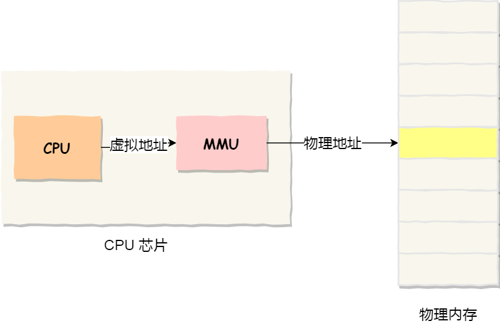
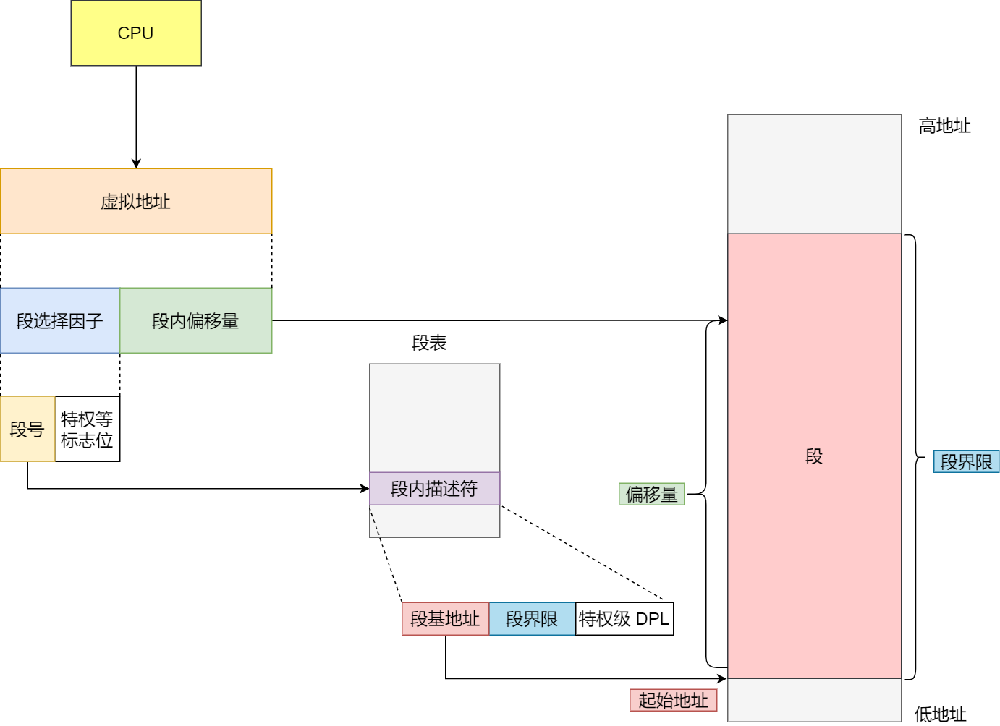
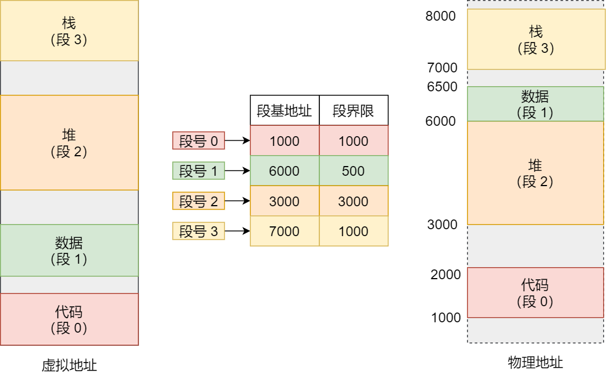
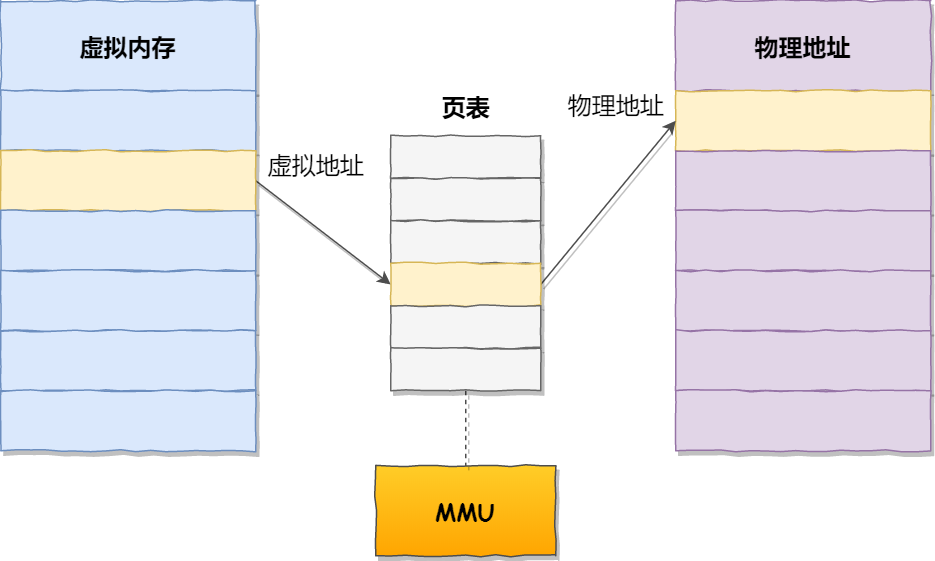
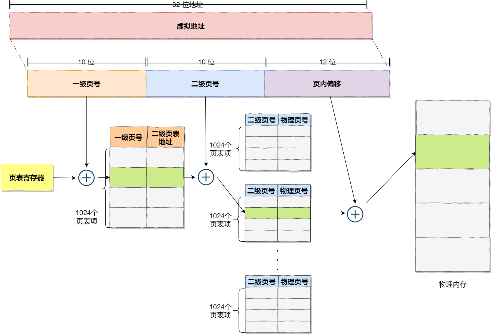
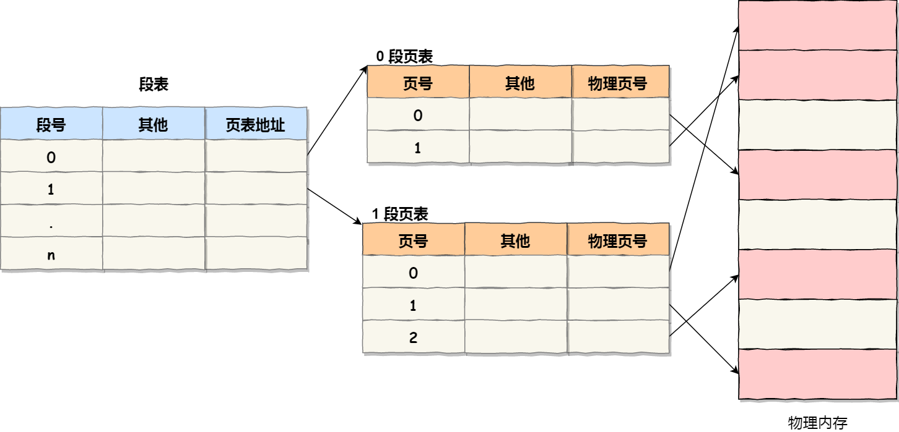
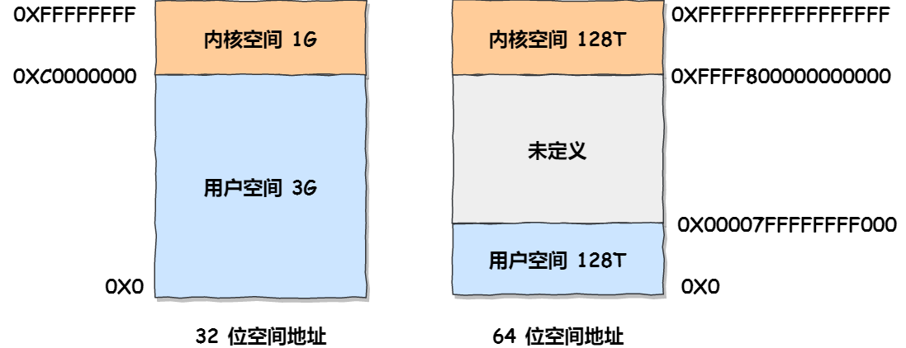

### 2.28

#### 1.1 CPU执行程序<a name="1.1-2"></a>

##### **1、图灵机**


组成：一条纸袋，一个读写头，读写头上的一些部件（比如存储单元、控制单元以及运算单元）

模拟数学运算$1+2$

（1）用读写通用把1、2、+这三个字符分别写入纸袋的三个格子，然后读写头先停在“1”对应的格子上；

（2）1读入到存储设备，这个存储设备称为图灵机的状态；

（3）读写头向右移动，用同样的方式把“2”读入到图灵机的状态；

（4）再向右移动，碰到"+"，将“+”号传输给控制单元，控制单元会发现是一个”+”而不是数字，所以没有像数字存入到状态中，而是作为运算单元，把“1”和“2”读入并且计算，再将计算的结果3存放到状态中；

（5）运算单元把结果返回给控制单元，控制单元将结果传输给读写头，读写头向右移动，把3写入纸袋的格子里面；

##### **2、冯诺依曼模型**

组成部分：中央处理器（CPU）、内存、输入设备、输出设备、总线。


（1）内存

程序和数据都是存储在内存，存储的区域是线性的。

内存的地址是从0开始编号的，然后自增排列，最好一个地址为内存总字节数-1，这种结构类似数组这种数据结构。由于是线性排列的，所以内存读写任何一个数据的速度都是一样的。

（2）CPU（中央处理器）

CPU的位宽：

- 32位：一次可以计算32b，4个字节，一次最大可以计算2³² - 1 = 4,294,967,295（无符号整数）
- 64位：一次可以计算64b，8个字节，一次最大可以计算2⁶⁴ - 1 = 18,446,744,073,709,551,615（无符号整数）

CPU内部还有组件，常见的如

- 寄存器：存储计算时的数据

> 相比于内存而言，寄存器的计算速度更快，因为内存离CPU太远了，而寄存器就在CPU内，还紧挨着控制单元和逻辑运算单元。

通用寄存器：用来存放需要计算的数据，比如两个加数

程序计数器：存储CPU要执行的下一条指令

指令寄存器：存放指令

- 控制单元：负责控制CPU工作
- 逻辑运算单元等：负责运算

（3）总线

- 地址总线：用于指定CPU将要操作的内存地址
- 数据总线：用于读写内存的数据
- 控制总线：用于发送和接受信号，当CPU收到信号后也需要控制总线

CPU需要读写内存数据的时候，需要两个总线：首先通过地址总线来指定内存的地址；再通过数据总线来传输数据

（4）输入、输出设备

输入设备向计算机输入数据，计算机通过计算后，把数据输出给输出设备。

##### **3、线路位宽与CPU位宽**

**线路位宽**

线路位宽通常指的是计算机硬件中数据传输通道的宽度，也就是一次可以传输的数据位数（bit）。比如内存总线、数据总线或地址总线的位宽。线路位宽直接影响数据传输的效率：

**CPU位宽**

CPU位宽一般指的是CPU的**寄存器宽度**或**数据处理能力**，也就是CPU一次能够处理的数据位数。常见的CPU位宽有8位、16位、32位和64位。它决定了：

假设一台电脑

- 64位CPU：说明它能处理64位数据，寻址能力达到2⁶⁴。
- 64位数据总线：CPU与内存之间一次传输64位数据。
  这时，CPU和线路位宽匹配，性能最佳。如果总线只有32位，CPU需要两次传输才能拿到64位数据，效率会下降。

##### **4、程序执行的基本过程**


一个程序执行的时候，CPU会根据程序计数器里的内存地址，从内存里面把需要执行的指令读取到指令寄存器里面实行，然后分局指令长度自增，开始顺序读取下一条指令。

CPU的指令周期：CPU从程序计数器读取指令、到执行、再到下一条指令，这个过程会不断循环，直到程序执行结束的过程。


##### **5、a=1 + 2执行具体过程**

编译器会把a=1 + 2翻译成四条指令，存放到正文段中。


编译完成之后，具体执行程序的时候，程序计数器会被设置为0x200地址，然后依次执行这四条指令


##### **6、指令**

不同的CPU有不同的指令集，也就是对应着不同的汇编语言和不同的机器码。

下面介绍MIPS指令集：

MIPS指令是一个32位的整数，高6位代表着操作码，剩下26位不同指令类型所表示的内容也就不相同


R型指令：操作数全部来自寄存器，计算结果也存储到寄存器中。

I型指令：一个操作数来自寄存器，另一个是立即数（直接嵌入指令中的常量），结果存储到寄存器中。

J型指令：用于无条件跳转，跳转目标地址通过立即数计算得出，通常不涉及寄存器操作数的计算。


指令周期：

1.CPU通过程序计数器读取对应内存地址的指令，这个部分称为Fetch（取得指令）；
2.CPU对指令进行解码，这个部分称为Decode（指令译码）；
3.CPU执行指令，这个部分称为Execution（执行指令）；
4.CPU将计算结果存回寄存器或者将寄存器的值存入内存，这个部分称为Store（数据回写）；


Fetch：指令是存放再存储器里的，实际上，通过程序计数器和指令寄存器取出指令的过程，是由控制器操作的。

Decode：控制器

Execution：算数逻辑单元（运算器）。但是如果是一个简单的无条件地址跳转，则是直接在控制器里面完成的，不需要用到运算器。


**指令的类型**

- 数据传输类型：比如store/load是寄存器与内存间数据传输的指令，mov是将一个内存地址的数据移动到另一个内存地址的指令；
- 运算类型：比如加减乘除、位运算、比较大小等等，它们最多只能处理两个寄存器中的数据
- 跳转类型：通过修改程序计数器的值来达到跳转执行指令的过程
- 信号类型：发生中断的指令trap
- 闲置类型：比如指令nop

**指令的执行速度**
$$
程序的CPU执行时间=CPU时钟周期数 \times 时钟周期时间
$$
时钟周期时间就是CPU主频，主频越高就说明CPU的工作速度就越快，比如2.4GHz

对于时钟周期数，可以分为指令数 x 每条指令的平均时钟周期数（Cycles Per Instruction, 简称CPI）

于是
$$
程序的CPU执行时间=指令数\times CPI \times时钟周期时间
$$
指令数，就是执行程序所需要多少条指令，以及哪些指令。这个的层面在于编译器来优化，因为同样的代码，在不同的编译器，编译出来的计算机指令会有各种不同的表示方式。

CPI，表示一条指令需要多少个时钟周期数

时钟周期时间，表示计算机主频，取决于计算机硬件。

**总结：**

1、64位相比32位CPU的优势在哪里？64位CPU的计算性能一定比32位CPU高很多吗？

- 更大的寻址能力：32位CPU的地址空间是2³²字节（约4GB），也就是说它最多只能直接寻址4GB的内存。64位CPU的地址空间是2⁶⁴字节（约18亿GB），理论上支持几乎无限大的内存。

- 更宽的寄存器：64位CPU的寄存器是64位宽，可以一次处理64位的数据，而32位CPU只能处理32位。

不一定，计算性能的提升并非单纯由位宽决定，还取决于以下因素：主频、架构设计

2、软件的32位和64位之间的区别？32位的操作系统可以运行在64位的电脑上吗？64位的操作系统可以运行在32位的电脑上吗？如果不行，原因是什么？

32位：寄存器、数据总线、地址总线为32位，内存寻址上限4GB。

64位：寄存器、数据总线、地址总线为64位，内存寻址上限理论上2⁶⁴字节。

32位指令在64位机器上执行，需要一套兼容机制，就可以做到兼容运行了。但是如果64位指令在32位机器上执行，就比较苦难了，因为32位的寄存器存不下64位的指令。

硬件的64位和32位值得四CPU的位宽，软件的64位和32位指的是指令的位宽。


### 3.2

#### 1.2 存储器金字塔<a name="1.2-2"></a>

##### **1、存储器的层级结构**


- 寄存器
- CPU Cache
  -  L1-Cache
  -  L2-Cache
  -  L3-Cache
- 内存
- SSD/HDD硬盘

**寄存器**

**定义**: 寄存器是 CPU（中央处理单元）内部最靠近控制单元（Control Unit）和逻辑计算单元（Arithmetic Logic Unit, ALU）的存储器。它是 CPU 的“高速缓存”，用于临时存储数据、指令或地址。

**位置**: 寄存器位于 CPU 的核心部分，直接与控制单元和 ALU 连接，是 CPU 内部最接近处理逻辑的存储单元。

**特点**:

- **速度快**: 寄存器的访问速度极高，通常在半个 CPU 时钟周期内完成读写（例如 0.5ns）。
- **容量小**: 数量有限，通常只有几十到几百个，每个寄存器容量小（如 32 （4 × 8 位）位 CPU 的寄存器存储 4 字节，64 位 CPU 的寄存器存储 8 字节）。
- **价格贵**: 使用高性能材料（如高速半导体），制造成本高，因此数量不能过多。


**CPU Cache**

**定义**: CPU Cache用的是一种叫SRAM(Static Random-Access Memory,静态随机存储器)的芯片。CPU Cache（高速缓存）是 CPU 内部或靠近 CPU 的一块高速存储器，用于临时存储经常访问的数据或指令，减少 CPU 访问较慢的主内存（RAM）的延迟。

**位置**: Cache 位于 CPU 和主内存之间，通常集成在 CPU 芯片上（现代 CPU 内置 L1、L2 缓存，L3 缓存可能在芯片内部或外部，但靠近 CPU）。

**作用**:

- 提高 CPU 性能：Cache 的访问速度远快于主内存（RAM），减少等待时间。
- 弥补速度差距：CPU 主频可能达到几 GHz（时钟周期 0.5ns 或更短），而主内存访问时间为几十到 hundreds 纳秒（几十倍延迟）。


CPU 高速缓存通常分为三层（L1、L2、L3），也称为一级缓存、二级缓存和三级缓存。以下是它们的区别和作用：

(a) L1 缓存（一级缓存）

- **位置**: 集成在 CPU 核心内部，每个 CPU 核心可能有独立的 L1 缓存（通常分为数据缓存和指令缓存）。
- **容量**: 很小，通常 32KB-64KB 每核心（数据和指令各一半）。
- **速度**: 最快，访问时间在 0.5ns-1ns 之间（与 CPU 主频同步，接近寄存器的速度）。
- 作用:
  - 存储 CPU 最常访问的数据和指令（如当前执行的程序代码或变量）。
  - 由于靠近 ALU 和控制单元，延迟极低，命中率高。
- 特点:
  - 容量小但速度快，优先存储最活跃的数据。
  - 通常分成 L1d（数据缓存）和 L1i（指令缓存），分别优化数据和指令访问。

(b) L2 缓存（二级缓存）

- **位置**: 集成在 CPU 核心或核心之间（现代 CPU 可能每个核心有独立 L2，或共享 L2）。
- **容量**: 较大，通常 256KB-1MB 每核心。
- **速度**: 稍慢于 L1，访问时间在 2ns-5ns 之间。
- 作用:
  - 作为 L1 的扩展，存储稍不频繁但仍常访问的数据和指令。
  - 在 L1 缓存未命中时，L2 提供快速备份，减少访问主内存的延迟。
- 特点:
  - 容量比 L1 大，但速度稍慢，适合中频访问的数据。

(3) L3 缓存（三级缓存）

- **位置**: 集成在 CPU 芯片上，通常由所有核心共享（位于 CPU 芯片的公共区域）。
- **容量**: 较大，通常 4MB-16MB 或更大（取决于 CPU 型号）。
- **速度**: 较慢，访问时间在 5ns-15ns 之间。
- 作用:
  - 作为 L1 和 L2 的扩展，存储所有核心可能共享的数据（如多线程程序的公共数据）。
  - 在 L1 和 L2 缓存未命中时，L3 提供进一步的加速，减少主内存访问。
- 特点:
  - 容量最大但速度最慢，适合存储不常访问但仍比主内存频繁的数据。


**内存**

**定义**: 内存用的芯片和CPU Cache有所不同，它使用的是一种叫作DRAM(Dynamic Random Access Memory,动态随机存取存储器）的芯片。内存（Main Memory 或 RAM，随机存取存储器）是计算机中用于临时存储程序和数据的存储器，直接与 CPU 通信，供 CPU 运行程序或处理数据。

**位置**: 内存通常以模块形式安装在主板上（如 DDR4/DDR5 内存条），位于 CPU 和硬盘之间。

**作用**:

- 提供较大的存储容量，供 CPU 存储当前运行的程序、数据和操作系统。
- 弥补 CPU 和硬盘（或 SSD）速度差距，但比 CPU Cache 慢，容量更大、成本更低。

**SSD/HDD硬盘**

SSD(Solid-state disk)就是我们常说的固体硬盘，结构和内存类似，但是它相比内存的优点是断电后数据还是存在的，而内存、寄存器、高速缓存断电后数据都会丢失。内存的读写速度比SSD大概快10~1000倍。
当然，还有一款传统的硬盘，也就是机械硬盘(Hard Disk Drive,HDD),它是通过物理读写的方式来访问数据的，因此它访问速度是非常慢的，它的速度比内存慢1OW倍左右。
由于SSD的价格快接近机械硬盘了，因此机械硬盘已经逐渐被SSD替代了。


**存储器的层级关系**

存储空间越大的存储器设备，其访问速度越慢，所需成本也相对较少。

CPU不会直接和一种存储器设备直接打交道，而是每一种存储器设备只和它相邻的存储器设备打交道。


所以，每个存储器只和相邻的一层存储器设备打交道，并且存储设备为了追求更快的速度，所需的材料成本必然也是更高，也正因为成本太高，所以CPU内部的寄存器、L1、L2、L3 Cache只好用较小的容量，相反内存、硬盘则可用更大的容量，这就我们今天所说的存储器层次结构。
另外，当CPU需要访问内存中某个数据的时候，如果寄存器有这个数据，CPU就直接从寄存器取数据即可，如果寄存器没有这个数据，CPU就会查询L1高速缓存，如果L1没有，则查询L2高速缓存，L2还是没有的话就查询L3高速缓存，L3依然没有的话，才去内存中取数据。


### 3.3

#### 1.3 如何写出让 CPU 跑得更快的代码<a name="1.3-2"></a>

##### 1、CPU Cache 有多快？

 CPU Cache 通常分为大小不等的三级缓存，分别是 L1 Cache、L2 Cache 和 L3 Cache。

**L1 Cache**：最快、最小，通常分为数据缓存和指令缓存，专为每个 CPU 核心服务，存储最频繁使用的数据/指令。CPU访问L1 Cache只需要2-4个时钟周期。

**L2 Cache**：中等速度和容量，作为 L1 的扩展，存储次频繁使用的数据。CPU访问L2Cache大约10-20个时钟周期。

**L3 Cache**：最大但最慢，由多个核心共享，存储较少使用但仍重要的数据。访问L3 Cache大约20-60个时钟周期。


另外，你也会注意到，L3 Cache 比 L1 Cache 和 L2 Cache 大很多，这是因为 L1 Cache 和 L2 Cache 都 是每个 CPU 核心独有的，⽽ L3 Cache 是多个 CPU 核⼼共享的。 程序执⾏时，会先将内存中的数据加载到共享的 L3 Cache 中，再加载到每个核⼼独有的 L2 Cache，最后 进⼊到最快的 L1 Cache，之后才会被 CPU 读取。它们之间的层级关系，如下图：


##### 2、CPU Cache 的数据结构和读取过程是什么样的？

CPU Cache的数据是从内存中读取出来的，它是以一小块一小块读取数据的，成为Cache Line（缓存块），而不是按照按个数组元素来读取数据的。

> 比如，有一个int array[100]的数组，当载入array[0]时，由于数组元素大小只占4个字节，不足64个字节（Cache Line 大小），CPU会加载到array[15]，意味着array[0] - array[15]都被缓存到了CPU Cache中，当下次访问这些数组元素时候，就会直接从CPU Cache读取。而不是再从内存中读取。
>
> 事实上，CPU 读取数据的时候，⽆论数据是否存放到 Cache 中，CPU 都是先访问 Cache，只有当 Cache 中找不到数据时，才会去访问内存，并把内存中的数据读⼊到 Cache 中，CPU 再从 CPU Cache 读取数据。

CPU 如何知道要访问的内存数据是否在缓存中？如果在，如何找到对应的缓存位置？

我们从最简单的基础——直接映射缓存（Direct Mapped Cache）开始，来看 CPU 缓存的结构和访问逻辑。

1. 缓存的基本工作原理

- 当 CPU 需要访问内存数据时，它不会直接从主内存（RAM）中逐字节读取，而是按块（block）读取。这些块的大小通常由 `coherency_line_size` 决定，一般是 64 字节。我们把内存中的这一块数据称为“内存块”。
- 为了加快访问速度，CPU 将频繁使用的数据加载到缓存（Cache）中，缓存通常分为 L1、L2、L3 层次，离 CPU 越近的缓存速度越快，但容量越小。

2. 直接映射缓存的工作方式

- 直接映射缓存是一种简单的缓存策略，它将内存中的每个内存块“固定映射”到缓存中的某个特定缓存行（Cache Line，也叫 CPU Line）。
- 映射关系的实现方式是通过“取模运算”（模运算）：用内存块的地址除以缓存行总数，取余数（即 操作）得到对应的缓存行位置。
- 这种方法简单高效，但每个内存块只能映射到固定的缓存行（一个内存块对应一个缓存行），如果多个内存块竞争同一个缓存行，可能导致频繁替换（冲突）。

3. CPU 如何通过内存地址找到缓存中的数据？（以直接映射缓存为例）

当 CPU 需要访问内存中的数据时，它会尝试从缓存（CPU Cache）中快速读取，而不是直接从慢速的主内存（RAM）中获取。为了实现这一点，缓存使用特定的策略来组织和管理数据。让我们从直接映射缓存开始，逐步理解它的结构和访问逻辑。

**缓存的基本组成**

每个缓存行（CPU Line）包含以下几个关键部分：

- **数据块（Data）**：从内存加载的实际数据，通常是 64 字节（缓存行大小）。
- **标签（Tag）**：一个标识符，用于记录当前缓存行中存储的内存块的来源（具体是哪个内存地址），用来区分不同的内存块。
- **有效位（Valid Bit）**：一个标志，标记缓存行中的数据是否有效。如果有效位是 0，说明缓存行中的数据无效，CPU 会直接访问内存重新加载数据；如果是 1，则数据可能是有效的，需要进一步检查。
- **索引（Index）**：用于定位缓存行在缓存中的位置（通过取模运算计算）。

此外，CPU 访问的不是整个缓存行中的 64 字节数据块，而是一个更小的“字”（Word，例如 4 或 8 字节，取决于 CPU 的架构）。为了在缓存行中找到所需的字，需要一个**偏移量（Offset）**。

**内存地址的组成**

一个内存地址通常被分解为三部分，用于在缓存中定位数据：

- **标签（Tag）**：标识内存块的唯一信息，用于确认缓存行是否包含所需的内存数据。
- **索引（Index）**：确定缓存中的哪个缓存行可能存储目标数据（通过内存地址取模计算，例如地址 % 缓存行总数）。
- **偏移量（Offset）**：在缓存行的数据块中定位具体字节或字的位置（例如 0-63 字节中的某个位置）。

因此，内存地址 = 标签 + 索引 + 偏移量，CPU 利用这些信息在缓存中找到目标数据。

**直接映射缓存的访问流程**

当 CPU 想要访问某个内存地址（例如访问内存中的某个数据块）时，会按照以下 4 个步骤在直接映射缓存中查找：

1. 根据索引找到缓存行
   - CPU 从内存地址中提取索引部分（通过内存地址 % 缓存行总数计算），确定目标数据可能所在的缓存行位置。
   - 例如，如果内存有 32 个内存块，缓存有 8 个缓存行，访问第 15 号内存块时，计算 15 % 8 = 7，说明目标数据可能在第 7 号缓存行。
2. 检查有效位
   - 找到第 7 号缓存行后，CPU 检查该缓存行的有效位。
   - 如果有效位是 0（无效），说明缓存行中的数据不可用，CPU 会直接访问内存，从 RAM 加载数据到该缓存行，并更新有效位为 1。
   - 如果有效位是 1（有效），则继续下一步。
3. 对比标签（Tag）
   - CPU 比较内存地址中的标签和缓存行中的标签，确认缓存行是否包含目标内存块的数据。
   - 如果标签不匹配，说明缓存行中的数据不是我们需要的，CPU 会触发缓存未命中（Cache Miss），直接访问内存加载正确的数据。
   - 如果标签匹配，说明数据在缓存中（缓存命中，Cache Hit），继续下一步。
4. 根据偏移量读取具体数据
   - 在缓存行的数据块中，CPU 使用内存地址中的偏移量，定位并读取所需的“字”（例如 4 字节或 8 字节的数据）。
   - 例如，如果偏移量是 8，CPU 从缓存行数据块的第 8 字节开始读取所需的数据。

到这里，CPU 就完成了从直接映射缓存中读取数据的全过程。如果数据不在缓存中（缓存未命中），CPU 会从内存加载数据到对应的缓存行，并更新标签和有效位。


##### 3、如何写出让 CPU 跑得更快的代码？

我们知道，CPU 访问内存（RAM）的速度比访问 CPU Cache 的速度慢了 100 多倍，因此如果 CPU 需要操作的数据已经在 CPU Cache 中，就会带来很大的性能提升。数据在 CPU Cache 中的情况被称为“缓存命中”（Cache Hit），缓存命中率越高，代码的执行性能就越好，CPU 的运行速度也就越快。

在前面的讨论中，我也提到，L1 Cache 通常分为“数据缓存”（Data Cache）和“指令缓存”（Instruction Cache）。这是因为 CPU 会分别处理数据和指令，例如在 1 + 1 = 2 这个运算中，“+” 是指令，会被存储在“指令缓存”中，而输入数字 1 则会被存储在“数据缓存”中。

因此，我们需要分别考虑“数据缓存”和“指令缓存”的缓存命中率。

```c
#include <stdio.h>

int main() {
    int N = 5; // 假设 N 为 5，创建 5x5 的二维数组，可以根据需要修改 N
    int array[N][N] = {0}; // 初始化为 0（可选，直接用循环赋值也行）

    // 方式一：行优先（Row-major order）
    printf("Initializing array (Row-major order):\n");
    for (int i = 0; i < N; i++) {
        for (int j = 0; j < N; j++) {
            array[i][j] = 0;
            printf("array[%d][%d] = %d\n", i, j, array[i][j]);
        }
    }

    // 方式二：列优先（Column-major order）
    printf("\nInitializing array (Column-major order):\n");
    for (int i = 0; i < N; i++) {
        for (int j = 0; j < N; j++) {
            array[j][i] = 0; // 注意这里 j 是行，i 是列
            printf("array[%d][%d] = %d\n", j, i, array[j][i]);
        }
    }

    return 0;
}
```

结果是行优先执行时间比列优先快好几倍，因为二维数组array所占用的内存是连续的，比如长度N=2的话，那么内存数组元素布局顺序如下：


当CPU访问`array[0][0]` 的时候，由于该数据不在Cache中，于是会顺序吧跟随其后的3个元素从内存中加载到CPU Cache，这样当CPU访问后面的3个数组元素时，就能在CPU Cache成功找到数据。

**内存访问模式**：行优先遍历按 `array[i][j]` 顺序访问，内存地址是连续的（例如 `array[0][0] `到 `array[0][N-1]` 是连续的，然后是 `array[1][0] `到 `array[1][N-1]`）。

**缓存行为**：由于内存访问是连续的，CPU 可以充分利用缓存行（64 字节），加载一行数据后，多次访问同一缓存行（例如 `array[i][0] `到 `array[i][15] `可能在同一个缓存行）。这最大化了缓存命中率，减少了内存延迟。

如果按照列优先来访问，那么顺序为


**内存访问模式**：列优先遍历按 `array[j][i] `顺序访问，内存地址是非连续的（例如 `array[0][0]`、然后 `array[1][0]`、`array[2][0]`，跨行跳跃）。

**缓存行为**：这种访问模式会导致非连续内存访问，每次访问可能落在不同的缓存行上（例如 `array[0][0]` 和 `array[1][0]` 可能在不同的缓存行）。这增加了缓存未命中率，CPU 需要频繁从主内存加载数据，性能下降。


#### 3.4

#### 1.4 CPU缓存一致性<a name="1.4"></a>

##### 1、CPU Cache的数据写入

我们先简单了解下 CPU Cache 的结构，CPU Cache 是由很多个 Cache Line 组成的，CPU Line 是 CPU 从内存读取数据的基本单位，而 CPU Line 是由各种标志（Tag）+ 数据块（Data Block）组成，你可以在下图清晰的看到：


数据不光是只有读操作，还有写操作，那么如果CPU把数据写入 Cache 之后，内存与 Cache 相对应的数据将会不同，这种情况下 Cache 和内存数据都不一致了，于是我们肯定是要把 Cache 中的数据同步到内存里的。

问题来了，那在什么时机才把 Cache 中的数据写回到内存呢？为了应对这个问题，下面介绍两种针对写入数据的方法：

- 写直达（*Write Through*）
- 写回（*Write Back*）

在计算机体系结构中，缓存（Cache）和主内存（Memory）之间的数据一致性是一个关键问题，尤其是在涉及写操作时。当数据写入缓存后，缓存中的数据会与主内存中的数据不一致，因此需要一定的策略来决定何时以及如何将缓存中的数据同步到主内存中。为了解决这个问题，提出了两种主要的写入策略：**写直达（Write Through）** 和 **写回（Write Back）**。下面我将分别介绍这两种方法的工作原理、特点、优点和缺点。

**1. 写直达（Write Through）**

**工作原理**

- 在写直达策略中，每次处理器对缓存执行写操作时，数据会**同时写入缓存和主内存**。换句话说，写操作会“直达”主内存，确保缓存和主内存的数据始终保持一致。
- 操作流程：
  1. 处理器发起写操作，将数据写入缓存。
  2. 缓存立即将该数据同步到主内存中。
  3. 写操作完成。

**特点**

- **一致性强**：缓存和主内存的数据始终同步，不存在不一致的情况。
- **实时性高**：主内存总是持有最新数据，即使缓存失效或系统崩溃也能保证数据完整性。

**优点**

1. **简单性**：实现逻辑简单，无需复杂的同步机制。
2. **可靠性**：由于数据立即写入主内存，适合对数据一致性要求高的场景（如数据库的关键操作）。
3. **崩溃恢复友好**：即使缓存数据丢失，主内存仍然保留最新状态。

**缺点**

1. **性能开销大**：每次写操作都需要访问主内存，而主内存的访问速度远低于缓存，会显著增加写操作的延迟。
2. **带宽占用高**：频繁的内存写入会消耗总线带宽，尤其在高负载写场景下成为瓶颈。

**适用场景**

- 适用于写操作较少、读操作较多，或者对数据一致性要求极高的系统（如实时控制系统）。


**2. 写回（Write Back）**

**工作原理**

- 在写回策略中，处理器写数据时，数据**仅写入缓存**，而不立即同步到主内存。只有当缓存中的数据块（Cache Line）被替换（即被“逐出”缓存）时，才将修改过的数据写回到主内存。
- 操作流程：
  - 如果当发生写操作时，数据已经在 CPU Cache 里的话，则把数据更新到 CPU Cache 里，同时标记 CPU Cache 里的这个 Cache Block 为脏（Dirty）的，这个脏的标记代表这个时候，我们 CPU Cache 里面的这个 Cache Block 的数据和内存是不一致的，这种情况是不用把数据写到内存里的；
  - 如果当发生写操作时，数据所对应的 Cache Block 里存放的是「别的内存地址的数据」的话，就要检查这个 Cache Block 里的数据有没有被标记为脏的：
    - 如果是脏的话，我们就要把这个 Cache Block 里的数据写回到内存，然后再把当前要写入的数据，先从内存读入到 Cache Block 里（注意，这一步不是没用的，具体为什么要这一步，可以看这个「[回答 (opens new window)](https://stackoverflow.com/questions/26672661/for-write-back-cache-policy-why-data-should-first-be-read-from-memory-before-w)」），然后再把当前要写入的数据写入到 Cache Block，最后也把它标记为脏的；
    - 如果不是脏的话，把当前要写入的数据先从内存读入到 Cache Block 里，接着将数据写入到这个 Cache Block 里，然后再把这个 Cache Block 标记为脏的就好了。

**特点**

- **延迟写入**：主内存的更新被推迟到必要时（如缓存逐出）。
- **依赖标记**：需要额外的“脏位（Dirty Bit）”来标识哪些数据块被修改。

**优点**

1. **性能更高**：写操作只涉及缓存，速度快，主内存访问被推迟，减少了写操作的延迟。
2. **带宽效率高**：多次写入同一数据块时，只需更新缓存，最终一次性写回主内存，减少总线流量。
3. **适合写密集场景**：对于频繁修改同一数据的应用程序（如图形处理、科学计算），效率更高。

**缺点**

1. **一致性复杂**：缓存和主内存暂时不一致，需要额外的机制（如缓存一致性协议）来管理多核或多设备环境。
2. **数据丢失风险**：如果系统在数据写回前崩溃，缓存中的修改数据可能丢失。
3. **实现复杂**：需要维护“脏位”和逐出逻辑，增加了硬件或软件复杂度。

**适用场景**

- 适用于写操作频繁、性能敏感的场景（如现代 CPU 缓存、多线程应用程序）。


##### 2、缓存一致性问题

假设 A 号核心和 B 号核心同时运行两个线程，都操作共同的变量 i（初始值为 0 ）。


这时如果 A 号核心执行了 `i++` 语句的时候，为了考虑性能，使用了我们前面所说的写回策略，先把值为 `1` 的执行结果写入到 L1/L2 Cache 中，然后把 L1/L2 Cache 中对应的 Block 标记为脏的，这个时候数据其实没有被同步到内存中的，因为写回策略，只有在 A 号核心中的这个 Cache Block 要被替换的时候，数据才会写入到内存里。

如果这时旁边的 B 号核心尝试从内存读取 i 变量的值，则读到的将会是错误的值，因为刚才 A 号核心更新 i 值还没写入到内存中，内存中的值还依然是 0。**这个就是所谓的缓存一致性问题，A 号核心和 B 号核心的缓存，在这个时候是不一致，从而会导致执行结果的错误。**


那么，要解决这一问题，就需要一种机制，来同步两个不同核心里面的缓存数据。要实现的这个机制的话，要保证做到下面这 2 点：

- 第一点，某个 CPU 核心里的 Cache 数据更新时，必须要传播到其他核心的 Cache，这个称为**写传播（\*Write Propagation\*）**；
- 第二点，某个 CPU 核心里对数据的操作顺序，必须在其他核心看起来顺序是一样的，这个称为**事务的串行化（\*Transaction Serialization\*）**。

**1. 写传播（Write Propagation）**

**定义**

写传播指的是，当某个 CPU 核心的缓存数据被更新时，这一更新必须传播到其他 CPU 核心的缓存中，以确保所有核心看到的共享数据是一致的。这是缓存一致性（Cache Coherence）的核心要求之一。

**工作原理**

- 在多核系统中，每个核心的缓存可能持有同一内存地址的数据副本。
- 当某个核心修改了其缓存中的数据（例如通过写回或写直达策略），其他核心的缓存中对应的副本可能变得过时（Stale）。
- 写传播机制确保这种修改被通知或同步到其他核心的缓存，使得所有核心都能访问到最新的数据值。

**实现方式**

写传播通常通过以下两种协议机制实现：

1. **写失效（Write-Invalidate）**：
   - 修改数据的核心发出广播，通知其他核心将其缓存中对应的数据块标记为无效（Invalid）。
   - 其他核心下次访问该数据时，会从主内存或修改核心的缓存中重新加载最新值。
   - 例子：MESI 协议中的“Invalidate”操作。
2. **写更新（Write-Update）**：
   - 修改核心将新数据广播给所有持有该数据副本的核心，直接更新它们的缓存内容。
   - 这种方式确保所有缓存立即同步，但带宽开销较大。
   - 较少使用，因其效率低于写失效。

**举例**

- 核心 1 将缓存中的变量 X 从 5 修改为 10。
- 核心 2 和核心 3 的缓存中仍持有 X = 5 的旧副本。
- 写传播触发：
  - 写失效：核心 2 和核心 3 标记 X 为无效，下次访问时重新加载 X = 10。
  - 写更新：核心 2 和核心 3 直接更新缓存中的 X 为 10。

**2. 事务的串行化（Transaction Serialization）**

**定义**

事务的串行化指的是，某个 CPU 核心对数据的操作顺序（例如读写序列），在其他核心看来必须保持一致。这种一致性不仅要求数据值一致，还要求操作的时序在全局范围内表现为一个可串行化的顺序。这是内存一致性模型（Memory Consistency Model）的重要特性。

**工作原理**

- 在多核系统中，各个核心可能并发执行指令，涉及对共享内存的读写操作。
- 如果没有串行化机制，不同核心可能感知到不同的操作顺序，导致逻辑错误。
- 串行化确保所有核心看到的事件顺序等价于某种全局串行执行顺序，尽管实际操作可能是并行的。

##### 3、总线嗅探

写传播的原则就是当某个 CPU 核心更新了 Cache 中的数据，要把该事件广播通知到其他核心。最常见实现的方式是**总线嗅探（\*Bus Snooping\*）**。

我还是以前面的 i 变量例子来说明总线嗅探的工作机制，当 A 号 CPU 核心修改了 L1 Cache 中 i 变量的值，通过总线把这个事件广播通知给其他所有的核心，然后每个 CPU 核心都会监听总线上的广播事件，并检查是否有相同的数据在自己的 L1 Cache 里面，如果 B 号 CPU 核心的 L1 Cache 中有该数据，那么也需要把该数据更新到自己的 L1 Cache。

可以发现，总线嗅探方法很简单， CPU 需要每时每刻监听总线上的一切活动，但是不管别的核心的 Cache 是否缓存相同的数据，都需要发出一个广播事件，这无疑会加重总线的负载。

另外，总线嗅探只是保证了某个 CPU 核心的 Cache 更新数据这个事件能被其他 CPU 核心知道，但是并不能保证事务串行化。

于是，有一个协议基于总线嗅探机制实现了事务串行化，也用状态机机制降低了总线带宽压力，这个协议就是 MESI 协议，这个协议就做到了 CPU 缓存一致性。


##### 4、MESI协议

MESI 协议是一种广泛使用的**缓存一致性协议**（Cache Coherence Protocol），用于多核处理器系统中确保多个 CPU 核心的私有缓存与主内存之间的数据一致性。它的名称来源于四种缓存状态：**Modified（修改）**、**Exclusive（独占）**、**Shared（共享）** 和 **Invalid（无效）**。MESI 协议通过定义这些状态及其转换规则，解决了多核环境下缓存数据不一致的问题，例如前面提到的“写传播”和“事务串行化”需求。

这四个状态来标记 Cache Line 四个不同的状态。

「已修改」状态就是我们前面提到的脏标记，代表该 Cache Block 上的数据已经被更新过，但是还没有写到内存里。而「已失效」状态，表示的是这个 Cache Block 里的数据已经失效了，不可以读取该状态的数据。

「独占」和「共享」状态都代表 Cache Block 里的数据是干净的，也就是说，这个时候 Cache Block 里的数据和内存里面的数据是一致性的。

「独占」和「共享」的差别在于，独占状态的时候，数据只存储在一个 CPU 核心的 Cache 里，而其他 CPU 核心的 Cache 没有该数据。这个时候，如果要向独占的 Cache 写数据，就可以直接自由地写入，而不需要通知其他 CPU 核心，因为只有你这有这个数据，就不存在缓存一致性的问题了，于是就可以随便操作该数据。

另外，在「独占」状态下的数据，如果有其他核心从内存读取了相同的数据到各自的 Cache ，那么这个时候，独占状态下的数据就会变成共享状态。

那么，「共享」状态代表着相同的数据在多个 CPU 核心的 Cache 里都有，所以当我们要更新 Cache 里面的数据的时候，不能直接修改，而是要先向所有的其他 CPU 核心广播一个请求，要求先把其他核心的 Cache 中对应的 Cache Line 标记为「无效」状态，然后再更新当前 Cache 里面的数据。


### 3.5

#### 1.5 CPU执行任务<a name="1.5"></a>

##### 1、CPU如何读写数据

（1）CPU的架构：


可以看到，一个 CPU 里通常会有多个 CPU 核心，比如上图中的 1 号和 2 号 CPU 核心，并且每个 CPU 核心都有自己的 L1 Cache 和 L2 Cache，而 L1 Cache 通常分为 dCache（数据缓存） 和 iCache（指令缓存），L3 Cache 则是多个核心共享的，这就是 CPU 典型的缓存层次。

CPU 访问 L1 Cache 速度比访问内存快 100 倍，这就是为什么 CPU 里会有 L1~L3 Cache 的原因，目的就是把 Cache 作为 CPU 与内存之间的缓存层，以减少对内存的访问频率。

（2）CPU读写单位

CPU 从内存中读取数据到 Cache 的时候，并不是一个字节一个字节读取，而是一块一块的方式来读取数据的，这一块一块的数据被称为 CPU Cache Line（缓存块），所以 **CPU Cache Line 是 CPU 从内存读取数据到 Cache 的单位**。

那么对数组的加载， CPU 就会加载数组里面连续的多个数据到 Cache 里，因此我们应该按照物理内存地址分布的顺序去访问元素，这样访问数组元素的时候，Cache 命中率就会很高，于是就能减少从内存读取数据的频率， 从而可提高程序的性能。

但是，在我们不使用数组，而是使用单独的变量的时候，则会有 Cache 伪共享的问题，Cache 伪共享问题上是一个性能杀手，我们应该要规避它。

（3）Cache 伪共享

在现代处理器中，内存数据并不是按单个字节直接加载到缓存中，而是以缓存行（Cache Line）为单位加载。一个缓存行通常是 64 字节（视具体架构而定）。当一个线程修改缓存行中的某个数据时，为了保持缓存一致性，处理器会使其他核心的缓存中对应的缓存行失效，即使其他线程访问的是该缓存行中的不同数据。这种现象就称为“伪共享”——表面上看起来像是数据共享，但实际上线程之间并没有共享变量。

现在假设有一个双核心的 CPU，这两个 CPU 核心并行运行着两个不同的线程，它们同时从内存中读取两个不同的数据，分别是类型为 `long` 的变量 A 和 B，这个两个数据的地址在物理内存上是**连续**的，如果 Cahce Line 的大小是 64 字节，并且变量 A 在 Cahce Line 的开头位置，那么这两个数据是位于**同一个 Cache Line 中**，又因为 CPU Cache Line 是 CPU 从内存读取数据到 Cache 的单位，所以这两个数据会被同时读入到了两个 CPU 核心中各自 Cache 中。


①. 最开始变量 A 和 B 都还不在 Cache 里面，假设 1 号核心绑定了线程 A，2 号核心绑定了线程 B，线程 A 只会读写变量 A，线程 B 只会读写变量 B。


②. 1 号核心读取变量 A，由于 CPU 从内存读取数据到 Cache 的单位是 Cache Line，也正好变量 A 和 变量 B 的数据归属于同一个 Cache Line，所以 A 和 B 的数据都会被加载到 Cache，并将此 Cache Line 标记为「独占」状态。


③. 接着，2 号核心开始从内存里读取变量 B，同样的也是读取 Cache Line 大小的数据到 Cache 中，此 Cache Line 中的数据也包含了变量 A 和 变量 B，此时 1 号和 2 号核心的 Cache Line 状态变为「共享」状态。


④. 1 号核心需要修改变量 A，发现此 Cache Line 的状态是「共享」状态，所以先需要通过总线发送消息给 2 号核心，通知 2 号核心把 Cache 中对应的 Cache Line 标记为「已失效」状态，然后 1 号核心对应的 Cache Line 状态变成「已修改」状态，并且修改变量 A。


⑤. 之后，2 号核心需要修改变量 B，此时 2 号核心的 Cache 中对应的 Cache Line 是已失效状态，另外由于 1 号核心的 Cache 也有此相同的数据，且状态为「已修改」状态，所以要先把 1 号核心的 Cache 对应的 Cache Line 写回到内存，然后 2 号核心再从内存读取 Cache Line 大小的数据到 Cache 中，最后把变量 B 修改到 2 号核心的 Cache 中，并将状态标记为「已修改」状态。


所以，可以发现如果 1 号和 2 号 CPU 核心这样持续交替的分别修改变量 A 和 B，就会重复 ④ 和 ⑤ 这两个步骤，Cache 并没有起到缓存的效果，虽然变量 A 和 B 之间其实并没有任何的关系，但是因为同时归属于一个 Cache Line ，这个 Cache Line 中的任意数据被修改后，都会相互影响，从而出现 ④ 和 ⑤ 这两个步骤。

因此，这种因为多个线程同时读写同一个 Cache Line 的不同变量时，而导致 CPU Cache 失效的现象称为**伪共享（\*False Sharing\*）**。

（4）避免伪共享的方法

因此，对于多个线程共享的热点数据，即经常会修改的数据，应该避免这些数据刚好在同一个 Cache Line 中，否则就会出现为伪共享的问题。

举个例子，有下面这个结构体：

```c
struct test{
    int a;
    int b;
}
```

结构体里的两个成员变量 a 和 b 在物理内存地址上是连续的，于是它们可能会位于同一个 Cache Line 中，如下图：


所以，为了防止前面提到的 Cache 伪共享问题，我们可以使用上面介绍的宏定义，将 b 的地址设置为 Cache Line 对齐地址，如下：

```c
struct test{
    int a;
    int b __cacheline_aligned_in_smp;
}
```

这样 a 和 b 变量就不会在同一个 Cache Line 中了，如下图：


所以，避免 Cache 伪共享实际上是用空间换时间的思想，浪费一部分 Cache 空间，从而换来性能的提升。

##### 2、CPU如何选择线程

在 Linux 内核中，进程和线程都是用 `task_struct` 结构体表示的，区别在于线程的 task_struct 结构体里部分资源是共享了进程已创建的资源，比如内存地址空间、代码段、文件描述符等，所以 Linux 中的线程也被称为轻量级进程，因为线程的 task_struct 相比进程的 task_struct 承载的 资源比较少，因此以「轻」得名。

一般来说，没有创建线程的进程，是只有单个执行流，它被称为是主线程。如果想让进程处理更多的事情，可以创建多个线程分别去处理，但不管怎么样，它们对应到内核里都是 `task_struct`。

在 Linux 系统中，根据任务的优先级以及响应要求，主要分为两种，其中优先级的数值越小，优先级越高：

- 实时任务，对系统的响应时间要求很高，也就是要尽可能快的执行实时任务，优先级在 `0~99` 范围内的就算实时任务；
- 普通任务，响应时间没有很高的要求，优先级在 `100~139` 范围内都是普通任务级别

（1）调度类

由于任务有优先级之分，Linux 系统为了保障高优先级的任务能够尽可能早的被执行，于是分为了这几种调度类，如下图：


Deadline 和 Realtime 这两个调度类，都是应用于实时任务的，这两个调度类的调度策略合起来共有这三种，它们的作用如下：

- *SCHED_DEADLINE*：是按照 deadline 进行调度的，距离当前时间点最近的 deadline 的任务会被优先调度；
- *SCHED_FIFO*：对于相同优先级的任务，按先来先服务的原则，但是优先级更高的任务，可以抢占低优先级的任务，也就是优先级高的可以「插队」；
- *SCHED_RR*：对于相同优先级的任务，轮流着运行，每个任务都有一定的时间片，当用完时间片的任务会被放到队列尾部，以保证相同优先级任务的公平性，但是高优先级的任务依然可以抢占低优先级的任务；

而 Fair 调度类是应用于普通任务，都是由 CFS 调度器管理的，分为两种调度策略：

- *SCHED_NORMAL*：普通任务使用的调度策略；
- *SCHED_BATCH*：后台任务的调度策略，不和终端进行交互，因此在不影响其他需要交互的任务，可以适当降低它的优先级。

（2） 完全公平调度

我们平日里遇到的基本都是普通任务，对于普通任务来说，公平性最重要，在 Linux 里面，实现了一个基于 CFS 的调度算法，也就是**完全公平调度（\*Completely Fair Scheduling\*）**。

这个算法的理念是想让分配给每个任务的 CPU 时间是一样，于是它为每个任务安排一个虚拟运行时间 vruntime，如果一个任务在运行，其运行的越久，该任务的 vruntime 自然就会越大，而没有被运行的任务，vruntime 是不会变化的。

那么，**在 CFS 算法调度的时候，会优先选择 vruntime 少的任务**，以保证每个任务的公平性。

这就好比，让你把一桶的奶茶平均分到 10 杯奶茶杯里，你看着哪杯奶茶少，就多倒一些；哪个多了，就先不倒，这样经过多轮操作，虽然不能保证每杯奶茶完全一样多，但至少是公平的。

（3）CPU 运行队列

一个系统通常都会运行着很多任务，多任务的数量基本都是远超 CPU 核心数量，因此这时候就需要**排队**。

事实上，每个 CPU 都有自己的**运行队列（\*Run Queue, rq\*）**，用于描述在此 CPU 上所运行的所有进程，其队列包含三个运行队列，Deadline 运行队列 dl_rq、实时任务运行队列 rt_rq 和 CFS 运行队列 cfs_rq，其中 cfs_rq 是用红黑树来描述的，按 vruntime 大小来排序的，最左侧的叶子节点，就是下次会被调度的任务。


这几种调度类是有优先级的，优先级如下：Deadline > Realtime > Fair，这意味着 Linux 选择下一个任务执行的时候，会按照此优先级顺序进行选择，也就是说先从 `dl_rq` 里选择任务，然后从 `rt_rq` 里选择任务，最后从 `cfs_rq` 里选择任务。因此，**实时任务总是会比普通任务优先被执行**。

（4）调整优先级

如果我们启动任务的时候，没有特意去指定优先级的话，默认情况下都是普通任务，普通任务的调度类是 Fair，由 CFS 调度器来进行管理。CFS 调度器的目的是实现任务运行的公平性，也就是保障每个任务的运行的时间是差不多的。

如果你想让某个普通任务有更多的执行时间，可以调整任务的 `nice` 值，从而让优先级高一些的任务执行更多时间。nice 的值能设置的范围是 `-20～19`， 值越低，表明优先级越高，因此 -20 是最高优先级，19 则是最低优先级，默认优先级是 0。


### 3.6

#### 1.6 软中断机制<a name="1.6"></a>

##### 1、中断是什么

在计算机系统中，**中断（interrupt）**是一种机制，用于暂停当前正在执行的任务（比如程序运行或数据处理），以便处理器（CPU）或相关硬件可以响应某个事件或请求。简单来说，中断是“打断”正常流程，让系统处理更紧急或重要的任务。

##### 2、什么是软中断

中断请求的处理程序应该要短且快，这样才能减少对正常进程运行调度地影响，而且中断处理程序可能会暂时关闭中断，这时如果中断处理程序执行时间过长，可能在还未执行完中断处理程序前，会丢失当前其他设备的中断请求。

那 Linux 系统**为了解决中断处理程序执行过长和中断丢失的问题，将中断过程分成了两个阶段，分别是「上半部和下半部分」**。

- **上半部用来快速处理中断**，一般会暂时关闭中断请求，主要负责处理跟硬件紧密相关或者时间敏感的事情。
- **下半部用来延迟处理上半部未完成的工作**，一般以「内核线程」的方式运行。

所以，中断处理程序的上部分和下半部可以理解为：

- **上半部直接处理硬件请求，也就是硬中断**，主要是负责耗时短的工作，特点是快速执行；
- **下半部是由内核触发，也就说软中断**，主要是负责上半部未完成的工作，通常都是耗时比较长的事情，特点是延迟执行；

还有一个区别，硬中断（上半部）是会打断 CPU 正在执行的任务，然后立即执行中断处理程序，而软中断（下半部）是以内核线程的方式执行，并且每一个 CPU 都对应一个软中断内核线程，名字通常为「ksoftirqd/CPU 编号」，比如 0 号 CPU 对应的软中断内核线程的名字是 `ksoftirqd/0`

**软中断就像“稍后处理”的提醒**：它不是立刻要做的事，而是等系统不忙的时候再去做。

**它跟硬件中断不一样**：硬件中断是“门铃响了，必须马上开门”，而软中断是“包裹放桌上，等会儿再拆”。

**由软件控制**：不是硬件直接触发，而是系统自己安排什么时候去做。

不过，软中断不只是包括硬件设备中断处理程序的下半部，一些内核自定义事件也属于软中断，比如内核调度等、RCU 锁（内核里常用的一种锁）等

##### 3、系统里有哪些软中断

Linux内核定义了几种常见的软中断类型，通过枚举softirq_vec管理，包括：

1. **HI_SOFTIRQ**：高优先级任务软中断。
2. **TIMER_SOFTIRQ**：定时器相关任务。
3. **NET_TX_SOFTIRQ**：网络数据发送。
4. **NET_RX_SOFTIRQ**：网络数据接收。
5. **BLOCK_SOFTIRQ**：块设备（磁盘）操作。
6. **TASKLET_SOFTIRQ**：Tasklet（一种轻量级软中断机制


### 3.7

#### 1.7 浮点数精度问题<a name="1.7"></a>

##### 1、为什么负数要用补码表示？

 `int` 类型的数字作为例子，int 类型是 `32` 位的，其中**最高位是作为「符号标志位」**，正数的符号位是 `0`，负数的符号位是 `1`，**剩余的 31 位则表示二进制数据**。

而负数就比较特殊了点，负数在计算机中是以「补码」表示的，**所谓的补码就是把正数的二进制全部取反再加 1**，比如 -1 的二进制是把数字 1 的二进制取反后再加 1，如下图：


补码表示法的一个重要优点是，它将减法运算转化为加法运算。在补码系统中，负数的表示是通过对其绝对值的二进制取反并加1得到的（即补码定义）。这样，计算机在执行减法时，只需要将减数取补码，然后与被减数相加即可。这种设计简化了硬件电路，因为不需要单独设计减法器，只用加法器就能处理所有算术运算。

例如：

- 计算 

  5 - 3：

  - 5 的二进制：0101
  - -3 的补码：1101（3 的二进制 0011 取反 1100 加 1 得 1101）
  - 0101 + 1101 = 0010（结果是 2）

这样，减法被统一成了加法，硬件实现更简单。

##### 2、十进制小数怎么转成二进制？

小数部分的转换不同于整数部分，它采用的是**乘 2 取整法**，将十进制中的小数部分乘以 2 作为二进制的一位，然后继续取小数部分乘以 2 作为下一位，直到不存在小数为止。

话不多说，我们就以 `8.625` 转二进制作为例子，直接上图：


最后把「整数部分 + 小数部分」结合在一起后，其结果就是 `1000.101`。

但是，并不是所有小数都可以用二进制表示，前面提到的 0.625 小数是一个特例，刚好通过乘 2 取整法的方式完整的转换成二进制。

如果我们用相同的方式，来把 `0.1` 转换成二进制，过程如下：


可以发现，`0.1` 的二进制表示是无限循环的。

**由于计算机的资源是有限的，所以是没办法用二进制精确的表示 0.1，只能用「近似值」来表示，就是在有限的精度情况下，最大化接近 0.1 的二进制数，于是就会造成精度缺失的情况**。

对于二进制小数转十进制时，需要注意一点，小数点后面的指数幂是**负数**。

比如，二进制 `0.1` 转成十进制就是 `2^(-1)`，也就是十进制 `0.5`，二进制 `0.01` 转成十进制就是 `2^-2`，也就是十进制 `0.25`，以此类推。

##### 3、计算机是怎么存小数的？

计算机存储小数（即浮点数）的方式与整数不同，通常采用 **IEEE 754 标准**，这是一种广泛使用的浮点数表示规范。以下是详细的解释：

1. **浮点数的表示原理**

在计算机中，小数通常以浮点数的形式存储，类似于科学计数法。例如，十进制的 `123.45` 可以写成 `1.2345 × 10^2`。同样，二进制浮点数由以下三部分组成：

- **符号位 (Sign)**：表示正负，0 表示正数，1 表示负数。
- **指数 (Exponent)**：表示数字的缩放因子，通常以偏移形式存储。
- **尾数 (Mantissa)**：表示有效数字部分，也叫分数部分。

这种表示方式允许计算机存储非常大或非常小的数字，同时保持一定的精度。

2. **IEEE 754 标准**

IEEE 754 是目前最常见的浮点数标准，定义了单精度（32 位）和双精度（64 位）格式。以下以单精度为例说明：

**单精度浮点数（32 位）**

- **符号位 (Sign)**：1 位，0 表示正，1 表示负。
- **指数 (Exponent)**：8 位，用来表示 2 的幂，存储时使用“偏移量”（bias）形式。
- **尾数 (Mantissa)**：23 位，表示有效数字的小数部分。

存储格式如下：

```
| 符号位 (1位) | 指数 (8位) | 尾数 (23位) |
```

举例：表示数字 `-6.5`

1. **转换为二进制**：

   - 6.5 的二进制是 `110.1`（6 是 `110`，0.5 是 `.1`）。
   - 用科学计数法表示：`1.101 × 2^2`（小数点左移两位，指数为 2）。

2. **符号位**：

   - 因为是负数，符号位为 `1`。

3. **指数**：

   - IEEE 754 单精度使用偏移量 127（bias = 127）。
   - 真实指数是 2，存储时为 `2 + 127 = 129`，二进制为 `10000001`。

4. **尾数**：

   - 科学计数法中，二进制小数点前的 1 是隐含的（称为“隐含位”），不存储。
   - 只存储小数点后的部分：`101`，补齐 23 位为 `101000...0`。

5. **最终表示**：

   ```
   符号位 | 指数       | 尾数
   1      | 10000001 | 10100000000000000000000
   ```

   合起来是：`11000000110100000000000000000000`。

---

3. **存储特点**

- **隐含位**：为了节省空间，尾数的第一位（通常是 1）不存储，直接假设存在。这增加了有效精度。
- **偏移指数**：指数用偏移量存储（单精度偏移 127，双精度偏移 1023），这样可以表示正负指数而无需额外的符号位。
- **特殊值**：
  - **零**：指数和尾数全为 0（符号位决定 +0 或 -0）。
  - **无穷大 (Infinity)**：指数全 1，尾数全 0。
  - **NaN (Not a Number)**：指数全 1，尾数非 0，表示无效运算结果（如 0/0）。

4. **双精度浮点数（64 位）**

双精度与单精度类似，但位数更多，精度更高：

- 符号位：1 位
- 指数：11 位（偏移量 1023）
- 尾数：52 位
  表示范围和精度都远超单精度，常用于需要高精度的科学计算。

5. **为什么用浮点数存储小数？**

- **范围广**：可以表示非常大或非常小的数（通过指数）。
- **精度灵活**：尾数提供有效数字，适用于大多数实际应用。
- **标准化**：IEEE 754 保证了不同系统间的一致性。

但浮点数也有局限性：

- **精度有限**：尾数位数固定，导致某些小数（如 0.1）无法精确表示，只能近似。
- **舍入误差**：运算中可能产生微小误差，累积后可能影响结果。

6. **整数与浮点数的对比**

- **整数**：直接用二进制表示（如补码），没有小数部分，精确但范围有限。
- **浮点数**：用指数和尾数表示，支持小数和大范围数值，但牺牲了部分精度。

例如，十进制的 `0.1` 在二进制中是无限循环小数（`0.000110011...`），存储时会被截断，导致近似。

##### 4、0.1 + 0.2 == 0.3 吗？

前面提到过，并不是所有小数都可以用「完整」的二进制来表示的，比如十进制 0.1 在转换成二进制小数的时候，是一串无限循环的二进制数，计算机是无法表达无限循环的二进制数的，毕竟计算机的资源是有限。

因此，计算机只能用「近似值」来表示该二进制，那么意味着计算机存放的小数可能不是一个真实值。

现在基本都是用 IEEE 754 规范的「单精度浮点类型」或「双精度浮点类型」来存储小数的，根据精度的不同，近似值也会不同。

那计算机是存储 0.1 是一个怎么样的二进制浮点数呢？可以看到，8 位指数部分是 `01111011`，23 位的尾数部分是 `10011001100110011001101`，可以看到尾数部分是 `0011` 是一直循环的，只不过尾数是有长度限制的，所以只会显示一部分，所以是一个近似值，精度十分有限。

接下来，我们看看 0.2 的 float 浮点数：可以看到，8 位指数部分是 `01111100`，稍微和 0.1 的指数不同，23 位的尾数部分是 `10011001100110011001101` 和 0.1 的尾数部分是相同的，也是一个近似值。

0.1 的二进制浮点数转换成十进制的结果是 `0.100000001490116119384765625`：

0.2 的二进制浮点数转换成十进制的结果是 `0.20000000298023223876953125`：

这两个结果相加就是 `0.300000004470348358154296875`：

所以，你会看到**在计算机中 0.1 + 0.2 并不等于完整的 0.3**。

这主要是**因为有的小数无法可以用「完整」的二进制来表示，所以计算机里只能采用近似数的方式来保存，那两个近似数相加，得到的必然也是一个近似数**。

我们在 JavaScript 里执行 0.1 + 0.2，你会得到下面这个结果：


结果和我们前面推到的类似，因为 JavaScript 对于数字都是使用 IEEE 754 标准下的双精度浮点类型来存储的。

而我们二进制只能精准表达 2 除尽的数字 1/2, 1/4, 1/8，但是对于 0.1(1/10) 和 0.2(1/5)，在二进制中都无法精准表示时，需要根据精度舍入。

我们人类熟悉的十进制运算系统，可以精准表达 2 和 5 除尽的数字，例如 1/2, 1/4, 1/5(0.2), 1/8, 1/10(0.1)。

当然，十进制也有无法除尽的地方，例如 1/3, 1/7，也需要根据精度舍入。


### 3.8

#### 2.1 Linux vs Windows内核

**什么是Linux内核？**

Linux内核是一个开源的操作系统内核，最早由Linus Torvalds于1991年开发。它是Linux操作系统的核心，负责管理硬件资源（如CPU、内存、存储）、提供系统调用接口，并支持用户空间的应用程序运行。

**什么是Windows内核？**

Windows内核是微软开发的专有操作系统内核，支撑Windows系列操作系统（如Windows 10、11、Server）。它负责资源管理、进程调度和硬件交互，是Windows系统的核心组件。

##### 1、内核

什么是内核呢？

计算机是由各种外部硬件设备组成的，比如内存、cpu、硬盘等，如果每个应用都要和这些硬件设备对接通信协议，那这样太累了，所以这个中间人就由内核来负责，**让内核作为应用连接硬件设备的桥梁**，应用程序只需关心与内核交互，不用关心硬件的细节。


内核的具体职责包括以下几个方面：

1. 进程管理
   - 负责创建、调度和销毁进程（运行中的程序）。
   - 例子：你在Linux上运行top，内核决定它和后台进程如何分CPU时间。
2. 内存管理
   - 分配和管理内存，确保每个程序有足够空间运行，同时防止相互干扰。
   - 例子：Windows上打开多个软件，内核决定每个软件用多少内存。
3. 设备管理
   - 通过驱动程序与硬件交互，处理输入输出请求。
   - 例子：你插上U盘，内核加载驱动让系统识别它。
4. 文件系统管理
   - 管理磁盘上的文件读写，提供文件操作接口。
   - 例子：在Linux上用ls列目录，内核从磁盘读取数据。

内核是怎么工作的？

内核具有很高的权限，可以控制 cpu、内存、硬盘等硬件，而应用程序具有的权限很小，因此大多数操作系统，把内存分成了两个区域：

- 内核空间，这个内存空间只有内核程序可以访问；
- 用户空间，这个内存空间专门给应用程序使用；

用户空间的代码只能访问一个局部的内存空间，而内核空间的代码可以访问所有内存空间。因此，当程序使用用户空间时，我们常说该程序在**用户态**执行，而当程序使内核空间时，程序则在**内核态**执行。

应用程序如果需要进入内核空间，就需要通过系统调用，下面来看看系统调用的过程：


内核程序执行在内核态，用户程序执行在用户态。当应用程序使用系统调用时，会产生一个中断。发生中断后， CPU 会中断当前在执行的用户程序，转而跳转到中断处理程序，也就是开始执行内核程序。内核处理完后，主动触发中断，把 CPU 执行权限交回给用户程序，回到用户态继续工作。

##### 2、Linux 的设计

Linux 的开山始祖是来自一位名叫 Linus Torvalds 的芬兰小伙子，他在 1991 年用 C 语言写出了第一版的 Linux 操作系统，那年他 22 岁。

完成第一版 Linux 后，Linus Torvalds 就在网络上发布了 Linux 内核的源代码，每个人都可以免费下载和使用。

Linux 内核设计的理念主要有这几个点：

- *MultiTask*，多任务
- *SMP*，对称多处理
- *ELF*，可执行文件链接格式
- *Monolithic Kernel*，宏内核

**（1）MultiTask**

MultiTask 的意思是**多任务**，代表着 Linux 是一个多任务的操作系统。

多任务意味着可以有多个任务同时执行，这里的「同时」可以是并发或并行：

- 对于单核 CPU 时，可以让每个任务执行一小段时间，时间到就切换另外一个任务，从宏观角度看，一段时间内执行了多个任务，这被称为并发。
- 对于多核 CPU 时，多个任务可以同时被不同核心的 CPU 同时执行，这被称为并行。

**（2）SMP**

SMP 的意思是**对称多处理**，代表着每个 CPU 的地位是相等的，对资源的使用权限也是相同的，多个 CPU 共享同一个内存，每个 CPU 都可以访问完整的内存和硬件资源。

这个特点决定了 Linux 操作系统不会有某个 CPU 单独服务应用程序或内核程序，而是每个程序都可以被分配到任意一个 CPU 上被执行。

**（3）ELF**

ELF 的意思是**可执行文件链接格式**，它是 Linux 操作系统中可执行文件的存储格式，你可以从下图看到它的结构：


ELF 把文件分成了一个个分段，每一个段都有自己的作用，具体每个段的作用这里我就不详细说明了，感兴趣的同学可以去看《程序员的自我修养——链接、装载和库》这本书。

另外，ELF 文件有两种索引，Program header table 中记录了「运行时」所需的段，而 Section header table 记录了二进制文件中各个「段的首地址」。

那 ELF 文件怎么生成的呢？

我们编写的代码，首先通过「编译器」编译成汇编代码，接着通过「汇编器」变成目标代码，也就是目标文件，最后通过「链接器」把多个目标文件以及调用的各种函数库链接起来，形成一个可执行文件，也就是 ELF 文件。

那 ELF 文件是怎么被执行的呢？

执行 ELF 文件的时候，会通过「装载器」把 ELF 文件装载到内存里，CPU 读取内存中的指令和数据，于是程序就被执行起来了。


**（4）Monolithic Kernel**

Monolithic Kernel 的意思是**宏内核**，Linux 内核架构就是宏内核，意味着 Linux 的内核是一个完整的可执行程序，且拥有最高的权限。

宏内核的特征是系统内核的所有模块，比如进程调度、内存管理、文件系统、设备驱动等，都运行在内核态。

不过，Linux 也实现了动态加载内核模块的功能，例如大部分设备驱动是以可加载模块的形式存在的，与内核其他模块解藕，让驱动开发和驱动加载更为方便、灵活。


**3、Windows 设计**

当今 Windows 7、Windows 10 使用的内核叫 Windows NT，NT 全称叫 New Technology。

下图是 Windows NT 的结构图片：


Windows 和 Linux 一样，同样支持 MultiTask 和 SMP，但不同的是，**Window 的内核设计是混合型内核**，在上图你可以看到内核中有一个 *MicroKernel* 模块，这个就是最小版本的内核，而整个内核实现是一个完整的程序，含有非常多模块。

Windows 的可执行文件的格式与 Linux 也不同，所以这两个系统的可执行文件是不可以在对方上运行的。

Windows 的可执行文件格式叫 PE，称为**可移植执行文件**，扩展名通常是`.exe`、`.dll`、`.sys`等。

PE 的结构你可以从下图中看到，它与 ELF 结构有一点相似。


### 3.9

#### 3.1 虚拟内存原理

##### 1、虚拟内存

简单说，**虚拟内存** 是一种内存管理技术，它让每个进程觉得自己独占了一大块连续的内存空间，但实际上，这块“内存”是操作系统通过硬件和软件协作映射出来的假象。

- **核心机制**：每个进程有自己的虚拟地址空间（Virtual Address Space），通过内存管理单元（MMU）和页表（Page Table），映射到物理内存（Physical Memory）或磁盘（比如换页文件）。
- **表现形式**：程序用的是虚拟地址（比如 0x1000），操作系统和硬件负责翻译成物理地址（比如 0xA000）。

**举个例子**

- 进程 A 觉得自己有 4GB 内存，从地址 0x00000000 到 0xFFFFFFFF。
- 进程 B 也觉得自己有 4GB，地址范围一样。
- 实际上，物理内存可能只有 2GB，操作系统通过映射让它们“和平共处”。

于是，这里就引出了两种地址的概念：

- 我们程序所使用的内存地址叫做**虚拟内存地址**（*Virtual Memory Address*）
- 实际存在硬件里面的空间地址叫**物理内存地址**（*Physical Memory Address*）。

操作系统引入了虚拟内存，进程持有的虚拟地址会通过 CPU 芯片中的内存管理单元（MMU）的映射关系，来转换变成物理地址，然后再通过物理地址访问内存，如下图所示：



> 操作系统是如何管理虚拟地址与物理地址之间的关系？
>
> 主要有两种方式，分别是**内存分段和内存分页**，分段是比较早提出的，我们先来看看内存分段。

##### 2、内存分段

**内存分段** 是把进程的虚拟地址空间分成若干个逻辑上独立的“段”（Segment），每个段对应程序的一个功能单元，比如代码段、数据段、堆栈段等。

- **虚拟地址格式**：由两部分组成——**段选择因子** 和 **段内偏移（Offset）**。

1. **段选择子**就保存在段寄存器里面。段选择子里面最重要的是**段号**，用作段表的索引。**段表**里面保存的是这个**段的基地址、段的界限和特权等级**等。
2. 虚拟地址中的**段内偏移量**应该位于 0 和段界限之间，如果段内偏移量是合法的，就将段基地址加上段内偏移量得到物理内存地址。



- **映射方式**：通过段表（Segment Table）把虚拟地址翻译成物理地址，每段可以分配到物理内存的任意位置。在上面，知道了虚拟地址是通过**段表**与物理地址进行映射的，分段机制会把程序的虚拟地址分成 4 个段，每个段在段表中有一个项，在这一项找到段的基地址，再加上偏移量，于是就能找到物理内存中的地址，如下图：



如果要访问段 3 中偏移量 500 的虚拟地址，我们可以计算出物理地址为，段 3 基地址 7000 + 偏移量 500 = 7500。

分段的办法很好，解决了程序本身不需要关心具体的物理内存地址的问题，但它也有一些不足之处：

- 第一个就是**内存碎片**的问题。

内存碎片主要分为，内部内存碎片和外部内存碎片。

内存分段管理可以做到段根据实际需求分配内存，所以有多少需求就分配多大的段，所以**不会出现内部内存碎片**。

但是由于每个段的长度不固定，所以多个段未必能恰好使用所有的内存空间，会产生了多个不连续的小物理内存，导致新的程序无法被装载，所以**会出现外部内存碎片**的问题。

我们来看看这样一个例子。假设有 1G 的物理内存，用户执行了多个程序，其中：

- 游戏占用了 512MB 内存
- 浏览器占用了 128MB 内存
- 音乐占用了 256 MB 内存。

这个时候，如果我们关闭了浏览器，则空闲内存还有 1024 - 512 - 256 = 256MB。

如果这个 256MB 不是连续的，被分成了两段 128 MB 内存，这就会导致没有空间再打开一个 200MB 的程序。

- 第二个就是**内存交换的效率低**的问题。

对于多进程的系统来说，用分段的方式，外部内存碎片是很容易产生的，产生了外部内存碎片，那不得不重新 `Swap` 内存区域，这个过程会产生性能瓶颈。

因为硬盘的访问速度要比内存慢太多了，每一次内存交换，我们都需要把一大段连续的内存数据写到硬盘上。

所以，**如果内存交换的时候，交换的是一个占内存空间很大的程序，这样整个机器都会显得卡顿。**


##### 3、内存分页

**内存分页** 是把虚拟地址空间和物理内存分成固定大小的块，叫做“页面”（Page）。虚拟地址通过页表（Page Table）映射到物理地址，操作系统和硬件协作完成地址转换。

- **页面大小**：通常是 4KB（2^12），也有大页面（2MB、1GB）。
- **虚拟地址格式**：分成 **页号（Page Number）** 和 **页内偏移（Offset）**。页号作为页表的索引，**页表**包含物理页每页所在**物理内存的基地址**，这个基地址与页内偏移的组合就形成了物理内存地址。
- **核心思想**：内存按固定单元分配，碎片只在页面内部，不影响整体。

**分页是把整个虚拟和物理内存空间切成一段段固定尺寸的大小**。这样一个连续并且尺寸固定的内存空间，我们叫**页**（*Page*）。在 Linux 下，每一页的大小为 `4KB`。

虚拟地址与物理地址之间通过**页表**来映射，如下图：

页表是存储在内存里的，**内存管理单元** （*MMU*）就做将虚拟内存地址转换成物理地址的工作。

而当进程访问的虚拟地址在页表中查不到时，系统会产生一个**缺页异常**，进入系统内核空间分配物理内存、更新进程页表，最后再返回用户空间，恢复进程的运行。

内存分页由于内存空间都是预先划分好的，也就不会像内存分段一样，在段与段之间会产生间隙非常小的内存，这正是分段会产生外部内存碎片的原因。而**采用了分页，页与页之间是紧密排列的，所以不会有外部碎片。**

但是，因为内存分页机制分配内存的最小单位是一页，即使程序不足一页大小，我们最少只能分配一个页，所以页内会出现内存浪费，所以针对**内存分页机制会有内部内存碎片**的现象。

如果内存空间不够，操作系统会把其他正在运行的进程中的「最近没被使用」的内存页面给释放掉，也就是暂时写在硬盘上，称为**换出**（*Swap Out*）。一旦需要的时候，再加载进来，称为**换入**（*Swap In*）。所以，一次性写入磁盘的也只有少数的一个页或者几个页，不会花太多时间，**内存交换的效率就相对比较高。**

**简单的分页有什么缺陷吗？**

有空间上的缺陷。

因为操作系统是可以同时运行非常多的进程的，那这不就意味着页表会非常的庞大。

在 32 位的环境下，虚拟地址空间共有 4GB，假设一个页的大小是 4KB（2^12），那么就需要大约 100 万 （2^20） 个页，每个「页表项」需要 4 个字节大小来存储，那么整个 4GB 空间的映射就需要有 `4MB` 的内存来存储页表。

这 4MB 大小的页表，看起来也不是很大。但是要知道每个进程都是有自己的虚拟地址空间的，也就说都有自己的页表。

那么，`100` 个进程的话，就需要 `400MB` 的内存来存储页表，这是非常大的内存了，更别说 64 位的环境了。

##### **4、多级页表**

要解决上面的问题，就需要采用一种叫作**多级页表**（*Multi-Level Page Table*）的解决方案。

在前面我们知道了，对于单页表的实现方式，在 32 位和页大小 `4KB` 的环境下，一个进程的页表需要装下 100 多万个「页表项」，并且每个页表项是占用 4 字节大小的，于是相当于每个页表需占用 4MB 大小的空间。

我们把这个 100 多万个「页表项」的单级页表再分页，将页表（一级页表）分为 `1024` 个页表（二级页表），每个表（二级页表）中包含 `1024` 个「页表项」，形成**二级分页**。如下图所示：



**多级页表** 是把页表分成层次结构，像树一样组织：

- 虚拟地址被切成多段，每段对应一级索引。
- 每一级页表只映射一部分地址空间，用到的才分配内存。
- 常见形式：两级页表（32 位系统）、四级页表（64 位系统）。

##### 5、段页式内存管理

**（1）什么是段页式内存管理？**

**段页式内存管理** 是先按逻辑功能把虚拟地址空间分成“段”（Segment），然后每段再细分成固定大小的“页面”（Page）。

- **分段**：提供逻辑划分，比如代码段、数据段。
- **分页**：解决碎片和管理问题，映射到物理内存。
- **地址格式**：虚拟地址分成三部分——**段号（Segment Number）** + **页号（Page Number）** + **页内偏移（Offset）**。

用于段页式地址变换的数据结构是每一个程序一张段表，每个段又建立一张页表，段表中的地址是页表的起始地址，而页表中的地址则为某页的物理页号，如图所示：



段页式地址变换中要得到物理地址须经过三次内存访问：

- 第一次访问段表，得到页表起始地址；
- 第二次访问页表，得到物理页号；
- 第三次将物理页号与页内位移组合，得到物理地址。

可用软、硬件相结合的方法实现段页式地址变换，这样虽然增加了硬件成本和系统开销，但提高了内存的利用率。

##### 6、 Linux 内存布局

**Linux 内存主要采用的是页式内存管理，但同时也不可避免地涉及了段机制**。

**Linux 系统中的每个段都是从 0 地址开始的整个 4GB 虚拟空间（32 位环境下），也就是所有的段的起始地址都是一样的。这意味着，Linux 系统中的代码，包括操作系统本身的代码和应用程序代码，所面对的地址空间都是线性地址空间（虚拟地址），这种做法相当于屏蔽了处理器中的逻辑地址概念，段只被用于访问控制和内存保护。**

在 Linux 操作系统中，虚拟地址空间的内部又被分为**内核空间和用户空间**两部分，不同位数的系统，地址空间的范围也不同。比如最常见的 32 位和 64 位系统，如下所示：



通过这里可以看出：

- `32` 位系统的内核空间占用 `1G`，位于最高处，剩下的 `3G` 是用户空间；
- `64` 位系统的内核空间和用户空间都是 `128T`，分别占据整个内存空间的最高和最低处，剩下的中间部分是未定义的。

再来说说，内核空间与用户空间的区别：

- 进程在用户态时，只能访问用户空间内存；
- 只有进入内核态后，才可以访问内核空间的内存；

虽然每个进程都各自有独立的虚拟内存，但是**每个虚拟内存中的内核地址，其实关联的都是相同的物理内存**。这样，进程切换到内核态后，就可以很方便地访问内核空间内存。
