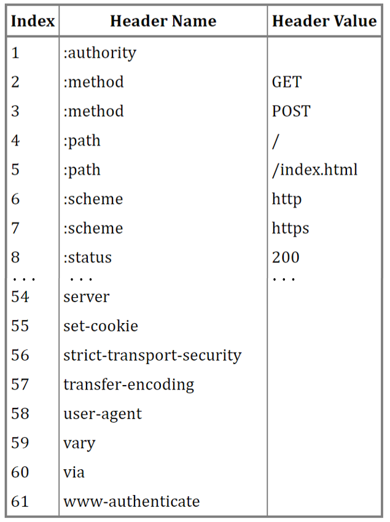

## 2.28

### 1.1 TCP/IP 网络模型 <a name="1.1-1"> </a>

> TCP/IP 模型（全称 Transmission Control Protocol/Internet Protocol，即传输控制协议/互联网协议）是一种网络通信模型，用来描述计算机网络中数据的传输和通信过程。它是互联网的基础，现实中大多数网络协议都基于这个模型构建。

#### 1、为什么要有 TCP/IP 网络模型？

TCP/IP 协议是为了解决计算机之前的通信问题。对于同一种设备上的通讯，可以有多种通信方式，但是在不同设备上的进程间通信，就需要网络通信。而设备时多样性的，要兼容多种设备，就需要协商一套通用的网络协议。

#### 2、TCP/IP 协议的层级

分层就是把一个大任务拆成几个小任务，给不同的人去做。

**为什么要把 TCP/IP 分层？**

- 分工明确，降低复杂性
- 各层独立，互不干扰
- 提高灵活性和兼容性
- 方便排查问题
- 复用化和标准化

TCP/IP 分成四层：网络接口层、网络层、传输层、应用层


**应用层**

最上层，用户能直接接触到的就是应用层。负责处理用户能看到的、用到的东西，比如浏览网页、发邮件、看视频。当两个不同的设备的应用需要通信的时候，应用把应用数据传给下一层，也就是传输层。

应用层只需要专注于为用户提供应用功能。应用层的关键协议如下：

- HTTP(超文本传输协议)：输入网址，HTTP 负责把网站内容拉回来
- SMTP(简单右键传输协议)：发送邮件
- FTP(文件传输协议)：传文件的协议

应用层不用关心数据如何传输，它是在操作系统中的用户态，传输层及以下则工作在内核态。

**传输层**

应用层的数据包会传给传输层，传输层是为了应用层提供网络支持。


在 TCP/IP 模型中，传输层主要由两种协议主导：**TCP（传输控制协议）\*\*和\*\* UDP（用户数据报协议）**。

**TCP（Transmission Control Protocol）**：数据包能可靠地传输给对方

- **特点**: 面向连接、可靠的数据传输。
- 功能
  - **建立连接**：通过三次握手确保通信双方准备就绪。
  - **数据可靠性**：提供数据包的排序、重传机制，确保数据无丢失、无重复且按序到达。
  - **流量控制**：通过滑动窗口机制调节发送速率，避免接收方过载。
  - **拥塞控制**：防止网络过载，提升传输效率。
- **应用场景**：适用于需要高可靠性的场景，如网页浏览（HTTP/HTTPS）、电子邮件（SMTP）、文件传输（FTP）。

**UDP（User Datagram Protocol）**：只负责发送数据包，不保证数据包能否抵达对方

- **特点**: 无连接、不可靠的数据传输。
- 功能
  - **简单高效**：不建立连接，直接发送数据，头部开销小。
  - **无序、无保障**：不保证数据到达，也不保证顺序，适合对实时性要求高而可靠性要求不高的场景。
- **应用场景**：常用于实时应用，如视频流（直播）、语音通话（VoIP）、在线游戏，以及 DNS 查询。

UDP 也可以实现可靠传输，把 TCP 的特性在应用层上实现就可以，不过要实现一个商用的可靠 UDP 传输协议

> “应用层实现”指的是这些可靠性逻辑被写进了应用程序的代码，而不是依赖操作系统提供的 TCP 协议栈。

当传输的数据包大小超过了 MSS( Maximum Segment Size)，就要把数据包分块，这样即使中途有一个分块丢失或者损坏了，只需要重新发送这个分块，而不是重新发送整个数据包。在 TCP 协议中，把每个分块称为一个 TCP 段（TCP Segment）。


当设备作为接收方时，传输层则要负责把数据包传给应用，但是一台设备上可能会有很多应用在接受或者传输数据，因此需要一个编号将应用区分开，这个编号就是端口。

> 假设你的电脑（IP 地址是 192.168.1.1）同时在：
>
> 用浏览器访问网页（服务器 IP 是 93.184.216.34，端口 80）。
>
> 用聊天软件收消息（服务器 IP 是 203.0.113.5，端口 6667）。
>
> 数据包到达时：
>
> 一个数据包的目标是“192.168.1.1:54321”（浏览器用的临时端口），操作系统看到 54321，知道是浏览器的。
>
> 另一个数据包的目标是“192.168.1.1:12345”（聊天软件的端口），操作系统看到 12345，知道是聊天软件的。
>
> 这里，**54321** 和 **12345** 就是端口号，它们区分了同一台设备上的不同应用。

**网络层**

传输层可能大家刚接触的时候，会认为它负责将数据从一个设备传输到另一个设备，事实上它并不负责。实际场景中的网络环节是错综复杂的，中间有各种各样的线路和分叉路口，如果一个设备的数据要传输给另一个设备，就需要在各种各样的路径和节点进行选择，而传输层的设计理念是简单、高效、专注，如果传输层还负责这一块功能就有点违背设计原则了。
也就是说，我们不希望传输层协议处理太多的事情，只需要服务好应用即可，让其作为应用间数据传输的媒介，帮助实现应用到应用的通信，而实际的传输功能就交给下一层，也就是网络层


IP 协议（Internet Protocol）：IP 协议会将传输层的报文作为数据部分，再加上 IP 包组装成 IP 报文，如果 IP 报文大小超过 MTU（最大传输单元）就会再次进行切片，得到一个即将发送到网络的 IP 报文。


IP 地址的网络号（Network ID）和主机号（Host ID）是 IP 地址的两个核心组成部分，用于在网络中定位设备。它们是在 IP 协议（特别是 IPv4）中通过子网掩码划分出来的，分别表示“网络”和“主机”的标识。

**网络号（Network ID）**：标识一个设备所在的网络段。所有属于同一网络的设备共享相同的网络号。

**主机号（Host ID）**：标识网络内的具体设备。同一网络中，每个设备的主机号是唯一的。

**路由（Routing）**：指的是数据包从源主机通过网络传输到目标主机的路径选择过程。它由网络层（主要是 IP 协议）和路由器（Router）共同实现。简单来说，路由就像导航系统，决定数据包在复杂的网络中如何“走”才能到达目的地。路由器寻址工作中，就是要找到目标地址的子网，找到后进而把数据包转发给对应的网络内。

_所以，IP 协议的寻址作用是告诉我们去往下一个目的地该朝哪个方向走，路由则是根据「下一个目的地」选择路径。寻址更像在导航，路由更像在操作方向盘_

**网络接口层**

网络接口层（Network Interface Layer），也常称为 **数据链路层和物理层的组合**，是 TCP/IP 模型中最底层的一层。它负责将上层（网络层）的 IP 数据包转化为可以在物理介质上传输的信号，并在接收端将信号还原为数据包。简单来说，网络接口层是网络通信的“硬件与软件交界处”，处理设备与设备之间直接的数据传输。


IP 头部中的接收方 IP 地址表示网络包的目的地，通过这个地址我们就可以判断要将包发到哪里，但在以太网的世界中，这个思路是行不通的。
什么是以太网呢？电脑上的以太网接口，Wi-Fi 接口，以太网交换机、路由器上的千兆，万兆以太网口，还有网线，它们都是以太网的组成部分。以太网就是一种在「局域网」内，把附近的设备连接起来，使它们之间可以进行通讯的技术。
以太网在判断网络包目的地时和 IP 的方式不同，因此必须采用相匹配的方式才能在以太网中将包发往目的地，而 MAC 头部就是干这个用的，所以，在以太网进行通讯要用到 MAC 地址。
MAC 头部是以太网使用的头部，它包含了接收方和发送方的 MAC 地址等信息，我们可以通过 ARP 协议获取对方的 MAC 地址。

**总结**


网络接口层的传输单位是帧(frame)，IP 层的传输单位是包(packet)，TCP 层的传输单位是段(segment)，HTTP 的传输单位则是消息或报文(message)。但这些名词并没有什么本质的区分，可以统称为数据包。

## 3.2

### 1.2 键入网址到网页显示 <a name="1.2-1"> </a>

#### **1、第一步：对 URL 进行解析，从而生成发送给 Web 服务器的请求信息**

（a）URL 元素组成：

"http:" + "//" + "Web 服务器" + "/" + "目录名" + "/" + .... + "文件名"

"http:" : URL 开头表示访问数据的协议

“//”：后面的字符串表示服务器的名称

（b）URL 示例解析

http://www.server.com/dir1/file1.html

浏览器协议:http://

域名部分：www.server.com

数据源的路径名：/dir1/file1.html

（c）Web 服务器文件路径

/...: Web 服务器的根目录，这个根不是 linux 操作系统层面的根/，是 web 服务器配置文件中指定的根/，它可以是操作系统类似某个实际的某个路径

file1.html：是 dir1 目录下的 file1.html 文件

> 要是/dir1/file1.html 部分省略了，那应该访问哪个文件？
>
> 当没有路径名的时候，就代表访问根目录下事先设置的默认文件，也就是/index.html，或者/default.html

#### **2、第二步：生成 HTTP 请求信息**

浏览器确定了 Web 服务器和文件名，接下来就是来根据这些信息来生产 HTTP 请求

在对 URL 进行解析并确定要发送给 Web 服务器的请求信息后，生成 HTTP 请求信息的过程是一个系统化的步骤。

**（a）URL 解析**

首先，浏览器或客户端需要解析输入的 URL，提取关键信息。这些信息将用于构建 HTTP 请求。假设 URL 是 `https://www.example.com/blog/article1?param1=value1#section1`：

- **协议**: `https://`（表示使用加密的 HTTP，通常通过端口 443）。
- **域名**: `www.example.com`（通过 DNS 解析为 IP 地址，如 `93.184.216.34`）。
- **路径**: `/blog/article1`（请求的资源位置）。
- **查询参数**: `?param1=value1`（可选，用于传递额外数据）。
- **片段（Fragment）**: `#section1`（仅用于客户端导航，不发送给服务器）。

解析后，浏览器确定：

- 需要连接到 `www.example.com` 的服务器。
- 请求路径是 `/blog/article1`，可能带查询参数 `param1=value1`。
- 使用 HTTPS 协议，因此需要 TLS 加密。

**（b） 确定请求方法**

根据用户操作，浏览器选择合适的 HTTP 方法：

- 如果只是打开网页，通常使用 `GET` 方法（获取资源）。
- 如果是提交表单，可能使用 `POST` 方法（发送数据）。

对于 `https://www.example.com/blog/article1?param1=value1`，默认使用 `GET` 方法，因为这是一个简单的资源获取请求。

**（c）构建 HTTP 请求的各个部分**

生成 HTTP 请求信息包括以下几个主要部分：

(1) 请求行（Request Line）

请求行是 HTTP 请求的第一行，格式为：

```
<方法> <路径+查询参数> <HTTP版本>
```

- **方法**: `GET`（对于这个例子）。
- **路径+查询参数**: `/blog/article1?param1=value1`（路径是 `/blog/article1`，查询参数附加在后面）。
- **HTTP 版本**: `HTTP/1.1`（现代浏览器通常支持 HTTP/1.1 或 HTTP/2，但默认格式还是 HTTP/1.1）。

因此，请求行可能是：

```
GET /blog/article1?param1=value1 HTTP/1.1
```

(2) 请求头（Request Headers）

请求头提供附加信息，帮助服务器理解和处理请求。浏览器会自动生成常见的头字段，例如：

- **Host**: 指定目标域名，必须字段。

  ```
  Host: www.example.com
  ```

- **User-Agent**: 标识客户端的浏览器或设备。

  ```
  User-Agent: Mozilla/5.0 (Windows NT 10.0; Win64; x64) AppleWebKit/537.36 (KHTML, like Gecko) Chrome/123.0.0.0 Safari/537.36
  ```

- **Accept**: 客户端接受的内容类型。

  ```
  Accept: text/html,application/xhtml+xml,application/xml;q=0.9,image/webp,*/*;q=0.8
  ```

- **Accept-Language**: 语言偏好。

  ```
  Accept-Language: zh-CN,zh;q=0.9,en;q=0.8
  ```

- **Connection**: 连接管理（通常为 `keep-alive`）。

  ```
  Connection: keep-alive
  ```

其他可能头字段包括：

- `Referer`: 上一个访问的页面 URL（如果有）。
- `Cookie`: 客户端的会话信息（如果之前有登录或设置）。

所有头字段以 `字段名: 字段值` 格式书写，每行以 `\r\n` 结尾。头字段结束后，添加一个空行（`\r\n`），表示头部分结束。

(3) 请求主体（Request Body）（可选）

对于 `GET` 请求，通常没有请求体，因为数据通过查询参数（如 `?param1=value1`）传递。如果是 `POST` 请求，则可能包含主体数据，例如表单数据或 JSON。

对于这个例子（`GET` 请求），请求体为空。

**（d） 组装完整的 HTTP 请求**

将上述部分组合，形成完整的 HTTP 请求。例如：

```
GET /blog/article1?param1=value1 HTTP/1.1
Host: www.example.com
User-Agent: Mozilla/5.0 (Windows NT 10.0; Win64; x64) AppleWebKit/537.36 (KHTML, like Gecko) Chrome/123.0.0.0 Safari/537.36
Accept: text/html,application/xhtml+xml,application/xml;q=0.9,image/webp,*/*;q=0.8
Accept-Language: zh-CN,zh;q=0.9,en;q=0.8
Connection: keep-alive

```

- 每行以 `\r\n` 分隔。
- 头字段后有一个空行（`\r\n`），表示请求结束（如果没有主体）。

**（e）HTTPS 的特殊处理**

因为 URL 使用 `https://`，浏览器需要在发送 HTTP 请求之前执行以下步骤：

- TLS 握手:
  - 浏览器与服务器协商加密算法和密钥。
  - 验证服务器证书（确保是 `www.example.com` 的合法证书）。
- 加密请求:
  - 将生成的 HTTP 请求通过 TLS 层加密后发送到服务器（端口 443）。

**（f）发送请求**

- 浏览器通过已建立的 TCP 连接将加密后的 HTTP 请求发送到服务器的 IP 地址（`93.184.216.34`）。
- 服务器接收请求后，解析并返回响应（如 HTML 内容）。

#### **3、第三步：真实地址查询——DNS**

通过浏览器解析 URL 并且生成 HTTP 消息之后，需要操作系统把消息发送给 Web 服务器，但是在发送之前，还需要查询服务器域名对应的 IP 地址。因为发送消息时，必须提供对象的 IP 地址。

> 在发送消息之前，必须将域名 www.example.com 转换为对应的 IP 地址。这个过程称为 **域名解析**（Domain Name Resolution）。

所以有一种服务器专门保存了 Web 服务器域名和 IP 的对应关系，它就是 DNS 服务器

**域名的层级关系**

DNS 中的域名都是用句点来分隔的，比如 www.server.com，这里的句点代表了不同层次之间的界限。越靠右的位置代表其层级越高。

实际上域名还有最后一个点，比如 www.server.com.，这个最后一个点代表根域名。

所以该域名的层级关系类似一个树状结构：

- 根 DNS 服务器（.）
- 顶级域 DNS 服务器（.com）
- 权威 DNS 服务器（server.com）


客户端只要能够找到任意一台 DNS 服务器，就可以通过它找到根域 DNS 服务器，然后再一路顺藤摸瓜找到位于下层的某台目标 DNS 服务器。

**域名解析的流程**

**(a) 本地缓存检查**

- **步骤**:
  - 首先，客户端（通常是用户的设备，如电脑或手机）会检查本地的 DNS 缓存。
  - 本地缓存可能存储在操作系统的 DNS 解析库（如 Windows 的 `nscd` 或 macOS 的 `mDNSResponder`）或浏览器的缓存中。
  - 如果之前访问过 `www.example.com`，其对应的 IP 地址可能已经缓存（通常有生存时间 TTL，Time to Live，限制缓存有效期）。
- **如果命中缓存**:
  - 直接返回缓存中的 IP 地址（例如 `93.184.216.34`），解析结束。
  - 节省时间（通常几毫秒），避免网络查询。
- **如果未命中**:
  - 继续向外部 DNS 服务器发起查询。

**(b) 查询本地 DNS 服务器**

- **步骤**:
  - 操作系统通过网络协议（通常是 UDP 协议，端口 53）联系配置的本地域名服务器（Local DNS Server）。
  - 本地 DNS 服务器通常由你的互联网服务提供商（ISP）提供，也可能是企业或公共 DNS（如 Google 的 `8.8.8.8` 或 Cloudflare 的 `1.1.1.1`）。
- **本地 DNS 服务器的处理**:
  - 本地 DNS 服务器检查自己的缓存。如果缓存中有 `www.example.com` 的记录，直接返回 IP 地址。
  - 如果缓存中没有，进入递归查询或迭代查询过程。

**(c) 递归查询或迭代查询**

DNS 服务器通过层次化的查询系统解析域名，通常涉及以下层次的 DNS 服务器：

- **根域名服务器（Root Name Servers）**:

  - 全球共有 13 组根域名服务器（用字母 A 到 M 表示，如 `a.root-servers.net`）。
  - 本地 DNS 服务器发送查询给根域名服务器，询问 `www.example.com` 的信息。
  - 根服务器不存储具体域名的 IP，但知道顶级域名（TLD，如 `.com`）的权威服务器地址。
  - 根服务器返回 `.com` 的权威 DNS 服务器地址。

- **顶级域名服务器（TLD Name Servers）**:

  - 本地 DNS 服务器接着联系 `.com` 的权威服务器（例如 Verisign 管理 `.com` 的 TLD 服务器）。
  - TLD 服务器知道 `example.com` 的权威 DNS 服务器地址。
  - 返回 `example.com` 的权威服务器地址。

- **权威域名服务器（Authoritative Name Servers）**:

  - 本地 DNS 服务器联系 `example.com` 的权威服务器（由域名注册商或网站所有者配置）。
  - 权威服务器存储 `www.example.com` 的具体 IP 地址（例如 `93.184.216.34`）。
  - 返回 `www.example.com` 的 IP 地址。

- **查询类型**:
  - **递归查询**: 本地 DNS 服务器负责完成整个查询过程（从根到权威服务器），并返回最终结果给客户端。
  - **迭代查询**: 本地 DNS 服务器只向根服务器查询，然后根服务器返回 TLD 服务器地址，TLD 服务器返回权威服务器地址，依次迭代，直到获取 IP 地址。现代 DNS 通常使用递归查询以简化客户端操作。

**(d) 返回 IP 地址**

- 本地 DNS 服务器收到 `www.example.com` 的 IP 地址（如 `93.184.216.34`）后：
  - 将结果返回给客户端（浏览器或操作系统）。
  - 同时，本地 DNS 服务器会缓存这个结果（根据 TTL 决定缓存时间，通常几小时到几天）。

**(e) 客户端使用 IP 地址**

- 客户端（操作系统或浏览器）接收到 IP 地址后，结合之前解析的 URL（路径、参数等）：
  - 建立与目标服务器的 TCP 连接（端口通常为 80 或 443）。
  - 发送之前生成的 HTTP 请求（如 `GET /blog/article1 HTTP/1.1`）。

> 示例：解析 `www.example.com`

> 假设你在浏览器输入 `www.example.com`，解析流程可能如下：
>
> 1.  本地缓存无记录，操作系统联系本地 DNS 服务器（例如 `8.8.8.8`）。
>
> 2.  本地 DNS 服务器查询根服务器（`a.root-servers.net`），获知 `.com` 的 TLD 服务器地址。
>
> 3.  联系 `.com` 的 TLD 服务器，获知 `example.com` 的权威服务器地址。
>
> 4.  联系 `example.com` 的权威服务器，获取 `www.example.com` 的 IP 地址（例如 `93.184.216.34`）。
>
> 5.  本地 DNS 服务器返回 IP 地址给操作系统，浏览器使用该 IP 建立连接并发送 HTTP 请求。
>
> 整个过程通常在几毫秒到几百毫秒内完成，具体取决于网络延迟和缓存情况。


#### **4、第四步：TCP 的可靠传输**

**TCP 包头格式（TCP Header）**


端口号和目标端口号（Source port, Destination port）：源端口号是发送方（客户端或服务器）使用的端口号，用于标识发起通信的应用程序或进程。目的端口号是接收方（服务器或客户端）使用的端口号，用于标识目标应用程序或服务。

序号：序列号表示发送的 TCP 数据段中第一个字节的序列号，用于标识数据的顺序。

确认序列：确认号表示接收方期望接收的下一个数据段的第一个字节的序列号。

状态位： 状态位（也叫标志位）是 TCP 包头中的 6 个控制位，用于管理连接状态和行为。包括：

- URG（Urgent Pointer 有效）: 紧急指针有效（通常未使用）。
- ACK（Acknowledgment 有效）: 确认号有效（大多数数据包设置此位）。
- PSH（Push 函数）: 提示接收方立即将数据传递给应用程序（减少缓冲）。
- RST（Reset）: 重置连接（用于异常情况）。
- SYN（Synchronize）: 建立连接（用于三次握手的第一个和第二个包）。
- FIN（Finish）: 关闭连接（用于四次挥手）。

窗口大小：窗口大小表示发送方当前允许接收方的最大接收窗口大小（以字节为单位）。

校验和： 校验和是 TCP 包头的错误检测值，覆盖包头、数据和伪首部（包含源 IP、目标 IP、协议类型等）。

紧急指针：紧急指针在 URG 标志置位时有效，指示紧急数据的结束位置。

选项： 选项字段是可变的，用于扩展 TCP 功能，长度必须是 4 字节的整数倍（通过填充补齐）。

数据：数据是 TCP 包头的后续部分，包含实际传输的应用层数据（如 HTTP 请求或响应）。

**TCP 传输数据之前，要先三次握手建立连接**

三次握手（Three-Way Handshake）是 TCP（传输控制协议）在传输数据之前，用于建立可靠连接的初始化过程。通过三次交互，发送方和接收方协商初始序列号（ISN）、确认连接状态，并确保双方都能正常通信。这是 TCP 提供可靠、面向连接传输的基础。

以下是 TCP 三次握手的详细过程（以客户端访问服务器为例，如浏览器访问 www.example.com）：

(a) **第一次握手（SYN）**

- 步骤:
  - 客户端（发送方）向服务器（接收方）发送一个 TCP 数据段，设置以下内容：
    - **标志位**: SYN（Synchronize）= 1，表示请求建立连接。
    - **序列号（Sequence Number，ISN）**: 客户端随机生成一个初始序列号（例如 1000），用于后续数据的标识。
    - 其他字段（如源端口、目的端口）也已设置（例如源端口 49152，目的端口 443）。
  - 数据段不包含实际数据。
- 作用:
  - 客户端通知服务器：“我希望建立连接，我的初始序列号是 1000，你能接收吗？”
- 服务器响应:
  - 服务器接收到 SYN 包后，如果愿意建立连接（端口可用），进入“同步接收（SYN-RECEIVED）”状态。

(b) **第二次握手（SYN+ACK）**

- 步骤:
  - 服务器回应客户端一个 TCP 数据段，设置以下内容：
    - **标志位**: SYN = 1（表示同意建立连接），ACK = 1（确认客户端的 SYN）。
    - **序列号（Sequence Number）**: 服务器生成自己的初始序列号（例如 2000）。
    - **确认号（Acknowledgment Number）**: 服务器将确认号设为客户端的序列号+1（例如 1001），确认已接收客户端的 SYN。
  - 数据段不包含实际数据。
- 作用:
  - 服务器通知客户端：“我收到你的请求，同意建立连接，我的初始序列号是 2000，你能接收吗？我确认你的序列号是 1000。”
- 客户端响应:
  - 客户端接收到 SYN+ACK 包后，进入“已建立（ESTABLISHED）”状态。

(c) **第三次握手（ACK）**

- 步骤:
  - 客户端回应服务器一个 TCP 数据段，设置以下内容：
    - **标志位**: ACK = 1（确认服务器的 SYN）。
    - **序列号（Sequence Number）**: 客户端的序列号为之前 SYN 的确认号（1001）。
    - **确认号（Acknowledgment Number）**: 客户端将确认号设为服务器的序列号+1（例如 2001），确认已接收服务器的 SYN。
  - 数据段不包含实际数据。
- 作用:
  - 客户端通知服务器：“我收到你的响应，连接已建立，可以开始传输数据。”
- 服务器响应:
  - 服务器接收到 ACK 包后，也进入“已建立（ESTABLISHED）”状态。连接正式建立，双方可以开始数据传输。


**TCP 报文生成**

TCP 协议里面有两个端口，一个是浏览器监听的端口，一个是 Web 服务器监听的端口。

在双方建立了连接后，TCP 报文中的数据部分就是存放再 HTTP 头部+数据，组装成 TCP 报文之后，就需要交给下面的网络层处理


#### **5、第五步：远程定位——IP**

TCP 模块再执行连接、收发、断开等各种阶段操作时，都需要委托 IP 模块将数据封装成网络包发送给通信对象。

**IP 包头格式**

IP 报文头部的格式：


在 IP 协议里面需要有源地址 IP 和目标地址 IP

- 源地址，就是客户端输出的 IP 地址
- 目标地址，就是通过 DNS 域名解析得到的 Web 服务器 IP

> 假设客户端有多个网卡，就会有多个 IP 地址，那头部的源地址应该选择哪个 IP 呢？
>
> 相当于在多块网卡中判断应该使用哪个一块网卡来发送包，这个时候就要根据路由表规则，来判断哪一个网卡作为源地址 IP

**IP 报文生成**

网络包的报文如下图：


#### **6、第六步：两点传输——MAC**

生成了 IP 头部之后，接下来网络包还需要在 IP 头部的前面加上 MAC 头部

**MAC 包头格式**


在 MAC 包头里需要发送方 MAC 地址和接收方目标 MAC 地址，用于两点之间的传输

一般在 TCP/IP 通信里，MAC 包头的协议类型只使用：

- 0800：IP 协议
- 0806：ARP 协议

以下是 MAC 层在整个过程中扮演的角色，从键入 URL 到数据在本地网络传输的步骤：

**(a) 准备阶段：生成 Ethernet 帧**

- **输入**: 从网络层接收 IP 数据包（包含 IP 包头 + TCP 报文 + HTTP 数据）。
- 操作:
  - MAC 层为 IP 数据包添加 MAC 包头和尾部，形成 Ethernet 帧。
  - MAC 包头的组成（以 Ethernet II 帧为例）：
    - **目标 MAC 地址（6 字节）**: 标识本地网络中的目标设备（如路由器的 MAC 地址，或目标服务器的 MAC 地址）。
    - **源 MAC 地址（6 字节）**: 标识发送设备的 MAC 地址（如客户端网卡的 MAC 地址）。
    - **类型/以太网类型（2 字节）**: 指定上层协议（如 0x0800 表示 IPv4）。
  - **帧尾（FCS，4 字节）**: 添加帧校验序列（通过 CRC-32 计算），用于错误检测。
- 示例:
  - 假设客户端 IP 为 192.168.1.1，MAC 地址为 00:1A: 2B: 3C: 4D: 5E；路由器 IP 为 192.168.1.1，MAC 地址为 00:50:56: C0:00:01。
  - MAC 层生成 Ethernet 帧，目标 MAC 地址为 00:50:56: C0:00:01，源 MAC 地址为 00:1A: 2B: 3C: 4D: 5E，类型为 0x0800。

**(b) 地址解析（ARP 协议）**

- 操作:
  - 如果发送方不知道目标设备的 MAC 地址（例如目标是路由器或服务器），MAC 层通过 ARP（地址解析协议）查询。
  - 发送方广播 ARP 请求（如 “谁拥有 IP 地址 192.168.1.1？”），目标设备（路由器）回复其 MAC 地址（如 00:50:56: C0:00:01）。
  - ARP 缓存本地存储结果，加速后续通信。
- 作用:
  - 确保数据帧的目标 MAC 地址正确，避免发送到错误设备。
- 示例:
  - 客户端通过 ARP 发现路由器的 MAC 地址 00:50:56: C0:00:01，用于填充目标 MAC 地址。

**(c) 冲突检测与介质访问（CSMA/CD）**

- 操作

  (适用于半双工 Ethernet)：

  - 在共享介质（如老式集线器）中，MAC 层使用 CSMA/CD（载波侦听多路访问/冲突检测）协议：
    - 侦听网络介质（电缆），如果空闲，发送数据帧。
    - 如果检测到冲突（多个设备同时发送），停止发送，等待随机时间后重试。
  - 在现代全双工 Ethernet（使用交换机）中，无需 CSMA/CD，交换机直接管理流量。

- 作用:

  - 防止数据帧在共享介质中冲突，确保成功传输。

- 示例:

  - 客户端检查网络空闲后，发送 Ethernet 帧；如果另一设备同时发送，双方暂停，等待后重试。

**(d) 发送 Ethernet 帧**

- 操作:
  - MAC 层通过网络接口控制器（NIC）将 Ethernet 帧发送到物理层。
  - 物理层将帧转换为电信号（通过电缆）或无线信号（通过 Wi-Fi），传输到下一跳设备（如路由器）。
- 作用:
  - 完成从数据链路层到物理层的转换，使数据进入网络。
- 示例:
  - Ethernet 帧通过 RJ45 电缆或 Wi-Fi 信号发送到路由器。

**(e) 接收方的处理**

- 操作 (在接收设备，如路由器或目标服务器)：
  - 接收方（NIC）检查目标 MAC 地址：
    - 如果匹配本设备的 MAC 地址（或广播地址），接受数据帧。
    - 如果不匹配，丢弃数据帧。
  - 验证 FCS（重新计算 CRC-32，与发送方对比）：
    - 如果一致，确认数据完整，传递给网络层（IP 层）。
    - 如果不一致，丢弃数据帧。
- 作用:
  - 确保数据帧送达正确设备，并验证完整性。
- 示例:
  - 路由器接收到目标 MAC 地址为 00:50:56: C0:00:01 的帧，匹配本机地址，验证 FCS 后将 IP 数据包交给 IP 层。

至此，网络包的报文如下图：


#### **7、第七步：出口——网卡（Network Interface Card，NIC）**

网络包只是一串二进制数字信息，没办法真正发送给对方，因此，需要把数字信号转换为电信号，才能在网线上传输。

负责执行的这一操作的是网卡，要控制网卡还需要靠网卡驱动程序。

网卡驱动获取网络包之后，会将其复制到网卡内的缓存区中，接着会在其开头加上报头和起始帧分界符，在末尾加上用于检测错误的帧校验序列。


最后网卡会将包转换位电信号，通过网线发送出去。

#### **8、第八步：送别者——交换机**

交换机的设计是将网络包原样转发到目的地，交换机工作在 MAC 层，也称为二层网络设备。

电信号到达网线接口，交换机里的模块进行接受，接下来交换机里的模块将电信号转换为数字信号。然后通过包末尾的 FCS 校验错误，如果没问题则放到缓冲去。这部分操作基本和计算机网卡相同，但交换机的工作方式和网卡不同。

计算机的网卡本身具有 MAC 地址，并通过核对收到的包的接收方 MAC 地址判断是不是发给自己的，如果不是发给自己的则丢弃；相对地，交换机的端口不核对接收方 MAC 地址，而是直接接收所有的包并存放到缓冲区中。因此，和网卡不同，交换机的端口不具有 MAC 地址。

交换机根据 MAC 地址表查找 MAC 地址，然后将信号发送到相应的端口

> 当 MAC 地址表找不到指定的 MAC 地址会怎么样？
>
> 地址表中找不到指定的 MAC 地址。这可能是因为具有该地址的设备还没有向交换机发送过包，或者这个设备一段时间没有工作导致地址被从地址表中删除了。
> 这种情况下，交换机无法判断应该把包转发到哪个端口，只能将包转发到除了源端口之外的所有端口上，无论该设备连接在哪个端口上都能收到这个包。
> 这样做不会产生什么问题，因为以太网的设计本来就是将包发送到整个网络的，然后只有相应的接收者才接收包，而其他设备则会忽略这个包。

#### **9、第九步：出境大门——路由器**

路由器是一种网络设备，连接多个网络（如家庭局域网和互联网），通过 IP 地址和路由表转发数据包。

> 路由器与交换机的区别？
>
> 网络包经过交换机之后，现在到达了路由器，并在此被转发到下一个路由器或目标设备。这一步转发的工作原理和交换机类似，也是通过查表判断包转发的目标。
> 不过在具体的操作过程上，路由器和交换机是有区别的。
>
> ·因为路由器是基于 IP 设计的，俗称三层网络设备，路由器的各个端口都具有 MAC 地址和 IP 地址；
> 而交换机是基于以太网设计的，俗称二层网络设备，交换机的端口不具有 MAC 地址。

**路由器基本原理**

路由器的端口有 MAC 地址，因此可以成为以太网的发送方和接收方；同时还具有 IP 地址。当转发包的时候，首先路由器端口会接受发给自己的以太网包，然后路由器表查询转发目标，在由相应的端口作为发送方将以太网发送出去。

**路由器的包接收操作**

首先，电信号到达网线接口部分，路由器中的模块会将电信号转成数字信号，然后通过包未尾的 FCS 进行错误校验。如果没问题则检查 MAC 头部中的接收方 MAC 地址，看看是不是发给自己的包，如果是就放到接收缓冲区中，否则就丢弃这个包。
总的来说，路由器的端口都具有 MAC 地址，只接收与自身地址匹配的包，遇到不匹配的包则直接丢弃。

**查询路由表确定输出端口**

完成包接收操作之后，路由器就会去掉包开头的 MAC 头部。

MAC 头部的作用就是将包送达路由器，其中的接收方 MAC 地址就是路由器端口的 MAC 地址。因此，当包到达路由器之后，MAC 头部的任务就完成了，于是 MAC 头部就会被丢弃。
接下来，路由器会根据 MAC 头部后方的 IP 头部中的内容进行包的转发操作。
转发操作分为几个阶段，首先是查询路由表判断转发目标。

**路由器的发送操作**

接下来就会进入包的发送操作。

首先，我们需要根据路由表的网关列判断对方的地址。

- 如果网关是一个 IP 地址，则这个 IP 地址就是我们要转发到的目标地址，还未抵达终点，还需继续需要路由器转发。
- 如果网关为空，则 IP 头部中的接收方 IP 地址就是要转发到的目标地址，也是就终于找到 IP 包头里的目标地址了，说明已抵达终点。

知道对方的 IP 地址之后，接下来需要通过 ARP 协议根据 IP 地址查询 MAC 地址，并将查询的结果作为接收方 MAC 地址。
路由器也有 ARP 缓存，因此首先会在 ARP 缓存中查询，如果找不到则发送 ARP 查询请求。
接下来是发送方 MAC 地址字段，这里填写输出端口的 MAC 地址。还有一个以太类型字段，填写 0800（十六进制）表示 IP 协议。
网络包完成后，接下来会将其转换成电信号并通过端口发送出去。这一步的工作过程和计算机也是相同的。
发送出去的网络包会通过交换机到达下一个路由器。由于接收方 MAC 地址就是下一个路由器的地址，所以交换机会根据这一地址将包传输到下一个路由器。

接下来，下一个路由器会将包转发给再下一个路由器，经过层层转发之后，网络包就到达了最终的目的地。

**在网络包传输的过程中，源 IP 和目标 IP 始终是不会变的，一直变化的是 MAC 地址, 因为需要 MAC 地址在以太网内进行两个设备之间的包传输。**

#### **10、第十步：互相扒皮——服务器和客户端**


服务器（www.example.com）接收到客户端发送的 Ethernet 帧后，通过协议栈逐层剥离头部，提取 HTTP 数据并处理。以下是详细步骤：

(a) 物理层：信号接收

- 操作:
  - 服务器的网卡通过物理接口（RJ45 或 Wi-Fi）接收电信号或无线信号。
  - 解码信号，恢复为二进制数据（Ethernet 帧）。
- 输出:
  - Ethernet 帧（MAC 包头 + IP 数据包 + FCS）。
- 示例:
  - 从电缆接收电信号，解码为二进制数据。

(b) 数据链路层：MAC 剥离

- 操作:
  - 网卡检查目标 MAC 地址是否匹配服务器的 MAC 地址（如 00:50:56: C0:00:03）。
  - 验证 FCS（重新计算 CRC-32，与发送方对比），确认数据未损坏。
  - 剥离 MAC 包头（14 字节）和 FCS（4 字节），提取 IP 数据包。
  - 如果不匹配或 FCS 错误，丢弃帧。
- 输出:
  - IP 数据包（IP 包头 + TCP 报文 + HTTP 数据）。
- 示例:
  - 剥离后提取 IP 数据包，目标 IP 为 93.184.216.34。

(c) 网络层：IP 剥离

- 操作:
  - IP 层检查 IP 包头的首部校验和，确认完整性。
  - 检查目标 IP 地址（93.184.216.34）是否匹配本机 IP。
  - 剥离 IP 包头（20 字节），提取 TCP 报文。
  - 更新 TTL（减 1），处理分片（如果有）。
  - 如果 TTL 为 0 或目标不匹配，丢弃数据包并可能发送 ICMP 错误。
- 输出:
  - TCP 报文（TCP 包头 + HTTP 数据）。
- 示例:
  - 剥离后提取 TCP 报文，目的端口为 443。

(d) 传输层：TCP 剥离

- 操作:
  - TCP 层检查 TCP 包头的序列号、确认号和标志位，确认数据完整性和顺序。
  - 剥离 TCP 包头（20 字节），提取 HTTP 数据。
  - 如果需要（例如数据丢失），通过重传机制（基于序列号和确认号）请求重发。
- 输出:
  - HTTP 数据（GET / HTTP/1.1...）。
- 示例:
  - 提取 HTTP 请求，交给应用层处理。

(e) 应用层：HTTP 处理

- 操作:
  - 服务器的 Web 应用（如 Nginx 或 Apache）解析 HTTP 请求（如 GET / HTTP/1.1）。
  - 根据路径（/）查找资源（如 HTML 文件），生成 HTTP 响应（如 200 OK 和 HTML 内容）。
- 输出:
  - HTTP 响应数据（HTTP/1.1 200 OK\r\nContent-Type: text/html\r\n...\r\n <html>...）。
- 示例:
  - 服务器返回 HTML 页面，供客户端渲染。

## 3.3

### 1.3 Linux 系统是如何收发网络包 <a name="1.3-1"> </a>

#### 1、网络模型

为了解决各种设备在网络互联中的兼容性的问题，制定了 OSI 网络模型

该模型主要有 7 层，分别是

- 应用层：负责给应用程序提供接口
- 表示层：负责把数据转换成兼容另一个系统能识别的格式
- 会话层：负责建立、管理和终止表示层实体之间的通信会话
- 传输层：负责端到端的数据传输
- 网络层：负责数据的路由、转发、分片
- 数据链路层：负责数据的封帧和差错检测，以及 MAC 寻址
- 物理层：负责在物理网络中数据传输帧

TCP/IP 与 OSI 网络模型的区别：


#### 2、Linux 网络协议栈


- 应用程序需要通过系统调用，来跟 Socket 层进行数据交互
- Socket 层的下面就是传输层、网络层和网络接口层
- 最下面的一层，就是网卡驱动程序和硬件网卡设备

#### 3、Linux 接收网络包的流程


首先，会进入到网络接口层，在这一层会检查报文的合法性，如果不合法则丢弃，合法则会找出该网络包的上层协议的类型，比如是 IPv4，还是 IPv6，接着再去掉帧头和帧尾，然后再交给网络层。

到了网络层，取出 IP 包，判断网络包下一步的走向。当确认要发送给本机之后，就会从 IP 头里看看上一层协议的类型是 TCP 还是 UDP，接着去掉 IP 头，然后交给传输层。

传输层取出 TCP 头或者 UDP 头，根据四元组“源 IP、源端口、目的 IP、目的端口”作为标识，找出对应的 Socket，并把数据放入 Socket 的接收缓冲区。

最后，应用层调用 Socket 接口，将内核的 Socket 接收缓冲区的数据拷贝到应用层的缓冲区，然后唤醒用户进程。

> 如何告诉操作系统这个网络包以及到达了呢？
>
> 最简单的一种方式就是触发中断，每当网卡收到一个网络包，就出发一个中断告诉操作系统。但是，再高性能场景下，网络包的数量会非常多，会触发很多中断。CPU 收到中断会停下手里的事情来处理中断，这回导致整体效率的下滑。
>
> 因此，引入一种机制，NAPI 机制。它的核心概念就是不采用中断的方式读取数据，而是首先采用中断唤醒数据接收的服务程序，然后 poll 的方法来轮询数据。
>
> 当有网络包到达时，会通过 DMA 技术，将网络包写入到指定的内存地址，接着网卡向 CPU 发起硬件中断，当 CPU 收到硬件中断请求后，根据中断表，调用以及注册的中断处理函数。

#### 3、Linux 发送网络包的流程

首先，应用程序会调用 Socket 发送数据包的接口，由于这个是系统调用，所以会从用户态陷入到内核态中的 Socket 层，内核会申请一个内核态的 sk_buff（socket buffer）内存，将用户待发送的数据拷贝到 sk_buff 内存，并将其加入到发送缓冲区。

接下来，网络协议栈会从 Socket 发送缓冲区中取出 sk_buff，并按照 TCP/IP 协议栈从上到下逐层处理。

如果使用的是 TCP 传输协议发送数据，那么先拷贝一个新的 sk_buff 副本，这是因为 sk_buff 后续在调用网络层，最后到达网卡发送完成的时候，这个 sk_buf 会被释放掉。而 TCP 协议是支持丢失重传的，在收到对方的 ACK 之前，这个 sk_buff 不能被删除。所以内核的做法就是每次调用网卡发送的时候，传递的是 sk_buff 的拷贝，等收到 ACK 再真正删除。

接着，对 sk_buff 填充 TCP 头。

> 在层级之间传递数据的时候，不发生拷贝，只用 sk_buff 来描述所有的网络包，比如做到的?
> 当接收报文时，从网卡驱动开始，通过协议栈层层往上传送数据包，通过增加 skb-> data 的值，来逐步剥离协议首部。
>
> 当要发送报文时，创建 sk_buff 结构体，数据缓存区的头部预留足够的空间，用来填充各层首部，在经过各下层协议时，通过减少 skb-> data 的值来增加协议首部。


然后交给网络层，在网络层里会做这些工作：选取路由（确定下一跳的 IP）、填充 IP 头部、netfilter 过滤、对超过 MTU 大小的数据包进行分片。处理完这些工作后会交给网络接口层处理。

网络接口层会通过 ARP 协议获得下一条的 MAC 地址，然后对 sk_buff 填充帧头和帧尾，接着将 sk_buff 放到网卡的发送队列中。

这一些工作准备好之后，会触发软中断告诉网卡驱动程序，驱动程序会从发送队列中读取 sk_buff，将这个 sk_buff 挂到 RingBuffer 中，接着将 sk_buff 数据映射到网卡可访问的内存 DMA 区域，最后触发真实的发送。

数据发送完成后，网卡设备会出发一个硬中断来释放内存，主要释放 sk_buff 内存和清理 RingBuffer 内存。

最后，当收到 TCP 报文的 ACK 应答时，传输层就会释放原始的 sk_buff

> 发送 ⽹ 络数据的时候，涉及几次内存拷 ⻉ 操作？
>
> 第 ⼀ 次，调 ⽤ 发送数据的系统调 ⽤ 的时候，内核会申请 ⼀ 个内核态的 sk_buff 内存，将 ⽤ 户待发送的数据拷 ⻉ 到 sk_buff 内存，并将其加 ⼊ 到发送缓冲区。
>
> 第 ⼆ 次，在使 ⽤ TCP 传输协议的情况下，从传输层进 ⼊⽹ 络层的时候，每 ⼀ 个 sk_buff 都会被克隆 ⼀ 个新的副本出来。副本 sk_buff 会被送往 ⽹ 络层，等它发送完的时候就会释放掉，然后原始的 sk_buff 还保留在传输层，⽬ 的是为了实现 TCP 的可靠传输，等收到这个数据包的 ACK 时，才会释放原始的 sk_buff 。
>
> 第三次，当 IP 层发现 sk_buff ⼤ 于 MTU 时才需要进 ⾏。会再申请额外的 sk_buff，并将原来的 sk_buff 拷 ⻉ 为多个 ⼩ 的 sk_buff。

## 3.4

### 2.1 HTTP 面试题 <a name="2.1"> </a>

#### 1、HTTP 基本概念

**（1）HTTP 是什么？**

HTTP 是超文本传输协议，也就是 **H** yper Text **T** ransfer **P** rotocol。


- 协议：HTTP 是一个用在计算机世界里的 **协议**。它使用计算机能够理解的语言确立了一种计算机之间交流通信的规范（**两个以上的参与者**），以及相关的各种控制和错误处理方式（**行为约定和规范**）。

- 传输：HTTP 是一个在计算机世界里专门用来在 **两点之间传输数据** 的约定和规范。

> 比如在访问百度网站的时候，浏览器把请求数据发送给百度网站，网站再把一些数据返回给浏览器，最后由浏览器渲染在屏幕，就可以看到图片和视频了。

- 超文本：HTTP 传输的内容是超文本，它就是 **超越了普通文本的文本**，它是文字、图片、视频等的混合体，最关键有超链接，能从一个超文本跳转到另外一个超文本。

**（2）HTTP 常见的状态码有哪些？**


1xx - 信息类（临时响应）

- **100 Continue**：客户端应继续发送请求的剩余部分。
- **101 Switching Protocols**：服务器根据客户端请求切换协议（如从 HTTP 切换到 WebSocket）。

2xx - 成功类

- **200 OK**：请求成功，服务器返回了所需的数据。
- **201 Created**：请求已成功，并创建了新资源（如 POST 请求后）。
- **204 No Content**：请求成功，但响应中没有内容返回（常用于删除操作）。

3xx - 重定向类

- **301 Moved Permanently**：资源已永久移动到新 URL，客户端应更新链接。
- **302 Found**：资源临时移动到新 URL，客户端应继续使用原 URL。
- **304 Not Modified**：资源未更改，客户端可以使用缓存版本。

4xx - 客户端错误类

- **400 Bad Request**：请求语法错误或参数无效，服务器无法处理。
- **401 Unauthorized**：请求需要身份验证，客户端未提供有效凭据。
- **403 Forbidden**：服务器理解请求，但拒绝执行（权限不足）。
- **404 Not Found**：服务器找不到请求的资源。
- **429 Too Many Requests**：客户端在限定时间内发送了过多请求（通常与 API 限流相关）。

5xx - 服务器错误类

- **500 Internal Server Error**：服务器内部错误，无法完成请求。
- **502 Bad Gateway**：作为网关或代理的服务器从上游服务器收到无效响应。
- **503 Service Unavailable**：服务器暂时无法处理请求（可能是维护或过载）。
- **504 Gateway Timeout**：网关或代理服务器未及时从上游服务器收到响应。

**（3）HTTP 常见字段有哪些？**

- **Host**：指定请求的目标域名和端口（HTTP/1.1 必填），如 Host: www.example.com。


- **Content-Length**：消息体的字节长度，如 Content-Length: 1024。


- **Connection**：控制连接选项，如 Connection: keep-alive（保持连接）或 Connection: close。开启了 HTTP Keep-Alive 机制后， 连接就不会中断，而是保持连接。当客户端发送另一个请求时，它会使用同一个连接，一直持续到客户端或服务器端提出断开连接。


- **Content-Type**：指定消息体的媒体类型，如 Content-Type: application/json 或 Content-Type: text/html; charset = UTF-8。


- **Content-Encoding**：消息体的编码方式，如 Content-Encoding: gzip。


#### 2、GET 与 POST

**（1）GET 和 POST 有什么区别？**

**GET**：用于从服务器 **获取数据**，通常是查询或读取资源（如获取网页内容、API 数据）。**GET 的语义是从服务器获取指定的资源**，这个资源可以是静态的文本、页面、图片视频等。GET 请求的参数位置一般是写在 URL 中，URL 规定只能支持 ASCII，所以 GET 请求的参数只允许 ASCII 字符 ，而且浏览器会对 URL 的长度有限制（HTTP 协议本身对 URL 长度并没有做任何规定）。

**POST**：用于向服务器 **提交数据**，通常涉及创建或更新资源（如提交表单、上传文件）。**POST 的语义是根据请求负荷（报文 body）对指定的资源做出处理**，具体的处理方式视资源类型而不同。POST 请求携带数据的位置一般是写在报文 body 中，body 中的数据可以是任意格式的数据，只要客户端与服务端协商好即可，而且浏览器不会对 body 大小做限制。

**（2）GET 和 POST 方法都是安全和幂等的吗？**

安全：在 HTTP 上下文中，“安全”指的是方法是否会改变服务器上的资源状态（即是否有副作用）。安全的 HTTP 方法仅用于读取数据，不会修改服务器状态。

幂等：幂等性指的是同一请求执行一次与多次的结果是否相同，即多次请求不会产生额外的副作用。

- **GET 方法就是安全且幂等的**，因为它是「只读」操作，无论操作多少次，服务器上的数据都是安全的，且每次的结果都是相同的。所以，**可以对 GET 请求的数据做缓存，这个缓存可以做到浏览器本身上（彻底避免浏览器发请求），也可以做到代理上（如 nginx），而且在浏览器中 GET 请求可以保存为书签**。
- **POST** 因为是「新增或提交数据」的操作，会修改服务器上的资源，所以是 **不安全** 的，且多次提交数据就会创建多个资源，所以 **不是幂等** 的。所以，**浏览器一般不会缓存 POST 请求，也不能把 POST 请求保存为书签**。

> GET 请求可以带 body 吗？
>
> 理论上，任何请求都可以带 body。大多数 HTTP 客户端库（如浏览器的 fetch、XMLHttpRequest，或工具如 curl）允许在 GET 请求中添加 Body。许多服务器框架（如 Express、Nginx、Apache）在处理 GET 请求时默认不解析 Body，甚至直接丢弃。即使可以带 Body，实际中不推荐，因为会引发兼容性和预期外的问题

#### 3、HTTP 缓存技术

**（1）HTTP 缓存有哪些实现方式？**

HTTP 缓存是将 HTTP 响应的内容（HTML、图片、CSS、API 数据等）临时存储在某个地方（如浏览器内存、代理服务器），当下次发起相同请求时，直接使用缓存副本，而不是重新向服务器请求。

HTTP 缓存有两种实现方式，分别是 **强制缓存和协商缓存**。

**（2）什么是强制缓存？**

强制缓存是指在缓存未过期的情况下，客户端直接使用本地缓存的副本，无需向服务器发送任何请求。缓存的有效性由服务器预先指定的时间或规则决定。

**工作原理**

- 服务器通过响应头（如 `Cache-Control` 或 `Expires`）告诉客户端缓存的有效期。
- 在有效期内，客户端发起相同请求时，直接从缓存中读取数据，不联系服务器。

**关键头部字段**

- **Cache-Control: max-age**：
  - 指定缓存有效时间（单位：秒）。
  - 示例：`Cache-Control: max-age=3600` 表示缓存 1 小时。
- **Expires**：
  - 指定缓存的绝对过期时间。
  - 示例：`Expires: Mon, 03 Mar 2025 12:00:00 GMT`。
  - 注意：`Cache-Control` 优先级高于 `Expires`。

**流程**

1. 客户端首次请求：

   ```
   GET /logo.png HTTP/1.1
   Host: example.com
   ```

2. 服务器响应：

   ```
   HTTP/1.1 200 OK
   Cache-Control: max-age=3600
   Content-Type: image/png
   [图片数据]
   ```

3. 后续请求（1 小时内）：

   - 浏览器检查缓存未过期，直接返回本地副本，无网络请求。

**特点**

- **无需服务器交互**：完全依赖本地缓存。
- **高效**：减少网络请求，速度最快。
- **适用场景**：静态资源（如图片、CSS、JS），内容不常变化。

**缺点**

- 如果资源在有效期内更新，客户端无法感知，可能使用过时数据。

  **（3）什么是协商缓存？**

协商缓存是指在缓存过期或需要验证时，客户端向服务器发送请求，询问缓存的资源是否仍然有效。如果有效，服务器返回 304 状态码（Not Modified），客户端继续使用本地缓存；如果无效，服务器返回新数据。

**工作原理**

- 服务器通过响应头（如 `ETag` 或 `Last-Modified`）为资源提供标识或时间戳。
- 客户端后续请求时带上这些信息，服务器判断资源是否变化。

**关键头部字段**

- **ETag 和 If-None-Match**：
  - `ETag`：资源的唯一标识符（如 `"abc123"`）。
  - 客户端请求时带 `If-None-Match`，服务器比对后决定响应。
- **Last-Modified 和 If-Modified-Since**：
  - `Last-Modified`：资源最后修改时间。
  - 客户端请求时带 `If-Modified-Since`，服务器检查时间是否变化。

---

**1. 协商缓存的两种方式**

**第一种：基于 `Last-Modified` 和 `If-Modified-Since`**

- **定义**：

  - **`Last-Modified`**（响应头部）：服务器返回资源时，标示该资源的最后修改时间（如 `Last-Modified: Mon, 03 Mar 2025 10:00:00 GMT`）。
  - **`If-Modified-Since`**（请求头部）：客户端下次请求时带上之前收到的 `Last-Modified` 时间，用于询问服务器资源是否更新。

- **工作流程**：

  1. 首次请求：

     ```
     GET /logo.png HTTP/1.1
     ---
     HTTP/1.1 200 OK
     Last-Modified: Mon, 03 Mar 2025 10:00:00 GMT
     [图片数据]
     ```

  2. 缓存过期后再次请求：

     ```
     GET /logo.png HTTP/1.1
     If-Modified-Since: Mon, 03 Mar 2025 10:00:00 GMT
     ```

  3. 服务器对比：

     - 检查资源的当前修改时间与 `If-Modified-Since` 的时间。

     - **时间更新（更大）**：资源被修改，返回新数据（`200 OK`）。

       ```
       HTTP/1.1 200 OK
       Last-Modified: Mon, 03 Mar 2025 11:00:00 GMT
       [新图片数据]
       ```

     - **时间未变（等于或更小）**：资源未修改，返回 `304 Not Modified`。

       ```
       HTTP/1.1 304 Not Modified
       ```

- **特点**：

  - 基于时间戳对比，简单直观。
  - 客户端用缓存，节省带宽。

**第二种：基于 `ETag` 和 `If-None-Match`**

- **定义**：

  - **`ETag`**（响应头部）：服务器为资源生成一个唯一标识符（如 `"logo-v1"`），通常基于内容哈希或版本号。
  - **`If-None-Match`**（请求头部）：客户端下次请求时带上之前的 `ETag` 值，询问服务器资源是否变化。

- **工作流程**：

  1. 首次请求：

     ```
     GET /logo.png HTTP/1.1
     ---
     HTTP/1.1 200 OK
     ETag: "logo-v1"
     [图片数据]
     ```

  2. 缓存过期后再次请求：

     ```
     GET /logo.png HTTP/1.1
     If-None-Match: "logo-v1"
     ```

  3. 服务器对比：

     - 检查当前资源的 `ETag` 与 `If-None-Match` 的值。

     - **不匹配**：资源变化，返回新数据（`200 OK`）。

       ```
       HTTP/1.1 200 OK
       ETag: "logo-v2"
       [新图片数据]
       ```

     - **匹配**：资源未变，返回 `304 Not Modified`。

       ```
       HTTP/1.1 304 Not Modified
       ```

- **特点**：

  - 基于唯一标识，精确判断内容变化。
  - 不依赖时间戳。

2. **两种方式的对比**

- **基于时间（Last-Modified）**：

  - 依赖资源的修改时间。
  - 优点：简单，服务器易实现。
  - 缺点：时间可能不准确或粒度不足。

- **基于标识（ETag）**：
  - 依赖内容的唯一标识。
  - 优点：更精确，能检测内容是否真正变化。
  - 缺点：生成 `ETag` 可能增加服务器计算成本。

3. **`ETag` 优先级更高的原因**

- **问题**：如果响应同时携带 `Last-Modified` 和 `ETag`，客户端后续请求带上两组字段（`If-Modified-Since` 和 `If-None-Match`），服务器会优先检查 `ETag`。

- **原因**：`ETag` 解决了 `Last-Modified` 的以下局限：

  1. **时间误判**：
     - 文件未改动，但时间戳因操作（如移动、重命名）变化，导致客户端误认为资源更新。
     - 示例：文件内容不变，但 `Last-Modified` 变为新时间，触发不必要的 `200 OK`。
  2. **秒级粒度不足**：
     - `Last-Modified` 以秒为单位，若文件在 1 秒内多次修改，客户端无法感知。
     - `ETag` 可基于内容实时生成，精确到每次变化。
  3. **时间不可靠**：
     - 某些服务器（如分布式系统）无法精确获取文件修改时间，或时间同步有偏差。
     - `ETag` 直接反映内容，避开时间问题。

- **优先级逻辑**：

  - 服务器先比对 `ETag`：
    - 若 `If-None-Match` 与当前 `ETag` 不匹配，直接返回新数据。
    - 若匹配，再检查 `Last-Modified`（作为次级验证）。
  - 这样确保判断更准确，避免时间导致的误判。

- **示例**：

  ```
  GET /logo.png HTTP/1.1
  If-None-Match: "logo-v1"
  If-Modified-Since: Mon, 03 Mar 2025 10:00:00 GMT
  ---
  HTTP/1.1 200 OK
  ETag: "logo-v2"
  Last-Modified: Mon, 03 Mar 2025 11:00:00 GMT
  [新数据]
  ```

  - `ETag` 不匹配，表明内容变了，无需再看时间。


#### 4、HTTP/1.1 特性

HTTP 最突出的优点是「简单、灵活和易于扩展、应用广泛和跨平台」。

_1. 简单_

HTTP 基本的报文格式就是 `header + body`，头部信息也是 `key-value` 简单文本的形式，**易于理解**，降低了学习和使用的门槛。

```text
GET /index.html HTTP/1.1
Host: example.com
Accept: text/html

[Body 可为空]
```

_2. 灵活和易于扩展_

HTTP 协议里的各类请求方法、URI/URL、状态码、头字段等每个组成要求都没有被固定死，都允许开发人员 **自定义和扩充**。

同时 HTTP 由于是工作在应用层（ `OSI` 第七层），则它 **下层可以随意变化**，比如：

- HTTPS 就是在 HTTP 与 TCP 层之间增加了 SSL/TLS 安全传输层；
- HTTP/1.1 和 HTTP/2.0 传输协议使用的是 TCP 协议，而到了 HTTP/3.0 传输协议改用了 UDP 协议。

_3. 应用广泛和跨平台_

互联网发展至今，HTTP 的应用范围非常的广泛，从台式机的浏览器到手机上的各种 APP，从看新闻、刷贴吧到购物、理财、吃鸡，HTTP 的应用遍地开花，同时天然具有 **跨平台** 的优越性。

**HTTP/1.1 的缺点有哪些？**

1.无状态

HTTP/1.1 是无状态协议，即服务器不保留客户端的先前请求信息，每条请求都被视为独立操作。

2.明文传输

HTTP/1.1 默认以明文（纯文本）传输数据，请求和响应的内容未加密。

3.不安全

HTTP/1.1 缺乏内置的安全机制，容易受到各种网络攻击。

**HTTP/1.1 的性能如何**？

1.长连接

**描述**：

- HTTP/1.0 默认每次请求后关闭 TCP 连接（Connection: close），HTTP/1.1 默认启用持久连接（Connection: keep-alive），允许在同一 TCP 连接上发送多个请求和响应。

**性能提升**：

- 减少了重复建立和关闭 TCP 连接的开销（包括三次握手和四次挥手）。
- 降低了网络延迟和服务器负载。

**示例**：

- 请求页面中的 HTML、CSS、图片时，复用一个连接而不是为每个资源建立新连接。


2.管道网络传输

**描述**：

- 客户端可以在不等待前一个响应的情况下连续发送多个请求。即可在同一个 TCP 连接里面，客户端可以发起多个请求，只要第一个请求发出去了，不必等其回来，就可以发第二个请求出去，可以 **减少整体的响应时间。**

**性能提升**：

- 理论上减少了请求间的等待时间，提高了并发效率。

**示例**：

- 客户端同时发送 GET /page.html 和 GET /style.css，无需等待第一个响应。


3.队头阻塞

**描述**：

- 即使启用了持久连接和管道化，HTTP/1.1 的请求和响应仍是串行的。前一个请求未完成，后续请求被阻塞。

**影响**：

- 如果某个资源（如大图片）加载缓慢，所有后续请求（如 JS、CSS）必须等待，导致页面渲染延迟。

**管道化的局限**：

- 管道化虽允许连续发送请求，但响应仍按序返回。若首个响应延迟，后面全部受阻。
- 许多浏览器默认禁用管道化（因服务器支持不一致和复杂性），使其失效。

**示例**：

- 请求 5 个资源，第 1 个耗时 5 秒，后 4 个即使只需 1 秒，也要等到第 5 秒才能完成。

#### 5、HTTP 与 HTTPS

**（1） HTTP 与 HTTPS 有哪些区别？**

- HTTP 是超文本传输协议，信息是明文传输，存在安全风险的问题。HTTPS 则解决 HTTP 不安全的缺陷，在 TCP 和 HTTP 网络层之间加入了 SSL/TLS 安全协议，使得报文能够加密传输。
- HTTP 连接建立相对简单， TCP 三次握手之后便可进行 HTTP 的报文传输。而 HTTPS 在 TCP 三次握手之后，还需进行 SSL/TLS 的握手过程，才可进入加密报文传输。
- 两者的默认端口不一样，HTTP 默认端口号是 80，HTTPS 默认端口号是 443。
- HTTPS 协议需要向 CA（证书权威机构）申请数字证书，来保证服务器的身份是可信的。

  **（2）HTTPS 解决了 HTTP 的哪些问题？**

HTTP **S** 在 HTTP 与 TCP 层之间加入了 `SSL/TLS` 协议，可以很好的解决了风险：


**HTTPS 是如何解决上面的风险的？**

- **混合加密** 的方式实现信息的 **机密性**，解决了窃听的风险。
- **摘要算法** 的方式来实现 **完整性**，它能够为数据生成独一无二的「指纹」，指纹用于校验数据的完整性，解决了篡改的风险。
- 将服务器公钥放入到 **数字证书** 中，解决了冒充的风险。

**（a）混合加密**

**原理：**

HTTPS 使用 **混合加密** 机制，结合了对称加密和非对称加密的优点，确保数据在传输过程中的机密性。

**方式：**

1. 在 SSL/TLS 握手阶段，客户端与服务器通过非对称加密协商一个临时的对称密钥（会话密钥）。
2. 后续的数据传输使用这个对称密钥进行加密。

> 举例：
>
> 想象你在寄一封信，先用一个只有你和收件人知道的密码（对称密钥）加密信件内容，但这个密码是通过一个特殊的锁（非对称加密）安全交给对方的，窃听者即使拿到信也打不开。


**（b）摘要算法 + 数字签名**

**原理：**

HTTPS 使用 **摘要算法**（如 MD5、SHA-256）生成数据的“指纹”（即哈希值），并结合数字签名机制，确保数据在传输过程中未被篡改。

为了保证传输的内容不被篡改，我们需要对内容计算出一个「指纹」，然后同内容一起传输给对方。

对方收到后，先是对内容也计算出一个「指纹」，然后跟发送方发送的「指纹」做一个比较，如果「指纹」相同，说明内容没有被篡改，否则就可以判断出内容被篡改了。

那么，在计算机里会 **用摘要算法（哈希函数）来计算出内容的哈希值**，也就是内容的「指纹」，这个 **哈希值是唯一的，且无法通过哈希值推导出内容**。


通过哈希算法可以确保内容不会被篡改，**但是并不能保证「内容 + 哈希值」不会被中间人替换，因为这里缺少对客户端收到的消息是否来源于服务端的证明**。

那为了避免这种情况，计算机里会用 **非对称加密算法** 来解决，共有两个密钥：

- 一个是公钥，这个是可以公开给所有人的；
- 一个是私钥，这个必须由本人管理，不可泄露。

这两个密钥可以 **双向加解密** 的，比如可以用公钥加密内容，然后用私钥解密，也可以用私钥加密内容，公钥解密内容。

流程的不同，意味着目的也不相同：

- **公钥加密，私钥解密**。这个目的是为了 **保证内容传输的安全**，因为被公钥加密的内容，其他人是无法解密的，只有持有私钥的人，才能解密出实际的内容；
- **私钥加密，公钥解密**。这个目的是为了 **保证消息不会被冒充**，因为私钥是不可泄露的，如果公钥能正常解密出私钥加密的内容，就能证明这个消息是来源于持有私钥身份的人发送的。


**（c）数字证书**

**定义**：数字证书是一种电子文档，包含网站的公钥、域名、证书颁发机构（CA）信息等，并由 CA 机构用私钥签名，以证明其真实性。


**（3）HTTPS 是如何建立连接的？期间交互了什么？**

SSL/TLS 协议基本流程：

- 客户端向服务器索要并验证服务器的公钥。
- 双方协商生产「会话秘钥」。
- 双方采用「会话秘钥」进行加密通信。

前两步也就是 SSL/TLS 的建立过程，也就是 TLS 握手阶段。

TLS 的「握手阶段」涉及 **四次** 通信，使用不同的密钥交换算法，TLS 握手流程也会不一样的，现在常用的密钥交换算法有两种：[RSA 算法 (opens new window)](https://xiaolincoding.com/network/2_http/https_rsa.html) 和 [ECDHE 算法 (opens new window)](https://xiaolincoding.com/network/2_http/https_ecdhe.html)。

基于 RSA 算法的 TLS 握手过程比较容易理解，所以这里先用这个给大家展示 TLS 握手过程，如下图：


TLS 协议建立的详细流程：

_1. ClientHello_

首先，由客户端向服务器发起加密通信请求，也就是 `ClientHello` 请求。

在这一步，客户端主要向服务器发送以下信息：

（1）客户端支持的 TLS 协议版本，如 TLS 1.2 版本。

（2）客户端生产的随机数（`Client Random`），后面用于生成「会话秘钥」条件之一。

（3）客户端支持的密码套件列表，如 RSA 加密算法。

_2. SeverHello_

服务器收到客户端请求后，向客户端发出响应，也就是 `SeverHello`。服务器回应的内容有如下内容：

（1）确认 TLS 协议版本，如果浏览器不支持，则关闭加密通信。

（2）服务器生产的随机数（`Server Random`），也是后面用于生产「会话秘钥」条件之一。

（3）确认的密码套件列表，如 RSA 加密算法。

（4）服务器的数字证书。

_3.客户端回应_

客户端收到服务器的回应之后，首先通过浏览器或者操作系统中的 CA 公钥，确认服务器的数字证书的真实性。

如果证书没有问题，客户端会 **从数字证书中取出服务器的公钥**，然后使用它加密报文，向服务器发送如下信息：

（1）一个随机数（`pre-master key`）。该随机数会被服务器公钥加密。

（2）加密通信算法改变通知，表示随后的信息都将用「会话秘钥」加密通信。

（3）客户端握手结束通知，表示客户端的握手阶段已经结束。这一项同时把之前所有内容的发生的数据做个摘要，用来供服务端校验。

上面第一项的随机数是整个握手阶段的第三个随机数，会发给服务端，所以这个随机数客户端和服务端都是一样的。

**服务器和客户端有了这三个随机数（Client Random、Server Random、pre-master key），接着就用双方协商的加密算法，各自生成本次通信的「会话秘钥」**。

_4. 服务器的最后回应_

服务器收到客户端的第三个随机数（`pre-master key`）之后，通过协商的加密算法，计算出本次通信的「会话秘钥」。

然后，向客户端发送最后的信息：

（1）加密通信算法改变通知，表示随后的信息都将用「会话秘钥」加密通信。

（2）服务器握手结束通知，表示服务器的握手阶段已经结束。这一项同时把之前所有内容的发生的数据做个摘要，用来供客户端校验。

至此，整个 TLS 的握手阶段全部结束。接下来，客户端与服务器进入加密通信，就完全是使用普通的 HTTP 协议，只不过用「会话秘钥」加密内容。

**（4）HTTPS 的应用数据是如何保证完整性的？**

- TLS 握手协议就是我们前面说的 TLS 四次握手的过程，负责协商加密算法和生成对称密钥，后续用此密钥来保护应用程序数据（即 HTTP 数据）；
- TLS 记录协议负责保护应用程序数据并验证其完整性和来源，所以对 HTTP 数据加密是使用记录协议；

TLS 记录协议主要负责消息（HTTP 数据）的压缩，加密及数据的认证，过程如下图：


具体过程如下：

- 首先，消息被分割成多个较短的片段, 然后分别对每个片段进行压缩。
- 接下来，经过压缩的片段会被 **加上消息认证码（MAC 值，这个是通过哈希算法生成的），这是为了保证完整性，并进行数据的认证**。通过附加消息认证码的 MAC 值，可以识别出篡改。与此同时，为了防止重放攻击，在计算消息认证码时，还加上了片段的编码。
- 再接下来，经过压缩的片段再加上消息认证码会一起通过对称密码进行加密。
- 最后，上述经过加密的数据再加上由数据类型、版本号、压缩后的长度组成的报头就是最终的报文数据。

记录协议完成后，最终的报文数据将传递到传输控制协议 (TCP) 层进行传输。

**（5） HTTPS 一定安全可靠吗？**

具体过程如下：

- 客户端向服务端发起 HTTPS 建立连接请求时，然后被「假基站」转发到了一个「中间人服务器」，接着中间人向服务端发起 HTTPS 建立连接请求，此时客户端与中间人进行 TLS 握手，中间人与服务端进行 TLS 握手；
- 在客户端与中间人进行 TLS 握手过程中，中间人会发送自己的公钥证书给客户端，**客户端验证证书的真伪**，然后从证书拿到公钥，并生成一个随机数，用公钥加密随机数发送给中间人，中间人使用私钥解密，得到随机数，此时双方都有随机数，然后通过算法生成对称加密密钥（A），后续客户端与中间人通信就用这个对称加密密钥来加密数据了。
- 在中间人与服务端进行 TLS 握手过程中，服务端会发送从 CA 机构签发的公钥证书给中间人，从证书拿到公钥，并生成一个随机数，用公钥加密随机数发送给服务端，服务端使用私钥解密，得到随机数，此时双方都有随机数，然后通过算法生成对称加密密钥（B），后续中间人与服务端通信就用这个对称加密密钥来加密数据了。
- 后续的通信过程中，中间人用对称加密密钥（A）解密客户端的 HTTPS 请求的数据，然后用对称加密密钥（B）加密 HTTPS 请求后，转发给服务端，接着服务端发送 HTTPS 响应数据给中间人，中间人用对称加密密钥（B）解密 HTTPS 响应数据，然后再用对称加密密钥（A）加密后，转发给客户端。

从客户端的角度看，其实并不知道网络中存在中间人服务器这个角色。那么中间人就可以解开浏览器发起的 HTTPS 请求里的数据，也可以解开服务端响应给浏览器的 HTTPS 响应数据。相当于，中间人能够 “偷看” 浏览器与服务端之间的 HTTPS 请求和响应的数据。

但是要发生这种场景是有前提的，前提是用户点击接受了中间人服务器的证书。

中间人服务器与客户端在 TLS 握手过程中，实际上发送了自己伪造的证书给浏览器，而这个伪造的证书是能被浏览器（客户端）识别出是非法的，于是就会提醒用户该证书存在问题。

所以，**HTTPS 协议本身到目前为止还是没有任何漏洞的，即使你成功进行中间人攻击，本质上是利用了客户端的漏洞（用户点击继续访问或者被恶意导入伪造的根证书），并不是 HTTPS 不够安全**。

#### 6、HTTP 的演变

**（1） HTTP/1.1 相比 HTTP/1.0 提高了什么性能？**

HTTP/1.1 相比 HTTP/1.0 性能上的改进：

- 使用长连接的方式改善了 HTTP/1.0 短连接造成的性能开销。
- 支持管道（pipeline）网络传输，只要第一个请求发出去了，不必等其回来，就可以发第二个请求出去，可以减少整体的响应时间。

但 HTTP/1.1 还是有性能瓶颈：

- 请求 / 响应头部（Header）未经压缩就发送，首部信息越多延迟越大。只能压缩 `Body` 的部分；
- 发送冗长的首部。每次互相发送相同的首部造成的浪费较多；
- 服务器是按请求的顺序响应的，如果服务器响应慢，会招致客户端一直请求不到数据，也就是队头阻塞；
- 没有请求优先级控制；
- 请求只能从客户端开始，服务器只能被动响应。

**（2）HTTP/2 做了什么优化**

HTTP/2 协议是基于 HTTPS 的，所以 HTTP/2 的安全性也是有保障的。


那 HTTP/2 相比 HTTP/1.1 性能上的改进：

1. **头部压缩 (Header Compression)**

- **HTTP/1.1**: 头部信息以纯文本传输，重复字段（如 User-Agent、Cookie 等）在每个请求中都完整发送，浪费带宽，尤其在频繁请求时开销显著。
- **HTTP/2**: 使用 HPACK 压缩算法，在客户端和服务器同时维护一张头信息表，所有字段都会存入这个表，生成一个索引号，以后就不发送同样字段了，只发送索引号，这样就 **提高速度** 了。。
- **性能提升**: 减少了冗余传输，特别是在移动网络和高延迟环境下，节省带宽并加速请求处理。

2. **二进制格式 (Binary Format)**

- **HTTP/1.1**: 文本协议，解析复杂且容易出错，效率较低。
- **HTTP/2**: 采用二进制协议，将数据分为帧（如头部帧、数据帧），结构化传输，解析更快且更可靠。
- **性能提升**: 降低了客户端和服务器的解析开销，减少了错误处理时间，提升了传输效率，尤其对机器处理更友好。

3. **并发传输 (Multiplexing / Concurrent Transmission)**

- **HTTP/1.1**: 即使支持管道化，仍有队头阻塞问题，一个慢请求会拖延后续请求，且并发通常需要多个 TCP 连接。
- **HTTP/2**: 在单一 TCP 连接上实现多路复用，通过流（Stream）并行传输多个请求和响应，互不干扰。


从上图可以看到，1 个 TCP 连接包含多个 Stream，Stream 里可以包含 1 个或多个 Message，Message 对应 HTTP/1 中的请求或响应，由 HTTP 头部和包体构成。Message 里包含一条或者多个 Frame，Frame 是 HTTP/2 最小单位，以二进制压缩格式存放 HTTP/1 中的内容（头部和包体）。

**针对不同的 HTTP 请求用独一无二的 Stream ID 来区分，接收端可以通过 Stream ID 有序组装成 HTTP 消息，不同 Stream 的帧是可以乱序发送的，因此可以并发不同的 Stream ，也就是 HTTP/2 可以并行交错地发送请求和响应**。

- **性能提升**: 消除了队头阻塞，提高了资源加载效率，特别是在高并发场景（如加载包含数十个资源的网页）下，延迟显著降低。

4. **服务器主动推送资源 (Server Push)**

- **HTTP/1.1**: 客户端必须逐一请求资源，服务器无法主动发送，增加了多次往返时间（RTT）。

- **HTTP/2**: 服务器可以预测客户端需求（如推送 HTML 引用的 CSS 或 JS），在响应主请求时一并推送相关资源。

- 客户端和服务器 **双方都可以建立 Stream**， Stream ID 也是有区别的，客户端建立的 Stream 必须是奇数号，而服务器建立的 Stream 必须是偶数号。

  比如下图，Stream 1 是客户端向服务端请求的资源，属于客户端建立的 Stream，所以该 Stream 的 ID 是奇数（数字 1）；Stream 2 和 4 都是服务端主动向客户端推送的资源，属于服务端建立的 Stream，所以这两个 Stream 的 ID 是偶数（数字 2 和 4）。


- **性能提升**: 减少了客户端等待额外资源的时间，加速页面渲染，尤其对首次加载体验优化明显。

> HTTP/2 有什么缺陷？
>
> HTTP/2 通过 Stream 的并发能力，解决了 HTTP/1 队头阻塞的问题，看似很完美了，但是 HTTP/2 还是存在“队头阻塞”的问题，只不过问题不是在 HTTP 这一层面，而是在 TCP 这一层。
>
> **HTTP/2 是基于 TCP 协议来传输数据的，TCP 是字节流协议，TCP 层必须保证收到的字节数据是完整且连续的，这样内核才会将缓冲区里的数据返回给 HTTP 应用，那么当「前 1 个字节数据」没有到达时，后收到的字节数据只能存放在内核缓冲区里，只有等到这 1 个字节数据到达时，HTTP/2 应用层才能从内核中拿到数据，这就是 HTTP/2 队头阻塞问题。**

**（3）HTTP/3 做了哪些优化？**

**HTTP/2**: 依赖 TCP，TCP 的可靠性和顺序交付特性导致队头阻塞（Head-of-Line Blocking），一个数据包丢失会阻塞整个连接。

**HTTP/3**: 使用 QUIC，基于 UDP，QUIC 在应用层实现了可靠性、流量控制和拥塞控制。每个流独立传输，某个流的数据包丢失不会影响其他流。

**优化效果**: 消除了 TCP 层面的队头阻塞，显著降低延迟，尤其在丢包率高的网络（如移动网络）中表现更好。


QUIC 有以下 3 个特点。

- 无队头阻塞
- 更快的连接建立
- 连接迁移

1. **无队头阻塞 (No Head-of-Line Blocking)**

- **问题背景**: 在 TCP（HTTP/2 使用）中，所有数据按顺序传输，如果某个数据包丢失，整个连接必须等待该包重传，导致后续数据被阻塞（即队头阻塞）。
- **QUIC 的改进**: QUIC 在 UDP 上实现多路复用（Multiplexing），将数据分成独立的“流”（Stream）。每个流单独管理传输和重传，一个流的丢包不会影响其他流。
- **具体例子**: 假设一个网页加载 HTML、CSS 和图片，若图片流的某个包丢失，HTML 和 CSS 的传输仍可继续，不会被拖延。
- **优势**: 大幅降低延迟，尤其在丢包率高的网络（如移动网络或跨国连接）中，提升了并发传输效率。


2. **更快的连接建立 (Faster Connection Establishment)**

- **问题背景**: TCP 需要三次握手（1 RTT），加上 TLS 加密的握手（1-2 RTT），总计 2-3 RTT 才能开始数据传输，延迟较高。

- QUIC 的改进

  : QUIC 将传输层和加密层（TLS 1.3）融合，减少握手步骤：

  - **首次连接**: 合并 QUIC 和 TLS 握手，通常只需 1 RTT。
  - **后续连接**: 支持“0-RTT”，客户端使用之前缓存的密钥直接发送数据，无需握手。


- **具体例子**: 用户再次访问某网站时，浏览器可立即发送请求，无需等待服务器确认，类似“敲门即入”。
- **优势**: 显著缩短连接建立时间，尤其对短连接（如 API 请求）和首次页面加载体验提升明显。

3. **连接迁移 (Connection Migration)**

- **问题背景**: TCP 连接基于四元组（源 IP、源端口、目标 IP、目标端口），网络切换（如从 Wi-Fi 到 4G）会导致 IP 变化，连接中断，需重新握手。


- **QUIC 的改进**: QUIC 协议没有用四元组的方式来“绑定”连接，而是通过 **连接 ID** 来标记通信的两个端点，客户端和服务器可以各自选择一组 ID 来标记自己，因此即使移动设备的网络变化后，导致 IP 地址变化了，只要仍保有上下文信息（比如连接 ID、TLS 密钥等），就可以“无缝”地复用原连接，消除重连的成本，没有丝毫卡顿感，达到了 **连接迁移** 的功能。QUIC 使用唯一的连接 ID（Connection ID）标识连接，而非依赖 IP 和端口。网络环境变化时，连接 ID 保持不变，客户端和服务器可继续通信。
- **具体例子**: 用户在手机上看视频，从家里 Wi-Fi 切换到户外移动数据，视频播放不中断。
- **优势**: 提供无缝的网络切换体验，特别适合移动设备和不稳定网络环境。

## 3.5

### 2.2 HTTP/1.1 优化 <a name="2.2"> </a>

我们可以从下面这三种优化思路来优化 HTTP/1.1 协议：

- _尽量避免发送 HTTP 请求_；
- _在需要发送 HTTP 请求时，考虑如何减少请求次数_；
- _减少服务器的 HTTP 响应的数据大小_；

#### 1、尽量避免发送 HTTP 请求；

这个思路的核心是减少客户端向服务器发送请求的频率，因为在 HTTP/1.1 中，每个请求都会带来额外的开销（如 TCP 连接建立、头部数据传输等）。可以通过以下方法实现：

所以，避免发送 HTTP 请求的方法就是通过 **缓存技术**，HTTP 设计者早在之前就考虑到了这点，因此 HTTP 协议的头部有不少是针对缓存的字段。

那缓存是如何做到的呢？

客户端会把第一次请求以及响应的数据保存在本地磁盘上，其中将请求的 URL 作为 key，而响应作为 value，两者形成映射关系。

这样当后续发起相同的请求时，就可以先在 **本地磁盘** 上通过 key 查到对应的 value，也就是响应，如果找到了，就直接从本地读取该响应。毋庸置疑，读取本地磁盘的速度肯定比网络请求快得多，如下图：


万一缓存的响应不是最新的，而客户端并不知情，那么该怎么办呢？

放心，这个问题 HTTP 设计者早已考虑到。

所以，服务器在发送 HTTP 响应时，会估算一个 **过期的时间**，并把这个信息放到响应头部中，这样客户端在查看响应头部的信息时，一旦发现缓存的响应是过期的，则就会重新发送网络请求。

如果客户端从第一次请求得到的响应头部中发现该响应过期了，客户端重新发送请求，假设服务器上的资源并没有变更，还是老样子，那么你觉得还要在服务器的响应带上这个资源吗？

不需要！
HTTP 的条件请求机制正是为此设计的。如果服务器确认资源未变更，只需返回 304 状态码，告诉客户端“资源没变，用你本地的缓存吧”。这样既节省了带宽，又减少了传输时间，完美契合了“减少服务器 HTTP 响应的数据大小”的优化思路。

只需要客户端在重新发送请求时，在请求的 `Etag` 头部带上第一次请求的响应头部中的摘要，这个摘要是唯一标识响应的资源，当服务器收到请求后，会将本地资源的摘要与请求中的摘要做个比较。

如果不同，那么说明客户端的缓存已经没有价值，服务器在响应中带上最新的资源。

如果相同，说明客户端的缓存还是可以继续使用的，那么服务器 **仅返回不含有包体的 `304 Not Modified` 响应**，告诉客户端仍然有效，这样就可以减少响应资源在网络中传输的延时，如下图：


#### 2、在需要发送 HTTP 请求时，考虑如何减少请求次数；

减少 HTTP 请求次数自然也就提升了 HTTP 性能，可以从这 3 个方面入手：

（1）减少重定向请求次数；

重定向：当客户端发送一个 HTTP 请求时，服务器可能会发现请求的资源位置已变更，或者需要额外的条件（如登录验证），这时服务器会返回一个 3xx 状态码，并通过 Location 头部指定新的目标地址。客户端收到后，会自动或手动（视情况而定）向新地址发起请求。

那么，如果重定向请求越多，那么客户端就要多次发起 HTTP 请求，每一次的 HTTP 请求都得经过网络，这无疑会越降低网络性能。

另外，服务端这一方往往不只有一台服务器，比如源服务器上一级是代理服务器，然后代理服务器才与客户端通信，这时客户端重定向就会导致客户端与代理服务器之间需要 2 次消息传递，如下图：


如果 **重定向的工作交由代理服务器完成，就能减少 HTTP 请求次数了**，如下图：


除了 `302` 重定向响应码，还有其他一些重定向的响应码，你可以从下图看到：


（2）合并请求；

HTTP/1.1 的一个瓶颈是它不支持真正的多路复用（Multiplexing），多个资源请求需要排队或建立多个连接。通过将多个小请求合并为一个大请求，可以减少请求次数，缓解这一问题。

另外由于 HTTP/1.1 是请求响应模型，如果第一个发送的请求，未收到对应的响应，那么后续的请求就不会发送（PS：HTTP/1.1 管道模式是默认不使用的，所以讨论 HTTP/1.1 的队头阻塞问题，是不考虑管道模式的），于是为了防止单个请求的阻塞，所以 **一般浏览器会同时发起 5-6 个请求，每一个请求都是不同的 TCP 连接**，那么如果合并了请求，也就会 **减少 TCP 连接的数量，因而省去了 TCP 握手和慢启动过程耗费的时间**。

**合并请求的方式就是合并资源，以一个大资源的请求替换多个小资源的请求**。

但是这样的合并请求会带来新的问题，**当大资源中的某一个小资源发生变化后，客户端必须重新下载整个完整的大资源文件**，这显然带来了额外的网络消耗。

（3）延迟发送请求；

并非所有资源都需要在页面加载时立即请求。通过推迟非关键资源的请求，可以优先加载核心内容，提升用户感知性能（Perceived Performance）。这种方法特别适合减少首屏加载时间。

不要一口气吃成大胖子，一般 HTML 里会含有很多 HTTP 的 URL，当前不需要的资源，我们没必要也获取过来，于是可以通过「**按需获取**」的方式，来减少第一时间的 HTTP 请求次数。

请求网页的时候，没必要把全部资源都获取到，而是只获取当前用户所看到的页面资源，当用户向下滑动页面的时候，再向服务器获取接下来的资源，这样就达到了延迟发送请求的效果。

#### 3、减少服务器的 HTTP 响应的数据大小；

对于 HTTP 的请求和响应，通常 HTTP 的响应的数据大小会比较大，也就是服务器返回的资源会比较大。

于是，我们可以考虑对响应的资源进行 **压缩**，这样就可以减少响应的数据大小，从而提高网络传输的效率。

压缩的方式一般分为 2 种，分别是：

- _无损压缩_；
- _有损压缩_；

（1）无损压缩

**定义**

无损压缩是一种压缩方法，在压缩和解压过程中不会丢失任何原始数据。压缩后的数据可以完全还原为原始状态，保证信息的完整性。

**原理**

无损压缩通过识别和消除数据中的冗余部分来减少数据大小，而不删除任何实际内容。常见的冗余包括重复模式、统计规律等。

**实现方式**

首先，我们针对代码的语法规则进行压缩，因为通常代码文件都有很多换行符或者空格，这些是为了帮助程序员更好的阅读，但是机器执行时并不要这些符，把这些多余的符号给去除掉。

接下来，就是无损压缩了，需要对原始资源建立统计模型，利用这个统计模型，将常出现的数据用较短的二进制比特序列表示，将不常出现的数据用较长的二进制比特序列表示，生成二进制比特序列一般是「霍夫曼编码」算法。

（2）有损压缩

**定义**

有损压缩通过丢弃部分“次要”数据来大幅减少数据大小，解压后无法完全还原原始数据，但通常保留人类感知上最重要的部分。

**原理**

有损压缩利用人类感官的局限性，去除那些不易察觉的细节。例如，耳朵听不到某些高频声音，眼睛难以区分细微颜色变化，这些都可以被丢弃。

**实现方式：**

可以通过 HTTP 请求头部中的 `Accept` 字段里的「 q 质量因子」，告诉服务器期望的资源质量。

```text
Accept: audio/*; q=0.2, audio/basic
```

## 3.6

### 2.3 HTTPS RSA 握手 <a name="2.3"> </a>

#### 1、TSL 握手过程

HTTP 由于是明文传输，所谓的明文，就是说客户端与服务端通信的信息都是肉眼可见的，随意使用一个抓包工具都可以截获通信的内容。

HTTP **S** 在 HTTP 与 TCP 层之间加入了 TLS 协议，来解决上述的风险。


**HTTP 的主要风险**

1. **数据明文传输**：HTTP 的数据以明文形式传输，容易被中间人（MITM，Man-in-the-Middle）拦截和窃听，例如在公共 Wi-Fi 上嗅探用户密码或敏感信息。
2. **数据篡改**：HTTP 无法保证数据的完整性，攻击者可以在传输过程中修改数据（如篡改网页内容或请求参数），用户和服务器无法察觉。
3. **身份伪装**：HTTP 没有提供可靠的身份验证机制，客户端无法确认服务器的真实性，可能连接到恶意伪装的服务器（如钓鱼网站）。

**TLS 如何解决这些风险**

TLS 通常与 HTTP 结合使用，形成 HTTPS（HTTP Secure），通过以下方式解决上述问题：

1. **加密通信（解决数据明文传输）**

- **机制**：TLS 使用对称加密和非对称加密相结合的方式。客户端和服务器通过握手过程协商一个会话密钥（对称加密密钥），然后用这个密钥加密所有传输的数据。
- **效果**：即使数据被拦截，攻击者也无法解密内容。例如，用户输入的密码或银行卡号在传输时是加密的，无法被直接读取。
- **技术细节**：握手阶段通常使用非对称加密（如 RSA 或 ECDHE）交换密钥，而数据传输则使用更高效的对称加密算法（如 AES）。

2. **数据完整性保护（解决数据篡改）**

- **机制**：TLS 使用消息认证码（MAC，Message Authentication Code）或 HMAC（基于哈希的消息认证码）来验证数据的完整性。每次传输的数据都会附带一个校验值，确保数据未被篡改。
- **效果**：如果攻击者在传输过程中修改了数据，接收端会检测到校验值不匹配，从而拒绝接受被篡改的数据。例如，攻击者无法在用户请求中偷偷插入恶意代码而不被发现。

3. **身份认证（解决身份伪装）**

- **机制**：TLS 通过数字证书（由受信任的证书颁发机构 CA 签发）验证服务器的身份。客户端在握手时会检查服务器的证书是否有效、未过期，并且与域名匹配。
- **效果**：用户可以确信他们连接的是真实的服务器，而不是伪装的恶意站点。例如，当你访问 https://www.google.com 时，TLS 确保你连接的是谷歌的服务器，而不是钓鱼网站。
- **技术细节**：证书基于公钥基础设施（PKI），使用非对称加密验证服务器身份，客户端信任的 CA 根证书预装在浏览器或操作系统中。

可见，有了 TLS 协议，能保证 HTTP 通信是安全的了，那么在进行 HTTP 通信前，需要先进行 TLS 握手。TLS 的握手过程，如下图：


**TLS 握手过程简述**

TLS 的核心是握手过程，它在建立安全连接时完成以下步骤：

1. **客户端 hello**：客户端发送支持的加密算法和协议版本。
2. **服务器 hello**：服务器选择加密算法并返回数字证书。
3. **证书验证**：客户端验证服务器证书的合法性。
4. **密钥交换**：双方协商生成会话密钥。
5. **完成握手**：双方确认连接加密，开始安全通信。

#### 2、RSA 握手过程

传统的 TLS 握手基本都是使用 RSA 算法来实现密钥交换的，在将 TLS 证书部署服务端时，证书文件其实就是服务端的公钥，会在 TLS 握手阶段传递给客户端，而服务端的私钥则一直留在服务端，一定要确保私钥不能被窃取。

RSA 握手的核心是利用非对称加密（RSA 算法）来安全地交换对称加密密钥（即会话密钥）。非对称加密使用一对密钥：

- **公钥**：用于加密数据，公开分发。
- **私钥**：用于解密数据，仅由服务器持有。

客户端用服务器的公钥加密会话密钥，服务器用私钥解密后获得相同的密钥，双方随后使用这个对称密钥进行高效的数据加密通信。


**（1）TSL 第一次握手（客户端 → 服务器）**

客户端首先会发一个「**Client Hello**」消息，字面意思我们也能理解到，这是跟服务器「打招呼」。


消息里面有客户端使用的 TLS 版本号、支持的密码套件列表，以及生成的 **随机数（\*Client Random\*）**，这个随机数会被服务端保留，它是生成对称加密密钥的材料之一。

**（2）TSL 第二次握手（服务器 → 客户端）**

当服务端收到客户端的「Client Hello」消息后，会确认 TLS 版本号是否支持，和从密码套件列表中选择一个密码套件，以及生成 **随机数（\*Server Random\*)**

接着，返回「**Server Hello**」消息，消息里面有服务器确认的 TLS 版本号，也给出了随机数（Server Random），然后从客户端的密码套件列表选择了一个合适的密码套件。


可以看到，服务端选择的密码套件是 “Cipher Suite: TLS_RSA_WITH_AES_128_GCM_SHA256”。

**TLS_RSA_WITH_AES_128_GCM_SHA256** 表示：

- 使用 RSA 算法进行密钥交换。
- 使用 128 位密钥的 AES 加密算法（GCM 模式）来保护数据的机密性和完整性。
- 使用 SHA-256 哈希算法进一步增强数据完整性校验。

就前面这两个客户端和服务端相互「打招呼」的过程，客户端和服务端就已确认了 TLS 版本和使用的密码套件，而且你可能发现客户端和服务端都会各自生成一个随机数，并且还会把随机数传递给对方。

那这个随机数有啥用呢？其实这两个随机数是后续作为生成「会话密钥」的条件，所谓的会话密钥就是数据传输时，所使用的对称加密密钥。

然后，服务端为了证明自己的身份，会发送「**Server Certificate**」给客户端，这个消息里含有数字证书。

随后，服务端发了「**Server Hello Done**」消息，目的是告诉客户端，我已经把该给你的东西都给你了，本次打招呼完毕。

**客户端验证证书**

（i）**数字证书和 CA 机构**

在说校验数字证书是否可信的过程前，我们先来看看数字证书是什么，一个数字证书通常包含了：

- 公钥；
- 持有者信息；
- 证书认证机构（CA）的信息；
- CA 对这份文件的数字签名及使用的算法；
- 证书有效期；
- 还有一些其他额外信息；

那数字证书的作用，是用来认证公钥持有者的身份，以防止第三方进行冒充。说简单些，证书就是用来告诉客户端，该服务端是否是合法的，因为只有证书合法，才代表服务端身份是可信的。

我们用证书来认证公钥持有者的身份（服务端的身份），那证书又是怎么来的？又该怎么认证证书呢？

为了让服务端的公钥被大家信任，服务端的证书都是由 CA （_Certificate Authority_，证书认证机构）签名的，CA 就是网络世界里的公安局、公证中心，具有极高的可信度，所以由它来给各个公钥签名，信任的一方签发的证书，那必然证书也是被信任的。

之所以要签名，是因为签名的作用可以避免中间人在获取证书时对证书内容的篡改。

（ii） **数字证书签发和验证流程**


CA 签发证书的过程，如上图左边部分：

- 首先 CA 会把持有者的公钥、用途、颁发者、有效时间等信息打成一个包，然后对这些信息进行 Hash 计算，得到一个 Hash 值；
- 然后 CA 会使用自己的私钥将该 Hash 值加密，生成 Certificate Signature，也就是 CA 对证书做了签名；
- 最后将 Certificate Signature 添加在文件证书上，形成数字证书；

客户端校验服务端的数字证书的过程，如上图右边部分：

- 首先客户端会使用同样的 Hash 算法获取该证书的 Hash 值 H1；
- 通常浏览器和操作系统中集成了 CA 的公钥信息，浏览器收到证书后可以使用 CA 的公钥解密 Certificate Signature 内容，得到一个 Hash 值 H2 ；
- 最后比较 H1 和 H2，如果值相同，则为可信赖的证书，否则则认为证书不可信。

**（iii）证书链**

但事实上，证书的验证过程中还存在一个证书信任链的问题，因为我们向 CA 申请的证书一般不是根证书签发的，而是由中间证书签发的，比如百度的证书，从下图你可以看到，证书的层级有三级：


对于这种三级层级关系的证书的验证过程如下：

- 客户端收到 baidu.com 的证书后，发现这个证书的签发者不是根证书，就无法根据本地已有的根证书中的公钥去验证 baidu.com 证书是否可信。于是，客户端根据 baidu.com 证书中的签发者，找到该证书的颁发机构是 “GlobalSign Organization Validation CA - SHA256 - G2”，然后向 CA 请求该中间证书。
- 请求到证书后发现 “GlobalSign Organization Validation CA - SHA256 - G2” 证书是由 “GlobalSign Root CA” 签发的，由于 “GlobalSign Root CA” 没有再上级签发机构，说明它是根证书，也就是自签证书。应用软件会检查此证书有否已预载于根证书清单上，如果有，则可以利用根证书中的公钥去验证 “GlobalSign Organization Validation CA - SHA256 - G2” 证书，如果发现验证通过，就认为该中间证书是可信的。
- “GlobalSign Organization Validation CA - SHA256 - G2” 证书被信任后，可以使用 “GlobalSign Organization Validation CA - SHA256 - G2” 证书中的公钥去验证 baidu.com 证书的可信性，如果验证通过，就可以信任 baidu.com 证书。

在这四个步骤中，最开始客户端只信任根证书 GlobalSign Root CA 证书的，然后 “GlobalSign Root CA” 证书信任 “GlobalSign Organization Validation CA - SHA256 - G2” 证书，而 “GlobalSign Organization Validation CA - SHA256 - G2” 证书又信任 baidu.com 证书，于是客户端也信任 baidu.com 证书。

总括来说，由于用户信任 GlobalSign，所以由 GlobalSign 所担保的 baidu.com 可以被信任，另外由于用户信任操作系统或浏览器的软件商，所以由软件商预载了根证书的 GlobalSign 都可被信任。

**（3）TSL 第三次握手（客户端 → 服务器）**

接着，客户端就会生成一个新的 **随机数 (\*pre-master\*)**，用服务器的 RSA 公钥加密该随机数，通过「**Client Key Exchange**」消息传给服务端。

服务端收到后，用 RSA 私钥解密，得到客户端发来的随机数 (pre-master)。

至此，**客户端和服务端双方都共享了三个随机数，分别是 Client Random、Server Random、pre-master**。

于是，双方根据已经得到的三个随机数，生成 **会话密钥（Master Secret）**，它是对称密钥，用于对后续的 HTTP 请求/响应的数据加解密。

生成完「会话密钥」后，然后客户端发一个「**Change Cipher Spec**」，告诉服务端开始使用加密方式发送消息。

然后，客户端再发一个「**Encrypted Handshake Message（Finishd）**」消息，把之前所有发送的数据做个 **摘要**，再用会话密钥（master secret）加密一下，让服务器做个验证，验证加密通信「是否可用」和「之前握手信息是否有被中途篡改过」。

**（4）TSL 第四次握手（服务器 → 客户端）**

服务器也是同样的操作，发「**Change Cipher Spec**」和「**Encrypted Handshake Message**」消息，如果双方都验证加密和解密没问题，那么握手正式完成。

最后，就用「会话密钥」加解密 HTTP 请求和响应了。

#### 3、RSA 算法的缺陷

**缺乏前向保密（Perfect Forward Secrecy, PFS）**

- 缺陷描述：
  - 在 TLS 中，如果使用 RSA 进行密钥交换（如 TLS*RSA_WITH*\*），客户端用服务端的 RSA 公钥加密预主密钥（Pre-Master Secret），服务端用私钥解密。如果服务端的私钥未来被泄露，攻击者可以解密之前记录的所有会话数据。
- 原因：
  - RSA 密钥交换依赖静态密钥对（公钥和私钥长期不变），不像 ECDHE（临时椭圆曲线 Diffie-Hellman）每次握手生成新密钥。
- 影响：
  - 缺乏前向保密，历史通信的机密性无法保障。
- 解决方法：
  - 使用支持 PFS 的算法（如 ECDHE），现代 TLS 1.3 已废弃 RSA 密钥交换。

### 3.7

### 2.4 HTTPS ECDHE 握手 <a name="2.4"> </a>

#### 1、离散对数

离散对数（Discrete Logarithm）是密码学中一个核心的数学问题，特别是在基于椭圆曲线（ECC）或有限域的加密算法中，比如 ECDHE（Elliptic Curve Diffie-Hellman Ephemeral）。简单来说，离散对数是指数运算的逆运算，但由于其在离散数学环境下的特殊性质，计算起来非常困难，这也是许多加密算法安全性的基础。

**定义**

假设我们有一个有限域，比如模 $ p $（$ p $ 是一个大质数），以及一个生成元 $ g $（generator）。如果已知：$ g^x \equiv h \pmod{p} $ 其中：

- $ g $ 是基数（base），
- $ x $ 是离散对数，
- $ h $ 是结果，
- $ p $ 是模数。

那么，离散对数问题就是：给定 $ g $、$ h $ 和 $ p $，求解 $ x $。例如：

- 如果 $ g = 2 $，$p = 17 $，$ h = 8$，
- 我们需要找到 $x $，使得 $ 2^x \equiv 8 \pmod{17} $。

通过计算：

- $2^3 = 8 $，且 $ 8 \mod 17 = 8 $，
- 所以 $x = 3 $。

但在实际密码学中，$p $ 通常是一个非常大的质数（比如 256 位或更高），直接计算 $x $ 会变得极其困难，甚至在计算上是不可行的。

#### 2、DH 算法

**什么是 Diffie-Hellman 算法？**

Diffie-Hellman 算法由 Whitfield Diffie 和 Martin Hellman 在 1976 年提出，是公钥密码学的开山之作。它的目标是让两个实体（比如客户端和服务器）通过公开交换信息，生成一个只有双方知道的共享密钥，而窃听者无法轻易破解。

**DH 算法的基本数学原理**

DH 算法依赖于离散对数问题，运行在一个有限域中。以下是核心要素：

1. **大质数 \( p \)**：一个大的质数，作为模数。
2. **生成元 \( g \)**：一个整数（通常较小），称为基数，满足一定的数学性质（比如 \( g \) 是 \( p \) 的原根）。
3. **私钥和公钥**：
   - 每个参与方选择一个私钥（保密的随机整数）。
   - 通过私钥和 \( g \)、\( p \) 计算出公钥（公开交换）。

离散对数问题保证了：即使攻击者知道 \( p \)、\( g \) 和公钥，也很难逆推出私钥。

**DH 算法的工作流程**

假设有两个参与方，Alice 和 Bob，他们想协商一个共享密钥。步骤如下：

1. 协商公共参数

- Alice 和 Bob 同意使用同一个大质数 \( p \) 和生成元 \( g \)。
- 这些参数是公开的，可以提前约定或通过协议传输。

2. 生成私钥和公钥

- Alice 选择一个私钥 \( a \)（一个随机大整数，保密）。
- Alice 计算她的公钥：$( A = g^a \mod p )$。
- Bob 选择一个私钥 \( b \)（另一个随机大整数，保密）。
- Bob 计算他的公钥：$( B = g^b \mod p $)。

**3. 交换公钥**

- Alice 把 \( A \) 发送给 Bob。
- Bob 把 \( B \) 发送给 Alice。
- 这些公钥是公开的，窃听者（Eve）可以截获 \( A \) 和 \( B \)。

**4. 计算共享密钥**

- Alice 用 Bob 的公钥 \( B \) 和自己的私钥 \( a \) 计算：
  $[ K = B^a \mod p ]$
- Bob 用 Alice 的公钥 \( A \) 和自己的私钥 \( b \) 计算：
  $[ K = A^b \mod p ]$
- 数学上，$( B^a \mod p = (g^b)^a \mod p = g^{ba} \mod p )$，
- 同样，$( A^b \mod p = (g^a)^b \mod p = g^{ab} \mod p )$，
- 因为 $( ab = ba )$，所以双方计算出的 \( K \) 是相同的。

这个 \( K \) 就是共享密钥，只有 Alice 和 Bob 知道。

**一个简单例子**

假设 \( p = 23 \)，\( g = 5 \)：

1. Alice 选私钥 \( a = 6 \)：
   - $( A = 5^6 \mod 23 = 15625 \mod 23 = 8 )$，
   - Alice 的公钥是 \( A = 8 \)。
2. Bob 选私钥 \( b = 15 \)：
   - $( B = 5^{15} \mod 23 = 5^{15} = 30517578125 \mod 23 = 19 )$，
   - Bob 的公钥是 \( B = 19 \)。
3. 交换公钥：
   - Alice 收到 \( B = 19 \)，
   - Bob 收到 \( A = 8 \)。
4. 计算共享密钥：
   - Alice：$( K = 19^6 \mod 23 = 47045881 \mod 23 = 2 )$，
   - Bob：$( K = 8^{15} \mod 23 = 35184372088832 \mod 23 = 2 )$，
   - 共享密钥 \( K = 2 \)。

**安全性分析**

DH 算法的安全性基于离散对数问题的困难性：

- 窃听者 Eve 知道 \( p = 23 \)、\( g = 5 \)、\( A = 8 \)、\( B = 19 \)。
- 她需要从 $( A = g^a \mod p )$ 解出 \( a \)，或从 $( B = g^b \mod p )$ 解出 \( b \)。
- 这是离散对数问题，没有高效算法能在大规模 \( p \) 下快速求解。
- 即使 Eve 知道 \( A \) 和 \( B \)，直接计算 $( g^{ab} \mod p )$（即 \( K \)）也很困难（这是 Diffie-Hellman 问题，与离散对数问题等价或相关）。

#### 3、DHE 算法

根据私钥生成的方式，DH 算法分为两种实现：

- static DH 算法，这个是已经被废弃了；
- DHE 算法，现在常用的；

static DH 算法里有一方的私钥是静态的，也就说每次密钥协商的时候有一方的私钥都是一样的，一般是服务器方固定，即 a 不变，客户端的私钥则是随机生成的。

于是，DH 交换密钥时就只有客户端的公钥是变化，而服务端公钥是不变的，那么随着时间延长，黑客就会截获海量的密钥协商过程的数据，因为密钥协商的过程有些数据是公开的，黑客就可以依据这些数据暴力破解出服务器的私钥，然后就可以计算出会话密钥了，于是之前截获的加密数据会被破解，所以 **static DH 算法不具备前向安全性**。

既然固定一方的私钥有被破解的风险，那么干脆就让双方的私钥在每次密钥交换通信时，都是随机生成的、临时的，这个方式也就是 DHE 算法，E 全称是 ephemeral（临时性的）。

所以，即使有个牛逼的黑客破解了某一次通信过程的私钥，其他通信过程的私钥仍然是安全的，因为 **每个通信过程的私钥都是没有任何关系的，都是独立的，这样就保证了「前向安全」**。

#### 4、ECDHE 算法

ECDHE 是“椭圆曲线临时 Diffie-Hellman”的缩写：

- **EC（Elliptic Curve）**：使用椭圆曲线密码学，比传统有限域 DH 更高效。
- **DH（Diffie-Hellman）**：基于离散对数问题的密钥交换机制。
- **Ephemeral（临时）**：每次会话生成新的密钥对，提供前向保密（即使长期私钥泄露，历史会话数据仍安全）。

ECDHE 的目标是让客户端和服务器通过不安全的信道协商一个共享密钥，用于加密后续通信。

小红和小明使用 ECDHE 密钥交换算法的过程：

- 双方事先确定好使用哪种椭圆曲线，和曲线上的基点 G，这两个参数都是公开的；
- 双方各自随机生成一个随机数作为 **私钥 d**，并与基点 G 相乘得到 **公钥 Q**（Q = dG），此时小红的公私钥为 Q1 和 d1，小明的公私钥为 Q2 和 d2；
- 双方交换各自的公钥，最后小红计算点（x1，y1） = d1Q2，小明计算点（x2，y2） = d2Q1，由于椭圆曲线上是可以满足乘法交换和结合律，所以 d1Q2 = d1d2G = d2d1G = d2Q1 ，因此 **双方的 x 坐标是一样的，所以它是共享密钥，也就是会话密钥**。

这个过程中，双方的私钥都是随机、临时生成的，都是不公开的，即使根据公开的信息（椭圆曲线、公钥、基点 G）也是很难计算出椭圆曲线上的离散对数（私钥）

#### 5、ECDHE 握手过程

用 ECDHE 密钥协商算法的 TSL 握手过程，可以看到是四次握手：**使用了 ECDHE，在 TLS 第四次握手前，客户端就已经发送了加密的 HTTP 数据**，而对于 RSA 握手过程，必须要完成 TLS 四次握手，才能传输应用数据。

所以，**ECDHE 相比 RSA 握手过程省去了一个消息往返的时间**，这个有点「抢跑」的意思，它被称为是「_TLS False Start_」，跟「_TCP Fast Open_」有点像，都是在还没连接完全建立前，就发送了应用数据，这样便提高了传输的效率。

接下来，分析每一个 ECDHE 握手过程。

**（1）TLS 第一次握手（客户端发起）**

**发送内容**：

- 支持的 TLS 版本（如 TLS 1.2）。
- 支持的加密套件列表（如 TLS_ECDHE_RSA_WITH_AES_256_GCM_SHA384），表明支持 ECDHE。
- 支持的椭圆曲线列表（如 NIST P-256、secp384r1），在 Supported Elliptic Curves 扩展中。
- 随机数 $Random_C $（用于后续密钥派生）。

**目的**：告诉服务器客户端的能力和偏好。

**（2）TSL 第二次握手（服务器响应）**

**发送内容**：

- 选择的 TLS 版本。
- 选择的加密套件（如 TLS_ECDHE_RSA_WITH_AES_256_GCM_SHA384）。
- 选择的椭圆曲线（如 P-256）。
- 随机数 $ Random_S$。

**目的**：服务器确认使用的协议参数。

接着，服务端为了证明自己的身份，发送「**Certificate**」消息，会把证书也发给客户端。

这一步就和 RSA 握手过程有很大的区别了，因为服务端选择了 ECDHE 密钥协商算法，所以会在发送完证书后，发送「**Server Key Exchange**」消息。

这个过程服务器做了三件事：

- 选择了 **名为 x25519 的椭圆曲线**，选好了椭圆曲线相当于椭圆曲线基点 G 也定好了，这些都会公开给客户端；
- 生成随机数作为服务端椭圆曲线的私钥，保留到本地；
- 根据基点 G 和私钥计算出 **服务端的椭圆曲线公钥**，这个会公开给客户端。

为了保证这个椭圆曲线的公钥不被第三方篡改，服务端会用 RSA 签名算法给服务端的椭圆曲线公钥做个签名。

随后，就是「**Server Hello Done**」消息，服务端跟客户端表明：“这些就是我提供的信息，打招呼完毕”。

至此，TLS 两次握手就已经完成了，目前客户端和服务端通过明文共享了这几个信息：**Client Random、Server Random 、使用的椭圆曲线、椭圆曲线基点 G、服务端椭圆曲线的公钥**，这几个信息很重要，是后续生成会话密钥的材料。

**（3）TSL 第三次握手**

客户端收到了服务端的证书后，自然要校验证书是否合法，如果证书合法，那么服务端到身份就是没问题的。校验证书的过程会走证书链逐级验证，确认证书的真实性，再用证书的公钥验证签名，这样就能确认服务端的身份了，确认无误后，就可以继续往下走。

客户端会生成一个随机数作为客户端椭圆曲线的私钥，然后再根据服务端前面给的信息，生成 **客户端的椭圆曲线公钥**，然后用「**Client Key Exchange**」消息发给服务端。

至此，双方都有对方的椭圆曲线公钥、自己的椭圆曲线私钥、椭圆曲线基点 G。于是，双方都就计算出点（x，y），其中 x 坐标值双方都是一样的，前面说 ECDHE 算法时候，说 x 是会话密钥，**但实际应用中，x 还不是最终的会话密钥**。

还记得 TLS 握手阶段，客户端和服务端都会生成了一个随机数传递给对方吗？

**最终的会话密钥，就是用「客户端随机数 + 服务端随机数 + x（ECDHE 算法算出的共享密钥） 」三个材料生成的**。

之所以这么麻烦，是因为 TLS 设计者不信任客户端或服务器「伪随机数」的可靠性，为了保证真正的完全随机，把三个不可靠的随机数混合起来，那么「随机」的程度就非常高了，足够让黑客计算不出最终的会话密钥，安全性更高。

算好会话密钥后，客户端会发一个「**Change Cipher Spec**」消息，告诉服务端后续改用对称算法加密通信。

接着，客户端会发「**Encrypted Handshake Message**」消息，把之前发送的数据做一个摘要，再用对称密钥加密一下，让服务端做个验证，验证下本次生成的对称密钥是否可以正常使用。

**（4）TSL 第四次握手**

最后，服务端也会有一个同样的操作，发「**Change Cipher Spec**」和「**Encrypted Handshake Message**」消息，如果双方都验证加密和解密没问题，那么握手正式完成。于是，就可以正常收发加密的 HTTP 请求和响应了。

<span style="text-decoration:underline;">**RSA 和 ECDHE 握手过程的区别**</span>

| **方面**         | **RSA 握手 (TLS 1.2)**                                                                                       | **ECDHE 握手 (TLS 1.3)**                                                                                          |
| ---------------- | ------------------------------------------------------------------------------------------------------------ | ----------------------------------------------------------------------------------------------------------------- |
| **密钥交换机制** | 客户端生成 pre-master secret，用 RSA 公钥加密传输                                                            | 双方生成临时 ECDHE 公钥，交换后计算共享秘密                                                                       |
| **数学基础**     | 大整数分解困难性                                                                                             | 椭圆曲线离散对数问题 (ECDLP)                                                                                      |
| **消息交互**     | 2-RTT（四次消息）：<br>1. ClientHello<br>2. ServerHello + Certificate<br>3. ClientKeyExchange<br>4. Finished | 1-RTT（三次消息）：<br>1. ClientHello + KeyShare<br>2. ServerHello + KeyShare + Certificate<br>3. Finished + 数据 |
| **数据发送时机** | 必须完成四次握手后才能发送加密数据                                                                           | 可在第三次消息附带加密数据（第四次前）                                                                            |
| **证书作用**     | 提供 RSA 公钥直接用于加密 pre-master secret                                                                  | 提供公钥（RSA 或 ECDSA）用于签名验证 ECDHE 参数                                                                   |
| **密钥生成**     | 客户端单向生成 pre-master secret，服务器解密                                                                 | 双方对称计算共享秘密 $ K = d_C d_S \cdot G $                                                                      |
| **前向保密**     | 无（泄露 RSA 私钥可解密历史数据）                                                                            | 有（临时密钥丢弃，历史数据安全）                                                                                  |
| **性能**         | RSA 加密/解密较慢，密钥长（2048 位+）                                                                        | 椭圆曲线运算更快，密钥短（256 位+）                                                                               |
| **随机数作用**   | 与 pre-master secret 派生会话密钥                                                                            | 与共享秘密 $ K $ 派生会话密钥                                                                                     |

## 3.8

### 2.5 HTTPS 优化

HTTPS（HyperText Transfer Protocol Secure）是 HTTP 的安全版本，通过引入 SSL/TLS 加密协议，确保数据在客户端和服务器之间的传输是加密的、安全的。它解决了 HTTP 明文传输容易被窃听、篡改的问题，保障了隐私和数据完整性。然而，HTTPS 虽然提升了安全性，却也带来了一些性能上的挑战，这就引出了优化的必要性。

这次，就从多个角度来优化 HTTPS

#### 1、分析性能损耗

既然要对 HTTPS 优化，那得清楚哪些步骤会产生性能消耗，再对症下药。

产生性能消耗的两个环节：

- 第一个环节， TLS 协议握手过程；
- 第二个环节，握手后的对称加密报文传输。

对于第二环节，现在主流的对称加密算法 AES、ChaCha20 性能都是不错的，而且一些 CPU 厂商还针对它们做了硬件级别的优化，因此这个环节的性能消耗可以说非常地小。

而第一个环节，TLS 协议握手过程不仅增加了网络延时（最长可以花费掉 2 RTT），而且握手过程中的一些步骤也会产生性能损耗，比如：

- 对于 ECDHE 密钥协商算法，握手过程中会客户端和服务端都需要临时生成椭圆曲线公私钥；
- 客户端验证证书时，会访问 CA 获取 CRL 或者 OCSP，目的是验证服务器的证书是否有被吊销；
- 双方计算 Pre-Master，也就是对称加密密钥；

#### 2、硬件优化

硬件优化的目标是加速加密相关的计算任务、降低 CPU 负载，并提升整体网络吞吐量。因为 HTTPS 涉及大量加密运算（如对称加密、非对称加密、证书验证），这些任务如果全靠通用 CPU 处理，会占用大量资源，尤其在高流量场景下容易成为瓶颈。硬件优化通过专用设备或芯片分担这些工作，从而提升效率。

一个好的 CPU，可以提高计算性能，因为 HTTPS 连接过程中就有大量需要计算密钥的过程，所以这样可以加速 TLS 握手过程。

另外，如果可以，应该选择可以 **支持 AES-NI 特性的 CPU**，因为这种款式的 CPU 能在指令级别优化了 AES 算法，这样便加速了数据的加解密传输过程。

#### 3、软件优化

相比硬件优化，软件优化更注重通过配置调整、协议升级和代码层面的改进来提升 HTTPS 性能。它成本较低、灵活性强，适用于各种规模的系统。以下是 HTTPS 软件优化的几个关键方向，我会尽量讲得清晰且实用。

**HTTPS 软件优化的核心思路**

软件优化的目标是减少 TLS 握手的开销、提高加密效率、优化数据传输，并确保安全性和性能的平衡。它主要依赖于协议选择、服务器配置和客户端配合，而无需额外硬件支持。

软件的优化方向可以分层两种，一个是 **软件升级**，一个是 **协议优化**。

- 软件升级：软件升级指的是更新或优化与 HTTPS 相关的软件组件，包括 Web 服务器软件（如 Nginx、Apache）、加密库（如 OpenSSL、BoringSSL）、操作系统内核等，以利用最新的功能、性能改进和安全补丁。
- 协议优化：协议优化指的是调整 HTTPS 使用的网络协议和加密机制，包括 TLS 协议版本、加密套件、会话管理等，以减少延迟、提升传输效率和安全性。

协议的优化就是对「密钥交换过程」进行优化。

**（1） 密钥交换算法优化**

TLS 1.2 版本如果使用的是 RSA 密钥交换算法，那么需要 4 次握手，也就是要花费 2 RTT，才可以进行应用数据的传输，而且 RSA 密钥交换算法不具备前向安全性。

总之使用 **RSA 密钥交换算法的 TLS 握手过程，不仅慢，而且安全性也不高**。

因此如果可以，尽量 **选用 ECDHE 密钥交换** 算法替换 RSA 算法，因为该算法由于支持「False Start」，它是“抢跑”的意思，客户端可以在 TLS 协议的第 3 次握手后，第 4 次握手前，发送加密的应用数据，以此将 **TLS 握手的消息往返由 2 RTT 减少到 1 RTT，而且安全性也高，具备前向安全性**。

ECDHE 算法是基于椭圆曲线实现的，不同的椭圆曲线性能也不同，应该尽量 **选择 x25519 曲线**，该曲线是目前最快的椭圆曲线。

比如在 Nginx 上，可以使用 ssl_ecdh_curve 指令配置想使用的椭圆曲线，把优先使用的放在前面：

对于对称加密算法方面，如果对安全性不是特别高的要求，可以 **选用 AES_128_GCM**，它比 AES_256_GCM 快一些，因为密钥的长度短一些。

**（2）TLS 升级**

当然，如果可以，直接把 TLS 1.2 升级成 TLS 1.3，TLS 1.3 大幅度简化了握手的步骤，**完成 TLS 握手只要 1 RTT**，而且安全性更高。

在 TLS 1.2 的握手中，一般是需要 4 次握手，先要通过 Client Hello （第 1 次握手）和 Server Hello（第 2 次握手） 消息协商出后续使用的加密算法，再互相交换公钥（第 3 和 第 4 次握手），然后计算出最终的会话密钥，下图的左边部分就是 TLS 1.2 的握手过程：


上图的右边部分就是 TLS 1.3 的握手过程，可以发现 **TLS 1.3 把 Hello 和公钥交换这两个消息合并成了一个消息，于是这样就减少到只需 1 RTT 就能完成 TLS 握手**。

怎么合并的呢？具体的做法是，客户端在 Client Hello 消息里带上了支持的椭圆曲线，以及这些椭圆曲线对应的公钥。

服务端收到后，选定一个椭圆曲线等参数，然后返回消息时，带上服务端这边的公钥。经过这 1 个 RTT，双方手上已经有生成会话密钥的材料了，于是客户端计算出会话密钥，就可以进行应用数据的加密传输了。

而且，TLS1.3 对密码套件进行“减肥”了， **对于密钥交换算法，废除了不支持前向安全性的 RSA 和 DH 算法，只支持 ECDHE 算法**。

对于对称加密和签名算法，只支持目前最安全的几个密码套件，比如 openssl 中仅支持下面 5 种密码套件：

- TLS_AES_256_GCM_SHA384
- TLS_CHACHA20_POLY1305_SHA256
- TLS_AES_128_GCM_SHA256
- TLS_AES_128_CCM_8_SHA256
- TLS_AES_128_CCM_SHA256

之所以 TLS1.3 仅支持这么少的密码套件，是因为 TLS1.2 由于支持各种古老且不安全的密码套件，中间人可以利用降级攻击，伪造客户端的 Client Hello 消息，替换客户端支持的密码套件为一些不安全的密码套件，使得服务器被迫使用这个密码套件进行 HTTPS 连接，从而破解密文。

**（3）证书优化**

为了验证的服务器的身份，服务器会在 TLS 握手过程中，把自己的证书发给客户端，以此证明自己身份是可信的。

对于证书的优化，可以有两个方向：

- 一个是 **证书传输**，
- 一个是 **证书验证**；

**证书传输优化**

要让证书更便于传输，那必然是减少证书的大小，这样可以节约带宽，也能减少客户端的运算量。所以，**对于服务器的证书应该选择椭圆曲线（ECDSA）证书，而不是 RSA 证书，因为在相同安全强度下， ECC 密钥长度比 RSA 短的多**。

**证书验证优化**

客户端在验证证书时，是个复杂的过程，会走证书链逐级验证，验证的过程不仅需要「用 CA 公钥解密证书」以及「用签名算法验证证书的完整性」，而且为了知道证书是否被 CA 吊销，客户端有时还会再去访问 CA， 下载 CRL 或者 OCSP 数据，以此确认证书的有效性。

这个访问过程是 HTTP 访问，因此又会产生一系列网络通信的开销，如 DNS 查询、建立连接、收发数据等。

**CRL**

CRL 称为证书吊销列表（_Certificate Revocation List_），这个列表是由 CA 定期更新，列表内容都是被撤销信任的证书序号，如果服务器的证书在此列表，就认为证书已经失效，不在的话，则认为证书是有效的。

但是 CRL 存在两个问题：

- 第一个问题，由于 CRL 列表是由 CA 维护的，定期更新，如果一个证书刚被吊销后，客户端在更新 CRL 之前还是会信任这个证书，**实时性较差**；
- 第二个问题，**随着吊销证书的增多，列表会越来越大，下载的速度就会越慢**，下载完客户端还得遍历这么大的列表，那么就会导致客户端在校验证书这一环节的延时很大，进而拖慢了 HTTPS 连接。

OCSP

因此，现在基本都是使用 OCSP ，名为在线证书状态协议（_Online Certificate Status Protocol_）来查询证书的有效性，它的工作方式是 **向 CA 发送查询请求，让 CA 返回证书的有效状态**。

不必像 CRL 方式客户端需要下载大大的列表，还要从列表查询，同时因为可以实时查询每一张证书的有效性，解决了 CRL 的实时性问题。

OCSP 需要向 CA 查询，因此也是要发生网络请求，而且还得看 CA 服务器的“脸色”，如果网络状态不好，或者 CA 服务器繁忙，也会导致客户端在校验证书这一环节的延时变大。

#### 4、会话复用

会话复用是指在 HTTPS 连接中，利用之前建立的 TLS 会话信息，避免每次连接都进行完整的 TLS 握手。简单来说，就是“记住上次的握手结果”，下次直接复用，省去重复的协商过程。

完整的 TLS 握手（Full Handshake）需要多次网络往返（RTT），包括密钥交换、证书验证等步骤，耗时较长（通常几十到几百毫秒，取决于网络延迟）。而现代网站往往涉及多个资源请求（如 HTML、CSS、图片），如果每个请求都重新握手，用户体验会变差，尤其在高延迟网络中。会话复用通过缓存会话参数，让后续连接“跳过”大部分握手步骤，大幅降低延迟。

会话复用分两种：

- 第一种叫 Session ID；
- 第二种叫 Session Ticket；

**1. Session IDs（会话标识符）**

- 原理：
  - 服务器在 **首次握手** 时生成一个唯一的 Session ID，并与会话密钥等信息绑定，存储在服务器端。
  - 客户端下次连接时发送这个 Session ID，服务器找到对应的会话数据，直接恢复会话。
- 流程：
  1. 首次连接：完整握手，服务器返回 Session ID。
  2. 后续连接：客户端带上 Session ID，服务器验证后跳过密钥协商。
- **特点**：服务器需要维护会话缓存，占用内存。


但是它有两个缺点：

- 服务器必须保持每一个客户端的会话密钥，随着客户端的增多，**服务器的内存压力也会越大**。
- 现在网站服务一般是由多台服务器通过负载均衡提供服务的，**客户端再次连接不一定会命中上次访问过的服务器**，于是还要走完整的 TLS 握手过程；

**2. Session Tickets（会话票据）**

为了解决 Session ID 的问题，就出现了 Session Ticket，**服务器不再缓存每个客户端的会话密钥，而是把缓存的工作交给了客户端**，类似于 HTTP 的 Cookie。

客户端与服务器首次建立连接时，服务器会加密「会话密钥」作为 Ticket 发给客户端，交给客户端缓存该 Ticket。

客户端再次连接服务器时，客户端会发送 Ticket，服务器解密后就可以获取上一次的会话密钥，然后验证有效期，如果没问题，就可以恢复会话了，开始加密通信。

- 原理：
  - 服务器在 **首次握手** 后，将会话信息（如密钥）加密成一个“票据”（Ticket），发给客户端保存。
  - 客户端下次连接时带上这个票据，服务器解密后恢复会话。
- 流程：
  1. 首次连接：完整握手，服务器生成并发送加密的 Session Ticket。
  2. 后续连接：客户端提交 Ticket，服务器解密后复用会话。
- **特点**：会话状态存储在客户端，减轻服务器负担，但需保护票据密钥。


对于集群服务器的话，**要确保每台服务器加密 「会话密钥」的密钥是一致的**，这样客户端携带 Ticket 访问任意一台服务器时，都能恢复会话。

Session ID 和 Session Ticket **都不具备前向安全性**，因为一旦加密「会话密钥」的密钥被破解或者服务器泄漏「会话密钥」，前面劫持的通信密文都会被破解。

同时应对 **重放攻击** 也很困难，这里简单介绍下重放攻击工作的原理。


假设 Alice 想向 Bob 证明自己的身份。 Bob 要求 Alice 的密码作为身份证明，爱丽丝应尽全力提供（可能是在经过如哈希函数的转换之后）。与此同时，Eve 窃听了对话并保留了密码（或哈希）。

交换结束后，Eve（冒充 Alice ）连接到 Bob。当被要求提供身份证明时，Eve 发送从 Bob 接受的最后一个会话中读取的 Alice 的密码（或哈希），从而授予 Eve 访问权限。

重放攻击的危险之处在于，如果中间人截获了某个客户端的 Session ID 或 Session Ticket 以及 POST 报文，而一般 POST 请求会改变数据库的数据，中间人就可以利用此截获的报文，不断向服务器发送该报文，这样就会导致数据库的数据被中间人改变了，而客户是不知情的。

避免重放攻击的方式就是需要 **对会话密钥设定一个合理的过期时间**。

## 3.9

### 2.6 HTTP/2 优势

#### 1、HTTP/1.1 协议的性能问题

**队头阻塞 (Head-of-Line Blocking, HOL Blocking)**
HTTP/1.1 一次 TCP 连接只能处理一个请求-响应对。虽然可以通过建立多个 TCP 连接（比如浏览器默认最多 6 个并行连接），但每个连接里的请求还是得排队等。前面一个请求没处理完，后面的就得干等着。比如加载一个网页，CSS、JS、图片请求都挤在一个管道里，某个慢吞吞的请求（比如大文件）会把后面全堵住，效率低下。

**连接效率低，多连接开销大**
为了绕过队头阻塞，浏览器会开多个 TCP 连接，但这带来新问题：每次建连接都要三次握手，SSL/TLS 加密还得再握一次，时间和资源成本高。而且服务器端也得承受更多连接压力，浪费带宽和计算资源。现代网页动不动几十上百个资源，靠多连接硬撑实在不优雅。

**文本协议，解析慢且冗余**
HTTP/1.1 是纯文本协议，Header 都是明文，重复信息多（比如每个请求都带一堆相同的 Cookie、User-Agent），没压缩，传输效率低。解析起来也慢，服务器和客户端都得逐行读，费时费力。

**不支持服务器推送**
HTTP/1.1 是严格的“请求-响应”模式，客户端不问，服务器不答。像网页加载时，服务器明明知道你接下来要请求 CSS 或 JS，却没法主动推给你，只能等你再发请求，浪费时间。

**管道化（Pipelining）鸡肋**
理论上 HTTP/1.1 支持管道化，可以在一个连接里连续发多个请求，不等响应就发下一个。但因为响应必须按请求顺序返回，队头阻塞问题没解决，实际用起来效果差，浏览器基本都默认关了这个功能。

#### 2、兼容 HTTP/1.1

HTTP/2 出来的目的是为了改善 HTTP 的性能。协议升级有一个很重要的地方，就是要 **兼容** 老版本的协议，否则新协议推广起来就相当困难，所幸 HTTP/2 做到了兼容 HTTP/1.1。

那么，HTTP/2 是怎么做的呢？

**协议协商机制：ALPN 和 Upgrade 头**
HTTP/2 并不是直接把 HTTP/1.1 扔了，而是通过协商机制让客户端和服务器动态决定用哪个版本。

- **ALPN (Application-Layer Protocol Negotiation)**：
  在 TLS 握手阶段，客户端会告诉服务器它支持的协议（比如 "h2" 表示 HTTP/2，"http/1.1" 表示老版本）。服务器如果也支持 HTTP/2，就选 "h2"，否则回退到 HTTP/1.1。这种方式特别适合 HTTPS 场景（HTTP/2 基本都跑在 TLS 上）。
- **Upgrade 头（明文 HTTP）**：
  如果是没加密的 HTTP 连接，客户端会在 HTTP/1.1 请求里加个 Upgrade: h2c 头，意思是“我想升到 HTTP/2，你行不行？”。服务器如果支持，就返回 101 Switching Protocols，然后双方切到 HTTP/2；不支持就继续用 HTTP/1.1。
- **效果**：客户端和服务器可以无缝切换，旧设备不懂 HTTP/2 也能照常用 HTTP/1.1。

**语义保持一致**
HTTP/2 虽然底层变了（从文本协议变成二进制帧），但上层的语义跟 HTTP/1.1 没啥区别。

- 请求方法（GET、POST）、状态码（200、404）、URI、Header 的含义都一样，开发者不用改代码。
- 比如一个 HTTP/1.1 的 GET /index.html HTTP/1.1 请求，在 HTTP/2 里只是换成二进制帧传过去，服务器解析后还是干同样的事。
- **效果**：应用层逻辑不用重写，现有的 Web 程序基本能直接跑。

**Header 格式兼容性**
HTTP/2 把 Header 从明文改成二进制并压缩（用 HPACK），但字段名字和值跟 HTTP/1.1 保持一致。比如 User-Agent、Content-Type 这些还是老样子，只是传输时更高效。客户端和服务器都能互相理解对方的 Header，哪怕版本不同。

- **效果**：老服务器看到 HTTP/2 的请求，忽略不认识的部分照样能处理。

**回退机制**
如果服务器压根不支持 HTTP/2（比如老旧配置），客户端发现协商失败后会自动用 HTTP/1.1 通信。这种回退对用户无感，浏览器和服务器自己搞定。

- **例子**：你用 Chrome 访问一个只支持 HTTP/1.1 的网站，它会默默用老协议加载，不会崩。

**URL 和端口复用**
HTTP/2 没改 URL 格式（还是 http:// 或 https://），默认端口也没变（HTTP 是 80，HTTPS 是 443）。不像有些新协议非要搞个新方案（比如 WebSocket 的 ws://），HTTP/2 直接沿用 HTTP/1.1 的基础设施。

- **效果**：用户和开发者感知不到协议切换，部署成本低。

#### 3、头部压缩

**HTTP/1.1 的问题**

先说 HTTP/1.1 的毛病：它的 Header 是纯文本，每次请求都得把一堆字段（比如 User-Agent、Accept、Cookie）全发过去，哪怕这些字段在多个请求里重复，也不会压缩。

- 一个网页几十个请求，可能重复发送几 KB 的 Header 数据。
- 带宽浪费严重，尤其在移动网络这种低速环境，延迟感人。

**HTTP/2 的解决方案：HPACK**

HTTP/2 引入了 **HPACK**，一个专门为头部设计的压缩算法。它把 Header 从明文改成二进制编码，还加了动态压缩机制，核心思路是“别老重复发一样的东西”。具体怎么干的：

1. 二进制编码

   - HTTP/2 把 Header 字段拆成键值对，用二进制表示，而不是 HTTP/1.1 的文本。比如 User-Agent: Mozilla/5.0... 会被编码成紧凑的字节序列，解析更快，占空间更小。

2. 静态表 (Static Table)

   - HPACK 内置了一张预定义的静态表，列出了常见字段和值的索引。它是写入到 HTTP/2 框架里的，不会变化的，静态表里共有 `61` 组，如下图：

   

   - 发送时直接传索引号（几字节），不用传完整字符串，省空间。

3. 动态表 (Dynamic Table)

   - 除了静态表，客户端和服务器还会维护一个动态表，记录本次连接里用过的 Header 字段和值。静态表只包含了 61 种高频出现在头部的字符串，不在静态表范围内的头部字符串就要自行构建 **动态表**，它的 Index 从 `62` 起步，会在编码解码的时候随时更新。
   - 比如，第一次发送时头部中的「`User-Agent` 」字段数据有上百个字节，经过 Huffman 编码发送出去后，客户端和服务器双方都会更新自己的动态表，添加一个新的 Index 号 62。**那么在下一次发送的时候，就不用重复发这个字段的数据了，只用发 1 个字节的 Index 号就好了，因为双方都可以根据自己的动态表获取到字段的数据**。
   - 动态表会根据连接情况更新，保持高效。

4. Huffman 编码

   - 对于不在表里的字段或值，HPACK 还用 Huffman 编码进一步压缩。二进制数据里高频字符用短码，低频用长码，整体体积再缩小一圈。

**举个例子**

假设一个 HTTP/1.1 请求的 Header 是：

```
GET /index.html HTTP/1.1
Host: example.com
User-Agent: Mozilla/5.0 (Windows NT 10.0; Win64; x64)
Cookie: session=abc123
Accept: text/html
```

- **HTTP/1.1**：全发，占几百字节。
- HTTP/2：
  - :method: GET 用静态表索引（2）。
  - :path: /index.html 用索引加少量字节。
  - Host 和 Accept 用静态表索引。
  - User-Agent 和 Cookie 第一次完整发（压缩后），存进动态表，第二次只发索引。
  - 总共可能压到几十字节。

#### 4、二进制帧

**HTTP/1.1 的问题**

HTTP/1.1 是纯文本协议，请求和响应都靠字符串拼接，像 `GET /index.html HTTP/1.1\r\nHost: example.com\r\n ` 这种格式。

- **解析慢**：服务器得逐行读，处理空格、换行，效率低。
- **串行化**：请求和响应得按顺序来，没法并行处理，队头阻塞严重。
- **扩展性差**：文本格式不好加新功能，改动容易破坏兼容性。


HTTP/2 把响应报文划分成了两类 **帧（Frame）**，图中的 HEADERS（首部）和 DATA（消息负载） 是帧的类型，也就是说一条 HTTP 响应，划分成了两类帧来传输，并且采用二进制来编码。

比如状态码 200 ，在 HTTP/1.1 是用 '2''0''0' 三个字符来表示（二进制：00110010 00110000 00110000），共用了 3 个字节

在 HTTP/2 对于状态码 200 的二进制编码是 10001000，只用了 1 字节就能表示，相比于 HTTP/1.1 节省了 2 个字节


Header: :status: 200 OK 的编码内容为：1000 1000，那么表达的含义是什么呢？

1. 最前面的 1 标识该 Header 是静态表中已经存在的 KV。
2. 我们再回顾一下之前的静态表内容，“:status: 200 OK”其静态表编码是 8，即 1000。

因此，整体加起来就是 1000 1000。

HTTP/2 二进制帧的结构如下


| 字段          | 长度（字节） | 描述                                                                         |
| ------------- | ------------ | ---------------------------------------------------------------------------- |
| **Length**    | 3            | 帧载荷（Payload）的长度，24 位整数，不包括头部 9 字节，最大 2^24-1（16MB）。 |
| **Type**      | 1            | 帧的类型，比如 DATA、HEADERS、SETTINGS 等，决定了帧的作用。                  |
| **Flags**     | 1            | 特定于帧类型的标志位，控制帧的行为，比如是否结束流。                         |
| **Stream ID** | 4            | 流标识符，31 位整数（最高位保留），标识这个帧属于哪个流，0 表示连接级别。    |
| **Payload**   | 可变         | 帧的具体内容，长度由 Length 指定，不同类型帧的 Payload 格式不同。            |

帧头（Frame Header）很小，只有 9 个字节，帧开头的前 3 个字节表示帧数据（Frame Playload）的 **长度**。

帧长度后面的一个字节是表示 **帧的类型**，HTTP/2 总共定义了 10 种类型的帧，一般分为 **数据帧** 和 **控制帧** 两类，如下表格：


帧类型后面的一个字节是 **标志位**，可以保存 8 个标志位，用于携带简单的控制信息，比如：

- **END_HEADERS** 表示头数据结束标志，相当于 HTTP/1 里头后的空行（“\r\n”）；
- **END_Stream** 表示单方向数据发送结束，后续不会再有数据帧。
- **PRIORITY** 表示流的优先级；

帧头的最后 4 个字节是 **流标识符**（Stream ID），但最高位被保留不用，只有 31 位可以使用，因此流标识符的最大值是 2^31，大约是 21 亿，它的作用是用来标识该 Frame 属于哪个 Stream，接收方可以根据这个信息从乱序的帧里找到相同 Stream ID 的帧，从而有序组装信息。

最后面就是 **帧数据** 了，它存放的是通过 **HPACK 算法** 压缩过的 HTTP 头部和包体。

#### 5、并发传输

**HTTP/1.1 的问题**

HTTP/1.1 的传输是串行的：

- 一个 TCP 连接一次只能处理一个请求-响应对，前面的没完，后面的得等（队头阻塞）。
- 虽然可以用多连接（浏览器默认最多 6 个），但开销大（握手、资源占用），而且每个连接内部还是串行，效率不高。
- 比如加载网页时，CSS、JS、图片请求得排队，或者分散到多个连接，浪费时间和带宽。

**HTTP/2 的解决方案：多路复用**

而 HTTP/2 就很牛逼了，通过 Stream 这个设计，**多个 Stream 复用一条 TCP 连接，达到并发的效果**，解决了 HTTP/1.1 队头阻塞的问题，提高了 HTTP 传输的吞吐量。

为了理解 HTTP/2 的并发是怎样实现的，我们先来理解 HTTP/2 中的 Stream、Message、Frame 这 3 个概念。


你可以从上图中看到：

- 1 个 TCP 连接包含一个或者多个 Stream，Stream 是 HTTP/2 并发的关键技术；
- Stream 里可以包含 1 个或多个 Message，Message 对应 HTTP/1 中的请求或响应，由 HTTP 头部和包体构成；
- Message 里包含一条或者多个 Frame，Frame 是 HTTP/2 最小单位，以二进制压缩格式存放 HTTP/1 中的内容（头部和包体）；

因此，我们可以得出个结论：多个 Stream 跑在一条 TCP 连接，同一个 HTTP 请求与响应是跑在同一个 Stream 中，HTTP 消息可以由多个 Frame 构成， 一个 Frame 可以由多个 TCP 报文构成。

在 HTTP/2 连接上，**不同 Stream 的帧是可以乱序发送的（因此可以并发不同的 Stream ）**，因为每个帧的头部会携带 Stream ID 信息，所以接收端可以通过 Stream ID 有序组装成 HTTP 消息，而 **同一 Stream 内部的帧必须是严格有序的**。

客户端和服务器 **双方都可以建立 Stream**，因为服务端可以主动推送资源给客户端， 客户端建立的 Stream 必须是奇数号，而服务器建立的 Stream 必须是偶数号。

比如下图，Stream 1 是客户端向服务端请求的资源，属于客户端建立的 Stream，所以该 Stream 的 ID 是奇数（数字 1）；Stream 2 和 4 都是服务端主动向客户端推送的资源，属于服务端建立的 Stream，所以这两个 Stream 的 ID 是偶数（数字 2 和 4）。


HTTP/2 通过 Stream 实现的并发，比 HTTP/1.1 通过 TCP 连接实现并发要牛逼的多，**因为当 HTTP/2 实现 100 个并发 Stream 时，只需要建立一次 TCP 连接，而 HTTP/1.1 需要建立 100 个 TCP 连接，每个 TCP 连接都要经过 TCP 握手、慢启动以及 TLS 握手过程，这些都是很耗时的。**

HTTP/2 还可以对每个 Stream 设置不同 **优先级**，帧头中的「标志位」可以设置优先级，比如客户端访问 HTML/CSS 和图片资源时，希望服务器先传递 HTML/CSS，再传图片，那么就可以通过设置 Stream 的优先级来实现，以此提高用户体验。

#### 6、 服务器主动推送资源

**HTTP/1.1 的问题**

HTTP/1.1 是严格的“请求-响应”模式：

- 客户端不发请求，服务器啥也不干。
- 比如加载网页，客户端先请求 index.html，拿到后再解析，发现需要 style.css 和 script.js，又得发新请求。
- 这种往返（RTT，Round-Trip Time）浪费时间，尤其在高延迟网络（移动网、卫星网）更明显。

那 HTTP/2 的推送是怎么实现的？

HTTP/2 引入了 **PUSH_PROMISE 帧**，让服务器可以主动推送资源。核心思路是：服务器提前猜到客户端接下来要啥，直接把东西塞过去，省去额外的请求。

1. 推送的触发
   - 客户端请求一个资源（比如 index.html），用普通的 HEADERS 帧发起，流 ID 为 1。
   - 服务器知道这个页面依赖 style.css 和 script.js，决定推送它们。
2. PUSH_PROMISE 帧
   - 服务器发送 PUSH_PROMISE 帧，告诉客户端“我要推给你点东西”。
   - 帧结构：
     - **Type**：0x5（PUSH_PROMISE）。
     - **Stream ID**：关联的流（比如流 1）。
     - **Promised Stream ID**：推送资源用的新流 ID（比如 2、4，偶数）。
     - **Payload**：HPACK 编码的头部（比如 :path: /style.css）。
   - 客户端收到后，知道服务器会推啥，可以选择接受或拒绝。
3. 推送资源
   - 服务器在新流（比如流 2）上发送 HEADERS 帧（描述资源）和 DATA 帧（资源内容）。
   - 这些流跟客户端的请求流并行跑，符合多路复用机制。
   - 客户端收到后，把资源存到缓存，等需要时直接用。


## 3.10

### 2.7 HTTP/3

#### 1、 美中不足的 HTTP/2

HTTP/2 通过头部压缩、二进制编码、多路复用、服务器推送等新特性大幅度提升了 HTTP/1.1 的性能，而美中不足的是 HTTP/2 协议是基于 TCP 实现的，于是存在的缺陷有三个。

- 队头阻塞；
- TCP 与 TLS 的握手时延迟；
- 网络迁移需要重新连接

**（1）队头阻塞**

**HTTP/2 的改进**：

- HTTP/2 用多路复用解决了 HTTP/1.1 的管道队头阻塞，多个流（Stream）在一个 TCP 连接里并行跑。

**问题**：

- 多路复用只解决了应用层的队头阻塞，但 TCP 层面的队头阻塞还在。

- TCP 是可靠传输，要求数据按序到达。如果一个数据包丢失，整个连接得停下来重传，所有流都受影响，哪怕它们内容无关。

**例子**：

比如下图中，Stream 2 有一个 TCP 报文丢失了，那么即使收到了 Stream 3 和 Stream 4 的 TCP 报文，应用层也是无法读取读取的，相当于阻塞了 Stream 3 和 Stream 4 请求。


因为 TCP 是字节流协议，TCP 层必须保证收到的字节数据是完整且有序的，如果序列号较低的 TCP 段在网络传输中丢失了，即使序列号较高的 TCP 段已经被接收了，应用层也无法从内核中读取到这部分数据，从 HTTP 视角看，就是请求被阻塞了。


图中发送方发送了很多个 Packet，每个 Packet 都有自己的序号，你可以认为是 TCP 的序列号，其中 Packet 3 在网络中丢失了，即使 Packet 4-6 被接收方收到后，由于内核中的 TCP 数据不是连续的，于是接收方的应用层就无法从内核中读取到，只有等到 Packet 3 重传后，接收方的应用层才可以从内核中读取到数据，这就是 HTTP/2 的队头阻塞问题，是在 TCP 层面发生的。

**（2） TCP 与 TLS 的握手时延迟**

**问题**：

- HTTP/2 依赖 TCP，每次连接需要三次握手（1.5 RTT）。
- 如果用 TLS（HTTPS），还得加 TLS 握手（1-2 RTT），总共 2-3 RTT。

**影响**：

- 在高延迟网络（比如移动网、跨国访问），建连时间占比大，拖慢首字节时间（TTFB）。
- 短连接（比如 API 调用）频繁建连，效率更低。

**（3）丢包敏感**

**问题：**

- TCP 的拥塞控制对丢包很敏感，丢包后会缩减发送窗口（Congestion Window），降低吞吐量。
- 现代网络（尤其是无线网）丢包常见，HTTP/2 的单 TCP 连接全靠这条“独木桥”，丢包影响全局。

**例子**：

- 4G 网络丢包率 1%-2%，HTTP/2 的吞吐量可能掉 20%-30%，用户感知卡顿。

#### 2、QUIC 协议的特点

UDP 是一个简单、不可靠的传输协议，而且是 UDP 包之间是无序的，也没有依赖关系。

而且，UDP 是不需要连接的，也就不需要握手和挥手的过程，所以天然的就比 TCP 快。

当然，HTTP/3 不仅仅只是简单将传输协议替换成了 UDP，还基于 UDP 协议在「应用层」实现了 **QUIC 协议**，它具有类似 TCP 的连接管理、拥塞窗口、流量控制的网络特性，相当于将不可靠传输的 UDP 协议变成“可靠”的了，所以不用担心数据包丢失的问题。

TCP 是操作系统内核实现的，更新慢，QUIC 在应用层实现，部署灵活，迭代快。

**例子**：

- HTTP/2 想改拥塞算法，得等系统更新；QUIC 直接在 Chrome 或服务器软件里改。

QUIC 协议的优点有很多，这里举例几个，比如：

- 无队头阻塞；
- 更快的连接建立；
- 连接迁移；

**（1）无队头阻塞**

QUIC 协议也有类似 HTTP/2 Stream 与多路复用的概念，也是可以在同一条连接上并发传输多个 Stream，Stream 可以认为就是一条 HTTP 请求。

QUIC 的多路复用是流独立的，每个流（Stream）的丢包只影响自己，不拖累其他流。

由于 QUIC 使用的传输协议是 UDP，UDP 不关心数据包的顺序，如果数据包丢失，UDP 也不关心。

不过 QUIC 协议会保证数据包的可靠性，每个数据包都有一个序号唯一标识。当某个流中的一个数据包丢失了，即使该流的其他数据包到达了，数据也无法被 HTTP/3 读取，直到 QUIC 重传丢失的报文，数据才会交给 HTTP/3。

而其他流的数据报文只要被完整接收，HTTP/3 就可以读取到数据。这与 HTTP/2 不同，HTTP/2 只要某个流中的数据包丢失了，其他流也会因此受影响。

所以，QUIC 连接上的多个 Stream 之间并没有依赖，都是独立的，某个流发生丢包了，只会影响该流，其他流不受影响。


**（2）更快的连接建立**

- QUIC 整合了传输和加密握手，首次连接 1 RTT，后续连接可做到 0 RTT。

**怎么做到的**：

- 首次连接：客户端和服务端交换密钥和参数（1 RTT）。
- 后续连接：客户端缓存连接信息（Session Ticket），直接发加密数据，服务器验证后立即响应。

**对比 TCP+TLS**：

- HTTP/2 需要 TCP 三次握手（1.5 RTT）+ TLS 握手（1-2 RTT），总 2-3 RTT。
- QUIC 最多 1 RTT，熟悉服务器时 0 RTT。

但是 HTTP/3 的 QUIC 协议并不是与 TLS 分层，而是 **QUIC 内部包含了 TLS，它在自己的帧会携带 TLS 里的“记录”，再加上 QUIC 使用的是 TLS 1.3，因此仅需 1 个 RTT 就可以「同时」完成建立连接与密钥协商，甚至在第二次连接的时候，应用数据包可以和 QUIC 握手信息（连接信息 + TLS 信息）一起发送，达到 0-RTT 的效果**。

如下图右边部分，HTTP/3 当会话恢复时，有效负载数据与第一个数据包一起发送，可以做到 0-RTT：


**（3）连接迁移**

- QUIC 用连接 ID（Connection ID）标识连接，不依赖 IP 和端口。

**怎么做到的**：

- 客户端从 Wi-Fi 切到 4G，IP 和端口变了，但连接 ID 不变，QUIC 连接不断。
- TCP 靠四元组（源 IP、源端口、目标 IP、目标端口）绑定，网络切换就得重连。

#### 3、HTTP/3 协议

**（1）什么是 QPACK？**

- **定义**：QPACK 是 HTTP/3 的头部压缩协议，基于 QUIC，取代了 HTTP/2 的 HPACK。
- **目的**：减少头部数据的大小，提升传输效率，同时适配 QUIC 的独立流特性。
- **发布时间**：随 HTTP/3 标准（RFC 9114）一起发布，2022 年 6 月正式化。
- **名字来源**：QPACK 的 “Q” 代表 QUIC，表明它是为 QUIC 量身定制的。


**为什么需要 QPACK？**

**HPACK 的问题（HTTP/2）**

HPACK 在 HTTP/2 中很成功（静态表、动态表、Huffman 编码），但有局限：

1. 动态表同步依赖 TCP
   - HPACK 的动态表（Dynamic Table）在客户端和服务器间同步更新，靠 TCP 的顺序交付。
   - 如果丢包，动态表可能不同步（比如服务器加了条目，客户端没收到），导致解码错误。
2. 队头阻塞风险
   - 动态表更新是连续的，丢包阻塞整个连接，影响所有流。
3. 不适合 QUIC
   - QUIC 的流独立传输，丢包只影响单个流，HPACK 的全局同步设计跟不上。

**QPACK 的核心特点**

**动态表是具有时序性的，如果首次出现的请求发生了丢包，后续的收到请求，对方就无法解码出 HPACK 头部，因为对方还没建立好动态表，因此后续的请求解码会阻塞到首次请求中丢失的数据包重传过来**。

HTTP/3 的 QPACK 解决了这一问题，那它是如何解决的呢？

QUIC 会有两个特殊的单向流，所谓的单向流只有一端可以发送消息，双向则指两端都可以发送消息，传输 HTTP 消息时用的是双向流，这两个单向流的用法：

- 一个叫 QPACK Encoder Stream，用于将一个字典（Key-Value）传递给对方，比如面对不属于静态表的 HTTP 请求头部，客户端可以通过这个 Stream 发送字典；
- 一个叫 QPACK Decoder Stream，用于响应对方，告诉它刚发的字典已经更新到自己的本地动态表了，后续就可以使用这个字典来编码了。

这两个特殊的单向流是用来 **同步双方的动态表**，编码方收到解码方更新确认的通知后，才使用动态表编码 HTTP 头部。

## 3.11

### 2.8 HTTP vs RPC

#### 1、从 TCP 聊起

- 要让两台电脑通信，程序员用 Socket 编程，选 TCP 或 UDP。

- TCP 可靠，普通人用它最省心，代码里 SOCK_STREAM 就是 TCP。

- 创建 Socket 后，

- TCP 是面向连接的，通信前要建立链接（三次握手）。

  服务器先 bind() + listen()，客户端 connect()，握手成功才能聊。

- 但像马总这样的高手，可能选 UDP 自己加逻辑，普通人还是 TCP 简单粗暴。

#### 2、使用纯裸 TCP 会有什么问题

八股文常背，TCP 是有三个特点，**面向连接**、**可靠**、基于 **字节流**。


每个特点展开都能聊一篇文章，而今天我们需要关注的是 **基于字节流** 这一点。

字节流可以理解为一个双向的通道里流淌的数据，这个 **数据** 其实就是我们常说的二进制数据，简单来说就是一大堆 **01 串**。纯裸 TCP 收发的这些 01 串之间是 **没有任何边界** 的，你根本不知道到哪个地方才算一条完整消息。

正因为这个没有 **任何边界** 的特点，所以当我们选择使用 TCP 发送 "夏洛" 和 "特烦恼" 的时候，接收端收到的就是 "夏洛特烦恼"，这时候接收端没发区分你是想要表达 "夏洛"+"特烦恼" 还是 "夏洛特"+"烦恼"。


这就是所谓的 **粘包问题**，之前也写过一篇专门的 [文章 (opens new window)](https://xiaolincoding.com/network/3_tcp/tcp_stream.html) 聊过这个问题。

说这个的目的是为了告诉大家，纯裸 TCP 是不能直接拿来用的，你需要在这个基础上加入一些 **自定义的规则**，用于区分 **消息边界**。

于是我们会把每条要发送的数据都包装一下，比如加入 **消息头**，**消息头里写清楚一个完整的包长度是多少**，根据这个长度可以继续接收数据，截取出来后它们就是我们真正要传输的 **消息体**。


而这里头提到的 **消息头**，还可以放各种东西，比如消息体是否被压缩过和消息体格式之类的，只要上下游都约定好了，互相都认就可以了，这就是所谓的 **协议。**

每个使用 TCP 的项目都可能会定义一套类似这样的协议解析标准，他们可能 **有区别，但原理都类似**。

**于是基于 TCP，就衍生了非常多的协议，比如 HTTP 和 RPC。**

#### 3、HTTP 和 RPC

我们回过头来看网络的分层图。


**TCP 是传输层的协议**，而基于 TCP 造出来的 HTTP 和 **各类** RPC 协议，它们都只是定义了不同消息格式的 **应用层协议** 而已。

**HTTP** 协议（**H** yper **T** ext **T** ransfer **P** rotocol），又叫做 **超文本传输协议**。我们用的比较多，平时上网在浏览器上敲个网址就能访问网页，这里用到的就是 HTTP 协议。

而 **RPC**（**R** emote **P** rocedure **C** all），又叫做 **远程过程调用**。它本身并不是一个具体的协议，而是一种 **调用方式**。

客户端调用 result = remoteAdd(1, 2)，底层序列化参数，发送到服务器，服务器执行后返回结果。

数据格式多是二进制（比如 Protocol Buffers）。

**那既然有 RPC 了，为什么还要有 HTTP 呢？**

**RPC 适合内部高效通信，HTTP 适合外部广泛交互，场景互补。**

现在电脑上装的各种 **联网** 软件，比如 xx 管家，xx 卫士，它们都作为 **客户端（Client）需要跟服务端（Server）建立连接收发消息**，此时都会用到应用层协议，在这种 Client/Server (C/S) 架构下，它们可以使用自家造的 RPC 协议，因为它只管连自己公司的服务器就 ok 了。

但有个软件不同，**浏览器（Browser）**，不管是 Chrome 还是 IE，它们不仅要能访问自家公司的 **服务器（Server）**，还需要访问其他公司的网站服务器，因此它们需要有个统一的标准，不然大家没法交流。于是，HTTP 就是那个时代用于统一 **Browser/Server (B/S)** 的协议。

#### 4、HTTP 和 RPC 有什么区别

**服务发现**

首先要向某个服务器发起请求，你得先建立连接，而建立连接的前提是，你得知道 **IP 地址和端口**。这个找到服务对应的 IP 端口的过程，其实就是 **服务发现**。

在 **HTTP** 中，你知道服务的域名，就可以通过 **DNS 服务** 去解析得到它背后的 IP 地址，默认 80 端口。

而 **RPC** 的话，就有些区别，一般会有专门的 **中间服务** 去保存服务名和 IP 信息，比如 **Consul 或者 Etcd，甚至是 Redis**。想要访问某个服务，就去这些中间服务去获得 IP 和端口信息。由于 DNS 也是服务发现的一种，所以也有基于 DNS 去做服务发现的组件，比如 **CoreDNS**。

**底层连接形式**

可以看出服务发现这一块，两者是有些区别，但不太能分高低。

以主流的 **HTTP/1.1** 协议为例，其默认在建立底层 TCP 连接之后会一直保持这个连接（**Keep Alive**），之后的请求和响应都会复用这条连接。

而 **RPC** 协议，也跟 HTTP 类似，也是通过建立 TCP 长链接进行数据交互，但不同的地方在于，RPC 协议一般还会再建个 **连接池**，在请求量大的时候，建立多条连接放在池内，要发数据的时候就从池里取一条连接出来，**用完放回去，下次再复用**，可以说非常环保。


**传输的内容**

**HTTP**：

- HTTP/1.1：

  - 明文文本，头（Header）和体（Body）分开。

  - 头是键值对（Key: Value），如 Content-Type: application/json。

  - 体可灵活（HTML、JSON、XML、纯文本等）。

  - 例子：

    ```text
    GET /api/users HTTP/1.1
    Host: example.com
    User-Agent: Mozilla/5.0
    Accept: application/json
    
    {"id": 1, "name": "Alice"}
    ```

- HTTP/2、3：

  - 二进制帧（HEADERS 帧、DATA 帧），头用 HPACK/QPACK 压缩。

  - 格式更紧凑，但仍保留头和体的结构。

  - 例子（概念化）：

    ```text
    HEADERS: :method=GET, :path=/api/users, accept=application/json
    DATA: {"id": 1, "name": "Alice"}
    ```

- 特点：

  - 头信息丰富（元数据多），支持 Web 的复杂需求。
  - 体格式自由，靠 Content-Type 定义。

**RPC**：

- 典型实现（如 gRPC、Thrift）：

  - 二进制序列化，通常用协议缓冲区（Protocol Buffers）或类似方案。

  - 数据是结构化的，直接映射函数参数和返回值。

  - 没有明确的头/体区分，全是紧凑的二进制 payload。

  - 例子（gRPC 用 Protobuf）：

    ```text
    message UserRequest {
      int32 id = 1;
    }
    message UserResponse {
      int32 id = 1;
      string name = 2;
    }
    // 序列化后: [01 01 02 05 41 6c 69 63 65]（id=1, name="Alice"）
    ```

    特点：

  - 数据紧凑，无冗余元数据。
  - 预定义 schema（IDL），传输内容固定。

## 3.12

### 2.9 HTTP vs WebSocket

平时我们打开网页，比如购物网站某宝。都是点一下「列表商品」，跳转一下网页就到了「商品详情」。

从 HTTP 协议的角度来看，就是点一下网页上的某个按钮，**前端发一次 HTTP 请 求，网站返回一次 HTTP 响应**。这种由客户端主动请求，服务器响应的方式也满足大部分网页的功能场景。但有没有发现，这种情况下，服务器从来就「不会主动」给客户端发一次消息。就像你喜欢的女生从来不会主动找你一样。

但如果现在，你在刷网页的时候「右下角」突然弹出一个小广告，提示你【一个人在家偷偷才能玩哦】。

**求知，好学，勤奋**，这些刻在你 DNA 里的东西都动起来了。

你点开后发现。

长相平平无奇的古某提示你 "道士 9 条狗，全服横着走"。

影帝某辉老师跟你说 "系兄弟就来砍我"

这时候，上来就是一个小怪，从远处走来，然后疯狂拿木棒子抽你。

**你全程没点任何一次鼠标**。服务器就自动将怪物的移动数据和攻击数据源源不断发给你了。

这….太暖心了。

感动之余，问题就来了，

像这种 **看起来服务器主动发消息给客户端的场景**，是怎么做到的？

在真正回答这个问题之前，我们先来聊下一些相关的知识背景

#### 1、使用 HTTP 不断轮询（polling）

最简单粗暴的方式：客户端不停地问服务器：“有新消息吗？有新消息吗？” 比如每隔 1 秒发一个 HTTP 请求，服务器收到请求后看看有没有新数据，有就返回，没有就回个空响应。

这其实时一种「**伪**」服务器推的形式。

它其实并不是服务器主动发消息到客户端，而是客户端自己不断偷偷请求服务器，只是用户无感知而已。

用这种方式的场景也有很多，最常见的就是 **扫码登录**。

比如，某信公众号平台，登录页面二维码出现之后，**前端** 网页根本不知道用户扫没扫，于是不断去向 **后端** 服务器询问，看有没有人扫过这个码。而且是以大概 1 到 2 秒的间隔去不断发出请求，这样可以保证用户在扫码后能在 1 到 2 秒内得到及时的反馈，不至于 **等太久**。

使用 HTTP 定时轮询

但这样，会有两个比较明显的问题：

- 当你打开 F12 页面时，你会发现满屏的 HTTP 请求。虽然很小，但这其实也消耗带宽，同时也会增加下游服务器的负担。
- 最坏情况下，用户在扫码后，需要等个 1~2 秒，正好才触发下一次 HTTP 请求，然后才跳转页面，用户会感到 **明显的卡顿**。

使用起来的体验就是，二维码出现后，手机扫一扫，然后在手机上点个确认，这时候 **卡顿等个 1~2 秒**，页面才跳转。

#### 2、长轮询

轮询的升级版。客户端发一个请求给服务器，服务器不立刻响应，而是“挂起”这个请求，等有新数据时再返回。返回后，客户端立刻再发起一个新请求，循环往复。

这样就减少了 HTTP 请求的个数，并且由于大部分情况下，用户都会在某个 30 秒的区间内做扫码操作，所以响应也是及时的。


比如你说的广告弹窗，可能客户端发了个请求，服务器等了几秒，发现有新广告推送，就返回数据，弹窗跳出来。这种方式比轮询聪明点，但还是不够“主动”。

#### 3、WebSocket 是什么

WebSocket 是一种独立的协议，但它通常通过 HTTP 协议“启动”。简单来说，它是 HTTP 的一个“升级版延伸”，通过一次特殊的 HTTP 握手建立连接，之后就不再依赖 HTTP 的请求-响应模式，而是直接跑在 TCP 上进行全双工通信。

我们知道 TCP 连接的两端，**同一时间里**，**双方** 都可以 **主动** 向对方发送数据。这就是所谓的 **全双工**。

而现在使用最广泛的 `HTTP/1.1`，也是基于 TCP 协议的，**同一时间里**，客户端和服务器 **只能有一方主动** 发数据，这就是所谓的 **半双工**。

也就是说，好好的全双工 TCP，被 HTTP/1.1 用成了半双工。

为什么？

这是由于 HTTP 协议设计之初，考虑的是看看网页文本的场景，能做到 **客户端发起请求再由服务器响应**，就够了，根本就没考虑网页游戏这种，客户端和服务器之间都要互相主动发大量数据的场景。

所以，为了更好的支持这样的场景，我们需要另外一个 **基于 TCP 的新协议**。

于是新的应用层协议 **WebSocket** 就被设计出来了。


#### 4、怎么建立 WebSocket 连接

我们平时刷网页，一般都是在浏览器上刷的，一会刷刷图文，这时候用的是 **HTTP 协议**，一会打开网页游戏，这时候就得切换成我们新介绍的 **WebSocket 协议**。

为了兼容这些使用场景。浏览器在 **TCP 三次握手** 建立连接之后，都 **统一使用 HTTP 协议** 先进行一次通信。

- 如果此时是 **普通的 HTTP 请求**，那后续双方就还是老样子继续用普通 HTTP 协议进行交互，这点没啥疑问。
- 如果这时候是 **想建立 WebSocket 连接**，就会在 HTTP 请求里带上一些 **特殊的 header 头**，如下：

```text
GET /chat HTTP/1.1
Host: example.com
Upgrade: websocket
Connection: Upgrade
Sec-WebSocket-Key: dGhlIHNhbXBsZSBub25jZQ==
Sec-WebSocket-Version: 13
```

这些 header 头的意思是，浏览器想 **升级协议（Connection: Upgrade）**，并且 **想升级成 WebSocket 协议（Upgrade: WebSocket）**。同时带上一段 **随机生成的 base64 码（Sec-WebSocket-Key）**，发给服务器。

如果服务器正好支持升级成 WebSocket 协议。就会走 WebSocket 握手流程，同时根据客户端生成的 base64 码，用某个 **公开的** 算法变成另一段字符串，放在 HTTP 响应的 `Sec-WebSocket-Accept` 头里，同时带上 `101状态码`，发回给浏览器。HTTP 的响应如下：

```text
HTTP/1.1 101 Switching Protocols
Upgrade: websocket
Connection: Upgrade
Sec-WebSocket-Accept: s3pPLMBiTxaQ9kYGzzhZRbK+xOo=
```

HTTP 状态码 = 200（正常响应）的情况，大家见得多了。101 确实不常见，它其实是指 **协议切换**。

服务器收到请求后，检查是否支持 WebSocket。如果支持，它会返回一个 HTTP 响应，状态码是 101 Switching Protocols，并带上以下头信息：

- Upgrade: websocket：确认协议切换。
- Connection: Upgrade：确认升级连接。
- Sec-WebSocket-Accept：服务器根据客户端的 Sec-WebSocket-Key 计算出的值，用于验证。

Sec-WebSocket-Accept 的计算方式：

1. 取客户端发送的 Sec-WebSocket-Key（比如 dGhlIHNhbXBsZSBub25jZQ ==）。
2. 拼接一个固定的魔法字符串 258EAFA5-E914-47DA-95CA-C5AB0DC85B11。
3. 对拼接结果进行 SHA-1 哈希，然后 Base64 编码。

这个过程确保握手是安全的，防止中间人伪造。

你在网上可能会看到一种说法："WebSocket 是基于 HTTP 的新协议"，**其实这并不对**，因为 WebSocket 只有在建立连接时才用到了 HTTP，**升级完成之后就跟 HTTP 没有任何关系了**。

#### 5、WebSocket 的消息格式

上面提到在完成协议升级之后，两端就会用 webscoket 的数据格式进行通信。

数据包在 WebSocket 中被叫做 **帧**，我们来看下它的数据格式长什么样子。


这里面字段很多，但我们只需要关注下面这几个。

**opcode 字段**：这个是用来标志这是个 **什么类型** 的数据帧。比如。

- 等于 1 ，是指 text 类型（`string`）的数据包
- 等于 2 ，是二进制数据类型（`[]byte`）的数据包
- 等于 8 ，是关闭连接的信号

**payload 字段**：存放的是我们 **真正想要传输的数据的长度**，单位是 **字节**。比如你要发送的数据是 `字符串"111"`，那它的长度就是 `3`。


大家有没有发现一个小细节，WebSocket 的数据格式也是 **数据头（内含 payload 长度） + payload data** 的形式。

这是因为 TCP 协议本身就是全双工，但直接使用 **纯裸 TCP** 去传输数据，会有 **粘包** 的 "问题"。为了解决这个问题，上层协议一般会用 **消息头+消息体** 的格式去重新包装要发的数据。

而 **消息头** 里一般含有 **消息体的长度**，通过这个长度可以去截取真正的消息体。

HTTP 协议和大部分 RPC 协议，以及我们今天介绍的 WebSocket 协议，都是这样设计的。


#### 6、WebSocket 的使用场景

WebSocket 完美继承了 TCP 协议的 **全双工** 能力，并且还贴心的提供了解决粘包的方案。

> **WebSocket 的继承与发挥**
>
> WebSocket 建立在 TCP 之上，通过一次 HTTP 握手（Upgrade 请求）建立连接后，直接利用 TCP 的全双工特性：
>
> - **持久连接**：一旦握手完成，WebSocket 保持一个长期打开的 TCP 连接，客户端和服务器都可以随时发送数据。
> - **双向通信**：不像 HTTP 的“请求-响应”模式，WebSocket 允许服务器主动推送消息给客户端，客户端也能随时发消息给服务器，真正实现“双向对话”。
> - **低开销**：WebSocket 的帧格式非常轻量（相比 HTTP 的冗长头部），充分利用 TCP 的高效传输能力。
>
> WebSocket 通过精心设计的帧格式解决了粘包问题，核心是“消息头 + 消息体”的结构：
>
> - **消息头**：包含 Payload len（负载长度），明确告诉接收端“我的数据有 X 字节”。
> - **消息体**：Payload Data，实际内容，长度由 Payload len 指定。

它适用于 **需要服务器和客户端（浏览器）频繁交互** 的大部分场景，比如网页/小程序游戏，网页聊天室，以及一些类似飞书这样的网页协同办公软件。

回到文章开头的问题，在使用 WebSocket 协议的网页游戏里，怪物移动以及攻击玩家的行为是 **服务器逻辑** 产生的，对玩家产生的伤害等数据，都需要由 **服务器主动发送给客户端**，客户端获得数据后展示对应的效果。

## 3.13

#### 复习

## 3.14

### 3.1 TCP/IP 面试题目

#### 1、TCP基本认识

##### （1）TCP头格式有哪些


1. 序列号(Sequence Number)：在建立连接时由**计算机**生成的随机数作为其初始值，通过SYN包传给接收端主机，每发送一次数据，就累加一次该数据字节数的大小。用来**解决网络包乱序**的问题。
2. 确认应答号(Acknowledgment Number)：指的是下一次**期望**收到的数据的序列号，发送段收到这个确认应答以后可以认为在这个序号以前的数据都已经被正常接收。**用来解决丢包问题**。
3. 控制位：

- *ACK* **(Acknowledgment)** ：该位为 `1` 时，「确认应答」的字段变为有效，TCP 规定除了最初建立连接时的 `SYN` 包之外该位必须设置为 `1` 。
- *RST* **(Reset)**：该位为`1`时，表示TCP连接中出现异常必须强制断开连接。
- *SYN* **(Synchronize)**：该位为`1`时，表示希望建立连接，并在其**序列号**d额字段进行序列号初始值的设定
- *FIN* **(Finish)**：该位为`1`时，表示今后不再有数据发送，希望断开连接。当通信结束希望断开连接时，通信双方的主机之间就可以相互交换`FIN1`位为1的TCP字段。

##### **（2）为什么需要 TCP 协议？ TCP 工作在哪一层？**

`IP` 层是「不可靠」的，它不保证网络包的交付、不保证网络包的按序交付、也不保证网络包中的数据的完整性。


因为 TCP 是一个工作在**传输层**的**可靠**数据传输的服务，它能确保接收端接收的网络包是**无损坏、无间隔、非冗余和按序的。**

##### （3）什么是TCP

TCP 是**面向连接的、可靠的、基于字节流**的传输层通信协议。


- **面向连接**：一定是「一对一」才能连接，不能像 UDP 协议可以一个主机同时向多个主机发送消息，也就是一对多是无法做到的；
- **可靠的**：无论的网络链路中出现了怎样的链路变化，TCP 都可以保证一个报文一定能够到达接收端；
- **字节流**：用户消息通过 TCP 协议传输时，消息可能会被操作系统「分组」成多个的 TCP 报文，如果接收方的程序如果不知道「消息的边界」，是无法读出一个有效的用户消息的。并且 TCP 报文是「有序的」，当「前一个」TCP 报文没有收到的时候，即使它先收到了后面的 TCP 报文，那么也不能扔给应用层去处理，同时对「重复」的 TCP 报文会自动丢弃。

##### （4）什么是 TCP 连接

简单来说就是，**用于保证可靠性和流量控制维护的某些状态信息，这些信息的组合，包括 Socket、序列号和窗口大小称为连接。**


所以我们可以知道，建立一个 TCP 连接是需要客户端与服务端达成上述三个信息的共识。

- **Socket**：由 IP 地址和端口号组成
- **序列号**：用来解决乱序问题等
- **窗口大小**：用来做流量控制

##### （5）如何唯一确定一个 TCP 连接呢？

在网络通信中，一个 TCP 连接是通过一组特定的标识符唯一确定的，这些标识符组合起来形成了一个“四元组”（Four-Tuple）。具体来说，TCP 连接的唯一性由以下四个元素决定：

- 源地址
- 源端口
- 目的地址
- 目的端口

源地址和目的地址的字段（32 位）是在 IP 头部中，作用是通过 IP 协议发送报文给对方主机。

源端口和目的端口的字段（16 位）是在 TCP 头部中，作用是告诉 TCP 协议应该把报文发给哪个进程。

##### （6） UDP 和 TCP 有什么区别呢？分别的应用场景是？

UDP 不提供复杂的控制机制，利用 IP 提供面向「无连接」的通信服务。

UDP 协议真的非常简单，头部只有 `8` 个字节（64 位），UDP 的头部格式如下：


- 目标和源端口：主要是告诉 UDP 协议应该把报文发给哪个进程。
- 包长度：该字段保存了 UDP 首部的长度跟数据的长度之和。
- 校验和：校验和是为了提供可靠的 UDP 首部和数据而设计，防止收到在网络传输中受损的 UDP 包。

**UDP 和 TCP 的区别**

| **特性**          | **UDP**                          | **TCP**                                |
| ----------------- | -------------------------------- | -------------------------------------- |
| **连接性**        | 无连接（Connectionless）         | 面向连接（Connection-Oriented）        |
| **可靠性**        | 不可靠，不保证数据到达或顺序     | 可靠，保证数据按序、无丢失、无重复到达 |
| **传输方式**      | 数据报（Datagram），以独立包发送 | 字节流（Byte Stream），按顺序传输      |
| **头部开销**      | 小（8 字节头部）                 | 较大（20 字节头部，选项可增加）        |
| **速度**          | 快（无连接建立和确认开销）       | 较慢（需要握手、确认和重传）           |
| **流量控制**      | 无                               | 有（通过滑动窗口机制）                 |
| **拥塞控制**      | 无                               | 有（通过慢启动、拥塞避免等算法）       |
| **数据边界**      | 保留（发送什么接收什么）         | 不保留（数据可能被分段或合并）         |
| **建立/关闭过程** | 无需握手或挥手                   | 三次握手建立，四次挥手关闭             |

**UDP 的应用场景**

由于 UDP 速度快、开销低，但不可靠，适合以下场景：

1. 实时性要求高的应用
   - **视频流和音频流**: 如直播、视频会议（Zoom、YouTube Live）。丢几帧数据影响不大，但延迟敏感。
   - **在线游戏**: 需要快速传输位置数据，少量丢包可接受。
2. 小数据量、简单查询
   - **DNS 查询**: 域名解析通常只发一个数据包，快速响应即可。
   - **NTP（网络时间协议）**: 时间同步数据量小，丢包影响不大。
3. 广播或多播
   - **IPTV、组播流**: UDP 支持多点发送，适合一对多通信。
4. 自定义可靠性需求
   - 应用层可以自己实现重传或纠错（如某些文件传输协议）。

**典型协议**: DNS、DHCP、TFTP、RTP（实时传输协议）。

**TCP 的应用场景**

TCP 提供可靠传输，适合需要数据完整性和顺序的场景：

1. 需要数据可靠的应用
   - **网页浏览（HTTP/HTTPS）**: 网页内容必须完整加载。
   - **电子邮件（SMTP、POP3、IMAP）**: 邮件数据不能丢失。
   - **文件传输（FTP、SFTP）**: 文件必须准确无误传输。
2. 需要顺序传输的应用
   - **数据库同步**: 数据必须按顺序到达以保持一致性。
   - **远程登录（SSH、Telnet）**: 命令和响应需按序执行。
3. 大文件传输
   - **云存储服务**: 如上传下载文件到 Google Drive，确保完整性。
4. 对丢包敏感的场景
   - **金融交易**: 数据丢失可能导致严重后果。

**典型协议**: HTTP、HTTPS、FTP、SMTP、SSH。

##### （7）TCP 和 UDP 可以使用同一个端口吗？

是的，**TCP 和 UDP 可以使用同一个端口号**，因为它们属于不同的传输层协议，在网络协议栈中是独立处理的。操作系统和网络设备通过协议类型（TCP 或 UDP）来区分流量，因此即使端口号相同，也不会发生冲突。

**协议隔离**

- 在 IP 数据包的头部，有一个“协议字段”（Protocol Field），用于标识传输层协议：
  - TCP 的协议号是 6。
  - UDP 的协议号是 17。
- 接收端根据这个字段将数据包分发给 TCP 或 UDP 处理逻辑，因此即使端口号相同，协议不同就不会混淆。


#### 2、TCP连接建立

##### （1） TCP 三次握手过程是怎样的？

TCP 是面向连接的协议，所以使用 TCP 前必须先建立连接，而**建立连接是通过三次握手来进行的**。三次握手的过程如下图：


1. **第一次握手：客户端发送 SYN**

- **谁发起**: 客户端。
- 内容: 客户端发送一个 TCP 数据包，设置以下标志和字段：
  - **SYN 标志位**置为 1，表示请求同步（建立连接）。
  - **初始序列号（Seq）**: 客户端选择一个随机数，例如 Seq = x（如 x = 1000），用于标记客户端发送数据的起始点。
- **目的**: 告诉服务器“我想建立连接，我的初始序列号是 x”。
- 状态变化:
  - 客户端：进入 SYN_SENT 状态，等待服务器响应。

2. **第二次握手：服务器回复 SYN+ACK**

- **谁响应**: 服务器。
- 内容: 服务器收到客户端的 SYN 后，回复一个 TCP 数据包：
  - **SYN 标志位**置为 1，表示服务器也需要同步。
  - **ACK 标志位**置为 1，表示确认收到客户端的请求。
  - **确认号（Ack）**: 设置为客户端的序列号加 1，即 Ack = x + 1（如 1001），表示“我已经收到你的 x，期待下一个字节”。
  - **服务器初始序列号（Seq）**: 服务器选择一个随机数，例如 Seq = y（如 y = 2000）。
- **目的**: 告诉客户端“我收到你的连接请求，我同意连接，我的初始序列号是 y”。
- 状态变化:
  - 服务器：进入 SYN_RCVD 状态，等待客户端的确认。

3. **第三次握手：客户端发送 ACK**

- **谁响应**: 客户端。

- 内容

  : 客户端收到服务器的 SYN+ACK 后，回复一个 TCP 数据包：

  - **ACK 标志位**置为 1，表示确认。
  - **确认号（Ack）**: 设置为服务器的序列号加 1，即 Ack = y + 1（如 2001），表示“我收到你的 y，准备好了”。
  - **序列号（Seq）**: 设置为上次的 x + 1，即 Seq = x + 1（如 1001），表示客户端的下一个数据字节。

- **目的**: 告诉服务器“我确认你的 SYN，连接可以开始”。

- 状态变化:

  - 客户端：进入 ESTABLISHED 状态，连接建立完成。
  - 服务器：收到后也进入 ESTABLISHED 状态。


##### （2）为什么是三次握手？不是两次、四次？

TCP 使用“三次握手”而不是两次或四次，是为了在可靠性和效率之间找到最佳平衡。以下详细解释为什么是三次握手，以及为什么两次不够、四次多余。

**为什么不是两次握手？**

两次握手看似简单（客户端发送请求，服务器回复确认），但存在以下问题：

1. **无法确认客户端的接收能力**

- **假设两次握手**:
  1. 客户端发送 SYN（Seq=x）。
  2. 服务器回复 ACK（Ack=x+1），连接建立。
- **问题**: 服务器发送 ACK 后，无法确认客户端是否收到了这个 ACK。如果 ACK 在网络中丢失，客户端不知道连接是否建立成功，服务器却认为连接已就绪，导致状态不一致。

2. **无法防止历史连接干扰**

- **场景**: 网络中可能存在延迟的旧 SYN 数据包（比如之前未完成的连接请求）。
- **两次握手的缺陷**:
  - 如果旧 SYN 到达服务器，服务器回复 ACK 并认为连接建立。
  - 但客户端并未发起这个请求，不会继续通信，服务器却浪费资源等待。
- **三次握手的优势**: 客户端必须发送第三次 ACK 确认，只有当前连接的序列号匹配时才会成功，旧包会被丢弃。

3. **可靠性不足**

- 两次握手只能确认服务器能接收数据（SYN），无法确认客户端能接收数据（ACK）。TCP 要求双向通信都可靠，两次无法实现。

**结论**: 两次握手无法保证双方的通信能力和状态一致性，可能导致“单方面连接”或“历史连接干扰”问题。

---

**为什么是三次握手**？

三次握手（SYN → SYN+ACK → ACK）解决了上述问题，并满足了 TCP 的设计目标：

1. **确认双向通信能力**

- **第一次（SYN）**: 客户端发送，证明客户端能发送，服务器能接收。
- **第二次（SYN+ACK）**: 服务器回复，证明服务器能发送和接收，客户端能接收 SYN。
- **第三次（ACK）**: 客户端确认，证明客户端能发送和接收，服务器能接收 ACK。
- **结果**: 三次交互确认了双向通信的可靠性。

2. **初始化序列号**

- TCP 需要双方交换初始序列号（Seq），用于后续数据包的顺序控制和确认。
- 第一次和第二次分别传递客户端和服务器的初始序列号，第三次确认序列号有效。
- 两次握手无法完成双方的序列号同步。

3. **防止历史连接**

- 如果网络中有一个旧的 SYN 包到达服务器：
  - 服务器回复 SYN+ACK。
  - 客户端发现序列号不匹配（因为不是当前连接的 SYN），不会发送第三次 ACK。
- 三次握手确保只有当前有效的连接会完成，避免误建连接。

4. **效率与必要性的平衡**

- 三次是确认双向通信和初始化参数的**最小次数**，既保证可靠性，又不过分增加开销。

**结论**: 三次握手是确保可靠连接的最优解，既验证了双方的发送和接收能力，又初始化了必要参数，还能避免网络延迟带来的干扰。

---

**为什么不是四次握手**？

四次握手可能被设想为：
1. 客户端发送 SYN。
2. 服务器回复 ACK。
3. 服务器发送自己的 SYN。
4. 客户端回复 ACK。

1. **多余的步骤**

- 服务器的 ACK 和 SYN 可以合并为一个数据包（SYN+ACK），无需分开发送。
- 三次握手中的第二次（SYN+ACK）已经包含了确认和同步信息，四次将这一步拆分增加了不必要的网络开销和延迟。

2. **效率降低**

- 每次数据包传输都有时间开销（RTT，往返时间）。三次握手用 1.5 个 RTT 完成，四次需要 2 个 RTT，效率降低约 33%。
- 在高延迟网络中（如跨国通信），多一次交互会显著拖慢连接建立。

3. **功能冗余**

- 三次握手已满足所有需求（双向确认、序列号同步、防干扰），第四次没有额外价值，只是重复确认。

**结论**: 四次握手在功能上与三次等效，但增加了不必要的时间和资源消耗，因此不采用。

---

**通俗类比**

- **两次握手**: 你喊“喂，能听到吗？”对方说“能”，但你没听到对方回答，双方状态不一致。
- **三次握手**: 你喊“喂，能听到吗？”对方说“能，我也能说话，你听到吗？”你再回“听到了”，双方确认能聊。
- **四次握手**: 你喊“喂，能听到吗？”对方说“能”，然后又说“我也能说话”，你再回“听到了”。多余的一步没必要。

##### （3）**为什么每次建立 TCP 连接时，初始化的序列号都要求不一样呢？**

主要原因有两个方面：

- 为了防止历史报文被下一个相同四元组的连接接收（主要方面）；
- 为了安全性，防止黑客伪造的相同序列号的 TCP 报文被对方接收；

**背景**

- TCP 连接由四元组（源 IP、源端口、目的 IP、目的端口）唯一标识。在连接关闭后，相同的四元组可能被快速重用（例如在高并发场景下，端口耗尽后重用）。
- 网络中可能存在“历史报文”（旧连接的延迟数据包），如果新连接的序列号与旧连接重复，接收方可能无法区分这些报文，导致数据混乱。

**问题场景**

- 假设客户端和服务器建立了一个 TCP 连接：
  - 四元组：(192.168.1.10:12345, 8.8.8.8:80, TCP)。
  - ISN = 1000，传输了一些数据后关闭。
- 网络中有一个旧数据包（Seq=1500）因延迟未到达。
- 客户端立即重用相同四元组发起新连接，如果 ISN 仍为 1000：
  - 新连接的数据序列号可能与旧连接重叠。
  - 延迟的旧数据包（Seq=1500）到达时，服务器可能误以为它是新连接的一部分，造成数据错误。

**为什么 ISN 不同能解决**？

- 如果新连接的 ISN 不同（例如 ISN = 5000），新连接的序列号范围（如 5000-6000）与旧连接（如 1000-2000）不重叠。
- 当旧数据包（Seq=1500）到达时，服务器发现它不在当前连接的序列号窗口内（预期 5000+），直接丢弃。
- **结果**: 新旧连接的数据被有效隔离，避免了历史报文的干扰。

**为什么是“主要方面”？**

- 这是 TCP 可靠性的核心需求。网络环境复杂，延迟报文不可避免，尤其在高负载服务器或端口重用场景下，ISN 的差异是防止数据混淆的关键机制。
- TCP 的 TIME_WAIT 状态（持续 2MSL）试图清理旧报文，但无法完全消除延迟风险，因此 ISN 的随机化是更直接的保障。

------

2. **为了安全性，防止黑客伪造的相同序列号的 TCP 报文被对方接收**

**背景**

- TCP 依赖序列号和确认号（ACK）来验证数据包的合法性。如果黑客能预测或伪造正确的序列号，就可能注入恶意数据，破坏连接（称为 TCP 序列号预测攻击或 TCP 劫持）。
- 如果 ISN 是固定的、可预测的（如每次都从 0 开始或简单递增），攻击者伪造数据包的难度会大大降低。

**问题场景**

- 客户端和服务器建立连接，ISN = 1000。
- 黑客监听网络流量，猜测当前连接的序列号（例如 Seq=1500，Ack=1000）。
- 黑客伪造一个数据包：
  - 伪装成客户端，发送 Seq=1500 的恶意数据。
  - 如果序列号正确，服务器可能接受，导致数据被篡改或连接中断。

**为什么 ISN 不同能解决？**

- 现代 TCP 实现中，ISN 是随机生成的（通常基于时间戳、四元组和伪随机算法），例如：
  - 第一次连接：ISN = 随机值 5000。
  - 第二次连接：ISN = 随机值 9876。
- 黑客无法准确预测 ISN，因为它不是固定模式，而是动态变化的。
- 伪造的数据包序列号大概率落在合法窗口之外（接收方会检查序列号是否在预期范围内），被丢弃。
- **结果**: ISN 的随机化提高了安全性，阻止了伪造报文的成功率。

##### （4）初始序列号 ISN 是如何随机产生的？

起始 `ISN` 是基于时钟的，每 4 微秒 + 1，转一圈要 4.55 个小时。

RFC793 提到初始化序列号 ISN 随机生成算法：ISN = M + F(localhost, localport, remotehost, remoteport)。

- `M` 是一个计时器，这个计时器每隔 4 微秒加 1。
- `F` 是一个 Hash 算法，根据源 IP、目的 IP、源端口、目的端口生成一个随机数值。要保证 Hash 算法不能被外部轻易推算得出，用 MD5 算法是一个比较好的选择。

可以看到，随机数是会基于时钟计时器递增的，基本不可能会随机成一样的初始化序列号。

#####  （5）既然 IP 层会分片，为什么 TCP 层还需要 MSS 呢？

在 TCP/IP 协议栈中，IP 层确实负责数据分片（Fragmentation），而 TCP 层引入了 **MSS（Maximum Segment Size，最大段大小）** 来控制每个 TCP 数据段的大小。表面上看，IP 层的分片功能似乎已经足够，但 TCP 层仍然需要 MSS 的原因在于**性能优化**、**可靠性**和**网络效率**。下面详细解释：

尽管 IP 层可以分片，TCP 引入 MSS 的原因有以下几个方面：

（1）**避免分片带来的性能开销**

- IP 分片的缺点:
  - **接收端重组开销**: 接收端需要等待**所有分片到达**才能重组，如果某个分片丢失，整个数据包都无法交付。
  - **丢包放大效应**: 一个分片丢失会导致整个原始数据包重传，增加网络负担。
  - **中间设备负担**: 路由器处理分片时可能需要额外计算（如偏移量和标识），某些防火墙甚至丢弃分片数据包。
- MSS 的作用:
  - TCP 在发送前将数据切割成 MSS 大小的小段，确保每个 TCP 数据段加上头部后不超过 MTU。
  - 这样避免了 IP 层分片，数据包直接以完整形式传输，减少了重组开销和丢包风险。

**例子**:

- MTU = 1500 字节，IP 头 = 20 字节，TCP 头 = 20 字节，MSS = 1460 字节。
- 如果 TCP 发送 2000 字节数据：
  - 无 MSS：IP 层分片成 1500 和 540 字节两个包，丢一个就全废。
  - 有 MSS：TCP 分成 1460 和 540 字节两个段，每个独立传输，丢一个只重传一个。

（2）**提高传输效率**

- 分片的不确定性:
  - IP 分片由发送端或中间路由器决定，分片大小取决于路径中最小 MTU（路径 MTU），但发送端未必知道这个值。
  - 如果路径 MTU 变化（例如从 1500 降到 576），IP 层需要频繁分片和重组，效率低下。
- MSS 的协商:
  - TCP 在三次握手中通过 MSS 选项（Option）协商双方能接受的最大段大小，通常基于本地接口的 MTU。
  - 发送端主动控制数据段大小，尽量贴近路径 MTU，避免不必要的分片，提高吞吐量。

##### （6）第一次握手丢失了，会发生什么？


1. **客户端的行为**

- 进入 SYN_SENT 状态:
  - 客户端发送 SYN 后，进入 SYN_SENT 状态，等待服务器的 SYN+ACK 响应。
- 超时等待:
  - 客户端不会无限等待，而是启动一个定时器（称为 **SYN 超时定时器**）。
  - 超时时间通常由操作系统设置，例如 Linux 默认是 1 秒（初始值），Windows 可能略有不同。
- 重传机制:
  - 如果在超时时间内未收到服务器的 SYN+ACK，客户端会重传 SYN 数据包。
  - 重传通常采用指数退避（Exponential Backoff）策略：
    - 第一次重传：等待 1 秒。
    - 第二次重传：等待 2 秒。
    - 第三次重传：等待 4 秒，以此类推。
  - 重传次数有限（例如 Linux 默认重传 5 次，总计约 63 秒，取决于 /proc/sys/net/ipv4/tcp_syn_retries 设置）。
- 最终结果:
  - 如果多次重传仍未收到响应，客户端放弃连接尝试，返回错误（如 Connection timed out）给应用程序。

2. **服务器的行为**

- 无任何反应:
  - 因为服务器根本没收到 SYN 数据包，所以不会进入任何连接状态（如 SYN_RCVD）。
  - 对服务器来说，这次连接尝试“不存在”，它继续监听端口，等待其他合法的 SYN。

##### （7）第二次握手丢失了，会发生什么？


1. **客户端的行为**

- **状态**: 客户端在发送 SYN 后处于 SYN_SENT 状态，等待服务器的 SYN+ACK。
- 超时等待:
  - 客户端启动一个定时器（SYN 超时定时器，例如 Linux 默认 1 秒）。
  - 如果未收到 SYN+ACK，客户端认为第一次握手可能未成功。
- 重传 SYN:
  - 超时后，客户端会重传第一次握手的 SYN 数据包（Seq=x），尝试重新发起连接。
  - 重传采用指数退避策略：
    - 第一次重传：等待 1 秒。
    - 第二次重传：等待 2 秒。
    - 第三次重传：等待 4 秒，以此类推。
  - 重传次数有限（例如 Linux 默认 5 次，总计约 63 秒，取决于 tcp_syn_retries）。
- 最终结果:
  - 如果多次重传后仍未收到 SYN+ACK，客户端放弃连接，返回超时错误（如 Connection timed out）。

2. **服务器的行为**

- **状态**: 服务器收到客户端的 SYN 后，发送 SYN+ACK，并进入 SYN_RCVD 状态（半连接状态），等待客户端的第三次握手（ACK）。
- 半连接队列:
  - 服务器将该连接信息放入半连接队列，等待客户端的 ACK。
  - 半连接队列有容量限制（由 somaxconn 和 tcp_max_syn_backlog 参数决定，例如默认 128）。
- 超时等待:
  - 服务器也有一个定时器（SYN+ACK 超时定时器，例如 Linux 默认 1 秒）。
  - 如果未收到客户端的 ACK，服务器会重传 SYN+ACK。
  - 重传次数受限于参数（如 tcp_synack_retries，默认 5 次，总计约 63 秒）。
- 最终结果:
  - 如果多次重传 SYN+ACK 后仍未收到客户端的 ACK，服务器放弃该半连接，从半连接队列中移除，回到 LISTEN 状态。

##### （8）第三次握手丢失了，会发生什么？

在 TCP 的“三次握手”过程中，如果第三次握手（客户端发送的 ACK 数据包）丢失，会导致服务器无法完成连接建立，但客户端可能认为连接已成功。这种情况会触发超时、重传和状态清理机制。以下是详细分析：。

1. **客户端的行为**

- **状态**: 客户端发送 ACK 后，认为连接已建立，进入 ESTABLISHED 状态。
- 后续动作:
  - 客户端可能立即开始发送数据（Seq=x+1 开始），这些数据包也带有 ACK 字段（Ack=y+1）。
  - 因为客户端认为连接已成功，它不会主动重传第三次握手的 ACK，除非收到服务器的响应或触发其他机制。
- 可能的结果:
  - 如果客户端发送数据，服务器收到后可能间接确认连接（见服务器行为）。
  - 如果客户端不发送数据，只是等待服务器响应，则连接处于“半打开”状态，直到超时。

2. **服务器的行为**

- **状态**: 服务器发送 SYN+ACK 后，处于 SYN_RCVD 状态（半连接状态），等待客户端的 ACK。
- 超时等待:
  - 服务器启动一个定时器（SYN+ACK 超时定时器，例如 Linux 默认 1 秒）。
  - 如果未收到 ACK，服务器会重传 SYN+ACK。
  - 重传采用**指数退避**策略（如 1s、2s、4s...），次数有限（例如 Linux 默认 5 次，总计约 63 秒，取决于 tcp_synack_retries）。
- 可能的结果:
  1. 收到客户端数据:
     - 如果客户端在第三次握手丢失后发送数据（带 Ack=y+1），服务器收到后会认为第三次握手已完成（ACK 已隐含在数据包中），直接进入 ESTABLISHED 状态，连接成功。
  2. 未收到任何响应:
     - 如果客户端未发送数据，服务器多次重传 SYN+ACK 后仍无响应，最终超时。
     - 服务器放弃该半连接，从半连接队列中移除，回到 LISTEN 状态。

##### （9）什么是 SYN 攻击？如何避免 SYN 攻击？

我们都知道 TCP 连接建立是需要三次握手，假设攻击者短时间伪造不同 IP 地址的 `SYN` 报文，服务端每接收到一个 `SYN` 报文，就进入`SYN_RCVD` 状态，但服务端发送出去的 `ACK + SYN` 报文，无法得到未知 IP 主机的 `ACK` 应答，久而久之就会**占满服务端的半连接队列**，使得服务端不能为正常用户服务。


先跟大家说一下，什么是 TCP 半连接和全连接队列。

在 TCP 三次握手的时候，Linux 内核会维护两个队列，分别是：

- 半连接队列，也称 SYN 队列；
- 全连接队列，也称 accept 队列；

我们先来看下 Linux 内核的 `SYN` 队列（半连接队列）与 `Accpet` 队列（全连接队列）是如何工作的？


#### 3、TCP连接断开

##### （1）TCP 四次挥手过程是怎样的？

天下没有不散的宴席，对于 TCP 连接也是这样， TCP 断开连接是通过**四次挥手**方式。

双方都可以主动断开连接，断开连接后主机中的「资源」将被释放，四次挥手的过程如下图：


**第一次挥手（FIN，客户端 → 服务器）**
 客户端决定关闭连接时，会向服务器发送一个 FIN（Finish）报文段，表示客户端已经没有数据要发送了。此时，客户端进入 FIN-WAIT-1 状态。

**第二次挥手（ACK，服务器 → 客户端）**
 服务器收到客户端的 FIN 后，会发送一个 ACK（Acknowledgment）报文段，确认已经接收到客户端的关闭请求。此时，服务器进入 CLOSE-WAIT 状态，而客户端收到 ACK 后进入 FIN-WAIT-2 状态。
 注意：这时服务器可能还有数据要发送给客户端，因此连接还未完全关闭。

**第三次挥手（FIN，服务器 → 客户端）**
 当服务器完成所有数据发送后，它会向客户端发送一个 FIN 报文段，表示服务器也没有数据要发送了。此时，服务器进入 LAST-ACK 状态。

**第四次挥手（ACK，客户端 → 服务器）**
 客户端收到服务器的 FIN 后，发送一个 ACK 报文段确认服务器的关闭请求。客户端进入 TIME-WAIT 状态，等待一段时间（通常是 2MSL，即两倍的最大报文段生存时间），以确保服务器收到最后的 ACK。如果服务器未收到 ACK 会重发 FIN，客户端需重新应答。
 服务器收到客户端的 ACK 后，立即关闭连接，进入 CLOSED 状态。客户端在 TIME-WAIT 结束后也进入 CLOSED 状态。

##### （2）为什么挥手需要四次？

再来回顾下四次挥手双方发 `FIN` 包的过程，就能理解为什么需要四次了。

- 关闭连接时，客户端向服务端发送 `FIN` 时，仅仅表示客户端不再发送数据了但是还能接收数据。
- 服务端收到客户端的 `FIN` 报文时，先回一个 `ACK` 应答报文，而服务端可能还有数据需要处理和发送，等服务端不再发送数据时，才发送 `FIN` 报文给客户端来表示同意现在关闭连接。

从上面过程可知，服务端通常需要等待完成数据的发送和处理，所以服务端的 `ACK` 和 `FIN` 一般都会分开发送，因此是需要四次挥手。

- 客户端发送 FIN，表示“我不再发送数据”。
- 服务器回复 ACK，表示“我收到你的关闭请求”。
- 服务器发送 FIN，表示“我也不再发送数据”。
- 客户端回复 ACK，表示“我收到你的关闭请求”。


**（3）第一次挥手丢失了，会发生什么？**

1. **客户端的行为**

- 客户端在发送 FIN 后，会进入 **FIN-WAIT-1** 状态，并启动一个超时计时器（通常称为 retransmission timer，重传定时器）。
- 如果在超时时间内没有收到服务器的 ACK（第二次挥手中的确认），客户端会认为 FIN 丢失，重传 FIN 报文段。
- 重传的次数和间隔取决于 TCP 实现的具体配置（例如，重传尝试次数通常是有限的，超时时间会指数退避）。如果多次重传后仍未收到 ACK，客户端可能会放弃，强制关闭连接（进入 CLOSED 状态），并可能向上层应用报告错误。

2. **服务器的行为**

- 因为第一次挥手的 FIN 没有到达服务器，服务器完全不知道客户端想要关闭连接。此时，服务器仍处于 **ESTABLISHED** 状态（已建立连接状态），继续认为连接是活跃的。
- 如果服务器有数据要发送，它会继续发送数据给客户端；如果没有数据，它会保持连接空闲。


##### （4）第二次挥手丢失了，会发生什么？

1. **当时的状态**

- **客户端**：已发送 FIN（第一次挥手），处于 **FIN-WAIT-1** 状态，等待服务器的 ACK。
- **服务器**：收到客户端的 FIN，已发送 ACK（第二次挥手），进入 **CLOSE-WAIT** 状态，表示知道客户端不再发送数据，但自己可能还有数据要发。

当第二次挥手的 ACK 丢失时，客户端没有收到确认，而服务器已经认为自己确认了客户端的关闭请求。

2. **客户端的行为**

- 客户端在 FIN-WAIT-1 状态下启动了超时计时器（retransmission timer），等待服务器的 ACK。
- 如果超时前没有收到 ACK，客户端会认为自己的 FIN 未被服务器接收（尽管实际上服务器已经接收并处理），于是重传 FIN 报文段。
- 客户端会重复这个过程（重传 FIN 并等待 ACK），重传次数和间隔由 TCP 实现决定（通常采用指数退避策略）。
- 如果重传达到最大次数仍未收到 ACK，客户端可能放弃，强制进入 **CLOSED** 状态，并可能向上层应用报告错误。

3. **服务器的行为**

- 服务器已经发送了 ACK 并进入 CLOSE-WAIT 状态，认为客户端的 FIN 已确认。
- 如果客户端重传 FIN（因为没收到 ACK），服务器会认为这是一个重复的 FIN，因为它已经处理过客户端的关闭请求。
- 根据 TCP 协议，服务器会重新发送 ACK 给客户端，作为对重复 FIN 的响应，而不会改变自己的状态（仍保持 CLOSE-WAIT）。
- 服务器会在 CLOSE-WAIT 状态下继续处理剩余数据发送，直到准备好发送自己的 FIN（第三次挥手）。


##### （5）第三次挥手丢失了，会发生什么？

1. **当时的状态**

- **客户端**：已发送 FIN 并收到服务器的 ACK（第二次挥手），处于 **FIN-WAIT-2** 状态，等待服务器的 FIN。
- **服务器**：已发送 ACK（第二次挥手），进入 **CLOSE-WAIT** 状态；当服务器完成数据发送后，发送 FIN（第三次挥手），进入 **LAST-ACK** 状态，等待客户端的确认。

当第三次挥手的 FIN 丢失时，客户端没有收到服务器的关闭请求，而服务器认为自己已经发起关闭。

2. **服务器的行为**

- 服务器在发送 FIN 后，进入 LAST-ACK 状态，并启动超时计时器（retransmission timer），等待客户端的 ACK（第四次挥手）。
- 如果超时时间内未收到客户端的 ACK，服务器会认为 FIN 丢失，重传 FIN 报文段。
- 重传的次数和间隔由 TCP 实现决定（通常采用指数退避）。如果多次重传后仍未收到 ACK，服务器可能会放弃，强制进入 **CLOSED** 状态，并释放连接资源。

3. **客户端的行为**

- 客户端在 FIN-WAIT-2 状态下等待服务器的 FIN。
- 因为第三次挥手的 FIN 丢失，客户端不会收到任何通知，保持 FIN-WAIT-2 状态。
- 如果服务器重传 FIN 并成功到达，客户端会接收到 FIN，发送 ACK（第四次挥手），进入 **TIME-WAIT** 状态，流程恢复正常。
- 如果服务器未重传 FIN 或重传也丢失，客户端会一直停留在 FIN-WAIT-2 状态，直到触发自身的超时机制（例如连接空闲超时），最终强制关闭。


##### （6）第四次挥手丢失了，会发生什么？

1. **当时的状态**

- **客户端**：已收到服务器的 FIN（第三次挥手），发送 ACK（第四次挥手），进入 **TIME-WAIT** 状态，等待 2MSL（两倍最大报文段生存时间）以确保服务器收到 ACK。
- **服务器**：已发送 FIN（第三次挥手），处于 **LAST-ACK** 状态，等待客户端的 ACK。

当第四次挥手的 ACK 丢失时，服务器没有收到确认，而客户端认为自己已完成关闭流程。

2. **服务器的行为**

- 服务器在 LAST-ACK 状态下启动了超时计时器（retransmission timer），等待客户端的 ACK。
- 如果超时时间内未收到 ACK，服务器会认为 FIN 未被客户端确认，重传 FIN 报文段（第三次挥手）。
- 重传的次数和间隔由 TCP 实现决定（通常采用指数退避）。如果多次重传后仍未收到 ACK，服务器可能会放弃，强制进入 **CLOSED** 状态。

3. **客户端的行为**

- 客户端在发送 ACK 后已进入 TIME-WAIT 状态，目的是：
  1. 确保服务器收到 ACK。
  2. 处理网络中可能延迟到达的重复 FIN。
- 如果服务器重传 FIN（因为未收到 ACK），客户端会收到这个重复的 FIN。因为客户端已在 TIME-WAIT 状态，它会重新发送 ACK 作为响应，而不会改变状态。
- 客户端会在 TIME-WAIT 状态下等待 2MSL（通常为 30 秒到 2 分钟，具体取决于实现），然后进入 **CLOSED** 状态。


##### （7）为什么需要 TIME_WAIT 状态？

1. **确保服务器收到最后的 ACK**

- **场景**：在第四次挥手中，客户端发送 ACK 给服务器以确认服务器的 FIN。如果这个 ACK 丢失，服务器会因未收到确认而重传 FIN（第三次挥手）。
- TIME-WAIT 的作用：
  - 客户端在 TIME-WAIT 状态下等待一段时间（通常是 2MSL，即两倍的最大报文段生存时间）。
  - 如果服务器重传 FIN，客户端仍能接收到并重新发送 ACK，确保服务器正确进入 CLOSED 状态。
- 为什么需要等待？
  - 如果客户端在发送 ACK 后立即关闭（进入 CLOSED 状态），服务器重传的 FIN 将无人响应，导致服务器长时间停留在 LAST-ACK 状态，甚至认为连接异常。

2. **防止旧连接的报文干扰新连接**

- **场景**：TCP 使用四元组（源 IP、源端口、目的 IP、目的端口）标识连接。如果客户端立即关闭并释放端口，同一端口可能被新连接复用。而网络中可能存在旧连接的延迟报文（如重复的 FIN 或数据包）。
- TIME-WAIT 的作用：
  - 等待 2MSL 确保网络中所有旧连接的报文都失效（MSL 是报文在网络中的最大生存时间，通常为 30 秒到 1 分钟）。
  - 这避免了旧报文被误认为是新连接的报文，防止数据混乱或连接异常。
- 举例：
  - 客户端关闭连接后，端口 12345 被释放并立即用于新连接。
  - 如果旧连接的延迟 FIN 到达，新连接可能会误以为是当前连接的关闭请求，导致意外终止。

##### （8）为什么 TIME_WAIT 等待的时间是 2MSL？

1. **什么是 MSL？**

- MSL 是指一个 TCP 报文段（数据包）在网络中存活的最大时间。
- 通常由网络实现定义，常见值是 30 秒到 1 分钟（例如 RFC 793 建议 2 分钟，但现代实现可能更短）。
- 这个时间考虑了报文在网络中被路由器转发、排队或丢弃前的最大寿命（通常由 IP 报头的 TTL，Time To Live，限制）。

2. **为什么是 2MSL？——基于报文往返**

等待 2MSL 的时间来源于网络报文传输的最坏情况分析：

- 1 个 MSL（ACK 的传输时间）：
  - 客户端发送第四次挥手的 ACK 到服务器最多需要 1MSL。
  - 如果这个 ACK 丢失，服务器无法确认客户端已收到 FIN。
- 另 1 个 MSL（FIN 重传的传输时间）：
  - 服务器未收到 ACK，会重传 FIN（第三次挥手），这个 FIN 到达客户端最多需要 1MSL。
  - 客户端在 TIME-WAIT 状态下收到重传的 FIN，会重新发送 ACK。

因此：

- 总共 2MSL 确保客户端能处理“ACK 丢失后服务器重传 FIN”的情况。
- 如果客户端等待时间少于 2MSL，可能在服务器重传 FIN 到达前就进入 CLOSED 状态，导致服务器无法正常关闭。

#####  （9）TIME_WAIT 过多有什么危害？

过多的 TIME-WAIT 状态主要的危害有两种：

- 第一是占用系统资源，比如文件描述符、内存资源、CPU 资源、线程资源等；
- 第二是占用端口资源，端口资源也是有限的，一般可以开启的端口为 `32768～61000`，也可以通过 `net.ipv4.ip_local_port_range`参数指定范围。

1. **占用系统资源**

TIME-WAIT 状态的连接虽然不再传输数据，但仍然需要操作系统维护和管理，这会占用多种系统资源：

- 文件描述符：
  - 每个 TCP 连接（包括 TIME-WAIT 状态的连接）都会占用一个文件描述符，因为在操作系统中，网络套接字（socket）被视为文件。
  - 文件描述符是有限资源，默认情况下每个进程能打开的文件描述符数量受限于系统配置（例如 Linux 的 /proc/sys/fs/file-max 或 ulimit -n）。
  - 如果 TIME-WAIT 过多，文件描述符被大量占用，可能导致新连接无法创建，报错如“Too many open files”。
- 内存资源：
  - 每个 TIME-WAIT 连接需要维护一个 TCP 控制块（TCB，Transmission Control Block），记录连接的四元组（源 IP、源端口、目的 IP、目的端口）、序列号等信息。
  - 单个 TCB 占用内存较小（几十到几百字节），但在高并发场景下（如数十万连接），累积的内存占用变得显著，可能挤占其他进程或服务的内存。
- CPU 资源：
  - 操作系统需要定期检查 TIME-WAIT 状态的超时（2MSL 计时器），并在需要时处理重传的 FIN 报文（例如重新发送 ACK）。
  - 大量 TIME-WAIT 连接会增加内核的定时任务负担，消耗 CPU 周期，尤其在连接频繁关闭时，CPU 使用率可能明显上升。
- 线程资源：
  - 在某些实现中（尤其是多线程服务器），每个连接可能关联一个线程或协程。TIME-WAIT 状态的连接虽不活跃，但可能延迟线程释放，导致线程池资源紧张。
  - 即使是单线程事件驱动模型（如 epoll），管理大量 TIME-WAIT 仍会增加事件循环的复杂性。
- 危害：
  - 系统资源被过度占用会导致性能下降，甚至触发 OOM（Out of Memory）或拒绝服务。新连接无法建立，影响应用程序的正常运行。

2. **占用端口资源**

端口资源是 TCP 连接的关键组成部分，TIME-WAIT 过多会直接限制新连接的建立能力。

- 端口资源有限：
  - 在 TCP 中，本地端口（临时端口，ephemeral port）用于标识客户端的连接。
  - 默认情况下，Linux 的临时端口范围由内核参数 net.ipv4.ip_local_port_range 定义，例如 32768～61000，共约 28,233 个端口（具体范围可通过 sysctl net.ipv4.ip_local_port_range 查看或修改）。
  - 每个 TIME-WAIT 状态的连接占用一个本地端口，直到 2MSL（通常 60 秒）结束后释放。
- 高并发下的端口耗尽：
  - 在高频短连接场景（如 Web 服务器、爬虫），客户端快速发起并关闭大量连接，每个连接进入 TIME-WAIT，占用一个端口。
  - 以 60 秒的 2MSL 为例，若每秒新建 500 个连接，60 秒内可累积 30,000 个 TIME-WAIT 状态，超过默认端口范围，导致端口耗尽。
  - 一旦端口用尽，系统无法分配新端口，新连接失败，报错如“bind: Address already in use”。
- 通过参数调整范围：
  - net.ipv4.ip_local_port_range 允许自定义临时端口范围，例如改为 1024～65535，增加可用端口数。
  - 但即使扩展范围，端口仍是有限资源，在极端高并发下仍可能耗尽。
- 危害：
  - 端口耗尽直接导致无法建立新连接，服务中断。例如，客户端无法访问网站，服务器无法响应请求，严重影响可用性。

##### （10）如何优化 TIME_WAIT？

1. **应用层优化**

a. **启用长连接（Keep-Alive）**

- 方法：
  - 在 HTTP/1.1 中启用 Connection: keep-alive，避免每次请求都新建和关闭连接。
  - 对于其他协议，使用类似的长连接机制（如 WebSocket、TCP 持久连接）。
- 效果：
  - 减少连接的频繁建立和关闭，降低进入 TIME-WAIT 的频率。
- 适用场景：
  - Web 服务器、API 服务、客户端频繁请求的场景。
- 注意：
  - 长连接可能增加服务器的并发连接数，需确保服务器资源充足。

b. **调整主动关闭方**

- 方法：
  - 让连接的被动关闭方（通常是服务器）等待客户端发送 FIN，使 TIME-WAIT 状态转移到客户端。
  - 例如，服务器在完成响应后不立即关闭连接，而是等待客户端超时或主动关闭。
- 效果：
  - 将 TIME-WAIT 的负担从服务器转移到客户端，减轻服务器端口和资源压力。
- 适用场景：
  - 服务器端 TIME-WAIT 过多的高并发场景。

2. **系统层优化**

a. **缩短 TIME-WAIT 等待时间**

- 方法：
  - 在 Linux 中调整 net.ipv4.tcp_fin_timeout 参数，默认 60 秒（2MSL），可缩短为 15-30 秒。
  - 命令：sysctl -w net.ipv4.tcp_fin_timeout=30（临时），或编辑 /etc/sysctl.conf（永久）。
- 效果：
  - 减少 TIME-WAIT 状态的持续时间，加快端口释放。
- 风险：
  - 如果时间过短，可能导致服务器重传的 FIN 未被响应，影响连接可靠性。
- 建议：
  - 在可靠网络中（如内网）可适当缩短，但在公网中需谨慎测试。

b. **扩展临时端口范围**

- 方法：
  - 修改 net.ipv4.ip_local_port_range，默认 32768 61000（约 28,233 个端口），可扩展为 1024 65535（约 64,512 个端口）。
  - 命令：sysctl -w net.ipv4.ip_local_port_range="1024 65535"。
- 效果：
  - 增加可用端口数，缓解端口耗尽问题。
- 适用场景：
  - 客户端或 NAT 设备发起大量连接时。

c. **启用端口复用**

- 方法：
  - 在程序中设置套接字选项 SO_REUSEADDR，允许复用 TIME-WAIT 状态的端口。
  - 示例（C 语言）：setsockopt(socket, SOL_SOCKET, SO_REUSEADDR, &val, sizeof(val))。
  - Linux 中也可启用 net.ipv4.tcp_tw_reuse=1，允许内核重用 TIME-WAIT 状态的端口（仅对客户端生效）。
- 效果：
  - 新连接可直接使用 TIME-WAIT 状态的端口，避免端口耗尽。
- 风险：
  - 如果网络中存在延迟的旧报文，可能干扰新连接，需确保 2MSL 已足够清理旧报文。
- 建议：
  - 在客户端使用较安全，服务器端需谨慎评估。

d. **快速回收 TIME-WAIT**

- 方法：
  - 启用 net.ipv4.tcp_tw_recycle=1（Linux 内核参数），快速回收 TIME-WAIT 状态的连接。
- 效果：
  - 缩短 TIME-WAIT 持续时间，减少资源占用。
- 注意：
  - 该选项在 Linux 4.12 后已被移除，因其可能导致 NAT 环境下的连接问题（如时间戳不一致）。
  - 不建议在新系统上使用，仅适用于旧内核且网络环境可控的情况。

##### （11） 服务器出现大量 TIME_WAIT 状态的原因有哪些？

首先要知道 TIME_WAIT 状态是**主动关闭连接方**才会出现的状态，所以如果服务器出现大量的 TIME_WAIT 状态的 TCP 连接，就是说明服务器主动断开了很多 TCP 连接。

问题来了，**什么场景下服务端会主动断开连接呢？**

- 第一个场景：HTTP 没有使用长连接
- 第二个场景：HTTP 长连接超时
- 第三个场景：HTTP 长连接的请求数量达到上限

接下来，分别介绍下。

1. **HTTP 没有使用长连接**

- 原因：
  - 在 HTTP/1.0 或未启用 Keep-Alive 的 HTTP/1.1 中，每次请求完成后，服务器处理完响应后会主动调用 close() 关闭连接。
  - 服务器发送 FIN，进入 TIME-WAIT 状态，等待 2MSL（通常 60 秒）以确保客户端收到关闭确认。
- 场景：
  - 客户端发起一个简单的 GET 请求，服务器返回响应后立即关闭连接。
  - 高并发环境下（如每秒处理数千请求），每个请求都触发一次连接关闭，导致 TIME-WAIT 快速累积。
- 举例：
  - 假设服务器每秒处理 1000 个请求，2MSL 为 60 秒，则 60 秒内累积 60,000 个 TIME-WAIT，超过默认端口范围（约 28,233），可能耗尽端口。
- 结果：
  - 短连接模式下，频繁的连接建立和关闭直接导致服务器 TIME-WAIT 过多，占用端口和系统资源。

2. **HTTP 长连接超时**

- 原因：
  - 在启用 HTTP Keep-Alive 的长连接中，服务器与客户端保持连接一段时间以复用，但设置了超时时间（如 Nginx 的 keepalive_timeout）。
  - 如果客户端在这段时间内未发起新请求，服务器会主动关闭空闲连接，发送 FIN，进入 TIME-WAIT。
- 场景：
  - Nginx 配置 keepalive_timeout 10s，连接空闲 10 秒后，服务器主动关闭。
  - 在流量波动场景下，大量连接因超时被关闭，尤其当客户端请求间隔较长时。
- 举例：
  - 服务器与 5000 个客户端保持长连接，超时时间 10 秒，每分钟有数千连接因空闲超时关闭，每关闭一个连接产生一个 TIME-WAIT。
- 结果：
  - 超时设置过短或客户端请求不频繁，导致服务器频繁主动关闭长连接，增加 TIME-WAIT 数量。

3. **HTTP 长连接的请求数量达到上限**

- 原因：
  - HTTP Keep-Alive 模式下，服务器可能限制单个连接的最大请求数（如 Nginx 的 keepalive_requests，默认 100）。
  - 当客户端在一个长连接上发送的请求达到上限后，服务器主动关闭连接，发送 FIN，进入 TIME-WAIT。
- 场景：
  - 配置 keepalive_requests 50，客户端发送 50 个请求后，服务器关闭连接。
  - 高并发客户端（如爬虫、API 调用）快速耗尽请求上限，触发频繁关闭。
- 举例：
  - 1000 个客户端并发请求，每客户端发送 50 个请求后连接关闭，服务器产生 1000 个 TIME-WAIT，2MSL 为 60 秒，累积效应显著。
- 结果：
  - 请求上限设置过低或客户端请求频率过高，导致服务器频繁主动关闭长连接，累积大量 TIME-WAIT。

##### （12）如果已经建立了连接，但是客户端突然出现故障了怎么办？

客户端出现故障指的是客户端的主机发生了宕机，或者断电的场景。发生这种情况的时候，如果服务端一直不会发送数据给客户端，那么服务端是永远无法感知到客户端宕机这个事件的，也就是服务端的 TCP 连接将一直处于 `ESTABLISH` 状态，占用着系统资源。

为了避免这种情况，TCP 搞了个**保活机制**。这个机制的原理是这样的：

定义一个时间段，在这个时间段内，如果没有任何连接相关的活动，TCP 保活机制会开始作用，每隔一个时间间隔，发送一个探测报文，该探测报文包含的数据非常少，如果连续几个探测报文都没有得到响应，则认为当前的 TCP 连接已经死亡，系统内核将错误信息通知给上层应用程序。

##### （13） 如果已经建立了连接，但是服务端的进程崩溃会发生什么？

TCP 的连接信息是由内核维护的，所以当服务端的进程崩溃后，内核需要回收该进程的所有 TCP 连接资源，于是内核会发送第一次挥手 FIN 报文，后续的挥手过程也都是在内核完成，并不需要进程的参与，所以即使服务端的进程退出了，还是能与客户端完成 TCP 四次挥手的过程。

#### 4、Socket编程

##### （1）针对 TCP 应该如何 Socket 编程？


## 3.18

### 3.2 TCP 重传、滑动窗口、流量控制、拥塞控制

相信大家都知道 TCP 是一个可靠传输的协议，那它是如何保证可靠的呢？

为了实现可靠性传输，需要考虑很多事情，例如数据的破坏、丢包、重复以及分片顺序混乱等问题。如不能解决这些问题，也就无从谈起可靠传输。

那么，TCP 是通过序列号、确认应答、重发控制、连接管理以及窗口控制等机制实现可靠性传输的。

今天，将重点介绍 TCP 的**重传机制、滑动窗口、流量控制、拥塞控制。**

#### 1、重传机制

TCP 实现可靠传输的方式之一，是通过序列号与确认应答。

在 TCP 中，当发送端的数据到达接收主机时，接收端主机会返回一个确认应答消息，表示已收到消息。


但在错综复杂的网络，并不一定能如上图那么顺利能正常的数据传输，万一数据在传输过程中丢失了呢？

所以 TCP 针对数据包丢失的情况，会用**重传机制**解决。

接下来说说常见的重传机制：

- 超时重传
- 快速重传
- SACK
- D-SACK

##### [#](https://xiaolincoding.com/network/3_tcp/tcp_feature.html#超时重传)超时重传

重传机制的其中一个方式，就是在发送数据时，设定一个定时器，当超过指定的时间后，没有收到对方的 `ACK` 确认应答报文，就会重发该数据，也就是我们常说的**超时重传**。

TCP 会在以下两种情况发生超时重传：

- 数据包丢失
- 确认应答丢失


**超时时间应该设置为多少呢**？

我们先来了解一下什么是 `RTT`（Round-Trip Time 往返时延），从下图我们就可以知道：


`RTT` 指的是**数据发送时刻到接收到确认的时刻的差值**，也就是包的往返时间。

超时重传时间是以 `RTO` （Retransmission Timeout 超时重传时间）表示。

假设在重传的情况下，超时时间 `RTO` 「较长或较短」时，会发生什么事情呢？


上图中有两种超时时间不同的情况：

- 当超时时间 **RTO 较大**时，重发就慢，丢了老半天才重发，没有效率，性能差；
- 当超时时间 **RTO 较小**时，会导致可能并没有丢就重发，于是重发的就快，会增加网络拥塞，导致更多的超时，更多的超时导致更多的重发。

精确的测量超时时间 `RTO` 的值是非常重要的，这可让我们的重传机制更高效。

根据上述的两种情况，我们可以得知，**超时重传时间 RTO 的值应该略大于报文往返 RTT 的值**。


##### 快速重传

TCP 还有另外一种**快速重传（Fast Retransmit）机制**，它**不以时间为驱动，而是以数据驱动重传**。

快速重传机制，是如何工作的呢？其实很简单，一图胜千言。


在上图，发送方发出了 1，2，3，4，5 份数据：

- 第一份 Seq1 先送到了，于是就 Ack 回 2；
- 结果 Seq2 因为某些原因没收到，Seq3 到达了，于是还是 Ack 回 2；
- 后面的 Seq4 和 Seq5 都到了，但还是 Ack 回 2，因为 Seq2 还是没有收到；
- **发送端收到了三个 Ack = 2 的确认，知道了 Seq2 还没有收到，就会在定时器过期之前，重传丢失的 Seq2。**
- 最后，收到了 Seq2，此时因为 Seq3，Seq4，Seq5 都收到了，于是 Ack 回 6 。

所以，快速重传的工作方式是当收到三个相同的 ACK 报文时，会在定时器过期之前，重传丢失的报文段。

快速重传机制只解决了一个问题，就是超时时间的问题，但是它依然面临着另外一个问题。就是**重传的时候，是重传一个，还是重传所有的问题。**

举个例子，假设发送方发了 6 个数据，编号的顺序是 Seq1 ~ Seq6 ，但是 Seq2、Seq3 都丢失了，那么接收方在收到 Seq4、Seq5、Seq6 时，都是回复 ACK2 给发送方，但是发送方并不清楚这连续的 ACK2 是接收方收到哪个报文而回复的， 那是选择重传 Seq2 一个报文，还是重传 Seq2 之后已发送的所有报文呢（Seq2、Seq3、 Seq4、Seq5、 Seq6） 呢？

- 如果只选择重传 Seq2 一个报文，那么重传的效率很低。因为对于丢失的 Seq3 报文，还得在后续收到三个重复的 ACK3 才能触发重传。
- 如果选择重传 Seq2 之后已发送的所有报文，虽然能同时重传已丢失的 Seq2 和 Seq3 报文，但是 Seq4、Seq5、Seq6 的报文是已经被接收过了，对于重传 Seq4 ～Seq6 折部分数据相当于做了一次无用功，浪费资源。

可以看到，不管是重传一个报文，还是重传已发送的报文，都存在问题。

为了解决不知道该重传哪些 TCP 报文，于是就有 `SACK` 方法。

##### SACK 方法

还有一种实现重传机制的方式叫：`SACK`（ Selective Acknowledgment）， **选择性确认**。

这种方式需要在 TCP 头部「选项」字段里加一个 `SACK` 的东西，它**可以将已收到的数据的信息发送给「发送方」**，这样发送方就可以知道哪些数据收到了，哪些数据没收到，知道了这些信息，就可以**只重传丢失的数据**。

如下图，发送方收到了三次同样的 ACK 确认报文，于是就会触发快速重发机制，通过 `SACK` 信息发现只有 `200~299` 这段数据丢失，则重发时，就只选择了这个 TCP 段进行重复。


#####  Duplicate SACK

**Duplicate SACK**（重复选择性确认，Duplicate Selective Acknowledgment）是 TCP 协议中与选择性确认（SACK, Selective Acknowledgment）机制相关的一个概念。它在 TCP 的拥塞控制和重传机制中起到重要作用，特别是在处理网络中数据段丢失或乱序时，能够提高传输效率和恢复速度。以下是对 Duplicate SACK 的详细介绍：

**1. 什么是 SACK？**

在介绍 Duplicate SACK 之前，先了解一下 SACK 的基础：
- **传统 ACK**：TCP 默认使用累积确认（Cumulative Acknowledgment），即接收方发送的 ACK 表示所有序号小于该值的字节已正确接收。例如，ACK 1000 表示序号 1-999 已接收。
- **问题**：如果数据段 1000-1999 丢失，但 2000-2999 已到达，传统 ACK 只能发送“ACK 1000”，发送方需重传所有后续数据（包括已接收的 2000-2999），效率低下。
- **SACK 的改进**：SACK 允许接收方在 ACK 中额外报告已接收但非连续的数据段（称为“块”），避免不必要的重传。

**SACK 的格式**

- SACK 信息通过 TCP 报文的可选字段（Option Field）携带。
- 每个 SACK 块包含一个范围，例如“已接收 2000-2999”。

---

**2. 什么是 Duplicate SACK？**

**Duplicate SACK** 是指接收方在收到重复数据段（即之前已接收并确认过的数据）时，通过 SACK 选项再次报告这些已接收的数据块。它通常出现在以下场景：

- 发送方因超时或快速重传机制重传了数据。
- 接收方再次收到这些数据后，发送包含 SACK 的 ACK，表明哪些数据是重复的，哪些仍未接收。

**核心作用**

- **通知发送方**：明确哪些数据段是重复接收的，避免发送方误判网络状况。
- **优化重传**：帮助发送方只重传实际丢失的数据段。

---

**3. Duplicate SACK 的工作原理**

**场景示例**

1. 发送方发送数据段：1000-1999, 2000-2999, 3000-3999。
2. 接收方收到 1000-1999 和 3000-3999，但 2000-2999 丢失。
3. 接收方发送：
   - ACK 1000（累积确认 1-999 已接收）。
   - SACK 3000-3999（报告额外接收的块）。
4. 发送方未及时收到后续 ACK，超时重传 1000-1999（重复数据）。
5. 接收方收到重复的 1000-1999，发送：
   - ACK 1000（仍期待 2000）。
   - SACK 1000-1999, 3000-3999（报告重复接收的 1000-1999 和已有的 3000-3999）。
   - 这就是 **Duplicate SACK**。

**发送方的反应**

- 看到 Duplicate SACK（重复的 1000-1999），发送方知道该段已无需重传。
- 根据 SACK 信息，发送方重传丢失的 2000-2999。

#### 2、滑动窗口

我们都知道 TCP 是每发送一个数据，都要进行一次确认应答。当上一个数据包收到了应答了， 再发送下一个。

这个模式就有点像我和你面对面聊天，你一句我一句。但这种方式的缺点是效率比较低的。

如果你说完一句话，我在处理其他事情，没有及时回复你，那你不是要干等着我做完其他事情后，我回复你，你才能说下一句话，很显然这不现实。


所以，这样的传输方式有一个缺点：数据包的**往返时间越长，通信的效率就越低**。

为解决这个问题，TCP 引入了**窗口**这个概念。即使在往返时间较长的情况下，它也不会降低网络通信的效率。

那么有了窗口，就可以指定窗口大小，窗口大小就是指**无需等待确认应答，而可以继续发送数据的最大值**。

窗口的实现实际上是操作系统开辟的一个缓存空间，发送方主机在等到确认应答返回之前，必须在缓冲区中保留已发送的数据。如果按期收到确认应答，此时数据就可以从缓存区清除。

假设窗口大小为 `3` 个 TCP 段，那么发送方就可以「连续发送」 `3` 个 TCP 段，并且中途若有 ACK 丢失，可以通过「下一个确认应答进行确认」。如下图：


图中的 ACK 600 确认应答报文丢失，也没关系，因为可以通过下一个确认应答进行确认，只要发送方收到了 ACK 700 确认应答，就意味着 700 之前的所有数据「接收方」都收到了。这个模式就叫**累计确认**或者**累计应答**。

**窗口大小由哪一方决定**？

TCP 头里有一个字段叫 `Window`，也就是窗口大小。

**这个字段是接收端告诉发送端自己还有多少缓冲区可以接收数据。于是发送端就可以根据这个接收端的处理能力来发送数据，而不会导致接收端处理不过来。**

所以，通常窗口的大小是由接收方的窗口大小来决定的。

发送方发送的数据大小不能超过接收方的窗口大小，否则接收方就无法正常接收到数据。

**1. 什么是滑动窗口？**

- **定义**：滑动窗口是 TCP 中发送方和接收方维护的一个动态范围，表示当前可以发送或接收的数据段序号范围。
- 目的：
  - **提高效率**：批量发送数据，而非逐一等待确认。
  - **流量控制**：根据接收方的缓冲能力调整发送速率。
- **单位**：以字节或数据段（Segment）为单位，通常基于字节序号。

**窗口的“滑动”**

- 窗口是一个连续的序号范围，随着数据发送和确认的推进，窗口会向右滑动，覆盖新的数据范围。

------

**2. 滑动窗口的基本组成**

滑动窗口分为两部分：**发送窗口**和**接收窗口**。

**(1) 发送窗口（Sender’s Window）**

- 内容：

  - 已发送但未确认的数据。
  - 可发送但尚未发送的数据。

- 大小

  ：由以下两者决定，取较小值：

  - **接收窗口（rwnd）**：接收方通告的可用缓冲区大小。
  - **拥塞窗口（cwnd）**：根据网络拥塞状况动态调整。

- 结构

  （假设窗口大小为4000字节）：

  ```
  | 已发送未确认 | 可发送未发送 | 不可发送 |
  1-999   1000-4999    5000+
  ```

**(2) 接收窗口（Receiver’s Window）**

- **内容**：接收方当前能接受的数据范围。

- **大小**：取决于接收方的缓冲区剩余容量，通过 TCP 报文头的“窗口大小”字段通告给发送方。

- 结构：

  ```
  | 已接收 | 可接收 | 不可接收 |
  1-999  1000-4999  5000+
  ```

------

**3. 工作原理**

滑动窗口的工作基于**发送-确认-滑动**的循环过程：

**初始状态**

- 发送方窗口：1-4000（假设窗口大小4000字节）。
- 发送方发送数据段 1-1000。
- 接收方窗口：1-4000，收到 1-1000。

**确认与滑动**

- 接收方发送 ACK 1001（表示 1-1000 已接收），窗口大小仍为4000。
- 发送方收到 ACK 1001：
  - 窗口滑动：1-1000 被移除，窗口变为 1001-5000。
  - 发送新数据：1001-2000。
- 接收方窗口滑动：1001-5000，收到 1001-2000。

**动态调整**

- 如果接收方缓冲区变小（如只剩2000字节），发送 ACK 2001，窗口大小设为2000。
- 发送方窗口缩小为 2001-4000，限制发送速率。

#### 3、流量控制

**TCP 提供一种机制可以让「发送方」根据「接收方」的实际接收能力控制发送的数据量，这就是所谓的流量控制。**

在TCP（传输控制协议）中，**流量控制**是一种机制，用于确保发送方不会以过快的速度发送数据，从而避免接收方因缓冲区溢出而无法处理这些数据。TCP通过使用**滑动窗口协议**来实现流量控制。下面我将详细介绍TCP流量控制的原理和过程：

1. **基本概念**

- **发送窗口和接收窗口**：TCP是面向连接的协议，通信双方各自维护一个窗口。发送方的发送窗口决定了它可以发送的数据量，而接收方的接收窗口（由接收方在TCP报文段中通告）表示它当前能够接收的数据量。
- **目的**：流量控制的主要目标是匹配发送方的发送速率与接收方的处理能力，避免网络拥塞或数据丢失。

2. **滑动窗口机制**

- **窗口大小**：接收方在每个TCP报文段的头部通过“窗口大小”字段（Window Size）告诉发送方自己当前可用的缓冲区大小。窗口大小以字节为单位。
- **动态调整**：发送方根据接收方通告的窗口大小动态调整发送窗口。如果接收方的窗口大小为0，发送方会暂停发送数据，直到接收方通告一个非零窗口。
- **滑动过程**：随着接收方处理数据并释放缓冲区，它会通过ACK（确认）报文通知发送方新的窗口大小，发送窗口随之“滑动”向前。

3. **流量控制的实现**

- **接收方通告窗口**：接收方根据自己的缓冲区容量和处理能力，实时计算并通告窗口大小。例如，如果接收方的应用程序处理数据较慢，窗口会变小，反之则变大。
- **发送方的响应**：发送方只能发送接收窗口允许的数据量。例如，如果接收方通告窗口大小为1000字节，发送方一次最多发送1000字节的数据，并等待ACK确认。
- **零窗口情况**：当接收方的缓冲区已满时，它会通告窗口大小为0。发送方会停止发送数据，并可能启动一个“探测机制”（如发送1字节的探测报文）以检查接收方是否恢复。

4. **与拥塞控制的区别**

- **流量控制**关注于端到端通信，防止接收方过载。
- **拥塞控制**关注于网络整体状况，防止网络中的路由器或链路过载。TCP同时使用两者，通过窗口大小和拥塞控制算法（如慢启动、拥塞避免）协同工作。

5. **举例说明**

假设发送方要传输10000字节的数据，接收方的初始窗口大小为4000字节：
1. 发送方发送4000字节，接收方接收并处理。
2. 接收方确认已接收4000字节，并通告新的窗口大小（例如3000字节，因为它处理了1000字节）。
3. 发送方根据新窗口大小发送3000字节。
4. 这个过程持续进行，直到所有数据传输完成。

6. **优点与局限**

- **优点**：简单高效，能动态适应接收方的处理能力。
- **局限**：如果接收方的应用程序处理速度过慢，可能导致窗口频繁缩小甚至为0，降低传输效率。

总结来说，TCP的流量控制通过滑动窗口协议实现了发送方和接收方之间的速率匹配，确保数据传输的可靠性。如果你有更具体的问题或需要更深入的解释，欢迎告诉我！

#### 4、拥塞控制

**为什么要有拥塞控制呀，不是有流量控制了吗？**

前面的流量控制是避免「发送方」的数据填满「接收方」的缓存，但是并不知道网络的中发生了什么。

一般来说，计算机网络都处在一个共享的环境。因此也有可能会因为其他主机之间的通信使得网络拥堵。

**在网络出现拥堵时，如果继续发送大量数据包，可能会导致数据包时延、丢失等，这时 TCP 就会重传数据，但是一重传就会导致网络的负担更重，于是会导致更大的延迟以及更多的丢包，这个情况就会进入恶性循环被不断地放大....**

所以，TCP 不能忽略网络上发生的事，它被设计成一个无私的协议，当网络发送拥塞时，TCP 会自我牺牲，降低发送的数据量。

于是，就有了**拥塞控制**，控制的目的就是**避免「发送方」的数据填满整个网络。**

为了在「发送方」调节所要发送数据的量，定义了一个叫做「**拥塞窗口**」的概念。


**什么是拥塞窗口？和发送窗口有什么关系呢？**

**拥塞窗口 cwnd**是发送方维护的一个的状态变量，它会根据**网络的拥塞程度动态变化的**。

我们在前面提到过发送窗口 `swnd` 和接收窗口 `rwnd` 是约等于的关系，那么由于加入了拥塞窗口的概念后，此时发送窗口的值是swnd = min(cwnd, rwnd)，也就是拥塞窗口和接收窗口中的最小值。

拥塞窗口 `cwnd` 变化的规则：

- 只要网络中没有出现拥塞，`cwnd` 就会增大；
- 但网络中出现了拥塞，`cwnd` 就减少；


**那么怎么知道当前网络是否出现了拥塞呢？**

其实只要「发送方」没有在规定时间内接收到 ACK 应答报文，也就是**发生了超时重传，就会认为网络出现了拥塞。**


**拥塞控制有哪些控制算法？**

拥塞控制主要是四个算法：

- 慢启动
- 拥塞避免
- 拥塞发生
- 快速恢复

##### （1）慢启动

TCP 在刚建立连接完成后，首先是有个慢启动的过程，这个慢启动的意思就是一点一点的提高发送数据包的数量，如果一上来就发大量的数据，这不是给网络添堵吗？

慢启动的算法记住一个规则就行：**当发送方每收到一个 ACK，拥塞窗口 cwnd 的大小就会加 1。**

这里假定拥塞窗口 `cwnd` 和发送窗口 `swnd` 相等，下面举个栗子：

- 连接建立完成后，一开始初始化 `cwnd = 1`，表示可以传一个 `MSS` 大小的数据。
- 当收到一个 ACK 确认应答后，cwnd 增加 1，于是一次能够发送 2 个
- 当收到 2 个的 ACK 确认应答后， cwnd 增加 2，于是就可以比之前多发2 个，所以这一次能够发送 4 个
- 当这 4 个的 ACK 确认到来的时候，每个确认 cwnd 增加 1， 4 个确认 cwnd 增加 4，于是就可以比之前多发 4 个，所以这一次能够发送 8 个。

慢启动算法的变化过程如下图：


可以看出慢启动算法，发包的个数是**指数性的增长**。


**那慢启动涨到什么时候是个头呢？**

有一个叫慢启动门限 `ssthresh` （slow start threshold）状态变量。

- 当 `cwnd` < `ssthresh` 时，使用慢启动算法。
- 当 `cwnd` >= `ssthresh` 时，就会使用「拥塞避免算法」。

##### （2） **拥塞避免算法**

前面说道，当拥塞窗口 `cwnd` 「超过」慢启动门限 `ssthresh` 就会进入拥塞避免算法。

一般来说 `ssthresh` 的大小是 `65535` 字节。

那么进入拥塞避免算法后，它的规则是：**每当收到一个 ACK 时，cwnd 增加 1/cwnd。**

接上前面的慢启动的栗子，现假定 `ssthresh` 为 `8`：

- 当 8 个 ACK 应答确认到来时，每个确认增加 1/8，8 个 ACK 确认 cwnd 一共增加 1，于是这一次能够发送 9 个 `MSS` 大小的数据，变成了**线性增长。**


所以，我们可以发现，拥塞避免算法就是将原本慢启动算法的指数增长变成了线性增长，还是增长阶段，但是增长速度缓慢了一些。

就这么一直增长着后，网络就会慢慢进入了拥塞的状况了，于是就会出现丢包现象，这时就需要对丢失的数据包进行重传。

当触发了重传机制，也就进入了「拥塞发生算法」。


##### （3）拥塞发生

**拥塞发生算法的变化如下图：**


接着，就重新开始慢启动，慢启动是会突然减少数据流的。这真是一旦「超时重传」，马上回到解放前。但是这种方式太激进了，反应也很强烈，会造成网络卡顿。

就好像本来在秋名山高速漂移着，突然来个紧急刹车，轮胎受得了吗。。。

##### （4）快速恢复

快速重传和快速恢复算法一般同时使用，快速恢复算法是认为，你还能收到 3 个重复 ACK 说明网络也不那么糟糕，所以没有必要像 `RTO` 超时那么强烈。

正如前面所说，进入快速恢复之前，`cwnd` 和 `ssthresh` 已被更新了：

- `cwnd = cwnd/2` ，也就是设置为原来的一半;
- `ssthresh = cwnd`;

然后，进入快速恢复算法如下：

- 拥塞窗口 `cwnd = ssthresh + 3` （ 3 的意思是确认有 3 个数据包被收到了）；
- 重传丢失的数据包；
- 如果再收到重复的 ACK，那么 cwnd 增加 1；
- 如果收到新数据的 ACK 后，把 cwnd 设置为第一步中的 ssthresh 的值，原因是该 ACK 确认了新的数据，说明从 duplicated ACK 时的数据都已收到，该恢复过程已经结束，可以回到恢复之前的状态了，也即再次进入拥塞避免状态；

快速恢复算法的变化过程如下图：

## 3.19

### 3.3 TCP 实战抓包分析

####  1、解密 TCP 三次握手和四次挥手


可见，客户端和服务端的序列号实际上是不同的，序列号是一个随机值。

这其实跟我们书上看到的 TCP 三次握手和四次挥手很类似，作为对比，你通常看到的 TCP 三次握手和四次挥手的流程，基本是这样的：


> 为什么抓到的 TCP 挥手是三次，而不是书上说的四次？
>
> 当被动关闭方（上图的服务端）在 TCP 挥手过程中，「**没有数据要发送」并且「开启了 TCP 延迟确认机制」，那么第二和第三次挥手就会合并传输，这样就出现了三次挥手。**
>
> 而通常情况下，服务器端收到客户端的 `FIN` 后，很可能还没发送完数据，所以就会先回复客户端一个 `ACK` 包，稍等一会儿，完成所有数据包的发送后，才会发送 `FIN` 包，这也就是四次挥手了

##### 实验一：TCP 第一次握手 SYN 丢包

通过实验一的实验结果，我们可以得知，当客户端发起的 TCP 第一次握手 SYN 包，在超时时间内没收到服务端的 ACK，就会在超时重传 SYN 数据包，每次超时重传的 RTO 是翻倍上涨的，直到 SYN 包的重传次数到达 `tcp_syn_retries` 值后，客户端不再发送 SYN 包。


##### 实验二：TCP 第二次握手 SYN、ACK 丢包

通过实验二的实验结果，我们可以得知，当 TCP 第二次握手 SYN、ACK 包丢了后，客户端 SYN 包会发生超时重传，服务端 SYN、ACK 也会发生超时重传。

客户端 SYN 包超时重传的最大次数，是由 tcp_syn_retries 决定的，默认值是 5 次；服务端 SYN、ACK 包时重传的最大次数，是由 tcp_synack_retries 决定的，默认值是 5 次。

##### 实验三：TCP 第三次握手 ACK 丢包

在建立 TCP 连接时，如果第三次握手的 ACK，服务端无法收到，则服务端就会短暂处于 `SYN_RECV` 状态，而客户端会处于 `ESTABLISHED` 状态。

由于服务端一直收不到 TCP 第三次握手的 ACK，则会一直重传 SYN、ACK 包，直到重传次数超过 `tcp_synack_retries` 值（默认值 5 次）后，服务端就会断开 TCP 连接。

而客户端则会有两种情况：

- 如果客户端没发送数据包，一直处于 `ESTABLISHED` 状态，然后经过 2 小时 11 分 15 秒才可以发现一个「死亡」连接，于是客户端连接就会断开连接。
- 如果客户端发送了数据包，一直没有收到服务端对该数据包的确认报文，则会一直重传该数据包，直到重传次数超过 `tcp_retries2` 值（默认值 15 次）后，客户端就会断开 TCP 连接。

####  2、TCP 快速建立连接

客户端在向服务端发起 HTTP GET 请求时，一个完整的交互过程，需要 2.5 个 RTT 的时延。

由于第三次握手是可以携带数据的，这时如果在第三次握手发起 HTTP GET 请求，需要 2 个 RTT 的时延。

但是在下一次（不是同个 TCP 连接的下一次）发起 HTTP GET 请求时，经历的 RTT 也是一样，如下图：


在 Linux 3.7 内核版本中，提供了 TCP Fast Open 功能，这个功能可以减少 TCP 连接建立的时延。


- 在第一次建立连接的时候，服务端在第二次握手产生一个 `Cookie` （已加密）并通过 SYN、ACK 包一起发给客户端，于是客户端就会缓存这个 `Cookie`，所以第一次发起 HTTP Get 请求的时候，还是需要 2 个 RTT 的时延；
- 在下次请求的时候，客户端在 SYN 包带上 `Cookie` 发给服务端，就提前可以跳过三次握手的过程，因为 `Cookie` 中维护了一些信息，服务端可以从 `Cookie` 获取 TCP 相关的信息，这时发起的 HTTP GET 请求就只需要 1 个 RTT 的时延；

注：客户端在请求并存储了 Fast Open Cookie 之后，可以不断重复 TCP Fast Open 直至服务器认为 Cookie 无效（通常为过期）

####  3、TCP 重复确认和快速重传

当接收方收到乱序数据包时，会发送重复的 ACK，以便告知发送方要重发该数据包，**当发送方收到 3 个重复 ACK 时，就会触发快速重传，立刻重发丢失数据包。**


TCP 重复确认和快速重传的一个案例，用 Wireshark 分析，显示如下：


- 数据包 1 期望的下一个数据包 Seq 是 1，但是数据包 2 发送的 Seq 却是 10945，说明收到的是乱序数据包，于是回了数据包 3 ，还是同样的 Seq = 1，Ack = 1，这表明是重复的 ACK；
- 数据包 4 和 6 依然是乱序的数据包，于是依然回了重复的 ACK；
- 当对方收到三次重复的 ACK 后，于是就快速重传了 Seq = 1 、Len = 1368 的数据包 8；
- 当收到重传的数据包后，发现 Seq = 1 是期望的数据包，于是就发送了个确认收到快速重传的 ACK

注意：快速重传和重复 ACK 标记信息是 Wireshark 的功能，非数据包本身的信息。

#### 4、 TCP 流量控制

TCP 为了防止发送方无脑的发送数据，导致接收方缓冲区被填满，所以就有了滑动窗口的机制，它可利用接收方的接收窗口来控制发送方要发送的数据量，也就是流量控制。

接收窗口是由接收方指定的值，存储在 TCP 头部中，它可以告诉发送方自己的 TCP 缓冲空间区大小，这个缓冲区是给应用程序读取数据的空间：

- 如果应用程序读取了缓冲区的数据，那么缓冲空间区就会把被读取的数据移除
- 如果应用程序没有读取数据，则数据会一直滞留在缓冲区。

接收窗口的大小，是在 TCP 三次握手中协商好的，后续数据传输时，接收方发送确认应答 ACK 报文时，会携带当前的接收窗口的大小，以此来告知发送方。

假设接收方接收到数据后，应用层能很快的从缓冲区里读取数据，那么窗口大小会一直保持不变，过程如下：


但是现实中服务器会出现繁忙的情况，当应用程序读取速度慢，那么缓存空间会慢慢被占满，于是为了保证发送方发送的数据不会超过缓冲区大小，服务器则会调整窗口大小的值，接着通过 ACK 报文通知给对方，告知现在的接收窗口大小，从而控制发送方发送的数据大小。

#### 5、TCP 延迟确认与 Nagle 算法

当我们 TCP 报文的承载的数据非常小的时候，例如几个字节，那么整个网络的效率是很低的，因为每个 TCP 报文中都会有 20 个字节的 TCP 头部，也会有 20 个字节的 IP 头部，而数据只有几个字节，所以在整个报文中有效数据占有的比重就会非常低。

这就好像快递员开着大货车送一个小包裹一样浪费。

那么就出现了常见的两种策略，来减少小报文的传输，分别是：

- Nagle 算法
- 延迟确认

使用 Nagle 算法，该算法的思路是延时处理，只有满足下面两个条件中的任意一个条件，才能可以发送数据：

- 条件一：要等到窗口大小 >= `MSS` 并且 数据大小 >= `MSS`；
- 条件二：收到之前发送数据的 `ack` 回包；

只要上面两个条件都不满足，发送方一直在囤积数据，直到满足上面的发送条件。


## 3.20

### 3.4 TCP 半连接队列和全连接队列

#### 1、什么是 TCP 半连接队列和全连接队列？

##### 1. **半连接队列（SYN Queue）**

- **定义**：半连接队列用于存储处于“三次握手”第一阶段（即收到客户端的SYN包，但尚未完成握手）的连接请求。
- 工作原理：
  - 当客户端向服务器发送SYN包（同步包）请求建立连接时，服务器会分配资源并回复一个SYN+ACK包，同时将该连接信息**放入半连接队列**。
  - 在此阶段，服务器等待客户端返回ACK包以完成三次握手。
  - 如果客户端未响应ACK（比如由于网络问题或SYN洪泛攻击），该条目会在超时后被移除。
- **状态**：半连接队列中的连接通常处于SYN_RECV状态。
- 大小限制：
  - 半连接队列的大小通常由操作系统的内核参数控制，例如Linux中的somaxconn和tcp_max_syn_backlog。
  - 如果队列满了，新来的SYN请求可能会被丢弃，导致客户端连接失败。
- **典型场景**：容易受到SYN洪泛攻击（SYN Flood），因为攻击者可以发送大量SYN包填满队列。

2. ##### **全连接队列（Accept Queue）**

- **定义**：全连接队列用于存储已经完成三次握手、等待应用程序接受（accept()调用）的连接。
- 工作原理：
  - 当客户端返回ACK包，完成三次握手后，连接**从半连接队列移到全连接队列**。
  - 此时，连接处于ESTABLISHED状态，但服务器应用程序尚未通过accept()函数处理它。
  - 应用程序调用accept()后，连接从全连接队列中移除，并交给应用程序处理。
- 大小限制：
  - 全连接队列的大小通常由listen()函数的backlog参数指定，但实际受限于操作系统配置（例如Linux中的somaxconn）。
  - 如果全连接队列满了，新完成的连接可能会被丢弃，或者根据配置将连接保持在半连接队列中。
- **典型问题**：如果应用程序处理速度慢（未及时调用accept()），全连接队列可能会溢出，导致新连接被拒绝。


