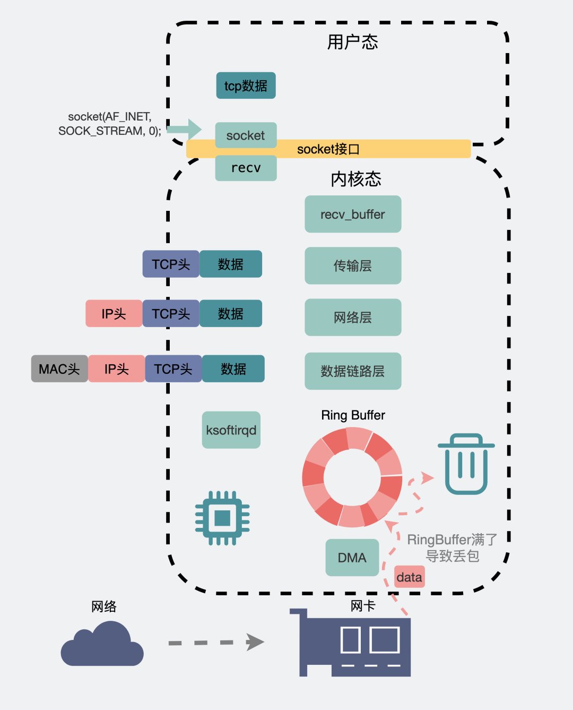
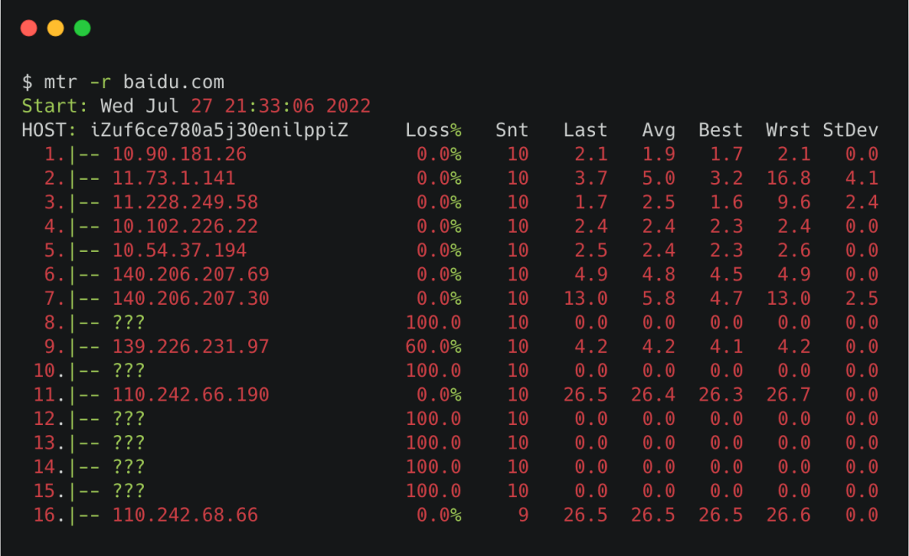
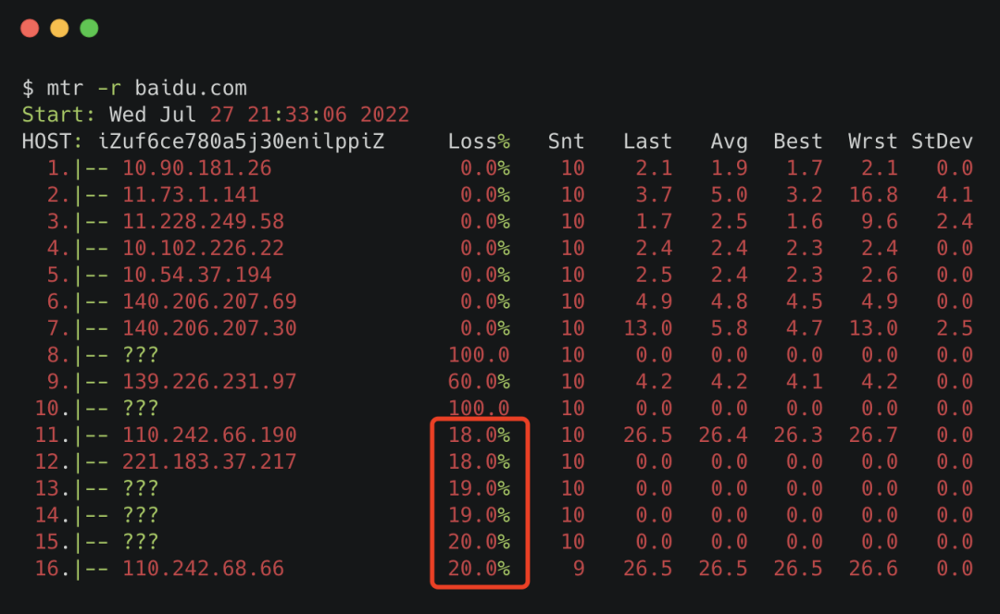

## 4.10

### 3.21 用了 TCP 协议，数据一定不会丢吗？

问大家一句：TCP 是一个可靠的传输协议，那它一定能保证数据不丢失吗？

这次，就跟大家探讨这个问题。

#### 1、数据包的发送流程

首先，我们两个手机的绿皮聊天软件客户端，要通信，中间会通过它们家服务器。大概长这样。

但为了**简化模型**，我们把中间的服务器给省略掉，假设这是个端到端的通信。且为了保证消息的可靠性，我们盲猜它们之间用的是**TCP协议**进行通信。

为了发送数据包，两端首先会通过**三次握手**，建立TCP连接。

一个数据包，从聊天框里发出，消息会从**聊天软件**所在的**用户空间**拷贝到**内核空间**的**发送缓冲区（send buffer）**，数据包就这样顺着**传输层、网络层，进入到数据链路层，在这里数据包会经过流控（qdisc），再通过RingBuffer发到物理层的网卡**。数据就这样顺着**网卡**发到了**纷繁复杂**的网络世界里。这里头数据会经过n多个**路由器和交换机**之间的跳转，最后到达**目的机器的网卡**处。

此时目的机器的网卡会通知**DMA**将数据包信息放到`RingBuffer`中，再触发一个**硬中断**给`CPU`，`CPU`触发**软中断**让`ksoftirqd`去`RingBuffer`收包，于是一个数据包就这样顺着**物理层，数据链路层，网络层，传输层**，最后从内核空间拷贝到用户空间里的**聊天软件**里。

到这里，抛开一些细节，大家大概知道了一个数据包从**发送到接收**的宏观过程。

可以看到，这上面全是密密麻麻的**名词**。

整条链路下来，有不少地方可能会发生丢包。

但为了不让大家**保持蹲姿太久**影响身体健康，我这边只重点讲下几个**常见容易发生丢包的场景**。

#### 2、建立连接时丢包

TCP协议会通过**三次握手**建立连接。大概长下面这样。


在服务端，第一次握手之后，会先建立个**半连接**，然后再发出第二次握手。这时候需要有个地方可以**暂存**这些半连接。这个地方就叫**半连接队列**。

如果之后第三次握手来了，半连接就会升级为全连接，然后暂存到另外一个叫**全连接队列**的地方，坐等程序执行`accept()`方法将其取走使用。


是队列就有长度，有长度就有可能会满，如果它们**满了**，那新来的包就会被**丢弃**。

可以通过下面的方式查看是否存在这种丢包行为。

```shell
# 全连接队列溢出次数
# netstat -s | grep overflowed
    4343 times the listen queue of a socket overflowed

# 半连接队列溢出次数
# netstat -s | grep -i "SYNs to LISTEN sockets dropped"
    109 times the listen queue of a socket overflowed 
```

从现象来看就是连接建立失败。

#### 3、流量控制丢包

应用层能发网络数据包的软件有那么多，如果所有数据不加控制一股脑冲入到网卡，网卡会吃不消，那怎么办？让数据按一定的规则排个队依次处理，也就是所谓的**qdisc**(**Q**ueueing **Disc**iplines，排队规则)，这也是我们常说的**流量控制**机制。

排队，得先有个队列，而队列有个**长度**。

我们可以通过下面的`ifconfig`命令查看到，里面涉及到的`txqueuelen`后面的数字`1000`，其实就是流控队列的长度。

当发送数据过快，流控队列长度`txqueuelen`又不够大时，就容易出现**丢包**现象。


可以通过下面的`ifconfig`命令，查看TX下的dropped字段，当它大于0时，则**有可能**是发生了流控丢包。

```shell
# ifconfig eth0
eth0: flags=4163<UP,BROADCAST,RUNNING,MULTICAST>  mtu 1500
        inet 172.21.66.69  netmask 255.255.240.0  broadcast 172.21.79.255
        inet6 fe80::216:3eff:fe25:269f  prefixlen 64  scopeid 0x20<link>
        ether 00:16:3e:25:26:9f  txqueuelen 1000  (Ethernet)
        RX packets 6962682  bytes 1119047079 (1.0 GiB)
        RX errors 0  dropped 0  overruns 0  frame 0
        TX packets 9688919  bytes 2072511384 (1.9 GiB)
        TX errors 0  dropped 0 overruns 0  carrier 0  collisions 0
```

当遇到这种情况时，我们可以尝试修改下流控队列的长度。比如像下面这样将eth0网卡的流控队列长度从1000提升为1500.

```shell
# ifconfig eth0 txqueuelen 1500
```

#### 4、网卡丢包

网卡和它的驱动导致丢包的场景也比较常见，原因很多，比如**网线质量差，接触不良**。除此之外，我们来聊几个常见的场景。

##### （1）RingBuffer过小导致丢包

上面提到，在接收数据时，会将数据暂存到`RingBuffer`接收缓冲区中，然后等着内核触发软中断慢慢收走。如果这个**缓冲区过小**，而这时候发送的数据又过快，就有可能发生溢出，此时也会产生**丢包**。



##### （2）网卡性能不足

网卡作为硬件，**传输速度是有上限的**。当网络传输速度过大，达到网卡上限时，就会发生丢包。这种情况一般常见于压测场景。

##### （3）接收缓冲区丢包

我们一般使用`TCP socket`进行网络编程的时候，内核都会分配一个**发送缓冲区**和一个**接收缓冲区**。

当我们想要发一个数据包，会在代码里执行`send(msg)`，这时候数据包并不是一把梭直接就走网卡飞出去的。而是将数据拷贝到内核**发送缓冲区**就完事**返回**了，至于**什么时候发数据，发多少数据**，这个后续由内核自己做决定。

#### 5、两端之间的网络丢包

前面提到的是两端机器内部的网络丢包，除此之外，两端之间那么长的一条链路都属于外部网络，这中间有各种路由器和交换机还有光缆啥的，丢包也是很经常发生的。

这些丢包行为发生在中间链路的某些个机器上，我们当然是没权限去登录这些机器。但我们可以通过一些命令观察整个链路的连通情况。

##### （1）**ping命令查看丢包**

比如我们知道目的地的域名是 `baidu.com`。想知道你的机器到baidu服务器之间，有没有产生丢包行为。可以使用ping命令。

倒数第二行里有个`100% packet loss`，意思是丢包率100%。

但这样其实你只能知道**你的机器和目的机器之间有没有丢包。**

**那如果你想知道你和目的机器之间的这条链路，哪个节点丢包了，有没有办法呢?**

有。

##### （2）**mtr命令**

mtr命令可以查看到你的机器和目的机器之间的每个节点的丢包情况。

像下面这样执行命令。



其中 -r 是指report，以报告的形式打印结果。

可以看到`Host`那一列，出现的都是链路中间每一跳的机器，`Loss`的那一列就是指这一跳对应的丢包率。

需要注意的是，中间有一些是host是`???`，那个是因为**mtr默认用的是ICMP包**，有些节点限制了**ICMP包**，导致不能正常展示。

我们可以在mtr命令里加个`-u`，也就是使用**udp包**，就能看到部分???对应的IP。


把**ICMP包和UDP包的结果**拼在一起看，就是**比较完整**的链路图了。

还有个小细节，`Loss`那一列，我们在icmp的场景下，关注**最后一行**，如果是0%，那不管前面loss是100%还是80%都无所谓，那些都是**节点限制**导致的**虚报**。

但如果**最后一行是20%，再往前几行都是20%左右**，那说明丢包就是从最接近的那一行开始产生的，长时间是这样，那很可能这一跳出了点问题。如果是公司内网的话，你可以带着这条线索去找对应的网络同事。如果是外网的话，那耐心点等等吧，别人家的开发会比你更着急。



#### 6、发生丢包了怎么办

说了这么多。只是想告诉大家，**丢包是很常见的，几乎不可避免的一件事情**。

但问题来了，发生丢包了怎么办？

这个好办，用**TCP协议**去做传输。


建立了TCP连接的两端，发送端在发出数据后会等待接收端回复`ack包`，`ack包`的目的是为了告诉对方自己确实收到了数据，但如果中间链路发生了丢包，那发送端会迟迟收不到确认ack，于是就会进行**重传**。以此来保证每个数据包都确确实实到达了接收端。

假设现在网断了，我们还用聊天软件发消息，聊天软件会使用TCP不断尝试重传数据，**如果重传期间网络恢复了**，那数据就能正常发过去。但如果多次重试直到超时都还是失败，这时候你将收获一个**红色感叹号**。

这时候问题又来了。

假设**某绿皮聊天软件用的就是TCP协议。**

在聊天的时候， 发生丢包了，丢包了会**重试**，重试失败了还会出现**红色感叹号。**

于是乎，问题就变成了，**用了 TCP 协议，就一定不会丢包吗？**

#### 7、用了TCP协议就一定不会丢包吗

我们知道TCP位于**传输层**，在它的上面还有各种**应用层协议**，比如常见的HTTP或者各类RPC协议。


TCP保证的可靠性，是**传输层的可靠性**。也就是说，**TCP只保证数据从A机器的传输层可靠地发到B机器的传输层。**

至于数据到了接收端的传输层之后，能不能保证到应用层，TCP并不管。

假设现在，我们输入一条消息，从聊天框发出，走到**传输层TCP协议的发送缓冲区**，不管中间有没有丢包，最后通过重传都保证发到了对方的**传输层TCP接收缓冲区**，此时接收端回复了一个`ack`，发送端收到这个`ack`后就会将自己**发送缓冲区**里的消息给扔掉。到这里TCP的任务就结束了。

TCP任务是结束了，但聊天软件的任务没结束。

**聊天软件还需要将数据从TCP的接收缓冲区里读出来，如果在读出来这一刻，手机由于内存不足或其他各种原因，导致软件崩溃闪退了。**

发送端以为自己发的消息已经发给对方了，但接收端却并没有收到这条消息。

于是乎，**消息就丢了。**

可以看出，**TCP只保证传输层的消息可靠性，并不保证应用层的消息可靠性。如果我们还想保证应用层的消息可靠性，就需要应用层自己去实现逻辑做保证。**