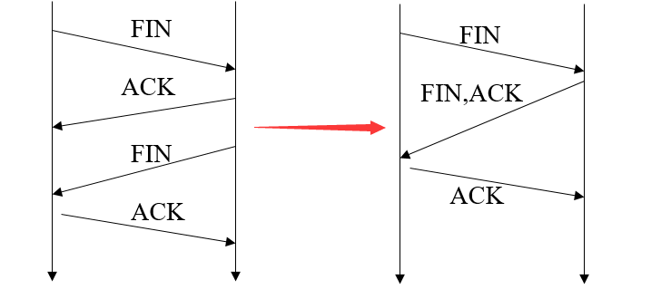
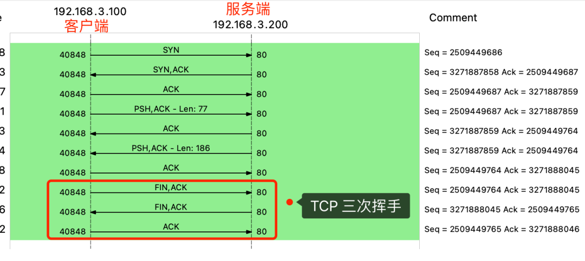
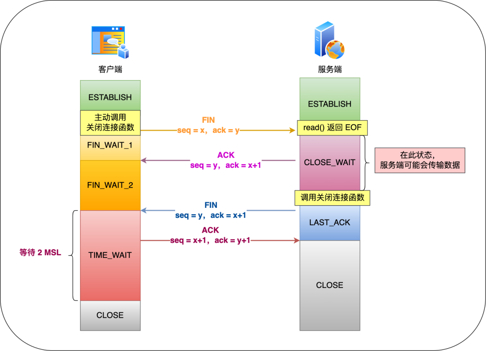
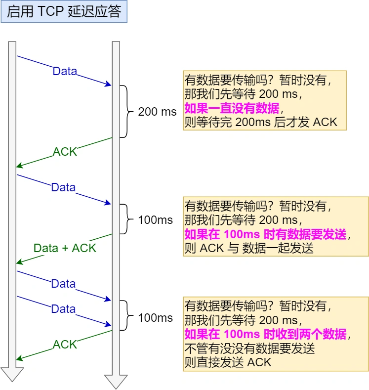
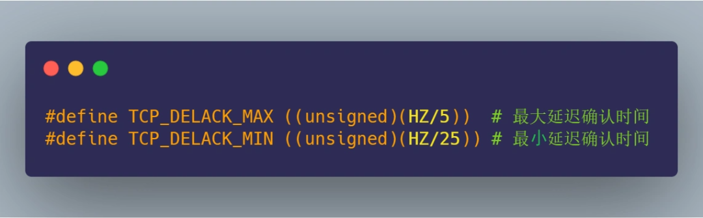
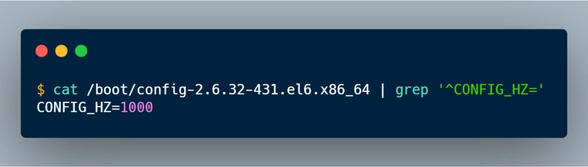

## 4.15

### 3.22 TCP 四次挥手，可以变成三次吗？

有位读者面美团时，被问到：**TCP 四次挥手中，能不能把第二次的 ACK 报文， 放到第三次 FIN 报文一起发送？**

虽然我们在学习 TCP 挥手时，学到的是需要四次来完成 TCP 挥手，但是**在一些情况下， TCP 四次挥手是可以变成 TCP 三次挥手的**。

而且在用 wireshark 工具抓包的时候，我们也会常看到 TCP 挥手过程是三次，而不是四次，如下图：

先来回答为什么 RFC 文档里定义 TCP 挥手过程是要四次？

再来回答什么情况下，什么情况会出现三次挥手？

#### 1、TCP 四次挥手

TCP 四次挥手的过程如下：

具体过程：

- 客户端主动调用关闭连接的函数，于是就会发送 FIN 报文，这个 FIN 报文代表客户端不会再发送数据了，进入 FIN_WAIT_1 状态；
- 服务端收到了 FIN 报文，然后马上回复一个 ACK 确认报文，此时服务端进入 CLOSE_WAIT 状态。在收到 FIN 报文的时候，TCP 协议栈会为 FIN 包插入一个文件结束符 EOF 到接收缓冲区中，服务端应用程序可以通过 read 调用来感知这个 FIN 包，这个 EOF 会被**放在已排队等候的其他已接收的数据之后**，所以必须要得继续 read 接收缓冲区已接收的数据；
- 接着，当服务端在 read 数据的时候，最后自然就会读到 EOF，接着 **read() 就会返回 0，这时服务端应用程序如果有数据要发送的话，就发完数据后才调用关闭连接的函数，如果服务端应用程序没有数据要发送的话，可以直接调用关闭连接的函数**，这时服务端就会发一个 FIN 包，这个 FIN 报文代表服务端不会再发送数据了，之后处于 LAST_ACK 状态；
- 客户端接收到服务端的 FIN 包，并发送 ACK 确认包给服务端，此时客户端将进入 TIME_WAIT 状态；
- 服务端收到 ACK 确认包后，就进入了最后的 CLOSE 状态；
- 客户端经过 2MSL 时间之后，也进入 CLOSE 状态；

你可以看到，每个方向都需要**一个 FIN 和一个 ACK**，因此通常被称为**四次挥手**。

#### 2、为什么 TCP 挥手需要四次呢？

服务器收到客户端的 FIN 报文时，内核会马上回一个 ACK 应答报文，**但是服务端应用程序可能还有数据要发送，所以并不能马上发送 FIN 报文，而是将发送 FIN 报文的控制权交给服务端应用程序**：

- 如果服务端应用程序有数据要发送的话，就发完数据后，才调用关闭连接的函数；
- 如果服务端应用程序没有数据要发送的话，可以直接调用关闭连接的函数，

从上面过程可知，**是否要发送第三次挥手的控制权不在内核，而是在被动关闭方（上图的服务端）的应用程序，因为应用程序可能还有数据要发送，由应用程序决定什么时候调用关闭连接的函数，当调用了关闭连接的函数，内核就会发送 FIN 报文了，**所以服务端的 ACK 和 FIN 一般都会分开发送。

> FIN 报文一定得调用关闭连接的函数，才会发送吗？

不一定。

如果进程退出了，不管是不是正常退出，还是异常退出（如进程崩溃），内核都会发送 FIN 报文，与对方完成四次挥手。

#### 3、粗暴关闭 vs 优雅关闭

前面介绍 TCP 四次挥手的时候，并没有详细介绍关闭连接的函数，其实关闭的连接的函数有两种函数：

- close 函数，同时 socket 关闭发送方向和读取方向，**也就是 socket 不再有发送和接收数据的能力**。如果有多进程/多线程共享同一个 socket，如果有一个进程调用了 close 关闭只是让 socket 引用计数 -1，并不会导致 socket 不可用，同时也不会发出 FIN 报文，其他进程还是可以正常读写该 socket，直到引用计数变为 0，才会发出 FIN 报文。
- shutdown 函数，可以指定 socket 只关闭发送方向而不关闭读取方向，**也就是 socket 不再有发送数据的能力，但是还是具有接收数据的能力**。如果有多进程/多线程共享同一个 socket，shutdown 则不管引用计数，直接使得该 socket 不可用，然后发出 FIN 报文，如果有别的进程企图使用该 socket，将会受到影响。

如果客户端是用 close 函数来关闭连接，那么在 TCP 四次挥手过程中，如果收到了服务端发送的数据，由于客户端已经不再具有发送和接收数据的能力，所以客户端的内核会回 RST 报文给服务端，然后内核会释放连接，这时就不会经历完成的 TCP 四次挥手，所以我们常说，调用 close 是粗暴的关闭。

当服务端收到 RST 后，内核就会释放连接，当服务端应用程序再次发起读操作或者写操作时，就能感知到连接已经被释放了：

- 如果是读操作，则会返回 RST 的报错，也就是我们常见的 Connection reset by peer。
- 如果是写操作，那么程序会产生 SIGPIPE 信号，应用层代码可以捕获并处理信号，如果不处理，则默认情况下进程会终止，异常退出。

相对的，shutdown 函数因为可以指定只关闭发送方向而不关闭读取方向，所以即使在 TCP 四次挥手过程中，如果收到了服务端发送的数据，客户端也是可以正常读取到该数据的，然后就会经历完整的 TCP 四次挥手，所以我们常说，调用 shutdown 是优雅的关闭。

但是注意，shutdown 函数也可以指定「只关闭读取方向，而不关闭发送方向」，但是这时候内核是不会发送 FIN 报文的，因为发送 FIN 报文是意味着我方将不再发送任何数据，而 shutdown 如果指定「不关闭发送方向」，就意味着 socket 还有发送数据的能力，所以内核就不会发送 FIN。

#### 4、什么情况会出现三次挥手？

当被动关闭方（上图的服务端）在 TCP 挥手过程中，「**没有数据要发送」并且「开启了 TCP 延迟确认机制」，那么第二和第三次挥手就会合并传输，这样就出现了三次挥手。**

然后因为 TCP 延迟确认机制是默认开启的，所以导致我们抓包时，看见三次挥手的次数比四次挥手还多。

> 什么是 TCP 延迟确认机制？

当发送没有携带数据的 ACK，它的网络效率也是很低的，因为它也有 40 个字节的 IP 头 和 TCP 头，但却没有携带数据报文。 为了解决 ACK 传输效率低问题，所以就衍生出了 **TCP 延迟确认**。 TCP 延迟确认的策略：

- 当有响应数据要发送时，ACK 会随着响应数据一起立刻发送给对方
- 当没有响应数据要发送时，ACK 将会延迟一段时间，以等待是否有响应数据可以一起发送
- 如果在延迟等待发送 ACK 期间，对方的第二个数据报文又到达了，这时就会立刻发送 ACK

延迟等待的时间是在 Linux 内核中定义的，如下图：

关键就需要 HZ 这个数值大小，HZ 是跟系统的时钟频率有关，每个操作系统都不一样，在我的 Linux 系统中 HZ 大小是 1000，如下图：

知道了 HZ 的大小，那么就可以算出：

- 最大延迟确认时间是 200 ms（1000/5）
- 最短延迟确认时间是 40 ms（1000/25）

## 总结

当被动关闭方在 TCP 挥手过程中，如果「没有数据要发送」，同时「没有开启 TCP_QUICKACK（默认情况就是没有开启，没有开启 TCP_QUICKACK，等于就是在使用 TCP 延迟确认机制）」，那么第二和第三次挥手就会合并传输，这样就出现了三次挥手。

**所以，出现三次挥手现象，是因为 TCP 延迟确认机制导致的。**