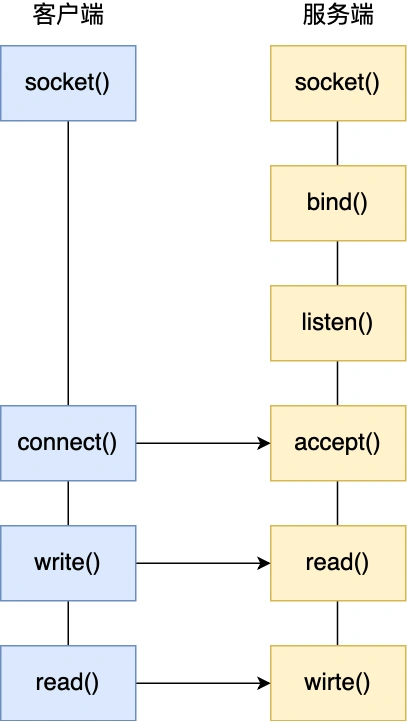
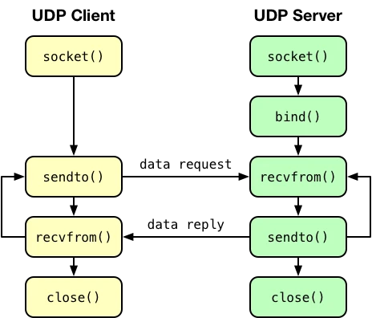
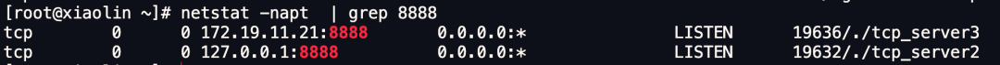
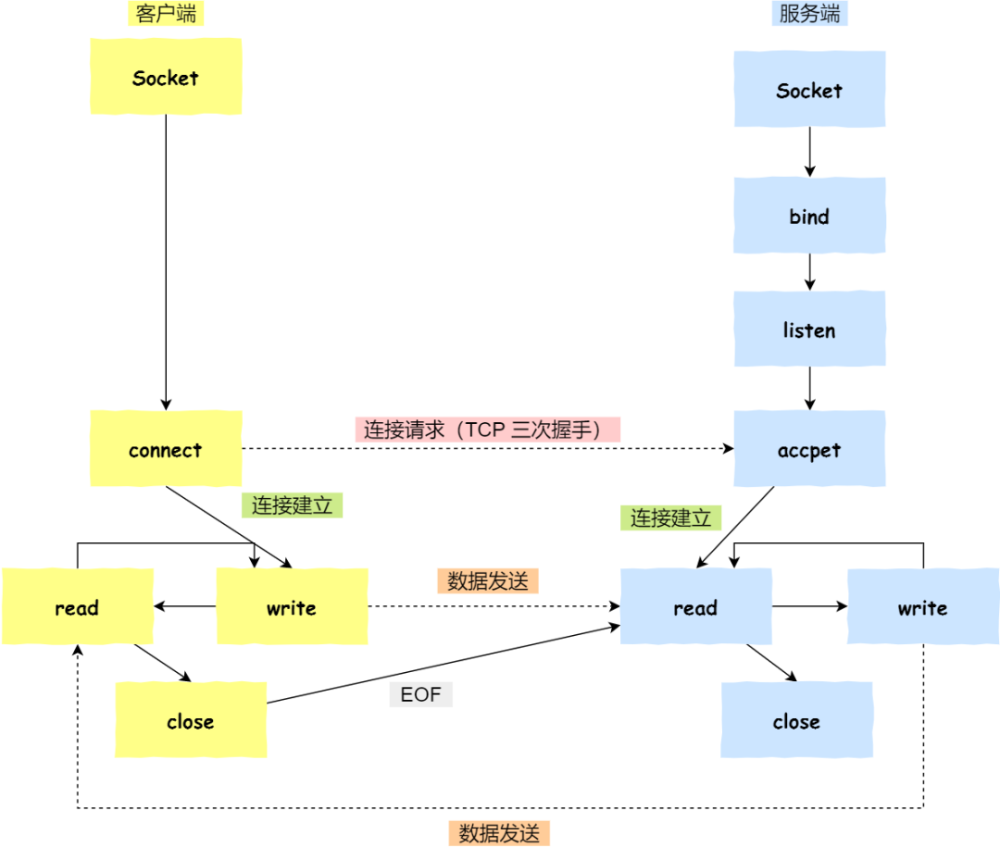
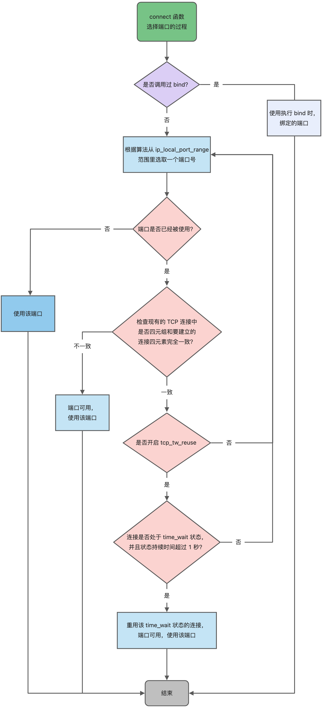

## 4.7

### 3.18 TCP 和 UDP 可以使用同一个端口吗？

之前有读者在字节面试的时候，被问到：**TCP 和 UDP 可以同时监听相同的端口吗？**

关于端口的知识点，还是挺多可以讲的，比如还可以牵扯到这几个问题：

- 多个 TCP 服务进程可以同时绑定同一个端口吗？
- 重启 TCP 服务进程时，为什么会出现“Address in use”的报错信息？又该怎么避免？
- 客户端的端口可以重复使用吗？
- 客户端 TCP 连接 TIME_WAIT 状态过多，会导致端口资源耗尽而无法建立新的连接吗？

所以，这次就跟大家盘一盘这些问题。

#### 1、TCP 和 UDP 可以同时绑定相同的端口吗？

其实我感觉这个问题「TCP 和 UDP 可以同时监听相同的端口吗？」表述有问题，这个问题应该表述成「**TCP 和 UDP 可以同时绑定相同的端口吗？**」

因为「监听」这个动作是在 TCP 服务端网络编程中才具有的，而 UDP 服务端网络编程中是没有「监听」这个动作的。

TCP 和 UDP 服务端网络相似的一个地方，就是会调用 bind 绑定端口。

给大家贴一下 TCP 和 UDP 网络编程的区别就知道了。

TCP 网络编程如下，服务端执行 listen() 系统调用就是监听端口的动作。

UDP 网络编程如下，服务端是没有监听这个动作的，只有执行 bind() 系统调用来绑定端口的动作。



**TCP 和 UDP 可以同时绑定相同的端口吗？**

答案：**可以的**。

在数据链路层中，通过 MAC 地址来寻找局域网中的主机。在网际层中，通过 IP 地址来寻找网络中互连的主机或路由器。在传输层中，需要通过端口进行寻址，来识别同一计算机中同时通信的不同应用程序。

所以，传输层的「端口号」的作用，是为了区分同一个主机上不同应用程序的数据包。

传输层有两个传输协议分别是 TCP 和 UDP，在内核中是两个完全独立的软件模块。

当主机收到数据包后，可以在 IP 包头的「协议号」字段知道该数据包是 TCP/UDP，所以可以根据这个信息确定送给哪个模块（TCP/UDP）处理，送给 TCP/UDP 模块的报文根据「端口号」确定送给哪个应用程序处理。

因此， TCP/UDP 各自的端口号也相互独立，如 TCP 有一个 80 号端口，UDP 也可以有一个 80 号端口，二者并不冲突。

#### 2、 多个 TCP 服务进程可以绑定同一个端口吗？

还是以前面的 TCP 服务端程序作为例子，启动两个同时绑定同一个端口的 TCP 服务进程。

运行第一个 TCP 服务进程之后，netstat 命令可以查看，8888 端口已经被一个 TCP 服务进程绑定并监听了，如下图：


接着，运行第二个 TCP 服务进程的时候，就报错了“Address already in use”，如下图：


我上面的测试案例是两个 TCP 服务进程同时绑定地址和端口是：0.0.0.0 地址和8888端口，所以才出现的错误。

如果两个 TCP 服务进程绑定的 IP 地址不同，而端口相同的话，也是可以绑定成功的，如下图：



所以，默认情况下，针对「多个 TCP 服务进程可以绑定同一个端口吗？」这个问题的答案是：**如果两个 TCP 服务进程同时绑定的 IP 地址和端口都相同，那么执行 bind() 时候就会出错，错误是“Address already in use”**。

#### 3、客户端的端口可以重复使用吗？

客户端在执行 connect 函数的时候，会在内核里随机选择一个端口，然后向服务端发起 SYN 报文，然后与服务端进行三次握手。

所以，客户端的端口选择的发生在 connect 函数，内核在选择端口的时候，会从 `net.ipv4.ip_local_port_range` 这个内核参数指定的范围来选取一个端口作为客户端端口。

该参数的默认值是 32768 61000，意味着端口总可用的数量是 61000 - 32768 = 28232 个。

当客户端与服务端完成 TCP 连接建立后，我们可以通过 netstat 命令查看 TCP 连接。

```bash
$ netstat -napt
协议  源ip地址:端口            目的ip地址：端口         状态
tcp  192.168.110.182.64992   117.147.199.51.443     ESTABLISHED
```

**那问题来了，上面客户端已经用了 64992 端口，那么还可以继续使用该端口发起连接吗？**

这个问题，很多同学都会说不可以继续使用该端口了，如果按这个理解的话， 默认情况下客户端可以选择的端口是 28232 个，那么意味着客户端只能最多建立 28232 个 TCP 连接，如果真是这样的话，那么这个客户端并发连接也太少了吧，所以这是错误理解。

正确的理解是，**TCP 连接是由四元组（源IP地址，源端口，目的IP地址，目的端口）唯一确认的，那么只要四元组中其中一个元素发生了变化，那么就表示不同的 TCP 连接的。所以如果客户端已使用端口 64992 与服务端 A 建立了连接，那么客户端要与服务端 B 建立连接，还是可以使用端口 64992 的，因为内核是通过四元祖信息来定位一个 TCP 连接的，并不会因为客户端的端口号相同，而导致连接冲突的问题。**


**客户端 TCP 连接 TIME_WAIT 状态过多，会导致端口资源耗尽而无法建立新的连接吗？**

针对这个问题要看，客户端是否都是与同一个服务器（目标地址和目标端口一样）建立连接。

如果客户端都是与同一个服务器（目标地址和目标端口一样）建立连接，那么如果客户端 TIME_WAIT 状态的连接过多，当端口资源被耗尽，就无法与这个服务器再建立连接了。

但是，**因为只要客户端连接的服务器不同，端口资源可以重复使用的**。

所以，如果客户端都是与不同的服务器建立连接，即使客户端端口资源只有几万个， 客户端发起百万级连接也是没问题的（当然这个过程还会受限于其他资源，比如文件描述符、内存、CPU 等）。


**客户端端口选择的流程总结**

至此，我们已经把客户端在执行 connect 函数时，内核选择端口的情况大致说了一遍，为了让大家更明白客户端端口的选择过程，我画了一流程图。