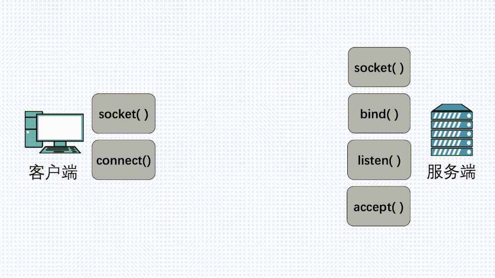
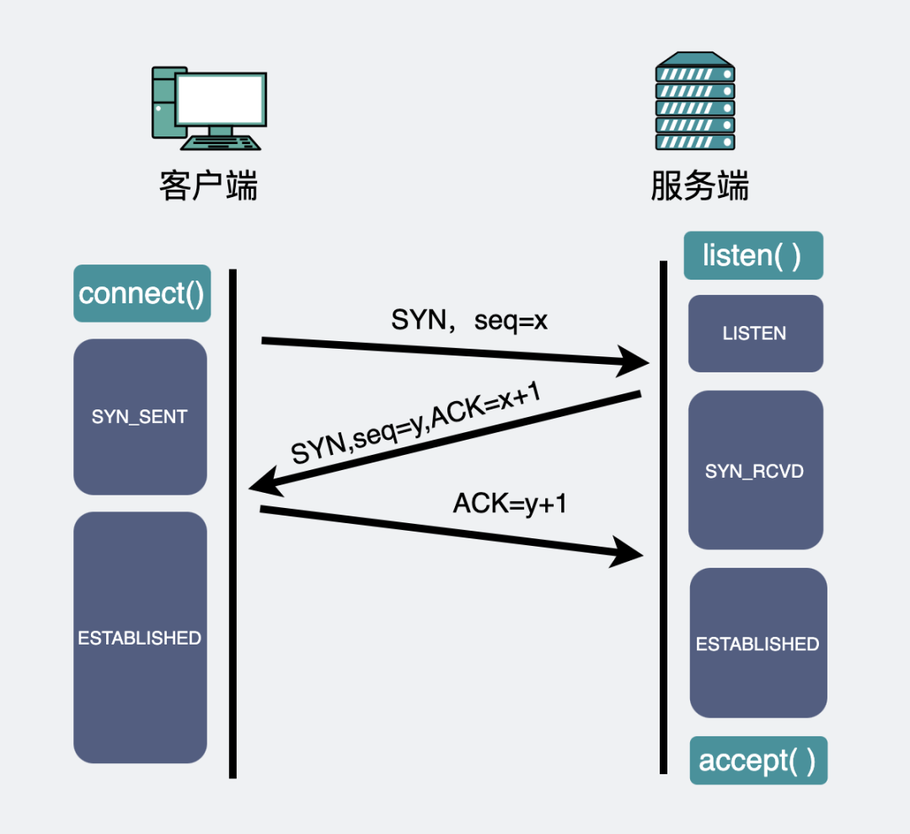

## 4.9

### 3.20 没有 accept，能建立 TCP 连接吗？

这次，我们来讨论一下，**没有 accept，能建立 TCP 连接吗？**

下面这个动图，是我们平时客户端和服务端建立连接时的代码流程。



对应的是下面一段简化过的服务端伪代码。

```c
int main()
{
    /*Step 1: 创建服务器端监听socket描述符listen_fd*/    
    listen_fd = socket(AF_INET, SOCK_STREAM, 0);

    /*Step 2: bind绑定服务器端的IP和端口，所有客户端都向这个IP和端口发送和请求数据*/    
    bind(listen_fd, xxx);

    /*Step 3: 服务端开启监听*/    
    listen(listen_fd, 128);

    /*Step 4: 服务器等待客户端的链接，返回值cfd为客户端的socket描述符*/    
    cfd = accept(listen_fd, xxx);

      /*Step 5: 读取客户端发来的数据*/
      n = read(cfd, buf, sizeof(buf));
}
```

#### 1、三次握手的细节分析

服务端代码，对socket执行bind方法可以绑定监听端口，然后执行`listen方法`后，就会进入监听（`LISTEN`)状态。内核会为每一个处于`LISTEN`状态的`socket` 分配两个队列，分别叫**半连接队列和全连接队列**。


##### （1）半连接队列、全连接队列是什么


- **半连接队列（SYN队列）**，服务端收到**第一次握手**后，会将`sock`加入到这个队列中，队列内的`sock`都处于`SYN_RECV` 状态。
- **全连接队列（ACCEPT队列）**，在服务端收到**第三次握手**后，会将半连接队列的`sock`取出，放到全连接队列中。队列里的`sock`都处于 `ESTABLISHED`状态。这里面的连接，就**等着服务端执行accept()后被取出了。**

看到这里，文章开头的问题就有了答案，建立连接的过程中根本不需要`accept()`参与， **执行accept()只是为了从全连接队列里取出一条连接。**

我们把话题再重新回到这两个队列上。

虽然都叫**队列**，但其实**全连接队列（icsk_accept_queue）是个链表**，而**半连接队列（syn_table）是个哈希表**。

##### 

##### （2)为什么半连接队列要设计成哈希表

先对比下**全连接队列**，他本质是个链表，因为也是线性结构，说它是个队列也没毛病。它里面放的都是已经建立完成的连接，这些连接正等待被取走。而服务端取走连接的过程中，并不关心具体是哪个连接，只要是个连接就行，所以直接从队列头取就行了。这个过程算法复杂度为`O(1)`。

而**半连接队列**却不太一样，因为队列里的都是不完整的连接，嗷嗷等待着第三次握手的到来。那么现在有一个第三次握手来了，则需要从队列里把相应IP端口的连接取出，**如果半连接队列还是个链表，那我们就需要依次遍历，才能拿到我们想要的那个连接，算法复杂度就是O(n)。**

而如果将半连接队列设计成哈希表，那么查找半连接的算法复杂度就回到`O(1)`了。

因此出于效率考虑，全连接队列被设计成链表，而半连接队列被设计为哈希表。

##### （3）怎么观察两个队列的大小

**查看全连接队列**

```shell
# ss -lnt
State      Recv-Q Send-Q     Local Address:Port           Peer Address:Port
LISTEN     0      128        127.0.0.1:46269              *:*              
```

通过`ss -lnt`命令，可以看到全连接队列的大小，其中`Send-Q`是指全连接队列的最大值，可以看到我这上面的最大值是`128`；`Recv-Q`是指当前的全连接队列的使用值，我这边用了`0`个，也就是全连接队列里为空，连接都被取出来了。

当上面`Send-Q`和`Recv-Q`数值很接近的时候，那么全连接队列可能已经满了。可以通过下面的命令查看是否发生过队列**溢出**。

```shell
# netstat -s | grep overflowed
    4343 times the listen queue of a socket overflowed
```

##### （4）全连接队列满了会怎么样？

如果队列满了，服务端还收到客户端的第三次握手ACK，默认当然会丢弃这个ACK。

但除了丢弃之外，还有一些附带行为，这会受 `tcp_abort_on_overflow` 参数的影响。

```shell
# cat /proc/sys/net/ipv4/tcp_abort_on_overflow
0
```

- `tcp_abort_on_overflow`设置为 0，全连接队列满了之后，会丢弃这个第三次握手ACK包，并且开启定时器，重传第二次握手的SYN+ACK，如果重传超过一定限制次数，还会把对应的**半连接队列里的连接**给删掉。


- `tcp_abort_on_overflow`设置为 1，全连接队列满了之后，就直接发RST给客户端，效果上看就是连接断了。

这个现象是不是很熟悉，服务端**端口未监听**时，客户端尝试去连接，服务端也会回一个RST。这两个情况长一样，所以客户端这时候收到RST之后，其实无法区分到底是**端口未监听**，还是**全连接队列满了**。


##### （5）半连接队列要是满了会怎么样

**一般是丢弃**，但这个行为可以通过 `tcp_syncookies` 参数去控制。但比起这个，更重要的是先了解下半连接队列为什么会被打满。

首先我们需要明白，一般情况下，半连接的"生存"时间其实很短，只有在第一次和第三次握手间，如果半连接都满了，说明服务端疯狂收到第一次握手请求，如果是线上游戏应用，能有这么多请求进来，那说明你可能要富了。但现实往往比较骨感，你可能遇到了**SYN Flood攻击**。

所谓**SYN Flood攻击**，可以简单理解为，攻击方模拟客户端疯狂发第一次握手请求过来，在服务端憨憨地回复第二次握手过去之后，客户端死活不发第三次握手过来，这样做，可以把服务端半连接队列打满，从而导致正常连接不能正常进来。

那这种情况怎么处理？有没有一种方法可以**绕过半连接队列**？

有，上面提到的`tcp_syncookies`派上用场了。

```shell
# cat /proc/sys/net/ipv4/tcp_syncookies
1
```

当它被设置为1的时候，客户端发来**第一次握手**SYN时，服务端**不会将其放入半连接队列中**，而是直接生成一个`cookies`，这个`cookies`会跟着**第二次握手**，发回客户端。客户端在发**第三次握手**的时候带上这个`cookies`，服务端验证到它就是当初发出去的那个，就会建立连接并放入到全连接队列中。可以看出整个过程不再需要半连接队列的参与。


#### 2、总结

- **每一个**`socket`执行`listen`时，内核都会自动创建一个半连接队列和全连接队列。
- 第三次握手前，TCP连接会放在半连接队列中，直到第三次握手到来，才会被放到全连接队列中。
- `accept方法`只是为了从全连接队列中拿出一条连接，本身跟三次握手几乎**毫无关系**。
- 出于效率考虑，虽然都叫队列，但半连接队列其实被设计成了**哈希表**，而全连接队列本质是链表。
- 全连接队列满了，再来第三次握手也会丢弃，此时如果`tcp_abort_on_overflow=1`，还会直接发`RST`给客户端。
- 半连接队列满了，可能是因为受到了`SYN Flood`攻击，可以设置`tcp_syncookies`，绕开半连接队列。
- 客户端没有半连接队列和全连接队列，但有一个**全局hash**，可以通过它实现自连接或TCP同时打开。